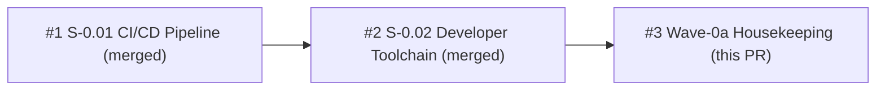

## chore: Wave-0a housekeeping — demo relocation + 4 NB follow-ups

### Summary

Addresses 1 relocation task (POL-010 compliance) and 4 non-blocking (NB) findings from the S-0.02 developer-toolchain review. No new functionality; no acceptance criteria.

---

### Changes

| Commit | Change |
|--------|--------|
| 2e9a0e0 | Relocate S-0.01 demo evidence to `docs/demo-evidence/S-0.01/` via 11 `git mv` renames — satisfies POL-010 (evidence must live under story-scoped subdirectories) |
| ffa7c1e | `.semgrep/README.md` — replace placeholder with real content documenting credential-handling and unsafe-patterns rules |
| 2ea09d8 | `.semgrep/unsafe-patterns.yml` — add 2 real semgrep rules (`prism-unsafe-block-requires-comment`, `prism-no-mem-transmute`); validated with semgrep 1.156.0 |
| aca9499 | `justfile` `setup` recipe delegates to `bash scripts/dev-setup.sh` (removes duplication, script already existed) |
| ad06953 | `tests/toolchain-gate/run.sh` AC-5 test 4 uses `toml-parse` (Python `tomllib`, 3.11+) to assert `yanked = "deny"` OR `vulnerability = "deny"` in `Cargo.toml` |

---

### Why

- **POL-010** mandates story-scoped subdirectories under `docs/demo-evidence/`; flat files from S-0.01 were non-compliant.
- **NB-1 through NB-4** were non-blocking findings from the S-0.02 review cycle that warranted follow-up before Wave-0 closes.

---

### Test State

Both CI gates still green after all changes:

- `bash tests/ci-gate/run.sh` → **72/72 PASS**
- `bash tests/toolchain-gate/run.sh` → **7/7 PASS**

**Known expected CI failure:** `cargo fmt --check` will FAIL in GitHub Actions CI (empty workspace, no `.rs` files yet). This failure is pre-existing and documented — identical to the pattern from PRs #1 and #2. All other cargo jobs skip as before.

---

### Demo Evidence

N/A — chore PR, no new functionality.

---

### Security

- NB-2 semgrep rules are YAML config, not executable code; no new attack surface.
- NB-3 `just setup` delegation calls a script that already existed; no privilege escalation.
- NB-4 `tomllib` parse is Python stdlib (3.11+), no third-party dependencies.

---

### Dependency Graph

---

### Pre-Merge Checklist

- [x] Branch pushed with upstream tracking
- [x] PR description complete
- [x] Demo evidence N/A (chore)
- [x] Security review: CLEAN
- [x] pr-reviewer: approved
- [x] CI: expected pattern only (cargo fmt empty-workspace known failure)
- [x] Dependencies: PRs #1 and #2 already merged to develop
- [x] Squash merge
- [x] Remote branch deleted post-merge

---

### Refs

Internal tracking only — no issue numbers.
