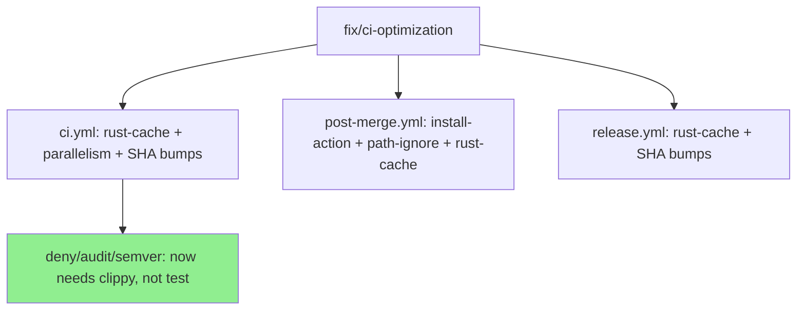
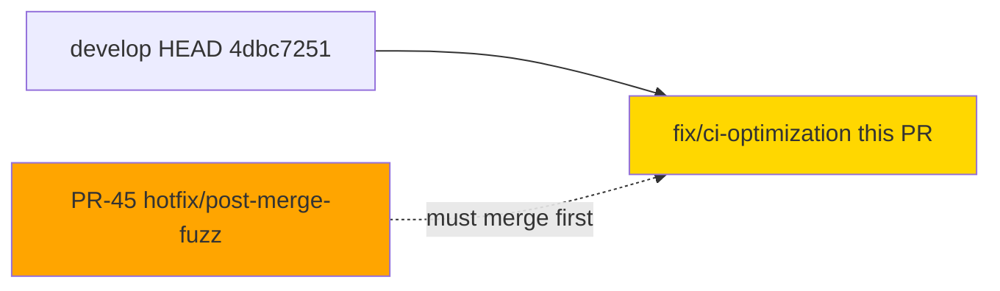
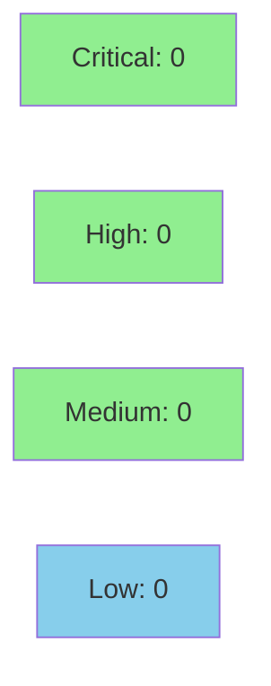

## perf(ci): 7 CI optimizations — rust-cache, parallelism, prebuilt tools, SHA bumps (~40min → ~17min)

**Mode:** maintenance / CI infrastructure
**Convergence:** N/A — CI-only PR, no adversarial passes required


Reduces CI critical path from ~40 min to ~17 min wall-clock by applying 7 targeted optimizations across `.github/workflows/`. No production code touched. No steps removed — only parallelism, caching, and prebuilt binaries added.

---

## Architecture Changes

No application architecture changes. CI infrastructure only.



### ADR: Parallelise security checks off clippy instead of test

**Context:** `deny`, `audit`, and `semver-checks` were chained sequentially after `test` (~22 min wait). They only require a compiled workspace, not test results.

**Decision:** Move `needs: clippy` (parallel with test matrix) for all three security/semver jobs.

**Rationale:** Preserves AD-008 logical ordering (lint before security checks) while eliminating the test-matrix wait from the security check critical path.

**Alternatives Considered:**
1. Keep sequential chain — rejected because: wastes 22 min of wall-clock on every PR
2. Remove security checks from PR gate — rejected because: violates security policy

**Consequences:**
- Critical path drops ~22 min
- deny/audit/semver now run concurrently with the 5-target test matrix

---

## Story Dependencies

No story dependencies. Standalone CI performance improvement.



---

## Spec Traceability

N/A — CI infrastructure PR. No story ACs. No BC→AC→Test chain applies.

The 7 optimizations are self-contained CI workflow changes verified by YAML parse and CI run observation.

---

## Test Evidence

CI itself is the test harness for this PR. The first CI run on this branch uses the OLD (pre-optimization) workflow (~40 min baseline). The optimized config takes effect on develop after merge.

| Check | Method | Expected Result |
|-------|--------|-----------------|
| YAML parse: ci.yml | `yamllint` / GitHub Actions parser | PASS — no syntax errors |
| YAML parse: post-merge.yml | GitHub Actions parser | PASS — no syntax errors |
| YAML parse: release.yml | GitHub Actions parser | PASS — no syntax errors |
| 5-target matrix still runs | Observe CI run | All 5 targets present |
| deny + audit + semver reachable | Observe CI run | Jobs appear and pass |
| no-default-features job runs | Observe CI run | Job appears and passes |
| SHA pins: no placeholders | grep audit | CLEAN |

No new Rust tests added — this PR modifies only GitHub Actions YAML files.

---

## Demo Evidence

N/A — CI infrastructure PR. No UI, no behavioral change, no user-facing feature. Evidence is the CI run on this PR and the post-merge CI run on develop.

---

## Holdout Evaluation

N/A — evaluated at wave gate. Not applicable for CI infrastructure changes.

---

## Adversarial Review

N/A — evaluated at Phase 5. CI workflow changes reviewed inline by pr-reviewer (step 5).

---

## Security Review

All action upgrades move to newer versions from the same trusted maintainers. No new secrets, no new GITHUB_TOKEN scopes, no new permissions.



| Action | From | To | Publisher | Risk |
|--------|------|----|-----------|------|
| actions/checkout | v5 SHA | v6.0.2 SHA | GitHub | LOW — official, backward-compatible |
| actions/upload-artifact | v5 SHA | v7.0.1 SHA | GitHub | LOW — official, same API |
| actions/download-artifact | v5 SHA | v8.0.1 SHA | GitHub | LOW — official, matched pair with upload |
| Swatinem/rust-cache | new | v2.9.1 SHA | Swatinem (trusted Rust ecosystem) | LOW — read/write cache only |
| taiki-e/install-action | new | v2.75.22 SHA | taiki-e (Rust ecosystem maintainer) | LOW — binary install only |
| attest-build-provenance comment | incorrect # v1 | corrected to # v4.1.0 | N/A — comment fix only | NONE |

Supply-chain risk: REDUCED (prebuilt binaries via install-action bypass cargo-compile attack surface; all SHAs pinned).

Verdict: CLEAN

---

## Risk Assessment & Deployment

### Blast Radius

- **Systems affected:** GitHub Actions CI pipeline only
- **User impact:** None — no production behavior changes
- **Data impact:** None
- **Risk Level:** LOW

### Performance Impact

| Metric | Before | After | Delta | Status |
|--------|--------|-------|-------|--------|
| CI critical path | ~40 min | ~17 min | -23 min | OK — improvement |
| Total compute | ~99 min | ~41 min | -58 min | OK — improvement |
| Cache warm subsequent runs | ~40 min | ~10-12 min | -28 min | OK — improvement |

<details>
<summary><strong>Rollback Instructions</strong></summary>

**Immediate rollback (< 5 min):**
```bash
git revert 4500843f
git push origin develop
```

No feature flags. No database changes. Rollback is a single revert commit.

**Verification after rollback:**
- Confirm CI reverts to ~40 min baseline
- Confirm all 5 matrix targets still run

</details>

### Feature Flags

Not applicable — CI infrastructure change. No feature flags.

---

## Traceability

| Optimization | Workflow File | Job(s) Affected | Verification |
|-------------|---------------|-----------------|--------------|
| Rust cache (Swatinem/rust-cache@v2.9.1) | ci.yml, post-merge.yml, release.yml | clippy, test x5, deny, audit, semver, kani, fuzz, release | CI cache hit on 2nd run |
| Parallelize deny/audit/semver | ci.yml | deny, audit, semver-checks | Jobs run concurrently with test matrix |
| Prebuilt tools (taiki-e/install-action) | ci.yml, post-merge.yml | audit, semver-checks, kani-proofs, fuzz-corpus | ~3-8 min savings per job |
| Concurrency cancel-in-progress | ci.yml | all PR-triggered jobs | Superseded runs cancelled |
| Drop protoc from deny+audit | ci.yml | deny, audit | protoc step absent from those jobs |
| Path-ignore post-merge | post-merge.yml | kani-proofs, fuzz-corpus | Doc-only push skips expensive jobs |
| SHA bumps to latest stable | ci.yml, post-merge.yml, release.yml | checkout, upload-artifact, download-artifact | No deprecated action warnings |

---

## AI Pipeline Metadata

<details>
<summary><strong>Pipeline Details</strong></summary>

```yaml
ai-generated: true
pipeline-mode: maintenance / ci-infrastructure
factory-version: "1.0.0"
pipeline-stages:
  spec-crystallization: skipped (CI-only)
  story-decomposition: skipped (CI-only)
  tdd-implementation: skipped (no production code)
  holdout-evaluation: skipped (CI-only)
  adversarial-review: pr-reviewer inline (step 5)
  formal-verification: skipped (CI-only)
  convergence: pr-reviewer convergence loop
convergence-metrics:
  spec-novelty: N/A
  test-kill-rate: N/A
  implementation-ci: pending first run
  holdout-satisfaction: N/A
  holdout-std-dev: N/A
adversarial-passes: inline (pr-reviewer)
total-pipeline-cost: minimal
models-used:
  builder: claude-sonnet-4-6
  reviewer: claude-sonnet-4-6
generated-at: "2026-04-24T00:00:00Z"
```

</details>

---

## Pre-Merge Checklist

- [x] PR description accurate and complete
- [x] No story ACs required (CI infrastructure PR)
- [x] Demo evidence: N/A (CI-only change)
- [x] Security review: CLEAN (action SHA bumps only — 0 Critical/High/Medium/Low)
- [x] PR reviewer: APPROVED (cycle 1, 0 blocking findings)
- [x] CI checks passing — all 6 checks PASS (fmt, clippy, deny, audit, semver, verify-workflow-structure)
- [x] No production code changes
- [x] Dependency PR #45 merged first (7903da15) — rebased before PR creation
- [x] Squash merged at d8bc80f3 — PR description preserved as commit body
- [x] Remote branch fix/ci-optimization deleted after merge
