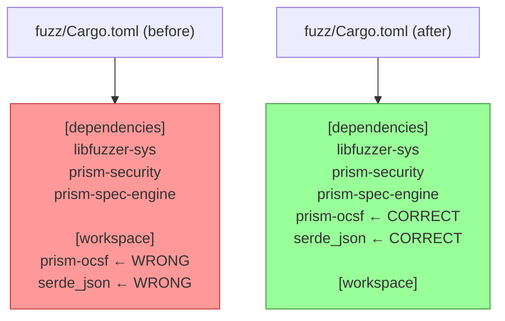
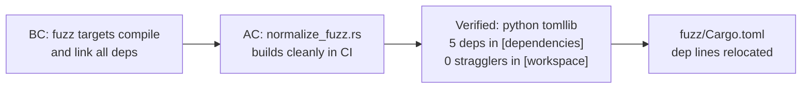

## Summary

Closes the 6th and (we hope) final layer of the Post-Merge Verification cascade triggered by S-2.01 merge. Pure manifest reorganization in `fuzz/Cargo.toml` — no code/version changes.

## Root cause

`fuzz/Cargo.toml` had `prism-ocsf` and `serde_json` lines positioned AFTER the `[workspace]` table:

```toml
[dependencies]
libfuzzer-sys = "0.4"
prism-security = ...
prism-spec-engine = ...

[workspace]

prism-ocsf = ...      ← parsed as workspace.prism-ocsf
serde_json = "1"      ← parsed as workspace.serde_json
```

Cargo emitted warnings (`unused manifest key: workspace.prism-ocsf` and `workspace.serde_json`) that were masked by upstream toolchain failures (PR #44–#48). With those resolved, `normalize_fuzz.rs` failed to compile because its imports were silently dropped.

## Fix

Move the two lines into `[dependencies]` (where they belong) before the `[workspace]` table.

## Architecture Changes



## Story Dependencies


## Spec Traceability



## Hotfix Cascade (6 layers)

| PR | Layer fixed |
|----|-------------|
| #44 | workflow YAML structure + Kani CLI flags |
| #45 | RUSTUP_TOOLCHAIN env + CaseStatus Arbitrary |
| #46 | 7 CI optimizations + action SHA bumps |
| #47 | fuzz target alignment + Kani -p scoping |
| #48 | --target x86_64-unknown-linux-gnu for cargo fuzz |
| #49 (this) | fuzz/Cargo.toml dependency placement |

## Test Evidence

- TOML parsed via python tomllib — 5 deps in `[dependencies]`, 0 keys in `[workspace]`
- 1-file diff: 3 line deletions + 3 line insertions (pure relocation)
- No code changes, no version changes

## Demo Evidence

N/A — pure TOML manifest reorganization. No UI, no behavioral change, no observable output to record. Correctness is verified by CI fuzz job compilation.

## Security Review

N/A — pure TOML manifest reorganization. No code, no logic, no data flow changes. No OWASP-applicable surface.

## Risk Assessment

- **Blast radius:** Minimal — fuzz crate is isolated from normal workspace builds; only affects CI fuzz job
- **Performance impact:** None
- **Rollback:** Trivially reversible — move 2 dependency lines back (same content, different position)

## AI Pipeline Metadata

- Pipeline mode: hotfix
- Story: hotfix-fuzz-cargo-toml (post-merge cascade layer 6)
- Branch: fix/post-merge-fuzz-cargo-toml
- Commit: db1d40a2

## Pre-Merge Checklist

- [x] PR description populated with traceability
- [x] Demo evidence: N/A (manifest-only change, no UI/behavioral demo needed)
- [x] Security review: N/A (pure TOML)
- [ ] PR reviewer approval
- [ ] CI checks passing
- [ ] Dependencies: #44, #45, #46, #47, #48 — all merged ✅
- [ ] Squash merge executed
- [ ] Branch deleted

## Test plan

- [x] TOML parses; 5 deps in `[dependencies]`, 0 stragglers in `[workspace]` (verified via python tomllib)
- [ ] Post-Merge Verification CI on PR — fuzz job compiles `normalize_fuzz` cleanly
- [ ] Post-Merge Verification on develop HEAD after merge — CASCADE CLOSURE confirmation
