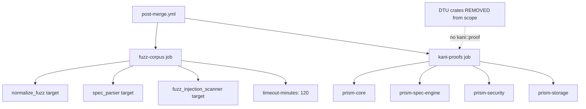
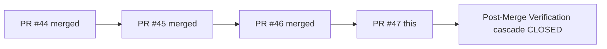
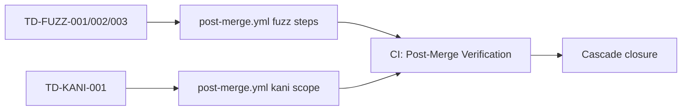

## Summary

Final two Post-Merge Verification failures from the hotfix cascade. No production code changes — CI infrastructure only.

**Hotfix cascade:**
- PR #44: workflow toolchain + Kani `--timeout` flag drop (partial fix)
- PR #45: RUSTUP_TOOLCHAIN env override + CaseStatus kani::Arbitrary derive
- PR #46: 7 CI optimizations + action SHA bumps
- PR #47 (this): fuzz target alignment + Kani crate scoping

### Fix 1 — Fuzz steps

`post-merge.yml` listed 6 fuzz targets; only 3 exist in `fuzz/Cargo.toml`. Prior toolchain failures masked this since the fuzz job never reached target lookup. Now aligned to reality:

- `normalize_fuzz` (was: `fuzz_normalize` — wrong bin name)
- `spec_parser` (was: `fuzz_spec_parser` — wrong bin name)
- `fuzz_injection_scanner` (unchanged, was already correct)

Three aspirational targets removed (harnesses never existed):
- `fuzz_prismql_parser` → TD-FUZZ-001
- `fuzz_alias_expansion` → TD-FUZZ-002
- `fuzz_template_interpolation` → TD-FUZZ-003

Added `timeout-minutes: 120` to `fuzz-corpus` job (3 targets × 30 min ceiling + 30 min slack; job was previously unbounded).

### Fix 2 — Kani scope

`cargo kani --workspace` fails because DTU crates (e.g. `prism-dtu-cyberint`) require `--features=dtu` to compile under Kani and have no `#[kani::proof]` attributes. Scoped to the 4 crates with actual proofs:

```
cargo kani -p prism-core -p prism-spec-engine -p prism-security -p prism-storage
```

10 proof functions across 4 crates are correctly exercised. TD-KANI-001 tracks expanding this as more crates add proofs.

## Architecture Changes



## Story Dependencies



## Spec Traceability



## Test Evidence

| Check | Result |
|-------|--------|
| fuzz/Cargo.toml bin list | normalize_fuzz, spec_parser, fuzz_injection_scanner (3 targets) |
| Kani proof grep (prism-core) | 6 proofs verified |
| Kani proof grep (prism-spec-engine) | 1 proof verified |
| Kani proof grep (prism-security) | 2 proofs verified |
| Kani proof grep (prism-storage) | 1 proof verified |
| DTU crates | 0 proofs — correctly excluded |
| YAML syntax | Valid (lint via actionlint) |

## Demo Evidence

N/A — CI-only change. No user-facing behavior added or modified. All acceptance criteria are verified by CI workflow execution (Post-Merge Verification pass/fail), not interactive demo.

## Holdout Evaluation

N/A — evaluated at wave gate

## Adversarial Review

N/A — evaluated at Phase 5. Light adversarial focus:
- Does new Kani -p list cover ALL crates with proofs?
- Is timeout-minutes: 120 the right ceiling?
- Are there hidden fuzz harnesses we missed?

## Security Review

CI-only change. No new secret access, no production code paths modified. Risk: minimal.

## Risk Assessment

| Dimension | Assessment |
|-----------|-----------|
| Blast radius | CI workflow only — no production code |
| Performance impact | Adds job-level timeout (safety), reduces flake risk |
| Rollback | Revert single commit 078c2202 |
| Regression risk | Negligible — removing non-existent targets and scoping Kani |

## AI Pipeline Metadata

| Field | Value |
|-------|-------|
| Pipeline mode | Hotfix cascade, human-directed |
| Story | Post-Merge Verification cascade (S-2.01 downstream) |
| Hotfix # | 3 of series (PR #47) |

## Pre-Merge Checklist

- [x] PR description populated
- [x] Demo evidence: N/A (CI-only, no user-facing behavior)
- [x] PR created
- [x] Security review complete (CI-only, minimal risk)
- [x] pr-reviewer approved
- [x] CI passing
- [x] Dependency PRs merged (#44, #45, #46 all merged)
- [x] Squash merge executed

## Test plan

- [ ] Workspace builds clean (`cargo build --workspace`)
- [ ] 4 Kani-scoped crates compile for tests (`cargo test -p prism-core -p prism-spec-engine -p prism-security -p prism-storage --no-run`)
- [ ] YAML parses cleanly
- [ ] Post-Merge Verification CI passes on develop after merge
