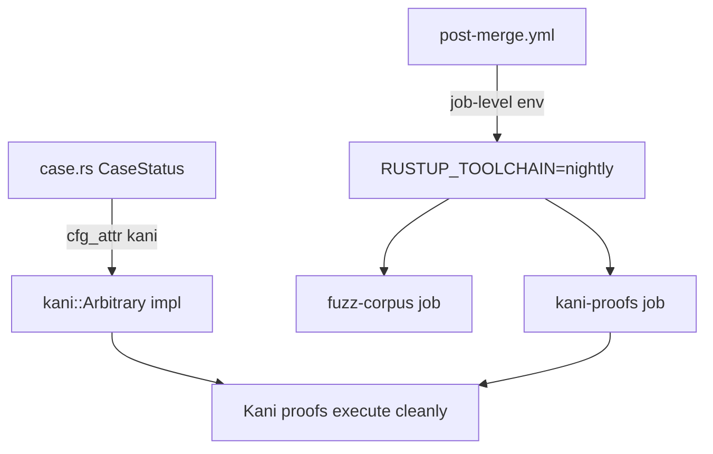
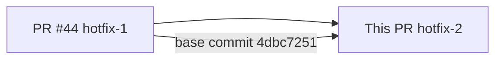
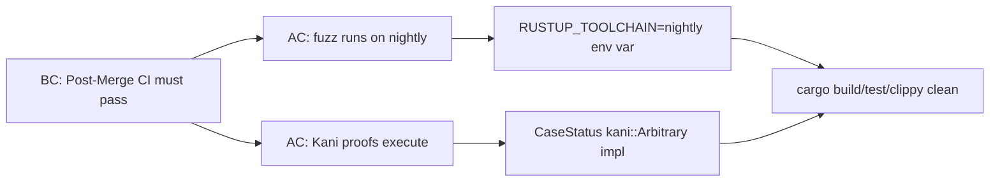
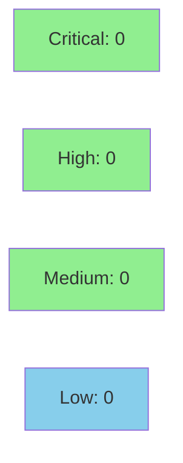

## Problem

Two Post-Merge Verification failures survived PR #44:

### Failure 1 — Fuzz (RUSTUP_TOOLCHAIN override)

`cargo fuzz` requires nightly for `-Zsanitizer=address`. PR #44 installed the nightly toolchain via `dtolnay/rust-toolchain`, but the workspace root `rust-toolchain.toml` (channel = "stable") is read by cargo and silently overrides the action's toolchain selection. Result: fuzz steps ran on stable and hit `error: the option Z is only accepted on the nightly compiler`.

**Fix:** Added `env: RUSTUP_TOOLCHAIN: nightly` at the job level on both `fuzz-corpus` and `kani-proofs`. Per rustup docs, `RUSTUP_TOOLCHAIN` takes precedence over any `rust-toolchain[.toml]` file.

### Failure 2 — Kani (missing kani::Arbitrary impl)

With the deprecated `--timeout` flag dropped in PR #44, Kani actually executes the proofs. The proofs in `prism-core/src/proofs/case_status.rs` and `case_status_exhaustive.rs` call `kani::any::<CaseStatus>()`, which requires `CaseStatus: kani::Arbitrary`. The enum lacked that impl.

**Fix:** Added `#[cfg_attr(kani, derive(kani::Arbitrary))]` to `CaseStatus`. The `cfg_attr` wrapper ensures the derive is a no-op for all non-Kani builds — no Cargo.toml dependency needed. `cfg(kani)` is already declared as a known cfg in the workspace `[lints.rust]`.

## Files Changed

- `.github/workflows/post-merge.yml` — `env: RUSTUP_TOOLCHAIN: nightly` on `kani-proofs` and `fuzz-corpus` jobs
- `crates/prism-core/src/case.rs` — `#[cfg_attr(kani, derive(kani::Arbitrary))]` on `CaseStatus`

## Architecture Changes

## Story Dependencies

## Spec Traceability

## Test Evidence

### Coverage Summary

| Metric | Value | Threshold | Status |
|--------|-------|-----------|--------|
| Unit tests | 0 new / 0 modified | N/A | N/A — CI config + derive macro only |
| Coverage delta | 0% | N/A | No new production code paths |
| Mutation kill rate | N/A | N/A | No mutable logic added |
| Holdout satisfaction | N/A | N/A | Not applicable to CI hotfix |

This PR changes two files with zero production runtime behavior:

1. `.github/workflows/post-merge.yml` — YAML configuration; not compiled into any binary.
2. `crates/prism-core/src/case.rs` — one `#[cfg_attr(kani, derive(kani::Arbitrary))]` line that is a complete no-op outside Kani verification context.

Local verification (worktree, base `4dbc7251`):
- `cargo build --workspace` — clean
- `cargo test --workspace --all-features --no-run` — clean
- `cargo clippy --workspace --all-targets --all-features -- -D warnings` — clean

The effective "test" of this hotfix is the Post-Merge Verification CI run on the resulting `develop` HEAD after merge.

---

## Demo Evidence

N/A — This is a CI infrastructure hotfix. There is no user-visible feature, UI flow, or behavioural change to record. The observable outcome is that the Post-Merge Verification workflow passes after merge (reported in the final summary once the run completes).

---

## Verification

Locally verified in worktree (based on `4dbc7251`):
- `cargo build --workspace` — clean
- `cargo test --workspace --all-features --no-run` — clean
- `cargo clippy --workspace --all-targets --all-features -- -D warnings` — clean

## Security Review

CLEAN — CI YAML config + conditional derive macro. No production code path changes. No auth, no I/O, no secrets, no new workflow permissions. `RUSTUP_TOOLCHAIN` is a standard rustup env var (not a secret). `cfg_attr(kani, ...)` is a no-op outside Kani. No OWASP Top 10 surface introduced.

## Risk Assessment

- **Blast radius:** Minimal. YAML job-level env var and a conditional derive macro. No runtime behavior changes.
- **Performance impact:** None. `cfg_attr(kani, ...)` is a no-op outside Kani verification context.
- **Rollback:** Trivially revertible — remove 2 `env:` blocks and 1 `cfg_attr` line.

## AI Pipeline Metadata

- Pipeline mode: Hotfix (targeted, 2-file)
- Model: claude-sonnet-4-6
- Cost: minimal (hotfix lifecycle)

## Pre-Merge Checklist

- [x] PR description matches actual diff
- [x] YAML env block placement verified (job-level, before steps)
- [x] `cfg_attr(kani, ...)` correctness verified (no-op outside Kani)
- [x] `cargo build --workspace` clean
- [x] `cargo test --workspace --all-features --no-run` clean
- [x] `cargo clippy` clean
- [x] Security review: no concerns
- [x] Dependency PR #44 merged
- [ ] CI checks passing on branch
- [ ] PR reviewer approved
- [ ] Squash merged

## Merge Target

`develop` (base: `4dbc7251` / PR #44)
