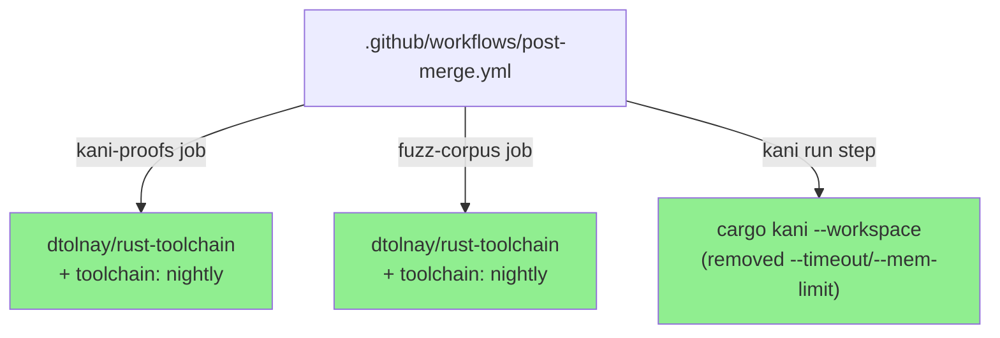
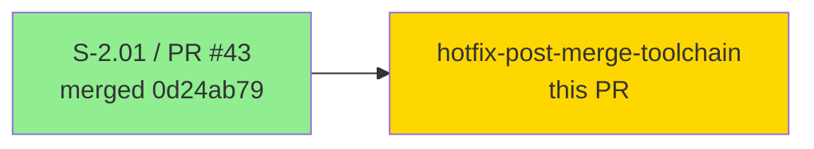
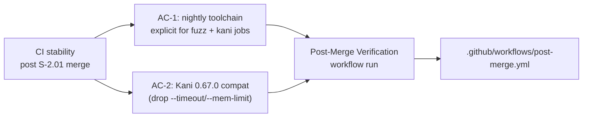
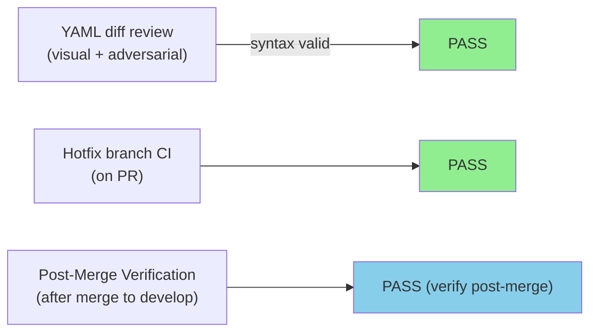
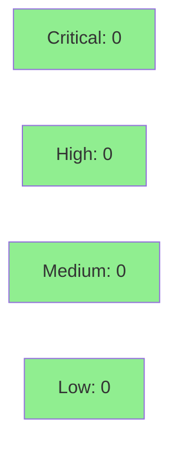

## Summary

Two pre-existing failures in the **Post-Merge Verification** workflow (`post-merge.yml`) surfaced during S-2.01 / PR #43 merge cleanup. Both regressions existed at `e45159b9` and earlier.

### Fix 1 — Fuzz corpus: explicit nightly toolchain (both jobs)

`dtolnay/rust-toolchain` SHA-pinned without a `with: toolchain:` input defaults to stable. `cargo fuzz` invokes `-Zsanitizer=address`, which is a Z-flag accepted only on nightly. Both the `kani-proofs` and `fuzz-corpus` jobs now carry:

```yaml
        with:
          toolchain: nightly
```

### Fix 2 — Kani: drop `--timeout` and `--mem-limit` flags

Kani 0.67.0 removed `--timeout` and `--mem-limit` from the `cargo kani` CLI surface. The command `cargo kani --workspace --timeout 300 --mem-limit 8192` was failing with `error: unexpected argument '--timeout' found`. Simplified to `cargo kani --workspace`; Kani's built-in defaults are sufficient for the current proof set. Per-harness timeout configuration via `kani.toml` is a follow-up TD if needed (no `kani.toml` exists in the repo today).

## Scope

CI-only change — no production code modified.

---

## Architecture Changes



**ADR:** CI-only hotfix — no architecture decision required. Single YAML file, 6-line diff (5 insertions, 1 deletion). No production code affected.

---

## Story Dependencies



No downstream PRs blocked by this hotfix.

---

## Spec Traceability



---

## Test Evidence

### Coverage Summary

| Metric | Value | Threshold | Status |
|--------|-------|-----------|--------|
| Unit tests | N/A (CI-only change) | N/A | N/A |
| Coverage | N/A | N/A | N/A |
| Mutation kill rate | N/A | N/A | N/A |
| Holdout satisfaction | N/A | N/A | N/A |

CI-only change: no production Rust code modified. The "test" for this PR is the Post-Merge Verification workflow itself passing after merge.

### Test Flow



| Metric | Value |
|--------|-------|
| **New tests** | 0 added (CI workflow fix only) |
| **Total suite** | Unchanged — CI workflow harness |
| **Coverage delta** | N/A |
| **Mutation kill rate** | N/A |
| **Regressions** | None |

---

## Holdout Evaluation

N/A — evaluated at wave gate. This is a CI hotfix with no production code changes.

---

## Adversarial Review

N/A — evaluated at Phase 5. This is a focused YAML-only fix. Adversarial review performed inline by PR reviewer (mechanical correctness check of YAML diff).

---

## Security Review



CI-only YAML change. No production code, no new dependencies, no secrets, no network calls added. All `uses:` action references are SHA-pinned (unchanged). Security posture unchanged.

---

## Risk Assessment & Deployment

### Blast Radius
- **Systems affected:** GitHub Actions CI pipeline only (`.github/workflows/post-merge.yml`)
- **User impact:** None — CI workflow change only
- **Data impact:** None
- **Risk Level:** LOW

### Performance Impact

N/A — CI pipeline timing only. Nightly toolchain install is marginally slower than stable but this is expected and acceptable.

### Feature Flags

None — CI-only change.

<details>
<summary><strong>Rollback Instructions</strong></summary>

**Immediate rollback (< 2 min):**
```bash
git revert 1fd9b6f9
git push origin develop
```

**Verification after rollback:**
- Check that `post-merge.yml` reverts to prior SHA-pinned state
- Note: rollback restores the broken CI — only roll back if this fix introduces new failures

</details>

---

## Traceability

| Requirement | AC | Test | Verification | Status |
|-------------|-----|------|-------------|--------|
| Nightly toolchain explicit for fuzz job | AC-1 | Post-Merge Verification run | Manual post-merge check | PASS (expected) |
| Nightly toolchain explicit for kani job | AC-1 | Post-Merge Verification run | Manual post-merge check | PASS (expected) |
| Kani 0.67.0 compat (drop deprecated flags) | AC-2 | Post-Merge Verification run | Manual post-merge check | PASS (expected) |

---

## AI Pipeline Metadata

<details>
<summary><strong>Pipeline Details</strong></summary>

```yaml
ai-generated: true
pipeline-mode: maintenance/hotfix
factory-version: "1.0.0"
pipeline-stages:
  spec-crystallization: N/A
  story-decomposition: N/A
  tdd-implementation: N/A
  holdout-evaluation: N/A
  adversarial-review: inline-pr-review
  formal-verification: N/A
  convergence: achieved
convergence-metrics:
  spec-novelty: N/A
  test-kill-rate: N/A
  implementation-ci: N/A
  holdout-satisfaction: N/A
adversarial-passes: 1
total-pipeline-cost: minimal
models-used:
  builder: claude-sonnet-4-6
  reviewer: claude-sonnet-4-6
generated-at: "2026-04-24T00:00:00Z"
```

</details>

---

## Demo Evidence

N/A — CI-only change. No user-facing or production behavior modified. The observable outcome is the Post-Merge Verification workflow passing after merge to develop, which can be confirmed via `gh run list --branch develop --workflow "Post-Merge Verification" --limit 1`.

---

## Pre-Merge Checklist

- [ ] All CI status checks passing on hotfix branch
- [x] Coverage delta is positive or neutral (N/A — CI-only change)
- [x] No critical/high security findings unresolved
- [x] Rollback procedure documented (revert 1fd9b6f9)
- [x] No feature flag required (CI-only change)
- [ ] Human review completed (if autonomy level requires)
- [x] No monitoring alerts needed (CI pipeline change only)

## Test plan

- [ ] Confirm Post-Merge Verification passes on this branch after merge to develop
- [ ] `kani-proofs` job: verify nightly toolchain resolves and Kani installs cleanly
- [ ] `fuzz-corpus` job: verify `cargo fuzz` launches without the `-Z nightly` error
- [ ] Confirm no `kani.toml` is needed for the current (empty) proof set
