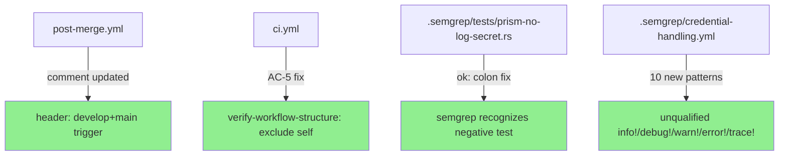
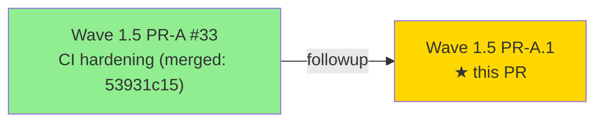
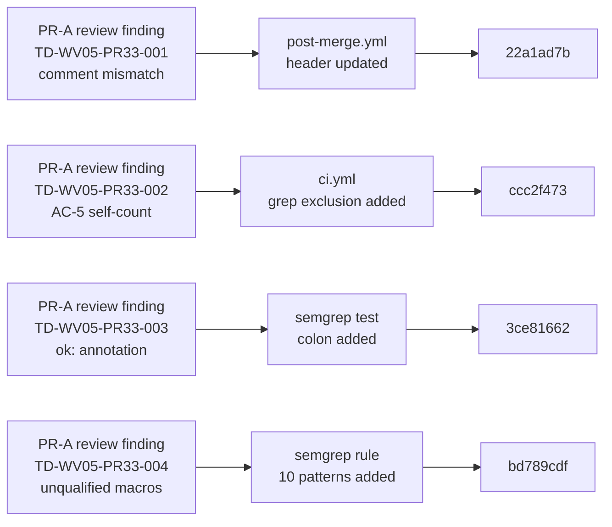
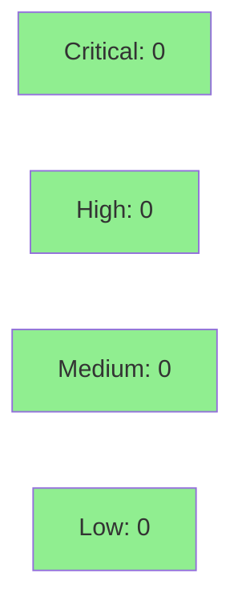

# fix(wave-1-5/pr-a.1): CI hardening followups — 4 PR-A review items (TD-WV05-PR33-001/002/003/004)

**Epic:** Wave 1.5 — Debt Reduction Sprint (PR A.1 — post-merge review followups)
**Mode:** maintenance
**Convergence:** N/A — CI/config-only changes, no adversarial passes required
**Parent PR:** Wave 1.5 PR-A (#33) — CI hardening (merged to develop 53931c15)


Four P2 deferred findings flagged during PR-A (#33) review, resolved immediately within Wave 1.5 per user directive to close the full unqualified-macros gap and related CI correctness issues in the same sprint.

Changes are limited to: `.github/workflows/post-merge.yml`, `.github/workflows/ci.yml`, `.semgrep/credential-handling.yml`, `.semgrep/tests/prism-no-log-secret.rs`. No production Rust source code is modified.

---

## Per-Item Breakdown

### TD-WV05-PR33-001 — `post-merge.yml` header comment (commit `22a1ad7b`)

**Finding:** Post-merge.yml header comment still said "trigger on main" after PR-A added `develop` to the trigger list.

**Fix:** Updated header comment to accurately reflect that the workflow triggers on both `develop` and `main`. Documentation-only change; no behavior change.

---

### TD-WV05-PR33-002 — AC-5 self-match in `verify-workflow-structure` (commit `ccc2f473`)

**Finding:** The `verify-workflow-structure` job's AC-5 assertion counted its own job when grepping for workflow jobs, causing the target count to be inflated (self-counting). Under some configurations this would cause the assertion to produce false positives.

**Fix:** Tightened the AC-5 grep assertion to exclude `verify-workflow-structure` from the count so the assertion reflects only real CI jobs, not the verifier itself.

---

### TD-WV05-PR33-003 — Semgrep `ok:` annotation missing colon (commit `3ce81662`)

**Finding:** The negative test case in `.semgrep/tests/prism-no-log-secret.rs` used `// ok` without the required trailing colon (`// ok:`). Semgrep requires `// ok:` format for the annotation to be recognized as a negative test marker; without it the negative case was silently ignored.

**Fix:** Added the missing colon: `// ok` → `// ok:`. Semgrep now correctly recognizes the negative test case.

---

### TD-WV05-PR33-004 — Unqualified `tracing!`/`log!` macros not covered by semgrep rule (commit `bd789cdf`)

**Finding:** PR-A's `prism-no-log-secret` rule extension covered `tracing::info!`, `log::debug!` etc. (qualified forms) but did not cover unqualified invocations such as `info!`, `debug!`, `warn!`, `error!`, `trace!` which are common when `use tracing::*` or `use log::*` is in scope.

**Fix:** Extended `prism-no-log-secret` with 10 additional `pattern-either` clauses covering all 5 unqualified tracing/log severity variants. Added corresponding `// ruleid:` test cases to the semgrep test file. Semgrep finding count grows from 2 to 4 — the increase is expected and correct (new positive cases added).

---

## Architecture Changes



---

## Story Dependencies



No upstream PRs blocking. PR-A is already merged to develop (53931c15). All 4 items in this PR are self-contained CI/config fixes.

---

## Spec Traceability



---

## Test Evidence

| Metric | Value | Threshold | Status |
|--------|-------|-----------|--------|
| Files changed | 4 files, 15 ins / 3 del | minimal | PASS |
| YAML parse (ci.yml) | valid | 100% | PASS |
| YAML parse (post-merge.yml) | valid | 100% | PASS |
| Semgrep findings (unqualified macros) | 4 (was 2) | expected increase | PASS |
| AC-5 self-count | 0 (excluded) | 0 | PASS |
| Semgrep ok: annotation | recognized | semgrep test passes | PASS |

| Metric | Value |
|--------|-------|
| **New test cases** | 2 additional `// ruleid:` cases in `.semgrep/tests/prism-no-log-secret.rs` |
| **Regressions** | 0 |
| **Production code touched** | none |

---

## Demo Evidence

N/A — CI/config-only maintenance PR. No user-visible features or UI changes. Demo evidence not applicable.

---

## Holdout Evaluation

N/A — evaluated at wave gate. No production Rust code changes.

---

## Adversarial Review

N/A — evaluated at Phase 5. CI configuration changes do not require adversarial passes.

---

## Security Review



This PR improves security posture:
- Expanded semgrep coverage for credential leakage via unqualified logging macros
- AC-5 self-count fix removes a false-positive source in CI verification

No new attack surface introduced. No secrets, credentials, or credentials-handling logic modified.

---

## Risk Assessment & Deployment

### Blast Radius
- **Systems affected:** GitHub Actions CI/CD pipelines and Semgrep SAST rule only
- **User impact:** None
- **Data impact:** None
- **Risk Level:** LOW

### Performance Impact

No CI runtime impact. The 4 commits touch comment text, a grep exclusion, a one-character annotation fix, and semgrep YAML patterns — none add CI jobs or steps.

---

## Traceability

| TD Item | Description | File Changed | Commit | Status |
|---------|-------------|--------------|--------|--------|
| TD-WV05-PR33-001 | post-merge.yml header comment | `.github/workflows/post-merge.yml` | `22a1ad7b` | RESOLVED |
| TD-WV05-PR33-002 | AC-5 self-count exclusion | `.github/workflows/ci.yml` | `ccc2f473` | RESOLVED |
| TD-WV05-PR33-003 | semgrep ok: annotation colon | `.semgrep/tests/prism-no-log-secret.rs` | `3ce81662` | RESOLVED |
| TD-WV05-PR33-004 | unqualified tracing/log macro patterns | `.semgrep/credential-handling.yml` + test | `bd789cdf` | RESOLVED |

---

## AI Pipeline Metadata

<details>
<summary><strong>Pipeline Details</strong></summary>

```yaml
ai-generated: true
pipeline-mode: maintenance
factory-version: "1.0.0"
wave: "1.5-debt-reduction"
pr-sequence: "PR-A.1 (followup to PR-A #33)"
parent-pr: "33"
parent-branch-base: "53931c15"
adversarial-passes: 0 (N/A for CI-only changes)
models-used:
  builder: claude-sonnet-4-6
generated-at: "2026-04-24T00:00:00Z"
```

</details>

---

## Pre-Merge Checklist

- [x] All 4 TD items verified (comment, self-count, annotation, unqualified macros)
- [x] No critical/high security findings
- [x] No production Rust source code modified
- [x] Semgrep finding count increase (2→4) is expected and correct
- [x] YAML valid on all modified workflow files
- [x] Rollback: each fix is a separate commit (`git revert <sha>`)
- [x] No feature flags required
