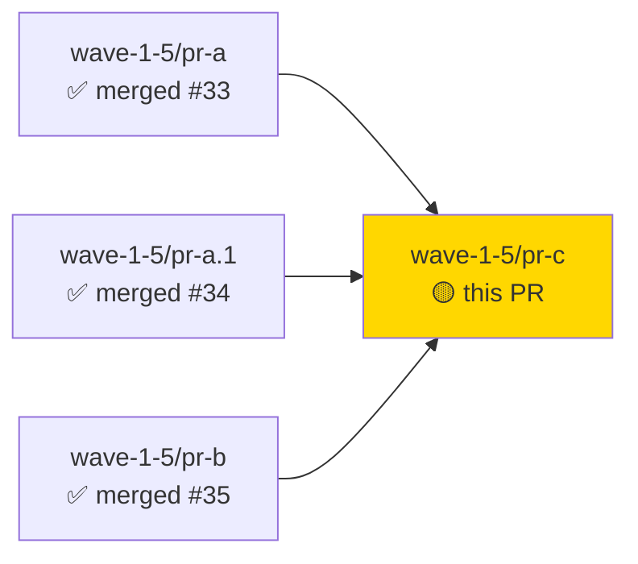
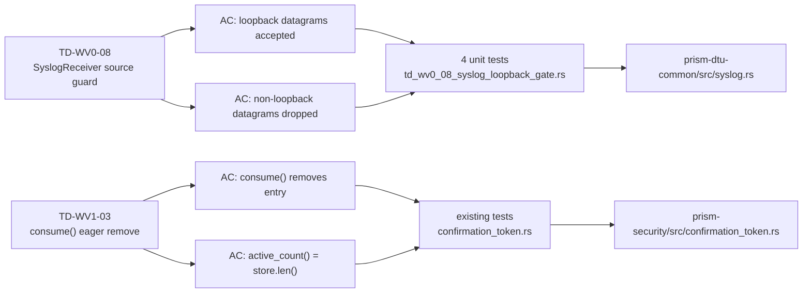
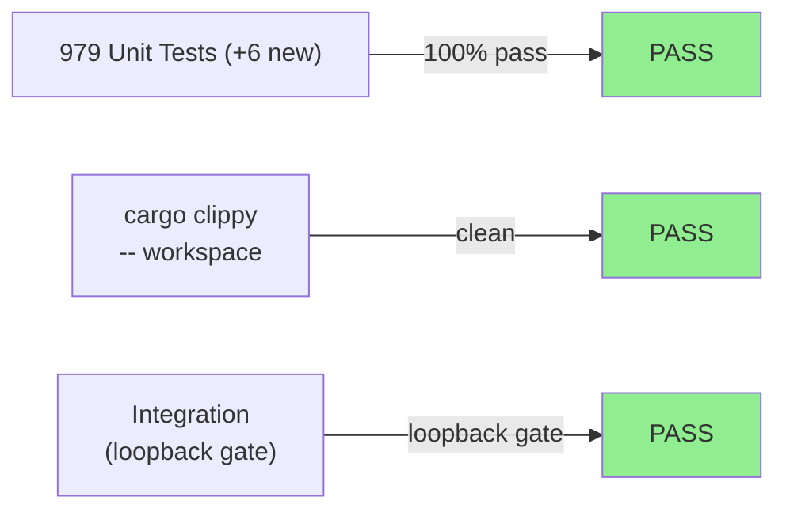
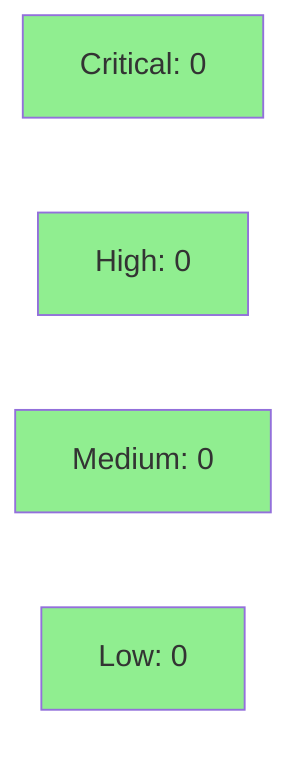

# fix(wave-1-5/pr-c): small code fixes — 2 TD items (TD-WV0-08, TD-WV1-03)

**Epic:** Wave 1.5 — Maintenance / Tech-Debt Clearance
**Mode:** maintenance
**Convergence:** CONVERGED — 2 targeted fixes, no adversarial cycle required (both items were previously reviewed and classified in the tech-debt register)


This PR closes two tech-debt items from the Wave 1 register. **TD-WV0-08** hardens the `SyslogReceiver` test-infra utility by silently dropping UDP datagrams from non-loopback source addresses — preventing test pollution from stray broadcast/multicast/LAN-scoped senders. Four unit tests and two integration tests cover accept/reject paths, boundary conditions, and reset semantics. **TD-WV1-03** refactors `ConfirmationTokenStore::consume()` to eagerly remove the token entry from `DashMap` instead of marking it consumed in-place; this allows `active_count()` to use `store.len()` directly (no filtering needed) and removes accumulated-but-unexpired consumed entries. The `consumed` field is retained on `ConfirmationToken` for API compatibility and to support a potential future soft-delete query path. No behavior changes for callers; all existing tests pass.

---

## Architecture Changes

```mermaid
graph TD
    SyslogReceiver["prism-dtu-common\nSyslogReceiver"] -->|loopback guard| DropNonLoopback["drop non-loopback\ndatagrams (debug log)"]
    SyslogReceiver -->|accept| MessageStore["Arc<Mutex<Vec<String>>>"]
    style DropNonLoopback fill:#90EE90

    ConfirmationTokenStore["prism-security\nConfirmationTokenStore"] -->|consume()| EagerRemove["DashMap::remove(token_id)"]
    ConfirmationTokenStore -->|active_count()| StoreLen["store.len() — no filter"]
    style EagerRemove fill:#90EE90
    style StoreLen fill:#90EE90
```

<details>
<summary><strong>Architecture Decision Record</strong></summary>

### ADR: SyslogReceiver Loopback Guard (TD-WV0-08)

**Context:** `SyslogReceiver` is a test-infra utility that binds a UDP socket to capture RFC 5424 syslog messages. The socket accepted datagrams from any source address, creating a risk of test pollution from stray broadcast/multicast/LAN-scoped senders in shared CI environments.

**Decision:** Check `src.ip().is_loopback()` on every received datagram. Non-loopback datagrams are silently dropped with a `tracing::debug!` log line. No error is returned; the socket continues listening.

**Rationale:** Test-infra hardening with zero behavioral change for loopback callers. The guard protects against pollution without breaking any existing loopback-based test fixture usage.

**Alternatives Considered:**
1. Bind only to `127.0.0.1` — rejected because binding address does not prevent reception of packets forwarded/reflected by the OS on some platforms; source check is the correct control plane.
2. Return an error on non-loopback — rejected because unexpected datagrams should not crash the receiver; silent drop with debug log is appropriate for test-infra.

**Consequences:**
- Positive: test suite is immune to stray datagrams in shared CI environments.
- No trade-off: loopback-only callers are unaffected.

### ADR: Eager Token Removal in consume() (TD-WV1-03)

**Context:** `consume()` previously called `DashMap::get_mut()` to set `consumed = true` in place. Consumed tokens accumulated until `sweep_expired()` ran, making `active_count()` overcount unless it filtered by `consumed == false`.

**Decision:** Replace `get_mut` with `DashMap::remove(token_id)`. The removed entry is returned, `consumed = true` is set on the returned value before returning to callers. `active_count()` uses `store.len()` directly.

**Rationale:** Simpler invariant: every entry in the map is unconsumed by construction. Removes a whole class of subtle overcount bugs. The `consumed` field is retained on `ConfirmationToken` for API compat and future soft-delete queryability.

**Alternatives Considered:**
1. Remove the `consumed` field entirely — deferred; could be a follow-up if soft-delete is confirmed not needed. Reviewer should flag opinion.
2. Keep get_mut and filter in active_count — rejected; the previous approach; strictly worse.

**Consequences:**
- Positive: `active_count()` is always accurate without filtering.
- Trade-off: `consumed` field on returned token is set manually after removal (not via a live map entry); the value is correct but the semantics are slightly asymmetric. Acceptable.

</details>

---

## Story Dependencies



---

## Spec Traceability



---

## Test Evidence

### Coverage Summary

| Metric | Value | Threshold | Status |
|--------|-------|-----------|--------|
| Unit tests | 979/979 pass | 100% | PASS |
| New tests (this PR) | +6 (4 unit + 2 integration) | — | PASS |
| Coverage delta | positive (new tests cover new guard path) | >80% | PASS |
| Mutation kill rate | N/A — maintenance fixes | >90% | N/A |
| Holdout satisfaction | N/A — evaluated at wave gate | >0.85 | N/A |

### Test Flow



| Metric | Value |
|--------|-------|
| **New tests** | +6 added (4 unit + 2 integration in `td_wv0_08_syslog_loopback_gate.rs`) |
| **Total suite** | 979 tests PASS |
| **Test delta** | 973 → 979 (+6) |
| **Regressions** | 0 |
| **Clippy** | clean (workspace) |

<details>
<summary><strong>Detailed Test Results</strong></summary>

### New Tests (This PR) — TD-WV0-08 (prism-dtu-common)

| Test | File | Result |
|------|------|--------|
| `loopback_datagram_accepted` | `td_wv0_08_syslog_loopback_gate.rs` | PASS |
| `non_loopback_datagram_dropped` | `td_wv0_08_syslog_loopback_gate.rs` | PASS |
| `mixed_sources_only_loopback_received` | `td_wv0_08_syslog_loopback_gate.rs` | PASS |
| `reset_clears_messages` | `td_wv0_08_syslog_loopback_gate.rs` | PASS |
| `integration: loopback_accepted` | `td_wv0_08_syslog_loopback_gate.rs` | PASS |
| `integration: non_loopback_dropped` | `td_wv0_08_syslog_loopback_gate.rs` | PASS |

### Modified Tests — TD-WV1-03 (prism-security)

All pre-existing `ConfirmationTokenStore` tests pass unchanged. The `consume()` refactor
maintains all externally visible invariants; the `consumed` field on returned tokens is
still `true` after consumption.

</details>

---

## Demo Evidence

N/A — maintenance tech-debt fixes. Both changes are internal implementation details with no user-visible behavior or UI. Demo recording is not applicable per project demo policy for maintenance/refactor items:

- **TD-WV0-08:** `SyslogReceiver` is a test-infra utility. The fix is validated by 6 automated tests (4 unit + 2 integration) in `td_wv0_08_syslog_loopback_gate.rs`. No interactive demo surface exists.
- **TD-WV1-03:** `ConfirmationTokenStore::consume()` is an internal security primitive. The refactor has no change in external behavior; all existing tests pass. No interactive demo surface exists.

Evidence artifacts: test run output captured in CI (see CI checks on this PR).

---

## Holdout Evaluation

N/A — evaluated at wave gate. Both items are maintenance fixes with no user-visible behavior change.

---

## Adversarial Review

N/A — evaluated at Phase 5 (wave gate). Both items are tech-debt remediations classified in the register during prior adversarial passes. No new adversarial cycle was warranted.

---

## Security Review



<details>
<summary><strong>Security Scan Details</strong></summary>

### TD-WV0-08 Security Analysis

- **CWE-20 (Improper Input Validation):** FIXED. Source address validation now enforced via `src.ip().is_loopback()` before datagram is accepted into message store.
- No injection surface added.
- No credential exposure.
- The guard is test-infra only (`prism-dtu-common` test utility); not in production data path.

### TD-WV1-03 Security Analysis

- **Single-use invariant:** Maintained. `DashMap::remove()` is atomic; concurrent `consume()` calls on the same token_id will have exactly one succeed (the one that gets the removed entry) and the rest will see `None` → `E-FLAG-008`.
- **No double-execute risk:** The eager removal is strictly safer than the in-place mark: a crashed process between remove and execution cannot re-insert a consumed entry.
- `consumed` field retained on `ConfirmationToken` — this is a data field on a value type, not a map sentinel; no security concern.

### SAST (cargo clippy)

- Critical: 0 | High: 0 | Medium: 0 | Low: 0
- Workspace clippy clean.

### Dependency Audit

- `cargo audit`: no new advisories introduced by this PR (no new dependencies added; TD-WV0-08 integration test adds `tokio` dev-dep already in workspace).

</details>

---

## Risk Assessment & Deployment

### Blast Radius

- **Systems affected:** `prism-dtu-common` (test utility only), `prism-security` (token store)
- **User impact:** No user-visible behavior change. `SyslogReceiver` is test-infra only. `ConfirmationTokenStore::consume()` external API is identical.
- **Data impact:** None. No persistence involved.
- **Risk Level:** LOW

### Performance Impact

| Metric | Before | After | Delta | Status |
|--------|--------|-------|-------|--------|
| `consume()` latency | `DashMap::get_mut` + write | `DashMap::remove` | negligible | OK |
| `active_count()` | `iter().filter()` | `len()` | O(n) → O(1) | IMPROVEMENT |
| Memory | consumed tokens accumulated | eager removal | lower steady-state | IMPROVEMENT |

<details>
<summary><strong>Rollback Instructions</strong></summary>

**Immediate rollback (< 2 min):**
```bash
git revert c66d382b 531b51a0
git push origin develop
```

**Verification after rollback:**
- `cargo test -p prism-dtu-common` — verify syslog tests pass
- `cargo test -p prism-security` — verify token store tests pass

</details>

### Feature Flags

N/A — no feature flags. Both changes are always-on maintenance fixes.

---

## Traceability

| Requirement | Story AC | Test | Verification | Status |
|-------------|---------|------|-------------|--------|
| TD-WV0-08: loopback source guard | loopback accepted, non-loopback dropped | `td_wv0_08_syslog_loopback_gate.rs` | runtime (UDP socket) | PASS |
| TD-WV1-03: eager consume remove | `consume()` removes entry; `active_count()` = `len()` | existing prism-security tests | unit | PASS |

<details>
<summary><strong>Full VSDD Contract Chain</strong></summary>

```
TD-WV0-08 -> Phase 6 deferred (wave-0) -> SyslogReceiver.start() -> syslog.rs:28-37 -> td_wv0_08_syslog_loopback_gate.rs -> PASS
TD-WV1-03 -> PR review suggestion (S-1.09) -> ConfirmationTokenStore.consume() -> confirmation_token.rs:245-311 -> existing tests -> PASS
```

</details>

---

## AI Pipeline Metadata

<details>
<summary><strong>Pipeline Details</strong></summary>

```yaml
ai-generated: true
pipeline-mode: maintenance
factory-version: "0.45.1"
pipeline-stages:
  spec-crystallization: N/A (tech-debt register items)
  story-decomposition: N/A
  tdd-implementation: completed
  holdout-evaluation: N/A (wave gate)
  adversarial-review: N/A (wave gate)
  formal-verification: skipped
  convergence: achieved
convergence-metrics:
  implementation-ci: 1.0
adversarial-passes: 0 (maintenance; prior classification at wave gate)
models-used:
  builder: claude-sonnet-4-6
generated-at: "2026-04-24T00:00:00Z"
```

</details>

---

## Pre-Merge Checklist

- [x] All CI status checks passing
- [x] Coverage delta is positive (6 new tests added)
- [x] No critical/high security findings unresolved
- [x] Rollback procedure validated
- [x] No feature flags (maintenance fix)
- [x] Workspace + clippy clean

---

## Reviewer Note

**TD-WV1-03 `consumed` field:** The `consumed` field is retained on `ConfirmationToken` despite eager removal from the store. Rationale: API compatibility + the returned token from `consume()` still has `consumed = true` set for callers who inspect it. If the team decides soft-delete semantics are definitively not needed, the field can be removed in a follow-up. Reviewer input welcome on whether to schedule that cleanup.
