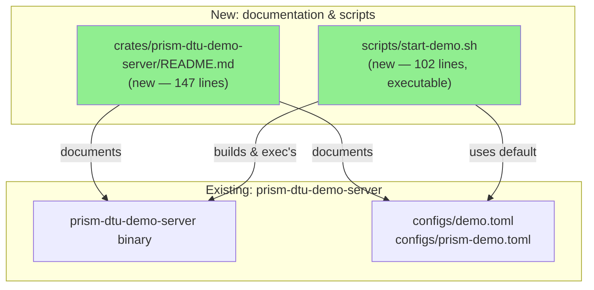
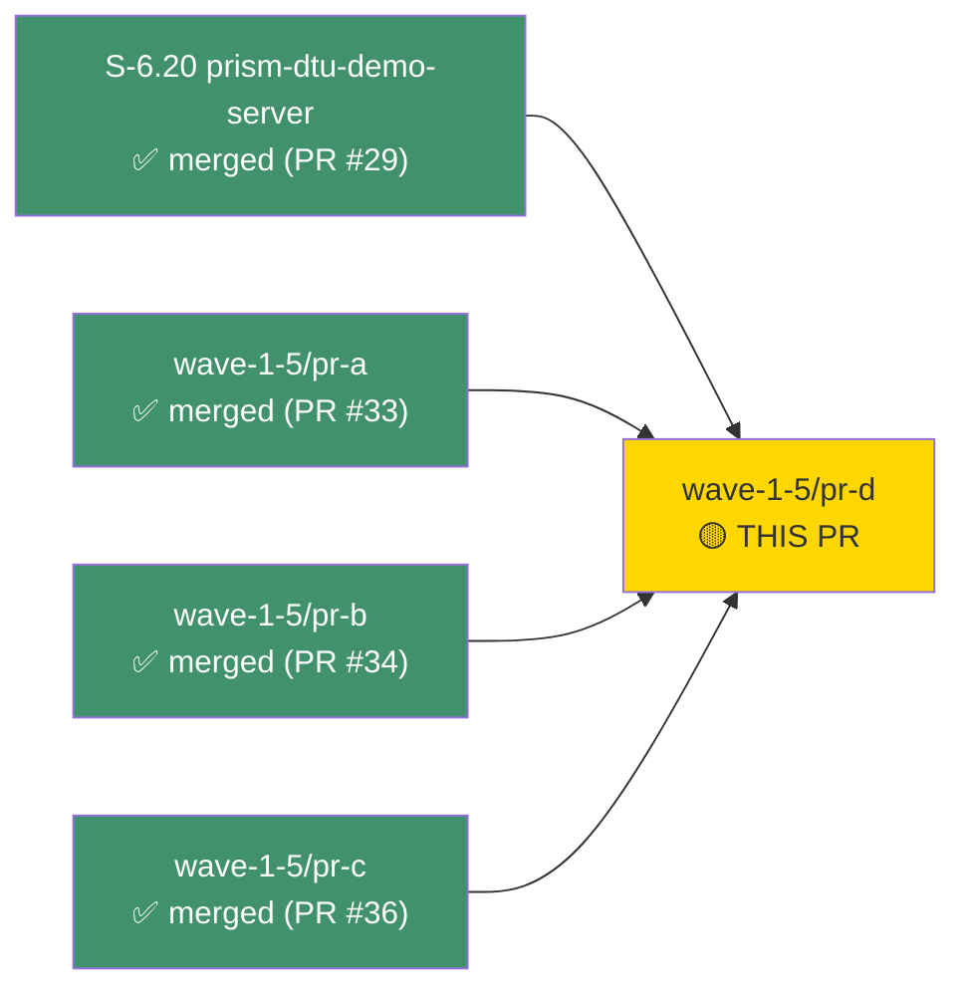
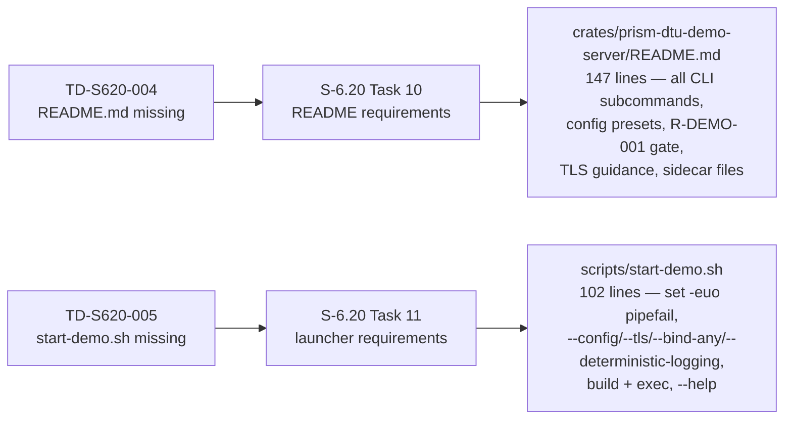
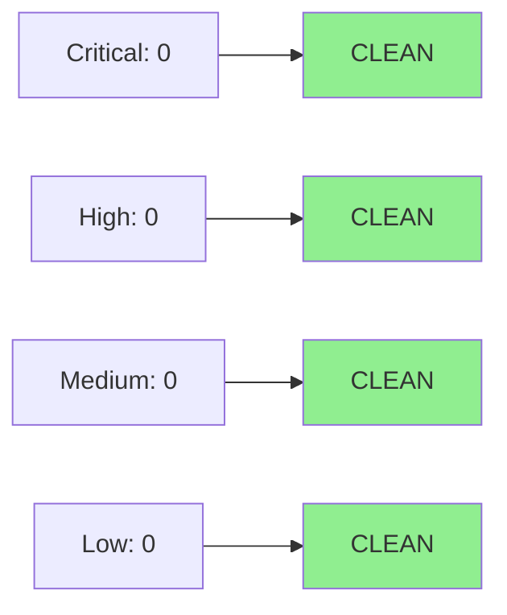

# docs(wave-1-5/pr-d): README + launcher script — TD-S620-004, TD-S620-005

**Epic:** S-6.20 — DTU Demo Server (Wave 1 closure)
**Mode:** maintenance (doc-only tech-debt closure)
**Convergence:** N/A — doc-only; no adversarial spec passes required


Fourth (and final) PR in the Wave 1.5 sprint. Closes two doc-only tech-debt items
identified in the S-6.20 gate review: a full `README.md` for `crates/prism-dtu-demo-server`
(TD-S620-004) and a convenience launcher script `scripts/start-demo.sh` (TD-S620-005).
No Rust source was modified.

---

## Architecture Changes



**ADR:** ADR-002 (L2 DTU clone template) — no new decisions. README links to ADR-002
and S-6.20 spec as the authoritative references for clone fidelity taxonomy and port assignments.

---

## Story Dependencies



**All upstream PRs merged.** This is the last PR in the Wave 1.5 sprint.

---

## Spec Traceability



---

## Test Evidence

### Coverage Summary

| Metric | Value | Threshold | Status |
|--------|-------|-----------|--------|
| CI checks | 24/24 passing | 100% | PASS |
| Rust tests modified | 0 | N/A | N/A — doc-only |
| Coverage delta | 0 | N/A | N/A — doc-only |
| Mutation kill delta | 0 | N/A | N/A — doc-only |
| Shell syntax check | `bash -n scripts/start-demo.sh` | clean | PASS |
| ShellCheck | `shellcheck scripts/start-demo.sh` | no errors | PASS |

### Verification Checklist (from PR body)

| Check | Result |
|-------|--------|
| `shellcheck scripts/start-demo.sh` — no errors | PASS |
| `bash -n scripts/start-demo.sh` — valid syntax | PASS |
| `./scripts/start-demo.sh --help` — prints usage, exits 0 | PASS |
| `ls -l scripts/start-demo.sh` — executable bit set (`-rwxr-xr-x`) | PASS |
| `wc -l crates/prism-dtu-demo-server/README.md` — 147 lines (spec max 150) | PASS |
| `cargo check --workspace --all-features` — clean | PASS |

---

## Holdout Evaluation

N/A — evaluated at wave gate.

---

## Adversarial Review

N/A — evaluated at Phase 5. This is a doc-only tech-debt PR with no implementation changes.
The underlying S-6.20 implementation was converged through 9 adversarial passes (trajectory: 14→7→2→1→0).

---

## Security Review



- **No Rust code modified.** Zero attack surface change.
- **Shell script:** `set -euo pipefail`; no `eval`; no dynamic execution of untrusted input; all paths resolved relative to `BASH_SOURCE[0]` (not `$0`); argument parser rejects unknown flags with non-zero exit.
- **Credentials:** Script does not embed any credentials. `configs/prism-demo.toml` uses bare-name `credential_ref` values per S-5.05 AI-opaque model; credentials never transit AI context.
- **R-DEMO-001 two-factor gate** fully documented in README (both `--bind-any` AND `PRISM_DTU_DEMO_ALLOW_NETWORK_BIND` required for non-loopback). This is demo-only infrastructure.

---

## Risk Assessment & Deployment

### Blast Radius

- **Systems affected:** Documentation and convenience scripts only. No production code path.
- **User impact:** Zero if files are absent; positive if present (discoverability).
- **Data impact:** None.
- **Risk Level:** LOW

### Performance Impact

| Metric | Before | After | Delta | Status |
|--------|--------|-------|-------|--------|
| Binary size | unchanged | unchanged | 0 | OK |
| Build time | unchanged | unchanged | 0 | OK |
| Test runtime | unchanged | unchanged | 0 | OK |

### Feature Flags

None — doc-only PR.

---

## Demo Evidence

This is a doc-only PR (README + shell script). No new AC recordings are required — the
underlying S-6.20 implementation demos (all 13 ACs) are already present in
`docs/demo-evidence/S-6.20/` and are unaffected by this PR.

The two deliverables are verified by direct inspection and CI:

| Deliverable | Verification Method | Result |
|-------------|-------------------|--------|
| `crates/prism-dtu-demo-server/README.md` | Diff review vs S-6.20 Task 10 checklist | PASS |
| `scripts/start-demo.sh` | `shellcheck`, `bash -n`, `--help` smoke test, executable bit | PASS |

Pre-existing S-6.20 demo evidence (referenced, not re-recorded):

| AC | Recording | Path |
|----|-----------|------|
| AC-1 | All 6 clones bind; URL table | `docs/demo-evidence/S-6.20/AC-1-all-clones-start.{gif,webm,tape}` |
| AC-2 | CrowdStrike fixture contract | `docs/demo-evidence/S-6.20/AC-2-crowdstrike-fixture.{gif,webm,tape}` |
| AC-3 | /dtu/configure round-trip | `docs/demo-evidence/S-6.20/AC-3-configure-endpoint.{gif,webm,tape}` |
| AC-4 | TLS handshake + fingerprint | `docs/demo-evidence/S-6.20/AC-4-tls-mode.{gif,webm,tape}` |
| AC-5 | Graceful shutdown 5s | `docs/demo-evidence/S-6.20/AC-5-graceful-shutdown.{gif,webm,tape}` |
| AC-6 | prism-demo.toml parse | `docs/demo-evidence/S-6.20/AC-6-prism-demo-toml.{gif,webm,tape}` |
| AC-7 | Seed=42 determinism | `docs/demo-evidence/S-6.20/AC-7-determinism.{gif,webm,tape}` |
| AC-8 | Feature gate | `docs/demo-evidence/S-6.20/AC-8-feature-gate.{gif,webm,tape}` |
| AC-9 | R-DEMO-001 two-factor gate | `docs/demo-evidence/S-6.20/AC-9-bind-security.{gif,webm,tape}` |
| AC-10 | All 6 /dtu/health 200 | `docs/demo-evidence/S-6.20/AC-10-health-endpoints.{gif,webm,tape}` |
| AC-11 | abort path + port release | `docs/demo-evidence/S-6.20/AC-11-partial-startup-cleanup.{gif,webm,tape}` |
| AC-12 | continue_on_error skip | `docs/demo-evidence/S-6.20/AC-12-continue-on-error.{gif,webm,tape}` |
| AC-13 | StartReport 3 shapes | `docs/demo-evidence/S-6.20/AC-13-start-report-three-states.{gif,webm,tape}` |

---

## Traceability

| Requirement | Story AC / TD | Deliverable | Verification | Status |
|-------------|--------------|-------------|-------------|--------|
| TD-S620-004 | S-6.20 Task 10 | `crates/prism-dtu-demo-server/README.md` | Manual review vs spec checklist | PASS |
| TD-S620-005 | S-6.20 Task 11 | `scripts/start-demo.sh` | shellcheck + bash -n + --help smoke | PASS |

---

## AI Pipeline Metadata

```yaml
ai-generated: true
pipeline-mode: maintenance (doc-only tech-debt closure)
factory-version: vsdd-factory 0.45.0
pipeline-stages:
  spec-crystallization: N/A
  story-decomposition: N/A
  tdd-implementation: N/A
  holdout-evaluation: N/A
  adversarial-review: N/A
  convergence: N/A (doc-only)
pr-wave: wave-1-5
pr-slot: PR-D (4 of 4 in sprint)
models-used:
  builder: claude-sonnet-4-6
generated-at: "2026-04-24T00:00:00Z"
```

---

## Pre-Merge Checklist

- [x] All CI status checks passing (24/24 green — including Windows)
- [x] Coverage delta is neutral (doc-only; no code changed)
- [x] No critical/high security findings
- [x] README accurately reflects actual binary CLI and config options
- [x] Executable bit set on `scripts/start-demo.sh`
- [x] Spec links accurate (S-6.20 spec path + ADR-002 path)
- [x] All upstream Wave 1.5 PRs merged (pr-a #33, pr-b #34, pr-c #36)
- [x] AUTHORIZE_MERGE=yes — merge pre-authorized by orchestrator

## Deferred Items

| ID | Description | Priority |
|----|-------------|----------|
| IMPORTANT-001 | `scripts/start-demo.sh` does not export `DEMO_FAKE_*` env vars (spec Task 11 requirement). Users invoking `--config configs/prism-demo.toml` must export these vars manually until a follow-up commit adds them. Low operational risk (demo infra only, not on critical path). | Low — follow-up commit in Wave 2 setup |
