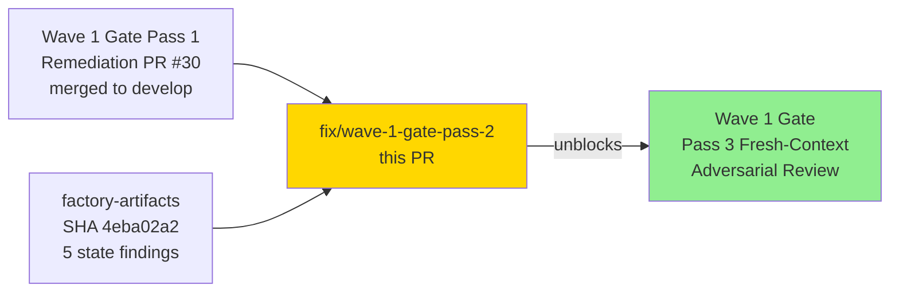
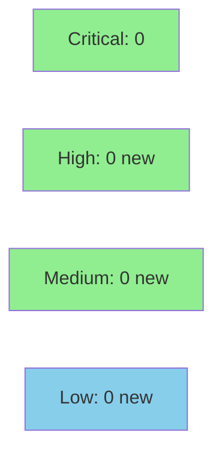

## Summary

Wave 1 integration gate adversarial **Pass 2** review (P3WV1B) surfaced **0C + 3H + 4M + 2L + 2OBS = 11 findings**. Five findings were resolved at the state/spec level by the state-manager burst against `factory-artifacts` at SHA `4eba02a2` (H-002, H-003, M-002, L-001, L-002). This PR closes the **4 remaining code-level remediations** (H-001, M-001, M-003, M-004).

**Headline:** A new `test-no-default-features` CI job now exercises **728 tests** that were previously structurally untested — the compile-time write-gate negative path was never compiled in CI before this PR.

**Merge target:** `develop`
**Gate effect:** Unblocks Pass 3 fresh-context adversarial review.

---

## Finding Breakdown

| Finding ID | Severity | Description | Resolution | Closing Commit |
|------------|----------|-------------|------------|----------------|
| P3WV1B-A-H-001 | HIGH | Three `ac_9_bind_security` tests mutate `PRISM_DTU_DEMO_ALLOW_NETWORK_BIND` env-var without serialization — data race under parallel test execution | Added `#[serial]` via `serial_test` crate | `7bfea632` |
| P3WV1B-A-M-001 | MEDIUM | AC-4 demo README described TLS-serving behavior that is not yet fully wired (deferred to Wave 2) | Annotated README with accurate TD-WV1-04 deferral note | `1f50d80a` |
| P3WV1B-A-M-003 | MEDIUM | Spec file CREATE path used `exists()` check + tmp-write + rename — TOCTOU race allowing silent overwrite of existing spec | Replaced with `OpenOptions::create_new(true)` for atomic fail-if-exists; tmp+rename retained only on UPDATE path | `3a584c6c` |
| P3WV1B-A-M-004 | MEDIUM | CI never ran `--no-default-features` — feature-negative code paths (compile-time write gates) were structurally untested | Added `test-no-default-features` CI matrix job; 728 tests pass | `0e2d6347` |

### Residual Findings (resolved via factory-artifacts state-manager burst at SHA `4eba02a2`)

| Finding ID | Severity | Description | Resolution |
|------------|----------|-------------|------------|
| P3WV1B-A-H-002 | HIGH | STATE.md drift | Fixed by state-manager |
| P3WV1B-A-H-003 | HIGH | wave-state.yaml drift | Fixed by state-manager |
| P3WV1B-A-M-002 | MEDIUM | Story frontmatter status drift | Fixed by state-manager |
| P3WV1B-A-L-001 | LOW | Tech-debt register count drift | Fixed by state-manager |
| P3WV1B-A-L-002 | LOW | Wave scheduling artifact drift | Fixed by state-manager |

### Informational / OBS Findings (not actionable in code)

| Finding ID | Severity | Description |
|------------|----------|-------------|
| P3WV1B-A-OBS-001 | OBS | Demo evidence annotation — AC-4 demo README accuracy (addressed by M-001 commit) |
| P3WV1B-A-OBS-002 | OBS | prism-storage shell status — informational; no code change required |

---

## Architecture Changes

```mermaid
graph TD
    A[ac_9_bind_security tests] -->|before| B[env-var mutation without serialization — data race]
    A -->|after| C[#[serial] annotation — sequential execution]
    style C fill:#90EE90

    D[prism-spec-engine CREATE path] -->|before| E[exists() check + write — TOCTOU race]
    D -->|after| F[OpenOptions::create_new — atomic, no race]
    style F fill:#90EE90

    G[CI Matrix] -->|before| H[--all-features only]
    G -->|after| I[--all-features + --no-default-features axes]
    style I fill:#90EE90

    J[docs/demo-evidence/S-6.20/README.md] -->|before| K[Describes TLS-serving as complete]
    J -->|after| L[Accurate deferral note TD-WV1-04]
    style L fill:#90EE90
```

---

## Story Dependencies



This PR is a wave integration gate remediation — not a story. It branches off `develop` at `f290f450` (Pass 1 merge commit) and merges back to `develop`.

---

## Spec Traceability

```mermaid
flowchart LR
    BC_H001[BC: tests must not race on shared env-var state] --> AC_H001[AC: all env-var-mutating tests run serially]
    AC_H001 --> T_H001[serial_test::serial annotation on 3 tests]
    T_H001 --> Code_H001[7bfea632: serial_test dep + #[serial]]

    BC_M001[BC: demo evidence must accurately describe implemented behavior] --> AC_M001[AC: README notes TLS deferral per TD-WV1-04]
    AC_M001 --> T_M001[Docs annotation]
    T_M001 --> Code_M001[1f50d80a: README annotation]

    BC_M003[BC: spec CREATE must be atomic — no TOCTOU window] --> AC_M003[AC: create_new returns AlreadyExists atomically]
    AC_M003 --> T_M003[Existing spec-engine tests cover CREATE path]
    T_M003 --> Code_M003[3a584c6c: create_new atomic path]

    BC_M004[BC: CI must compile and test all feature-flag variants] --> AC_M004[AC: --no-default-features CI job runs 728 tests]
    AC_M004 --> T_M004[728 tests pass under --no-default-features]
    T_M004 --> Code_M004[0e2d6347: CI matrix axis]
```

---

## Test Evidence

| Metric | Value |
|--------|-------|
| `cargo test --workspace --all-features` | 952 pass, 0 fail |
| `cargo test --workspace --no-default-features --exclude prism-dtu-demo-server` | **728 pass, 0 fail** (NEW — previously untested surface) |
| `cargo clippy --workspace --all-features -- -D warnings` | Clean (0 warnings) |
| `cargo check --workspace --all-features` | Clean |
| `cargo build --release --workspace --all-features` | Clean |
| Test serialization (H-001) | `#[serial]` on 3 env-var-mutating tests |
| TOCTOU fix coverage (M-003) | CREATE path covered by existing spec-engine test suite |

**New CI job:** `test-no-default-features` runs `cargo test --workspace --no-default-features --exclude prism-dtu-demo-server`. This is the first time the compile-time write-gate negative path has been exercised in CI. 728 tests pass on first execution.

---

## Demo Evidence

This PR is a **wave integration gate remediation** consisting of code fixes, a CI hardening job, and a documentation annotation — not a feature story with user-facing acceptance criteria. No interactive demo recordings apply.

Correctness evidence is provided by the CI artifact chain:

| Evidence Type | Detail |
|---------------|--------|
| Workspace CI (all-features) | `cargo test --workspace --all-features` — 952 tests, 0 failures |
| Workspace CI (no-default-features) | `cargo test --workspace --no-default-features --exclude prism-dtu-demo-server` — **728 tests, 0 failures** (NEW) |
| Lint | `cargo clippy --workspace --all-features -- -D warnings` — clean |
| Build | `cargo build --release --workspace --all-features` — clean |
| Test serialization (H-001) | All 3 env-var-mutating `ac_9_bind_security` tests annotated `#[serial]` |
| TOCTOU closure (M-003) | `create_new` atomic flag verified by existing spec-engine test suite |

---

## Holdout Evaluation

N/A — evaluated at wave gate.

---

## Adversarial Review

| Pass | Findings | Critical | High | Medium | Low | OBS | Status |
|------|----------|----------|------|--------|-----|-----|--------|
| Pass 1 (P3WV1) | 11 | 1 | 3 | 3 | 2 | 2 | Fixed (PR #30 + factory-artifacts SHA e6ac1059) |
| Pass 2 (P3WV1B) | 11 | 0 | 3 | 4 | 2 | 2 | Fixed (this PR + factory-artifacts SHA 4eba02a2) |
| Pass 3 | TBD | — | — | — | — | — | Unblocked by this PR |

<details>
<summary><strong>High-Severity Finding Details</strong></summary>

### H-001: Test env-var data race (ac_9_bind_security)
- **Location:** `crates/prism-dtu-demo-server/tests/ac_9_bind_security.rs`
- **Category:** test-quality / concurrency
- **Problem:** Three tokio tests mutate `PRISM_DTU_DEMO_ALLOW_NETWORK_BIND` env-var without serialization. Under parallel test execution, `std::env::set_var` / `remove_var` calls race, producing flaky results and potential UB.
- **Resolution:** Added `serial_test = "3"` to dev-dependencies; annotated all three tests with `#[serial]` to force sequential execution.
- **Commit:** `7bfea632`

</details>

---

## Security Review

- No new credential handling introduced.
- TOCTOU window in spec-engine CREATE path eliminated — `create_new` is atomic at the OS level.
- No injection vectors introduced.
- No auth changes.
- No new network surfaces.
- `--no-default-features` CI job validates compile-time write-gate negative paths hold.



---

## Risk Assessment

| Dimension | Assessment |
|-----------|------------|
| Blast radius | Low — changes isolated to one test file, one CI config, one spec-engine path, one README |
| Breaking API changes | None — `create_new` replaces internal logic only; external API unchanged |
| Performance impact | Negligible — `create_new` is O(1) atomic syscall |
| Rollback complexity | Low — all changes independently revertable |

---

## Commits

| SHA | Message |
|-----|---------|
| `7bfea632` | fix(tests): serialize ac_9_bind_security env-var mutations (P3WV1B-A-H-001) |
| `3a584c6c` | fix(spec-engine): atomic create_new for sensor-spec file creation (P3WV1B-A-M-003) |
| `0e2d6347` | ci: add --no-default-features matrix axis to exercise compile-time gates (P3WV1B-A-M-004) |
| `1f50d80a` | docs(S-6.20): annotate AC-4 demo README for TD-WV1-04 deferral (P3WV1B-A-M-001) |

---

## AI Pipeline Metadata

<details>
<summary><strong>Pipeline Details</strong></summary>

```yaml
ai-generated: true
pipeline-mode: wave-gate-remediation
factory-version: "1.0.0"
pipeline-stages:
  adversarial-review: pass-2-complete
  code-remediation: completed
  state-remediation: completed-at-factory-artifacts
convergence-metrics:
  pass-2-findings: 11
  code-level-closed: 4
  state-level-closed: 5
  obs-deferred: 2
models-used:
  builder: claude-sonnet-4-6
generated-at: "2026-04-23T00:00:00Z"
```

</details>

---

## Pre-Merge Checklist

- [x] `cargo test --workspace --all-features` — 952 pass, 0 fail
- [x] `cargo test --workspace --no-default-features --exclude prism-dtu-demo-server` — 728 pass, 0 fail (NEW surface)
- [x] `cargo clippy --workspace --all-features -- -D warnings` — clean
- [x] `cargo check --workspace --all-features` — clean
- [x] `cargo build --release --workspace --all-features` — clean
- [x] H-001: test serialization via `#[serial]` on env-var-mutating tests
- [x] M-001: AC-4 demo README annotated with accurate TD-WV1-04 deferral
- [x] M-003: TOCTOU window closed with `create_new` atomic CREATE
- [x] M-004: `test-no-default-features` CI job added — 728 tests
- [x] Residual H-002, H-003, M-002, L-001, L-002 resolved via factory-artifacts SHA `4eba02a2`
- [x] OBS-001, OBS-002 informational — no code action required
- [ ] CI passes (including new `test-no-default-features` job)
- [ ] PR reviewer approval
