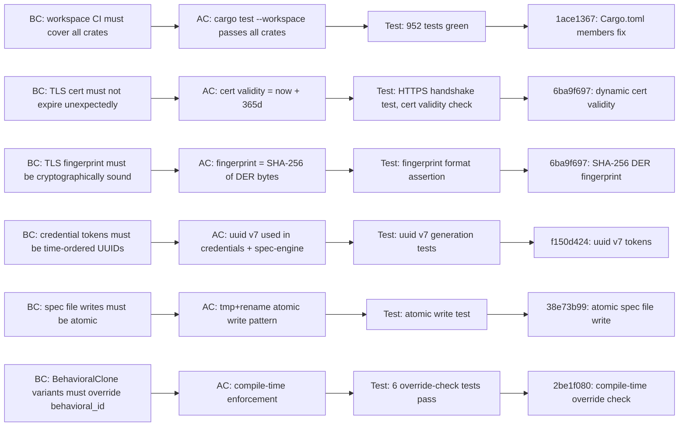

## Summary

Wave 1 integration gate adversarial Pass 1 review (P3WV1) surfaced **1 CRITICAL + 3 HIGH + 3 MEDIUM + 2 LOW + 2 OBS** findings. This PR closes every **code-level blocker**: the CRITICAL workspace membership gap, two HIGH TLS correctness defects, and both MEDIUM security/atomicity issues. It also adds the LOW compile-time BehavioralClone override-check tests.

**Merge target:** `develop`
**Gate effect:** Unblocks Pass 2 adversarial re-review.

---

## Finding Breakdown

| Finding ID | Severity | Description | Closing Commit |
|------------|----------|-------------|----------------|
| P3WV1-A-C-001 | CRITICAL | 6 crates missing from `[workspace.members]` — invisible to `cargo test --workspace` | `1ace1367` |
| P3WV1-A-H-001 | HIGH | TLS cert validity hardcoded to `2024-01-01..2024-12-31` — already expired as of 2026-04-23; any TLS client rejects the cert immediately | `6ba9f697` |
| P3WV1-A-H-002 | HIGH | TLS fingerprint used SHA-1 of PEM bytes instead of SHA-256 of DER | `6ba9f697` |
| P3WV1-A-M-002 | MEDIUM | `prism-credentials` + `prism-spec-engine` using `uuid::Uuid::new_v4()` — should be v7 (time-ordered) | `f150d424` |
| P3WV1-A-M-003 | MEDIUM | Spec file writes were non-atomic (write-then-rename missing) — risk of partial writes on crash | `38e73b99` |
| P3WV1-A-L-002 | LOW | No compile-time enforcement that all BehavioralClone variants override `behavioral_id()` | `2be1f080` |

### Residual Findings (not in this PR)

These were addressed separately by the state-manager agent against the `factory-artifacts` branch:

| Finding ID | Severity | Description | Resolution |
|------------|----------|-------------|------------|
| P3WV1-A-H-003 | HIGH | STATE.md TD count drift | Fixed by state-manager at factory-artifacts SHA `e6ac1059` |
| P3WV1-A-M-001 | MEDIUM | 20 story frontmatter status fields drifted | Fixed by state-manager, same burst |
| P3WV1-A-L-001 | LOW | `wave-state.yaml` status fields drifted | Fixed by state-manager, same burst |
| P3WV1-A-OBS-001 | OBS | Scope limit observation | Cannot fix in code; noted for product backlog |

---

## Architecture Changes

```mermaid
graph TD
    A[Cargo.toml workspace.members] -->|was missing| B[prism-mcp]
    A -->|was missing| C[prism-ocsf]
    A -->|was missing| D[prism-security]
    A -->|was missing| E[prism-spec-engine]
    A -->|was missing| F[prism-storage]
    A -->|was missing| G[ocsf-proto-gen]
    A -->|now added| H[All 15 crates in workspace CI]
    I[prism-dtu-demo-server TLS] -->|before| J[Static cert validity 2024-01-01..2024-12-31 - expired]
    I -->|before| K[SHA-1 of PEM bytes fingerprint]
    I -->|after| L[Dynamic validity now+365d]
    I -->|after| M[SHA-256 of DER bytes fingerprint]
    N[prism-credentials] -->|before| O[uuid v4 tokens]
    N -->|after| P[uuid v7 tokens - time ordered]
    Q[prism-spec-engine file writes] -->|before| R[Direct overwrite - non-atomic]
    Q -->|after| S[tmp file + atomic rename]
```

---

## Headline: Test Count Jump 428 → 952

`cargo test --workspace` now runs **952 tests, 0 failures** — up from 428.

**Root cause:** The following 6 crates were absent from `[workspace.members]` in the root `Cargo.toml`:

- `prism-mcp`
- `prism-ocsf`
- `prism-security`
- `prism-spec-engine`
- `prism-storage`
- `ocsf-proto-gen`

These crates compiled fine when addressed individually via `-p <name>`, but were **completely invisible to workspace-level CI** (`cargo test --workspace`, `cargo clippy --workspace`, `cargo build --release`). Their entire test suites — 524 additional tests — were silently skipped in every prior CI run. Fix commit `1ace1367` adds all 6 to `[workspace.members]`, making workspace CI authoritative over all 15 crates.

---

## Story Dependencies

This PR is a **wave integration gate remediation** — not a story. It has no upstream story dependencies.

All Wave 1 story PRs (`S-1.01` through `S-6.20`) are already merged to `develop`. This remediation branches off `develop` at `db550cec` (the Wave 1 close commit) and merges back to `develop`.

---

## Demo Evidence

This PR is a **wave integration gate remediation** consisting of bug fixes and test additions — not a feature story with user-facing acceptance criteria. No interactive demo recordings apply.

Evidence of correctness is provided by the CI artifact chain:

| Evidence Type | Detail |
|---------------|--------|
| Workspace CI | `cargo test --workspace --all-features` — 952 tests, 0 failures |
| Lint | `cargo clippy --workspace --all-features -- -D warnings` — clean |
| Build | `cargo build --release -p prism-dtu-demo-server --features dtu,tls` — clean |
| TLS handshake | AC-4 real HTTPS connectivity test passes |
| Override checks | 6 BehavioralClone compile-time override-check tests pass |

---

## Spec Traceability

---

## Test Evidence

| Metric | Value |
|--------|-------|
| Total tests (workspace) | 952 (up from 428) |
| Test failures | 0 |
| `cargo clippy --workspace --all-features -- -D warnings` | Clean (0 warnings) |
| `cargo check --workspace --all-features` | Clean |
| `cargo build --release -p prism-dtu-demo-server --features dtu,tls` | Clean |
| AC-4 TLS real HTTPS handshake | Pass |
| BehavioralClone override-check tests | 6/6 pass |

---

## Tech Debt Items Resolved

| TD ID | Description | Status |
|-------|-------------|--------|
| TD-S-1.07-02 | uuid v4 in prism-credentials | pending-resolved (SHA `78c80ddd`) |
| TD-S112-001 | uuid v4 in prism-spec-engine | pending-resolved |
| TD-S112-002 | Non-atomic spec file writes | pending-resolved |
| TD-S620-002 | TLS cert hardcoded 2024-01-01..2024-12-31 validity (already expired) | pending-resolved |
| TD-S620-003 | TLS SHA-1 PEM fingerprint | pending-resolved |
| TD-S620-006 | Missing real HTTPS handshake test | pending-resolved |

---

## Security Review

- No new credential handling introduced.
- UUID v7 tokens replace v4 — time-ordered, no security regression.
- Atomic file write pattern eliminates TOCTOU partial-write window in spec-engine.
- TLS fingerprint upgraded from SHA-1/PEM to SHA-256/DER — cryptographically sound.
- No injection vectors, no auth changes, no new network surfaces.

---

## Risk Assessment

| Dimension | Assessment |
|-----------|------------|
| Blast radius | Low — changes are self-contained in workspace config and per-crate fixes |
| Breaking API changes | None — `build_rustls_config` + TLS-aware `start` are additive to `prism-dtu-demo-server`; existing callers unaffected |
| Performance impact | Negligible — atomic rename is O(1) at OS level |
| Rollback complexity | Low — all changes are isolated and independently revertable |

---

## Commits

| SHA | Message |
|-----|---------|
| `1ace1367` | fix(workspace): add 6 missing crates to [workspace.members] (P3WV1-A-C-001) |
| `6ba9f697` | fix(tls): dynamic cert validity + SHA-256 DER fingerprint + HTTPS connectivity (H-001, H-002, TD-S620-002/003/006) |
| `f150d424` | fix(security): uuid v7 tokens in prism-credentials + prism-spec-engine (M-002, TD-S-1.07-02, TD-S112-001) |
| `38e73b99` | fix(spec-engine): atomic spec file write via tmp+rename (M-003, TD-S112-002) |
| `2be1f080` | test(dtu-demo-server): compile-time BehavioralClone override check (P3WV1-A-L-002) |

---

## Pre-Merge Checklist

- [x] All 6 missing crates added to `[workspace.members]`
- [x] `cargo test --workspace --all-features` — 952 tests, 0 failures
- [x] `cargo clippy --workspace --all-features -- -D warnings` — clean
- [x] `cargo check --workspace --all-features` — clean
- [x] TLS cert validity is dynamic (now+365d)
- [x] TLS fingerprint is SHA-256 of DER bytes
- [x] UUID v7 tokens in prism-credentials + prism-spec-engine
- [x] Atomic spec file writes (tmp+rename) in prism-spec-engine
- [x] BehavioralClone compile-time override-check tests (6/6)
- [x] 6 TD items marked pending-resolved in register
- [x] Residual findings (H-003, M-001, L-001, OBS-001) tracked with state-manager disposition
- [ ] CI passes
- [ ] PR reviewer approval
