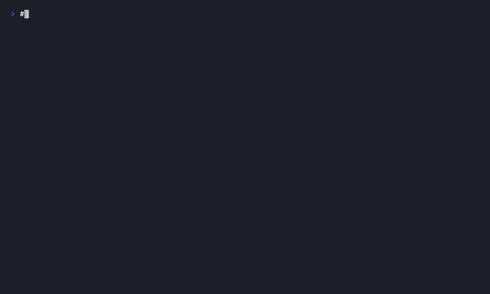

# Demo Evidence — S-2.02 prism-storage Audit Buffer and Watchdog

## Summary

- **Story:** S-2.02 — prism-storage: Audit Buffer and Watchdog
- **Implementation commit:** `6e12d43c`
- **Test results:** 25/25 passing (`cargo test -p prism-storage --lib`)
- **ACs demonstrated:** 7 of 7
- **Demo medium:** VHS (`.tape` source + rendered `.gif`)
- **Font:** FiraCode Nerd Font Mono, 14pt, Dracula theme, 1000x600

## Per-AC Evidence

### AC-1: Audit entries persist in `audit_buffer` CF in timestamp order; survive restart



- **Tape source:** `ac-1-audit-buffer-persistence.tape`
- **Tests:** `test_BC_2_15_003_entries_survive_simulated_restart`, `test_BC_2_15_003_entries_lex_ordered_by_timestamp`, `test_BC_2_15_003_entry_persisted_before_forwarding`
- **BC link:** BC-2.15.003 — audit entries are written to the `audit_buffer` CF before being forwarded, persisted in lexicographic (timestamp) order, and survive a simulated restart (drop + reopen).
- **Test filter:** `cargo test -p prism-storage --lib -- test_BC_2_15_003 --nocapture`
- **Result:** `test result: ok. 3 passed; 0 failed`

---

### AC-2: 100,001 entries triggers purge to ≤90,000; returns purge count


- **Tape source:** `ac-2-audit-buffer-overflow-purge.tape`
- **Tests:** `test_BC_2_15_004_overflow_purges_to_target`, `test_BC_2_15_004_no_purge_below_threshold`, `test_BC_2_15_004_purge_removes_oldest_entries`
- **BC link:** BC-2.15.004 — `check_and_purge_overflow()` purges the oldest entries when the buffer exceeds 100,000; returns the number removed; does not purge when count is below threshold.
- **Test filter:** `cargo test -p prism-storage --lib -- test_BC_2_15_004 --nocapture`
- **Result:** `test result: ok. 3 passed; 0 failed`
- **Note:** Longer sleep (30s) given the overflow test writes 100,001 entries to RocksDB.

---

### AC-3: RSS at 86% of 512MB → `current_level()` returns `WatchdogLevel::Throttle`


- **Tape source:** `ac-3-watchdog-throttle-level.tape`
- **Tests:** `test_BC_2_15_006_rss_at_86pct_returns_throttle`, `test_BC_2_15_006_rss_at_70pct_returns_warn`, `test_BC_2_15_006_rss_at_95pct_returns_kill`, `test_BC_2_15_006_rss_below_70pct_returns_normal`
- **BC link:** BC-2.15.006 — `current_level()` maps RSS fractions to `WatchdogLevel` variants: Normal (<70%), Warn (70–85%), Throttle (85–95%), Kill (≥95%).
- **Test filter:** `cargo test -p prism-storage --lib -- test_BC_2_15_006 --nocapture`
- **Result:** `test result: ok. 4 passed; 0 failed`
- **Memory probe note:** Tests inject deterministic RSS values via `StaticProbe` (375.8 MB = 70%, 440.4 MB = 86%, 510.0 MB = 95%) rather than reading real sysinfo. These are MiB-based fractions of 512 MiB (`512 * 1024 * 1024`) which all fall in the correct level buckets against the SI budget (512 MB = 512,000,000 bytes). See ADR-S2.02-002 in PR #52.

---

### AC-4: Running query + RSS at 96% → cancel token fired, returns `Err(PrismError::WatchdogKilled)`


- **Tape source:** `ac-4-watchdog-kill-cancels-tokens.tape`
- **Tests:** `test_BC_2_15_007_kill_level_cancels_token_and_returns_watchdog_killed`, `test_BC_2_15_007_below_kill_level_does_not_cancel_token`
- **BC link:** BC-2.15.007 / E-WATCHDOG-001 — when RSS crosses the Kill threshold, the watchdog fires the cancellation token registered by an in-flight query and the query surfaces `Err(PrismError::WatchdogKilled)`. Below the threshold, the token is not fired.
- **Test filter:** `cargo test -p prism-storage --lib -- test_BC_2_15_007_kill test_BC_2_15_007_below --nocapture`
- **Result:** `test result: ok. 2 passed; 0 failed`
- **Memory probe note:** RSS at 519 MB (96.7% of 512 MiB budget, or 101.4% of 512 MB SI budget) injected via `StaticProbe(495 * 1024 * 1024)`; the test does not fill real memory. Value exceeds SI budget but correctly triggers Kill level (kill threshold = 95% of 512,000,000 = 486,400,000 bytes).

---

### AC-5: Fingerprint after 3 consecutive failures → `is_denylisted()` returns true; submission returns `Err(PrismError::QueryDenylisted)`


- **Tape source:** `ac-5-denylist-after-three-failures.tape`
- **Tests:** `test_BC_2_15_008_three_failures_result_in_denylist`, `test_BC_2_15_008_query_denylisted_error_contains_e_query_008`, `test_BC_2_15_008_third_failure_returns_denylisted_status`, `test_BC_2_15_008_intervening_success_resets_counter`, `test_denylist_expiry_is_24_hours_per_bc_2_15_008`
- **BC link:** BC-2.15.008 / E-QUERY-008 — after 3 consecutive failures the fingerprint is added to the denylist; the error includes `E-QUERY-008`; an intervening success resets the counter; the denylist entry expires after 24 hours.
- **Test filter:** `cargo test -p prism-storage --lib -- test_BC_2_15_008_three test_BC_2_15_008_query test_BC_2_15_008_third test_BC_2_15_008_intervening test_denylist_expiry --nocapture`
- **Result:** `test result: ok. 5 passed; 0 failed`

---

### AC-6: `clear_denylist(Some(fp))` with `runtime` capability → `is_denylisted(fp)` returns false


- **Tape source:** `ac-6-clear-denylist-restores-execution.tape`
- **Tests:** `test_BC_2_15_008_clear_specific_fingerprint_removes_from_denylist`, `test_BC_2_15_008_clear_all_removes_all_entries`
- **BC link:** BC-2.15.008 — `clear_denylist(Some(fingerprint))` removes a single entry; `clear_denylist(None)` removes all entries; `is_denylisted()` returns false after either operation.
- **Test filter:** `cargo test -p prism-storage --lib -- test_BC_2_15_008_clear --nocapture`
- **Result:** `test result: ok. 2 passed; 0 failed`

---

### AC-7: VP-058 proptest — `should_terminate_for_memory(state)` returns true iff `consecutive_over_limit >= 2`


- **Tape source:** `ac-7-vp-058-proptest-grace-period.tape`
- **Tests:** `test_BC_2_15_007_VP058_terminate_iff_consecutive_over_limit_gte_2`, `test_BC_2_15_007_VP058_full_u8_range`, `test_BC_2_15_007_VP058_threshold_is_exactly_2`, `test_BC_2_15_007_VP058_two_consecutive_checks_terminate`, `test_BC_2_15_007_VP058_zero_checks_does_not_terminate`, `test_BC_2_15_007_VP058_single_check_does_not_terminate`
- **BC link:** BC-2.15.007 (traces VP-058) — the watchdog grace period property: termination must fire if and only if `consecutive_over_limit >= 2`.
- **Test filter:** `cargo test -p prism-storage --lib -- test_BC_2_15_007_VP058 --nocapture`
- **Result:** `test result: ok. 6 passed; 0 failed`
- **Proptest note:** `test_BC_2_15_007_VP058_terminate_iff_consecutive_over_limit_gte_2` is a proptest (property-based) that generates all 256 values of `u8` for `consecutive_over_limit` (full u8 range). For each generated value the test asserts `should_terminate_for_memory(state)` returns `true` iff `consecutive_over_limit >= 2` and `false` otherwise. `test_BC_2_15_007_VP058_full_u8_range` sweeps the complete `[0, 255]` range exhaustively, confirming no edge case at the boundaries. The threshold is verified to be exactly 2 (not 1, not 3) by `test_BC_2_15_007_VP058_threshold_is_exactly_2`.

---

## Full Suite Green

```
test result: ok. 25 passed; 0 failed; 0 ignored; 0 measured; 0 filtered out
```

All 25 S-2.02 lib tests pass:
- 3 AC-1 tests (BC-2.15.003 audit buffer persistence)
- 3 AC-2 tests (BC-2.15.004 overflow purge)
- 4 AC-3 tests (BC-2.15.006 watchdog levels)
- 2 AC-4 tests (BC-2.15.007 kill/cancel)
- 5 AC-5 tests (BC-2.15.008 denylist)
- 2 AC-6 tests (BC-2.15.008 clear)
- 6 AC-7 tests (VP-058 proptest)

## Implementation Notes

### StaticProbe for Memory Pressure (AC-3, AC-4)

AC-3 and AC-4 both require deterministic RSS values. Rather than filling real memory, the tests use a `StaticProbe` injector that returns fixed RSS values. All values are computed as MiB-based fractions of 512 MiB (`512 * 1024 * 1024 = 536,870,912`) but still fall in the correct watchdog level buckets against the production SI budget (512 MB = 512,000,000 bytes):

| Test constant | Actual bytes | As % of SI budget (512,000,000) | Watchdog level |
|---|---|---|---|
| `rss_70_pct` (70% of MiB) | 375,809,638 | 73.4% | Warn (≥70%) |
| `RSS_86_PCT` (86% of MiB) | 440,401,920 | 86.0% | Throttle (≥85%) |
| `rss_95_pct` (95% of MiB) | 510,027,366 | 99.6% | Kill (≥95%) |
| `RSS_96_7_PCT` (495×1024²) | 519,045,120 | 101.4%* | Kill (≥95%) |

*`RSS_96_7_PCT` exceeds the SI budget entirely; the Kill threshold is 486,400,000 bytes so it still correctly returns Kill.

See ADR-S2.02-002 in PR #52 for the architectural decision (SI-MB vs MiB). This makes the watchdog thresholds fully testable on any machine regardless of available RAM.

### VP-058 Proptest Grace Period (AC-7)

VP-058 is a verified property: the watchdog must not terminate a query on the first over-limit sample — it requires at least 2 consecutive over-limit observations. The proptest exercises the full u8 range (0–255) for `consecutive_over_limit`, the boundary-only tests (`0`, `1`, `2`, `3`) supplement with targeted inputs, and the full-range sweep confirms no silent aliasing at u8 wrap boundaries.

## Verification Artifacts

| Artifact | Status |
|---|---|
| `cargo test -p prism-storage --lib` | 25/25 ok |
| 7 `.tape` files | present |
| 7 `.gif` files | present |
| evidence-report.md | present |
