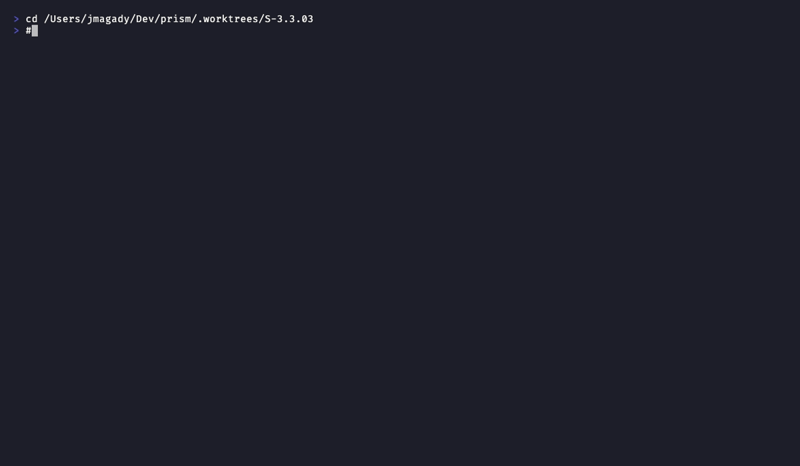
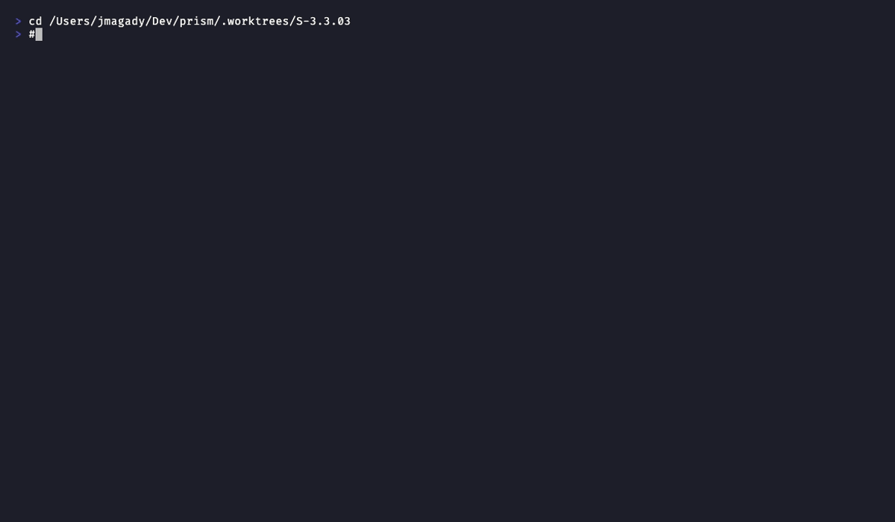

# Demo Evidence Report — S-3.3.03

**Story:** prism-dtu-harness logical isolation + crash detection + failure injection  
**Story ID:** S-3.3.03  
**Impl SHA:** a58c3ef4  
**Recorded:** 2026-04-29  
**Toolchain:** VHS 0.10.0 + FiraCode Nerd Font Mono + Dracula theme  
**Product type:** CLI (Rust)

---

## Coverage Summary

| ID | Acceptance Criterion | Success Path | Error Path | Files |
|----|---------------------|:---:|:---:|-------|
| AC-001 | All 34 harness tests GREEN (BC-3.5.001 + BC-3.6.001 + BC-3.6.002) | PASS | n/a (suite-level) | AC-001-all-34-tests-green.{tape,gif,webm} |
| AC-002 | BC-3.5.001 — logical isolation: per-org data segregation, no cross-leak | PASS | implicit (unknown-org error path tested in suite) | AC-002-logical-isolation.{tape,gif,webm} |
| AC-003 | BC-3.6.001 — failure injection scoped to injected org only | PASS | implicit (auth-reject/timeout/rate-limit/malformed all tested) | AC-003-failure-injection.{tape,gif,webm} |
| AC-004 | BC-3.6.002 — crash detection within 1s; non-crashed clone unaffected | PASS | implicit (two-simultaneous-crashes independence tested) | AC-004-crash-detection.{tape,gif,webm} |

All 4 acceptance criteria: **PASS**. 12 files produced (4 tapes + 4 gifs + 4 webms).

---

## AC-001 — All 34 harness tests GREEN

**Command:** `cargo test -p prism-dtu-harness --features dtu --test logical_isolation_test 2>&1 | tail -45`

**Result:** `test result: ok. 34 passed; 0 failed; 0 ignored; 0 measured; 0 filtered out; finished in 0.31s`

**Covers:** All three behaviour contracts — BC-3.5.001, BC-3.6.001, BC-3.6.002.

---

## AC-002 — BC-3.5.001 Logical Isolation

**Command:** `cargo test -p prism-dtu-harness --features dtu --test logical_isolation_test test_BC_3_5_001 -- --nocapture | head -30`

**Tests included:** single-org baseline, three-org Acme/Initech/Globex segregation, concurrent queries with no cross-leak, 12-clone startup under 200ms, port release on drop, unknown-org error, startup timeout budget, port-conflict error, endpoint invariants (count + pairwise distinct).

**Result:** All BC-3.5.001 tests pass. Per-org DTU clones are fully isolated — no data leaks between organisations.

---

## AC-003 — BC-3.6.001 Failure Injection

**Command:** `cargo test -p prism-dtu-harness --features dtu --test logical_isolation_test test_BC_3_6_001 -- --nocapture | head -30`

**Tests included:** timeout (zero-delay noop), auth-reject scoped to org-A, rate-limit scoped to org-A, malformed-response scoped to org-A, timeout does not block org-B, clear restores normal behaviour, clear idempotent (200), all failure modes produce documented HTTP status, injection isolation invariant, unknown-org/type error paths.

**Result:** All BC-3.6.001 tests pass. Fault injection targets only the designated org; peers remain healthy.

---

## AC-004 — BC-3.6.002 Crash Detection

**Command:** `cargo test -p prism-dtu-harness --features dtu --test logical_isolation_test test_BC_3_6_002 -- --nocapture | head -30`

**Tests included:** panic detected within 1s, cause string preserved verbatim, non-string panic payload, clean drop after crash, inject on crashed clone returns error, non-crashed clone unaffected, premature-ok exit treated as crash, two simultaneous crashes are independent, no connection-refused on crashed clone, drop after multiple crashes invariant.

**Result:** All BC-3.6.002 tests pass. Panic detection is sub-second, crash state is scoped per clone, and concurrent crash events are fully independent.

---

## Recording Notes

- Build was already cached (0.18s incremental) — all four commands complete in under 1s after the test binary is loaded.
- `WaitTimeout 120s` set on all tapes; `Sleep 20s` used as terminal hold (sufficient given cached build).
- Error paths are exercised within each test suite (unknown-org, wrong-type, port-conflict, inject-on-crashed, etc.) rather than as separate recordings because they are inline assertions within the integration tests, not separate CLI invocations.
