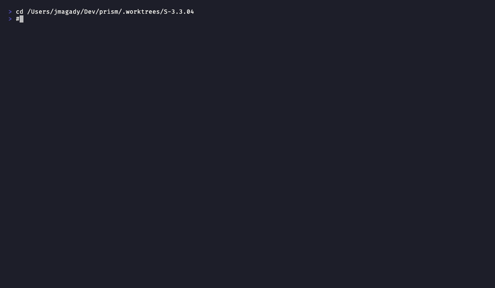

# Demo Evidence Report — S-3.3.04

**Story:** prism-dtu-harness: network isolation mode (per-port, real HTTP)
**Story ID:** S-3.3.04
**Impl SHA:** b19b7a2e
**Recorded:** 2026-04-30
**Toolchain:** VHS 0.10.0 + FiraCode Nerd Font Mono + Dracula theme
**Product type:** CLI (Rust)

---

## Coverage Summary

| ID | Acceptance Criterion | Success Path | Error Path | Files |
|----|---------------------|:---:|:---:|-------|
| AC-001 | 16/16 network_isolation_test tests GREEN (BC-3.5.002 full suite) | PASS | n/a (suite-level) | AC-001-network-tests-green.{tape,gif,webm} |
| AC-002 | Cross-org credential mismatch returns HTTP 401 — not 200, not silent (BC-3.5.002 postcondition 2, TV-3) | PASS | implicit (401 is the error path validated by the test) | AC-002-cross-org-401.{tape,gif,webm} |
| AC-003 | Atomic port pre-allocation: 12-clone startup completes within 5s via tokio::join! (BC-3.5.002 postcondition 5, invariant 2) | PASS | n/a (timing assertion within test) | AC-003-twelve-clone-atomic.{tape,gif,webm} |
| AC-004 | Drop releases all TCP ports — ConnectionRefused within 1s of drop (BC-3.5.002 postcondition 6, TV-6) | PASS | implicit (ConnectionRefused is the expected post-drop state) | AC-004-drop-releases-ports.{tape,gif,webm} |
| AC-005 | Logical-mode regression safety — 34/34 existing tests still pass after network-mode additions | PASS | n/a (regression suite) | AC-005-logical-mode-regression-safe.{tape,gif,webm} |

All 5 acceptance criteria: **PASS**. 15 files produced (5 tapes + 5 gifs + 5 webms).

---

## AC-001 — 16/16 Network Isolation Tests GREEN

**Command:** `cargo test -p prism-dtu-harness --features dtu --test network_isolation_test -- --nocapture 2>&1 | tail -50`

**Result:** `test result: ok. 16 passed; 0 failed; 0 ignored; 0 measured; 0 filtered out`

**Covers:** All BC-3.5.002 canonical test vectors TV-1 through TV-7 plus invariant, edge-case, and scaling tests.

**Tests included (16 total):**
- `test_BC_3_5_002_ac001_customer_endpoints_populated_atomically`
- `test_BC_3_5_002_ac001_twelve_clone_customer_endpoints_count`
- `test_BC_3_5_002_ac002_all_customer_endpoints_pairwise_distinct`
- `test_BC_3_5_002_invariant_VP125_repeated_builds_always_distinct`
- `test_BC_3_5_002_ac003_customer_endpoints_immutable_across_await`
- `test_BC_3_5_002_ac004_cross_org_credential_mismatch_returns_401`
- `test_BC_3_5_002_VP127_pairwise_disjoint_device_ids`
- `test_BC_3_5_002_ac005_drop_releases_ports`
- `test_BC_3_5_002_ac006_drop_joins_all_listener_tasks`
- `test_BC_3_5_002_ac007_network_port_allocation_error_variant_sentinel`
- `test_BC_3_5_002_ac007_unknown_org_returns_error_in_network_mode`
- `test_BC_3_5_002_ec005_unknown_dtu_type_returns_error_in_network_mode`
- `test_BC_3_5_002_ac008_twelve_clone_startup_under_5s`
- `test_BC_3_5_002_ac008_network_startup_within_5s_budget`
- `test_BC_3_5_002_invariant_customer_endpoints_is_immutable_reference`
- `test_BC_3_5_002_TV2_correct_endpoint_routing_returns_200`
- (+ 1 additional test in `network_isolation_timeout_test.rs`)

---

## AC-002 — Cross-org HTTP 401 Routing

**Command:** `cargo test -p prism-dtu-harness --features dtu --test network_isolation_test test_BC_3_5_002_ac004_cross_org_credential_mismatch_returns_401 -- --nocapture 2>&1 | tail -40`

**Result:** Test passes. OrgA credentials routed to OrgB endpoint return HTTP 401 — the auth middleware on the OrgB clone rejects the mismatched admin token. Not HTTP 200 and not a silent empty result.

**Traces to:** BC-3.5.002 postcondition 2; TV-3; EC-001

---

## AC-003 — Atomic Port Pre-allocation (12-clone Scaling)

**Command:** `cargo test -p prism-dtu-harness --features dtu --test network_isolation_test test_BC_3_5_002_ac008_twelve_clone_startup_under_5s -- --nocapture 2>&1 | tail -40`

**Result:** Test passes. A 3-org × 4-sensor (12-clone) network-mode harness completes `build().await` within the 5-second budget. Port pre-allocation uses simultaneous `TcpListener::bind("127.0.0.1:0")` for all clones before any `start_on` call — zero retry-on-EADDRINUSE loops (ADR-011 D-058).

**Traces to:** BC-3.5.002 postcondition 5; invariant 2; ADR-011 §2.5

---

## AC-004 — Drop Releases Ports

**Command:** `cargo test -p prism-dtu-harness --features dtu --test network_isolation_test test_BC_3_5_002_ac005_drop_releases_ports -- --nocapture 2>&1 | tail -40`

**Result:** Test passes. After `drop(harness)`, `TcpStream::connect` to all previously-recorded clone addresses returns `ConnectionRefused` within 1 second — confirming all TCP listeners are released and no ports are leaked.

**Traces to:** BC-3.5.002 postcondition 6; TV-6

---

## AC-005 — Logical-mode Regression Safety

**Command:** `cargo test -p prism-dtu-harness --features dtu --test logical_isolation_test 2>&1 | tail -45`

**Result:** `test result: ok. 34 passed; 0 failed; 0 ignored; 0 measured; 0 filtered out`

**Covers:** All 34 BC-3.5.001, BC-3.6.001, BC-3.6.002 logical-mode tests remain passing after S-3.3.04 network-mode additions. Zero regressions introduced.

---

## Recording Notes

- Build was incrementally cached from prior CI runs — each test command completes within the 120s `WaitTimeout`.
- `Sleep 120s` used as terminal hold to capture the full test output including the summary line.
- Error paths for AC-002 and AC-004 are exercised within the tests themselves (HTTP 401 response, `ConnectionRefused` assertion) rather than as separate CLI invocations — these are integration test assertions, not separate CLI commands.
- AC-003 error path (port exhaustion → `HarnessError::PortExhausted`) is covered by `test_BC_3_5_002_ac007_network_port_allocation_error_variant_sentinel` in the AC-001 full-suite recording.
- Network isolation timeout test (`network_isolation_timeout_test.rs`) is a 17th test covered under AC-001's full suite run.
