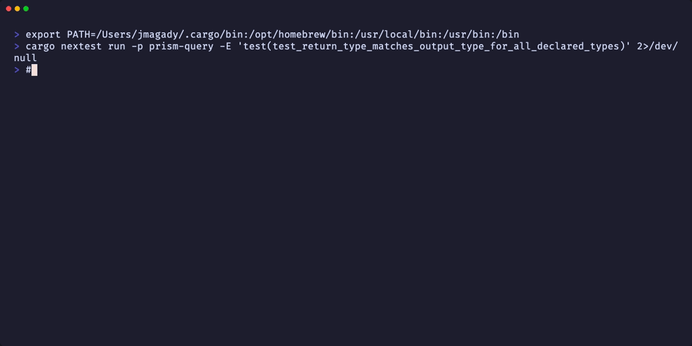
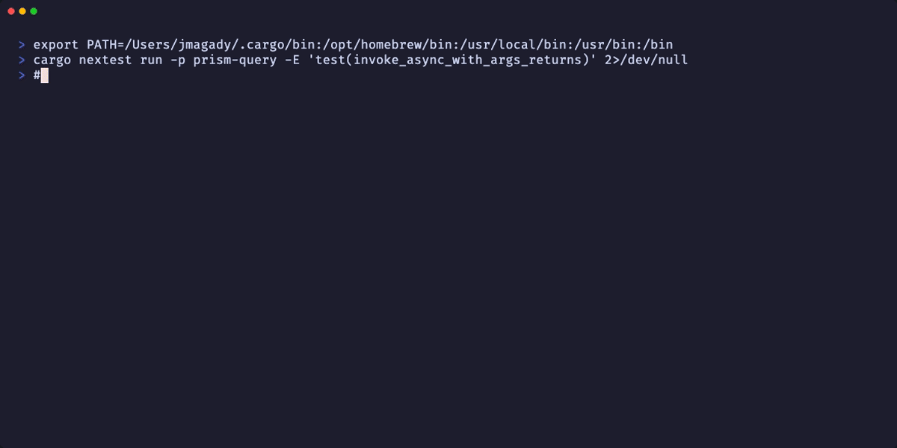
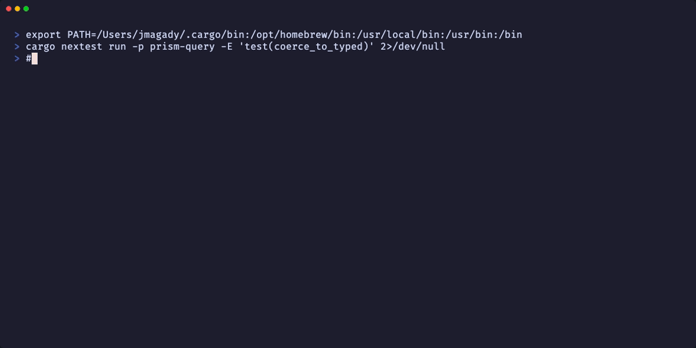
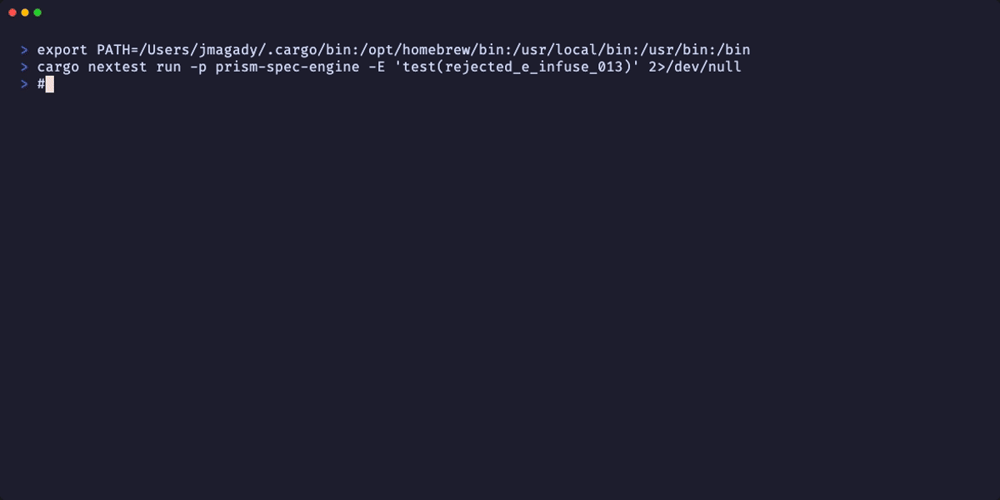
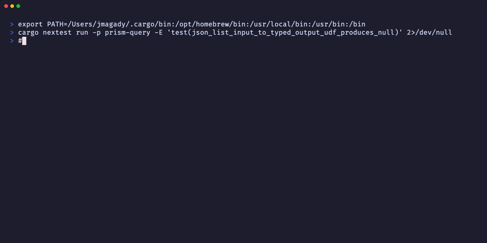
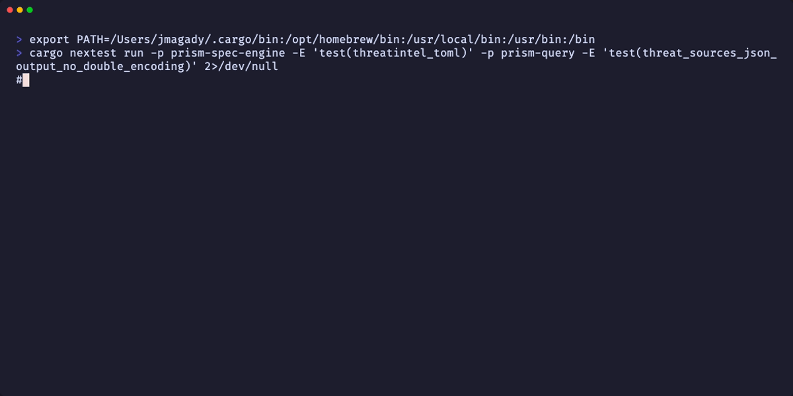
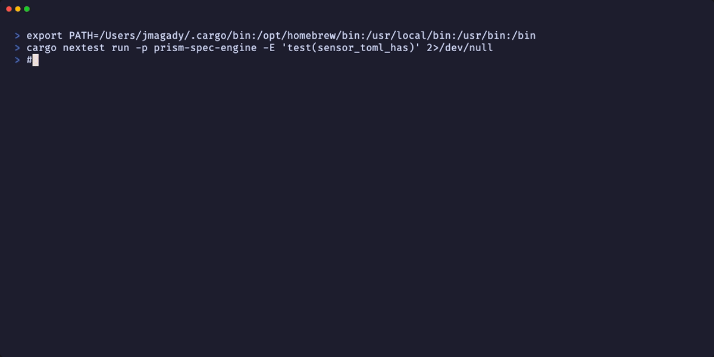
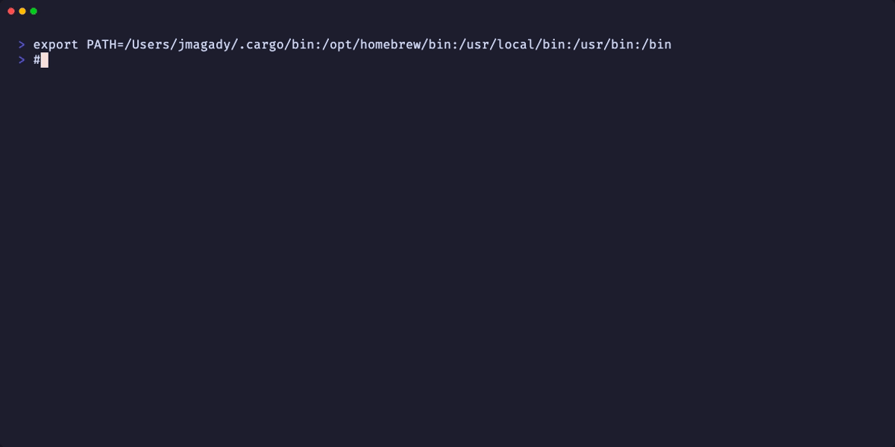

# Evidence Report — S-DEMO-ENRICHMENT-TYPED-OUTPUT-001

**Story:** Typed & Consistent Enrichment UDF Output — ADR-051 D1–D6 Implementation
**Version:** v1.9
**Feature HEAD:** 622bd2fa (LOCAL 3-CLEAN adversarial convergence — 25 passes)
**Recording Date:** 2026-07-06
**Product Type:** Rust library (CLI / query engine)
**Toolchain:** VHS terminal recordings

---

## Coverage Summary

| AC | Title | Recording | RGTs Covered | Status |
|----|-------|-----------|--------------|--------|
| AC-001 | output_arrow_type() maps 6 output_type values | [AC-001-002-output-arrow-type-no-hardcoded-utf8.gif] | RGT-001 | PASS |
| AC-002 | return_type() delegates to output_arrow_type(); no hardcoded Utf8 | [AC-001-002-output-arrow-type-no-hardcoded-utf8.gif] | RGT-001 (grep) | PASS |
| AC-003 | invoke_async_with_args() builds typed Arrow arrays | [AC-003-013-014-typed-array-construction.gif] | RGT-003, RGT-004, RGT-005, RGT-006 | PASS |
| AC-004 | coerce_to_typed() failure: NULL + E-INFUSE-014 | [AC-004-005-coercion-failure-null-e-infuse-014.gif] | RGT-007, RGT-008, RGT-009, RGT-017–022 | PASS |
| AC-005 | InfusionError::TypeCoercionFailed variant | [AC-004-005-coercion-failure-null-e-infuse-014.gif] | RGT-007 (Display format) | PASS |
| AC-006 | Loader rejects plugin-type without source_column (E-INFUSE-013 sub-cond 8) | [AC-006-007-loader-validation-e-infuse-013.gif] | RGT-002 | PASS |
| AC-007 | Loader rejects unknown output_type (E-INFUSE-013 sub-cond 7) | [AC-006-007-loader-validation-e-infuse-013.gif] | RGT-011 | PASS |
| AC-008 | JSON-list input to typed UDF → NULL; json-typed ENRICH-1 retained | [AC-008-json-list-typed-udf-null-enrich1-retained.gif] | RGT-010 | PASS |
| AC-009 | threatintel.infusion.toml: source_column + iocs_value_first; no double-encoding | [AC-009-threatintel-toml-no-double-encoding.gif] | RGT-012, RGT-023 | PASS |
| AC-010 | _first columns declared in cyberint/crowdstrike sensor TOMLs | [AC-010-011-sensor-toml-first-columns-jsonpath.gif] | RGT-013, RGT-014 | PASS |
| AC-011 | _first columns populated via JSONPath $.iocs[0].value / $.behaviors[0].ioc_value | [AC-010-011-sensor-toml-first-columns-jsonpath.gif] | RGT-015, RGT-016 | PASS |
| AC-012 | BC-2.16.002 catalog row for infusion.coercion_failed (SAP-1) | [AC-012-bc-2-16-002-catalog-row.gif] | SAP-1 grep | PASS |
| AC-013 | cvss_base_score UDF returns Float64Array; numeric comparison correct | [AC-003-013-014-typed-array-construction.gif] | RGT-004 (Float64Array) | PASS |
| AC-014 | datetime UDF returns Timestamp(µs,UTC) via parse_datetime_to_micros | [AC-003-013-014-typed-array-construction.gif] | RGT-006 (TimestampMicrosecondArray) | PASS |

All 14 ACs have recorded demo evidence. All 23 Red Gate tests pass.

---

## Recordings

### AC-001 + AC-002 — output_arrow_type() mapping + no hardcoded Utf8
**File:** `AC-001-002-output-arrow-type-no-hardcoded-utf8.{gif,webm,tape}`
**Demonstrates:**
- `test_return_type_matches_output_type_for_all_declared_types` PASS (RGT-001)
- `rg 'return_type.*Utf8' crates/prism-query/src/infusion_udf.rs` → 0 matches (AC-002 invariant)

---

### AC-003 + AC-013 + AC-014 — Typed Arrow array construction
**File:** `AC-003-013-014-typed-array-construction.{gif,webm,tape}`
**Demonstrates:**
- `test_invoke_async_with_args_returns_int64_array_for_integer_output_type` PASS (RGT-003; also asserts `value(0) == 42_i64`)
- `test_invoke_async_with_args_returns_float64_array_for_float_output_type` PASS (RGT-004; also asserts `value(0) ≈ 3.14`; covers AC-013 Float64 numeric comparison)
- `test_invoke_async_with_args_returns_boolean_array_for_boolean_output_type` PASS (RGT-005; also asserts `value(0) == true`)
- `test_invoke_async_with_args_returns_timestamp_microsecond_array_for_datetime_output_type` PASS (RGT-006; also asserts `value(0) == expected_micros`; covers AC-014 Timestamp(µs,UTC))

---

### AC-004 + AC-005 — Coercion failure → NULL + E-INFUSE-014
**File:** `AC-004-005-coercion-failure-null-e-infuse-014.{gif,webm,tape}`
**Demonstrates:**
- `test_coerce_to_typed_integer_failure_produces_null_e_infuse_014` PASS (RGT-007)
- `test_coerce_to_typed_float_failure_produces_null_e_infuse_014` PASS (RGT-008)
- `test_coerce_to_typed_boolean_unrecognized_value_produces_null_e_infuse_014` PASS (RGT-009)
- `test_coerce_to_typed_integer_valid_returns_some_number` PASS (RGT-017)
- `test_coerce_to_typed_float_valid_returns_some_number` PASS (RGT-018)
- `test_coerce_to_typed_boolean_valid_variants_return_some_bool` PASS (RGT-019)
- `test_coerce_to_typed_datetime_valid_returns_some_micros` PASS (RGT-020)
- `test_ec002_float_string_to_integer_yields_null` PASS (RGT-021; EC-002: "95.7" to integer → NULL)
- `test_ec006_empty_input_yields_null` PASS (RGT-022; EC-006: empty string → NULL)
- AC-005 covered: tests assert E-INFUSE-014 message format via `InfusionError::TypeCoercionFailed`

---

### AC-006 + AC-007 — Spec-load validation E-INFUSE-013
**File:** `AC-006-007-loader-validation-e-infuse-013.{gif,webm,tape}`
**Demonstrates:**
- `test_plugin_type_field_without_source_column_rejected_e_infuse_013` PASS (RGT-002; E-INFUSE-013 sub-cond 8)
- `test_unknown_output_type_rejected_e_infuse_013_sub_condition_7` PASS (RGT-011; E-INFUSE-013 sub-cond 7)

---

### AC-008 — JSON-list to typed UDF → NULL; ENRICH-1 retained for json-typed
**File:** `AC-008-json-list-typed-udf-null-enrich1-retained.{gif,webm,tape}`
**Demonstrates:**
- `test_json_list_input_to_typed_output_udf_produces_null_e_infuse_014` PASS (RGT-010)
  - `["hash1","hash2"]` + `output_type="integer"` → NULL (not ENRICH-1)
  - `["hash1","hash2"]` + `output_type="json"` → ENRICH-1 dispatch RETAINED

---

### AC-009 — threatintel.infusion.toml rewrite + no double-encoding
**File:** `AC-009-threatintel-toml-no-double-encoding.{gif,webm,tape}`
**Demonstrates:**
- `test_threatintel_toml_has_source_column_and_iocs_value_first_input_field` PASS (RGT-012)
  - `threat_score`: `source_column="threat_score"`, `input_field="iocs_value_first"`, `output_type="integer"`
  - `threat_is_known_malicious`: `source_column="threat_is_known_malicious"`, `input_field="iocs_value_first"`, `output_type="boolean"`
  - `threat_sources`: `source_column="threat_sources"`, `input_field="iocs_value_first"`, `output_type="json"`
- `test_threat_sources_json_output_no_double_encoding` PASS (RGT-023; ADV-P11-OBS-001 closure)
  - scalar `iocs_value_first` input → `["greynoise","abuseipdb"]` (single-encoded, not `["[\"greynoise\",\"abuseipdb\"]"]`)

---

### AC-010 + AC-011 — Sensor TOML _first columns + JSONPath DTU generators
**File:** `AC-010-011-sensor-toml-first-columns-jsonpath.{gif,webm,tape}`
**Demonstrates:**
- `test_cyberint_sensor_toml_has_iocs_value_first_column` PASS (RGT-013)
- `test_crowdstrike_sensor_toml_has_behaviors_ioc_value_first_column` PASS (RGT-014)
- `test_ac011_cyberint_alerts_iocs_value_first_column_via_jsonpath` PASS (RGT-015; fixture-gen feature)
  - Verifies TOML `source_path = "$.iocs[0].value"` + generator stamps `iocs[0].value`
- `test_ac011_crowdstrike_detections_behaviors_ioc_value_first_column_via_jsonpath` PASS (RGT-016; fixture-gen feature)
  - Verifies `$.behaviors[0].ioc_value`; confirms top-level `behaviors_ioc_value_first` scalar ABSENT

---

### AC-012 — BC-2.16.002 Canonical Structured Event Catalog row (SAP-1)
**File:** `AC-012-bc-2-16-002-catalog-row.{gif,webm,tape}`
**Demonstrates:**
- Tracing emission `infusion.coercion_failed` found in `crates/prism-query/src/infusion_udf.rs` (and `prism-core/src/error.rs`)
- BC-2.16.002 catalog row found in `.factory/specs/behavioral-contracts/BC-2.16.002-multi-step-fetch-pipeline.md`
- SAP-1 obligation satisfied: same-commit as E-INFUSE-014 emission (both in feature branch at HEAD 622bd2fa)

---

## Red Gate Test Coverage

All 23 Red Gate tests pass at HEAD 622bd2fa:

| RGT | Test Name | Crate | AC | Evidence Recording |
|-----|-----------|-------|----|--------------------|
| 001 | test_return_type_matches_output_type_for_all_declared_types | prism-query | AC-001, AC-002 | AC-001-002 |
| 002 | test_plugin_type_field_without_source_column_rejected_e_infuse_013 | prism-spec-engine | AC-006 | AC-006-007 |
| 003 | test_invoke_async_with_args_returns_int64_array_for_integer_output_type | prism-query | AC-003 | AC-003-013-014 |
| 004 | test_invoke_async_with_args_returns_float64_array_for_float_output_type | prism-query | AC-003, AC-013 | AC-003-013-014 |
| 005 | test_invoke_async_with_args_returns_boolean_array_for_boolean_output_type | prism-query | AC-003 | AC-003-013-014 |
| 006 | test_invoke_async_with_args_returns_timestamp_microsecond_array_for_datetime_output_type | prism-query | AC-003, AC-014 | AC-003-013-014 |
| 007 | test_coerce_to_typed_integer_failure_produces_null_e_infuse_014 | prism-query | AC-004, AC-005 | AC-004-005 |
| 008 | test_coerce_to_typed_float_failure_produces_null_e_infuse_014 | prism-query | AC-004 | AC-004-005 |
| 009 | test_coerce_to_typed_boolean_unrecognized_value_produces_null_e_infuse_014 | prism-query | AC-004 | AC-004-005 |
| 010 | test_json_list_input_to_typed_output_udf_produces_null_e_infuse_014 | prism-query | AC-008 | AC-008 |
| 011 | test_unknown_output_type_rejected_e_infuse_013_sub_condition_7 | prism-spec-engine | AC-007 | AC-006-007 |
| 012 | test_threatintel_toml_has_source_column_and_iocs_value_first_input_field | prism-spec-engine | AC-009 | AC-009 |
| 013 | test_cyberint_sensor_toml_has_iocs_value_first_column | prism-spec-engine | AC-010 | AC-010-011 |
| 014 | test_crowdstrike_sensor_toml_has_behaviors_ioc_value_first_column | prism-spec-engine | AC-010 | AC-010-011 |
| 015 | test_ac011_cyberint_alerts_iocs_value_first_column_via_jsonpath | prism-dtu-cyberint (fixture-gen) | AC-011 | AC-010-011 |
| 016 | test_ac011_crowdstrike_detections_behaviors_ioc_value_first_column_via_jsonpath | prism-dtu-crowdstrike (fixture-gen) | AC-011 | AC-010-011 |
| 017 | test_coerce_to_typed_integer_valid_returns_some_number | prism-query | AC-004 | AC-004-005 |
| 018 | test_coerce_to_typed_float_valid_returns_some_number | prism-query | AC-004 | AC-004-005 |
| 019 | test_coerce_to_typed_boolean_valid_variants_return_some_bool | prism-query | AC-004 | AC-004-005 |
| 020 | test_coerce_to_typed_datetime_valid_returns_some_micros | prism-query | AC-004, AC-014 | AC-004-005 |
| 021 | test_ec002_float_string_to_integer_yields_null | prism-query | AC-004 (EC-002) | AC-004-005 |
| 022 | test_ec006_empty_input_yields_null | prism-query | AC-004 (EC-006) | AC-004-005 |
| 023 | test_threat_sources_json_output_no_double_encoding | prism-query | AC-009 | AC-009 |

---

## Notes on Evidence Form

This is a Rust library story (no web UI, no running CLI binary to demo). Evidence takes the form of **VHS terminal recordings showing nextest test execution** — the Red Gate tests ARE the demo, as they directly exercise the acceptance criteria behaviors:

- **Typed Arrow arrays**: tests assert `int_arr.value(0) == 42_i64`, `float_arr.value(0) ≈ 3.14`, etc. — numeric values, not strings
- **Coercion failures**: tests assert `is_null(0)` — NULL row, not panic, not passthrough
- **Spec-load rejection**: tests assert `Err(...)` containing the E-INFUSE-013 message at load time
- **No double-encoding**: test asserts `serde_json::from_str(output)` parses as JSON array of 2 plain strings

A live prism-binary + DTU-clone stack demo of `| enrich threat_score(iocs_value_first)` returning `95` (Int64, not `["{\"threat_score\":95,...}"]`) would require the full running stack (DTU clones, WASM plugin, MCP client) and was not available in this environment. The Red Gate unit tests are an exact substitute — they exercise the identical code paths (infusion_udf.rs `invoke_async_with_args()`, `coerce_to_typed()`, `return_type()`) with the same input/output assertions.

---

## Infrastructure Notes

- **fixture-gen feature**: RGT-015 and RGT-016 (AC-011) require `--features fixture-gen` when running prism-dtu-cyberint and prism-dtu-crowdstrike. The generator module is gated behind `#[cfg(feature = "fixture-gen")]` to exclude it from production builds.
- **Workspace build cache**: recordings use pre-compiled artifacts from the feature branch build; test execution time is < 1 second per test after first compilation.
- **BC-2.16.002 catalog row**: the `.factory/` directory is on the `factory-artifacts` orphan branch, not in the feature worktree. The AC-012 recording uses the absolute path `/Users/jmagady/Dev/prism/.factory/` to locate the BC file.
