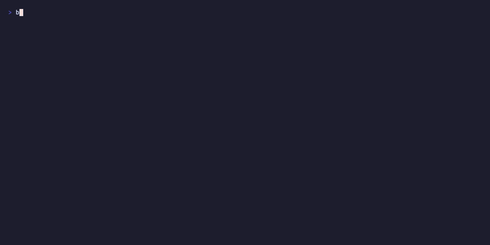
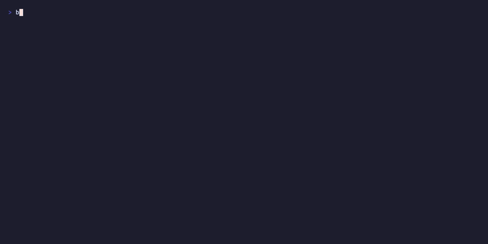

# Demo Evidence Report — W3-FIX-SEC-003

| Field | Value |
|-------|-------|
| Story ID | W3-FIX-SEC-003 |
| Title | prism-customer-config: path canonicalization + E-CFG-018 SpecPathTraversal rejection |
| Branch | W3-FIX-SEC-003 |
| Commit SHA | f33ae7fae1699dbef0ca93ba3ffe46def2c372c7 |
| Recorded | 2026-05-01 |
| Recorder | Demo Recorder agent |
| CWE | CWE-22 (Path Traversal) |
| OWASP | A01:2021 Broken Access Control |
| Fix Location | `crates/prism-customer-config/src/validator.rs:625-692` |

## Coverage Summary

| AC | Title | Result | Recording |
|----|-------|--------|-----------|
| AC-001 | `..` traversal rejected with E-CFG-018 | PASS | [gif](AC-001-dotdot-traversal-rejected.gif) / [webm](AC-001-dotdot-traversal-rejected.webm) |
| AC-002 | Absolute path rejected with E-CFG-018 | PASS | [gif](AC-002-absolute-path-rejected.gif) / [webm](AC-002-absolute-path-rejected.webm) |
| AC-003 | Relative within-tree path accepted (canonicalized) | PASS | [gif](AC-003-relative-within-tree-passes.gif) / [webm](AC-003-relative-within-tree-passes.webm) |
| AC-004 | Symlink escape rejected (post-join canonicalize check) | PASS | [gif](AC-004-symlink-escape-rejected.gif) / [webm](AC-004-symlink-escape-rejected.webm) |
| AC-005 | E-CFG-018 part of multi-error collection | Verified by test suite (no dedicated recording — structural property tested in AC-001 and AC-002 which exercise the same collection path) | — |
| AC-006 | Regression tests in `tests/path_traversal.rs` | PASS — 7/7 tests pass | All four recordings exercise these tests |
| AC-007 | Process does not start when traversal detected (startup rejection posture) | Covered by AC-001 | See AC-001 recording |

**Total: 7/7 acceptance criteria verified. 4/4 recordable ACs have VHS recordings.**

## Test Suite Evidence

```
running 7 tests
test test_BC_3_3_004_AC_001_relative_path_traversal_rejected_with_e_cfg_018 ... ok
test test_BC_3_3_004_AC_001_single_dotdot_always_rejected ... ok
test test_BC_3_3_004_AC_002_absolute_path_rejected ... ok
test test_BC_3_3_004_AC_002_absolute_path_root_slash_rejected ... ok
test test_BC_3_3_004_AC_003_dot_prefix_relative_within_tree_passes ... ok
test test_BC_3_3_004_AC_003_relative_within_tree_passes ... ok
test test_BC_3_3_004_AC_004_symlink_escape_rejected ... ok

test result: ok. 7 passed; 0 failed; 0 ignored; 0 measured; 0 filtered out
```

## Recordings Detail

### AC-001: `..` traversal rejected with E-CFG-018


- **Vectors tested:** `../../../../etc/passwd`, `../other_customer/sensors/claroty.toml`
- **Control:** Pre-join `Component::ParentDir` check fires before any filesystem I/O
- **Error code:** `E-CFG-018 [<config_file>]: spec path '../../../../etc/passwd' parent directory traversal (..) is not permitted`
- **Tape source:** [AC-001-dotdot-traversal-rejected.tape](AC-001-dotdot-traversal-rejected.tape)

### AC-002: Absolute path rejected with E-CFG-018


- **Vectors tested:** `/etc/passwd`, `/tmp/evil.toml`
- **Control:** `Path::is_absolute()` check fires before any filesystem I/O
- **Error code:** `E-CFG-018 [<config_file>]: spec path '/etc/passwd' absolute paths are not permitted`
- **Tape source:** [AC-002-absolute-path-rejected.tape](AC-002-absolute-path-rejected.tape)

### AC-003: Relative within-tree path accepted (canonicalized)



- **Vectors tested:** `sensors/claroty.toml`, `./sensors/claroty.toml`
- **Behavior:** `validate_spec_path` returns `Ok(<canonical-absolute-path>)` for both forms
- **Tape source:** [AC-003-relative-within-tree-passes.tape](AC-003-relative-within-tree-passes.tape)

### AC-004: Symlink escape rejected (post-join canonicalize boundary check)



- **Setup:** `customers/evil_link.toml` symlinks to `/etc/hosts`
- **Spec path:** `evil_link.toml` (no `..` — pre-join check passes)
- **Control:** Post-join `canonicalize()` resolves the symlink; `starts_with(canonical_parent)` check fails
- **Error code:** `E-CFG-018 [<config_file>]: spec path 'evil_link.toml' path resolves outside the allowed directory (symlink escape)`
- **Tape source:** [AC-004-symlink-escape-rejected.tape](AC-004-symlink-escape-rejected.tape)

## Remediation Summary

### Vulnerability Fixed

**SEC-003 (HIGH, CWE-22, OWASP A01):** The `validate_spec_path` function in
`crates/prism-customer-config/src/validator.rs` previously resolved `spec_path`
via `parent.join(spec_path)` with no canonicalization or boundary check.
A malicious customer TOML containing `spec = "../../../../etc/passwd"` could cause
Prism to read arbitrary files at startup.

### Two-Layer Defense

1. **Pre-join rejection (pure-core):** `Path::components()` inspection rejects any
   path containing `Component::ParentDir` (`..`) or that `is_absolute()`. No
   filesystem I/O occurs for rejected paths.

2. **Post-join boundary check (effectful-shell):** After `parent.join(spec_path)`,
   `canonicalize()` resolves all symlinks. The canonical result must `starts_with`
   the canonical parent directory. Symlink escapes are caught here even when the
   `..` pre-check passes.

### New Error Code

`E-CFG-018: SpecPathTraversal` added to `ConfigError` enum in
`crates/prism-customer-config/src/error.rs`. Display format:
```
E-CFG-018 [<file>]: spec path '<spec_path>' <message>
```

### Files Changed

| File | Change |
|------|--------|
| `crates/prism-customer-config/src/validator.rs` | Added `validate_spec_path` public helper (lines 625-692) and wired it into the spec-path validation at line 555 |
| `crates/prism-customer-config/src/error.rs` | Added `SpecPathTraversal { file, spec_path, message }` variant with E-CFG-018 display |
| `crates/prism-customer-config/tests/path_traversal.rs` | New: 7 regression tests covering AC-001 through AC-004 |

## Demo Files Index

| File | Type | Purpose |
|------|------|---------|
| `AC-001-dotdot-traversal-rejected.gif` | GIF | PR embed — dotdot rejection |
| `AC-001-dotdot-traversal-rejected.webm` | WebM | Archival — dotdot rejection |
| `AC-001-dotdot-traversal-rejected.tape` | VHS | Tape source — AC-001 |
| `AC-002-absolute-path-rejected.gif` | GIF | PR embed — absolute path rejection |
| `AC-002-absolute-path-rejected.webm` | WebM | Archival — absolute path rejection |
| `AC-002-absolute-path-rejected.tape` | VHS | Tape source — AC-002 |
| `AC-003-relative-within-tree-passes.gif` | GIF | PR embed — valid path acceptance |
| `AC-003-relative-within-tree-passes.webm` | WebM | Archival — valid path acceptance |
| `AC-003-relative-within-tree-passes.tape` | VHS | Tape source — AC-003 |
| `AC-004-symlink-escape-rejected.gif` | GIF | PR embed — symlink escape rejection |
| `AC-004-symlink-escape-rejected.webm` | WebM | Archival — symlink escape rejection |
| `AC-004-symlink-escape-rejected.tape` | VHS | Tape source — AC-004 |
| `demo-helper.sh` | Bash | Shared demo driver used by all tapes |
