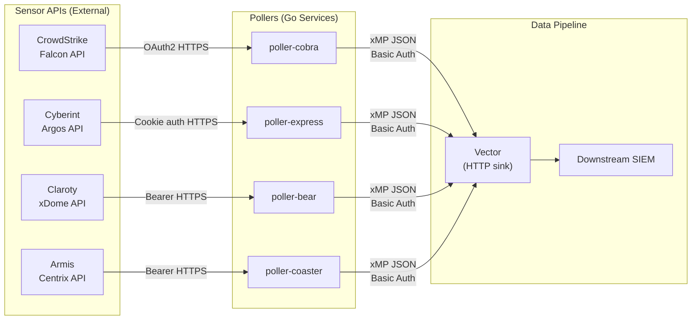
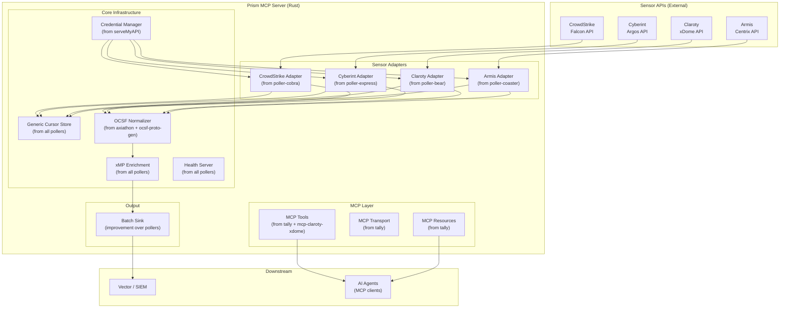

# Phase 0: Cross-Repo Dependency Graph

**Date:** 2026-04-13
**Input:** Pass 8 deep synthesis files for all 9 reference repos
**Purpose:** Map how the 9 reference repos relate to each other and how Prism consumes patterns from each

---

## 1. Repository Taxonomy

The 9 reference repos fall into 5 functional categories:

| Category | Repos | Language | Role in Prism |
|----------|-------|----------|---------------|
| **Sensor Pollers** | poller-cobra (CrowdStrike), poller-express (Cyberint), poller-bear (Claroty), poller-coaster (Armis) | Go | Behavioral specification for 4 sensor integrations |
| **MCP Servers** | tally, serveMyAPI, mcp-claroty-xdome | Rust, TypeScript, TypeScript | MCP protocol patterns, tool registration, transport, error handling |
| **OCSF Infrastructure** | ocsf-proto-gen, axiathon | Rust | OCSF schema generation, protobuf definitions, normalization patterns |
| **Credential Management** | serveMyAPI | TypeScript | OS keyring abstraction, credential CRUD via MCP |
| **Security Lake / SIEM** | axiathon | Rust | Storage, query, detection, tenant isolation patterns |

---

## 2. Cross-Repo Relationship Map

### 2.1 Direct Code-Level Dependencies

There is one actual code-level dependency between repos:

| Upstream | Downstream | Dependency Type | Evidence |
|----------|-----------|-----------------|----------|
| **ocsf-proto-gen** | **axiathon** | Build-time library | axiathon's spike workspace uses ocsf-proto-gen's output .proto files compiled via prost-build in build.rs. The proto generation pipeline is: OCSF JSON -> ocsf-proto-gen -> .proto files -> prost-build -> Rust types |

### 2.2 Shared Data Format Dependencies (Implicit Contracts)

These repos share data formats without sharing code:

| Format | Producers | Consumers | Contract |
|--------|-----------|-----------|----------|
| **xMP Envelope** | poller-cobra, poller-express, poller-bear, poller-coaster | Vector (downstream) | `{"data": <record>, "record_type": "<type>", "xmp": {"site": "...", "cluster_name": "...", "node_name": "..."}}` |
| **OCSF Events (proto)** | ocsf-proto-gen (definitions), axiathon (instances) | axiathon storage, axiathon detection | Proto3 messages per OCSF class, package hierarchy `ocsf.<version>.<category>` |
| **Claroty xDome API** | Claroty platform (external) | poller-bear, mcp-claroty-xdome | Same REST API surface consumed by both repos with different purposes (polling vs querying) |
| **Cursor State JSON** | poller-bear, poller-coaster | Themselves (persistence) | Atomic JSON file with composite cursors, query fingerprints, batch receipts |

### 2.3 Shared Pattern Dependencies (Behavioral Contracts)

These repos implement identical patterns independently:

| Pattern | Repos | Behavioral Contract |
|---------|-------|---------------------|
| Composite Cursor (Timestamp, RecordID) | cobra, express, bear, coaster | Forward-only advancement, lexicographic tiebreaking |
| Query Fingerprint | cobra, express, bear, coaster | SHA-256 of sorted(fields/query) + limit; mismatch is fatal |
| Exponential Backoff | cobra, express, bear, coaster | 2s base, 30s max, configurable retries; MaxRetries=0 = infinite |
| Health Probes | cobra, express, bear, coaster | /health, /live, /ready on dedicated port; readiness tracks collection success |
| Per-IP Rate Limiting | cobra, express, bear, coaster | 100 req/s, burst 20 on health endpoints; token bucket per IP |
| File-Backed Secrets | cobra, express, bear, coaster | `*_FILE` env vars for K8s mounts; file takes priority over direct env var |
| xMP Enrichment | cobra, express, bear, coaster | Identical envelope format wrapping each record |
| Per-Record Sink Delivery | cobra, express, bear, coaster | Individual HTTP POST with Basic Auth to Vector |
| Distroless Container | cobra, express, bear, coaster | Multi-stage Docker, gcr.io/distroless, nonroot, read-only FS, drop ALL caps |
| Dry-Run Config | cobra, express, coaster | `--dry-run` flag validates config, prints redacted values, exits |

---

## 3. Cross-Repo API Contract Extraction

### 3.1 xMP Envelope Format (Universal Poller Output Contract)

All 4 pollers produce identical wire format for downstream consumption:

```json
{
  "data": { /* raw sensor record, structure varies by sensor */ },
  "record_type": "<sensor>_<entity>",
  "xmp": {
    "site": "configured-site-name",
    "cluster_name": "k8s-cluster",
    "node_name": "pod-hostname"
  },
  "ocsf": null  /* poller-bear has this field; others omit it */
}
```

**Record type strings by repo:**

| Repo | Record Types |
|------|-------------|
| poller-cobra | `crowdstrike_alert` (only one active; detection/host stubbed) |
| poller-express | `cyberint_alert`, `cyberint_asset` |
| poller-bear | `alert`, `activity_event`, `audit_log`, `device_alert_relation`, `device_vulnerability_relation`, `server`, `site`, `device`, `vulnerability` (9 types) |
| poller-coaster | `armis_alert`, `armis_activity`, `armis_audit_log`, `armis_risk_factor`, `armis_connection`, `armis_device`, `armis_vulnerability` (7 types) |

**Prism implication:** Prism must produce this exact envelope format for backward compatibility with existing Vector pipelines. The `ocsf` field (from poller-bear) should be standardized across all sensors as optional OCSF normalization output.

### 3.2 Cursor State Contract (Shared Across All Pollers)

All 4 pollers use the same cursor state model, though each implements it independently:

```
Cursor = (Timestamp: string, RecordID: string [, optional additional keys])
PollState = { cursor: Cursor, query_fingerprint: string, last_fetched: timestamp }
QueryFingerprint = SHA-256(sorted(query_config_fields) + "|" + limit)
BatchReceipt = { version: string, count: int, first_id: string, last_id: string, cursor_applied: Cursor }
```

**Variations by repo:**

| Aspect | cobra | express | bear | coaster |
|--------|-------|---------|------|---------|
| Cursor components | (Timestamp, RecordID) | (Timestamp, RecordID) | 2-tuple or 3-tuple (varies by source) | (Timestamp, TypeSpecificID) |
| Store impl | MemoryStore only (BUG) | MemoryStore only | FileStore (atomic write) | FileStore (atomic write) |
| Fingerprint input | query params | sorted field names + limit | sorted fields + limit | AQL query + limit |
| Receipts | None | None | Bounded to 100 | Bounded to configurable max |
| Sources per instance | 1 (alerts only) | 2 (alerts + assets) | 9 data sources | 7 data sources |

**Prism implication:** Prism needs a generic `Cursor` trait that supports variable-arity composite keys, with a `CursorStore` trait that provides durable persistence from day one (fixing the cobra/express MemoryStore bug).

### 3.3 Sensor API Authentication Contracts

| Sensor | Auth Mechanism | Token Lifecycle | Prism Requirement |
|--------|---------------|-----------------|-------------------|
| CrowdStrike (cobra) | OAuth2 Client Credentials | gofalcon SDK manages refresh | Implement OAuth2 flow with reqwest + oauth2 crate |
| Cyberint (express) | Cookie: access_token | Static token, no refresh | reqwest middleware injecting cookie header |
| Claroty (bear) | Bearer token | Static token, no refresh | Standard Authorization: Bearer header |
| Armis (coaster) | Bearer token (via SDK) | SDK manages | reqwest with bearer auth |
| Claroty (mcp-claroty-xdome) | Bearer token | Static from env var | Same as poller-bear |

### 3.4 OCSF Schema Contract (ocsf-proto-gen -> axiathon -> Prism)

The OCSF protobuf contract is defined by ocsf-proto-gen and consumed by axiathon:

```
Proto Package Hierarchy:
  ocsf.<version_slug>.events.<category>          -- Event class messages
  ocsf.<version_slug>.events.<category>.enums    -- Event class enums
  ocsf.<version_slug>.objects                     -- Shared object messages
  ocsf.<version_slug>.objects.enums              -- Object enums

Critical Type Mappings:
  timestamp_t -> int64 (epoch ms, NOT google.protobuf.Timestamp)
  datetime_t  -> string (RFC 3339)
  json_t      -> string (serialized JSON, NOT google.protobuf.Struct)
  float_t     -> double (64-bit)
  object_t    -> qualified message reference (via object_type field)

Output Artifacts:
  .proto files (per-category events + single objects file)
  enum-value-map.json (integer -> caption lookup)
```

**Prism implication:** Prism should consume ocsf-proto-gen as a build-time library dependency (with `default-features = false` for no network), compiling .proto files via prost-build. The enum-value-map.json provides runtime display name lookup.

### 3.5 MCP Protocol Contracts

Three repos implement MCP servers with overlapping patterns:

| Aspect | tally (Rust/rmcp 0.8) | serveMyAPI (TS/MCP SDK) | mcp-claroty-xdome (TS/MCP SDK) |
|--------|----------------------|------------------------|-------------------------------|
| Transport | stdio only | stdio + HTTP/SSE (broken) | HTTP + SSE + Streamable HTTP |
| Tool count | 24 | 4 | 5 |
| Tool registration | `#[tool_router]` macro | Manual per-transport (3x duplication) | DI + factory pattern |
| Input validation | `Parameters<T>` with JsonSchema | Zod schemas | Zod schemas |
| Error mapping | `to_mcp_err()` -> ErrorCode(-1) | String errors | Typed hierarchy -> JSON-RPC codes |
| Resources | 14 (5 static + 9 templates) | None | None (TS), 5 (Python) |
| Prompts | 8 | None | None |
| Server info | ServerHandler trait impl | SDK default | Custom health endpoint |

**Prism implication:** tally is the canonical Rust MCP reference. Its rmcp 0.8 patterns (tool_router, Parameters<T>, ServerHandler) are directly replicable. mcp-claroty-xdome provides the sensor-wrapping architecture pattern (ToolHandler -> Service -> ApiClient). serveMyAPI provides the credential management domain model.

---

## 4. Data Flow Between Repos

### 4.1 Current Production Data Flow



### 4.2 Prism Target Data Flow (Unified)



### 4.3 Cross-Boundary Data That Prism Must Handle

| Data Crossing | Source | Destination | Format | Transformation |
|--------------|--------|-------------|--------|---------------|
| Sensor API responses | External APIs | Sensor adapters | Vendor-specific JSON | Deserialized into adapter-specific types |
| Raw records | Sensor adapters | OCSF normalizer | Adapter types | Mapped to OCSF proto DynamicMessage |
| Normalized events | OCSF normalizer | xMP enrichment | OCSF proto + metadata | Wrapped in xMP envelope |
| Enriched payloads | xMP enrichment | Sink | JSON (xMP envelope) | Serialized for HTTP POST |
| Cursor state | Sensor adapters | Cursor store | Generic cursor type | Persisted (file/DB) |
| Credentials | Credential manager | Sensor adapters | String (API key/token) | Retrieved from OS keyring or encrypted file |
| Query results | MCP tools | AI agents | JSON via MCP protocol | Formatted as CallToolResult |

---

## 5. Dependency Graph: How Prism Consumes Each Repo

```mermaid
graph TD
    PRISM["Prism<br/>(Rust MCP Server)"]

    subgraph "Pattern Sources: Sensor Integration"
        PC["poller-cobra<br/>(CrowdStrike)"]
        PE["poller-express<br/>(Cyberint)"]
        PB["poller-bear<br/>(Claroty)"]
        PCO["poller-coaster<br/>(Armis)"]
    end

    subgraph "Pattern Sources: MCP Protocol"
        TALLY["tally<br/>(Rust MCP reference)"]
        MCP_CL["mcp-claroty-xdome<br/>(Sensor MCP wrapper)"]
    end

    subgraph "Pattern Sources: Infrastructure"
        SMA["serveMyAPI<br/>(Credential mgmt)"]
        OPG["ocsf-proto-gen<br/>(Proto generation)"]
        AXI["axiathon<br/>(OCSF + Storage + Query)"]
    end

    PC -->|"CrowdStrike API contract<br/>OAuth2 flow, two-step fetch<br/>32 alert fields"| PRISM
    PE -->|"Cyberint API contract<br/>Cookie auth, 52 AlertData types<br/>Asset polling, CyberintTime"| PRISM
    PB -->|"Claroty API contract<br/>9 endpoints, POST-for-read<br/>Polymorphic JSON, 3-tuple cursors"| PRISM
    PCO -->|"Armis API contract<br/>AQL queries, 7 sources<br/>Timestamp fallback chains"| PRISM

    PC -->|"Cursor pattern, xMP envelope<br/>Health probes, backoff<br/>File secrets, query fingerprint"| PRISM
    PE -->|"Duplicate collector anti-pattern<br/>(do NOT replicate)"| PRISM
    PB -->|"FileStore atomic write<br/>Batch receipts, OCSF stub<br/>9x duplication lesson"| PRISM
    PCO -->|"Generic collector design<br/>Variation table pattern<br/>hasMore pagination"| PRISM

    TALLY -->|"rmcp 0.8 patterns<br/>tool_router macro<br/>Parameters&lt;T&gt; + JsonSchema<br/>ServerHandler impl<br/>Stdio transport<br/>Dual CLI/MCP"| PRISM
    MCP_CL -->|"ToolHandler -> Service -> ApiClient<br/>Zod schema pattern (schemars equiv)<br/>Per-service cache isolation<br/>Error hierarchy -> JSON-RPC codes"| PRISM

    SMA -->|"keyring-rs API mapping<br/>CredentialStore trait design<br/>findCredentials index pattern<br/>Docker fallback (encrypted)"| PRISM
    OPG -->|"Build-time library dependency<br/>OCSF type mapping table<br/>Proto package hierarchy<br/>Enum value map"| PRISM
    AXI -->|"DynamicMessage pattern<br/>Two-tier columnar storage<br/>Field alias resolution<br/>TenantFilterRule<br/>Vendor extension via unmapped<br/>Security-hardened parsing"| PRISM

    style OPG fill:#e6f3ff,stroke:#0066cc
    style AXI fill:#e6f3ff,stroke:#0066cc
    style TALLY fill:#e6ffe6,stroke:#009900
```



**Legend:**
- Blue fill = potential direct code dependency (library or generated artifacts)
- Green fill = primary architectural reference
- Arrows = pattern/knowledge consumption (not runtime dependency)

### 5.1 Consumption Mode Per Repo

| Repo | Consumption Mode | What Prism Takes |
|------|-----------------|------------------|
| **ocsf-proto-gen** | **Direct library dependency** in build.rs | Proto generation, type mapping table, enum value map |
| **axiathon** | **Architectural reference** (no code dependency) | DynamicMessage pattern, two-tier storage, field alias, tenant isolation |
| **tally** | **Primary Rust MCP reference** (no code dependency) | rmcp 0.8 tool registration, transport, error bridge, serde conventions |
| **poller-cobra** | **Behavioral specification** | CrowdStrike API contract, OAuth2 flow, alert field mapping |
| **poller-express** | **Behavioral specification** | Cyberint API contract, cookie auth, CyberintTime parsing |
| **poller-bear** | **Behavioral specification** | Claroty API contract (9 endpoints), polymorphic JSON handling, FileStore pattern |
| **poller-coaster** | **Behavioral specification** | Armis API contract (7 sources), AQL query forwarding, timestamp fallback chains |
| **mcp-claroty-xdome** | **Architectural reference** | Sensor MCP wrapper pattern, cache isolation, error hierarchy |
| **serveMyAPI** | **Domain reference** | Credential management domain model, keyring abstraction |

---

## 6. Shared Domain Concepts Across Repos

### 6.1 Universal Concepts (Present in 4+ Repos)

| Concept | Repos | Prism Design Implication |
|---------|-------|--------------------------|
| **Composite Cursor** | cobra, express, bear, coaster | Generic `Cursor` trait with `PartialOrd`, variable-arity composite keys. Each sensor adapter provides its own cursor type. |
| **Query Fingerprint** | cobra, express, bear, coaster | Generic fingerprint utility: `SHA-256(sorted(config_fields) + delimiter + limit)`. Must be sensor-agnostic. |
| **Forward Progress Invariant** | cobra, express, bear, coaster | Shared `ensure_forward_progress<C: Cursor>()` utility. Fix inconsistency: 3/7 coaster collectors use sentinel error, 4/7 use plain error. |
| **xMP Enrichment Envelope** | cobra, express, bear, coaster | `EnrichedPayload<T> { data: T, record_type: String, xmp: XmpMetadata, ocsf: Option<OcsfEvent> }` |
| **Exponential Backoff** | cobra, express, bear, coaster | Shared `BackoffConfig { base_delay, max_delay, max_retries }` with `MaxRetries(0) = unlimited` semantics. |
| **Health Server (K8s probes)** | cobra, express, bear, coaster, mcp-claroty-xdome | `/health`, `/live`, `/ready` with readiness tracking collection state. Enable probes by default (fix poller anti-pattern). |
| **File-Backed Secrets** | cobra, express, bear, coaster | `resolve_secret(file_env, direct_env) -> Result<String>` utility. File takes priority. |
| **Per-Record Sink Delivery** | cobra, express, bear, coaster | Anti-pattern in all pollers. Prism should batch. But must preserve per-record error attribution. |
| **MCP Tool Registration** | tally, serveMyAPI, mcp-claroty-xdome | rmcp `#[tool_router]` macro with `Parameters<T>` input types deriving `JsonSchema`. |
| **Structured Error Types** | tally, mcp-claroty-xdome, axiathon | `thiserror` enum with `#[non_exhaustive]`, actionable error messages, mapped to MCP error codes. |

### 6.2 Sensor-Specific Concepts (Present in 2-3 Repos)

| Concept | Repos | Notes |
|---------|-------|-------|
| **Claroty xDome API** | poller-bear, mcp-claroty-xdome | Both consume same REST API. poller-bear polls 9 endpoints; mcp-claroty-xdome queries 5. Both use POST-for-read, Bearer auth. |
| **OCSF Event Normalization** | axiathon, ocsf-proto-gen, poller-bear (stub) | ocsf-proto-gen defines the schema; axiathon implements DynamicMessage wrapping; poller-bear has OCSF types but stub mapper. |
| **Atomic File Persistence** | poller-bear, poller-coaster | temp-file -> fsync -> rename pattern for crash-safe cursor state. |
| **Batch Receipts** | poller-bear, poller-coaster | Audit trail per source: version, count, first/last IDs, cursor applied. Bounded to N most recent. |
| **Per-IP Rate Limiting** | cobra, express, bear, coaster | Token bucket per IP on health endpoints. All have unbounded map (memory leak). Prism must add LRU eviction. |
| **Credential Store Trait** | serveMyAPI, axiathon | serveMyAPI: keytar/file backends. axiathon: AES-256-GCM vault. Prism needs `CredentialStore` trait with keyring + encrypted file backends. |
| **Session Management** | mcp-claroty-xdome, tally | mcp-claroty-xdome: UUID sessions with no expiration (bug). tally: no sessions (stdio only). Prism needs proper session lifecycle. |
| **N-way Code Duplication** | poller-bear (9x), poller-coaster (7x), poller-express (2x) | All pollers duplicate their collection loop per data source. Prism's generic `DataSource` trait eliminates this. |

### 6.3 Unique Concepts (Single Repo, High Value for Prism)

| Concept | Repo | Prism Relevance |
|---------|------|-----------------|
| **DynamicMessage for OCSF** | axiathon | Foundational pattern -- avoid typed enum approach |
| **Two-Tier Columnar Storage** | axiathon | Hot flat columns + event_data JSON for DataFusion perf |
| **Three-Tier Field Alias** | axiathon | analyst shortcut -> canonical -> OCSF path resolution |
| **TenantFilterRule** | axiathon | Query optimizer-level tenant isolation |
| **Table-Per-Class Routing** | axiathon | Separate Iceberg table per OCSF event class |
| **Detection DSL (.axd)** | axiathon | Single/correlation/sequence match tiers |
| **rmcp tool_router Macro** | tally | Declarative MCP tool registration in Rust |
| **Parameters<T> + JsonSchema** | tally | Type-safe MCP input with auto-generated schemas |
| **Dual CLI/MCP Interface** | tally | Same domain logic accessible via CLI and MCP |
| **Permission Marker Pattern** | serveMyAPI | Probe keyring at startup to consolidate OS permission prompts |
| **Cookie-Based Auth Middleware** | poller-express | Custom HTTP transport for Cyberint's cookie auth |
| **Polymorphic JSON Handling** | poller-bear | IDs returned as string OR number; flexible parsing required |
| **AQL Query Forwarding** | poller-coaster | Client-side filtering after server-side query (Armis pattern) |
| **CyberintTime Multi-Format** | poller-express | 4 timestamp parse formats for single API |

---

## 7. Cross-Repo Inconsistencies Prism Must Resolve

| Inconsistency | Repos | Resolution for Prism |
|--------------|-------|---------------------|
| Health port | cobra/express: 7322, bear: 7321, coaster: 7322 | Single configurable health port per Prism instance |
| State persistence | cobra/express: MemoryStore only (bug), bear/coaster: FileStore | Durable persistence from day one; MemoryStore for tests only |
| Sink record_type prefix | cobra: none, express: none, bear: none, coaster: `armis_` prefix | Standardize: `<sensor>_<entity>` for all (e.g., `crowdstrike_alert`, `claroty_device`) |
| Error handling | cobra: sentinel errors, bear: sentinel + plain mixed, coaster: 3/7 sentinel 4/7 plain | Uniform `thiserror` enum with one variant per error category |
| Cursor components | cobra/express: 2-tuple, bear: 2 or 3-tuple, coaster: 2-tuple | Generic cursor trait supporting variable arity |
| Auth mechanism | cobra: OAuth2, express: cookie, bear/coaster: bearer | Per-sensor auth strategy behind a trait |
| OCSF support | bear: stub (types exist, mapper returns nil), axiathon: DynamicMessage | Use axiathon's DynamicMessage approach; do not port bear's stub |
| Log framework | pollers: charmbracelet/log, tally: tracing, axiathon: tracing | Use tracing + tracing-subscriber uniformly |
| Config prefix | cobra: `CROWDSTRIKE_*`, bear: `CLAROTY_*/POLLER_BEAR_*`, coaster: `ARMIS_*` (5 schemes!) | Standardize: `PRISM_<SENSOR>_*` for all |
| Probes default | All pollers: disabled by default | Enable by default in Prism |

---

## 8. Priority-Ordered Pattern Adoption for Prism

### Tier 1: Must adopt as-is (correctness depends on these)

1. **Sensor API contracts** -- exact endpoints, auth mechanisms, pagination, field mappings from all 4 pollers
2. **xMP envelope format** -- wire compatibility with existing Vector pipeline
3. **OCSF type mapping table** -- from ocsf-proto-gen, production-validated
4. **rmcp 0.8 patterns** -- from tally, only Rust MCP reference available
5. **Composite cursor with forward progress** -- from all pollers, core correctness mechanism

### Tier 2: Must adopt with improvements

6. **Generic DataSource trait** -- fixes N-way duplication in bear (9x), coaster (7x), express (2x)
7. **Durable cursor persistence** -- atomic file write from bear/coaster, fixing cobra/express MemoryStore bug
8. **CredentialStore trait** -- from serveMyAPI, adding encryption and keyring-rs
9. **ToolHandler -> Service -> ApiClient** -- from mcp-claroty-xdome, with Rust trait-based DI
10. **Error hierarchy** -- from tally (thiserror) + mcp-claroty-xdome (JSON-RPC mapping)

### Tier 3: Should adopt (high value, design-time)

11. **DynamicMessage for OCSF** -- from axiathon, avoids typed enum scaling problem
12. **Three-tier field alias** -- from axiathon, decouples queries from OCSF schema evolution
13. **TenantFilterRule** -- from axiathon, defense-in-depth tenant isolation
14. **Batch sink delivery** -- improvement over all pollers' per-record POST anti-pattern
15. **Security-hardened parsing** -- from axiathon, CWE-referenced limits

### Tier 4: Consider (lower priority or future)

16. **Two-tier columnar storage** -- from axiathon, only if Prism includes storage layer
17. **Detection DSL** -- from axiathon, only if Prism includes detection capability
18. **MCP Resources** -- from tally (14 resources) + mcp-claroty-xdome Python (5 resources)
19. **MCP Prompts** -- from tally (8 prompts)
20. **Dual CLI/MCP interface** -- from tally, valuable for operator tooling

---

## State Checkpoint

```yaml
phase: 0
step: 1
status: complete
repos_analyzed: 9
cross_repo_relationships: 3 direct + 10 shared patterns + 7 shared formats
api_contracts_extracted: 15 (4 sensor APIs + xMP envelope + cursor state + 5 MCP + OCSF proto + 3 auth)
data_flows_mapped: 2 (current production + Prism target)
shared_concepts: 10 universal + 7 sensor-specific + 14 unique high-value
inconsistencies: 10 requiring resolution
pattern_priorities: 20 ordered across 4 tiers
timestamp: 2026-04-13T00:00:00Z
```
