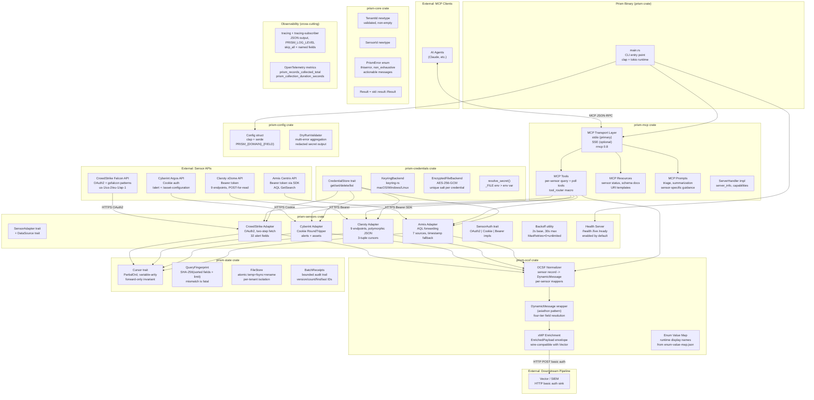
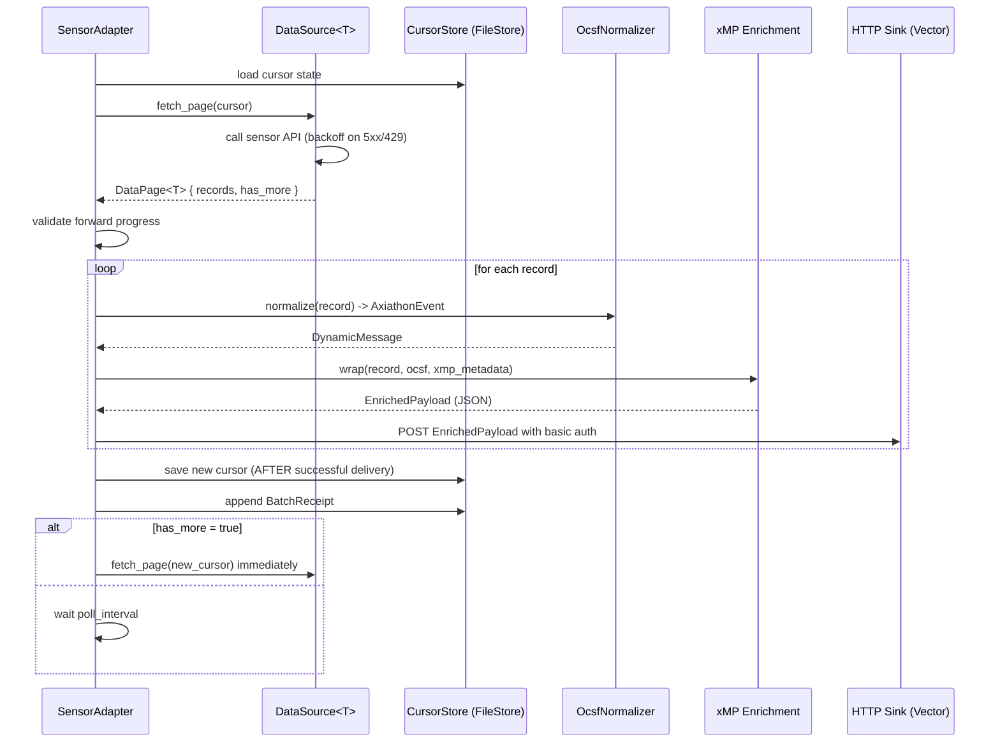
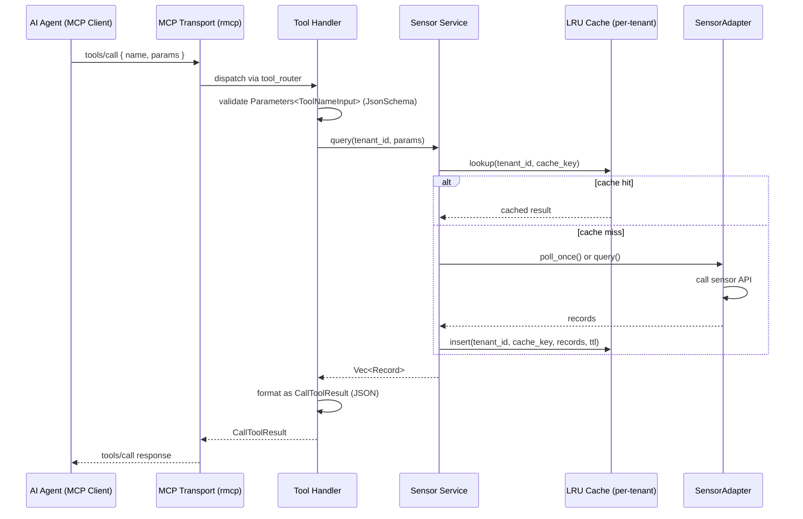
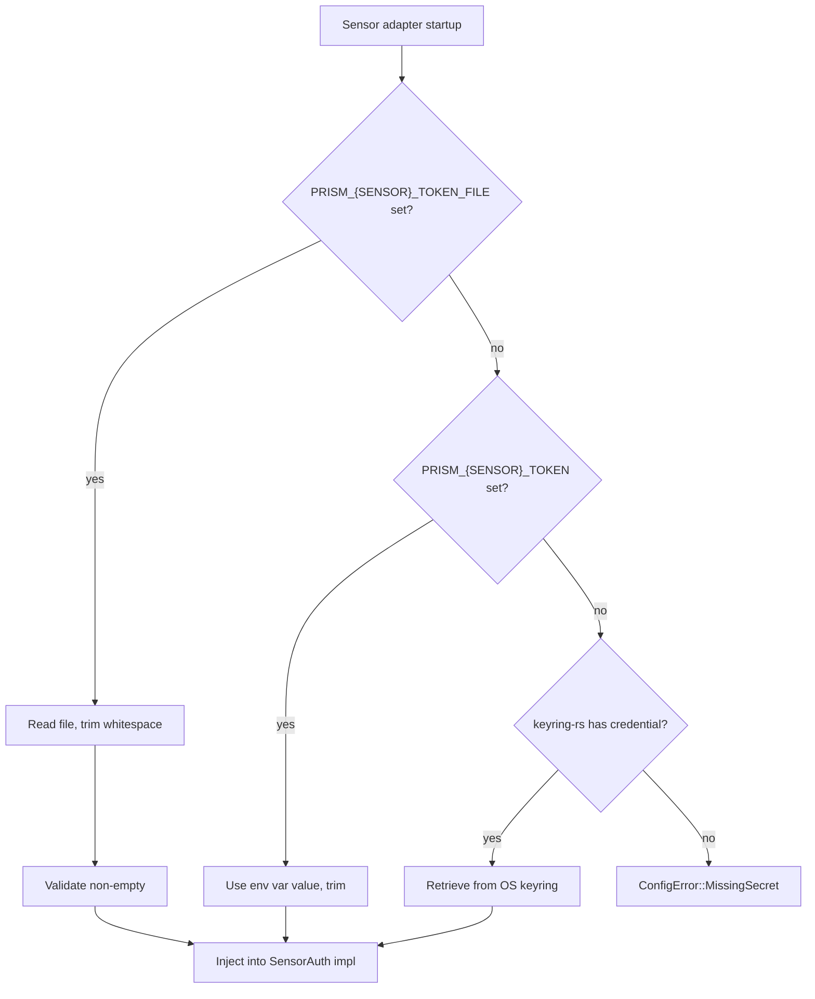

# Recovered Architecture -- Prism Unified MCP Security Server

**Date:** 2026-04-13
**Phase:** Multi-Repo Phase 0 Synthesis -- Step 2
**Input:** 9 pass-8 synthesis files + cross-repo-dependencies.md + convention-reconciliation.md + unified-security-posture.md
**Purpose:** Single authoritative architecture reference for Prism design, specification, and implementation

---

## 1. System Architecture Overview

Prism is a single Rust binary that exposes security sensor data to AI agents via the Model Context Protocol (MCP). It replaces four independent Go polling services (poller-cobra, poller-express, poller-bear, poller-coaster) with a unified, multi-tenant, OCSF-normalized MCP server. Prism is not a replacement for the Vector/SIEM pipeline -- it is a complementary query and collection layer that AI agents can interrogate directly.

### 1.1 Primary Responsibilities

1. **Sensor adapters** -- Poll CrowdStrike, Cyberint, Claroty xDome, and Armis Centrix APIs using the exact behavioral contracts recovered from the four Go pollers.
2. **OCSF normalization** -- Map all sensor records to OCSF v1.7.0 protobuf messages using axiathon's DynamicMessage pattern, with ocsf-proto-gen as the build-time schema source.
3. **MCP server** -- Expose normalized security data as MCP tools, resources, and prompts using rmcp 0.8, following tally's architecture as the primary reference.
4. **xMP enrichment** -- Produce the xMP envelope format for backward compatibility with existing Vector pipelines.
5. **Durable state** -- Persist composite cursor state and query fingerprints across restarts, fixing the MemoryStore bug present in poller-cobra and poller-express.
6. **Credential management** -- Abstract OS keyring and encrypted file credential storage, fixing serveMyAPI's critical vulnerabilities.
7. **Multi-tenant isolation** -- Isolate all state, caches, logs, and error messages per MSSP client tenant, using axiathon's 9-layer tenant isolation model.

### 1.2 Component Diagram



---

## 2. Layer Structure

Prism has eight well-defined layers. The layers are listed in order from the transport boundary inward to domain infrastructure.

### Layer 1: MCP Transport

**Crate:** `prism-mcp`
**Reference:** tally (rmcp 0.8, primary), mcp-claroty-xdome (SSE/HTTP transport patterns)

The outermost layer handles the MCP JSON-RPC 2.0 protocol. It uses the `rmcp` 0.8 crate from tally.

| Component | Pattern | Source |
|-----------|---------|--------|
| Stdio transport | `ServiceExt::serve(stdio())` | tally (production-tested) |
| SSE transport | `ServiceExt::serve(sse())` | mcp-claroty-xdome (TypeScript) adapted to rmcp |
| `ServerHandler` trait impl | `server_info()` returns name + version | tally |
| Session management | UUID-based sessions with TTL eviction | mcp-claroty-xdome (fixes no-expiration bug) |

**Key constraint:** stdout is reserved exclusively for MCP JSON-RPC. All logs, diagnostics, and metrics write to stderr. This is the same convention used by tally.

### Layer 2: MCP Tool / Prompt / Resource Layer

**Crate:** `prism-mcp`
**Reference:** tally (tool_router macro, Parameters\<T\>, JsonSchema), mcp-claroty-xdome (per-sensor tool patterns)

| Component | Pattern | Notes |
|-----------|---------|-------|
| Tool registration | `#[tool_router]` macro, `Parameters<T: JsonSchema>` | From tally |
| Input types | `{ToolName}Input` naming suffix | From tally (`RecordFindingInput`) |
| Resources | URI templates `prism://sensor/{sensor_id}/...` | From tally's 14-resource model |
| Prompts | Triage, summarization, per-sensor investigation | From tally's 8-prompt model |
| Error mapping | `From<PrismError> for McpError` centralized impl | Improves tally's distributed `to_mcp_err()` |

The tool surface is organized by sensor (one module per adapter) plus cross-sensor tools (OCSF query, tenant management). Each tool module follows the `ToolHandler -> Service -> SensorAdapter` pattern recovered from mcp-claroty-xdome.

### Layer 3: Sensor Adapter Layer

**Crate:** `prism-sensors`
**Reference:** All 4 Go pollers (behavioral specifications), mcp-claroty-xdome (wrapper pattern)

The central layer. All sensor-specific behavior lives here. A generic `DataSource<T>` trait eliminates the N-way duplication found in the Go pollers (9x in poller-bear, 7x in poller-coaster, 2x in poller-express).

```
SensorAdapter trait
  fn sensor_id(&self) -> SensorId
  fn tenant_id(&self) -> TenantId
  async fn poll_once(&self, cursor: Option<&dyn Cursor>) -> Result<PollResult>
  async fn verify_connectivity(&self) -> Result<()>

DataSource<T: Serialize> trait
  fn source_id(&self) -> SourceId
  fn record_type(&self) -> &str
  async fn fetch_page(&self, cursor: Option<&dyn Cursor>) -> Result<DataPage<T>>
  fn cursor_from_record(&self, record: &T) -> Result<Box<dyn Cursor>>
```

Per-sensor details recovered from pass-8 synthesis:

| Sensor | Sources | Auth | Cursor Type | Special Handling |
|--------|---------|------|-------------|-----------------|
| CrowdStrike | alerts (+ detection/host stubs) | OAuth2 client credentials, auto-refresh | (Timestamp, RecordID) | Two-step fetch: QueryV2 IDs -> PostEntities details; multi-region |
| Cyberint | alerts, assets | Cookie RoundTripper (access_token cookie) | (Timestamp, RecordID) | CyberintTime multi-format parsing (4 formats); customer ID from subdomain |
| Claroty xDome | alerts, ot_activity_events, audit_logs, device_alert_relations, device_vulnerability_relations, servers, sites, devices, vulnerabilities (9) | Bearer token | 2-tuple or 3-tuple depending on source | POST-for-read; polymorphic IDs (string OR number); audit_log uses Offset-based hybrid cursor |
| Armis Centrix | alerts, activities, audit_logs, risk_factors, connections, devices, vulnerabilities (7) | Bearer token via SDK | (Timestamp, TypeSpecificID) | AQL forwarding via SDK GetSearch; 1-3 timestamp fallback chain; 2-4 ID fallback chain |

### Layer 4: OCSF Normalization Layer

**Crate:** `prism-ocsf`
**Reference:** axiathon (DynamicMessage pattern), ocsf-proto-gen (build-time library dependency)

The normalization layer translates sensor-specific record types into OCSF v1.7.0 protobuf messages. The key architectural decision (ADR-004) is to use axiathon's `DynamicMessage` wrapper rather than per-class typed enums, enabling runtime field access across all 83 OCSF event classes without per-class code generation.

Build pipeline (in `build.rs`):
```
OCSF JSON schema -> ocsf-proto-gen (default-features=false) -> .proto files -> prost-build -> Rust types
```

Runtime field access follows axiathon's four-tier resolution:
1. Prism-specific fields (metadata injected by adapter)
2. Proto descriptor fields via recursive descent into DynamicMessage
3. Unmapped JSON blob (vendor extension fields)
4. None (field absent)

The `enum-value-map.json` generated by ocsf-proto-gen provides runtime integer-to-caption lookup for all OCSF enums.

The xMP enrichment envelope is the wire format for downstream Vector compatibility:
```json
{
  "data": { /* OCSF-normalized or raw sensor record */ },
  "record_type": "<sensor>_<entity>",
  "xmp": { "site": "...", "cluster_name": "...", "node_name": "..." },
  "ocsf": { /* optional serialized OCSF proto */ }
}
```

Record type naming is standardized as `<sensor>_<entity>` for all sensors: `crowdstrike_alert`, `cyberint_alert`, `cyberint_asset`, `claroty_alert`, `claroty_device`, `armis_alert`, `armis_device`, etc.

### Layer 5: State Management Layer

**Crate:** `prism-state`
**Reference:** poller-bear (FileStore, atomic write, batch receipts), poller-coaster (FileStore, receipts), all pollers (cursor contract)

State management is per-tenant, per-sensor, per-source. Durable persistence is mandatory from day one -- the MemoryStore-only implementation in poller-cobra and poller-express is a known production bug that loses all cursor state on restart.

| Component | Behavior |
|-----------|----------|
| `Cursor` trait | `PartialOrd` for forward-only comparison; variable-arity composite keys; sensor adapter provides concrete type |
| `CursorStore` trait | `load() -> Result<Option<C>>`, `save(cursor: &C) -> Result<()>` |
| `FileStore` | Atomic write: write to temp file, fsync, rename. Crash-safe. Per-tenant directory isolation. |
| `MemoryStore` | Test-only. Never used in production code paths. |
| `QueryFingerprint` | `SHA-256(sorted(config_fields) + "|" + limit)`. Mismatch detected at startup = fatal error with actionable message ("delete state file to reset") |
| `BatchReceipt` | Per-source audit trail: version, count, first_id, last_id, cursor_applied. Bounded to configurable N most recent (default 100) |
| Forward progress | `ensure_forward_progress<C: Cursor>(stored, new) -> Result<()>` shared utility. Uniform behavior fixes poller-coaster's 3/7 vs 4/7 sentinel inconsistency. |

**State persistence bug fix (from poller-cobra):** State is persisted BEFORE the in-memory cursor is updated. If persistence fails, the cursor does not advance, preventing silent data loss.

### Layer 6: Credential Management Layer

**Crate:** `prism-credentials`
**Reference:** serveMyAPI (domain model, keyring abstraction), axiathon vault (AES-256-GCM concept), all pollers (_FILE env var pattern)

Fixes all critical and high-severity vulnerabilities identified in serveMyAPI's implementation.

```
CredentialStore trait
  async fn get(&self, tenant: &TenantId, service: &str, key: &str) -> Result<String>
  async fn set(&self, tenant: &TenantId, service: &str, key: &str, value: &str) -> Result<()>
  async fn delete(&self, tenant: &TenantId, service: &str, key: &str) -> Result<()>
  async fn list(&self, tenant: &TenantId, service: &str) -> Result<Vec<CredentialEntry>>
```

| Backend | Implementation | Platform |
|---------|---------------|----------|
| `KeyringBackend` | `keyring-rs` crate; OS hardware-backed encryption | macOS Keychain, Windows Credential Vault, Linux libsecret |
| `EncryptedFileBackend` | AES-256-GCM; unique random salt per credential; external key material (env var or K8s secret) | All platforms (container deployments) |

**serveMyAPI vulnerabilities fixed:**
- Path traversal: key names validated against allowlist pattern `[a-zA-Z0-9_\-\.]+` before any filesystem use
- Plaintext storage: encrypted file backend replaces plaintext `*.key` files
- chmod 777: files created with mode 0600, parent directories 0700
- No access control: credentials are namespaced by TenantId; cross-tenant access is a type error
- Audit trail: all credential access events logged via `tracing::info!` with tenant and service fields (credential value never logged)

The `resolve_secret(file_env, direct_env) -> Result<String>` utility from all 4 Go pollers is retained for K8s secret mount compatibility. File path takes precedence over direct env var.

### Layer 7: Configuration Layer

**Crate:** `prism-config`
**Reference:** convention-reconciliation.md §4, all Go pollers (_FILE pattern), tally + ocsf-proto-gen (clap CLI pattern)

Layered precedence: CLI args > environment variables > config file > compiled defaults.

Env var naming follows a single `PRISM_` prefix (fixes poller-bear's 5-prefix problem):
```
PRISM_LOG_LEVEL                     global
PRISM_HEALTH_ADDR                   server (default: 127.0.0.1:7321)
PRISM_MCP_TRANSPORT                 server (stdio | sse; default: stdio)

PRISM_CROWDSTRIKE_CLIENT_ID         per-sensor
PRISM_CROWDSTRIKE_CLIENT_SECRET_FILE  K8s secret mount variant
PRISM_CROWDSTRIKE_REGION            per-sensor (us-1 | us-2 | eu-1 | ap-1)

PRISM_CYBERINT_API_KEY_FILE         per-sensor credential
PRISM_CYBERINT_API_URL              per-sensor

PRISM_CLAROTY_API_TOKEN_FILE        per-sensor credential
PRISM_CLAROTY_BASE_URL              per-sensor

PRISM_ARMIS_API_KEY_FILE            per-sensor credential
PRISM_ARMIS_API_URL                 per-sensor

PRISM_SINK_ENDPOINT                 delivery (Vector)
PRISM_SINK_PASSWORD_FILE            delivery credential

PRISM_XMP_SITE                      enrichment
PRISM_XMP_CLUSTER_NAME              enrichment
PRISM_XMP_NODE_NAME                 enrichment
```

Duration values use `humantime` crate format (`30s`, `5m`, `1h`) consistently across all parameters, fixing poller-coaster's inconsistency.

`--dry-run` flag validates full configuration, prints redacted secrets (first2 + *** + last2), and exits without starting the server. Adopted from poller-cobra, poller-express, poller-coaster.

### Layer 8: Observability Layer

**Cross-cutting -- all crates**
**Reference:** tally (tracing instrumentation), convention-reconciliation.md §3

All structured logging uses `tracing` + `tracing-subscriber` with JSON output. The `tracing_subscriber::fmt().json()` subscriber is configured at startup with `PRISM_LOG_LEVEL` env filter.

Instrumentation follows tally's `skip_all` pattern -- spans never dump full struct contents; instead, relevant fields are cherry-picked:

```rust
#[tracing::instrument(skip_all, fields(
    sensor = %sensor_id,
    tenant = %tenant_id,
    source = %source_id,
    cursor = ?current_cursor
))]
pub async fn collect_once(...) -> Result<CollectionResult> { ... }
```

Key metrics (absent from all 9 reference repos -- added as day-one improvement):
```
prism_records_collected_total{sensor, source, tenant}
prism_records_delivered_total{sensor, source, tenant}
prism_collection_duration_seconds{sensor, source}
prism_delivery_duration_seconds{sensor}
prism_cursor_lag_seconds{sensor, source}
prism_retry_count_total{sensor, source}
prism_cache_hit_ratio{sensor, tenant}
prism_active_sessions
```

---

## 3. Module Decomposition (Cargo Workspace)

```
prism/                          -- workspace root
  Cargo.toml                    -- workspace manifest
  build.rs                      -- OCSF proto generation via ocsf-proto-gen + prost-build

  crates/
    prism-core/                 -- domain types, error types, shared traits
    prism-config/               -- layered config, env var resolution, dry-run validation
    prism-credentials/          -- CredentialStore trait + keyring and encrypted-file backends
    prism-state/                -- Cursor trait, FileStore, fingerprint, batch receipts
    prism-ocsf/                 -- DynamicMessage wrapper, OCSF normalizer, xMP enrichment
    prism-sensors/              -- SensorAdapter trait + 4 implementations
    prism-mcp/                  -- MCP server, tools, prompts, resources, transport
    prism/                      -- binary entry point (thin: wires dependencies, tokio::main)
```

### 3.1 prism-core

**Purpose:** Foundational domain types, shared error type, shared traits. No dependencies on other prism-* crates. Zero I/O.

**Key types:**
- `TenantId` -- validated newtype (non-empty, allowlist characters). Source: axiathon-core.
- `SensorId` -- newtype enum: `CrowdStrike | Cyberint | Claroty | Armis`
- `SourceId` -- newtype string identifying a data source within a sensor
- `PrismError` -- `thiserror` enum, `#[non_exhaustive]`, actionable messages. Variants: `Sensor`, `StateNotFound`, `CursorRegression`, `FingerprintMismatch`, `Config`, `InvalidInput`, `Credential`, `Io`, `Serde`, `Http`.
- `Result<T>` -- type alias `std::result::Result<T, PrismError>`
- Lint gates: `#![forbid(unsafe_code)]`, `#![deny(clippy::unwrap_used)]` (from tally)

**Purity:** Pure. No I/O, no async, no external calls.

### 3.2 prism-config

**Purpose:** Parse and validate all configuration from CLI args, environment variables, and optional config file.

**Key types:**
- `Config` -- top-level clap + serde struct with `#[arg(env = "PRISM_...")]` attributes
- `ServerConfig`, `SensorConfig`, `SinkConfig`, `XmpConfig` -- nested config groups
- `resolve_secret(file_env, direct_env) -> Result<String>` -- K8s secret file priority
- `validate_config(config: &Config) -> Result<(), Vec<ConfigError>>` -- multi-error aggregation
- `DryRunReport` -- redacted config summary for `--dry-run`

**Purity:** Primarily pure (validation logic). Reads filesystem and env vars only during `resolve_secret`.

### 3.3 prism-credentials

**Purpose:** Abstract OS keyring and encrypted file credential storage behind a trait. Eliminate serveMyAPI's critical vulnerabilities.

**Key types:**
- `CredentialStore` -- async trait with CRUD + list operations, namespaced by TenantId
- `CredentialEntry` -- name, service, created_at (no value in listing)
- `KeyringBackend` -- wraps `keyring-rs`; OS-native encrypted storage
- `EncryptedFileBackend` -- AES-256-GCM with random salt; external key material
- `PermissionProbe` -- startup connectivity check (from serveMyAPI's macOS pre-auth pattern)

**Purity:** Effectful (keyring I/O, file I/O). The validation logic (key name sanitization) is pure and unit-testable in isolation.

### 3.4 prism-state

**Purpose:** Durable cursor state management for all sensor adapters. The generic design eliminates the N-way duplication in the Go pollers.

**Key types:**
- `Cursor` trait -- `PartialOrd`, `Serialize`, `Deserialize`; forward-only ordering
- `CursorStore<C: Cursor>` trait -- `load`, `save`
- `FileStore<C: Cursor>` -- atomic temp+fsync+rename; per-tenant directory path
- `MemoryStore<C: Cursor>` -- test-only; panics if used with `production_mode()`
- `QueryFingerprint` -- SHA-256 value type with `check(current)` that returns `FingerprintMismatch` on drift
- `BatchReceipt` -- audit record; `BatchReceiptLog` with configurable `max_receipts` bound
- `PollState<C: Cursor>` -- composite: cursor + fingerprint + receipts + last_fetched

Concrete cursor types live in `prism-sensors`:
- `TimestampIdCursor` -- (Timestamp, RecordID) -- CrowdStrike, Cyberint, most Claroty sources, Armis
- `OffsetSortKeyCursor` -- (Offset, SortKey) -- Claroty servers/sites/devices/vulnerabilities
- `HybridCursor` -- (Timestamp, ID, Offset) -- Claroty audit_log
- `TripleCursor` -- (Timestamp, ID1, ID2) -- Claroty device relations

**Purity:** `FileStore` is effectful (file I/O). All cursor comparison, fingerprint computation, and receipt management logic is pure.

### 3.5 prism-ocsf

**Purpose:** Translate sensor records to OCSF v1.7.0 protobuf messages. Produce xMP-enriched output.

**Key types:**
- `OcsfNormalizer<T>` trait -- `normalize(record: &T, tenant: &TenantId) -> Result<AxiathonEvent>`
- `AxiathonEvent` -- DynamicMessage wrapper (from axiathon). Holds proto message + unmapped JSON blob.
- `EnrichedPayload<T>` -- `{ data: T, record_type: String, xmp: XmpMetadata, ocsf: Option<AxiathonEvent> }`
- `XmpMetadata` -- `{ site, cluster_name, node_name }` from config
- `EnumValueMap` -- deserialized `enum-value-map.json`; integer -> caption lookup
- Per-sensor normalizer impls: `CrowdStrikeNormalizer`, `CyberintNormalizer`, `ClarotyNormalizer`, `ArmisNormalizer`

**Build pipeline** (build.rs at workspace root):
```rust
// 1. Run ocsf-proto-gen with default-features=false (no network)
// 2. Pass generated .proto files to prost-build
// 3. Output: src/generated/ with Rust types
```

The normalizer uses axiathon's four-tier field resolution for querying normalized events. OCSF type mappings follow ocsf-proto-gen's authoritative type map (timestamp_t -> int64 epoch ms, json_t -> string, float_t -> double, etc.).

**Purity:** Normalizer logic is pure (record in, AxiathonEvent out). Serialization is effectful.

### 3.6 prism-sensors

**Purpose:** One sensor adapter per supported security platform. The generic `DataSource<T>` trait eliminates the code duplication that exists across all 4 Go pollers.

**Key types:**
- `SensorAdapter` trait -- top-level adapter interface
- `DataSource<T: Serialize + DeserializeOwned>` trait -- per-source collection loop
- `BackoffConfig` -- `base_delay, max_delay, max_retries`; `MaxRetries(0) = unlimited`
- `SensorAuth` trait -- `authenticate(&mut Request)`, `needs_refresh()`, `refresh()`
- `OAuth2ClientCredentials` -- CrowdStrike; token lifecycle via oauth2 crate
- `CookieAuth` -- Cyberint; static cookie injection via reqwest middleware
- `BearerTokenAuth` -- Claroty, Armis; static bearer header
- `CrowdStrikeAdapter` -- 2-step fetch (QueryV2 -> PostEntities); multi-region; FQL filter
- `CyberintAdapter` -- cookie RoundTripper; CyberintTime multi-format parser; customer ID extraction
- `ClarotyAdapter` -- 9 DataSource impls; polymorphic JSON ID handling; POST-for-read pattern
- `ArmisAdapter` -- 7 DataSource impls; AQL forwarding; timestamp+ID fallback chains

Per-sensor record types (serde structs for API deserialization) are defined here, not in prism-core.

**Purity:** Adapters are effectful (HTTP I/O, async). Data transformation helpers (cursor extraction, field mapping) are pure and unit-testable.

### 3.7 prism-mcp

**Purpose:** MCP server implementation. Exposes sensor data to AI agents via the MCP protocol.

**Key types:**
- `PrismMcpServer` -- implements `ServerHandler` trait from rmcp 0.8
- Tool modules: one module per sensor (`crowdstrike_tools`, `cyberint_tools`, `claroty_tools`, `armis_tools`) + `sensor_tools` (cross-sensor OCSF query)
- Each tool function: `async fn tool_name(&self, params: Parameters<ToolNameInput>) -> Result<CallToolResult>`
- `PrismResources` -- static + template resources; sensor status, schema docs, cursor state
- `PrismPrompts` -- triage, per-sensor investigation, cross-sensor correlation prompts
- Session manager -- UUID sessions with TTL eviction (fixes mcp-claroty-xdome's no-expiration bug)

Tool design follows the `ToolHandler -> Service -> SensorAdapter` layering from mcp-claroty-xdome, translated to Rust trait-based DI.

**Purity:** Tool dispatch layer is effectful. Input validation and response formatting are pure.

### 3.8 prism (binary crate)

**Purpose:** Minimal entry point. Wires all crates together, configures the tokio runtime, starts the MCP server and health server.

```rust
#[tokio::main]
async fn main() -> Result<()> {
    let config = Config::parse();           // prism-config
    init_tracing(&config.log_level);        // tracing-subscriber JSON
    if config.dry_run { return dry_run(&config); }
    let credentials = build_credential_store(&config);  // prism-credentials
    let state_store = FileStore::new(&config.state_dir);
    let adapters = build_adapters(&config, &credentials, &state_store);
    let ocsf = OcsfNormalizer::new();
    let mcp_server = PrismMcpServer::new(adapters, ocsf, &config);
    tokio::join!(
        mcp_server.serve(transport),
        health_server::start(&config.health_addr),
    );
    Ok(())
}
```

No business logic lives in this crate. It exists only to wire dependencies.

---

## 4. Cross-Cutting Concerns

### 4.1 Tenant Isolation

Prism aggregates data for multiple MSSP clients in a single process. Axiathon's 9-layer tenant isolation model is the reference architecture. Minimum required layers for Prism:

| Layer | Implementation |
|-------|---------------|
| L1: Type-enforced | `TenantId` newtype; all state, cache, and credential operations require it |
| L2: State isolation | Per-tenant state directories: `{state_dir}/{tenant_id}/{sensor_id}/` |
| L3: Credential isolation | CredentialStore namespaced by TenantId; `get(tenant, service, key)` |
| L4: Cache isolation | Per-tenant in-memory caches; LRU-bounded; per-tenant TTL |
| L5: Log isolation | `tenant` field on all tracing spans; never log one tenant's URLs/tokens in another's context |
| L6: Error isolation | Error messages must not include another tenant's sensor URLs, token values, or configuration |
| L7: Cursor isolation | State file path includes TenantId; FileStore validates path contains only the expected tenant |
| L8: MCP session isolation | Session -> TenantId binding established at connection; all tool calls carry implicit tenant context |
| L9: Query isolation | (Future) TenantFilterRule at query optimizer level if Prism adds storage |

**Multi-tenant attack surface from unified-security-posture.md:** Cursor state confusion, cached response cross-contamination, log intermingling, and error message leakage are all addressed by the above layers.

### 4.2 Error Handling

All errors use `PrismError` in `prism-core`. The centralized `From<PrismError> for McpError` impl maps error variants to JSON-RPC 2.0 error codes (pattern from mcp-claroty-xdome, applied to Rust).

Key conventions from convention-reconciliation.md:
- `thiserror` with `#[non_exhaustive]` on all error enums (from tally + axiathon)
- Structured fields on variants (from tally's `InvalidTransition { from, to, valid }` pattern)
- Actionable messages: "delete state file to reset", "run `prism init`" (from tally)
- Multi-error config validation: `Result<(), Vec<ConfigError>>` (from Go pollers' `errors.Join()`)
- Config errors aggregate all problems at once so operators see everything in one pass

### 4.3 HTTP Client Conventions

All HTTP clients use `reqwest` with:
- `rustls-tls` feature (TLS 1.2 minimum; from poller-bear)
- Request timeout 15-30s per sensor (configurable via `PRISM_{SENSOR}_TIMEOUT`)
- Response body always drained (fixes poller-cobra's connection reuse bug)
- Exponential backoff on 429 and 5xx (2s base, 30s max; from all pollers)
- Per-sensor auth middleware via `SensorAuth` trait (prevents cross-sensor credential leakage)

### 4.4 Health Checks

Dedicated health server runs on a separate port (`PRISM_HEALTH_ADDR`, default `127.0.0.1:7321`) and is **enabled by default** (fixing all pollers' disabled-by-default pattern).

| Endpoint | Semantics |
|----------|----------|
| `GET /health` | Static 200. Server is running. |
| `GET /live` | Liveness: tokio runtime healthy, no panic/deadlock. |
| `GET /ready` | Readiness: at least one sensor has completed a successful collection cycle. |

Per-IP rate limiting uses an LRU-bounded map (100 req/s, burst 20) -- fixes the unbounded map memory leak present in poller-express and poller-coaster.

### 4.5 Memory Safety and Lint Policy

Adopted from tally and axiathon, applied at workspace level:
```toml
# .cargo/config.toml or workspace Cargo.toml
[workspace.lints.rust]
unsafe_code = "forbid"
[workspace.lints.clippy]
unwrap_used = "deny"
expect_used = "warn"
```

---

## 5. Data Flow Diagrams

### 5.1 Sensor Poll -> Vector Pipeline



### 5.2 MCP Tool Call -> Sensor Data



### 5.3 Credential Resolution Flow



---

## 6. Integration Points

### 6.1 Sensor API Integrations

| System | Protocol | Auth | Prism Component | Notes |
|--------|----------|------|-----------------|-------|
| CrowdStrike Falcon API | HTTPS REST | OAuth2 Client Credentials | `CrowdStrikeAdapter` | Multi-region (us-1/us-2/eu-1/ap-1); two-step ID + entity fetch; gofalcon-equivalent Rust impl via oauth2 crate |
| Cyberint Argos API | HTTPS REST | Cookie: access_token | `CyberintAdapter` | Custom reqwest middleware; CyberintTime multi-format parser; customer ID in subdomain |
| Claroty xDome API | HTTPS REST | Bearer token | `ClarotyAdapter` | POST-for-read (server accepts POST for reads); polymorphic ID types; 9 data sources |
| Armis Centrix Search API | HTTPS REST | Bearer token (SDK pattern) | `ArmisAdapter` | AQL query forwarding; armis-sdk-go behavior replicated in Rust using reqwest; 7 data sources |

### 6.2 OS Integration

| System | Protocol | Prism Component | Notes |
|--------|----------|-----------------|-------|
| macOS Keychain | keyring-rs | `KeyringBackend` | Hardware-backed AES-256. Permission probe at startup (from serveMyAPI). |
| Windows Credential Vault | keyring-rs | `KeyringBackend` | DPAPI-backed. |
| Linux libsecret | keyring-rs | `KeyringBackend` | D-Bus; requires running secrets service. Falls back to EncryptedFileBackend if unavailable. |

### 6.3 MCP Client Integration

| Client | Transport | Session | Notes |
|--------|----------|---------|-------|
| Claude Desktop | stdio | N/A (process-per-session) | Primary use case; matches tally's stdio-only production pattern |
| Claude API (remote) | SSE or Streamable HTTP | UUID + TTL | Follows mcp-claroty-xdome's transport implementations |
| Any MCP client | stdio | N/A | All MCP tools, resources, and prompts are transport-agnostic |

### 6.4 Downstream Pipeline Integration

| System | Protocol | Format | Notes |
|--------|----------|--------|-------|
| Vector | HTTP POST, basic auth | xMP JSON envelope | Wire-compatible with existing pipeline; `record_type` standardized as `<sensor>_<entity>` |
| SIEM (downstream of Vector) | Opaque | JSON | No direct integration; Vector handles SIEM delivery |

### 6.5 OCSF Schema Integration

| System | Integration Mode | Notes |
|--------|-----------------|-------|
| ocsf-proto-gen | Build-time library (`default-features=false`) | No network at build time; cached OCSF JSON schema committed to repo |
| prost-build | Build-time | Compiles generated .proto files to Rust types |
| enum-value-map.json | Runtime (embedded via `include_bytes!`) | Integer -> OCSF caption lookup; generated alongside .proto files |

---

## 7. Deployment Topology

**Topology type:** `single-service` -- one Rust binary, one deployable, one tech stack.

### 7.1 Single Binary Model

Prism compiles to a single static binary (`prism`) with no shared library dependencies beyond system libc and the OS keyring library (optional). This matches tally's deployment model and is consistent with the Go pollers' single-binary approach.

Build target for maximum portability:
- Linux: `x86_64-unknown-linux-musl` (static musl binary, no glibc dependency)
- macOS: `x86_64-apple-darwin` + `aarch64-apple-darwin` (universal binary via `lipo`)
- Windows: `x86_64-pc-windows-msvc`

### 7.2 Kubernetes Deployment

Prism replaces the 4 individual poller pods with a single pod per MSSP client (or a single multi-tenant pod for smaller deployments).

**Recommended K8s resource template (inheriting poller best practices):**
```yaml
containers:
- name: prism
  image: ghcr.io/1898andco/prism:latest
  securityContext:
    runAsNonRoot: true
    runAsUser: 65532                    # nonroot (from distroless convention)
    readOnlyRootFilesystem: true
    allowPrivilegeEscalation: false
    capabilities:
      drop: ["ALL"]
    seccompProfile:
      type: RuntimeDefault
  volumeMounts:
  - name: state
    mountPath: /var/lib/prism/state     # cursor state persistence (PVC)
  - name: crowdstrike-secret
    mountPath: /var/secrets/crowdstrike
    readOnly: true
  envFrom:
  - configMapRef:
      name: prism-config
  livenessProbe:
    httpGet: { path: /live, port: 7321 }
    initialDelaySeconds: 5
  readinessProbe:
    httpGet: { path: /ready, port: 7321 }
    initialDelaySeconds: 10
volumes:
- name: state
  persistentVolumeClaim:
    claimName: prism-state
- name: crowdstrike-secret
  secret:
    secretName: prism-crowdstrike-creds
```

### 7.3 Container Image

Multi-stage Docker build producing a distroless nonroot image (from all 4 Go pollers):
```dockerfile
FROM rust:1.85-slim AS builder
WORKDIR /build
COPY . .
RUN cargo build --release --target x86_64-unknown-linux-musl

FROM gcr.io/distroless/static-debian12:nonroot
COPY --from=builder /build/target/x86_64-unknown-linux-musl/release/prism /prism
ENTRYPOINT ["/prism"]
```

### 7.4 State Persistence

Cursor state is persisted to a directory mounted from a PVC (one PVC per prism instance). Directory structure:
```
{state_dir}/
  {tenant_id}/
    crowdstrike/
      alerts.json
    cyberint/
      alerts.json
      assets.json
    claroty/
      alerts.json
      devices.json
      ... (9 sources)
    armis/
      alerts.json
      devices.json
      ... (7 sources)
```

A `MemoryStore` is available for integration tests and local development (no PVC needed), but is rejected if `--production-mode` flag is set.

### 7.5 MCP Transport Selection

| Scenario | Transport | Config |
|----------|----------|--------|
| Claude Desktop local | stdio | `PRISM_MCP_TRANSPORT=stdio` (default) |
| K8s + Claude API | SSE | `PRISM_MCP_TRANSPORT=sse`, `PRISM_MCP_PORT=8080` |
| CI testing | stdio | Default |

---

## 8. Key Architectural Decisions (ADRs)

### ADR-001: Single Rust binary, not microservices

**Status:** Accepted
**Context:** The 4 Go pollers are 4 separate deployments sharing identical patterns (cursor, backoff, health, xMP). Operating them separately requires 4x deployment manifests, 4x PVCs, 4x monitoring.
**Decision:** Prism is a single binary with pluggable sensor adapters behind a trait. All 4 sensors are compiled in; tenants configure which sensors are enabled.
**Consequences:** Simpler deployment. Shared infrastructure (backoff, health, tracing) is DRY. Single process failure affects all sensors (mitigated by independent tokio tasks per sensor). Cross-sensor OCSF normalization becomes possible.
**References:** Tally demonstrates this pattern works for a multi-capability Rust binary.

### ADR-002: rmcp 0.8 as MCP library

**Status:** Accepted
**Context:** Three repos implement MCP servers. Only tally is in Rust. TypeScript SDK patterns are not portable.
**Decision:** Use `rmcp 0.8` from tally as the MCP library. Its `tool_router` macro, `Parameters<T>`, and `ServerHandler` trait are production-tested in the MSSP context.
**Consequences:** Prism's MCP patterns will be directly recognizable to developers familiar with tally. rmcp 0.8 is pre-1.0 and may have breaking changes.
**References:** tally-pass-8-deep-synthesis.md §5.

### ADR-003: DynamicMessage for OCSF normalization (not typed enums)

**Status:** Accepted
**Context:** OCSF v1.7.0 has 83 event classes. Typed Rust enums would require 83+ generated types plus per-class match arms in every normalizer. Schema evolution adds new classes.
**Decision:** Use axiathon's `DynamicMessage` wrapper (prost-reflect) that enables runtime field access across all event classes without per-class code. Vendor extensions stored in unmapped JSON blob.
**Consequences:** Field access requires string-keyed lookup rather than struct field access. Type safety at the proto message level, not at individual event fields. Schema evolution handled transparently.
**References:** axiathon-pass-8-deep-synthesis.md §3, BC-009.

### ADR-004: ocsf-proto-gen as build-time library dependency

**Status:** Accepted
**Context:** Two options: use ocsf-proto-gen as a library in build.rs, or copy its type mapping logic into Prism.
**Decision:** Declare ocsf-proto-gen as a build dependency (`[build-dependencies]`) with `default-features = false` (no network access). Commit the OCSF JSON schema to the repository.
**Consequences:** OCSF schema updates require updating the committed JSON and re-running codegen. No network access during CI builds. ocsf-proto-gen's correctness fixes (deprecated field skipping, string-keyed enums, deterministic output) are inherited.
**References:** cross-repo-dependencies.md §3.4, ocsf-proto-gen-pass-8-deep-synthesis.md §1.

### ADR-005: Durable cursor persistence from day one

**Status:** Accepted
**Context:** poller-cobra and poller-express hardcode MemoryStore despite having FileStore config, causing full re-fetch on every restart. This is a production correctness bug.
**Decision:** `FileStore` is the only production state backend. `MemoryStore` exists only in the test module and panics if instantiated with `production_mode()` guard.
**Consequences:** Requires a PVC in K8s deployments. Eliminates duplicate data on restart. Eliminates sensor API quota exhaustion from re-fetching.
**References:** cross-repo-dependencies.md §7, unified-security-posture.md §2.4.

### ADR-006: Generic DataSource trait (eliminates N-way duplication)

**Status:** Accepted
**Context:** poller-bear has 9 near-identical collector implementations (73.7% of its largest file). poller-coaster has 7. poller-express has 2. All implement the same 12-step algorithm.
**Decision:** Extract a `DataSource<T>` trait. The collection loop (fetch, sort, filter, deliver, advance cursor) is implemented once in a generic `collect_source<T, DS: DataSource<T>>()` function. Each sensor provides concrete `DataSource` impls that only specify: endpoint, auth, cursor extraction, record type string, and timestamp/ID fallback logic.
**Consequences:** Bug fixes to the collection loop apply to all sensors simultaneously. Adding a new sensor requires only a new `DataSource` impl, not a new copy of the algorithm.
**References:** cross-repo-dependencies.md §6.1, poller-bear-pass-8-deep-synthesis.md §1.

### ADR-007: Credential store with encrypted file backend (not plaintext)

**Status:** Accepted
**Context:** serveMyAPI's Docker fallback stores credentials as plaintext files with chmod 777. This is a critical vulnerability (CVSS 9.8 path traversal + plaintext storage).
**Decision:** The `EncryptedFileBackend` uses AES-256-GCM with a random 96-bit nonce per credential and Argon2id KDF with a unique random 16-byte salt per deployment (salt stored alongside encrypted files). Master key material comes from `PRISM_VAULT_KEY_FILE` env var (never hardcoded -- fixes axiathon's hardcoded vault passphrase).
**Consequences:** Container deployments require an additional secret (the vault key). Credential files are unreadable without the key. Path traversal is blocked by key name validation before any filesystem operation.
**References:** unified-security-posture.md §1.5, §2.1; axiathon-pass-8-deep-synthesis.md §1.

### ADR-008: PRISM_ unified env var prefix

**Status:** Accepted
**Context:** poller-bear uses 5 different env var prefixes for a single service (CLAROTY_*, VECTOR_*, POLLER_BEAR_*, COLLECTOR_*, ENABLE_*). Operators find it confusing.
**Decision:** All Prism configuration uses the `PRISM_` prefix. Sensor-specific variables are `PRISM_{SENSOR_UPPER}_{FIELD}`. Secret file variants use `_FILE` suffix.
**Consequences:** All pollers' Helm charts must be updated when migrating to Prism. No ambiguity about which service owns which variables.
**References:** convention-reconciliation.md §4.

### ADR-009: tracing + OpenTelemetry metrics from day one

**Status:** Accepted
**Context:** None of the 9 reference repos export metrics. All 4 pollers explicitly identify missing metrics as an NFR gap.
**Decision:** Add `tracing` + `tracing-subscriber` (JSON) and OpenTelemetry metrics counters from the first commit. This is not a future enhancement -- observability is a correctness requirement for a multi-tenant security service.
**Consequences:** Slightly larger binary. Metrics endpoint (`/metrics`) added to health server.
**References:** convention-reconciliation.md §3, all poller pass-8 files §3 (missing NFRs).

### ADR-010: Per-sensor auth middleware with strict type separation

**Status:** Accepted
**Context:** CrowdStrike, Cyberint, Claroty, and Armis each use different authentication mechanisms. Accidental use of Cyberint's cookie auth on Claroty's bearer endpoint (or vice versa) would silently fail or leak credentials.
**Decision:** Each sensor adapter owns its own `SensorAuth` impl. The `SensorAuth` trait is sealed (not implementable outside prism-sensors) to prevent accidental composition. reqwest middleware is per-adapter-scoped.
**Consequences:** No shared auth middleware. Adding a new sensor requires implementing the `SensorAuth` trait explicitly.
**References:** unified-security-posture.md §2.5, cross-repo-dependencies.md §3.3.

### ADR-011: LRU-bounded caches with per-tenant isolation

**Status:** Accepted
**Context:** mcp-claroty-xdome has unbounded in-memory caches and no session expiration, risking memory exhaustion. All pollers have unbounded per-IP rate limiter maps (memory leak under high-cardinality IPs).
**Decision:** All caches use `lru` crate with configurable `max_entries` (default 1000 per tenant). Sessions have TTL expiration (default 1 hour). Per-IP rate limiter maps use LRU eviction at 10,000 entries.
**Consequences:** Memory usage is bounded. Old cache entries are evicted. Slightly more complex cache initialization.
**References:** unified-security-posture.md §2.3, mcp-claroty-xdome-pass-8-deep-synthesis.md §1.

---

## 9. Known Gaps and Out-of-Scope for Phase 1

The following features exist in the reference repos but are intentionally out of scope for Prism's initial implementation:

| Feature | Reference Repo | Rationale for Deferral |
|---------|---------------|------------------------|
| CrowdStrike detection + host polling | poller-cobra (stubs) | Stub implementations in reference; not production-ready |
| OCSF storage layer (Iceberg/Parquet) | axiathon | Prism is a query server, not a SIEM. Storage is downstream (Vector/SIEM). |
| Detection DSL (.axd) | axiathon | Out of Prism's scope. Future product: Prism + Axiathon integration. |
| Batch sink delivery optimization | All pollers (per-record only) | Improve over per-record POST in a future iteration. |
| Credential rotation without restart | All pollers (restart required) | Deferred; requires token lifecycle management beyond scope. |
| MCP write tools (alert status updates) | mcp-claroty-xdome (.archive/) | Read-only for initial release; write tools in future iteration. |
| Circuit breaker | All pollers (absent) | Future: add resilience4j-equivalent; backoff covers most cases. |
| Dead letter queue | All pollers (absent) | Future: failed deliveries should survive across restarts. |
| TUI (Ratatui) | axiathon (.archive/) | Future: operator dashboard. |

---

## 10. Source Traceability

| Architecture Element | Primary Source | Secondary Source |
|---------------------|---------------|-----------------|
| MCP tool_router macro | tally-pass-8 §5 | -- |
| Parameters\<T\> + JsonSchema | tally-pass-8 §5 | -- |
| ServerHandler trait | tally-pass-8 §5 | -- |
| Stdio transport | tally-pass-8 §5 | -- |
| SSE transport | mcp-claroty-xdome-pass-8 §2.1 | -- |
| ToolHandler -> Service -> Client | mcp-claroty-xdome-pass-8 §3.1 | -- |
| DynamicMessage OCSF | axiathon-pass-8 §3, BC-009 | -- |
| Two-tier field resolution | axiathon-pass-8 §4.2 | -- |
| Three-tier alias resolution | axiathon-pass-8 BC-008 | -- |
| TenantFilterRule / isolation | axiathon-pass-8 §2.2 | unified-security-posture §2.2 |
| ocsf-proto-gen build pipeline | ocsf-proto-gen-pass-8 §2 | cross-repo-dependencies §3.4 |
| xMP envelope format | cross-repo-dependencies §3.1 | all poller pass-8 §2.3 |
| Cursor + fingerprint contract | cross-repo-dependencies §3.2 | all poller pass-8 §2.2 |
| FileStore atomic write | poller-bear-pass-8 §2.2 | poller-coaster-pass-8 §2 |
| BatchReceipt | poller-bear-pass-8 §2.2 | poller-coaster-pass-8 F-010 |
| CrowdStrike API contract | poller-cobra-pass-8 §2 | -- |
| Cyberint API contract | poller-express-pass-8 §2 | -- |
| Claroty xDome API contract | poller-bear-pass-8 §2.1 | mcp-claroty-xdome-pass-8 §2.1 |
| Armis API contract | poller-coaster-pass-8 §2 | -- |
| OAuth2 Client Credentials | poller-cobra-pass-8 §3.3 | unified-security-posture §3.1 |
| Cookie auth middleware | poller-express-pass-8 F-010 | unified-security-posture §3.1 |
| CredentialStore trait | serveMyAPI-pass-8 §2.1 | unified-security-posture §3.2 |
| keyring-rs backend | serveMyAPI-pass-8 §2.1 | -- |
| AES-256-GCM encrypted file | axiathon-pass-8 §2.2 (spike vault) | unified-security-posture §2.1 |
| thiserror error design | tally-pass-8 §7, axiathon-pass-8 §2 | convention-reconciliation §2 |
| PRISM_ env prefix | convention-reconciliation §4 | -- |
| tracing instrumentation | tally-pass-8 §8, convention-reconciliation §3 | -- |
| Distroless nonroot container | all poller pass-8 §2.5 | unified-security-posture §1.1 |
| Per-IP rate limiter (LRU) | cross-repo-dependencies §6.2 | unified-security-posture §2.3 |
| DataSource generic trait | cross-repo-dependencies §6.1 (duplication analysis) | -- |
| forbid(unsafe_code) | tally-pass-8 §1 | -- |
| CyberintTime multi-format parser | poller-express-pass-8 F-015 | -- |
| Polymorphic JSON ID handling | poller-bear-pass-8 §3 | -- |
| AQL query forwarding | poller-coaster-pass-8 F-001 | -- |
| Timestamp fallback chains | poller-coaster-pass-8 F-008 | -- |

---

## State Checkpoint

```yaml
phase: 0
step: 2
status: complete
input_files_consumed: 12
  - cross-repo-dependencies.md
  - convention-reconciliation.md
  - unified-security-posture.md
  - tally-pass-8-deep-synthesis.md
  - axiathon-pass-8-deep-synthesis.md
  - ocsf-proto-gen-pass-8-deep-synthesis.md
  - mcp-claroty-xdome-pass-8-deep-synthesis.md
  - serveMyAPI-pass-8-deep-synthesis.md
  - poller-cobra-pass-8-deep-synthesis.md
  - poller-bear-pass-8-deep-synthesis.md
  - poller-coaster-pass-8-deep-synthesis.md
  - poller-express-pass-8-deep-synthesis.md
architecture_sections: 10
adrs_produced: 11
crates_defined: 8
layers_defined: 8
deployment_topology: single-service
cross_cutting_concerns: 5 (tenant isolation, error handling, HTTP, health, lint policy)
data_flows_diagrammed: 3
sensor_integrations: 4 (CrowdStrike, Cyberint, Claroty xDome, Armis Centrix)
known_gaps_documented: 10
source_traceability_entries: 38
timestamp: 2026-04-13T00:00:00Z
```
