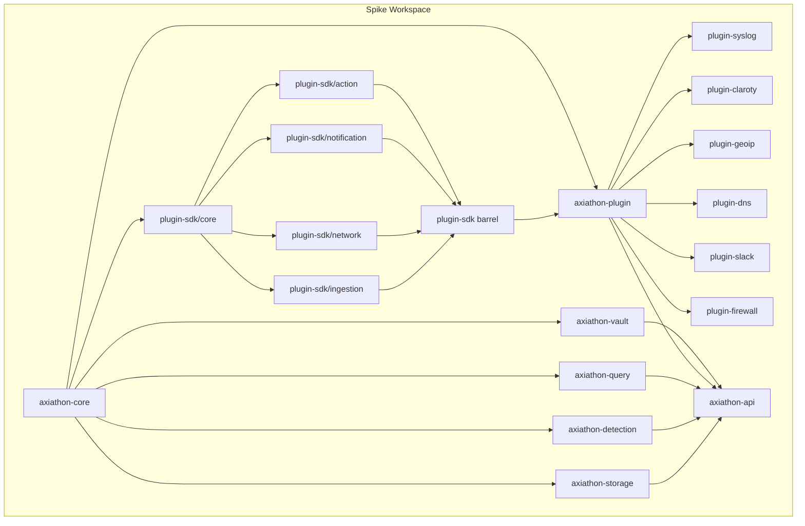

# Pass 0 Deep: Inventory -- Round 1

**Project:** Axiathon
**Pass:** 0 (Inventory)
**Round:** 1
**Date:** 2026-04-13

---

## Purpose

Deepen the broad sweep's Pass 0 inventory with verified file counts, accurate LOC, per-crate dependency mapping, and identification of files/modules missed in the original inventory. Cross-reference Tier 1 deepening discoveries (dual parser, plugin SDK, spike vs production split) against the file manifest.

---

## 1. Corrected File Manifest

### 1.1 Production Crates (`crates/`)

| Crate | Source Files | Test Files | Total Files | Status |
|-------|-------------|------------|-------------|--------|
| axiathon-core | 5 (lib, error, config, query_types, types) | 5 (core_types_integration, property_fieldref, property_types, query_types_test, snapshot_types, types_integration) | 10 | Implemented |
| axiathon-query | 7 (lib, aliases, ast, config, error, parser, type_system, version) | 8 (aliases_test, ast_test, config_test, error_test, parser_test, property_comments, property_parser_safety, type_system_test, version_test) | 15 | Implemented |
| axiathon-detection | 1 (lib.rs stub) | 0 | 1 | Stub |
| axiathon-ingestion | 1 (lib.rs stub) | 0 | 1 | Stub |
| axiathon-storage | 1 (lib.rs stub) | 0 | 1 | Stub |
| axiathon-client | 1 (lib.rs stub) | 0 | 1 | Stub |
| axiathon-server | 1 (lib.rs stub) | 0 | 1 | Stub |
| axiathon-ot | 1 (lib.rs stub) | 0 | 1 | Stub |

**Production total: 31 .rs files (12 source + 13 test + 6 stubs)**

### 1.2 Spike Crates (`spike/crates/`)

| Crate | Source Files | Test Files (inline #[cfg(test)]) | Integration/Bench Files | Purpose |
|-------|-------------|----------------------------------|------------------------|---------|
| axiathon-core | 8 (lib, error, event, generated, ocsf, proto_schema, proto_spike, schema, tenant) + build.rs + event_generator bin | 6 inline test modules | 1 bench (schema_bench) | OCSF events, proto, Arrow schema |
| axiathon-detection | 7 (lib, alert, ast, case, correlation, engine, parser, sequence, test_fixtures) | 7 inline test modules | 2 benches (stateless, stateful) | Detection DSL, engine, case mgmt |
| axiathon-query | 4 (lib, axiql, planner, tenant_filter) + axiql.pest | 3 inline test modules | 0 | Spike AxiQL parser + DataFusion |
| axiathon-storage | 5 (lib, catalog, compaction, gc, reader, writer) | 4 inline + 3 integration (field_promotion, schema_evolution, tenant_isolation) | 0 | Iceberg/Parquet storage |
| axiathon-vault | 3 (lib, crypto, vault) | 2 inline test modules | 0 | AES-256-GCM credential store |
| axiathon-plugin-sdk/core | 4 (lib, base, manifest, types) | 4 inline | 0 | Plugin lifecycle trait + manifest |
| axiathon-plugin-sdk/ingestion | 1 (lib) | 1 inline | 0 | Connector/Parser/Enricher traits |
| axiathon-plugin-sdk/network | 1 (lib) | 1 inline | 0 | ProtocolDissector trait |
| axiathon-plugin-sdk/notification | 1 (lib) | 1 inline | 0 | NotificationChannel trait |
| axiathon-plugin-sdk/action | 1 (lib) | 1 inline | 0 | ResponseAction trait |
| axiathon-plugin-sdk (barrel) | 1 (lib) | 0 | 0 | Re-exports all SDK sub-crates |
| axiathon-plugin | 9 (lib, factory, global_registry, hot_reload, loader, packaging, registry, store, tenant_registry, wasm) | 9 inline + 1 integration (axpkg_round_trip) | 0 | Plugin infrastructure |
| axiathon-plugin-syslog | 3 (lib, connector, parser) | 2 inline | 0 | Syslog TCP connector + RFC5424 |
| axiathon-plugin-claroty | 5 (lib, connector, parser, types, mock_server) | 4 inline | 0 | Claroty xDome API connector |
| axiathon-plugin-dns | 1 (lib) | 1 inline | 0 | DNS dissector |
| axiathon-plugin-firewall | 1 (lib) | 1 inline | 0 | Firewall response action |
| axiathon-plugin-geoip | 1 (lib) | 1 inline | 0 | GeoIP enricher |
| axiathon-plugin-slack | 1 (lib) | 1 inline | 0 | Slack notification |
| axiathon-api | 16 (main, state, pipeline, middleware/mod+tenant, routes/mod+admin+alerts+cases+health+ingest+mssp+plugins+query+rules+vault) | 1 inline (main.rs) | 0 | REST API server |

**Spike total: ~86 .rs files + 1 .pest file**

### 1.3 Non-Rust Files (NEW -- not in broad sweep)

| Path | Type | Purpose |
|------|------|---------|
| `Cargo.toml` (root) | Build | Production workspace definition |
| `spike/Cargo.toml` | Build | Spike workspace definition (separate workspace) |
| `depgraph-rules.toml` | Config | Dependency graph enforcement rules |
| `deny.toml` | Config | License/advisory/ban checks via cargo-deny |
| `justfile` | Build | Development task runner (27 recipes) |
| `.lefthook.yml` | Config | Pre-commit hooks (fmt, clippy, taplo, test, typos, depgraph) |
| `rustfmt.toml` | Config | Edition 2024, group_imports=StdExternalCrate, trailing_comma=Vertical |
| `.taplo.toml` | Config | TOML formatting (exclude spike + target) |
| `.typos.toml` | Config | Spell check with custom word list + exclusions |
| `.npmrc` | Config | npm config (for future WebUI) |
| `rust-toolchain.toml` | Config | Toolchain pinning |
| `Brewfile` | Setup | macOS tool dependencies |
| `SOUL.md` | Doc | 13 architectural principles |
| `CONTRIBUTING.md` | Doc | Git Flow workflow + contribution guidelines |
| `CLAUDE.md` | Doc | AI assistant instructions |
| `.claude/rules/*.md` | Doc | 4 rule files (git-commits, rust, bash, story-completeness) |
| `.github/workflows/*.yml` | CI | 5 workflows (ci, audit, ci_status, ci_typos, validate-codeowners) |
| `spike/crates/axiathon-query/src/axiql.pest` | Grammar | Pest PEG grammar for spike AxiQL |
| `spike/rules/*.axd` | Detection | Detection rule files (referenced by benchmarks) |
| `docs/.archive/` | Doc | ~100+ archived architecture decision documents |
| `_bmad*/` | Doc | BMAD framework planning/output artifacts |

### 1.4 Files Missed by Broad Sweep

The broad sweep's inventory did not mention:
1. **`depgraph-rules.toml`** -- critical for understanding the planned (not yet implemented) crate dependency structure including `axiathon-types` and `axiathon-ai` crates that don't exist yet
2. **`deny.toml`** -- supply chain security configuration
3. **`.lefthook.yml`** -- pre-commit hooks showing quality gate enforcement
4. **`justfile`** with 27 recipes -- showing the full developer workflow
5. **`rustfmt.toml`** with `group_imports=StdExternalCrate` -- important convention
6. **`.typos.toml`** -- spell checking with intentional exclusions (spike excluded)
7. **5 CI workflows** -- showing the full CI pipeline
8. **`spike/Cargo.toml`** showing SEPARATE workspace with different MSRV (1.88 vs 1.85)
9. **Detection `.axd` rule files** -- in `spike/rules/` directory
10. **`_bmad*` directories** -- BMAD framework artifacts (planning output, custom configs)
11. **`docs/.archive/`** -- 100+ archived architecture documents covering everything from WebUI to horizontal scaling

---

## 2. Corrected Dependency Graph

### 2.1 Production Workspace Dependencies

```
axiathon-core (foundation -- no internal deps)
  depends on: serde, serde_json, thiserror, uuid, chrono, regex, semver, arc-swap

axiathon-query (depends on axiathon-core)
  depends on: chumsky 0.10, miette 7

axiathon-detection (stub, depends on axiathon-core)
axiathon-ingestion (stub, depends on axiathon-core)
axiathon-storage (stub, depends on axiathon-core)
axiathon-client (stub, depends on axiathon-core)
axiathon-server (stub, depends on axiathon-core)
axiathon-ot (stub, depends on axiathon-core)
```

### 2.2 Planned (depgraph-rules.toml) but NOT YET IMPLEMENTED

```
axiathon-types (leaf crate -- does not exist yet)
axiathon-ai (depends on core + query + detection -- does not exist yet)
axiathon-query -> axiathon-storage (planned, not yet)
axiathon-detection -> axiathon-query (planned, not yet)
axiathon-ingestion -> axiathon-storage (planned, not yet)
axiathon-ot -> axiathon-storage (planned, not yet)
```

**KEY FINDING:** `depgraph-rules.toml` mentions `axiathon-types` as a leaf crate and `axiathon-ai` as a new domain crate. Neither exists yet. The `unmatched_config_entries = "warn"` setting confirms these are aspirational.

### 2.3 Spike Workspace Dependencies

The spike is a COMPLETELY SEPARATE Cargo workspace at `spike/Cargo.toml`:
- Different MSRV: 1.88 (spike) vs 1.85 (production)
- Different prost versions: 0.13 (spike) vs 0.14 (production)
- Different prost-reflect versions: 0.14 (spike) vs 0.15 (production)
- Uses Iceberg via git fork: `github.com/drbothen/iceberg-rust` branch `feat/rewrite-files-action`
- Has dependencies not in production: dashmap, aes-gcm, argon2, reqwest, pest, pest_derive, extism (WASM), zip, ipnet, async-trait, rand, criterion
- Shares some deps at same versions: tokio, serde, arrow 57, datafusion 51, axum 0.8, chrono, uuid



---

## 3. Corrected Tech Stack

### Production (Cargo workspace)

| Layer | Technology | Version | Notes |
|-------|-----------|---------|-------|
| Language | Rust | Edition 2024, MSRV 1.85 | |
| Parser | Chumsky | 0.10 | Error-recovering parser combinators |
| Error Reporting | miette | 7 (planned) | Fancy diagnostic output |
| Protobuf | prost + prost-reflect | 0.14 / 0.15 | Runtime reflection for DynamicMessage |
| Version parsing | semver | 1 | For OCSF version handling |
| Hot-reload | arc-swap | 1 | Planned for config/rules |
| Regex | regex | 1 | Parse-time validation |

### Spike (Separate Cargo workspace)

| Layer | Technology | Version | Notes |
|-------|-----------|---------|-------|
| Language | Rust | Edition 2024, MSRV 1.88 | HIGHER than production |
| Storage | Apache Iceberg | git fork (0.8.0-ish) | Fork adds RewriteFilesAction for compaction |
| Storage Backend | SQLite (via sqlx) | -- | Zero-infrastructure Iceberg catalog |
| Columnar | Arrow + Parquet | 57 | With chrono-tz and async features |
| Query Engine | DataFusion | 51 | SQL execution |
| Detection Parser | Pest | 2 | PEG parser for .axd files |
| Spike AxiQL Parser | Pest | 2 | DIFFERENT parser than production |
| HTTP | Axum + tower-http | 0.8 / 0.6 | CORS + tracing middleware |
| Concurrency | DashMap | 6 | Lock-free concurrent maps |
| Crypto | aes-gcm + argon2 | 0.10 / 0.5 | Vault encryption |
| HTTP Client | reqwest | 0.12 | Claroty API connector |
| WASM Sandbox | extism | 1 | Plugin sandboxing (spike) |
| Plugin Packaging | zip | 2 | .axpkg format |
| Protobuf | prost + prost-reflect | 0.13 / 0.14 | DIFFERENT versions from prod |

### Development Tooling

| Tool | Purpose | Enforced By |
|------|---------|-------------|
| nightly rustfmt | Code formatting | lefthook pre-commit, CI |
| clippy -D warnings | Linting | lefthook pre-commit, CI |
| taplo | TOML formatting | lefthook pre-commit |
| typos | Spell checking | lefthook pre-commit |
| cargo-deny | License/advisory/ban checking | CI job |
| cargo-depgraph-check | Dependency graph enforcement | CI job, lefthook (optional) |
| cargo-nextest | Parallel test runner | Optional (just test-nextest) |
| cargo-machete | Unused dependency detection | Optional (just check-machete) |
| cargo-watch | Development hot-reload | Optional (just dev) |
| cargo-insta | Snapshot test management | Via cargo install |
| cargo-audit | Security vulnerability audit | Optional (just audit) |
| criterion | Benchmarking | Spike only |

---

## 4. Entry Point Corrections

The broad sweep listed 5 entry points. Verified and expanded:

### Production
1. `crates/axiathon-core/src/lib.rs` -- Foundation re-exports (correct)
2. `crates/axiathon-query/src/lib.rs` -- Query module re-exports (correct)
3. `crates/axiathon-query/src/parser.rs` -- `parse_axiql()` (correct)

### Spike
4. `spike/crates/axiathon-api/src/main.rs` -- API server (correct, 230+ lines)
5. `spike/crates/axiathon-core/src/event.rs` -- `AxiathonEvent` (correct)
6. **NEW:** `spike/crates/axiathon-query/src/axiql.rs` -- `parse_axiql()` (spike Pest version)
7. **NEW:** `spike/crates/axiathon-query/src/planner.rs` -- `QueryEngine` (DataFusion integration)
8. **NEW:** `spike/crates/axiathon-api/src/pipeline.rs` -- `start_ingestion_pipeline()` (event flow)
9. **NEW:** `spike/crates/axiathon-core/build.rs` -- Proto generation via prost-build
10. **NEW:** `spike/crates/axiathon-core/src/bin/event_generator.rs` -- Test data generator

---

## 5. CI Pipeline Structure (NEW)

5 GitHub Actions workflows:

| Workflow | Trigger | Jobs | Timeout |
|----------|---------|------|---------|
| `ci.yml` | push (develop, main, release/*, hotfix/*), PR | check-fmt, check-clippy, build, test (+doc), deny, check-deps | 5-10 min/job |
| `audit.yml` | (not examined) | cargo audit | -- |
| `ci_status.yml` | (not examined) | Status reporting | -- |
| `ci_typos.yml` | (not examined) | Spell checking | -- |
| `validate-codeowners.yml` | (not examined) | CODEOWNERS validation | -- |

CI runs on self-hosted runners (`[self-hosted, Ubuntu, Common]`), uses Swatinem/rust-cache, pins actions to commit SHAs, uses step-security/harden-runner for egress auditing.

---

## Delta Summary
- New items added: 11 missed non-Rust files documented (depgraph-rules.toml, deny.toml, lefthook, justfile, rustfmt.toml, typos, CI workflows, spike Cargo.toml, .axd rules, _bmad dirs, archived docs), 5 new entry points, separate spike workspace documented with version divergences, 11 development tools cataloged, CI pipeline structure, planned but unimplemented crates (axiathon-types, axiathon-ai)
- Existing items refined: File counts per crate corrected, tech stack separated into production vs spike with version differences highlighted, dependency graph corrected to show two separate workspaces
- Remaining gaps: Exact LOC per file (sandbox restrictions prevent wc -l), spike/rules/ .axd file inventory, docs/.archive/ content summary, _bmad-output artifact structure

## Novelty Assessment
Novelty: SUBSTANTIVE
The broad sweep treated the project as a single workspace. In reality, there are TWO completely separate Cargo workspaces with different MSRVs (1.85 vs 1.88), different prost/prost-reflect versions (0.14/0.15 vs 0.13/0.14), and the spike uses an Iceberg git fork. This is architecturally significant -- the spike code cannot be trivially promoted to the production workspace due to version incompatibilities. Additionally, planned crates (axiathon-types, axiathon-ai) from depgraph-rules.toml reveal future architecture not visible in the broad sweep. The 11 missed configuration files define the quality enforcement infrastructure.

## Convergence Declaration
Another round needed -- exact LOC metrics unavailable due to sandbox restrictions, docs/.archive/ contains 100+ architecture documents that may hold NFR-relevant content, and the spike's git dependency on an Iceberg fork needs version pinning analysis.

## State Checkpoint
```yaml
pass: 0
round: 1
status: complete
files_scanned: 124 .rs + ~20 config files
timestamp: 2026-04-13T00:00:00Z
novelty: SUBSTANTIVE
next_pass: 0-r2
```
