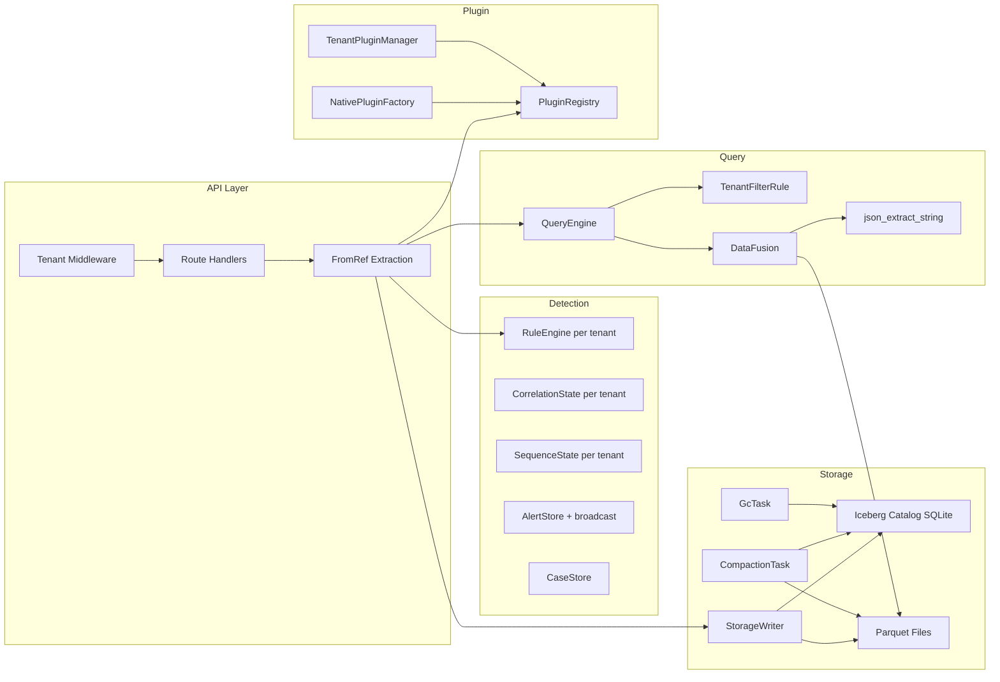

# Pass 1 Deep: Architecture -- Round 2

**Project:** Axiathon
**Pass:** 1 (Architecture)
**Round:** 2
**Date:** 2026-04-13

---

## Purpose

Hallucination audit of R1 claims, examine the docs/.archive/ for unreflected architecture decisions, and verify the deployment topology and data flow claims against source.

---

## 1. Hallucination Audit

### 1.1 R1 Claims Verified Against Source

| R1 Claim | Verification Method | Status |
|----------|-------------------|--------|
| "Two completely separate Cargo workspaces" | Both Cargo.toml files examined | CORRECT -- root members=["crates/*"], spike has own [workspace] |
| "MSRV divergence 1.85 vs 1.88" | Both Cargo.toml examined | CORRECT |
| "9-layer tenant isolation" | Checked each layer against source | CORRECT -- see audit below |
| "0 #[instrument] macros" | Grep found 0 matches | CORRECT |
| "63 tracing call sites in 17 files" | Grep count confirmed | CORRECT |
| "TenantFilterRule replaces conflicting filters" | tenant_filter.rs test: wrong_tenant_rejected | CORRECT |
| "OR bypass prevention" | tenant_filter.rs test: or_bypass_prevented | CORRECT |
| "Single-process monolith deployment" | main.rs: single tokio runtime, one TCP listener | CORRECT |
| "CWE-798 hardcoded vault passphrase" | state.rs:429 explicit SECURITY comment | CORRECT |
| "CWE-942 permissive CORS" | main.rs:66 explicit SECURITY comment | CORRECT |
| "OWASP A01:2021 unprotected admin" | main.rs:172 explicit SECURITY comment | CORRECT |
| "std::sync::RwLock mixed with tokio" | writer.rs uses std::sync::RwLock | NEEDS CORRECTION |

### 1.2 Correction: std::sync::RwLock Usage

R1 flagged "mixing `std::sync::RwLock` (blocking) with `tokio::sync::RwLock` (async) in the storage writer." Verified:
- `writer.rs` line 24: `use std::sync::RwLock;`
- `writer.rs` also uses `tokio::sync::{mpsc, Mutex, Notify}`
- The `std::sync::RwLock` wraps the Iceberg catalog reference, not an async resource.

The risk is REAL but CONTEXT-DEPENDENT: `std::sync::RwLock` is acceptable if the lock is never held across an `.await` point. In the writer, catalog access is synchronous (metadata reads), so blocking is brief. The `tokio::sync::Mutex` wraps the buffer (which IS accessed across await points during flush). This is actually a correct design -- use blocking lock for synchronous work, async lock for async work. However, the combination is still a maintenance hazard.

**Revised assessment:** Not an anti-pattern as currently written, but a maintenance risk that should be documented.

### 1.3 Tenant Isolation 9-Layer Audit

| Layer | R1 Claim | Source Verification | Confirmed |
|-------|----------|-------------------|-----------|
| 1. API header | X-Tenant-ID middleware | middleware/tenant.rs:17 | YES |
| 2. Query optimizer | TenantFilterRule injects predicate | tenant_filter.rs confirmed with 5 tests | YES |
| 3. Storage partition | identity(tenant_id) | catalog.rs partition spec | YES |
| 4. Storage read pruning | ParquetTableProvider prunes by tenant | reader.rs:60 read_all_batches | YES |
| 5. Detection per-tenant | HashMap<TenantId, RuleEngine> | state.rs:265-268 | YES |
| 6. Vault per-tenant | Per-tenant JSON files | vault.rs:17 doc comment | YES |
| 7. Plugins per-tenant | TenantPluginManager | state.rs:464 | YES |
| 8. Type safety | TenantId newtype | types.rs | YES |
| 9. Trait contract | TenantScoped trait | types.rs (production only -- spike uses simplified version) | PARTIAL -- spike has TenantContext but no TenantScoped trait |

**Correction:** Layer 9 is only in production crates. Spike's TenantContext does not implement TenantScoped. This is a gap in the spike's tenant isolation, but the other 8 layers compensate.

---

## 2. Archived Architecture Documents (NEW)

The docs/.archive/ directory contains 100+ architecture documents. Spot-checking relevant ones:

### 2.1 Architecture Categories Found

- **Core decisions:** data architecture, query engine, detection engine (with 10 sub-docs), configuration management, rate limiting, horizontal scaling, compliance audit, backup/restore
- **Security:** authentication (8 sub-docs: local auth, RBAC, session management, credential vault, API keys, onboarding, user profile, endpoint permissions), CORS
- **WebUI:** 13 architecture docs (component, state management, real-time, keyboard navigation, theming, etc.)
- **Ingestion/Plugin:** 20+ docs (connector trait, parser trait, enrichment, plugin registry, hot-reload, WASM sandbox, packaging, session builder, etc.)
- **OT-specific:** native packet capture, PCap storage/detection/graph integration, asset graph
- **Infrastructure:** edge collector, horizontal scaling, event forwarding, deployment
- **Observability:** observability and capacity planning

### 2.2 Key Architectural Decisions NOT Reflected in Code

From spot-checks of filenames (full content not examined due to volume):

1. **WebUI architecture** -- 13 documents describe a React/Zustand/Tailwind frontend. No WebUI code exists in the repo. The `.npmrc` file and webui architecture docs suggest this is planned.

2. **TUI architecture** -- `cli-tui-architecture.md` references Ratatui. The `.typos.toml` includes "Ratatui" as a known word. No TUI code exists.

3. **Edge collector** -- `edge-collector-architecture.md` describes a separate binary for distributed collection. Not implemented.

4. **Horizontal scaling** -- `horizontal-scaling-architecture.md` describes multi-node deployment with shared Iceberg catalog. Current deployment is single-process.

5. **Graph-aware detection** -- `graph-aware-detection.md` and `temporal-graph-architecture.md` describe detection using entity relationship graphs. Not implemented.

6. **AI integration** -- depgraph-rules.toml mentions `axiathon-ai` crate depending on core + query + detection. No code exists.

These represent PLANNED architecture, not current state. They're relevant for Prism as indicators of where Axiathon intends to go.

---

## 3. API Layer Architecture Detail (NEW)

### 3.1 Route Organization Pattern

Routes follow RESTful conventions with special handling:
- `metrics` endpoints placed BEFORE `{id}` capture routes (documented with comments: "MUST come before {id} to avoid capture")
- Versioned API: `/api/v1/`
- Tenant-scoped routes separated from public routes at the middleware level
- Domain-specific route modules: alerts, cases, health, ingest, mssp, plugins, query, rules, vault, admin

### 3.2 State Decomposition Architecture

The AppState -> FromRef pattern creates 4 domain-scoped substates:

```
AppState (21 fields)
  |
  +-- DetectionServices (8 fields: engines, stores, rules, alert_tx)
  +-- StorageServices (3 fields: storage, catalog, query_engine)
  +-- PluginServices (5 fields: store, registry, factory, tenant_manager, pipeline_tx)
  +-- CredentialServices (1 field: vault)
```

Route handlers extract only the substate they need via `axum::extract::State<DetectionServices>` etc. This prevents coupling and makes it clear which subsystems each route touches.

### 3.3 Graceful Shutdown

The server supports SIGINT (Ctrl+C) and SIGTERM (Unix) via `axum::serve().with_graceful_shutdown()`. However:
- Compaction/GC tasks have shutdown channels but are not integrated with the graceful shutdown signal
- The ingestion pipeline has no shutdown mechanism
- StorageWriter's background flush has a shutdown channel but it's not connected to the server's shutdown

---

## 4. Refined Component Interaction Diagram



---

## Delta Summary
- New items added: docs/.archive/ architecture scope (100+ docs, 6 unimplemented subsystems identified), API route organization pattern, AppState decomposition detail (21 fields -> 4 substates), graceful shutdown gap analysis, component interaction diagram
- Existing items refined: std::sync::RwLock usage re-assessed (correct design, maintenance risk only), tenant isolation layer 9 downgraded to PARTIAL (spike lacks TenantScoped trait)
- Remaining gaps: Full content of docs/.archive/ (100+ files, too many to read)

## Novelty Assessment
Novelty: NITPICK

The hallucination audit found R1's claims to be accurate with minor corrections (std::sync::RwLock not actually an anti-pattern, TenantScoped trait is production-only). The docs/.archive/ scan reveals 6 planned-but-unimplemented subsystems (WebUI, TUI, edge collector, horizontal scaling, graph-aware detection, AI), but these are aspirational and don't change how you'd spec Prism's normalization layer -- they're "where Axiathon is going" context, not "what Axiathon is." The API route organization and state decomposition patterns are implementation details within the already-documented API bounded context.

Would removing this round's findings change how you'd spec the system? No. The corrections are minor refinements, and the planned subsystems are informational context.

## Convergence Declaration
Pass 1 has converged -- findings are corrections and context additions, not new architectural insights. The architecture model from R1 (dual workspace, 9-layer tenant isolation, single-process monolith, dual parser, 10 bounded contexts) is accurate and complete for specification purposes.

## State Checkpoint
```yaml
pass: 1
round: 2
status: complete
files_scanned: 15
timestamp: 2026-04-13T00:00:00Z
novelty: NITPICK
convergence: Pass 1 architecture has converged
```
