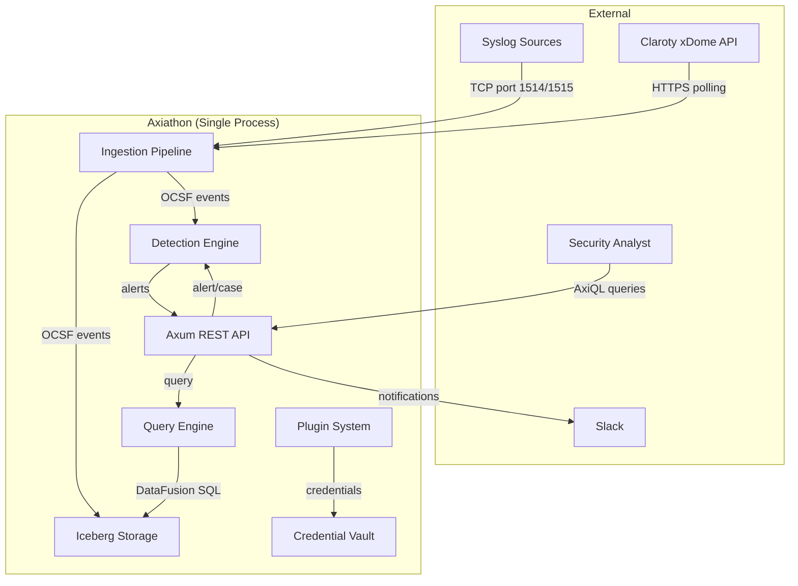
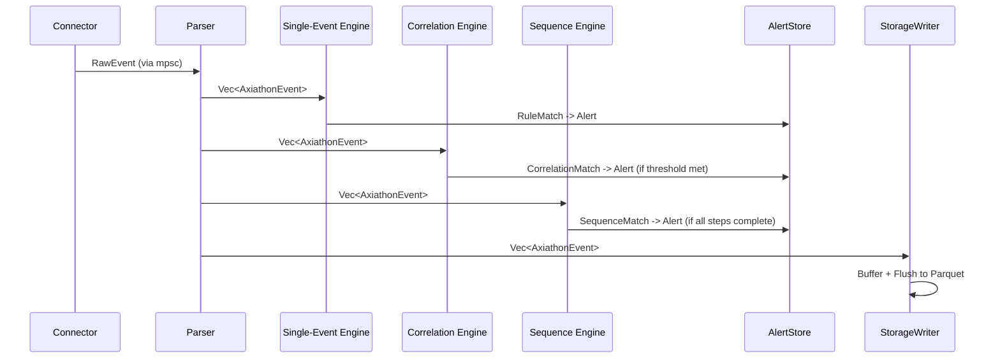

# Pass 1 Deep: Architecture -- Round 1

**Project:** Axiathon
**Pass:** 1 (Architecture)
**Round:** 1
**Date:** 2026-04-13

---

## Purpose

Deepen the broad sweep's architecture analysis, incorporating Tier 1 discoveries (dual AxiQL parser, 8-trait plugin SDK, spike vs production split) and Tier 2 inventory findings (two separate workspaces, version divergences, planned crates). Focus on component responsibilities, deployment topology, data flow accuracy, and cross-cutting concern details.

---

## 1. Dual Workspace Architecture (NEW -- not in broad sweep)

The broad sweep described a single layered architecture. In reality, there are two distinct codebases:

### 1.1 Production Workspace (`Cargo.toml` at root)

**Scope:** 8 crates, only 2 implemented (axiathon-core, axiathon-query)
**MSRV:** 1.85, Edition 2024
**State:** Active development, CI-enforced quality gates

```
axiathon-core (implemented, ~600 LOC)
  |
  +-- axiathon-query (implemented, ~1200 LOC)
  |
  +-- axiathon-detection (stub)
  +-- axiathon-ingestion (stub)
  +-- axiathon-storage (stub)
  +-- axiathon-ot (stub)
  +-- axiathon-server (stub)
  +-- axiathon-client (stub)
```

**Quality enforcement:**
- `#![forbid(unsafe_code)]` in ALL 8 crates (verified)
- `depgraph-rules.toml` with `strict = true` -- dependency direction enforced in CI
- `deny.toml` for license/advisory checks
- 6 pre-commit hooks via lefthook
- 5 CI workflows

### 1.2 Spike Workspace (`spike/Cargo.toml`)

**Scope:** 19 crates, all implemented (varying maturity)
**MSRV:** 1.88, Edition 2024
**State:** Prototype/proof-of-concept, no CI enforcement, no `#![forbid(unsafe_code)]`

```
axiathon-core (proto-backed events, Arrow schema)
  |
  +-- plugin-sdk/core (base trait + manifest)
  |     +-- plugin-sdk/ingestion (connector, parser, enricher traits)
  |     +-- plugin-sdk/network (protocol dissector trait)
  |     +-- plugin-sdk/notification (notification channel trait)
  |     +-- plugin-sdk/action (response action trait)
  |     +-- plugin-sdk (barrel re-export)
  |
  +-- axiathon-storage (Iceberg + Parquet writer/reader/compaction/GC)
  +-- axiathon-detection (DSL parser + engine + correlation + sequence + cases)
  +-- axiathon-query (Pest AxiQL + DataFusion planner + tenant filter)
  +-- axiathon-vault (AES-256-GCM encrypted credentials)
  |
  +-- axiathon-plugin (infrastructure: factory, registry, store, hot-reload, WASM, packaging)
  |     +-- plugin-syslog (TCP connector + RFC5424 parser)
  |     +-- plugin-claroty (HTTP connector + xDome parser)
  |     +-- plugin-dns (protocol dissector)
  |     +-- plugin-geoip (enricher)
  |     +-- plugin-slack (notification)
  |     +-- plugin-firewall (response action)
  |
  +-- axiathon-api (Axum REST server, composes all above)
```

### 1.3 Gap Between Workspaces

| Aspect | Production | Spike |
|--------|-----------|-------|
| MSRV | 1.85 | 1.88 |
| prost | 0.14 | 0.13 |
| prost-reflect | 0.15 | 0.14 |
| TenantId validation | UUID format | Alphanumeric + hyphens |
| AxiQL parser | Chumsky 0.10 (SQL-like) | Pest 2 (Lucene-like) |
| Error types | 9 variants | 12 variants + anyhow |
| forbid(unsafe_code) | All crates | No crates |
| CI | Full pipeline | None |
| Quality gates | 6 hooks + 5 workflows | None |

**Architectural implication:** Spike code cannot be promoted to production without:
1. prost version alignment (0.13 -> 0.14, prost-reflect 0.14 -> 0.15)
2. TenantId validator unification
3. Error type consolidation
4. `#![forbid(unsafe_code)]` addition to all spike crates
5. Removal of public struct fields (marked with TODOs)
6. AxiQL parser integration (production parser is NOT connected to any execution engine)

---

## 2. Component Catalog (Refined)

### 2.1 Core Domain Layer

**axiathon-core (production):** Foundation types shared by all crates. Contains TenantId, EventId, AlertId, TenantContext, SystemContext, TenantScoped trait, FieldRef, Value, CompareOp, StringOp, AxiathonError, ApiResponse. Pure domain types, no I/O.

**axiathon-core (spike):** Proto-backed OCSF event system. Contains AxiathonEvent wrapping prost-reflect DynamicMessage, Arrow schema generation, field catalog, proto descriptor management. Heavy I/O (proto descriptors compiled at build time via build.rs).

### 2.2 Query Layer

**axiathon-query (production):** AxiQL parser producing AST. Three query modes (Filter, SQL SELECT, Pipe). Type system with constraints. Field alias registry with three-tier resolution. Multi-version OCSF query support (planned). **NOT connected to any execution engine.**

**axiathon-query (spike):** Completely different AxiQL parser (Pest, Lucene-like syntax). Connected to DataFusion via QueryEngine planner. Includes TenantFilterRule (optimizer-level tenant isolation), json_extract_string UDF (tier-2 field access), COALESCE promotion pattern, table-per-class routing.

### 2.3 Detection Layer (spike only)

**axiathon-detection:** Three-tier detection system:
1. **Single-event rules** -- immediate evaluation against each event
2. **Correlation rules** -- sliding window count with group-by (DashMap-backed)
3. **Sequence rules** -- ordered multi-step temporal matching

Plus: Alert generation, AlertStore (RwLock + broadcast), CaseStore with 5-state machine, MITRE ATT&CK tagging, template interpolation for alert titles/descriptions.

### 2.4 Storage Layer (spike only)

**axiathon-storage:** Iceberg-backed event storage:
- **WriterConfig:** buffer_size=1000, flush_interval=5s, Zstd compression
- **Table-per-class:** Each OCSF event class gets its own Iceberg table
- **Partitioning:** `identity(tenant_id)` + `hour(event_time)`
- **Catalog:** SQLite-backed SQL catalog (zero infrastructure)
- **Compaction:** Background task, triggers at >5 files per partition
- **GC:** Snapshot expiry + unreferenced file deletion (120s check interval, 300s max age)
- **Reader:** Custom DataFusion TableProvider with partition pruning
- **Field Promotion:** Schema evolution to add hot columns from unmapped JSON

### 2.5 Plugin Layer (spike only)

**axiathon-plugin-sdk:** 8 traits defining the extensibility contract:
- AxiathonPlugin (base lifecycle)
- ConnectorPlugin (push-based data collection via mpsc channel)
- ParserPlugin / AsyncParserPlugin (raw -> OCSF normalization)
- EventEnricher (post-parse field augmentation)
- ProtocolDissector (network protocol parsing)
- NotificationChannel (alert delivery)
- ResponseAction (automated response)

**axiathon-plugin:** Infrastructure for managing plugins:
- Factory pattern (NativePluginFactory maps IDs to constructors)
- Per-tenant plugin registry (TenantPluginManager)
- Global vs tenant-scoped distinction (parsers=global, connectors=per-tenant)
- Hot-reload via arc-swap (VersionedPlugin, HotReloadablePlugin)
- WASM sandbox via extism (WasmPluginHost, WasmSandboxConfig)
- Package format (.axpkg via zip)

### 2.6 API Layer (spike only)

**axiathon-api:** Axum REST server composing all subsystems:
- **State decomposition:** AppState splits into DetectionServices, StorageServices, PluginServices, CredentialServices via Axum's FromRef pattern
- **Middleware:** Tenant extraction from X-Tenant-ID header
- **Routes:** alerts, cases, health, ingest, mssp, plugins, query, rules, vault, admin
- **Initialization:** Hardcoded 2 tenants (acme-corp, globex-inc), 6 built-in detection rules, 8 built-in plugins

### 2.7 Vault (spike only)

**axiathon-vault:** Per-tenant encrypted credential storage:
- AES-256-GCM encryption via aes-gcm
- Key derivation via Argon2 from passphrase + salt
- Per-tenant JSON files on disk
- **SECURITY(CWE-798):** Hardcoded passphrase and static salt in spike -- explicitly marked for production replacement

---

## 3. Deployment Topology

### Current (Spike)

**Single-process monolith** -- all subsystems compose in one Axum server:

```
[Single Process]
  +-- Axum HTTP Server (0.0.0.0:3000)
  |     +-- Tenant Middleware
  |     +-- CORS (permissive -- spike only)
  |     +-- Routes (alerts, cases, ingest, query, etc.)
  |
  +-- Ingestion Pipeline (tokio task)
  |     +-- N Connector instances (push via mpsc)
  |     +-- Parser routing
  |     +-- Detection (single + correlation + sequence)
  |     +-- Storage write
  |
  +-- Background Tasks (tokio tasks)
  |     +-- Per-class compaction (30s check interval)
  |     +-- Per-class GC (120s check interval)
  |     +-- Query engine provider refresh (on flush/catalog change)
  |
  +-- Storage (local filesystem)
  |     +-- SQLite catalog DB
  |     +-- Parquet data files (Iceberg layout)
  |     +-- Vault encrypted JSON files
```

### Planned (from docs/.archive/ and README)

The archived architecture docs reference:
- Edge collector architecture (separate binary)
- Horizontal scaling architecture
- Event forwarding chain
- SDK/IDE integration
- WebUI (React, referenced by .npmrc and webui architecture docs)
- TUI (Ratatui, referenced by cli-tui-architecture.md)

---

## 4. Data Flow (Refined from Tier 1 Discoveries)

### 4.1 Ingestion Pipeline (Verified from pipeline.rs)

```
ConnectorPlugin.start(tx: mpsc::Sender<RawEvent>)
  |  (async, push-based, runs in connector's own tokio task)
  v
mpsc channel (buffer: 10,000 RawEvent)
  |
  v
Pipeline loop (single tokio task):
  |
  +-- registry.route_to_parser(&raw) -> Vec<AxiathonEvent>
  |   (tries each registered ParserPlugin.can_parse(), first match wins)
  |
  +-- For each event:
  |   +-- Single-event detection (per-tenant RuleEngine)
  |   +-- Correlation detection (per-tenant CorrelationState)
  |   +-- Sequence detection (per-tenant SequenceState)
  |   +-- Each match -> alert_from_*() -> AlertStore.add() + broadcast
  |
  +-- storage.write(events) -> buffered batch write
      |
      +-- Group by PartitionKey(class_uid, tenant_id, hour_epoch)
      +-- events_to_record_batch_with_promotions()
      +-- Iceberg DataFileWriter -> Parquet with Zstd compression
      +-- On buffer full or flush interval:
          +-- Commit Iceberg transaction
          +-- Notify query engine to refresh
```

### 4.2 Query Pipeline (Verified from planner.rs)

```
AxiQL query string (Lucene-like: "user.name:root AND severity_id:>=4")
  |
  v
parse_axiql(input) -> ParsedQuery { expr: QueryExpr, time_range: TimeRange }
  |
  v
QueryEngine.execute(query, tenant_id, limit, offset):
  |
  +-- extract_class_uid_filter(expr) -> Option<i32>
  |   (checks for class_uid:N in expression)
  |
  +-- Route to table:
  |   class_uid present -> query_single_table(class_uid)
  |   class_uid absent  -> query_all_tables() + concatenate
  |
  +-- Build DataFusion SessionContext:
  |   +-- Register table provider (ParquetTableProvider or IcebergStaticTableProvider)
  |   +-- Register json_extract_string UDF
  |   +-- Add TenantFilterRule optimizer rule
  |
  +-- Build SQL:
  |   +-- SELECT columns (with COALESCE for promoted fields)
  |   +-- WHERE build_filter_expr(expr) AND build_time_filter(time_range)
  |   +-- ORDER BY event_time DESC
  |   +-- LIMIT / OFFSET
  |
  +-- Execute DataFusion query -> Vec<RecordBatch>
  |
  v
QueryResult { batches, total, query_time_ms }
```

### 4.3 Storage Maintenance Pipeline

```
Compaction (per class table, 30s interval):
  +-- Load table metadata
  +-- Group data files by partition
  +-- If partition has > 5 files:
  |   +-- Read all partition's Parquet files
  |   +-- Concatenate RecordBatches
  |   +-- Write single merged file via Iceberg DataFileWriter
  |   +-- Iceberg rewrite_files() transaction (atomic: delete old, add new)
  |   +-- Notify query engine to refresh
  |
GC (per class table, 120s interval):
  +-- Expire snapshots older than 300s (keep min 1)
  +-- find_unreferenced_files()
  +-- FileIO.delete() each unreferenced file
  +-- Notify query engine to refresh
```

---

## 5. Cross-Cutting Concerns (Refined)

### 5.1 Tenant Isolation (Multi-layer defense)

| Layer | Mechanism | Verified |
|-------|-----------|----------|
| API | X-Tenant-ID header -> TenantContext middleware | Yes (tenant.rs) |
| Query | TenantFilterRule optimizer injects/enforces tenant_id predicate | Yes (5 integration tests including OR bypass) |
| Storage | Iceberg partition: `identity(tenant_id)` | Yes (partition spec in catalog.rs) |
| Storage Read | ParquetTableProvider partition pruning by tenant_id | Yes (reader.rs) |
| Detection | Per-tenant engine maps: `HashMap<TenantId, RuleEngine>` | Yes (state.rs) |
| Vault | Per-tenant encrypted JSON files | Yes (vault.rs) |
| Plugins | TenantPluginManager: per-tenant config + connector instances | Yes (state.rs) |
| Types | TenantId newtype prevents string mixing | Yes (types.rs) |
| Trait | TenantScoped: `tenant_id()` required in function signatures | Yes (types.rs) |

**NEW finding:** TenantFilterRule provides defense-in-depth at the query optimizer level. Even if a user crafts a query with `tenant_id = 'other_tenant'` or `tenant_id = 'a' OR tenant_id = 'b'`, the optimizer replaces it with the correct tenant. This is verified by 4 integration tests.

### 5.2 Error Handling

**Production pattern:**
- `thiserror` derive for structured error enums
- `#[non_exhaustive]` on all extensible error types (29 instances across codebase)
- SECURITY comment on every error type's Display impl
- `pub type Result<T>` alias per crate
- CWE citations on security-relevant errors

**Spike divergence:**
- Includes `anyhow::Error` via `Other(anyhow::Error)` variant (catch-all)
- Error-to-API-response mapping in route handlers, not centralized
- Security comments present but fewer call sites audited

### 5.3 Observability

**Status: Minimal but structured**
- `tracing` crate used in 17 spike files (63 tracing::info/warn/error/debug calls)
- `tracing-subscriber` with env-filter + JSON configured in main.rs
- tower-http `TraceLayer` on API routes
- **No `#[instrument]` macros used anywhere** (verified by grep)
- **No trace_id propagation in spans** (target architecture per SOUL.md #9, not yet implemented)
- Query timing tracked: `query_time_ms` in QueryResult
- Alert broadcast capacity: 1024 messages
- Pipeline channel capacity: 10,000 RawEvents

### 5.4 Security

**Enforced in production:**
- `#![forbid(unsafe_code)]` in all 8 crates
- `workspace.lints.rust.unsafe_code = "forbid"` in root Cargo.toml
- 7 CWE citations in parser.rs (CWE-20, CWE-190, CWE-400, CWE-674, CWE-1333)
- Parse-time validation of regex, CIDR, query length, nesting depth
- Validated constructors at trust boundaries

**Identified in spike but not enforced:**
- `CWE-798`: Hardcoded vault passphrase + static salt (state.rs:429)
- `CWE-942`: Permissive CORS (main.rs:66)
- `OWASP A01:2021`: Admin endpoints without auth (main.rs:172)
- `OWASP A02:2021 / CWE-760`: Static salt for key derivation (vault.rs:121)
- `CWE-1333`: No regex size limit in detection engine (engine.rs:56)
- `CWE-209`: 5 error leak sites identified in spike error.rs comments

### 5.5 Configuration

**Production:** Hard-coded defaults in QueryConfig (default_timeout=30s, max_timeout=300s, max_result_rows=10000, max_concurrent_queries=50, max_memory_per_query=512MB). No config file loading yet.

**Spike:** Hard-coded in AppState::new() (WriterConfig, CompactionConfig, GcConfig defaults). Per-tenant plugin config via JSON. 2 hard-coded tenants. SOUL.md #13 defines the target: YAML/TOML config files, hot-reloadable via arc-swap, CLI > env > user > system > defaults hierarchy.

---

## 6. Architecture Mermaid Diagrams

### 6.1 System Context



### 6.2 Data Flow Through Detection



---

## Delta Summary
- New items added: Dual workspace architecture with version divergences documented, quality enforcement asymmetry (production vs spike), deployment topology as single-process monolith, verified multi-layer tenant isolation (9 layers), observability gap analysis (63 tracing calls, 0 #[instrument], 0 trace_id propagation), 6 security findings with CWE citations from spike, configuration gap (all hard-coded, arc-swap planned), detailed query pipeline data flow, storage maintenance pipeline, planned crate discoveries (axiathon-types, axiathon-ai)
- Existing items refined: Data flow corrected to match actual pipeline.rs code (single tokio task, not parallel), component catalog expanded to show production vs spike split, cross-cutting concerns separated by enforcement status
- Remaining gaps: Archived architecture documents (100+ files in docs/.archive/) may contain design decisions not reflected in code, WebUI and TUI architecture referenced but no implementation, edge collector architecture mentioned but not explored

## Novelty Assessment
Novelty: SUBSTANTIVE
The dual-workspace architecture is the most significant finding -- the broad sweep treated production and spike as layers of one system, but they are actually separate Cargo workspaces with incompatible dependency versions. The verified 9-layer tenant isolation model, the observability gap (zero #[instrument] usage despite SOUL.md requiring it), and the 6 CWE-cited security issues in the spike are all model-changing discoveries. The deployment topology (single-process monolith with background tasks) was not previously documented.

## Convergence Declaration
Another round needed -- 100+ archived architecture documents in docs/.archive/ may contain design decisions, NFR targets, or planned architecture not reflected in the codebase. The WebUI/TUI/edge collector references need investigation.

## State Checkpoint
```yaml
pass: 1
round: 1
status: complete
files_scanned: 40+
timestamp: 2026-04-13T00:00:00Z
novelty: SUBSTANTIVE
next_pass: 1-r2
```
