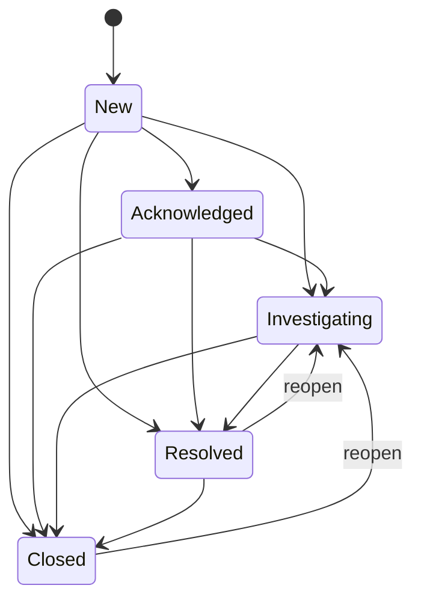

# Pass 2 Deep: Domain Model -- Round 1

**Project:** Axiathon
**Pass:** 2 (Domain Model)
**Round:** 1
**Date:** 2026-04-13

---

## 1. Entity Catalog (Verified from Source)

### 1.1 Identity & Tenant Entities

#### TenantId (production: `crates/axiathon-core/src/types.rs`)
- **Inner type:** `String` (private field)
- **Validation (production):** UUID format via `Uuid::parse_str()`. Rejects empty, >128 chars, non-UUID.
- **Validation (spike: `spike/crates/axiathon-core/src/tenant.rs`):** Alphanumeric + hyphens + underscores. Rejects empty, >128 chars, dots, spaces.
- **Migration gap:** Two incompatible validators. Spike uses human-readable IDs ("acme-corp"), production requires UUID format.
- **Derives:** `Debug, Clone, PartialEq, Eq, Hash, Serialize, Deserialize`
- **Traits:** `Display`, `AsRef<str>`
- **Constructor pattern:** `new()` validates / `new_unchecked()` skips

#### EventId (`crates/axiathon-core/src/types.rs`)
- **Inner type:** `Uuid` (UUIDv7 via `Uuid::now_v7()`)
- **Purpose:** Time-sortable unique event identifier
- **Derives:** `Debug, Clone, PartialEq, Eq, Hash, Serialize, Deserialize`
- **Traits:** `Display`, `Default` (delegates to `new()`)
- **Accessor:** `as_uuid() -> &Uuid`

#### AlertId (`crates/axiathon-core/src/types.rs`)
- **Inner type:** `Uuid` (UUIDv7 via `Uuid::now_v7()`)
- **Structurally identical to EventId** but a separate type to prevent mixing (SOUL.md #2)
- **Derives:** Same as EventId

#### TenantContext (`crates/axiathon-core/src/types.rs`)
- **Fields (all private):** `tenant_id: TenantId`, `user_id: String`, `roles: Vec<String>`, `permissions: Vec<String>`, `trace_id: String`
- **Implements:** `TenantScoped` trait (exposes `tenant_id()` and `trace_id()`)
- **Security design:** Fields are private to prevent post-construction mutation of security-critical data
- **Spike divergence:** `spike/crates/axiathon-core/src/tenant.rs` has `pub tenant_id` field (93 call sites), no user_id/roles/permissions, no trace_id

#### SystemContext (`crates/axiathon-core/src/types.rs`)
- **Fields (all private):** `tenant_id: TenantId`, `system_component: String`, `trace_id: String`
- **Implements:** `TenantScoped` trait
- **Purpose:** Background jobs, migrations -- no user identity, auth at database level via row-level security

#### TenantScoped trait (`crates/axiathon-core/src/types.rs`)
- **Bounds:** `Send + Sync`
- **Methods:** `tenant_id() -> &TenantId`, `trace_id() -> &str`
- **Implemented by:** `TenantContext`, `SystemContext`
- **Usage pattern:** Functions accepting `&impl TenantScoped` can work with either context type

### 1.2 OCSF Event Entities

#### AxiathonEvent (spike: `spike/crates/axiathon-core/src/event.rs`)
- **Fields (all pub -- marked for production refactor):**
  - `tenant_id: TenantId` -- Axiathon-specific, not in OCSF
  - `event_uid: String` -- UUIDv7, not in OCSF
  - `inner: DynamicMessage` -- prost-reflect, holds any OCSF event class
- **Key methods:**
  - `class_uid() -> i32` -- reads from proto field, unwraps EnumNumber or I32, defaults to 0
  - `event_time() -> i64` -- reads `time` field as I64, defaults to 0
  - `severity_id() -> i32` -- reads from proto field, unwraps EnumNumber or I32, defaults to 0
  - `get_field(&str) -> Option<FieldValue>` -- four-tier resolution chain (see below)
- **Field resolution chain in `get_field()`:**
  1. Axiathon-specific fields: `tenant_id`, `event_uid` -- immediate return
  2. Proto descriptor fields via `resolve_field_path()` -- recursive descent through nested messages
  3. Unmapped JSON via `resolve_unmapped_field()` -- parse JSON blob, try direct key then dotted navigation
  4. Not found -- return `None`
- **Important invariant:** Empty proto3 default strings ("") treated as absent (returns None)

#### OcsfEvent (spike: `spike/crates/axiathon-core/src/ocsf.rs`) -- SUPERSEDED
- **Enum-based approach:** `AuthenticationActivity(AuthenticationActivity)`, `SecurityFinding(SecurityFinding)`
- **Contains CommonFields aggregate** with shared OCSF fields
- **Vendor extensions via explicit struct fields** (claroty_alert_type, etc.) -- does NOT use DynamicMessage
- **Verdict:** Replaced by AxiathonEvent's DynamicMessage approach to scale beyond 2 classes

#### FieldValue -- Two Competing Definitions
- **event.rs version (production):** `String(String)`, `Int(i64)`, `UInt(u64)`, `Float(f64)`, `Bool(bool)`
  - Has `as_str()`, `as_u64()` (coerces Int), `as_f64()` (coerces Int/UInt -- note: precision loss >2^53), `to_string_repr()`
- **ocsf.rs version (superseded):** `String(String)`, `UInt(u64)`, `UInt16(u16)`, `Float(f64)`, `Bool(bool)`
  - Has `UInt16` variant (for port numbers), no `Int` variant
- **Gap:** Two different FieldValue enums in same crate. The event.rs version is the production path.

#### CommonFields (spike ocsf.rs -- superseded)
- **Aggregate object** containing fields shared across all OCSF event types
- `tenant_id: TenantId`, `event_uid: Uuid`, `event_time: DateTime<Utc>`, `severity_id: SeverityId`
- Optional: `src_endpoint_ip`, `dst_endpoint_ip`, `message`, `raw_event`, `metadata_product`, `metadata_version`
- `unmapped: HashMap<String, String>` -- vendor extension catch-all

### 1.3 OCSF Schema Value Objects

#### SeverityId (spike ocsf.rs)
- **Enum with repr(u8):** Unknown=0, Informational=1, Low=2, Medium=3, High=4, Critical=5, Fatal=6
- **Methods:** `as_u8()`, `from_u8()` (unknown values map to Unknown)
- **Round-trip tested:** All values 0-6 plus out-of-range (99 -> Unknown)

#### AuthActivityId (spike ocsf.rs)
- **Enum with repr(u8):** Logon=1, Logoff=2

#### AuthStatusId (spike ocsf.rs)
- **Enum with repr(u8):** Success=1, Failure=2

### 1.4 Query Language Entities

#### FieldRef (`crates/axiathon-core/src/query_types.rs`)
- **Segments:** `Vec<FieldSegment>` where `FieldSegment = Named(String) | Index(String, String)`
- **Flags:** `has_array: bool`
- **Parsing:** Bracket-aware dot splitting via `split_field_path()` -- dots inside `[...]` not treated as separators
- **Validation:** Rejects empty paths and empty segments
- **Traits:** `Display` (reconstructs path), `FromStr` (delegates to `new()`), `PartialEq, Eq, Hash, Serialize, Deserialize`

#### Value (`crates/axiathon-core/src/query_types.rs`)
- **Variants:** `String(String)`, `Integer(i64)`, `Float(f64)`, `Boolean(bool)`, `Regex{pattern, flags}`, `Duration(Duration)`
- **#[non_exhaustive]**
- **Custom PartialEq:** Float uses `to_bits()` comparison for total equality (NaN == NaN)

#### CompareOp (`crates/axiathon-core/src/query_types.rs`)
- **Variants:** `Eq, Ne, Gt, Lt, GtEq, LtEq`
- **#[non_exhaustive]**, `Copy`

#### StringOp (`crates/axiathon-core/src/query_types.rs`)
- **Variants:** `Contains, StartsWith, EndsWith, IContains, IStartsWith, IEndsWith`
- **#[non_exhaustive]**, `Copy`
- **NEW vs broad sweep:** The case-insensitive variants (`IContains`, `IStartsWith`, `IEndsWith`) were not mentioned

### 1.5 AxiQL AST Entities

#### AxiQLStatement (`crates/axiathon-query/src/ast.rs`)
- **Three modes:**
  - `Filter(FilterExpr)` -- Splunk-style boolean filter
  - `Select { projection, from, filter, group_by, order_by, limit }` -- SQL mode
  - `Pipe { filter, stages }` -- KQL-style pipe mode

#### FilterExpr (`crates/axiathon-query/src/ast.rs`)
- **11 variants (verified):** `Comparison`, `And`, `Or`, `Not`, `Has`, `Missing`, `Regex`, `StringMatch`, `InList`, `CidrMatch`, `Wildcard`
- **NEW vs broad sweep:** `Has(FieldRef)` and `Missing(FieldRef)` field existence operators were not documented. `Wildcard` with `negated` flag was not documented.

#### SelectItem / SelectExpr (`crates/axiathon-query/src/ast.rs`)
- **SelectItem:** `Unaliased(SelectExpr)` or `Aliased { expr, alias }` -- alias is a layer above expression, prevents double-aliasing
- **SelectExpr:** `Star`, `Field(FieldRef)`, `Aggregation(AggregationExpr)`
- **Design note:** Follows sqlparser-rs pattern per code comments

#### AggFunction (`crates/axiathon-query/src/ast.rs`)
- **Variants:** `Count, Sum, Avg, Min, Max, DistinctCount, Percentile(f64)`
- **#[non_exhaustive]**

#### Source (`crates/axiathon-query/src/ast.rs`)
- **Variants:** `Events, Alerts, Sessions, Assets, Custom(String)`
- **NEW vs broad sweep:** Sessions, Assets, Custom not mentioned. These define the FROM clause targets.

#### PipeStage (`crates/axiathon-query/src/ast.rs`)
- **Variants:** `Stats { functions, group_by }`, `Sort(Vec<OrderByExpr>)`, `Head(u64)`, `Tail(u64)`, `Dedup(Vec<FieldRef>)`, `Fields { mode, fields }`
- **NEW vs broad sweep:** `Tail`, `Dedup`, `Fields` stages were not documented

#### StatFunction (`crates/axiathon-query/src/ast.rs`)
- **Fields:** `agg: AggregationExpr`, `alias: Option<String>`
- **Design:** Separates computation (AggregationExpr) from naming (alias) -- per sqlparser-rs/DataFusion patterns

#### SortDirection -- `Asc, Desc` (semantically closed, no `#[non_exhaustive]`)
#### FieldsMode -- `Include, Exclude` (semantically closed, no `#[non_exhaustive]`)

### 1.6 AxiQL Type System Entities

#### AxiQLType (`crates/axiathon-query/src/type_system.rs`)
- **Variants:** `String, Integer, Float, Boolean, IpAddress, Timestamp`
- **#[non_exhaustive]**

#### TypeConstraint (`crates/axiathon-query/src/type_system.rs`)
- **Equality types:** All 6 AxiQLType variants
- **Ordering types:** Integer, Float, Timestamp, String (String is orderable for lexicographic comparison)
- **NEW:** The `_` wildcard arm defaults to EQUALITY_TYPES and logs a tracing warning -- defensive handling of future CompareOp variants

#### TypeError (`crates/axiathon-query/src/type_system.rs`)
- **Fields:** `span: Option<Range<usize>>`, `op: CompareOp`, `actual_type: AxiQLType`, `expected_types: Vec<AxiQLType>`, `field_name: Option<String>`, `label: Option<String>`, `hint_text: Option<String>`
- **Constructors:** `mismatch(op, actual_type)`, `with_context(span, op, actual_type, field_name)`
- **Future:** Story 5.2 will add miette Diagnostic integration, source_code, ErrorContext enum

#### FieldWarning (`crates/axiathon-query/src/type_system.rs`)
- **Fields:** `field: String`, `suggestion: Option<String>`
- **Future:** Story 5.2 will add edit-distance-based typo suggestions

### 1.7 Field Alias Resolution Entities

#### AliasEntry (`crates/axiathon-query/src/aliases.rs`)
- **Fields:** `axiql_canonical: FieldRef`, `ocsf_canonical: FieldRef`

#### ResolvedField (`crates/axiathon-query/src/aliases.rs`)
- **Variants:**
  - `OcsfDirect(FieldRef)` -- already canonical, no aliasing needed
  - `AliasResolved { original: String, resolved: FieldRef }` -- resolved through alias registry
  - `Unknown(FieldRef)` -- not found, passed through (vendor extensions)
- **Method:** `field() -> &FieldRef` -- extracts resolved field regardless of variant

#### FieldAliasRegistry (`crates/axiathon-query/src/aliases.rs`)
- **State:** `aliases: HashMap<String, AliasEntry>`, `ocsf_fields: HashMap<String, FieldRef>`
- **Resolution:** Single HashMap lookup, no fixpoint iteration
- **Default aliases (7 entries):**
  - `src_ip -> src.ip -> src_endpoint.ip`
  - `dst_ip -> dst.ip -> dst_endpoint.ip`
  - `src_port -> src.port -> src_endpoint.port`
  - `dst_port -> dst.port -> dst_endpoint.port`
  - `user -> user.name -> actor.user.name`
  - `hostname -> device.hostname -> device.hostname`
  - `action -> activity_name -> activity_name`
- **NEW vs broad sweep:** `src_port`, `dst_port`, `action` aliases were not documented

#### OcsfVersionAliasMap (`crates/axiathon-query/src/aliases.rs`)
- **State:** `entries: HashMap<(String, Version), FieldRef>`
- **Purpose:** Version-conditional resolution for fields that moved between OCSF versions
- **API:** `register(alias, version, target)`, `resolve(alias, version) -> Option<&FieldRef>`

### 1.8 Multi-Version Query Entities

#### OcsfVersionFilter (`crates/axiathon-query/src/version.rs`)
- **Variants:** `Latest` (default), `Specific(Version)`, `CrossVersion`
- **#[non_exhaustive]**

#### CrossVersionProjection (`crates/axiathon-query/src/version.rs`)
- **Placeholder struct:** `versions: Vec<Version>`
- **Future:** Story 5.3 will implement schema projection, UNION ALL, ORDER BY

#### MetadataTable (`crates/axiathon-query/src/version.rs`)
- **Variants:** `OcsfEventClasses`, `OcsfVersions`
- **Method:** `qualified_name()` returns INFORMATION_SCHEMA paths
- **NEW:** Not documented in broad sweep

### 1.9 Query Configuration

#### QueryConfig (`crates/axiathon-query/src/config.rs`)
- **Fields and defaults:**
  - `default_timeout_secs: 30`
  - `max_timeout_secs: 300`
  - `max_result_rows: 10_000`
  - `max_concurrent_queries: 50`
  - `max_memory_per_query_mb: 512`

### 1.10 Detection DSL Entities (Spike)

#### Rule (`spike/crates/axiathon-detection/src/ast.rs`)
- **Fields:** `id: String`, `meta: RuleMeta`, `match_clause: MatchClause`, `alert: AlertClause`
- **Method:** `rule_type() -> RuleType`

#### RuleMeta
- **Fields:** `name: String`, `severity: Severity`, `mitre: Option<String>`, `description: Option<String>`, `enabled: bool`

#### Severity (Detection, distinct from SeverityId)
- **Variants:** `Info, Low, Medium, High, Critical`
- **#[non_exhaustive]**, serde rename_all lowercase
- **Duplicate concern:** Overlaps with SeverityId (0-6 OCSF integers) -- different semantic domains but confusingly similar

#### MatchClause
- **Variants:**
  - `SingleEvent(Condition)` -- immediate evaluation
  - `Correlation { condition, op, threshold, group_by, window }` -- sliding window count
  - `Sequence { key_field, window, steps }` -- ordered multi-step temporal
- **#[non_exhaustive]**

#### Condition
- **Variants:** `And(Vec<Condition>)`, `Or(Vec<Condition>)`, `Not(Box<Condition>)`, `Predicate(FieldPredicate)`
- **Note:** And/Or use Vec (variadic), unlike FilterExpr which uses binary tree (Box pairs)

#### FieldPredicate
- **Fields:** `field: String`, `op: PredicateOp`, `value: LiteralValue`
- **Note:** Uses raw String for field path, not FieldRef -- separate from query system

#### PredicateOp
- **Variants:** `Eq, NotEq, Gt, Gte, Lt, Lte, Contains, Matches, Cidr, In`
- **Note:** Separate from CompareOp (query system) -- detection has Cidr and In directly

#### LiteralValue
- **Variants:** `String(String)`, `Integer(i64)`, `Float(f64)`, `List(Vec<String>)`
- **Note:** Simpler than Value (no Regex, Duration, Boolean)

#### SequenceStep
- **Fields:** `name: String`, `step_type: StepType`

#### StepType
- **Variants:** `Event(Condition)`, `Count { condition, op, threshold }`

#### AlertClause
- **Fields:** `title: String`, `description: String`
- **Supports template interpolation:** `{field_name}`, `{count}`, `{window}`, `{step_name.field}`, `{step_name.count}`

#### RuleType
- **Variants:** `SingleEvent, Correlation, Sequence`
- **serde rename:** single, correlation, sequence

### 1.11 Alert and Case Management Entities (Spike)

#### Alert (`spike/crates/axiathon-detection/src/alert.rs`)
- **Fields:** `id: String`, `rule_id`, `rule_name`, `severity: Severity`, `title`, `description`, `tenant_id: TenantId`, `created_at: DateTime<Utc>`, `rule_type: RuleType`, `trigger_event_uids: Vec<String>`

#### AlertStore (`spike/crates/axiathon-detection/src/alert.rs`)
- **State:** `alerts: RwLock<Vec<Alert>>`, broadcast::Sender for real-time notifications
- **Thread-safe** via tokio RwLock + broadcast channel (1024 capacity)
- **Tenant-scoped query** with pagination (limit + offset)

#### Case (`spike/crates/axiathon-detection/src/case.rs`)
- **Fields:** `id`, `tenant_id`, `title`, `description`, `status: CaseStatus`, `priority: Priority`, `assignee: Option<String>`, `source_alert_ids`, `annotations`, `timeline`, `created_at`, `updated_at`, `closed_at`, `disposition: Option<Disposition>`
- **Metrics methods:** `mttd_seconds()`, `mttr_seconds()`

#### CaseStatus -- State Machine
- **States:** `New, Acknowledged, Investigating, Resolved, Closed`
- **Valid transitions (verified from source):**
  - Forward: New->Acknowledged->Investigating->Resolved->Closed
  - Skip-ahead: New->Investigating, New->Resolved, New->Closed, Acknowledged->Resolved, Acknowledged->Closed, Investigating->Closed
  - Reopen: Resolved->Investigating, Closed->Investigating
- **Invalid:** Self-transitions (New->New), backwards to New, backwards to Acknowledged from Resolved/Closed

#### Priority -- `Low, Medium, High, Critical`

#### Disposition (tagged enum)
- **Variants:** `TruePositive { impact_level }`, `FalsePositive { reason }`, `Benign { explanation }`, `Inconclusive`
- **Serde:** tag = "type", rename_all snake_case

#### AnnotationType -- `Note, Finding, Decision, Question, OtImpact`

#### TimelineEventType -- `Created, StatusChanged, AlertLinked, AnnotationAdded, PriorityChanged, DispositionSet`

#### CaseMetrics -- `total, open, closed, avg_mttr_seconds, by_status, by_priority`

### 1.12 Correlation and Sequence State Entities (Spike)

#### CorrelationKey -- `rule_id: String`, `group_value: String`
#### CorrelationMatch -- `rule: Rule`, `count: usize`, `group_value: String`, `event: AxiathonEvent`, `event_uids: Vec<String>`
#### CorrelationState -- `windows: DashMap<CorrelationKey, SlidingWindow>`, `rules: Vec<Rule>`, `engine: RuleEngine`

#### SequenceKey -- `rule_id: String`, `key_value: String`
#### SequenceMatch -- `rule: Rule`, `key_value: String`, `step_events: Vec<(String, Option<AxiathonEvent>)>`, `step_counts: Vec<(String, usize)>`
#### SequenceState -- `trackers: DashMap<SequenceKey, SequenceTracker>`, `rules: Vec<Rule>`, `engine: RuleEngine`

### 1.13 Storage Entities (Spike)

#### WriterConfig -- `warehouse_path: PathBuf`, `buffer_size: 1000`, `flush_interval: 5s`
#### PartitionKey -- `class_uid: i32`, `tenant_id: String`, `hour_epoch: i32` (Iceberg Hour transform)
#### StorageWriter -- Buffered batch writer with Iceberg catalog, promotion support, background flush task
#### ColumnDef -- `name: String`, `field_path: String`, `data_type: DataType`, `nullable: bool`
#### FieldCatalogEntry -- `path: String`, `caption: String`, `data_type: String`, `is_hot: bool`

### 1.14 Error Types

#### AxiathonError (production: `crates/axiathon-core/src/error.rs`)
- **Variants:** `Config, Io, Parse, Json, Auth, Storage, NotFound { resource, id }, Validation, Internal`
- **#[non_exhaustive]**
- **Security:** Display is for internal logging only -- security comment on the type

#### AxiathonError (spike: `spike/crates/axiathon-core/src/error.rs`)
- **Variants:** `Parse, Storage, Query, Detection, Plugin, Vault, Tenant, Validation, NotFound { resource, id }, Arrow, Io, SerdeJson, Other(anyhow::Error)`
- **More variants** than production (Query, Detection, Plugin, Vault, Tenant, Arrow, Other)
- **Security warning** with specific call-site counts where errors leak to API

#### AxiQLError (`crates/axiathon-query/src/error.rs`)
- **Variants:** `Parse { span, expected, found, label, hint }`, `Type(TypeError)`
- **Builder methods:** `with_label()`, `with_hint()` -- mutate in-place and return self
- **Constructors:** `unexpected_token()`, `unexpected_eof()`
- **Accessors:** `span()`, `expected()`, `found()`, `label()`, `hint()` -- unified across variants

#### CaseStoreError (`spike/crates/axiathon-detection/src/case.rs`)
- **Variants:** `NotFound`, `InvalidTransition { from: CaseStatus, to: CaseStatus }`

### 1.15 API Response Envelope

#### ApiResponse<T> (`crates/axiathon-core/src/types.rs`)
- **Fields:** `data: Option<T>`, `error: Option<ApiError>`, `meta: Option<ApiMeta>`
- **Constructors:** `success(data)`, `error(code, msg, trace_id)`, `error_with_details(code, msg, trace_id, Vec<FieldError>)`
- **Builder:** `with_meta(meta)`
- **Invariant (not enforced at type level):** data and error are mutually exclusive -- comment acknowledges future enum body would make invalid dual-state unrepresentable
- **Serialization:** `skip_serializing_if = "Option::is_none"` on all optional fields

---

## 2. Relationship Map

```
TenantId ----< TenantContext (1:1)
TenantId ----< SystemContext (1:1)
TenantId ----< AxiathonEvent (1:many)
TenantId ----< Alert (1:many)
TenantId ----< Case (1:many)

AxiathonEvent ----> DynamicMessage (1:1, wraps)
AxiathonEvent ----> FieldValue (get_field returns)
AxiathonEvent ----> class_uid (categorizes into OCSF class)

FieldRef ----< FilterExpr.Comparison (used in)
FieldRef ----< AliasEntry (maps between tiers)
FieldRef ----< SelectExpr.Field (referenced in)

FieldAliasRegistry ---> AliasEntry (contains, keyed by name)
FieldAliasRegistry ---> FieldRef (ocsf_fields set)
OcsfVersionAliasMap ---> FieldRef (version-specific mappings)

Rule ---> MatchClause (contains)
Rule ---> AlertClause (contains)
Rule ---> RuleMeta (contains)

MatchClause.SingleEvent ---> Condition (tree)
MatchClause.Correlation ---> Condition + window + threshold
MatchClause.Sequence ---> SequenceStep[] + window

RuleEngine ---> Rule[] (evaluates)
RuleEngine ---> RuleMatch (produces)

CorrelationState ---> SlidingWindow (per CorrelationKey)
CorrelationState ---> CorrelationMatch (produces)

SequenceState ---> SequenceTracker (per SequenceKey)
SequenceState ---> SequenceMatch (produces)

Alert ----> RuleType (categorizes)
Alert ----> trigger_event_uids (links to events)

Case ----> Alert (source_alert_ids, many:many)
Case ----> Annotation[] (contains)
Case ----> TimelineEntry[] (contains)
Case ----> Disposition (optional, on resolution)

StorageWriter ----> PartitionKey (groups events)
StorageWriter ----> Iceberg Catalog (writes to)
StorageWriter ----> RecordBatch (serializes events as)
```

---

## 3. Bounded Context Map

### Context 1: Core Domain (axiathon-core)
- **Entities:** TenantId, EventId, AlertId, TenantContext, SystemContext, FieldRef, Value, CompareOp, StringOp
- **Shared kernel** -- all other contexts depend on these types
- **No external dependencies** except serde, uuid, thiserror

### Context 2: OCSF Event Modeling (spike/axiathon-core)
- **Entities:** AxiathonEvent, FieldValue, SeverityId, OcsfEvent (superseded), CommonFields (superseded)
- **Key patterns:** DynamicMessage wrapper, four-tier field resolution, proto descriptor lookup
- **Depends on:** Core Domain, prost-reflect

### Context 3: Query Language (axiathon-query)
- **Entities:** AxiQLStatement, FilterExpr, SelectItem, PipeStage, AliasEntry, ResolvedField, AxiQLType, TypeError, FieldWarning, OcsfVersionFilter, QueryConfig
- **Key patterns:** Three-tier alias resolution, type constraint validation, case-insensitive keyword parsing
- **Depends on:** Core Domain (FieldRef, CompareOp, StringOp, Value)

### Context 4: Detection (spike/axiathon-detection)
- **Entities:** Rule, Condition, FieldPredicate, Alert, Case, CaseStatus state machine, Disposition
- **Key patterns:** Three-tier matching (single/correlation/sequence), sliding window, template interpolation
- **Depends on:** OCSF Event Modeling (AxiathonEvent, FieldValue)

### Context 5: Storage (spike/axiathon-storage)
- **Entities:** WriterConfig, PartitionKey, StorageWriter, ColumnDef, FieldCatalogEntry
- **Key patterns:** Two-tier columnar storage, Iceberg transactions, field promotion, compaction
- **Depends on:** OCSF Event Modeling, arrow, iceberg

---

## 4. State Machines

### CaseStatus State Machine (verified from `can_transition_to()`)



### Correlation Window Lifecycle

```
Event matches condition
  -> build_group_key(event, group_by)
  -> get_or_create SlidingWindow for (rule_id, group_key)
  -> evict expired entries (entries < now - window_duration)
  -> add entry (timestamp, event_uid)
  -> check threshold with operator
  -> if fired: collect event_uids, emit CorrelationMatch, clear window
```

### Sequence Tracker Lifecycle

```
Event arrives
  -> extract key_field value from event
  -> get_or_create SequenceTracker for (rule_id, key_value)
  -> if expired: reset tracker
  -> evaluate current step's condition against event
  -> StepType::Event: if matches, store event, advance step
  -> StepType::Count: if matches, increment count; if threshold met, advance step
  -> if all steps complete: emit SequenceMatch, reset tracker
```

---

## Delta Summary
- New items added: 15+ entities not in broad sweep (StringOp case-insensitive variants, FilterExpr Has/Missing/Wildcard, SelectItem/SelectExpr separation, AggFunction.Percentile/DistinctCount, Source.Sessions/Assets/Custom, PipeStage.Tail/Dedup/Fields, MetadataTable, AnnotationType.OtImpact, CaseMetrics, FieldWarning, StatFunction, FieldsMode, plus 3 missing alias entries)
- Existing items refined: FieldValue dual-definition documented, CaseStatus state machine fully verified with all valid/invalid transitions, TypeConstraint wildcard handling documented
- Remaining gaps: Plugin SDK types, Vault types, API route types, spike query planner types, Claroty parser types

## Novelty Assessment
Novelty: SUBSTANTIVE
The broad sweep missed significant AST variants (Has, Missing, Wildcard, Tail, Dedup, Fields), the full SelectItem/SelectExpr layering pattern, the complete CaseStatus state machine with reopen transitions, the MetadataTable enum, three default aliases, all case-insensitive StringOp variants, the FieldValue dual-definition problem, and the Source enum's Sessions/Assets/Custom targets. These change the domain model significantly -- they represent query capabilities and case management workflows that downstream specs need to account for.

## Convergence Declaration
Another round needed -- remaining gaps in Plugin SDK domain types, the full detection parser grammar coverage, and the spike query/planner subsystem types.

## State Checkpoint
```yaml
pass: 2
round: 1
status: complete
files_scanned: 35
timestamp: 2026-04-13T00:00:00Z
novelty: SUBSTANTIVE
```
