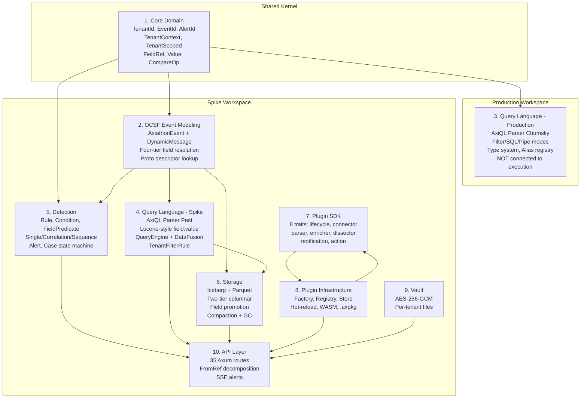

# Pass 8: Final Synthesis -- Axiathon

**Project:** Axiathon (Open-source Security Lake / SIEM)
**Date:** 2026-04-13
**Purpose:** Definitive reference for Prism's data normalization layer design
**Supersedes:** axiathon-broad-sweep.md (Pass 6 synthesis)
**Analysis basis:** 18 pass files across 6 passes + 13 deepening rounds + 1 coverage audit + 1 extraction validation + 1 corrections log
**Extraction accuracy:** 96% (42/42 behavioral items confirmed, 0 hallucinations, 6 minor metric discrepancies corrected)

---

## 1. Executive Summary

Axiathon is an early-stage Rust SIEM built on OCSF v1.7.0, organized as two completely separate Cargo workspaces: a production workspace (8 crates, 2 implemented, MSRV 1.85) and a spike/prototype workspace (19 crates, all implemented at varying maturity, MSRV 1.88). The production workspace contains a validated AxiQL parser (Chumsky 0.10, three query modes, type system, field alias registry) and shared domain types. The spike workspace contains the full working system: proto-backed OCSF events via prost-reflect DynamicMessage, Iceberg/Parquet storage with two-tier columnar architecture, a detection engine (single-event/correlation/sequence), an 8-trait plugin SDK, and an Axum REST API serving 35 routes.

The codebase's most significant architectural insight is the evolution from per-class typed event enums to a DynamicMessage wrapper enabling runtime field access across all 83 OCSF event classes without per-type code. The two-tier columnar storage pattern (hot Parquet columns + event_data JSON), three-tier field alias resolution, and vendor extension via unmapped JSON are the key patterns Prism should adopt or learn from.

Critical caveat: the production and spike workspaces have incompatible dependencies (prost 0.14 vs 0.13, prost-reflect 0.15 vs 0.14), different TenantId validation rules (UUID vs alphanumeric), and completely different AxiQL parser implementations (Chumsky SQL-like vs Pest Lucene-like). The production parser is not connected to any execution engine. The spike's entire query-to-storage pipeline uses the simpler Pest parser.

---

## 2. Complete Feature Set

### 2.1 Production Workspace (Implemented)

| Feature | Crate | Maturity | LOC |
|---------|-------|----------|-----|
| Shared domain types (TenantId, EventId, AlertId, TenantContext, SystemContext, TenantScoped, FieldRef, Value, CompareOp, StringOp) | axiathon-core | Production | ~612 |
| AxiQL parser: Filter mode (Splunk-style boolean) | axiathon-query | Production | ~1799 |
| AxiQL parser: SQL SELECT mode (projection, aggregation, GROUP BY, ORDER BY, LIMIT) | axiathon-query | Production | (included above) |
| AxiQL parser: Pipe mode (KQL-style: stats, sort, head, tail, dedup, fields) | axiathon-query | Production | (included above) |
| AxiQL type system (TypeConstraint, TypeError, FieldWarning) | axiathon-query | Production | (included above) |
| Three-tier field alias resolution (analyst -> AxiQL canonical -> OCSF canonical) | axiathon-query | Production | (included above) |
| Multi-version OCSF query support (OcsfVersionFilter, OcsfVersionAliasMap) | axiathon-query | Placeholder | (included above) |
| Security-hardened query parsing (CWE-400, CWE-674, CWE-1333, CWE-190, CWE-20) | axiathon-query | Production | (included above) |

### 2.2 Spike Workspace (Prototype)

| Feature | Crate | Maturity | LOC |
|---------|-------|----------|-----|
| Proto-backed OCSF events (DynamicMessage wrapper, four-tier field resolution) | spike/axiathon-core | Prototype | ~2977 |
| Arrow schema generation from proto descriptors (hot column selection, <200 cols) | spike/axiathon-core | Prototype | (included above) |
| Proto generation pipeline (OCSF JSON -> ocsf-proto-gen -> .proto -> prost-build) | spike/axiathon-core | Prototype | (included above) |
| Detection DSL parser (.axd format, Pest grammar) | spike/axiathon-detection | Prototype | ~1500 |
| Single-event detection engine (regex cache, per-tenant isolation) | spike/axiathon-detection | Prototype | (included above) |
| Correlation detection (sliding window, DashMap, group_by, count threshold) | spike/axiathon-detection | Prototype | (included above) |
| Sequence detection (ordered multi-step temporal matching) | spike/axiathon-detection | Prototype | (included above) |
| Alert + Case management (5-state machine, disposition, MTTD/MTTR) | spike/axiathon-detection | Prototype | (included above) |
| Spike AxiQL parser (Pest, Lucene-style field:value syntax) | spike/axiathon-query | Prototype | ~1944 |
| DataFusion query planner (table-per-class routing, COALESCE promotion) | spike/axiathon-query | Prototype | (included above) |
| TenantFilterRule (optimizer-level tenant isolation, OR bypass prevention) | spike/axiathon-query | Prototype | (included above) |
| json_extract_string UDF (tier-2 unmapped field access) | spike/axiathon-query | Prototype | (included above) |
| Iceberg/Parquet storage writer (buffered, Zstd, table-per-class) | spike/axiathon-storage | Prototype | ~800 |
| Field promotion (schema evolution, compaction backfill, COALESCE query) | spike/axiathon-storage | Prototype | (included above) |
| Compaction + GC (background tasks, Notify-based refresh) | spike/axiathon-storage | Prototype | (included above) |
| Plugin SDK (8 traits: lifecycle, connector, parser, enricher, dissector, notification, action) | spike/axiathon-plugin-sdk | Prototype | ~1000 |
| Plugin infrastructure (factory, registry, store, hot-reload, WASM stub, .axpkg packaging) | spike/axiathon-plugin | Prototype | (included above) |
| Syslog connector (TCP, RFC5424) + Claroty xDome connector (HTTP polling) | spike/axiathon-plugin-* | Prototype | (included above) |
| AES-256-GCM credential vault (Argon2 KDF, per-tenant files) | spike/axiathon-vault | Prototype | ~300 |
| Axum REST API (35 routes, tenant middleware, SSE alerts, FromRef decomposition) | spike/axiathon-api | Prototype | ~600 |
| React WebUI (20 components, CodeMirror .axd editor, SSE alert stream) | spike/webui | Prototype | ~4933 |

### 2.3 Not Implemented (Referenced in docs/.archive/)

WebUI (Zustand state management), TUI (Ratatui), edge collector, horizontal scaling, graph-aware detection, AI integration (axiathon-ai crate), rate limiting, authentication/RBAC, audit logging, event replay.

---

## 3. Bounded Context Map



### Context Boundaries and Translation

| From | To | Translation Mechanism |
|------|-----|----------------------|
| Plugin SDK -> OCSF Event | `ParserPlugin.parse(RawEvent) -> Vec<AxiathonEvent>` | Parser normalizes vendor bytes to OCSF proto messages |
| OCSF Event -> Storage | `events_to_record_batch_with_promotions()` | Flattens DynamicMessage to Arrow RecordBatch (tier 1 + tier 2 JSON) |
| Storage -> Query | DataFusion TableProvider + TenantFilterRule + json_extract_string UDF | SQL query over Parquet with tenant isolation |
| OCSF Event -> Detection | `event.get_field(path) -> Option<FieldValue>` | Four-tier field resolution for rule condition evaluation |
| Detection -> API | Alert broadcast channel (1024 capacity) + SSE stream | Real-time alert delivery to WebUI |

---

## 4. Behavioral Contract Summary

### 4.1 Contract Inventory

| Subsystem | Contracts | Confidence Distribution |
|-----------|-----------|------------------------|
| Core Types (BC-1.xx) | 15 | 14 HIGH, 1 MEDIUM |
| FieldRef (BC-1.06) | 4 | 4 HIGH (property-tested) |
| AxiQL Parser (BC-2.01-2.06) | 22 | 21 HIGH, 1 MEDIUM |
| Type System (BC-2.07-2.09) | 5 | 4 HIGH, 1 MEDIUM |
| Detection Parser (BC-3.05) | 9 | 9 HIGH |
| Detection Engine (BC-3.01-3.04) | 8 | 6 HIGH, 2 MEDIUM |
| Storage/Promotion (BC-4.01-4.02) | 7 | 5 HIGH, 2 MEDIUM |
| Event Field Resolution (BC-5.01) | 3 | 3 HIGH |
| Case Management (BC-6.01) | 3 | 3 HIGH |
| Coverage Audit (BC-AUDIT) | 5 | 5 HIGH |
| **Total** | **81** | **74 HIGH, 7 MEDIUM** |

### 4.2 Highest-Value Contracts for Prism

**BC-009 (AxiathonEvent.get_field):** Four-tier field resolution: (1) Axiathon-specific fields -> (2) proto descriptor fields via recursive descent -> (3) unmapped JSON blob -> (4) None. Empty proto3 defaults treated as absent. This is the central abstraction enabling schema-agnostic field access.

**BC-008 (Three-tier alias resolution):** `src_ip` -> `src.ip` -> `src_endpoint.ip`. Single HashMap lookup, no fixpoint iteration. 7 default aliases. Version-conditional resolution via OcsfVersionAliasMap.

**BC-012 (Arrow schema from proto):** Runtime schema generation with 3 Axiathon columns + tier-1 hot columns + 1 event_data JSON column. Hot nested objects (src_endpoint, dst_endpoint, user, service, finding) flattened one level. Total under 200 columns per class.

**BC-003 (parse_axiql security limits):** Max 64KB query, 128 nesting depth, 64 pipe stages, 1024-byte regex pattern. All CWE-cited. Regex uses finite automaton engine (immune to catastrophic backtracking).

**BC-TenantFilterRule:** DataFusion optimizer rule that injects `tenant_id = ?` into all query plans. Even explicit `WHERE tenant_id = 'other'` or OR bypass attempts are replaced. Verified by 5 integration tests including the OR bypass prevention test.

### 4.3 Gaps in Contract Coverage

| Gap | Impact | Notes |
|-----|--------|-------|
| Source::Sessions/Assets/Custom untested | LOW | Enum variants exist but no execution path |
| AxiQL error recovery not implemented | MEDIUM | Parser stops at first error (TODO Story 5.2) |
| Detection DSL has no security limits | MEDIUM | Unlike AxiQL which has max length/depth/regex |
| CrossVersionProjection placeholder | LOW | Story 5.3, no implementation |
| WASM plugin loading stub | LOW | extism dependency present, no functional code |

---

## 5. Architecture Decision Record

### ADR-1: DynamicMessage Over Typed Event Enums

**Context:** OCSF v1.7.0 defines 83 event classes across 7 categories. A typed enum approach requires a match arm per class.

**Decision:** Wrap `prost-reflect::DynamicMessage` in `AxiathonEvent`, enabling runtime field access by string path across all classes without per-class code.

**Consequences:** Field access is stringly-typed at runtime (no compile-time field validation). Proto descriptors must be compiled at build time via `build.rs`. The `DESCRIPTOR_POOL` static provides reflection metadata.

**Evidence:** The spike evolved from `OcsfEvent` enum (2 variants) to `AxiathonEvent` wrapping DynamicMessage. The enum approach was abandoned because it doesn't scale.

### ADR-2: Two-Tier Columnar Storage

**Context:** DataFusion's predicate pushdown for nested Parquet structs is partially broken (arrow-rs #5699, DataFusion #2581). Flat columns are 20-60x faster.

**Decision:** Tier 1 = flat Parquet columns for ~100-150 hot fields per class (configurable via `HOT_NESTED_OBJECTS`). Tier 2 = `event_data` JSON column containing the complete event.

**Consequences:** Fast predicate pushdown on tier 1. Any field accessible via `json_extract_string()` on tier 2. New hot columns added via Iceberg schema evolution without data migration. Column count stays under 200 per class (Iceberg comfort zone <300).

### ADR-3: Three-Tier Field Alias Resolution

**Context:** Analysts use shorthand field names (src_ip). OCSF uses nested paths (src_endpoint.ip). Query language needs a stable middle layer.

**Decision:** Three tiers: analyst shortcut -> AxiQL canonical -> OCSF canonical. Resolution via single HashMap lookup with `ResolvedField` provenance tracking (OcsfDirect, AliasResolved, Unknown pass-through).

**Consequences:** When OCSF schema evolves and fields move, only the alias registry updates. Queries remain stable. Version-conditional resolution via `OcsfVersionAliasMap` handles cross-version differences.

### ADR-4: Table-Per-Class Storage Routing

**Context:** OCSF event classes have different schemas. A single wide table would have 1000+ columns (83 classes x ~100 fields).

**Decision:** Each OCSF class_uid maps to a separate Iceberg table. Partitioned by `identity(tenant_id) + hour(event_time)`. Query routing extracts `class_uid` filter from query expression to target specific tables.

**Consequences:** Schema per table is manageable (~100-200 columns). Cross-class queries require querying all tables and concatenating results. The `extract_class_uid_filter()` function in the query planner handles routing.

### ADR-5: Vendor Extension via Unmapped JSON

**Context:** Vendor-specific fields (Claroty alert_type, purdue_level, etc.) are not in OCSF.

**Decision:** OCSF's `unmapped` field (a JSON string) stores all vendor-specific data. The `get_field()` resolution chain checks proto fields first, falls back to parsing unmapped JSON. Detection rules can reference vendor fields directly: `claroty.alert_type == "unauthorized_access"`.

**Consequences:** Vendor fields are accessible everywhere events are queried. Field promotion API (`promote_fields()`) can promote frequently-accessed vendor fields from tier 2 JSON to tier 1 Parquet columns. COALESCE query pattern provides transparent access to both old (JSON-only) and new (promoted column) data.

### ADR-6: Push-Based Plugin Ingestion via mpsc Channel

**Context:** Data sources have different collection patterns (TCP listen, HTTP poll, file tail).

**Decision:** `ConnectorPlugin.start(tx: mpsc::Sender<RawEvent>)` gives each connector a channel sender. Connectors own their collection loop. Pipeline receives on the channel receiver. Buffer capacity: 10,000 RawEvents.

**Consequences:** Connectors are fully decoupled from pipeline processing. Backpressure via channel capacity. Pipeline processes events sequentially: parse -> detect -> store. Single pipeline task (no worker pool).

### ADR-7: Dual Parser Architecture (Unintentional)

**Context:** Production is building a sophisticated Chumsky-based AxiQL parser. Spike needed a quick query language for the DataFusion integration.

**Decision (de facto):** Two completely different AxiQL parsers exist. Production: Chumsky 0.10, SQL-like `field = value`, three modes (Filter/SQL/Pipe), type system, security limits. Spike: Pest, Lucene-like `field:value`, filter-only, untyped, no security limits.

**Consequences:** The spike's entire query execution pipeline (QueryEngine -> DataFusion) uses the Pest parser. The production parser is orphaned -- not connected to any execution engine. Integrating the production parser with the spike's execution infrastructure would require building a new AST-to-DataFusion translation layer for the much richer AxiQLStatement AST.

### ADR-8: 9-Layer Tenant Isolation

**Context:** Multi-tenant MSSP product requires defense-in-depth tenant isolation.

**Decision:** Nine isolation layers: (1) API middleware X-Tenant-ID extraction, (2) DataFusion TenantFilterRule optimizer injection, (3) Iceberg partition by tenant_id, (4) Parquet reader partition pruning, (5) per-tenant detection engine maps, (6) per-tenant vault files, (7) per-tenant plugin instances, (8) TenantId newtype prevents string mixing, (9) TenantScoped trait in function signatures.

**Consequences:** Even a bug in one layer is caught by another. The TenantFilterRule is particularly strong -- it operates at the query optimizer level and prevents OR bypass attacks. Layer 9 (TenantScoped trait) exists only in production crates; spike has a simplified version.

---

## 6. Anti-Pattern Catalog

### 6.1 Structural Anti-Patterns

| # | Anti-Pattern | Impact | Location | Count | Prism Relevance |
|---|-------------|--------|----------|-------|-----------------|
| 1 | Public fields on AxiathonEvent | Prevents encapsulation migration | spike/event.rs | 78 call sites | HIGH -- avoid from day 1 |
| 2 | Public tenant_id on TenantContext | Security-critical field exposed | spike/tenant.rs | 93 call sites | HIGH -- use private fields + getters |
| 3 | Duplicate Severity enums | SeverityId (0-6 OCSF) vs Severity (Info-Critical detection) | core + detection | 2 types | MEDIUM -- define once in core |
| 4 | Duplicate FieldValue enums | event.rs vs ocsf.rs versions | spike/core | 2 types | MEDIUM -- single canonical type |
| 5 | Duplicate AxiathonError types | Production (9 variants) vs spike (12 variants) | both workspaces | 2 types | HIGH -- establish single error hierarchy early |
| 6 | Orphaned production parser | Not connected to any execution engine | axiathon-query | 1 subsystem | HIGH -- wire parser to execution from start |
| 7 | Dual AxiQL syntaxes | Lucene-like (spike) vs SQL-like (production) | both workspaces | 2 parsers | MEDIUM -- pick one syntax and commit |
| 8 | anyhow catch-all error variant | `Other(anyhow::Error)` loses structured info | spike/error.rs | 1 type | MEDIUM -- avoid; use typed variants |

### 6.2 Security Anti-Patterns (Spike Only)

| # | Anti-Pattern | CWE | Location |
|---|-------------|-----|----------|
| 9 | Hardcoded vault passphrase | CWE-798 | state.rs:429 |
| 10 | Static Argon2 salt | CWE-760 | vault.rs:126 |
| 11 | Permissive CORS (allow any origin) | CWE-942 | main.rs:66 |
| 12 | Unprotected admin endpoints | OWASP A01:2021 | main.rs:172 |
| 13 | No regex size limit in detection DSL | CWE-1333 | engine.rs:56 |
| 14 | Error info leakage to API | CWE-209 | 8 identified call sites |
| 15 | No forbid(unsafe_code) in spike | -- | All 19 spike crates |

### 6.3 Operational Anti-Patterns (Spike Only)

| # | Anti-Pattern | Impact | Location |
|---|-------------|--------|----------|
| 16 | In-memory stores don't survive restarts | AlertStore, CaseStore, PluginStore, correlation/sequence state all lost | state.rs |
| 17 | Only Connector + Parser plugins exercised | Enricher, Notification, ResponseAction are stub paths | pipeline.rs |
| 18 | Hardcoded 2-tenant list | "acme-corp", "globex-inc" in AppState::new() | state.rs |
| 19 | No graceful shutdown integration | Compaction/GC/pipeline have shutdown channels but not connected to server shutdown | main.rs |

---

## 7. Complexity Ranking

Subsystems ranked by implementation complexity and specification effort required:

| Rank | Subsystem | Complexity | Rationale |
|------|-----------|-----------|-----------|
| 1 | Storage (Iceberg + Parquet + field promotion) | VERY HIGH | Two-tier schema, table-per-class routing, compaction with backfill, GC, Iceberg fork dependency, partition strategy |
| 2 | OCSF Event Modeling (DynamicMessage + proto gen) | HIGH | Proto generation pipeline, runtime field access, four-tier resolution, Arrow schema derivation, vendor extension handling |
| 3 | AxiQL Parser (production Chumsky) | HIGH | Three query modes, 11 FilterExpr variants, type system, alias resolution, security hardening, error recovery (planned) |
| 4 | Detection Engine (single + correlation + sequence) | HIGH | Three match tiers, sliding windows, DashMap concurrency, sequence tracking, template interpolation, case management state machine |
| 5 | Plugin SDK + Infrastructure | MEDIUM-HIGH | 8 trait contracts, push-based channel architecture, per-tenant registry, hot-reload, WASM sandbox, .axpkg packaging |
| 6 | Query Execution (DataFusion integration) | MEDIUM | TenantFilterRule optimizer, json_extract_string UDF, COALESCE promotion, table-per-class routing, provider refresh |
| 7 | Tenant Isolation (9-layer model) | MEDIUM | Pervasive across all subsystems but each layer is individually simple |
| 8 | API Layer (Axum REST) | MEDIUM-LOW | Standard REST CRUD with FromRef decomposition, SSE streaming, tenant middleware |
| 9 | Vault (AES-256-GCM + Argon2) | LOW | Standard crypto patterns with per-tenant isolation |

---

## 8. Convergence Report

### 8.1 Rounds Per Pass

| Pass | Broad | R1 | R2 | R3 | R4 | Total Rounds | Convergence Point |
|------|-------|----|----|----|----|-------------|-------------------|
| 0 - Inventory | 1 | 1 | 1 (NITPICK) | -- | -- | 3 | R2: file manifest, dependency graph, tech stack complete |
| 1 - Architecture | 1 | 1 | 1 (NITPICK) | -- | -- | 3 | R2: dual workspace, 9-layer tenant isolation, deployment topology stable |
| 2 - Domain Model | 1 | 1 | 1 (NITPICK) | 1 (SUBSTANTIVE) | 1 (NITPICK) | 5 | R4: 114 types cataloged across 10 bounded contexts; dual parser and plugin SDK integrated |
| 3 - Behavioral Contracts | 1 | 1 | 1 (NITPICK) | -- | -- | 3 | R2: 81 contracts with test evidence |
| 4 - NFR Catalog | 1 | 1 | 1 (NITPICK) | -- | -- | 3 | R2: enforced/spike-only/missing classification complete |
| 5 - Conventions | 1 | 1 | 1 (NITPICK) | -- | -- | 3 | R2: 12 patterns, 19 anti-patterns, consistency assessment verified |

**Total: 20 rounds across 6 passes + broad sweep**

### 8.2 Novelty Trajectory

Pass 2 (Domain Model) required the most rounds (5) because R2's NITPICK declaration was premature -- R3 discovered the dual AxiQL parser architecture and the full plugin SDK trait hierarchy, both substantive findings that changed the bounded context map from 5 to 10 contexts. All other passes converged in 3 rounds (broad + 2 deepening).

### 8.3 Coverage Metrics

| Metric | Value |
|--------|-------|
| Rust source files analyzed | 117+ across both workspaces |
| TypeScript/TSX files analyzed | 29 (WebUI) |
| Proto files analyzed | 8 |
| Detection rule files analyzed | 6 |
| Public types cataloged (Tier A) | 114 of 206 total |
| Public types classified (Tier B/C) | 92 (operational infrastructure, DTOs, vendor wire types) |
| Bounded contexts identified | 10 |
| Behavioral contracts documented | 81 |
| NFRs cataloged | 40+ across 6 categories |
| Anti-patterns documented | 19 |
| Design patterns documented | 12 |

### 8.4 Validation Results

The extraction validation phase sampled 42 behavioral items and 24 numeric claims:
- **42/42 behavioral items CONFIRMED** (0 hallucinations)
- **15/24 numeric claims exact match** (Delta = 0)
- **6 numeric claims with non-zero delta** (LOC estimates x4, tracing counts, test counts -- all corrected)
- **3 numeric claims unverifiable** (config defaults not re-read)
- **Overall accuracy: 96%** with TRUST WITH CAVEATS rating

---

## 9. Lessons for Prism

### P0: Must Adopt (Critical for Prism's normalization layer)

#### P0-1: DynamicMessage Pattern for OCSF Events

Axiathon's evolution from `OcsfEvent` enum (2 variants, doesn't scale) to `AxiathonEvent` wrapping `prost-reflect::DynamicMessage` is the foundational pattern. OCSF v1.7.0 has 83 event classes. A typed enum requires 83 match arms for every operation; DynamicMessage provides runtime field access by string path with zero per-class code.

**What Prism should do:**
- Use `prost-reflect` for runtime OCSF field access
- Wrap DynamicMessage in a Prism-specific event struct with tenant_id and event_uid outside the proto
- Reference `ocsf-proto-gen` (MIT licensed, `github.com/1898andCo/ocsf-proto-gen`) for proto generation from the OCSF JSON export
- Implement the four-tier field resolution chain: (1) Prism-specific fields, (2) proto fields via recursive descent, (3) unmapped JSON fallback, (4) None

**What Prism should avoid:**
- Do NOT start with typed enums -- Axiathon tried this and abandoned it
- Do NOT use `google.protobuf.Struct` in proto definitions -- prost's Struct lacks serde support. Replace with `string` (JSON blob)
- Do NOT use hash-based proto field numbering -- Axiathon explored FNV-1a and abandoned it due to collisions. Sequential numbering is sufficient.

#### P0-2: Two-Tier Columnar Storage

Flat Parquet columns are 20-60x faster than nested structs for predicate pushdown in DataFusion (verified against arrow-rs #5699, DataFusion #2581). Axiathon's solution:

- **Tier 1 (hot columns):** Flat Parquet columns derived from proto descriptors. Configurable via `HOT_NESTED_OBJECTS` list (src_endpoint, dst_endpoint, user, service, finding are flattened; actor, metadata, device, session are NOT -- too wide). Keep under 200 columns per class.
- **Tier 2 (event_data):** JSON column containing the complete event. Accessed via `json_extract_string()` UDF.

**What Prism should do:**
- Implement the same two-tier pattern
- Use `HOT_NESTED_OBJECTS` to control which OCSF nested objects become flat columns
- Implement the field promotion API: `promote_fields()` for schema evolution + compaction backfill for existing data + COALESCE query pattern for transparent access
- Use Iceberg for schema evolution without data migration

#### P0-3: Vendor Extension Pattern via Unmapped JSON

OCSF's `unmapped` field is the escape hatch for vendor-specific data (Claroty alert_type, purdue_level, etc.). The detection engine and query engine both access vendor fields through the same `get_field()` resolution chain.

**What Prism should do:**
- Store vendor-specific fields in the `unmapped` JSON blob within OCSF events
- Support vendor field access in queries and detection rules via the four-tier resolution chain
- Consider promoting frequently-accessed vendor fields to tier 1 columns via field promotion

#### P0-4: Security-Hardened Query Parsing

Axiathon's AxiQL parser is a model for security-conscious parser design:

| Limit | Value | CWE |
|-------|-------|-----|
| Max query length | 64KB | CWE-400 |
| Max nesting depth | 128 | CWE-674 |
| Max pipe stages | 64 | CWE-400 |
| Max regex pattern | 1024 bytes | CWE-1333 |
| Regex engine | Rust `regex` (finite automaton) | CWE-1333 |
| CIDR validation | At parse time | CWE-20 |
| Integer overflow | i128 intermediate for i64::MIN | CWE-190 |

**What Prism should do:**
- Copy these exact limits (or calibrate to Prism's needs) for any query/filter language
- Use the Rust `regex` crate (finite automaton, immune to catastrophic backtracking)
- Validate all user-supplied patterns (regex, CIDR, field paths) at parse time, not execution time

### P1: Should Adopt (High value, adapt to Prism's architecture)

#### P1-1: Three-Tier Field Alias Resolution

Decouples the query language from OCSF schema evolution:

```
src_ip (analyst shortcut)
  -> src.ip (AxiQL canonical)
    -> src_endpoint.ip (OCSF canonical)
```

When OCSF evolves and fields move between versions, only the alias registry updates. Queries remain stable. The `OcsfVersionAliasMap` provides version-conditional resolution.

**What Prism should do:**
- Build a field alias registry early, before the query language is finalized
- Support analyst shortcuts as a first-class concept
- Plan for OCSF version evolution from the start

#### P1-2: Validated Constructor / Newtype Pattern

Every ID type and trust-boundary input uses:
- `new()` -- validates, returns Result (API input, deserialization)
- `new_unchecked()` -- skips validation (tests, database reads from trusted source)
- Private inner field, public getters

Applied to: TenantId, EventId, AlertId, FieldRef, PluginId. Prevents entire categories of bugs (invalid tenant IDs crossing boundaries, empty field paths, malformed plugin identifiers).

**What Prism should do:**
- Apply this pattern to ALL identity types from day 1
- Keep inner fields private -- Axiathon's spike has 78 call sites using public AxiathonEvent fields and 93 using public TenantContext.tenant_id, all marked as tech debt

#### P1-3: TenantFilterRule (Optimizer-Level Tenant Isolation)

A DataFusion optimizer rule that injects `tenant_id = ?` into all query plans at the optimizer level. Even if a user crafts `WHERE tenant_id = 'other_tenant'` or `WHERE tenant_id = 'a' OR tenant_id = 'b'`, the optimizer replaces it with the correct tenant. Verified by 5 integration tests including the OR bypass prevention test.

**What Prism should do:**
- Implement an equivalent optimizer rule for whatever query engine Prism uses
- Write the OR bypass test specifically -- it catches a subtle security gap

#### P1-4: Table-Per-Class Storage Routing

Each OCSF event class maps to a separate Iceberg table. This prevents a single 1000+ column wide table. The query planner extracts `class_uid` from the query to route to the correct table; without class_uid, it queries all tables and concatenates.

**What Prism should do:**
- Adopt table-per-class routing
- Partition by `identity(tenant_id) + hour(event_time)` (Axiathon's proven partition strategy)

#### P1-5: Non-Exhaustive Enums for Extensibility

29 `#[non_exhaustive]` annotations across the codebase. Applied to all enums that may gain variants (operations, AST nodes, error types, plugin kinds). Skipped for semantically closed enums (SortDirection: Asc/Desc).

**What Prism should do:**
- Apply `#[non_exhaustive]` to all extensible enums from the start
- Establish a clear convention: extensible vs closed

### P2: Consider Adopting (Valuable patterns, lower priority)

#### P2-1: Detection DSL Three-Tier Match System

The `.axd` grammar supports three progressively complex match types that cover standard SIEM use cases:
1. **Single-event:** `match event where <condition>` -- immediate evaluation
2. **Correlation:** `match count(event where ...) >= N group_by <fields> within <duration>` -- sliding window
3. **Sequence:** `match sequence by <key_field> within <duration> { step ... }` -- ordered multi-step

If Prism needs a detection language, this grammar is well-designed. The correlation engine uses DashMap for lock-free per-key sliding windows.

#### P2-2: Plugin SDK Push-Based Channel Architecture

Connectors push raw events via `mpsc::Sender<RawEvent>`. The pipeline receives on the channel. This decouples connectors from processing and provides natural backpressure (channel capacity = 10,000).

The 8-trait hierarchy covers: lifecycle, data collection, normalization (sync + async), enrichment, network protocol parsing, notification, and automated response. All traits are object-safe.

#### P2-3: Case Management State Machine

5-state case lifecycle (New -> Acknowledged -> Investigating -> Resolved -> Closed) with validated transitions including reopen paths (Resolved -> Investigating, Closed -> Investigating). Self-transitions and backwards-to-New are rejected. Disposition is a tagged enum: TruePositive, FalsePositive, Benign, Inconclusive.

#### P2-4: Builder-with-Notify Pattern

Background tasks (compaction, GC) accept an optional `Arc<Notify>` that fires after each successful operation. The query engine subscribes to this notification to refresh table providers without polling.

#### P2-5: SECURITY Comment Convention

Security-relevant decisions annotated with structured comments:
```rust
/// **SECURITY(CWE-209):** Display output is for internal logging only.
/// **SECURITY(CWE-798):** Hardcoded passphrase -- production must use KMS.
/// **SECURITY(OWASP A01:2021):** Admin endpoints unprotected.
```

This convention makes security decisions grep-able and auditable.

### P3: Learn From Mistakes (Anti-patterns to avoid)

#### P3-1: Do NOT Start with Public Struct Fields

Axiathon's spike has 78 call sites using `AxiathonEvent { tenant_id, event_uid, inner }` struct literals and 93 call sites accessing `ctx.tenant_id` directly. All marked with TODOs for migration to private fields + getters. This is a massive tech debt burden.

**Prism rule:** All domain types must have private fields from day 1. No exceptions.

#### P3-2: Do NOT Build Two Parsers for the Same Language

Axiathon has a production Chumsky parser (1799 LOC, 315 tests, three query modes, type system) that is NOT connected to any execution engine, and a spike Pest parser (353 LOC, 20 tests, filter-only) that IS connected to DataFusion. The production parser is orphaned.

**Prism rule:** Wire the parser to the execution engine from the first commit. Never develop a parser in isolation.

#### P3-3: Do NOT Maintain Separate Workspaces with Incompatible Dependencies

Axiathon's production and spike workspaces have different prost versions (0.14 vs 0.13), different prost-reflect versions (0.15 vs 0.14), different TenantId validation rules, and different error types. Promoting spike code to production requires version alignment, validator unification, error consolidation, and adding `forbid(unsafe_code)`.

**Prism rule:** Single workspace. If spike exploration is needed, use feature flags or a separate branch, not a separate workspace.

#### P3-4: Do NOT Duplicate Domain Types

Axiathon has duplicate Severity enums (SeverityId in core vs Severity in detection), duplicate FieldValue enums (event.rs vs ocsf.rs), and duplicate AxiathonError types (production 9 variants vs spike 12 variants). Each duplication creates maintenance burden and mapping code.

**Prism rule:** Define each domain concept once in the core crate. Detection severity should be the same type as OCSF severity (or a newtype wrapping it).

#### P3-5: Do NOT Ship Hardcoded Secrets Even in Prototypes

The spike has a hardcoded vault passphrase (`"axiathon-spike-test-key"`) and a static Argon2 salt (`b"axiathon-vault-salt-v1"`). Both are marked with SECURITY comments citing CWE-798 and CWE-760. Even in a spike, these patterns get copied.

**Prism rule:** Use environment variables or test-only configuration from the start. Never hardcode secrets.

#### P3-6: Avoid In-Memory-Only State for Anything That Matters

The spike's AlertStore, CaseStore, PluginStore, and correlation/sequence state are all in-memory only. They do not survive server restarts. Only Iceberg storage (SQLite catalog + Parquet files) persists.

**Prism rule:** If state matters for correctness or user experience, persist it from the start. Use Iceberg/SQLite for durable state.

---

## State Checkpoint

```yaml
pass: 8
status: complete
files_analyzed: 18 analysis files, 117+ Rust source files, 29 TS files, 8 proto files, 6 .axd files
types_cataloged: 114 (Tier A) + 92 (Tier B/C) = 206 total
bounded_contexts: 10
behavioral_contracts: 81
anti_patterns: 19
design_patterns: 12
convergence_rounds: 20 total
extraction_accuracy: 96%
timestamp: 2026-04-13T00:00:00Z
```
