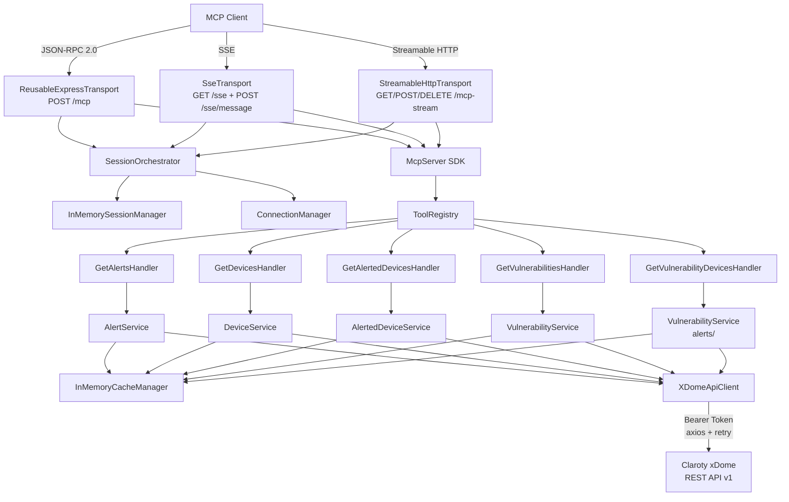
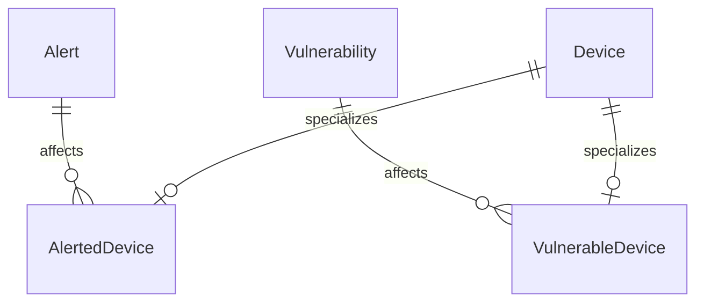

# Codebase Ingestion: mcp-claroty-xdome

**Project:** Claroty xDome MCP Server
**Version:** 0.1.14
**Author:** 1898andCo
**License:** Apache-2.0
**Analysis Date:** 2026-04-13

---

## Executive Summary

This is a TypeScript MCP (Model Context Protocol) server that bridges AI agents to the Claroty xDome OT/IoT cybersecurity platform. It exposes five read-only tools -- get_alerts, get_devices, get_alerted_devices, get_vulnerabilities, and get_vulnerability_devices -- over HTTP, SSE, and Streamable HTTP transports. The architecture follows a clean layered pattern: Tool Handlers -> Domain Services -> API Client, with dependency injection via tsyringe, Zod schema validation, in-memory caching, and a comprehensive error hierarchy mapped to JSON-RPC 2.0 error codes.

For Prism, this codebase demonstrates the canonical pattern for building an MCP server that wraps a security sensor's REST API, including how to handle authentication, pagination, filtering, caching, and error mapping.

---

## Pass 0: Inventory

### Tech Stack

| Component | Technology | Version |
|-----------|-----------|---------|
| Language | TypeScript | ^5.4.5 |
| Runtime | Node.js | >=18.0.0 |
| Module System | ESM (NodeNext) | -- |
| MCP SDK | @modelcontextprotocol/sdk | ^1.12.3 |
| HTTP Framework | Express | ^4.19.2 |
| HTTP Client | axios + axios-retry | ^1.11.0 / ^4.5.0 |
| DI Container | tsyringe | ^4.10.0 |
| Validation | Zod | 3.25.67 |
| Logging | Winston | 3.17.0 |
| Test Framework | Vitest | ^3.2.4 |
| Build | tsc (TypeScript compiler) | -- |
| Container | Docker (node:18-alpine) | -- |

### File Manifest (src/ -- 37 files)

| Path | Type | Purpose |
|------|------|---------|
| `src/main.ts` | Entry | Process bootstrap, signal handlers, fatal error handling |
| `src/server/factory.ts` | Factory | DI container setup, transport/tool registration, app assembly |
| `src/core/mcp-server-instance.ts` | Core | CoreMcpServer: tool registration with MCP SDK, Express lifecycle |
| `src/core/tool-registry.ts` | Core | Map-based tool handler registry |
| `src/core/base-tool-handler.ts` | Core | Abstract base class for all tool handlers (Template Method) |
| `src/core/transport-manager.ts` | Core | Registers and manages multiple transport implementations |
| `src/core/express-transport.ts` | Transport | HTTP POST /mcp transport (stateless request-response) |
| `src/core/sse-transport.ts` | Transport | SSE transport (GET /sse + POST /sse/message) |
| `src/core/streamable-http-transport.ts` | Transport | Streamable HTTP transport (GET/POST/DELETE /mcp-stream) |
| `src/core/session-orchestrator.ts` | Core | Bridges SessionManager (persistent) and ConnectionManager (live) |
| `src/core/connection-manager.ts` | Core | Manages live StatefulConnection instances |
| `src/core/in-memory-session-manager.ts` | Core | In-memory session store with UUID-based session IDs |
| `src/core/http-connection.ts` | Connection | HTTP request-response connection (short-lived) |
| `src/core/sse-connection.ts` | Connection | SSE persistent connection with event streaming |
| `src/core/streamable-http-connection.ts` | Connection | Hybrid: initial HTTP response + optional SSE upgrade |
| `src/core/app-router.ts` | Core | Singleton Express router for decoupled route definitions |
| `src/tools/get-alerts-handler.ts` | Tool | MCP tool: get_alerts |
| `src/tools/get-devices-handler.ts` | Tool | MCP tool: get_devices |
| `src/tools/get-alerted-devices-handler.ts` | Tool | MCP tool: get_alerted_devices |
| `src/tools/get-vulnerabilities-handler.ts` | Tool | MCP tool: get_vulnerabilities |
| `src/tools/get-vulnerability-devices-handler.ts` | Tool | MCP tool: get_vulnerability_devices |
| `src/domain/alerts/alert-service.ts` | Domain | Alert business logic + caching |
| `src/domain/alerts/alerted-device-service.ts` | Domain | Alerted device business logic + caching |
| `src/domain/alerts/vulnerability-service.ts` | Domain | Vulnerability-device junction logic + caching |
| `src/domain/devices/device-service.ts` | Domain | Device business logic + caching |
| `src/domain/vulnerabilities/vulnerability-service.ts` | Domain | Vulnerability business logic + caching |
| `src/integrations/claroty/xdome-api-client.ts` | Integration | Axios-based xDome REST API client with retry and error mapping |
| `src/schemas/get-alerts-schema.ts` | Schema | Zod schema for get_alerts input |
| `src/schemas/get-devices-schema.ts` | Schema | Zod schema for get_devices input |
| `src/schemas/get-alerted-devices-schema.ts` | Schema | Zod schema for get_alerted_devices input |
| `src/schemas/get-vulnerabilities-schema.ts` | Schema | Zod schema for get_vulnerabilities input |
| `src/schemas/get-vulnerability-devices-schema.ts` | Schema | Zod schema for get_vulnerability_devices input |
| `src/types/claroty.ts` | Types | TypeScript interfaces for xDome API request/response shapes |
| `src/types/mcp.ts` | Types | JSON-RPC, MCP transport, session, cache interfaces |
| `src/utils/errors.ts` | Utility | Hierarchical error classes mapped to JSON-RPC 2.0 codes |
| `src/utils/logger.ts` | Utility | Winston logger with custom levels, module-scoped child loggers |
| `src/utils/cache.ts` | Utility | Generic in-memory TTL cache (InMemoryCacheManager) |

### Test Coverage: 34 test files

- 16 unit tests for core/
- 5 unit tests for domain services
- 2 unit tests for API client
- 5 unit tests for tool handlers
- 3 unit tests for utilities
- 4 e2e integration tests
- 1 test setup file

---

## Pass 1: Architecture

### Layer Structure

```
+------------------+     +------------------+     +------------------+     +------------------+
|   MCP Client     | --> |  Transport Layer | --> |   Tool Layer     | --> |  Domain Layer    |
| (AI Agent/IDE)   |     |  (HTTP/SSE/      |     |  (Handlers +     |     |  (Services +     |
|                  |     |   Streamable)    |     |   Zod Schemas)   |     |   Caching)       |
+------------------+     +------------------+     +------------------+     +------------------+
                                                                                    |
                                                                          +------------------+
                                                                          | Integration Layer|
                                                                          | (XDomeApiClient) |
                                                                          +------------------+
                                                                                    |
                                                                          +------------------+
                                                                          | Claroty xDome    |
                                                                          | REST API         |
                                                                          +------------------+
```

### Component Catalog

1. **Transport Layer** (`src/core/express-transport.ts`, `sse-transport.ts`, `streamable-http-transport.ts`)
   - Implements three MCP transport protocols: stateless HTTP, SSE (Server-Sent Events), and Streamable HTTP
   - All transports are self-describing (register their own routes)
   - Managed by `TransportManager` which attaches Express middleware
   - Session management via `SessionOrchestrator` -> `SessionManager` + `ConnectionManager`

2. **Tool Layer** (`src/tools/*-handler.ts`, `src/schemas/*-schema.ts`)
   - Five tool handlers extending `BaseToolHandler<T>` (Template Method pattern)
   - Each handler: declares name/title/description/inputSchema, delegates to domain service
   - Zod schemas define exhaustive field enums, filter operations, sort clauses, pagination
   - All tool responses are `{ content: [{ type: "text", text: JSON.stringify(data) }] }`

3. **Domain Layer** (`src/domain/*/`)
   - Thin service wrappers that add caching over API client calls
   - Every service uses `CacheManager<T>` with 5-minute TTL (300,000ms)
   - Cache keys are `JSON.stringify(params)` -- simple but effective for read-only queries

4. **Integration Layer** (`src/integrations/claroty/xdome-api-client.ts`)
   - Single `XDomeApiClient` class wrapping all xDome REST API endpoints
   - Bearer token authentication via `Authorization: Bearer <token>` header
   - axios-retry with 3 retries, linear backoff (1s, 2s, 3s), retry on 429 + 5xx
   - 15-second timeout per request
   - Structured error mapping: 401/403 -> AuthenticationError, 404 -> NotFoundError, 422 -> ValidationError, other -> IntegrationError

5. **Cross-Cutting Concerns**
   - **DI:** tsyringe with decorator-based injection (`@injectable()`, `@singleton()`, `@inject()`)
   - **Logging:** Winston with custom levels (fatal through silly), module-scoped child loggers
   - **Errors:** Hierarchical error classes extending `McpError`, all mapped to JSON-RPC 2.0 error codes
   - **Caching:** Generic `InMemoryCacheManager<T>` with TTL-based expiration and cleanup

### Deployment Topology

- Single-service deployment (Express on port 3000)
- Docker container (node:18-alpine, multi-stage build, non-root user)
- docker-compose for development with volume mounts

### Architecture Diagram



---

## Pass 2: Domain Model

### Entity Catalog

#### 1. Alert (ClarotyAlert)

| Property | Type | Description |
|----------|------|-------------|
| id | number | Unique alert identifier |
| alert_type_name | string | Classification of the alert type |
| category | string | Alert category (e.g., "Security") |
| description | string | Human-readable description |
| detected_time | string (ISO8601) | When the alert was first detected |
| updated_time | string (ISO8601) | Last update timestamp |
| status | string | Alert status (e.g., "new", "open") |
| devices_count | number | Total affected devices |
| iot_devices_count | number | Affected IoT devices |
| it_devices_count | number | Affected IT devices |
| medical_devices_count | number | Affected medical devices |
| unresolved_devices_count | number | Devices not yet resolved |
| mitre_technique_enterprise_ids | string[] | MITRE ATT&CK Enterprise technique IDs |
| mitre_technique_enterprise_names | string[] | MITRE ATT&CK Enterprise technique names |
| mitre_technique_ics_ids | string[] | MITRE ATT&CK ICS technique IDs |
| mitre_technique_ics_names | string[] | MITRE ATT&CK ICS technique names |

#### 2. Device (ClarotyDevice)

| Property | Type | Description |
|----------|------|-------------|
| uid | string | Unique device identifier |
| asset_id | string | Asset management identifier |
| device_category | string | Category (OT, IT, IoT, Medical) |
| device_subcategory | string | Subcategory (e.g., "PLC", "HMI") |
| device_type | string | Specific device type |
| device_type_family | string | Device family grouping |
| ip_list | string[] | IP addresses |
| mac_list | string[] | MAC addresses |
| network_list | string[] | Networks the device belongs to |
| model | string | Hardware model |
| os_category | string | OS classification |
| risk_score | string | Risk assessment score |
| retired | boolean | Whether device is retired |
| vlan_list | number[] | VLAN memberships |
| labels | string[] | User-assigned labels |
| assignees | string[] | Assigned personnel |

**Note:** The device schema exposes ~180 queryable fields covering network topology, switch/AP info, CMMS integration, ISE/CPPM NAC data, risk scoring, and more. This is the richest entity in the model.

#### 3. Vulnerability (ClarotyVulnerability)

| Property | Type | Description |
|----------|------|-------------|
| id | string | Vulnerability identifier |
| name | string | Human-readable name |
| vulnerability_type | string | Classification |
| cve_ids | string[] | Associated CVE identifiers |
| cvss_v2_score | number? | CVSS v2 base score |
| cvss_v3_score | number? | CVSS v3 base score |
| is_known_exploited | boolean? | Known exploited vulnerability flag |
| affected_devices_count | number? | Total affected devices |
| epss_score | number? | Exploit Prediction Scoring System score |
| published_date | string? | CVE publication date |
| adjusted_vulnerability_score | number? | Context-adjusted score |
| recommendations | string? | Remediation recommendations |

#### 4. AlertedDevice (extends Device)

Adds: `is_resolved: boolean` -- whether the device's alert status has been resolved.

#### 5. VulnerableDevice (extends Device)

Adds: `vulnerability_relevance`, `vulnerability_source`, `vulnerability_status`, `vulnerability_last_updated`, `vulnerability_last_changed`.

### Entity Relationships



### Ubiquitous Language Glossary

| Term | Meaning |
|------|---------|
| Alert | A security event detected by xDome (network anomaly, policy violation, etc.) |
| Device | An OT/IoT/IT/Medical device discovered and tracked by xDome |
| Alerted Device | A device associated with a specific alert, with resolution status |
| Vulnerability | A known CVE or security weakness tracked against devices |
| Vulnerable Device | A device affected by a specific vulnerability |
| Risk Score | xDome's composite risk assessment for a device |
| MITRE Technique | ATT&CK framework technique associated with an alert |
| Purdue Level | ISA-95/Purdue Model network segmentation level |
| EPSS Score | Exploit Prediction Scoring System probability |

### Bounded Context Map

This server represents a single bounded context: **Security Asset Intelligence**. It is a read-only view over the Claroty xDome platform's:
- Alert management subsystem
- Device inventory subsystem
- Vulnerability management subsystem

There is no write path -- the MCP server only queries xDome, never modifies state.

---

## Pass 3: Behavioral Contracts

### BC-001: XDomeApiClient authenticates via Bearer token

**Preconditions:** `CLAROTY_XDOME_BASE_URL` and `CLAROTY_XDOME_API_TOKEN` environment variables are set
**Postconditions:** All API requests include `Authorization: Bearer <token>` header
**Error Cases:** Missing env vars -> `McpError` with `InvalidConfiguration` code (-32009)
**Evidence:** `xdome-api-client.ts:34-41` (constructor validation), `xdome-api-client.ts:52-58` (axios instance creation)
**Confidence:** HIGH (from code + constructor test)

### BC-002: API requests retry on transient failures

**Preconditions:** API request fails with 429 (rate limit) or 5xx (server error)
**Postconditions:** Request is retried up to 3 times with linear backoff (1s, 2s, 3s)
**Error Cases:** Non-retryable status codes (4xx except 429) are not retried
**Evidence:** `xdome-api-client.ts:64-79` (axios-retry configuration)
**Confidence:** HIGH (from code)

### BC-003: API errors are mapped to typed MCP errors

**Preconditions:** xDome API returns an error response
**Postconditions:**
- 401/403 -> `AuthenticationError` (code -32001)
- 404 -> `NotFoundError` (code -32003)
- 422 -> `ValidationError` (code -32602)
- Other -> `IntegrationError` (code -32007)
- Non-Axios errors -> `IntegrationError`
**Evidence:** `xdome-api-client.ts:202-234` (handleError method)
**Test Evidence:** `xdome-api-client.test.ts:94-137` (status code mapping tests)
**Confidence:** HIGH (from tests)

### BC-004: Domain services cache API responses for 5 minutes

**Preconditions:** Domain service method is called with parameters
**Postconditions:**
- Cache key = `JSON.stringify(params)`
- On cache hit: return cached response, do NOT call API
- On cache miss: call API, store response with 300,000ms TTL, return response
**Error Cases:** API errors propagate without caching the error
**Evidence:** All domain services follow identical pattern (alert-service.ts:40-67, device-service.ts:40-67, etc.)
**Test Evidence:** `alert-service.test.ts:102-252` (comprehensive caching behavior tests)
**Confidence:** HIGH (from tests)

### BC-005: Tool handlers serialize responses as JSON text content

**Preconditions:** Tool handler receives validated input
**Postconditions:** Returns `{ content: [{ type: "text", text: JSON.stringify(apiResponse) }] }`
**Error Cases:** Domain service errors propagate unmodified to MCP SDK
**Evidence:** All 5 tool handlers follow identical pattern
**Test Evidence:** `get-alerts-handler.test.ts:43-82` (response format assertion)
**Confidence:** HIGH (from tests)

### BC-006: Tool input is validated via Zod schemas before execution

**Preconditions:** MCP SDK receives a tool call
**Postconditions:** Input is validated against the handler's `inputSchema` (ZodObject)
**Key validations:**
- `fields` array must have at least 1 element
- `limit` must be 0-5000, defaults to 100
- `offset` defaults to 0
- `filter_by` supports simple and compound (and/or) recursive filters
- `sort_by` has field + asc/desc order
**Evidence:** All schema files (`src/schemas/*.ts`)
**Confidence:** HIGH (from schema definitions)

### BC-007: Session management creates/reuses sessions automatically

**Preconditions:** Transport receives a request
**Postconditions:**
- If `Mcp-Session-Id` header present and session exists: reuse session, touch last-access
- If header absent or session not found: create new session with UUID, return ID in response header
**Evidence:** `session-orchestrator.ts:36-79`
**Test Evidence:** `session-orchestrator.test.ts`, `in-memory-session-manager.test.ts`
**Confidence:** HIGH (from tests)

### BC-008: HTTP transport is stateless request-response

**Preconditions:** POST to /mcp with JSON-RPC 2.0 body
**Postconditions:** 
- Valid request with `id` -> JSON response with result
- Notification (no `id`) -> 204 No Content
- Invalid JSON-RPC -> 400 with error
**Evidence:** `express-transport.ts:34-101`
**Confidence:** HIGH (from code + test)

### BC-009: SSE transport maintains persistent connection

**Preconditions:** GET to /sse establishes SSE stream
**Postconditions:**
- SSE headers sent (text/event-stream, no-cache, keep-alive)
- `endpoint` event sent with message URL including sessionId
- Messages sent via POST /sse/message?sessionId=xxx
- Responses pushed over SSE as `event: message` with JSON-RPC data
**Evidence:** `sse-transport.ts`, `sse-connection.ts`
**Confidence:** HIGH (from code)

### BC-010: Streamable HTTP supports session initialization protocol

**Preconditions:** POST to /mcp-stream without session ID
**Postconditions:**
- Body must contain `method: "initialize"` or 400 error
- New session created, session ID returned in `Mcp-Session-Id` header
- Subsequent POSTs with session ID are routed to existing session
- GET with session ID upgrades to SSE stream
- DELETE with session ID terminates session
**Evidence:** `streamable-http-transport.ts:67-221`
**Confidence:** HIGH (from code)

### BC-011: get_devices adjusts fields for group_by queries

**Preconditions:** `group_by` parameter is specified in get_devices call
**Postconditions:** The `fields` parameter sent to xDome API is replaced with the `group_by` fields
**Rationale:** xDome API requires fields to match group_by when grouping
**Evidence:** `xdome-api-client.ts:107-113`
**Confidence:** MEDIUM (from code, no specific test)

### BC-012: Graceful shutdown on SIGINT/SIGTERM

**Preconditions:** Server is running
**Postconditions:** 
- Signal handlers registered for SIGINT and SIGTERM
- Shutdown closes all transports via TransportManager
- MCP server is closed
- Process exits with code 0
**Evidence:** `main.ts:29-38`, `mcp-server-instance.ts:174-216`
**Confidence:** HIGH (from code)

### BC-013: Health endpoint returns system diagnostics

**Preconditions:** GET /health
**Postconditions:** Returns JSON with status, uptime, memory usage, node version, dependency config status
**Evidence:** `mcp-server-instance.ts:127-161`
**Confidence:** HIGH (from code + e2e test)

---

## Pass 4: Non-Functional Requirements

### Performance

| NFR | Implementation | Value |
|-----|---------------|-------|
| API Timeout | axios timeout | 15,000ms |
| Response Caching | InMemoryCacheManager TTL | 300,000ms (5 min) |
| Pagination | offset/limit parameters | max 5,000 items per request |
| Request Body Size | Express JSON middleware limit | 10MB (on transport routes) |

### Reliability

| NFR | Implementation | Details |
|-----|---------------|---------|
| Retry on Failure | axios-retry | 3 retries, linear backoff, on 429 + 5xx |
| Graceful Shutdown | Signal handlers | SIGINT/SIGTERM -> close transports -> close MCP -> exit |
| Uncaught Exception Handler | process.on('uncaughtException') | Logs fatal error, exits with code 1 |
| Connection Premature Close | res.on('close') handling | Cleans up session/connection state |

### Security

| NFR | Implementation | Details |
|-----|---------------|---------|
| Authentication | Bearer token | Static API token from environment variable |
| CORS | cors middleware | `origin: "*"`, exposes `Mcp-Session-Id` header |
| Docker Security | Non-root user | Container runs as uid 1001 (nodejs user) |
| Secrets Management | .env file | Token never logged (only length logged) |
| Input Validation | Zod schemas | Strict schema validation with `.strict()` on some schemas |

### Observability

| NFR | Implementation | Details |
|-----|---------------|---------|
| Structured Logging | Winston | JSON format in production, colorized in development |
| Log Levels | Custom hierarchy | fatal, error, warn, info, http, verbose, debug, silly |
| Module-scoped Logs | createLogger(moduleName) | Child loggers with module metadata |
| Health Endpoint | GET /health | Uptime, memory, version, dependency status |

### Missing NFRs (expected but not found)

- **Rate limiting** on the MCP server itself (only retry on upstream rate limits)
- **Session expiration/cleanup** -- sessions are never evicted from memory
- **Metrics/telemetry** -- no Prometheus/StatsD/OpenTelemetry integration
- **Request tracing** -- no distributed tracing (trace IDs, spans)
- **Cache size limits** -- InMemoryCacheManager can grow unbounded
- **Authentication on MCP endpoints** -- any client can call /mcp, /sse, /mcp-stream without auth

---

## Pass 5: Convention & Pattern Catalog

### Design Patterns

| Pattern | Usage | Location |
|---------|-------|----------|
| **Template Method** | `BaseToolHandler<T>` abstract class with `handle()` method | `core/base-tool-handler.ts` |
| **Dependency Injection** | tsyringe `@injectable()`, `@singleton()`, `@inject()` decorators | All services and core classes |
| **Factory** | `createAndInitializeServer()` assembles entire DI graph | `server/factory.ts` |
| **Registry** | `ToolRegistry` stores tool handlers by name | `core/tool-registry.ts` |
| **Strategy** | Transport implementations behind `SelfDescribingTransport` interface | `core/*-transport.ts` |
| **Singleton** | `@singleton()` for `SessionOrchestrator`, `ConnectionManager` | `core/session-orchestrator.ts`, `core/connection-manager.ts` |
| **Self-Describing Components** | Transports declare their own routes via `getRegistrationDetails()` | `types/mcp.ts` SelfDescribingTransport |

### Naming Conventions

| Convention | Pattern | Examples |
|------------|---------|----------|
| File names | kebab-case | `alert-service.ts`, `get-alerts-handler.ts` |
| Classes | PascalCase | `AlertService`, `GetAlertsToolHandler` |
| Tool names | snake_case | `get_alerts`, `get_devices`, `get_vulnerability_devices` |
| Interfaces | PascalCase, no I-prefix | `SessionManager`, `CacheManager`, `StatefulConnection` |
| Test files | `<name>.test.ts` | `alert-service.test.ts` |
| Schema files | `<tool-name>-schema.ts` | `get-alerts-schema.ts` |

### Module Organization

```
src/
  core/          -- MCP infrastructure (transports, sessions, tool registry)
  domain/        -- Business logic services grouped by aggregate
    alerts/      -- AlertService, AlertedDeviceService, VulnerabilityService (alert-scoped)
    devices/     -- DeviceService
    vulnerabilities/  -- VulnerabilityService (vulnerability-scoped)
  integrations/  -- External API clients
    claroty/     -- XDomeApiClient
  schemas/       -- Zod input schemas (one per tool)
  tools/         -- MCP tool handlers (one per tool)
  types/         -- TypeScript interfaces and type definitions
  utils/         -- Shared utilities (logger, errors, cache)
```

### Error Handling Pattern

The codebase uses a consistent three-layer error propagation:

1. **Integration layer** (`XDomeApiClient.handleError`): Catches axios errors, maps HTTP status codes to typed `McpError` subclasses
2. **Domain layer**: Does NOT catch errors -- lets them propagate transparently through the caching layer
3. **Tool layer**: Does NOT catch errors -- MCP SDK catches them and maps to JSON-RPC error responses

Error hierarchy:
```
Error
  McpError (base, has code + data)
    ValidationError (-32602)
    AuthenticationError (-32001)
    AuthorizationError (-32002)
    NotFoundError (-32003)
      ToolNotFoundError (-32003)
    ConflictError (-32004)
    TooManyRequestsError (-32005)
    ServerError (-32000)
      DatabaseError (-32008)
      IntegrationError (-32007)
```

### Test Patterns

- **Vitest** with `vi.mock()` for module mocking
- **Manual mocks** for services: create mock objects with `vi.fn()` methods
- **AAA pattern** (Arrange-Act-Assert) consistently used
- **Error propagation tests**: verify that service errors bubble up unchanged
- **Cache behavior tests**: verify cache hit/miss/TTL behavior exhaustively
- **No integration test infrastructure** for actual xDome API calls (tests mock axios)

### Data Transformation Pattern (xDome API -> MCP Response)

The transformation is deliberately minimal:

1. **Input**: MCP tool arguments are Zod-validated, then passed directly to domain service
2. **Domain**: Domain service passes parameters to `XDomeApiClient` (with possible field adjustment for group_by)
3. **API Client**: Parameters are POST-ed as JSON body to xDome `/api/v1/<resource>` endpoints
4. **Response**: xDome response is returned as-is through the service layer
5. **Output**: Tool handler wraps raw API response in `{ content: [{ type: "text", text: JSON.stringify(response) }] }`

**Key insight**: There is zero transformation or enrichment of xDome data. The MCP server is a thin, validated passthrough. The Zod schemas provide the intelligence by constraining what AI agents can request.

### Anti-Patterns and Code Smells

1. **Duplicate VulnerabilityService classes**: Two separate `VulnerabilityService` classes exist -- one in `domain/alerts/` (handles vulnerability-device junctions) and one in `domain/vulnerabilities/` (handles vulnerability queries). The factory imports them with aliasing, which is confusing.

2. **Unbounded in-memory caches**: No maximum size limit on cache entries. Long-running servers with diverse queries could accumulate significant memory.

3. **No session expiration**: `InMemorySessionManager` never evicts sessions. Memory leak potential under sustained use.

4. **CORS wildcard in production**: `origin: "*"` is configured unconditionally, not just for development.

5. **Schema duplication**: Device field enums are duplicated across `get-devices-schema.ts`, `get-alerted-devices-schema.ts`, and `get-vulnerability-devices-schema.ts` (~180 fields each). Should be a shared base enum.

6. **Cast to any for SDK internal method**: `(this.mcpServer as any).setToolRequestHandlers()` in `mcp-server-instance.ts:119` -- accessing SDK internals.

---

## Pass 6: Synthesis

### Key Findings for Prism

1. **MCP Tool Design Pattern**: Each security data source (alerts, devices, vulnerabilities) gets its own dedicated tool with a Zod schema that constrains the query surface. The pattern is: `ToolHandler -> DomainService (with cache) -> ApiClient -> REST API`. This is the canonical pattern to replicate for Prism's sensor integrations.

2. **Authentication Model**: Simple Bearer token from environment variable. No OAuth, no token refresh, no multi-tenant auth. The token is configured once at server startup. For Prism, we may need a more sophisticated model if supporting multiple sensor instances.

3. **Filtering Architecture**: The xDome API uses POST-based querying with a rich filter language (simple field/operation/value filters composable into recursive and/or compound filters). The MCP schemas mirror this exactly, letting AI agents construct complex queries. This is a powerful pattern for giving AI agents expressive querying capabilities.

4. **Data Passthrough Philosophy**: This server does NOT transform xDome data. It validates inputs, caches responses, and serializes outputs as JSON text. The AI agent receives raw xDome data structures. This is a deliberate design choice that maximizes flexibility but pushes interpretation burden onto the AI agent.

5. **Transport Flexibility**: Three transport implementations (HTTP, SSE, Streamable HTTP) demonstrate the MCP protocol's transport-agnostic design. The `SelfDescribingTransport` pattern where transports register their own routes is clean and extensible.

6. **Session Management is Transport-Level**: Sessions exist to support MCP protocol requirements (request routing, SSE stream association), NOT for application-level state. There is no per-session query context or history.

### Confidence Assessment

| Area | Confidence | Basis |
|------|------------|-------|
| Architecture | HIGH | Clear layered design, well-documented in code |
| Domain Model | HIGH | TypeScript interfaces + Zod schemas are authoritative |
| Behavioral Contracts | HIGH | 34 test files with good coverage of core behaviors |
| NFRs | HIGH | Configuration values and patterns clearly visible in code |
| Conventions | HIGH | Consistent patterns across all tools/services |

### Gaps and Risks

1. **No write operations**: Server is read-only. Cannot update alert status, assign devices, or remediate vulnerabilities through MCP tools.
2. **No auto-pagination**: Tools expose offset/limit but don't automatically paginate large result sets. AI agents must manage pagination manually.
3. **No data enrichment**: Raw xDome data is passed through without correlation, aggregation, or summarization. An AI agent wanting "top 10 riskiest devices with open alerts" must make multiple tool calls.
4. **Memory management**: No bounds on cache size, session count, or connection count.
5. **src2/ directory**: Contains an alternate implementation that appears abandoned (19 files in a parallel structure). Not analyzed.

### Recommendations for Prism

1. **Adopt the same layered pattern**: `ToolHandler -> DomainService -> ApiClient` with DI. It's clean and testable.
2. **Use Zod schemas as the AI-facing contract**: The exhaustive field enums serve as documentation for AI agents about what data is available.
3. **Consider data enrichment**: Unlike this passthrough approach, Prism may benefit from cross-correlating data between sensors before exposing it to AI agents.
4. **Add cache bounds**: Implement LRU eviction or maximum entry counts.
5. **Add session TTL**: Implement session expiration with configurable timeout.
6. **Consolidate shared schemas**: Extract common device field enums into a shared module.
7. **Consider compound tools**: Tools that combine alert + device + vulnerability data to reduce round-trips for common AI agent workflows.
