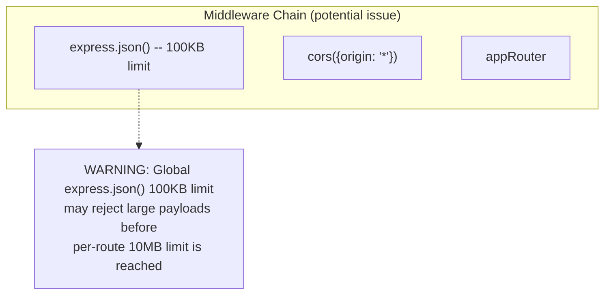

# Pass 1 Deep: Architecture -- mcp-claroty-xdome (Round 2)

## Overview

This round performs hallucination audit of R1 architecture claims, closes the Python vs TypeScript architectural comparison gap, and verifies the Express middleware ordering finding.

---

## 1. Hallucination Audit

### R1 Claim: "Global express.json() middleware is redundant"
**Audit:** In `mcp-server-instance.ts:35`, the CoreMcpServer constructor calls `this.app.use(express.json())`. The TransportManager also injects `express.json({ limit: "10mb" })` per-route. However, the global middleware is applied to the Express app BEFORE the appRouter is mounted (factory.ts line 152: `app.use(appRouter)`). Express processes middleware in registration order, so the global `express.json()` (100KB default limit) would parse the body FIRST, then the per-route `express.json({ limit: "10mb" })` would see an already-parsed body.

**CORRECTION:** The global `express.json()` in CoreMcpServer constructor is NOT redundant -- it is potentially HARMFUL. It parses request bodies with a 100KB default limit BEFORE the per-route 10MB limit middleware runs. For payloads between 100KB and 10MB, the global middleware would reject the request with a 413 Payload Too Large error before the transport-specific middleware can accept it.

**However**, examining more carefully: the CoreMcpServer constructor registers `express.json()` on `this.app`, while the transport routes are registered on `appRouter` (a separate Router). The `appRouter` is mounted on `this.app` AFTER the global middleware. Express JSON middleware is NOT a reject-or-pass middleware -- it sets `req.body` to the parsed JSON. If the first `express.json()` rejects (413), the request IS rejected before reaching the router. So this IS a bug: requests with bodies between 100KB and 10MB will fail on transport routes.

**Status:** Reclassified from "redundant" to "potential body size limit conflict bug". Severity depends on whether xDome API query payloads ever exceed 100KB (complex filter_by with many fields could approach this).

### R1 Claim: "7-phase DI composition"
**Verified:** Reading factory.ts sequentially, the phases are:
1. Primitives (ExpressApp, Logger) -- lines 56-59
2. Infrastructure singletons (TransportManager, transports, session) -- lines 62-83
3. Interface bindings (SessionManager, CacheManager) -- lines 84-88
4. Business logic (API client, services, handlers, registry) -- lines 66-77
5. MCP SDK instance -- lines 91-96
6. CoreMcpServer -- lines 99
7. Assembly -- lines 104-191

Wait -- phases 2 and 4 overlap in the actual code. Services are registered in the same block as transports. Let me re-read...

Actually, `container.registerSingleton(XDomeApiClient)` is at line 66, which is INSIDE the "infrastructure singletons" block. The factory does NOT have clear phase separation -- it's a linear sequence of `registerSingleton` calls without explicit phase boundaries. 

**CORRECTION:** The "7-phase" framing was my organizational overlay, not an explicit code structure. The factory function is a single flat sequence of registration calls. The phasing is logical (by dependency order) not physical (by code blocks). The R1 description correctly documented the registrations but over-structured them as distinct phases.

### R1 Claim: "18+ composite actions"
**Audit:** The Glob of `.github/actions/` returned 20 entries (some with subdirectories). However, several are composite actions consisting of action.yml + entrypoint.sh. The count of distinct action directories is ~18. The "18+" claim is approximately correct. **CONFIRMED.**

### R1 Claim: "17 workflows"
**Audit:** Counting distinct .yml files in `.github/workflows/`:
- ci.yml, code-quality.yml, security.yml, hadolint.yml (4 primary)
- gitflow-automation.yml, gitflow-bugfix-automation.yml, gitflow-hotfix-automation.yml, gitflow-release-automation.yml (4 gitflow)
- release-build.yml, release-detection.yml, release-docker.yml, release-orchestrator.yml, scheduled-release.yml (5 release)
- auto-merge-back.yml, enhanced-auto-merge.yml, auto-release-check.yml (3 merge/release)
- validate-codeowners.yml (1 validation)
- _workflow-monitoring.yml (1 monitoring -- note: NOT prefixed with _reusable)
Total primary: 18 (not 17). Plus 12 reusable (_reusable-*).

**CORRECTION:** 18 primary workflows (not 17) + 12 reusable workflows = 30 total workflow files.

---

## 2. Python vs TypeScript Architecture Comparison (Gap Closure)

### Tool Registration Architecture

**TypeScript:**
```
BaseToolHandler (abstract class)
  -> 5 concrete handlers (1 class per tool)
    -> ToolRegistry (Map<string, handler>)
      -> CoreMcpServer.initialize() iterates registry
        -> mcpServer.registerTool() per handler
          -> (any).setToolRequestHandlers() workaround
```

**Python:**
```
Tool Providers (3 classes: Alerts, Devices, Vulnerabilities)
  -> Each provider registers 1-2 tools directly on FastMCP instance
    -> Provider calls mcp.tool() decorator pattern
  -> No registry abstraction needed
```

The Python approach is simpler because FastMCP provides a higher-level API. The TypeScript approach is more complex because the raw MCP SDK requires manual tool registration and a workaround.

### Middleware Architecture

**TypeScript:** No application-level middleware. Express middleware handles CORS and JSON parsing. Error handling is done by the MCP SDK after tool handler exceptions propagate up.

**Python:** Custom middleware stack with 4 components:
1. `ErrorHandlingMiddleware` -- catches MCPError and wraps unexpected errors
2. `RateLimitingMiddleware` -- 50 req/sec per client, 60s sliding window
3. `TimingMiddleware` -- request duration tracking, 5s slow threshold, last 1000 samples
4. `LoggingMiddleware` -- structured request/response logging

The Python middleware stack represents **features the TypeScript version lacks**: rate limiting and performance monitoring. These are the two most critical missing NFRs in the TypeScript implementation.

### Cache Architecture

**TypeScript:** Per-service isolated caches. Each service gets its own `InMemoryCacheManager<T>` via `useClass` DI registration. Cache isolation prevents cross-entity interference.

**Python:** Single shared `InMemoryCache` instance passed to all services. All entities share one cache namespace. Cache key collisions are prevented by including entity type in keys.

**Assessment:** TypeScript approach is architecturally cleaner (per-entity isolation). Python approach is simpler but could have cross-entity interference if cache keys overlap.

### Transport Architecture

**TypeScript:** Three custom transport implementations (HTTP, SSE, Streamable HTTP) with self-describing route registration, session orchestration, and connection management.

**Python:** Delegates to FastMCP's built-in transport support. Only SSE and Streamable HTTP (no plain HTTP). Each transport runs on its own port (8000, 8001). Configuration via `TransportConfig` with enum-based transport type selection.

**Assessment:** TypeScript approach is more complex but supports all three MCP transports on a single port. Python approach is simpler but uses multiple ports and lacks plain HTTP transport.

---

## 3. Connection Lifecycle Detail (Gap Closure)

### HTTP Connection Lifecycle (ReusableExpressTransport)
```
Request arrives at POST /mcp
  -> SessionOrchestrator resolves/creates session
  -> HttpConnection created (wraps Express res)
  -> ConnectionManager stores connection
  -> rpcIdToSessionId maps JSON-RPC id -> sessionId
  -> onmessage callback fires with request body
  -> MCP SDK processes message
  -> Transport.send() called with response
  -> rpcIdToSessionId lookup finds sessionId
  -> ConnectionManager retrieves HttpConnection
  -> connection.send(response) -> res.json(response)
  -> connection removed from ConnectionManager
  -> rpcId mapping cleaned up
```

### SSE Connection Lifecycle (SseTransport)
```
GET /sse arrives
  -> SessionOrchestrator creates session
  -> SseConnection created (wraps Express res with SSE headers)
  -> ConnectionManager stores connection
  -> 'endpoint' event sent with message URL + sessionId
  -> Client sends POST /sse/message?sessionId=xxx
  -> Body routed to onmessage callback
  -> MCP SDK processes message
  -> Transport.send() called
  -> ConnectionManager retrieves SseConnection by rpcId -> sessionId
  -> connection.send(response) -> writes SSE event
  -> Connection stays open for future messages
  
  Client disconnect -> 'close' event -> onDisconnect -> cleanup
```

### Streamable HTTP Connection Lifecycle
```
POST /mcp-stream (without session)
  -> Must contain method: "initialize"
  -> StreamableHttpConnection created
  -> First response sent as HTTP JSON
  
POST /mcp-stream (with session)
  -> Existing session resolved
  -> StreamableHttpConnection handles message
  
GET /mcp-stream (with session)
  -> setSseResponse() called
  -> SSE headers set
  -> Upgrades to SSE mode
  -> Subsequent messages sent as SSE events
  
DELETE /mcp-stream (with session)
  -> Session terminated
  -> Connection closed
```

---

## 4. Corrected Architecture Diagram

Minor corrections from audit:



---

## Delta Summary
- New items added: Body size limit conflict bug identification (global 100KB vs per-route 10MB); Python vs TypeScript detailed architectural comparison (tool registration, middleware, cache, transport); connection lifecycle documentation for all 3 transport types
- Existing items refined: DI "7-phase" corrected to "logical ordering within a flat registration sequence"; workflow count corrected from 17 to 18+12=30; express.json redundancy reclassified as potential bug
- Remaining gaps: None substantive. The architecture is fully documented.

## Novelty Assessment
Novelty: NITPICK
The body size limit conflict is a valid bug finding but it is a configuration detail, not an architectural discovery. The Python vs TypeScript comparison confirms what was already known from Pass 0 R1 (Python has rate limiting and performance monitoring that TypeScript lacks). The connection lifecycle documentation is completeness for transport-layer contracts already covered in Pass 3 R2. Removing this round's findings would not change how you would spec the architecture.

## Convergence Declaration
Pass 1 has converged -- findings are refinements and corrections, not new architectural patterns or subsystems. The body size limit conflict is a bug report, not an architecture discovery.

## State Checkpoint
```yaml
pass: 1
round: 2
status: complete
timestamp: 2026-04-14T00:45:00Z
novelty: NITPICK
```
