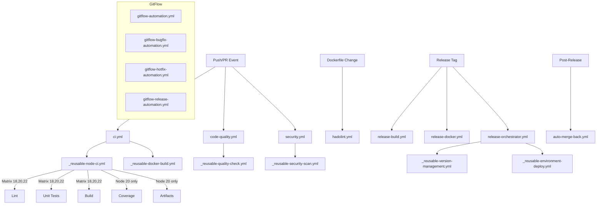
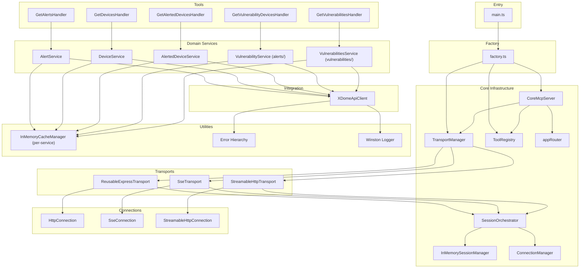

# Pass 1 Deep: Architecture -- mcp-claroty-xdome (Round 1)

## Overview

This deepening round extends the broad sweep's architecture analysis with discoveries from Pass 0 deepening (full inventory), Pass 2/3 convergence (domain model and behavioral contracts), and direct code inspection. Key findings include: the CI/CD pipeline architecture, the dual-language codebase strategy, the DI container composition pattern details, the SDK workaround architecture, and cross-cutting middleware chain ordering.

---

## 1. Dual-Language Architecture Strategy

The codebase contains two complete implementations of the same MCP server:

```
mcp-claroty-xdome/
  src/     -- TypeScript (primary, production)
  src2/    -- Python (secondary, experimental)
```

### TypeScript (src/) Architecture
- **Runtime:** Node.js >=18 with ESM modules (NodeNext)
- **Framework:** Express 4.x
- **DI:** tsyringe with decorator-based injection
- **MCP SDK:** @modelcontextprotocol/sdk (low-level, requires manual transport wiring)
- **Pattern:** Factory -> DI Container -> Singleton Services

### Python (src2/) Architecture
- **Runtime:** Python 3.11+ with asyncio
- **Framework:** FastMCP (high-level MCP wrapper)
- **DI:** Manual composition via `ServerComposer` class (no DI framework)
- **MCP SDK:** fastmcp (wraps mcp library with simpler API)
- **Pattern:** Composer -> Tool Providers -> Services -> API Client

**Architectural implication for Prism:** The Python implementation validates the domain model's portability across languages. The same 5 tools, 5 schemas, 5 services, and 1 API client structure translates cleanly to Python, confirming the architecture is language-agnostic.

---

## 2. DI Container Composition (Detailed)

The factory function (`src/server/factory.ts`) performs a specific ordering of registrations that matters:

### Phase 1: Primitive Dependencies
```
container.register("ExpressApp", { useValue: app })
container.register("Logger", { useValue: logger })
```

### Phase 2: Infrastructure Singletons (order-independent within phase)
```
container.registerSingleton(TransportManager)
container.registerSingleton(ReusableExpressTransport)
container.registerSingleton(SseTransport)
container.registerSingleton(StreamableHttpTransport)
container.registerSingleton(InMemorySessionManager)
container.registerSingleton(ConnectionManager)
container.registerSingleton(SessionOrchestrator)
```

### Phase 3: Interface-to-Implementation Bindings
```
container.register("SessionManager", { useToken: InMemorySessionManager })
container.register("CacheManager", { useClass: InMemoryCacheManager })
```

**Critical detail from Pass 2:** `"CacheManager"` uses `useClass` (not `useToken`), creating a **new InMemoryCacheManager per injection point**. This means each domain service gets its own isolated cache. This is the key architectural decision enabling per-entity cache isolation.

### Phase 4: Business Logic Singletons
```
container.registerSingleton(XDomeApiClient)
container.registerSingleton(AlertService)
container.registerSingleton(VulnerabilityService)      // alerts/ -- junction queries
container.registerSingleton(DeviceService)
container.registerSingleton(AlertedDeviceService)
container.registerSingleton(VulnerabilitiesService)    // vulnerabilities/ -- primary entity
container.registerSingleton(GetAlertsToolHandler)
... (5 tool handlers)
container.registerSingleton(ToolRegistry)
```

### Phase 5: MCP SDK Instance (value, not singleton)
```
const mcpServer = new McpServer({ name: "claroty-xdome-mcp", version: "0.1.0" })
container.register(McpServer, { useValue: mcpServer })
```

### Phase 6: Orchestration Server
```
container.registerSingleton(CoreMcpServer)
```

### Phase 7: Assembly (resolve and wire)
```
1. Resolve TransportManager
2. Read MCP_TRANSPORT_TYPE env var (default: all 3)
3. Resolve and register enabled transports
4. Configure CORS middleware
5. Mount appRouter
6. Resolve CoreMcpServer
7. Resolve ToolRegistry + all 5 handlers
8. Register handlers with ToolRegistry
9. Call coreMcpServer.initialize(toolRegistry)
```

---

## 3. Express Middleware Stack (Ordered)

The broad sweep did not document the middleware chain ordering, which is architecturally significant:

```
1. CORS middleware (origin: "*", exposes Mcp-Session-Id)
2. appRouter (Express.Router singleton)
   |
   +-- Per-transport routes:
   |   POST /mcp           -> JSON body parser (10MB limit) -> ReusableExpressTransport.middleware
   |   GET /sse             -> SseTransport.middleware
   |   POST /sse/message    -> JSON body parser (10MB limit) -> SseTransport.middleware
   |   GET /mcp-stream      -> StreamableHttpTransport.middleware
   |   POST /mcp-stream     -> JSON body parser (10MB limit) -> StreamableHttpTransport.middleware
   |   DELETE /mcp-stream   -> StreamableHttpTransport.middleware
   |
3. Express JSON middleware (global, from CoreMcpServer constructor)
4. /health endpoint (registered during start())
```

**Key observation:** The global `express.json()` middleware in CoreMcpServer constructor is redundant -- the TransportManager already injects `express.json({ limit: "10mb" })` for every POST route. The global middleware uses the default limit (100KB). However, because the appRouter routes are registered first, their per-route body parser takes precedence for transport routes, so the global middleware only affects the /health endpoint (which doesn't need it).

---

## 4. SDK Workaround Architecture

The `verify-server.ts` script and `mcp-server-instance.ts` both use the same workaround:

```typescript
(this.mcpServer as any).setToolRequestHandlers();
```

**Architectural context:** The MCP SDK's `McpServer.registerTool()` adds tools to an internal collection but does not immediately create the JSON-RPC request handlers. The `setToolRequestHandlers()` method finalizes tool registration by building the actual message dispatchers. This must be called after all tools are registered but before the server starts accepting requests.

This creates a **temporal coupling**: tools must be registered before `start()` is called, and `start()` must call `setToolRequestHandlers()` before `listen()`. The current architecture handles this correctly via the `initialize()` -> `start()` sequence.

**Risk:** This workaround accesses SDK internals. An SDK upgrade could break this method without warning.

---

## 5. Transport Registration Pattern (Self-Describing)

Each transport implements `SelfDescribingTransport`:

```typescript
interface SelfDescribingTransport extends Transport {
  getRegistrationDetails(): TransportRegistrationDetails[];
  middleware: (req: express.Request, res: express.Response) => void;
}
```

The `TransportManager.register()` method:
1. Calls `transport.getRegistrationDetails()` to get route/method pairs
2. For each detail, registers the route on `appRouter`:
   - POST routes get `express.json({ limit: "10mb" })` middleware prepended
   - GET/DELETE routes go directly to transport middleware
3. Stores `TransportRegistration` (detail + transport reference) for later use

**Transport route map:**

| Transport | Method | Path | Session Model |
|-----------|--------|------|---------------|
| ReusableExpressTransport | POST | /mcp | Per-request (short-lived HttpConnection) |
| SseTransport | GET | /sse | Persistent (SseConnection, long-lived SSE stream) |
| SseTransport | POST | /sse/message | Piggybacks on SSE session |
| StreamableHttpTransport | GET | /mcp-stream | Upgrades to SSE |
| StreamableHttpTransport | POST | /mcp-stream | Initial: HTTP response; subsequent: SSE |
| StreamableHttpTransport | DELETE | /mcp-stream | Session termination |

---

## 6. CI/CD Pipeline Architecture

The CI/CD is a sophisticated multi-workflow system built on reusable workflows and composite actions:



### GitFlow Branching Model
- **main:** Production branch
- **develop:** Integration branch
- **release/*:** Release preparation
- **hotfix/*:** Emergency fixes
- **bugfix/*:** Bug fix branches

### Supply Chain Security
- All GitHub Actions pinned by SHA (not tag)
- step-security/harden-runner on every workflow (egress auditing)
- Self-hosted runners for security-sensitive workflows
- Codecov integration with lcov reporting

---

## 7. Version Management Architecture

The version flows through a pipeline:

```
package.json (version: "0.1.14")
    |
    v [prebuild/pretest:unit/prelint hooks]
scripts/generate-version.js
    |
    v [writes to gitignored directory]
src/generated/version.ts  -->  export const APP_VERSION = "0.1.14"
    |
    v [imported by]
src/core/mcp-server-instance.ts  -->  /health endpoint returns version
```

The `src/generated/` directory is in `.gitignore` -- the version file is regenerated on every build, test, and lint run via npm `pre*` hooks. This ensures the health endpoint always reports the current version.

---

## 8. Error Propagation Architecture (Refined)

From Pass 3 deepening, the error flow is more precisely:

```
xDome REST API
    | (HTTP error response)
    v
XDomeApiClient.handleError()  -- Maps HTTP status to typed McpError subclass
    | (throws typed McpError)
    v
Domain Service (e.g., AlertService.findAlerts)  -- TRANSPARENT: no catch, error passes through cache layer
    | (throws typed McpError)
    v
BaseToolHandler.handle()  -- TRANSPARENT: no catch
    | (throws typed McpError)
    v
MCP SDK (mcpServer)  -- Catches error, maps to JSON-RPC 2.0 error response
    | (JSON-RPC error response)
    v
Transport  -- Sends error response to client
```

**Key architectural property:** Only two layers catch errors: the API client (for mapping) and the MCP SDK (for serialization). All intermediate layers are transparent. This means error types are preserved end-to-end.

---

## 9. Planned Architecture Expansion (.archive/)

The `.archive/` directory reveals the planned full architecture:

Current (5 read-only tools):
```
Alerts -> Devices (junction)
Devices
Vulnerabilities -> Devices (junction)
```

Planned (51 tools, 10 categories):
```
Alerts (read + write)
Devices (read + relations + write)
Vulnerabilities (read + write relevance)
CMMS (full CRUD + matching)
Custom Attributes (set + replace)
Edge Management (CRUD + uploads)
OT Activity Events (read)
Purdue Level (write)
Site Attribution Rules (full CRUD)
Site Groups (full CRUD)
Sites (full CRUD)
User Actions (assignees, labels, notes)
```

**Architectural implication:** The planned expansion adds write operations, which will require:
1. New error types for write conflicts
2. Idempotency handling for mutation operations
3. Cache invalidation after writes
4. Potentially different authorization levels (read vs. write tokens)

---

## 10. Component Dependency Graph (Corrected)



---

## Delta Summary
- New items added: Dual-language architecture strategy; DI container 7-phase composition sequence; Express middleware stack ordering (with redundancy finding); SDK workaround architecture; transport registration pattern detail (6 routes); CI/CD pipeline architecture (17 workflows, 12 reusable, 18+ actions); version management pipeline; planned architecture expansion (51 tools from .archive/); corrected component dependency graph
- Existing items refined: Error propagation flow now specifies the transparent-catch architecture property; middleware ordering clarified CORS -> appRouter -> global JSON
- Remaining gaps: Python (src2/) architecture comparison at component level; performance characteristics of the 3 transport types under load; connection lifecycle management for long-lived SSE connections

## Novelty Assessment
Novelty: SUBSTANTIVE
The CI/CD pipeline architecture, dual-language strategy, DI container phasing, Express middleware ordering (including the redundancy finding), planned 51-tool expansion roadmap, and the SDK workaround's temporal coupling all change how you would spec this system. The broad sweep presented a simple 4-layer architecture; the actual system has significant CI/CD infrastructure, a parallel Python implementation, and a documented expansion path to 10x current tool count.

## Convergence Declaration
Another round needed -- the following substantive gaps remain: (1) Python vs TypeScript architectural comparison, (2) detailed transport lifecycle and connection state management, (3) verification of the Express middleware redundancy finding.

## State Checkpoint
```yaml
pass: 1
round: 1
status: complete
timestamp: 2026-04-13T23:45:00Z
novelty: SUBSTANTIVE
```
