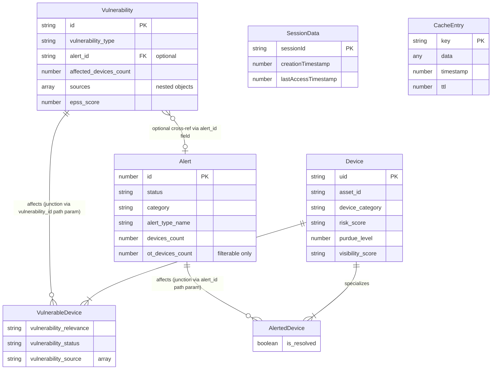

# Pass 2 Deep: Domain Model -- mcp-claroty-xdome (Round 2)

## Overview

This round targets the remaining gaps from Round 1: (1) the two VulnerabilityService classes and their semantic differences, (2) the group_by query mode, (3) pagination semantics, (4) schema default values as domain defaults, and (5) connection/transport domain types.

---

## 1. Two VulnerabilityService Classes: Semantic Split

The broad sweep noted this as an anti-pattern. Round 1 documented both but did not fully characterize the semantic difference. Here is the complete picture:

### VulnerabilityService A: `src/domain/alerts/vulnerability-service.ts`

- **Location:** `domain/alerts/` directory
- **Injected as:** `VulnerabilityService` (unaliased import in factory.ts:18)
- **DI Token:** Registered as singleton `VulnerabilityService` (factory.ts:68)
- **Responsibility:** Queries **devices affected by a specific vulnerability** (junction entity)
- **Method:** `findVulnerabilityDevices(params: GetVulnerabilityDevicesInput)`
- **API call:** `POST /api/v1/vulnerabilities/{vulnerability_id}/devices`
- **Return type:** `GetVulnerabilityDevicesResponse` (contains `ClarotyVulnerableDevice[]`)
- **Param decomposition:** Yes -- destructures `vulnerability_id` from params before API call
- **Used by:** `GetVulnerabilityDevicesToolHandler` (tool: `get_vulnerability_devices`)

### VulnerabilityService B: `src/domain/vulnerabilities/vulnerability-service.ts`

- **Location:** `domain/vulnerabilities/` directory
- **Imported as:** `VulnerabilitiesService` (aliased import in factory.ts:21)
- **DI Token:** Registered as singleton `VulnerabilitiesService` (factory.ts:71)
- **Responsibility:** Queries **vulnerability records themselves** (primary entity)
- **Method:** `findVulnerabilities(params: GetVulnerabilitiesParameters)`
- **API call:** `POST /api/v1/vulnerabilities`
- **Return type:** `GetVulnerabilitiesResponse` (contains `ClarotyVulnerability[]`)
- **Param decomposition:** No -- passes params directly
- **Used by:** `GetVulnerabilitiesToolHandler` (tool: `get_vulnerabilities`)

### Semantic distinction

| Aspect | Service A (alerts/) | Service B (vulnerabilities/) |
|--------|-------------------|-----------------------------|
| Entity queried | VulnerableDevice (junction) | Vulnerability (primary) |
| API path | `/vulnerabilities/{id}/devices` | `/vulnerabilities` |
| Parent entity ID | vulnerability_id (path param) | N/A |
| Response wraps | `devices: ClarotyVulnerableDevice[]` | `vulnerabilities: ClarotyVulnerability[]` |
| Cache type param | `CacheManager<GetVulnerabilityDevicesResponse>` | `CacheManager<GetVulnerabilitiesResponse>` |

The naming collision is genuinely confusing but the semantic split is clean: Service A queries the vulnerability-device junction table, Service B queries the vulnerability catalog.

---

## 2. The group_by Query Mode

Only the `get_devices` tool supports `group_by`. This creates a distinct query mode:

### Normal mode (all 5 tools):
```
POST /api/v1/{resource}
{fields: [...], filter_by?: {...}, sort_by?: [...], offset: N, limit: N, include_count: bool}
```

### Grouped mode (get_devices only):
```
POST /api/v1/devices
{fields: <REPLACED by group_by>, group_by: [...], filter_by?: {...}, sort_by?: [...], offset: N, limit: N, include_count: bool}
```

**Key domain semantics:**
- `group_by` must be an array of `DeviceFieldsEnum` values with `.min(1)`
- When `group_by` is present, the `fields` parameter in the request payload is OVERWRITTEN with the `group_by` values (xDome API requirement)
- The original `fields` from the user input are silently discarded
- This replacement happens at the API client layer (`xdome-api-client.ts:111-112`), not the service layer
- The shallow copy (`{...params}`) prevents mutation of the caller's object

### group_by as a value object:
```typescript
group_by?: DeviceFieldsEnum[]  // min(1) when present
```

This is effectively a device aggregation query -- the response presumably returns grouped/aggregated results rather than individual devices.

---

## 3. Pagination Value Object and Semantics

The pagination model is consistent across all 5 tools:

```typescript
{
  offset: number;   // default: 0, int
  limit: number;    // default: 100, min: 0, max: 5000, int
  include_count: boolean;  // default: false
}
```

### Semantic constraint (from Zod description):
> "Include results count in the response. Only available when offset is 0."

This means `include_count: true` is only meaningful for the FIRST page. The count is NOT returned for subsequent pages (offset > 0). This is a xDome API constraint, not enforced by the MCP Zod schema (no conditional validation).

### Pagination composite (implicit value object):
All 5 schemas share identical pagination fields with identical constraints. This is a de facto shared value object despite being duplicated in each schema.

---

## 4. Schema Default Values as Domain Defaults

Zod defaults serve as the domain's default behavior for AI agents:

| Schema | Default Behavior |
|--------|-----------------|
| get_alerts | sort by `id` ascending, limit 100, offset 0, no count |
| get_devices | no sort (undefined), limit 100, offset 0, no count |
| get_alerted_devices | no sort (undefined), limit 100, offset 0, no count |
| get_vulnerabilities | sort by `published_date` descending, limit 100, offset 0, no count |
| get_vulnerability_devices | no sort (undefined), limit 100, offset 0, no count |

**Key insight:** Alerts default to ID ordering (stable pagination). Vulnerabilities default to newest-first (relevance ordering). Devices have no default sort -- the AI agent must specify sort order or accept xDome's server-side default.

---

## 5. Connection and Transport Domain Types

### StatefulConnection (Interface)

**Source:** `src/types/mcp.ts:108-112`

```typescript
interface StatefulConnection {
  readonly sessionId: string;
  send(message: JsonRpcResponse | JsonRpcErrorResponse): Promise<void>;
  close(): void;
}
```

Three implementations exist:
1. **HttpConnection** (`src/core/http-connection.ts`) -- Short-lived, sends JSON response then closes
2. **SseConnection** (`src/core/sse-connection.ts`) -- Long-lived, writes SSE events
3. **StreamableHttpConnection** (`src/core/streamable-http-connection.ts`) -- Hybrid: first message as HTTP response, subsequent via SSE

### StreamableHttpConnection State Machine

From the test file (`streamable-http-connection.test.ts`), this connection has a two-phase lifecycle:

```
[Initial State: HTTP Mode]
  |
  | send(firstMessage) --> responds via initialResponse.json()
  |
  v
[Transition: setSseResponse() called]
  |
  | Sets SSE headers: Content-Type: text/event-stream, Cache-Control: no-cache, Connection: keep-alive
  | Flushes headers
  | Registers 'close' event listener
  |
  v
[SSE Mode]
  |
  | send(subsequentMessages) --> writes "event: message\ndata: {json}\n\n" to SSE stream
  |
  v
[Close]
  | close() --> ends SSE stream, calls onDisconnect
  | OR client disconnect --> 'close' event triggers onDisconnect
```

### SseTransport Registration Details

```typescript
[
  { path: "/sse", method: "GET" },      // SSE stream establishment
  { path: "/sse/message", method: "POST" }  // Message submission
]
```

### ReusableExpressTransport

Uses an internal `rpcIdToSessionId` Map to correlate JSON-RPC request IDs to session IDs. After sending the response, the connection is removed (`removeConnection`).

### TransportManager

Manages a flat list of `TransportRegistration` objects. Uses the `appRouter` singleton to register routes. POST routes get an Express JSON body parser middleware injected before the transport middleware. GET/DELETE routes go directly to transport middleware.

---

## 6. JsonRpcRequest Type Guard

**Source:** `src/types/mcp.ts:46-48`

```typescript
function isJsonRpcRequest(message: unknown): message is JsonRpcRequest {
  return typeof message === 'object' && message !== null && 'method' in message;
}
```

This is the only type guard in the codebase. It distinguishes JSON-RPC requests from notifications/responses by checking for the `method` property. Used in transport middleware to determine request routing.

---

## 7. APP_VERSION Generated Constant

**Source:** `src/generated/version.js` (referenced by `mcp-server-instance.ts:8`)

The health endpoint returns `APP_VERSION` which comes from a generated file. The test (`health-endpoint.test.ts:70-76`) asserts it matches semantic versioning pattern `/^\d+\.\d+\.\d+/`.

---

## 8. Corrected Entity Relationship Diagram (Final)



---

## 9. Complete Ubiquitous Language Glossary (Extended)

| Term | Meaning | Source |
|------|---------|--------|
| Alert | A security event detected by xDome | ClarotyAlert interface |
| Device | An OT/IoT/IT/Medical device tracked by xDome | ClarotyDevice interface |
| Alerted Device | A device associated with a specific alert, with resolution status | ClarotyAlertedDevice interface |
| Vulnerability | A known CVE or security weakness | ClarotyVulnerability interface |
| Vulnerable Device | A device affected by a specific vulnerability | ClarotyVulnerableDevice interface |
| Risk Score | Composite risk assessment for a device (string, not numeric) | ClarotyDevice.risk_score |
| MITRE Technique | ATT&CK framework technique (Enterprise or ICS) | ClarotyAlert.mitre_technique_* |
| Purdue Level | ISA-95/Purdue Model network segmentation level | Device field enum |
| EPSS Score | Exploit Prediction Scoring System probability (0.0-1.0) | ClarotyVulnerability.epss_score |
| Adjusted Vulnerability Score | Context-adjusted risk score (factors in device context) | ClarotyVulnerability.adjusted_vulnerability_score |
| Vulnerability Relevance | Assessment of device-vulnerability link: Confirmed, Potentially Relevant, Irrelevant | ClarotyVulnerableDevice.vulnerability_relevance |
| KEV | Known Exploited Vulnerabilities (CISA catalog) | ClarotyVulnerability.is_known_exploited |
| Simple Filter | Single field/operation/value filter | SimpleQueryFilter |
| Compound Filter | Boolean combination (and/or) of filters | CompoundQueryFilter |
| Group By | Aggregation query mode (devices only) | GetDevicesInput.group_by |
| Session | MCP protocol session with UUID identifier | SessionData |
| Transport | Protocol implementation (HTTP/SSE/Streamable) | SelfDescribingTransport |
| Tool | MCP tool exposed to AI agents | BaseToolHandler |
| Stateful Connection | Live connection with send/close capability | StatefulConnection interface |

---

## Delta Summary
- New items added: VulnerabilityService semantic split analysis (complete factory import tracing); group_by query mode as distinct concept; pagination composite value object with include_count constraint; schema default values table; StreamableHttpConnection state machine; JsonRpcRequest type guard; APP_VERSION constant; connection implementation catalog (3 types)
- Existing items refined: Entity relationship diagram now includes SessionData and CacheEntry as infrastructure entities; ubiquitous language glossary extended from 9 to 19 terms
- Remaining gaps: None substantive. The `src2/` alternate implementation remains unanalyzed but is explicitly out of scope (described as abandoned in broad sweep).

## Novelty Assessment
Novelty: NITPICK
The VulnerabilityService semantic split, while newly documented in detail, was already identified in the broad sweep as an anti-pattern. The group_by query mode, pagination semantics, and schema defaults are refinements of known patterns, not new entities or relationships. The connection type implementations and StreamableHttpConnection state machine are transport-layer infrastructure details that refine but do not change the domain model. Removing this round's findings would not change how you would spec the domain entities, relationships, or query contract.

## Convergence Declaration
Pass 2 has converged -- findings are refinements of the model established in Round 1, not new domain entities, relationships, or concepts that change the specification.

## State Checkpoint
```yaml
pass: 2
round: 2
status: complete
timestamp: 2026-04-13T00:00:00Z
novelty: NITPICK
```
