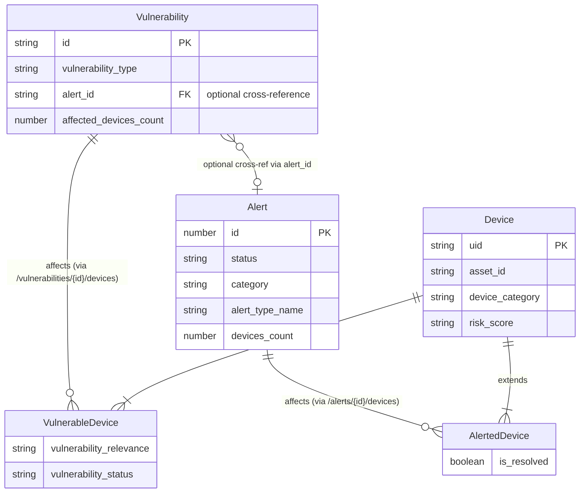

# Pass 2 Deep: Domain Model -- mcp-claroty-xdome (Round 1)

## Overview

This deepening round moves beyond the broad sweep's entity catalog to extract the full domain model from TypeScript interfaces, Zod schemas, and runtime behavior. The broad sweep correctly identified the five core entities but underrepresented value objects, the query language model, the filter operation taxonomy differences between schemas, and the complete set of device field subdomains.

---

## 1. Complete Entity Catalog

### 1.1 Alert (ClarotyAlert)

**Source:** `src/types/claroty.ts:26-43`

| Property | Type | Required | Domain Semantics |
|----------|------|----------|-----------------|
| id | number | yes | Primary key, numeric auto-increment |
| alert_type_name | string | yes | Classification taxonomy (e.g., "Unauthorized Communication") |
| category | string | yes | Top-level grouping (e.g., "Security", "Policy") |
| description | string | yes | Human-readable narrative |
| detected_time | string (ISO8601) | yes | First detection timestamp |
| updated_time | string (ISO8601) | yes | Last state-change timestamp |
| status | string | yes | Lifecycle state: "new", "open", etc. |
| devices_count | number | yes | Total affected device count |
| iot_devices_count | number | yes | IoT-category affected count |
| it_devices_count | number | yes | IT-category affected count |
| medical_devices_count | number | yes | Medical-category affected count |
| unresolved_devices_count | number | yes | Devices without resolution |
| mitre_technique_enterprise_ids | string[] | yes | MITRE ATT&CK Enterprise IDs |
| mitre_technique_enterprise_names | string[] | yes | MITRE ATT&CK Enterprise names |
| mitre_technique_ics_ids | string[] | yes | MITRE ATT&CK ICS IDs |
| mitre_technique_ics_names | string[] | yes | MITRE ATT&CK ICS names |

**Key observations:**
- Alert uses numeric `id` (number), unlike Device which uses string `uid`
- Device counts are pre-aggregated by category (IoT/IT/Medical/OT) -- but note OT count is NOT on the interface, only on the filterable fields enum
- MITRE mappings are parallel arrays (ids align with names by index)

**Filterable fields (from Zod schema, not on interface):**
`alert_name`, `alert_class`, `ot_devices_count`, `malicious_ip_tags_list` -- these 4 fields exist in the Zod enum `alertFilterableFields` but NOT on the `ClarotyAlert` interface. This means xDome returns these fields dynamically based on the `fields` parameter, and the TypeScript interface only models a representative subset.

### 1.2 Device (ClarotyDevice)

**Source:** `src/types/claroty.ts:55-72`

The interface models only 16 core fields, but the Zod schema `DeviceFieldsEnum` enumerates **176 queryable fields**. This is the richest entity. The interface is a deliberately minimal projection.

**Core interface fields:** uid, asset_id, device_category, device_subcategory, device_type, device_type_family, ip_list, mac_list, network_list, model, os_category, risk_score, retired, vlan_list, labels, assignees

**Field subdomain taxonomy (from DeviceFieldsEnum):**

| Subdomain | Field Count | Example Fields | Domain Meaning |
|-----------|-------------|----------------|----------------|
| Identity | 8 | uid, asset_id, device_name, local_name, serial_number | Core device identification |
| Classification | 8 | device_category, device_subcategory, device_type, device_type_family, equipment_class, machine_type | Device taxonomy |
| Network | 18 | ip_list, mac_list, network_list, vlan_list, connection_type_list, ssid_list, bssid_list | Network topology |
| Switch/AP Infrastructure | 16 | switch_mac_list, switch_ip_list, switch_name_list, switch_port_list, ap_name_list, wlc_name_list | Physical infrastructure mapping |
| OS/Software | 10 | os_category, os_name, os_version, os_revision, os_subcategory, combined_os, software_or_firmware_version, os_eol_date | Software inventory |
| Risk/Security | 14 | risk_score, risk_score_points, effective_likelihood_subscore, impact_subscore, known_vulnerabilities, insecure_protocols, suspicious, infected | Risk assessment composite |
| Hostname Resolution | 8 | dhcp_hostnames, http_hostnames, snmp_hostnames, windows_hostnames, *_last_seen_hostname variants | Multi-protocol hostname discovery |
| CMMS Integration | 16 | cmms_state, cmms_ownership, cmms_asset_tag, cmms_campus, cmms_building, cmms_location, cmms_floor, cmms_department | Computerized Maintenance Management System |
| NAC (ISE/CPPM) | 12 | ise_authentication_method_list, ise_endpoint_profile_list, ise_security_group_*, cppm_authentication_status_list, cppm_roles_list | Network Access Control |
| MDM | 3 | mdm_ownership, mdm_enrollment_status, mdm_compliance_status | Mobile Device Management |
| Utilization/Activity | 6 | avg_in_use_per_day, avg_online_per_day, avg_examinations_per_day, utilization_rate, activity_rate | Operational utilization |
| Lifecycle | 5 | retired, retired_since, end_of_life_state, end_of_sale_date, end_of_life_date | Asset lifecycle |
| Collection/Discovery | 12 | collection_servers, edge_locations, integration_types_reported_from, data_sources_seen_reported_from | Discovery provenance |
| Medical-Specific | 4 | fda_class, phi, ae_titles, avg_examinations_per_day | Healthcare regulatory |
| Purdue Model | 2 | purdue_level, purdue_level_source | ISA-95 segmentation |
| Visibility | 2 | visibility_score, visibility_score_level | Discovery completeness |
| Segmentation | 4 | recommended_firewall_group_name, organization_firewall_group_name, recommended_zone_name, organization_zone_name | Network segmentation policy |
| Compliance/AD | 4 | ad_distinguished_name, ad_description, last_domain_user, authentication_user_list | Active Directory/Identity |
| Financial/Privacy | 3 | financial_cost, handles_pii, cmms_asset_purchase_cost | Business value |

### 1.3 AlertedDevice (ClarotyAlertedDevice)

**Source:** `src/types/claroty.ts:91-93`

Extends `ClarotyDevice` with:
| Property | Type | Required | Domain Semantics |
|----------|------|----------|-----------------|
| is_resolved | boolean | yes | Whether this device's association with the alert has been resolved |

**Zod schema adds `is_resolved` to both filterable AND sortable field enums.** The AlertedDevice field enum has 185 fields (176 device + `is_resolved` + fields present in sortable but not filterable -- see differences section below).

**Critical relationship detail:** AlertedDevices are accessed via `/api/v1/alerts/{alert_id}/devices` -- the alert_id is a path parameter decomposed from the Zod schema's `alert_id: z.string()` field by the tool handler (line 32 of get-alerted-devices-handler.ts).

### 1.4 Vulnerability (ClarotyVulnerability)

**Source:** `src/types/claroty.ts:112-149`

This is the most extensively typed entity with many optional fields:

| Property | Type | Required | Domain Semantics |
|----------|------|----------|-----------------|
| id | string | yes | Vulnerability identifier (often CVE ID format) |
| name | string | yes | Human-readable name |
| vulnerability_type | string | yes | Classification category |
| cve_ids | string[] | yes | Associated CVE identifiers (can have multiple) |
| cvss_v2_score | number | no | CVSS v2 base score |
| cvss_v2_exploitability_subscore | number | no | CVSS v2 exploitability component |
| cvss_v2_vector_string | string | no | CVSS v2 vector string (e.g., "AV:N/AC:L/Au:N/C:C/I:C/A:C") |
| cvss_v3_score | number | no | CVSS v3 base score |
| cvss_v3_exploitability_subscore | number | no | CVSS v3 exploitability component |
| cvss_v3_vector_string | string | no | CVSS v3 vector string |
| sources | Array<{name, url}> | no | Vulnerability intelligence sources (structured sub-object) |
| source_name | string | no | Primary source name |
| source_url | string | no | Primary source URL |
| description | string | no | Detailed vulnerability description |
| affected_products | string | no | Affected product list |
| recommendations | string | no | Remediation guidance |
| is_known_exploited | boolean | no | KEV (Known Exploited Vulnerabilities) flag |
| affected_devices_count | number | no | Total affected devices |
| affected_medical_devices_count | number | no | Medical device count |
| affected_iot_devices_count | number | no | IoT device count |
| affected_it_devices_count | number | no | IT device count |
| affected_ot_devices_count | number | no | OT device count |
| published_date | string | no | CVE publication date |
| affected_fixed_devices_count | number | no | Devices with fix applied |
| affected_confirmed_devices_count | number | no | Confirmed-affected devices |
| affected_potentially_relevant_devices_count | number | no | Potentially relevant devices |
| affected_irrelevant_devices_count | number | no | Devices marked irrelevant |
| adjusted_vulnerability_score | number | no | Context-adjusted risk score |
| adjusted_vulnerability_score_level | string | no | Score level label |
| exploits_count | number | no | Known exploit count |
| vulnerability_labels | string[] | no | User-assigned labels |
| vulnerability_assignees | string[] | no | Assigned personnel |
| vulnerability_note | string | no | Free-text notes |
| vulnerability_priority_group | string | no | Priority grouping |
| epss_score | number | no | EPSS probability (0.0-1.0) |
| alert_id | string | no | Associated alert ID (cross-reference) |

**Key discovery not in broad sweep:** The `sources` field is the ONLY nested object type in the entire domain model -- `Array<{name: string; url: string}>`. All other fields are primitives or flat arrays.

**Key discovery:** The `alert_id` field on Vulnerability creates a cross-reference between the Alert and Vulnerability bounded contexts. This was not documented in the broad sweep's entity relationships.

### 1.5 VulnerableDevice (ClarotyVulnerableDevice)

**Source:** `src/types/claroty.ts:163-169`

Extends `ClarotyDevice` with:
| Property | Type | Required | Domain Semantics |
|----------|------|----------|-----------------|
| vulnerability_relevance | string | no | Assessment status: "Confirmed", "Potentially Relevant", "Irrelevant" |
| vulnerability_source | string[] | no | Sources that identified this device-vulnerability link (e.g., "Rapid7") |
| vulnerability_last_updated | string | no | Last assessment update timestamp |
| vulnerability_last_changed | string | no | Last status change timestamp |
| vulnerability_status | string | no | Current lifecycle status |

**Zod schema enumerates 181 fields** (176 device base + 5 vulnerability-specific fields).

---

## 2. Value Objects

### 2.1 ApiQueryFilter (Record<string, unknown>)

**Source:** `src/types/claroty.ts:7`

A completely opaque type -- just `Record<string, unknown>`. The actual structure is defined by the Zod schemas.

### 2.2 SimpleQueryFilter

**Source:** `src/schemas/get-alerts-schema.ts:47-51` (and duplicated in each schema file)

```typescript
{ field: FieldEnum, operation: FilterOperationEnum, value: any }
```

This is the atomic unit of the query language. The `field` is constrained to the entity's filterable field enum. The `operation` varies by schema (see section 3). The `value` is `z.any()` -- no runtime type validation on filter values.

### 2.3 CompoundQueryFilter

**Source:** `src/schemas/get-alerts-schema.ts:55-66`

```typescript
{ operation: "and" | "or", operands: (SimpleQueryFilter | CompoundQueryFilter)[] }
```

Recursive type allowing arbitrary nesting of boolean logic. Uses `z.lazy()` for recursive Zod definition.

### 2.4 ApiSortClause

**Source:** `src/types/claroty.ts:10-13`

```typescript
{ field: string, order: "asc" | "desc" }
```

### 2.5 SessionData

**Source:** `src/types/mcp.ts:101-105`

```typescript
{ sessionId: string, creationTimestamp: number, lastAccessTimestamp: number }
```

Represents a persistent session with touch-based access tracking. UUID-based sessionId (via `crypto.randomUUID()`).

### 2.6 CacheEntry<T>

**Source:** `src/utils/cache.ts:9-16`

```typescript
{ data: T, timestamp: number, ttl: number }
```

Internal cache representation with creation time and TTL in milliseconds.

### 2.7 ToolContent / ToolResult

**Source:** `src/types/mcp.ts:67-79`

```typescript
ToolContent = { type: "text", text: string }
ToolResult = { [key: string]: unknown, content: ToolContent[] }
```

The universal output format for all MCP tools. Currently only supports text content type.

### 2.8 TransportRegistrationDetails

**Source:** `src/types/mcp.ts:82-85`

```typescript
{ path: string, method: "POST" | "GET" | "DELETE" }
```

Self-describing route registration for transports.

### 2.9 McpErrorCodes (Enumeration Object)

**Source:** `src/utils/errors.ts:9-28`

Not a TypeScript enum but a `const` object serving as an enumeration:

| Code | Name | Semantic Category |
|------|------|-------------------|
| -32700 | ParseError | JSON-RPC Standard |
| -32600 | InvalidRequest | JSON-RPC Standard |
| -32601 | MethodNotFound | JSON-RPC Standard |
| -32602 | InvalidParams | JSON-RPC Standard |
| -32603 | InternalError | JSON-RPC Standard |
| -32000 | ServerError | Application |
| -32001 | AuthenticationFailed | Application |
| -32002 | AuthorizationFailed | Application |
| -32003 | ResourceNotFound | Application |
| -32004 | ResourceConflict | Application |
| -32005 | RateLimitExceeded | Application |
| -32006 | ValidationError | Application |
| -32007 | IntegrationError | Application |
| -32008 | DatabaseError | Application |
| -32009 | InvalidConfiguration | Application |

**Note:** The `ValidationError` class uses `McpErrorCodes.InvalidParams` (-32602), NOT `McpErrorCodes.ValidationError` (-32006). This is a deliberate choice to map Zod validation failures to the JSON-RPC standard code. The -32006 code is defined but never used.

---

## 3. Filter Operation Taxonomies (Per-Schema Divergence)

A critical finding not in the broad sweep: the filter operation enums are NOT identical across schemas.

### Alerts schema: 14 operations
`equals, not_equals, contains, not_contains, starts_with, ends_with, greater, less, greater_or_equal, less_or_equal, in, not_in, is_null, is_not_null`

### Vulnerabilities schema: 46 operations (MOST EXTENSIVE)
All 14 from alerts PLUS:
- `not_starts_with, not_ends_with` (negated string ops)
- `between, not_between` (range ops)
- `has_any_*` family: `has_any_contains, has_any_equals, has_any_starts_with, has_any_ends_with, has_any_in, has_any_not_contains, has_any_not_equals, has_any_not_starts_with, has_any_not_ends_with, has_any_not_in` (10 array element ops)
- `has_none_*` family: `has_none_contains, has_none_equals, has_none_starts_with, has_none_ends_with, has_none_in` (5 array negation ops)
- `has_only_*` family: `has_only_contains, has_only_equals, has_only_starts_with, has_only_ends_with, has_only_in` (5 array exclusivity ops)
- `has_all_in, all_equal, none_equal, superset_of` (4 set ops)
- `after, before, after_seconds_ago, before_seconds_ago, after_seconds_from_now, before_seconds_from_now` (6 temporal ops)

### Alerted Devices schema: 14 operations (same as alerts)
Uses `FilterOperationEnum` with the same 14 basic operations.

### Devices schema and Vulnerability Devices schema: Untyped
Use `z.string()` for `operation` field -- no enum constraint. AI agents can send any string.

**This is an important inconsistency:** Alerts and Alerted Devices schemas have typed filter operations, Vulnerabilities has the most comprehensive typed set, while Devices and Vulnerability Devices have untyped operations. This means the Zod validation catches invalid operations for alerts/vulnerabilities but NOT for devices.

---

## 4. Schema Strictness Divergence

Another critical finding:

| Schema | `.strict()` | Field Enum Typed | Sort Field Typed | Filter Operation Typed |
|--------|-------------|------------------|------------------|----------------------|
| GetAlertsInput | YES | No (z.string()) for fields | YES (alertSortableFields) | YES (14 ops) |
| GetDevicesInput | NO | YES (DeviceFieldsEnum) | No (z.string()) for sort field | No (z.string()) |
| GetAlertedDevicesInput | YES | YES (AlertedDeviceFieldsEnum) | YES (AlertedDeviceSortableFieldsEnum) | YES (14 ops) |
| GetVulnerabilitiesInput | YES | No (z.string()) for fields | YES (vulnerabilitySortableFields) | YES (46 ops) |
| GetVulnerabilityDevicesInput | NO | YES (VulnerableDeviceFieldsEnum) | No (z.string()) for sort field | No (z.string()) |

Pattern: Alert-centric schemas use `.strict()` (reject unknown properties), while device-centric schemas do not. This creates different validation behavior for the AI agent.

---

## 5. Entity Relationship Diagram (Corrected and Complete)



**Correction from broad sweep:** The Vulnerability entity has an optional `alert_id` field, creating a cross-reference to Alert. This was missed in the broad sweep's entity relationship diagram.

---

## 6. DI Container Registration Model

The factory (`src/server/factory.ts`) reveals the dependency injection topology:

| Token | Implementation | Scope | Notes |
|-------|---------------|-------|-------|
| "SessionManager" | InMemorySessionManager | singleton | Interface-based injection |
| "CacheManager" | InMemoryCacheManager | **transient** (useClass) | New instance per injection point |
| "ExpressApp" | Express instance | value | Shared app instance |
| "Logger" | Winston logger | value | Shared logger |
| XDomeApiClient | XDomeApiClient | singleton | Single API client |
| AlertService | AlertService | singleton | |
| DeviceService | DeviceService | singleton | |
| AlertedDeviceService | AlertedDeviceService | singleton | |
| VulnerabilityService (alerts/) | VulnerabilityService | singleton | Handles vulnerability-device queries |
| VulnerabilityService (vulnerabilities/) | VulnerabilitiesService (aliased) | singleton | Handles vulnerability queries |

**Critical discovery:** `CacheManager` uses `useClass` (not `useToken` or `useValue`), which means tsyringe creates a **new InMemoryCacheManager instance for each service that injects it**. Each service (AlertService, DeviceService, etc.) gets its own independent cache. This is isolation by design, not a shared global cache.

---

## 7. Bounded Context Refinement

The broad sweep identified a single bounded context ("Security Asset Intelligence"). After deep analysis, a more precise decomposition:

### Primary Bounded Context: xDome Query Gateway
- This server is a **query gateway** -- it translates MCP tool calls into xDome REST API POST queries
- It owns no domain logic beyond caching
- It does NOT manage alert lifecycle, device inventory, or vulnerability remediation

### Sub-contexts (mapped to xDome API paths):
1. **Alert Querying** (`/api/v1/alerts`) -- Alert entity queries
2. **Device Querying** (`/api/v1/devices`) -- Device entity queries with group_by support
3. **Alert-Device Junction** (`/api/v1/alerts/{id}/devices`) -- AlertedDevice queries
4. **Vulnerability Querying** (`/api/v1/vulnerabilities`) -- Vulnerability entity queries
5. **Vulnerability-Device Junction** (`/api/v1/vulnerabilities/{id}/devices`) -- VulnerableDevice queries

---

## Delta Summary
- New items added: 8 value objects (SessionData, CacheEntry, ToolContent/ToolResult, TransportRegistrationDetails, McpErrorCodes, SimpleQueryFilter, CompoundQueryFilter, ApiSortClause); filter operation taxonomy (3 divergent variants); schema strictness matrix; DI container topology; device field subdomain taxonomy (17 subdomains, ~176 fields); `sources` nested object type on Vulnerability; `alert_id` cross-reference on Vulnerability
- Existing items refined: All 5 entity definitions now have complete field catalogs with optionality; entity relationship diagram corrected with Vulnerability-to-Alert cross-reference; CacheManager scoping clarified (per-service, not shared)
- Remaining gaps: The `src2/` alternate implementation was not analyzed; no analysis of how xDome API pagination interacts with count (include_count only when offset=0)

## Novelty Assessment
Novelty: SUBSTANTIVE
The filter operation taxonomy divergence, schema strictness matrix, DI cache scoping (per-service independent caches), Vulnerability-to-Alert cross-reference, device field subdomain taxonomy, and the identification of the `sources` nested object type all change how you would spec this system. The broad sweep's entity model was incomplete for specification purposes.

## Convergence Declaration
Another round needed -- the following substantive gaps remain: (1) complete analysis of the two VulnerabilityService classes and their semantic differences, (2) the `group_by` query mode as a distinct behavioral concept, (3) pagination semantics (include_count constraint), (4) schema default values as domain defaults.

## State Checkpoint
```yaml
pass: 2
round: 1
status: complete
timestamp: 2026-04-13T00:00:00Z
novelty: SUBSTANTIVE
```
