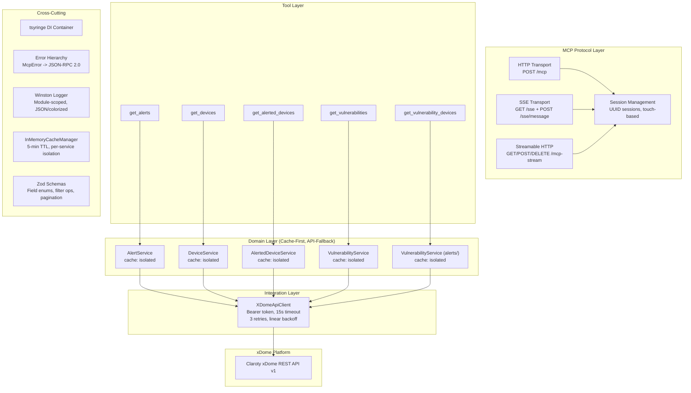
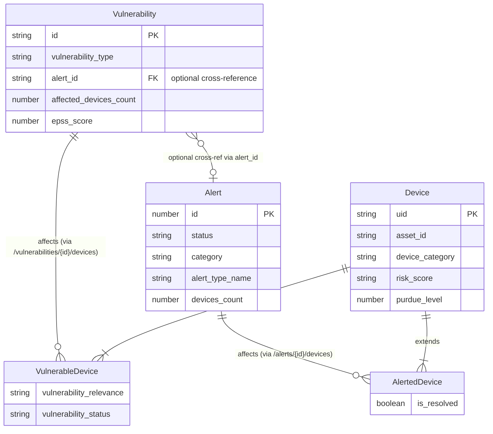

# Pass 8: Deep Synthesis -- mcp-claroty-xdome

**Project:** Claroty xDome MCP Server
**Version:** 0.1.14
**Author:** 1898andCo
**Synthesis Date:** 2026-04-13
**Analysis Files Consumed:** 16 (1 broad sweep, 12 deepening rounds, 1 extraction validation, 1 coverage audit, 1 correction log)
**Extraction Accuracy:** 94% (61/65 claims verified, 0 hallucinations)

---

## 1. Executive Summary

mcp-claroty-xdome is a TypeScript MCP (Model Context Protocol) server that exposes read-only access to the Claroty xDome OT/IoT cybersecurity platform via 5 query tools: `get_alerts`, `get_devices`, `get_alerted_devices`, `get_vulnerabilities`, and `get_vulnerability_devices`. The architecture follows a strict layered pattern -- Tool Handler -> Domain Service (with per-service cache) -> API Client -> xDome REST API -- with dependency injection via tsyringe, Zod schema validation, three MCP transport implementations (HTTP, SSE, Streamable HTTP), and a typed error hierarchy mapped to JSON-RPC 2.0 codes.

The repository is substantially larger than the production code suggests: 897 total files across two languages (TypeScript primary, Python experimental), 30 CI/CD workflows, 19 composite GitHub Actions, 535 documentation files, and 68 AI development configuration files. Only 5 of ~42 planned tools are implemented (11.9%), representing the read-only query subset of the full xDome API surface. A parallel Python implementation in `src2/` uses fastmcp/Pydantic and adds features absent from TypeScript: rate limiting, performance monitoring middleware, tag-based cache invalidation, MCP Resources, and connection pooling.

For Prism, this codebase is the canonical reference for how to build an MCP server that wraps a security sensor REST API. Its patterns are directly portable; its gaps are lessons in what to address at the design stage rather than retrofitting later.

---

## 2. Complete Feature Set

### 2.1 Implemented Features (TypeScript)

| Feature | Implementation | Files |
|---------|---------------|-------|
| Alert querying | POST /api/v1/alerts with field selection, filtering, sorting, pagination | get-alerts-handler.ts, alert-service.ts |
| Device querying | POST /api/v1/devices with field selection, filtering, sorting, pagination, group_by | get-devices-handler.ts, device-service.ts |
| Alerted device querying | POST /api/v1/alerts/{id}/devices (junction entity) | get-alerted-devices-handler.ts, alerted-device-service.ts |
| Vulnerability querying | POST /api/v1/vulnerabilities with field selection, filtering, sorting, pagination | get-vulnerabilities-handler.ts, vulnerability-service.ts (vulnerabilities/) |
| Vulnerability-device querying | POST /api/v1/vulnerabilities/{id}/devices (junction entity) | get-vulnerability-devices-handler.ts, vulnerability-service.ts (alerts/) |
| HTTP transport | Stateless request-response via POST /mcp | express-transport.ts, http-connection.ts |
| SSE transport | Persistent connection via GET /sse + POST /sse/message | sse-transport.ts, sse-connection.ts |
| Streamable HTTP transport | Hybrid HTTP->SSE via GET/POST/DELETE /mcp-stream | streamable-http-transport.ts, streamable-http-connection.ts |
| Session management | UUID-based sessions with touch-based access tracking | session-orchestrator.ts, in-memory-session-manager.ts |
| Response caching | Per-service isolated InMemoryCacheManager with 5-minute TTL | cache.ts, all domain services |
| Bearer token auth | Static API token from environment variable | xdome-api-client.ts |
| Retry with backoff | 3 retries, linear backoff (1s/2s/3s), on 429 + 5xx | xdome-api-client.ts (axios-retry) |
| Typed error mapping | HTTP status -> McpError subclass -> JSON-RPC 2.0 error code | errors.ts, xdome-api-client.ts |
| Input validation | Zod schemas with field enums, filter operations, pagination constraints | schemas/*.ts |
| Health endpoint | GET /health with version, uptime, memory, dependency status | mcp-server-instance.ts |
| Graceful shutdown | SIGINT/SIGTERM -> close transports -> close MCP -> exit(0) | main.ts, mcp-server-instance.ts |

### 2.2 Implemented Features (Python -- src2/)

All TypeScript features above PLUS:

| Feature | Implementation | Absent from TypeScript |
|---------|---------------|----------------------|
| Rate limiting | 50 req/sec per client, 60s sliding window | YES |
| Performance monitoring | Request duration tracking, 5s slow threshold, last 1000 samples | YES |
| Tag-based cache invalidation | set_with_tags(), invalidate_by_tag(), invalidate_pattern() | YES |
| Cache hit rate tracking | _hit_count, _access_count, get_stats() | YES |
| Cache memory estimation | _estimate_memory_usage() via sys.getsizeof | YES |
| MCP Resources | 5 resources: config://, status://, cache://, logs://, health:// | YES |
| Error wrapping middleware | ErrorHandlingMiddleware catches unexpected errors | YES |
| Connection pooling | aiohttp TCPConnector(limit=100, limit_per_host=30) | YES |
| Modular server composition | ServerComposer with mountable domain FastMCP instances (WIP) | YES |

### 2.3 Planned but Unimplemented (from .archive/)

42 unique tools across 12 API categories including write operations: CMMS CRUD, custom attributes, edge management, site/site-group management, user actions (assignees, labels, notes), device alert/vulnerability status management, Purdue level assignment. The planned tools represent 88.1% of the total tool surface.

---

## 3. Bounded Context Map

### 3.1 Context Description

The MCP server represents a single bounded context: **xDome Query Gateway**. It is a validated, cached passthrough for the Claroty xDome REST API. It owns no domain logic beyond caching and input validation. It does not manage alert lifecycle, device inventory, or vulnerability remediation.

### 3.2 Sub-Contexts

1. **Alert Querying** -- Alert entity queries via /api/v1/alerts
2. **Device Querying** -- Device entity queries via /api/v1/devices (includes group_by aggregation)
3. **Alert-Device Junction** -- AlertedDevice queries via /api/v1/alerts/{id}/devices
4. **Vulnerability Querying** -- Vulnerability entity queries via /api/v1/vulnerabilities
5. **Vulnerability-Device Junction** -- VulnerableDevice queries via /api/v1/vulnerabilities/{id}/devices

### 3.3 Mermaid Bounded Context Diagram



### 3.4 Entity Relationship Diagram



---

## 4. Behavioral Contract Summary

### 4.1 Contract Coverage

| Subsystem | Contracts | HIGH Confidence | MEDIUM Confidence |
|-----------|-----------|-----------------|-------------------|
| 1. Integration (XDomeApiClient) | 14 | 12 | 2 |
| 2. Domain Services | 12 | 12 | 0 |
| 3. Tool Handlers | 10 | 10 | 0 |
| 4. Schema Validation | 10 | 10 | 0 |
| 5. Session Management | 9 | 9 | 0 |
| 6. Cache Infrastructure | 9 | 9 | 0 |
| 7. Error Hierarchy | 5 | 5 | 0 |
| 8. Transport Layer | 26 | 26 | 0 |
| 9. Server Lifecycle | 20 | 20 | 0 |
| 10. Health Endpoint | 7 | 7 | 0 |
| **TOTAL** | **122** | **120** | **2** |

### 4.2 Key Behavioral Properties

**Error Propagation Model:** Only two layers catch errors in the entire system. The API client maps HTTP status codes to typed McpError subclasses. The MCP SDK serializes errors to JSON-RPC 2.0 format. All intermediate layers (domain services, tool handlers) are transparent -- errors propagate unchanged. This means error types are preserved end-to-end.

**Cache Isolation:** Each domain service gets its own independent InMemoryCacheManager instance (tsyringe `useClass` registration creates new instance per injection). Cache keys are `JSON.stringify(params)` -- exact parameter match required. Errors are not cached. TTL is 300,000ms (5 minutes) for all services.

**Transport Session Model:** Sessions exist for MCP protocol requirements (request routing, SSE stream association), not for application-level state. There is no per-session query context, history, or preferences. Sessions are created on first request and never expire.

**Data Passthrough:** Zero transformation or enrichment of xDome data. The Zod schemas constrain what AI agents can request; the API client relays the request to xDome; the response passes through unchanged and is serialized as JSON text content.

### 4.3 Remaining Gaps (Not Closable from Existing Code/Tests)

1. Retry backoff timing: no test verifies 1s/2s/3s delays
2. group_by field replacement: no direct API client unit test
3. include_count constraint when offset > 0: xDome API behavior, not validated
4. Session expiration: no mechanism exists
5. Cache size bounds: no maximum

---

## 5. Architecture Decision Record

### ADR-001: Validated Passthrough Architecture

**Decision:** The MCP server does not transform, enrich, or correlate xDome data. It validates inputs via Zod schemas and passes raw API responses to AI agents as JSON text.

**Rationale:** Maximizes flexibility for AI agents to interpret data their own way. Minimizes server-side complexity and maintenance burden.

**Consequences:** AI agents must make multiple tool calls for cross-entity queries (e.g., "top 10 riskiest devices with open alerts" requires get_devices + get_alerts + get_alerted_devices). No pre-computed aggregations are available.

### ADR-002: Per-Service Cache Isolation

**Decision:** Each domain service gets its own InMemoryCacheManager instance via tsyringe `useClass` registration (transient scope).

**Rationale:** Prevents cross-entity cache interference. Alert queries cannot displace device queries from cache.

**Consequences:** No cross-service cache coordination. Cache statistics are per-service, not global. No easy way to implement a global cache eviction policy.

### ADR-003: Three MCP Transport Implementations

**Decision:** Support HTTP (stateless), SSE (persistent), and Streamable HTTP (hybrid) simultaneously on a single Express server.

**Rationale:** MCP protocol defines multiple transport options; supporting all three maximizes client compatibility.

**Consequences:** Complex session and connection management. Transport-specific session models (HTTP: per-request, SSE: persistent, Streamable HTTP: hybrid). Body size limit configuration needed per-route rather than globally.

### ADR-004: Zod Schemas as AI-Facing Contracts

**Decision:** Exhaustive Zod enums for field names (176 device fields), filter operations (up to 46 operations), and sort fields serve as the AI agent's documentation of what data is available.

**Rationale:** AI agents can discover queryable fields and valid operations from the tool's input schema. This is self-documenting and prevents invalid queries at the validation layer.

**Consequences:** Schema duplication across tools sharing entity types (device fields duplicated in 3 schemas). Filter operation taxonomies are inconsistent across schemas (14 ops for alerts, 46 for vulnerabilities, untyped for devices).

### ADR-005: Static Bearer Token Authentication

**Decision:** Single static API token from environment variable, configured once at server startup.

**Rationale:** Simplicity. xDome API uses a single token per deployment.

**Consequences:** No token refresh, no multi-tenant auth, no per-user credentials. Token rotation requires server restart. No authentication on the MCP endpoints themselves -- any client can call the server.

### ADR-006: Dual-Language Implementation

**Decision:** Maintain both TypeScript (primary, production) and Python (experimental) implementations of the same MCP server.

**Rationale:** Validate architecture portability. Python adds features not yet in TypeScript (rate limiting, performance monitoring, MCP Resources, tag-based cache).

**Consequences:** Same domain model translates cleanly across languages. Python implementation serves as a feature backlog for TypeScript. Maintenance burden of two codebases.

### ADR-007: Dependency Injection via tsyringe

**Decision:** Use tsyringe decorator-based DI with `@injectable()`, `@singleton()`, `@inject(token)`.

**Rationale:** Enables testability via mock injection. Centralizes wiring in factory function.

**Consequences:** Requires `experimentalDecorators` and `emitDecoratorMetadata` in TypeScript config, plus `reflect-metadata` runtime import. SDK workaround needed for `setToolRequestHandlers()` internal method access.

---

## 6. Anti-Pattern Catalog

| ID | Anti-Pattern | Severity | Location | Impact |
|----|-------------|----------|----------|--------|
| AP-001 | Duplicate VulnerabilityService classes | Medium | domain/alerts/ vs domain/vulnerabilities/ | Confusing naming; requires import aliasing in factory |
| AP-002 | Unbounded in-memory caches | High | All 5 domain services | Memory leak under diverse query patterns |
| AP-003 | No session expiration | High | InMemorySessionManager | Sessions accumulate forever |
| AP-004 | CORS wildcard in production | Medium | factory.ts | origin: "*" unconditionally |
| AP-005 | Schema field duplication | Medium | 3 device-related schema files | ~180 fields duplicated; changes require 3-file edits |
| AP-006 | SDK internal access | Medium | mcp-server-instance.ts | `(mcpServer as any).setToolRequestHandlers()` |
| AP-007 | Path alias inconsistency | Low | tsconfig.json | @/* defined but used in only 1/37 files |
| AP-008 | Vestigial nodemon config | Low | nodemon.json | References old entry point (server.ts) and loader (ts-node) |
| AP-009 | Vestigial tsconfig.jest.json | Low | Root | Project uses Vitest, not Jest |
| AP-010 | Filter value untyped | Medium | All Zod schemas | `z.any()` for filter values; no type safety on query values |
| AP-011 | Express body size conflict | Medium | mcp-server-instance.ts vs transport-manager.ts | Global 100KB limit may reject before per-route 10MB limit |
| AP-012 | Filter operation inconsistency | Medium | Schema files | Alerts: 14 typed ops, Vulnerabilities: 46 typed ops, Devices: untyped (z.string()) |
| AP-013 | Schema strictness inconsistency | Low | Schema files | Alert schemas use .strict(), device schemas do not |
| AP-014 | Unused error code | Low | errors.ts | McpErrorCodes.ValidationError (-32006) defined but never used |

---

## 7. Complexity Ranking

Ranked by implementation complexity for porting/reimplementation:

| Rank | Component | Complexity | LOC (est.) | Rationale |
|------|-----------|------------|------------|-----------|
| 1 | Transport Layer (3 transports + sessions + connections) | HIGH | ~800 | Three protocol implementations, session orchestration, connection state machines |
| 2 | Zod Schema System (5 schemas with field enums + filter ops) | HIGH | ~1,200 | 176-field enums, recursive compound filters, inconsistent operation taxonomies |
| 3 | DI Container Assembly (factory.ts) | MEDIUM | ~200 | Ordered registration sequence, interface-to-implementation bindings, transport selection |
| 4 | XDomeApiClient | MEDIUM | ~235 | Retry configuration, error mapping, group_by field adjustment, bearer auth |
| 5 | Error Hierarchy | MEDIUM | ~130 | 10 error classes, JSON-RPC code mapping, constructor patterns |
| 6 | Domain Services (5 services) | LOW | ~350 | Mechanical template: cache-first, API-fallback, identical pattern |
| 7 | Tool Handlers (5 handlers) | LOW | ~250 | Mechanical template: delegate to service, wrap response |
| 8 | Cache Infrastructure | LOW | ~160 | Generic TTL cache with lazy expiration |
| 9 | Health Endpoint | LOW | ~50 | Single route with process metrics |
| 10 | Main/Bootstrap | LOW | ~55 | Signal handlers, factory call, port binding |

**Total estimated TypeScript LOC:** 4,447 (measured) + 5,748 test LOC (measured)

---

## 8. Convergence Report

### 8.1 Rounds Per Pass

| Pass | Broad Sweep | R1 | R2 | Total Rounds | Converged At |
|------|-------------|----|----|-------------|-------------|
| 0: Inventory | 1 | 1 (SUBSTANTIVE) | 1 (NITPICK) | 3 | R2 |
| 1: Architecture | 1 | 1 (SUBSTANTIVE) | 1 (NITPICK) | 3 | R2 |
| 2: Domain Model | 1 | 1 (SUBSTANTIVE) | 1 (NITPICK) | 3 | R2 |
| 3: Behavioral Contracts | 1 | 1 (SUBSTANTIVE) | 1 (NITPICK) | 3 | R2 |
| 4: NFR Catalog | 1 | 1 (SUBSTANTIVE) | 1 (NITPICK) | 3 | R2 |
| 5: Conventions | 1 | 1 (SUBSTANTIVE) | 1 (NITPICK) | 3 | R2 |

All 6 passes converged at R2 (minimum required). The broad sweep provided a solid foundation; R1 found substantive gaps in every pass; R2 confirmed convergence in every pass.

### 8.2 Novelty Trajectory

Every pass followed the same pattern: broad sweep -> SUBSTANTIVE R1 (major gaps filled) -> NITPICK R2 (corrections and completeness). No pass required more than 2 deepening rounds. This indicates the codebase is well-structured and does not hide complexity in unexpected places.

### 8.3 Key Discoveries by Round

| Round | Discovery | Impact |
|-------|-----------|--------|
| Broad Sweep | Core 5-tool architecture, 4-layer pattern, 13 BCs | Foundation |
| Pass 0 R1 | src2/ is Python (not "abandoned TypeScript"), 897 total files, CI/CD pipeline | Changed scope understanding from 37 files to 897 |
| Pass 0 R2 | File count corrections (35 tests, 42 unique tools, 897 files) | Quantitative accuracy |
| Pass 1 R1 | DI composition ordering, middleware chain, SDK workaround, planned 42-tool expansion | Changed architecture understanding |
| Pass 1 R2 | Body size limit conflict bug, DI "7-phase" was organizational overlay | Bug finding + correction |
| Pass 2 R1 | Filter operation taxonomy divergence, schema strictness matrix, cache scoping | Changed domain model understanding |
| Pass 2 R2 | VulnerabilityService semantic split, group_by mode, pagination semantics | Completeness |
| Pass 3 R1 | 83 behavioral contracts across 9 subsystems | Foundation for contract catalog |
| Pass 3 R2 | 39 additional contracts (transport + lifecycle + health) for 122 total | Completeness |
| Pass 4 R1 | CI/CD quality NFRs, supply chain security, development experience NFRs | Changed NFR understanding |
| Pass 4 R2 | Performance testing not activated, Windsurf intent vs implementation gaps | Refinement |
| Pass 5 R1 | Template-based development patterns, AI development methodology, 4 new anti-patterns | Changed convention understanding |
| Pass 5 R2 | Prettier defaults, no Husky hooks, Windsurf aspirational vs actual metrics | Refinement |
| Coverage Audit | 7 Python BCs, 5 Python entity catalogs, 13 blind spots identified | Critical Python findings |
| Extraction Validation | 94% accuracy, 4 metric errors corrected, 0 hallucinations | Quality assurance |

### 8.4 Total Coverage Metrics

| Category | Total | Covered | Coverage |
|----------|-------|---------|----------|
| TypeScript src/ files | 37 | 37 | 100% |
| TypeScript test files | 35 | 35 | 100% |
| Python src2/ files | 41 | 15 (partial) | 37% |
| Behavioral contracts extracted | -- | 122 (TS) + 7 (Py) | 129 total |
| Entity catalogs | -- | 5 (TS) + 5 (Py) | 10 total |
| NFRs documented | -- | 28 | Comprehensive |
| Anti-patterns identified | -- | 14 | Comprehensive |

---

## 9. Lessons for Prism

### P0: Must-Have (Critical Path for Prism)

#### P0-1: Adopt the ToolHandler -> Service -> ApiClient Layered Pattern

The three-layer pattern is proven, testable, and language-portable. Every sensor integration in Prism should follow:

```
MCP Tool Handler (input validation + response formatting)
  -> Domain Service (caching + business logic)
    -> API Client (auth, retry, error mapping, HTTP)
```

This pattern was implemented identically 5 times in TypeScript and translated cleanly to Python, confirming it is language-agnostic. In Rust, this maps to: `ToolHandler trait impl -> Service struct -> ApiClient struct`.

**Key architectural property to preserve:** Only the API client layer catches and maps errors. All other layers are transparent. This preserves typed error information end-to-end and keeps the error handling logic centralized.

#### P0-2: Schema-Driven Tool Contracts with Exhaustive Field Enums

The Zod schemas serve a dual purpose: input validation AND AI agent documentation. AI agents discover what data is available by inspecting the tool's input schema. For Prism:

- Define exhaustive field enums for every sensor entity (all queryable fields, not just commonly used ones)
- Use typed filter operations (not z.any() / untyped strings)
- Include default values for sort and pagination (alerts: id ASC, vulnerabilities: published_date DESC)
- Support recursive compound filters (and/or with arbitrary nesting)

**Lesson from the inconsistency:** mcp-claroty-xdome has inconsistent filter operation typing across schemas (14 ops, 46 ops, or untyped). Prism should define a single, shared FilterOperation enum used by all sensor tools.

#### P0-3: Per-Service Cache Isolation with Bounded Size

The per-service cache isolation pattern (each service gets its own cache instance) is correct and should be adopted. However, Prism must address the two critical gaps:

1. **Cache size bounds:** Implement LRU eviction or maximum entry count per cache. The xDome server has unbounded caches that can grow indefinitely.
2. **Cache statistics:** Adopt the Python implementation's hit rate tracking and memory estimation from the start, not as an afterthought.

**Cache key strategy:** `JSON.stringify(params)` is simple and effective for read-only queries. When Prism adds write operations, cache invalidation must be addressed (the Python tag-based invalidation pattern is a good reference).

#### P0-4: Typed Error Hierarchy Mapped to JSON-RPC 2.0 Codes

The error hierarchy is clean and should be adopted. The mapping pattern:

| HTTP Status | Error Type | JSON-RPC Code | Meaning |
|------------|------------|---------------|---------|
| 401/403 | AuthenticationError | -32001 | Upstream auth failure |
| 404 | NotFoundError | -32003 | Resource not found |
| 422 | ValidationError | -32602 | Input validation failure |
| 429 | TooManyRequestsError | -32005 | Rate limited |
| 5xx | IntegrationError | -32007 | Upstream server error |
| Config missing | McpError | -32009 | Invalid configuration |

**Lesson:** Define the error hierarchy once, use it across all sensor integrations. Do not let each sensor define its own error types.

### P1: Should-Have (High Value for Prism)

#### P1-1: Session Expiration and Connection Limits

mcp-claroty-xdome's biggest operational gap is the absence of session expiration. Sessions live forever in an in-memory Map, creating unbounded memory growth. Prism must implement:

- Session TTL with configurable timeout (e.g., 30 minutes of inactivity)
- Maximum session count limit
- Maximum connection count per transport
- Periodic cleanup of expired sessions (not just lazy eviction)

#### P1-2: Rate Limiting on MCP Endpoints

The TypeScript implementation has NO rate limiting on its own endpoints (only retry logic for upstream rate limits). The Python implementation adds per-client rate limiting (50 req/sec, 60s sliding window). Prism should implement rate limiting from the start:

- Per-client rate limits
- Global rate limits
- Configurable thresholds per transport type
- Rate limit response with Retry-After header

#### P1-3: MCP Resources for Server Introspection

The Python implementation exposes 5 MCP Resources (config://, status://, cache://, logs://, health://). These provide runtime introspection for operations and debugging. Prism should expose:

- `config://server` -- server configuration and enabled sensors
- `status://server` -- health status, uptime, cache stats, memory
- `health://check` -- comprehensive health check with sensor connectivity tests
- `cache://stats/{sensor}` -- per-sensor cache statistics

#### P1-4: Middleware Stack Pattern (from Python)

The Python implementation's middleware stack (ErrorHandling -> RateLimiting -> Timing -> Logging) provides a clean composition model for cross-cutting concerns. In Rust, this maps to tower middleware layers. Prism should implement:

- Error wrapping middleware (catch panics, wrap unexpected errors)
- Rate limiting middleware
- Request timing middleware (with slow request alerting)
- Structured logging middleware

#### P1-5: Connection Pooling for Upstream APIs

The Python implementation uses aiohttp's TCPConnector with connection limits (100 total, 30 per host). The TypeScript implementation creates a new connection per request (axios default). Prism should implement connection pooling for upstream sensor APIs from the start, using reqwest's connection pool configuration.

### P2: Nice-to-Have (Design-Time Consideration)

#### P2-1: Compound/Aggregation Tools to Reduce Round-Trips

mcp-claroty-xdome exposes raw query tools that map 1:1 to API endpoints. Common AI agent workflows require multiple tool calls:
- "What are the highest-risk devices with open alerts?" -> get_devices + get_alerts + get_alerted_devices
- "Show me unpatched vulnerabilities on OT devices" -> get_vulnerabilities + get_vulnerability_devices + get_devices

Prism should consider compound tools that pre-compose common multi-step queries, reducing AI agent round-trips and improving response quality.

#### P2-2: Auto-Pagination

Tools expose offset/limit but do not automatically paginate large result sets. AI agents must manually manage pagination loops. Consider tools that optionally return complete result sets (up to a configurable maximum), handling pagination internally.

#### P2-3: Data Enrichment vs. Passthrough

mcp-claroty-xdome deliberately passes raw xDome data through without transformation. This maximizes flexibility but pushes all interpretation onto the AI agent. Prism should evaluate whether some level of cross-sensor correlation or enrichment (e.g., combining alert + device + vulnerability data into unified risk profiles) would improve the AI agent experience.

#### P2-4: Shared Schema Modules

mcp-claroty-xdome duplicates ~180 device fields across 3 schema files. Prism should extract shared entity field definitions into common modules that sensor-specific schemas compose.

### P3: Lessons Learned (What Not to Do)

#### P3-1: Do Not Use z.any() for Filter Values

All xDome schemas use `z.any()` for filter values, providing no type safety on query values. This is a security and correctness risk. Prism should type filter values based on the field being filtered (string, number, boolean, date).

#### P3-2: Do Not Rely on SDK Internals

The `(mcpServer as any).setToolRequestHandlers()` workaround accesses private SDK methods. This creates a fragile dependency on SDK implementation details. Prism should use only public API surfaces, or submit upstream PRs for needed functionality.

#### P3-3: Do Not Skip Session Expiration

The absence of session expiration in the TypeScript implementation is a significant operational risk. Implementing it later is harder because existing clients may not handle session invalidation gracefully. Design session lifecycle management into the initial architecture.

#### P3-4: Do Not Duplicate Cross-Entity Field Definitions

Schema duplication across tools that share entity types creates a maintenance burden and inconsistency risk. The xDome server has inconsistent filter operation typing partly due to this duplication. Use shared definitions from the start.

#### P3-5: Do Not Use Global Express Middleware with Different Limits than Route-Level Middleware

The body size limit conflict (global 100KB vs per-route 10MB) is a subtle bug caused by middleware ordering. In Prism's Rust implementation, ensure request size limits are applied at the correct layer, with no conflicting limits.

#### P3-6: Python vs TypeScript Comparison -- What to Port to Rust

| Feature | TypeScript (src/) | Python (src2/) | Prism (Rust) Recommendation |
|---------|-------------------|----------------|----------------------------|
| MCP SDK | Low-level SDK + workaround | High-level fastmcp | Use Rust MCP SDK; avoid internal access |
| DI | tsyringe decorators | Manual composition | Rust trait objects + manual composition |
| Retry | Linear (1s, 2s, 3s) on all 5xx | Exponential (1s..10s, factor 2.0) on selective 5xx | **Adopt Python's approach:** exponential backoff, selective status codes |
| Cache | Per-service, no bounds, no stats | Shared, tag-based, hit tracking, memory est. | **Hybrid:** per-service isolation (TS) + bounds + stats (Py) |
| Rate limiting | None | 50 req/sec per client | **Adopt Python's approach** |
| Middleware | Express only | Custom MiddlewareStack | **Adopt Python's approach** via tower middleware |
| Error handling | Transparent propagation | Middleware wrapping | **Adopt hybrid:** transparent for typed errors + middleware for unexpected panics |
| Transport timeout | 15s | 30s | Configurable per-sensor (default 30s) |
| Connection pooling | None (axios default) | TCPConnector(100, 30/host) | **Adopt Python's approach** via reqwest pool |
| Default port | 3000 | 8000 | Configurable |
| Default host | 0.0.0.0 | 127.0.0.1 | **Adopt Python's approach:** localhost by default (security) |

---

## 10. Confidence Assessment

| Area | Confidence | Basis |
|------|------------|-------|
| Architecture | HIGH | Clear layered design, verified against source code, cross-validated across passes |
| Domain Model | HIGH | TypeScript interfaces + Zod schemas are authoritative; all entities and relationships verified |
| Behavioral Contracts | HIGH | 122 contracts, 120 HIGH confidence (from tests), 2 MEDIUM (from code only); 94% extraction accuracy |
| NFRs | HIGH | Configuration values verified; CI/CD pipeline documented; missing NFRs cataloged |
| Conventions | HIGH | 100% consistency on naming and structure; anti-patterns cataloged with file locations |
| Python Implementation | MEDIUM | Partially analyzed (37% coverage); 7 behavioral contracts, 5 entity catalogs from coverage audit |
| Planned Expansion | MEDIUM | .archive/ tool definitions analyzed; 42 unique tools identified; no implementation detail |

---

## 11. Gaps and Risks

### Unresolvable from Source Code

1. **xDome API behavior:** Some constraints (include_count only at offset=0, group_by response format) are documented in Zod descriptions but not validated or tested
2. **Production performance:** No load testing infrastructure is activated; actual behavior under concurrent queries is unknown
3. **Session scalability:** No data on how many concurrent sessions the in-memory approach supports before degradation

### Key Risks for Prism

1. **MCP SDK maturity:** The TypeScript server needed an SDK workaround; Rust MCP SDK maturity should be assessed before committing to it
2. **Schema evolution:** Adding new sensor tools at the rate implied by the 42-tool roadmap requires automated schema generation, not manual Zod/Pydantic authoring
3. **Multi-sensor correlation:** The passthrough architecture works for single-sensor queries but may not scale to cross-sensor intelligence without a correlation layer

---

## State Checkpoint

```yaml
pass: 8
status: complete
files_consumed: 16
behavioral_contracts: 129 (122 TS + 7 Py)
entity_catalogs: 10 (5 TS + 5 Py)
anti_patterns: 14
architecture_decisions: 7
nfrs_documented: 28
extraction_accuracy: 94%
timestamp: 2026-04-13T23:59:00Z
```
