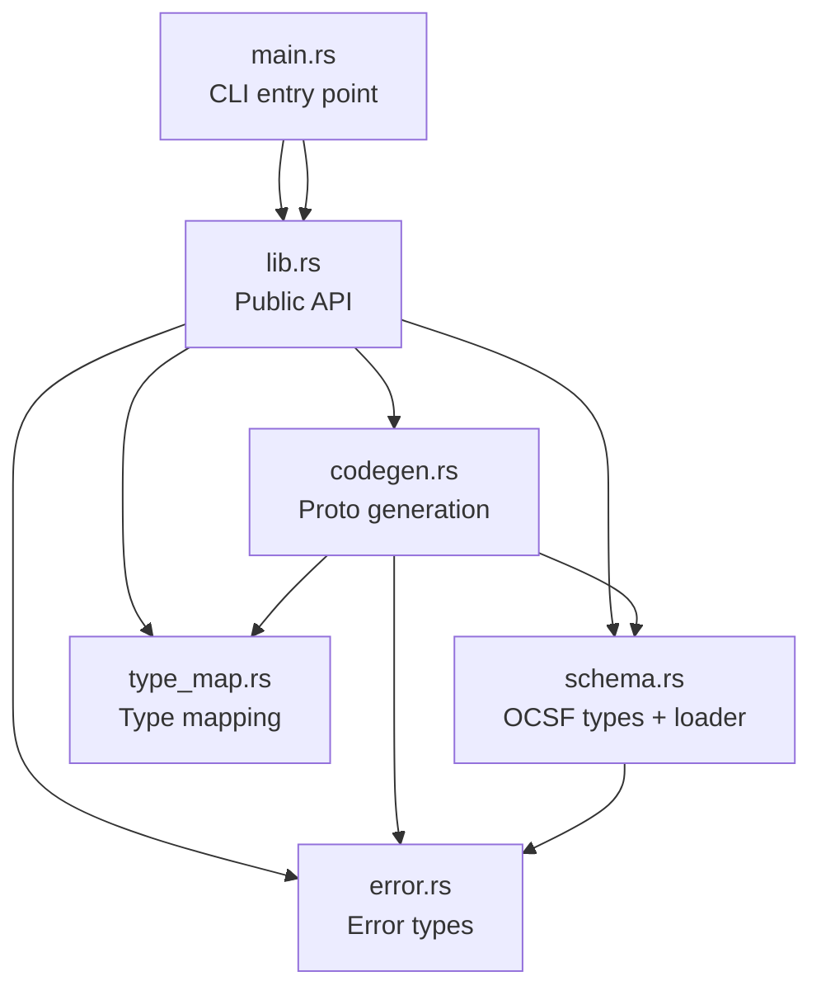
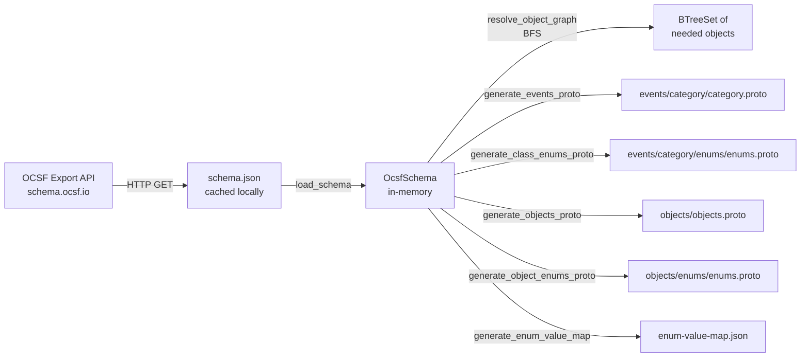

# ocsf-proto-gen: Full Brownfield Codebase Ingestion

## Executive Summary

`ocsf-proto-gen` is a compact Rust CLI and library (approximately 1,250 lines across 6 source files) that generates deterministic Protocol Buffer (proto3) definitions from the OCSF (Open Cybersecurity Schema Framework) JSON schema export. It was purpose-built to replace the community `ocsf-tool` (Go) which has several correctness and compatibility issues. The codebase is clean, well-documented, thoroughly tested, and follows a straightforward pipeline architecture: download schema -> parse JSON -> resolve object graph -> generate .proto files.

This ingestion is directly relevant to Prism's OCSF+protobuf normalization layer because it contains the canonical mapping between OCSF types and protobuf types, and demonstrates a working approach to OCSF schema consumption.

---

## Pass 0: Inventory

### Tech Stack

| Attribute | Value |
|-----------|-------|
| Language | Rust (edition 2024, MSRV 1.85) |
| Build system | Cargo |
| Test framework | Built-in `#[test]` + integration tests |
| CLI framework | clap 4 (derive) |
| Serialization | serde 1 + serde_json 1 |
| Error handling | thiserror 2 |
| HTTP client | reqwest 0.12 (optional, `download` feature) |
| Async runtime | tokio 1 (optional, `download` feature) |
| License | MIT |
| Version | 0.1.2 |

### File Manifest

| Path | Type | Lines (approx) | Purpose |
|------|------|-----------------|---------|
| `src/main.rs` | Binary entry | 164 | CLI: clap parser, `download-schema` and `generate` subcommands |
| `src/lib.rs` | Library root | 35 | Public API re-exports: `codegen`, `error`, `schema`, `type_map` |
| `src/schema.rs` | Core module | 388 | OCSF JSON serde types + schema loader + downloader |
| `src/codegen.rs` | Core module | 639 | Proto generation orchestrator: object graph BFS, file builders |
| `src/type_map.rs` | Core module | 230 | OCSF type -> proto type mapping + name conversion utilities |
| `src/error.rs` | Support | 45 | Error enum via thiserror |
| `tests/integration.rs` | Tests | 602 | 9 end-to-end tests with embedded test schema |
| `Cargo.toml` | Config | 37 | Dependencies, features, metadata |
| `.github/workflows/ci.yml` | CI | 65 | Check, fmt, clippy, test, doc jobs |
| `CLAUDE.md` | Docs | 86 | Architecture reference for AI assistance |
| `README.md` | Docs | 157 | Usage, type mapping table, CLI reference |
| `CHANGELOG.md` | Docs | 29 | Release history (v0.1.0, v0.1.1) |

### Dependency Graph



### Entry Points

- **Binary**: `src/main.rs` -- CLI via `clap::Parser`, dispatches to `download-schema` or `generate`
- **Library**: `src/lib.rs` -- re-exports `schema::load_schema()` and `codegen::generate()` as the programmatic API

---

## Pass 1: Architecture

### Component Catalog

| Component | Responsibility | Key Types |
|-----------|---------------|-----------|
| **CLI** (`main.rs`) | Argument parsing, orchestration, error display | `Cli`, `Commands` |
| **Schema** (`schema.rs`) | OCSF JSON deserialization, file I/O, HTTP download | `OcsfSchema`, `OcsfClass`, `OcsfObject`, `OcsfAttribute`, `OcsfEnumValue`, `OcsfDeprecated` |
| **Codegen** (`codegen.rs`) | Object graph resolution, proto file generation, enum generation | `GenerationStats`, `generate()` |
| **Type Map** (`type_map.rs`) | OCSF-to-proto type mapping, name conversion | `ocsf_to_proto_type()`, `to_pascal_case()`, `to_screaming_snake()`, `sanitize_object_name()`, `to_enum_variant_name()` |
| **Error** (`error.rs`) | Structured error types | `Error` enum (7 variants), `Result<T>` alias |

### Layer Structure

```
CLI Layer (main.rs)
    |
    v
Library API (lib.rs)
    |
    +-- Schema Layer (schema.rs) -- data access, I/O
    |
    +-- Codegen Layer (codegen.rs) -- business logic, orchestration
    |       |
    |       +-- Type Map (type_map.rs) -- pure functions, no I/O
    |
    +-- Error Layer (error.rs) -- shared error types
```

**Dependency direction**: CLI -> Library -> Schema/Codegen -> Type Map/Error. Clean layering with no cycles.

### Deployment Topology

Single binary CLI tool. Optional `download` feature adds network capability. Can also be used as a library crate without the CLI or network deps.

### Data Flow



### Key Architectural Decisions

1. **Uses the OCSF `/export/schema` API** which returns fully-resolved classes (inheritance already applied). This eliminates the need to implement OCSF's `extends`, `$include`, and profile merging logic -- a massive simplification.

2. **All collections use `BTreeMap`/`BTreeSet`** for deterministic iteration order, ensuring byte-identical output across runs.

3. **Two-subcommand design**: `download-schema` (optional, network) and `generate` (always available, offline). Schema is cached as a JSON file between the two steps.

4. **Feature-gated network deps**: The `download` feature (default on) adds `reqwest` + `tokio`. Library users who only need `generate` can disable it with `default-features = false`.

---

## Pass 2: Domain Model

### Entity Catalog

#### OcsfSchema (Root Aggregate)
The top-level container representing a complete OCSF schema export for a specific version.

| Property | Type | Semantics |
|----------|------|-----------|
| `version` | `String` | OCSF version (e.g., "1.7.0") |
| `classes` | `BTreeMap<String, OcsfClass>` | Event classes keyed by snake_case name |
| `objects` | `BTreeMap<String, OcsfObject>` | Object types keyed by name |
| `types` | `BTreeMap<String, Value>` | Primitive type definitions (unused in codegen) |
| `base_event` | `Value` | Base event definition (unused in codegen) |

#### OcsfClass (Entity)
An OCSF event class (e.g., Authentication, Security Finding). Fully resolved -- inheritance already applied.

| Property | Type | Semantics |
|----------|------|-----------|
| `name` | `String` | Snake_case identifier (e.g., "authentication") |
| `uid` | `u32` | Unique class ID (e.g., 3002) |
| `caption` | `String` | Human-readable name |
| `category` | `String` | Category name (e.g., "iam") -- used for file organization |
| `category_uid` | `u32` | Category numeric ID |
| `extends` | `String` | Parent class name (informational only, already resolved) |
| `profiles` | `Vec<String>` | Active profiles |
| `attributes` | `BTreeMap<String, OcsfAttribute>` | All attributes, sorted by name |

#### OcsfObject (Entity)
An OCSF object type (e.g., User, Network Endpoint). Referenced by event class attributes.

| Property | Type | Semantics |
|----------|------|-----------|
| `name` | `String` | Snake_case identifier |
| `caption` | `String` | Human-readable name |
| `extends` | `Option<String>` | Parent object name |
| `attributes` | `BTreeMap<String, OcsfAttribute>` | All attributes |
| `observable` | `Option<u32>` | Observable type number |

#### OcsfAttribute (Value Object)
A single field in a class or object. The most complex domain type.

| Property | Type | Semantics |
|----------|------|-----------|
| `type_name` | `String` | OCSF type (e.g., "string_t", "object_t", "integer_t") |
| `caption` | `String` | Human-readable name |
| `requirement` | `Option<String>` | "required", "recommended", or "optional" |
| `is_array` | `bool` | Whether the field is repeated |
| `object_type` | `Option<String>` | For object_t: referenced object name (may have extension prefix) |
| `enum_values` | `Option<BTreeMap<String, OcsfEnumValue>>` | Enum variants if present |
| `deprecated` | `Option<OcsfDeprecated>` | Deprecation info; if Some, field is skipped |
| `sibling` | `Option<String>` | Related attribute name (e.g., activity_id <-> activity_name) |
| `profile` | `Option<String>` | Profile that contributed this attribute |
| `group` | `Option<String>` | "primary", "context", "classification", "occurrence" |

#### OcsfEnumValue (Value Object)
A single variant in an enum definition.

| Property | Type | Semantics |
|----------|------|-----------|
| `caption` | `String` | Human-readable variant name |
| `description` | `Option<String>` | Variant description |

#### OcsfDeprecated (Value Object)
Deprecation metadata.

| Property | Type | Semantics |
|----------|------|-----------|
| `message` | `String` | Deprecation reason |
| `since` | `String` | Version deprecated in |

#### GenerationStats (Value Object)
Counters collected during generation for reporting.

| Property | Type |
|----------|------|
| `classes_generated` | `usize` |
| `objects_generated` | `usize` |
| `enums_generated` | `usize` |
| `deprecated_fields_skipped` | `usize` |
| `string_enum_fields_skipped` | `usize` |
| `unknown_types_defaulted` | `usize` |

### Ubiquitous Language Glossary

| Term | Meaning |
|------|---------|
| **Event class** | A top-level OCSF event type (e.g., Authentication, Security Finding). Contains attributes. |
| **Object** | A reusable OCSF composite type (e.g., User, Network Endpoint). Referenced by event class attributes via `object_t`. |
| **Attribute** | A field on a class or object. Has a type, optional enum, optional object reference. |
| **Category** | Grouping of event classes (e.g., "iam", "findings", "network"). Determines proto file directory. |
| **Extension prefix** | OCSF extension objects use `prefix/name` format (e.g., "win/win_service"). Stripped for proto names. |
| **Integer-keyed enum** | OCSF enum with numeric keys ("0", "1", "99"). Becomes a proto `enum`. |
| **String-keyed enum** | OCSF enum with string keys ("GET", "POST"). NOT a valid proto enum; field stays `string`. |
| **Transitive closure** | The full set of objects reachable from a set of event classes, following `object_type` references recursively. |
| **Version slug** | OCSF version formatted for proto packages: "1.7.0" -> "v1_7_0". |
| **Deprecated attribute** | An attribute with `@deprecated` metadata. Skipped entirely from proto output. |
| **Fully resolved** | OCSF export API returns classes with inheritance already applied -- no need to implement extends/include/profile merging. |

### Bounded Context Map

This codebase has a single bounded context (OCSF-to-Proto translation). It sits between two external domains:

```
+---------------------------+       +---------------------------+       +---------------------------+
|     OCSF Schema Domain    | ----> | ocsf-proto-gen            | ----> |   Protobuf Domain         |
| (schema.ocsf.io)          |       | (translation layer)       |       | (.proto files)            |
|                           |       |                           |       |                           |
| - Event classes           |       | - Schema parsing          |       | - proto3 messages         |
| - Objects                 |       | - Type mapping            |       | - proto enums             |
| - Attributes with types   |       | - Object graph resolution |       | - Qualified type refs     |
| - Enum definitions        |       | - Proto file generation   |       | - Package hierarchy       |
| - Extension prefixes      |       | - Enum filtering          |       |                           |
+---------------------------+       +---------------------------+       +---------------------------+
```

---

## Pass 3: Behavioral Contracts

### BC-001: Schema loading parses valid OCSF JSON into OcsfSchema

**Preconditions:** File exists at path, contains valid OCSF export JSON with `version`, `classes`, `objects` keys
**Postconditions:** Returns `Ok(OcsfSchema)` with all classes, objects, attributes deserialized; BTreeMap ordering preserved
**Error Cases:** File not found -> `Error::Read`; Invalid JSON -> `Error::Json`
**Evidence:** `parse_minimal_schema` (schema.rs:331), `schema_load_from_file` (integration.rs:533)
**Confidence:** HIGH (from tests)

### BC-002: Schema download validates before writing to disk

**Preconditions:** Valid URL, network available, OCSF API returns 200
**Postconditions:** JSON validated as parseable `OcsfSchema` before writing; parent directories created; file written to `<output_dir>/<version>/schema.json`
**Error Cases:** HTTP error -> `Error::Download`; Invalid JSON response -> `Error::Schema`; Write failure -> `Error::Write`
**Evidence:** `download_schema` function (schema.rs:198-242)
**Confidence:** MEDIUM (from code, no download tests -- network-dependent)

### BC-003: Unknown class names produce a helpful error

**Preconditions:** `generate()` called with class name not in `schema.classes`
**Postconditions:** Returns `Err(Error::ClassNotFound)` with the bad name and up to 10 available class names
**Error Cases:** This IS the error case
**Evidence:** `invalid_class_name_returns_error` (integration.rs:519-530)
**Confidence:** HIGH (from test)

### BC-004: Object graph resolution finds transitive closure via BFS

**Preconditions:** Valid schema, valid class names
**Postconditions:** Returns `BTreeSet<String>` containing all objects reachable from the given classes, following `object_type` references recursively. Extension prefixes stripped via `sanitize_object_name`.
**Error Cases:** Missing objects produce warnings to stderr but do not fail
**Evidence:** `end_to_end_generate_and_validate` asserts `objects_generated == 3` for auth class referencing network_endpoint, enrichment, and object (integration.rs:373)
**Confidence:** HIGH (from test)

### BC-005: Deprecated attributes are skipped from proto output

**Preconditions:** Attribute has `@deprecated` field in OCSF JSON (deserialized as `deprecated: Some(...)`)
**Postconditions:** Field does not appear in generated .proto file; `stats.deprecated_fields_skipped` incremented
**Error Cases:** None
**Evidence:** `generated_proto_has_correct_content` asserts `!proto.contains("old_field")` (integration.rs:416); `end_to_end_generate_and_validate` asserts `stats.deprecated_fields_skipped >= 1` (integration.rs:374)
**Confidence:** HIGH (from tests)

### BC-006: String-keyed enums do NOT become proto enums

**Preconditions:** Attribute has `enum_values` where keys are NOT all parseable as `i32` (e.g., "GET", "POST", "NTLM", "Kerberos")
**Postconditions:** Field emitted as `string` type, no enum definition generated; `stats.string_enum_fields_skipped` incremented
**Error Cases:** None
**Evidence:** `generated_proto_has_correct_content` asserts `proto.contains("string auth_protocol")` and `!proto.contains("AUTHENTICATION_AUTH_PROTOCOL")` (integration.rs:419-420); `generated_enums_have_correct_values` asserts `!enums.contains("AUTH_PROTOCOL")` (integration.rs:449)
**Confidence:** HIGH (from tests)

### BC-007: Integer-keyed enums produce qualified proto enum type references

**Preconditions:** Attribute has `enum_values` where ALL keys parse as `i32`
**Postconditions:** Field type is a fully-qualified enum reference (e.g., `ocsf.v1_7_0.events.iam.enums.AUTHENTICATION_ACTIVITY_ID`). Enum definition generated with SCREAMING_SNAKE variant names. Proto3 zero-value rule enforced (synthetic `_UNSPECIFIED = 0` added if OCSF doesn't define a 0 value).
**Error Cases:** None
**Evidence:** `generated_proto_has_correct_content` (integration.rs:403-404), `generated_enums_have_correct_values` (integration.rs:439-456)
**Confidence:** HIGH (from tests)

### BC-008: object_t attributes produce qualified message references

**Preconditions:** Attribute has `type_name == "object_t"` and `object_type` set
**Postconditions:** Field type is `ocsf.<version_slug>.objects.<PascalCaseName>`. If `is_array`, field is `repeated`.
**Error Cases:** Object not found in schema -> warning to stderr, defaults to `string`; Object has zero non-deprecated attributes -> emits `string` instead of empty message ref
**Evidence:** `generated_proto_has_correct_content` asserts `proto.contains("ocsf.v1_7_0.objects.NetworkEndpoint src_endpoint")` and `proto.contains("repeated ocsf.v1_7_0.objects.Enrichment enrichments")` (integration.rs:407-408)
**Confidence:** HIGH (from tests)

### BC-009: Empty object types (zero attributes) emit string instead of message reference

**Preconditions:** `object_t` attribute references an object with no non-deprecated attributes (e.g., the base OCSF `object` type used by `unmapped` field)
**Postconditions:** Field emitted as `string`, not a qualified message reference. No empty proto message generated.
**Error Cases:** None
**Evidence:** `empty_object_type_emits_string` (integration.rs:551-570), `generated_proto_has_correct_content` asserts `proto.contains("string unmapped")` and `!proto.contains("Object unmapped")` (integration.rs:411-413)
**Confidence:** HIGH (from dedicated test)

### BC-010: Output is deterministic (byte-identical across runs)

**Preconditions:** Same schema, same class names
**Postconditions:** All generated files are byte-identical across independent runs
**Mechanism:** `BTreeMap`/`BTreeSet` for sorted iteration, alphabetical field numbering, sorted enum entries
**Evidence:** `deterministic_output` (integration.rs:500-516) generates twice and compares all files byte-for-byte
**Confidence:** HIGH (from test)

### BC-011: Extension-prefixed object names are sanitized

**Preconditions:** Object reference contains `/` (e.g., "win/win_service")
**Postconditions:** Prefix stripped: "win/win_service" -> "win_service". PascalCase: "WinService". Lookup tries original name, then sanitized name, then scan by sanitized name.
**Evidence:** `pascal_case_strips_extension_prefix` (type_map.rs:202-204), `sanitize_object_name_strips_prefix` (type_map.rs:227-229)
**Confidence:** HIGH (from tests)

### BC-012: Field numbering is sequential and alphabetical

**Preconditions:** Message has N non-deprecated attributes
**Postconditions:** Fields numbered 1 through N in alphabetical order by attribute name (BTreeMap iteration order)
**Evidence:** Code inspection of `generate_events_proto` and `generate_objects_proto` (codegen.rs:226-249, 328-356) -- `field_num` starts at 1, increments for each non-deprecated attribute in BTreeMap order
**Confidence:** MEDIUM (from code, no explicit field-number test)

---

## Pass 4: OCSF Type Mapping (The Core Domain Knowledge)

This is the most critical section for Prism. The complete OCSF-to-protobuf type mapping:

### Primitive Type Mapping

| OCSF Type | Proto Type | OCSF Base Type | Notes |
|-----------|-----------|----------------|-------|
| `boolean_t` | `bool` | primitive | |
| `integer_t` | `int32` | primitive | Signed 32-bit |
| `long_t` | `int64` | primitive | Signed 64-bit |
| `float_t` | `double` | primitive | 64-bit float (NOT proto `float`) |
| `string_t` | `string` | primitive | UTF-8 |
| `json_t` | `string` | primitive | Deliberate choice: NOT `google.protobuf.Struct` because prost_types::Struct lacks serde traits |

### Derived Type Mapping

| OCSF Type | Proto Type | Derived From | Semantics |
|-----------|-----------|-------------|-----------|
| `timestamp_t` | `int64` | `long_t` | Epoch milliseconds |
| `port_t` | `int32` | `integer_t` | Range 0-65535 |
| `datetime_t` | `string` | `string_t` | RFC 3339 format |
| `hostname_t` | `string` | `string_t` | |
| `ip_t` | `string` | `string_t` | |
| `mac_t` | `string` | `string_t` | |
| `url_t` | `string` | `string_t` | |
| `email_t` | `string` | `string_t` | |
| `uuid_t` | `string` | `string_t` | |
| `file_name_t` | `string` | `string_t` | |
| `file_path_t` | `string` | `string_t` | |
| `file_hash_t` | `string` | `string_t` | |
| `subnet_t` | `string` | `string_t` | |
| `username_t` | `string` | `string_t` | |
| `process_name_t` | `string` | `string_t` | |
| `resource_uid_t` | `string` | `string_t` | |
| `bytestring_t` | `string` | `string_t` | |
| `reg_key_path_t` | `string` | `string_t` | |

### Special Type Handling

| OCSF Type | Proto Type | Rule |
|-----------|-----------|------|
| `object_t` | Qualified message ref | Resolved via `object_type` attribute, e.g., `ocsf.v1_7_0.objects.NetworkEndpoint` |
| `object_t` (empty object) | `string` | When referenced object has zero non-deprecated attributes |
| Integer-keyed enum | Qualified enum ref | e.g., `ocsf.v1_7_0.events.iam.enums.AUTHENTICATION_ACTIVITY_ID` |
| String-keyed enum | `string` | NOT a proto enum; detected via `key.parse::<i32>().is_ok()` |
| Unknown type | `string` | Fallback; `stats.unknown_types_defaulted` incremented |

### Critical Distinctions for Prism

1. **`timestamp_t` is `int64` (epoch ms), NOT `string`**. This is different from `datetime_t` which IS `string` (RFC 3339). The two must not be confused.
2. **`json_t` is `string`, NOT `google.protobuf.Struct`**. The Struct type breaks prost serde compatibility. Prism should follow this same pattern.
3. **`float_t` maps to proto `double` (64-bit)**, not proto `float` (32-bit). OCSF specifies 64-bit floats.
4. **Enum fields use qualified type references**, not primitive `int32`. This preserves type safety.

---

## Pass 5: Code Generation Pipeline

### Pipeline Steps (in order)

```
1. Validate requested class names exist in schema
       |
2. Resolve transitive object graph (BFS from class attributes)
       |
3. Group classes by category
       |
4. For each category:
   |-- Generate events proto (messages with fields)
   |-- Generate class enums proto (per-class enum definitions)
       |
5. Generate shared objects proto (all needed objects in one file)
       |
6. Generate object enums proto (enums from object attributes)
       |
7. Generate enum-value-map.json (reference file)
       |
8. Write all files to disk
```

### Object Graph Resolution Algorithm

```
function resolve_object_graph(schema, class_names):
    needed = BTreeSet::new()    // sanitized object names
    queue = Vec::new()          // raw object references (may have extension prefixes)

    // Seed: scan all attributes of requested classes
    for class in class_names:
        for attr in class.attributes:
            if attr.object_type exists:
                key = sanitize_object_name(attr.object_type)
                if key is new:
                    needed.insert(key)
                    queue.push(attr.object_type)

    // BFS: follow object -> object references
    while queue not empty:
        obj_ref = queue.pop()
        obj = lookup_object(schema, obj_ref)    // tries original, sanitized, then scan
        if obj found:
            for attr in obj.attributes:
                if attr.object_type exists:
                    key = sanitize_object_name(attr.object_type)
                    if key is new:
                        needed.insert(key)
                        queue.push(attr.object_type)

    return needed
```

### Field Type Resolution Logic

For each non-deprecated attribute in a class or object:

```
1. Is type_name == "object_t"?
   -> Resolve object reference:
      a. Look up object in schema (3-tier: original name, sanitized, scan)
      b. If not found: warn, emit "string"
      c. If found but has zero non-deprecated attributes: emit "string"
      d. Otherwise: emit qualified message type "ocsf.<version>.objects.<PascalCase>"
   -> If is_array: prepend "repeated"

2. Does attribute have enum_values with ALL integer keys?
   -> Emit qualified enum type reference
   -> For event fields: "ocsf.<version>.events.<category>.enums.<CLASS_ATTR>"
   -> For object fields: "ocsf.<version>.objects.enums.<OBJ_ATTR>"

3. Does attribute have enum_values with string keys?
   -> Increment string_enum_fields_skipped
   -> Fall through to primitive mapping

4. Map type_name via ocsf_to_proto_type()
   -> If None (object_t already handled): shouldn't reach here
   -> If Some(type): use it
   -> If unknown: default to "string", increment unknown_types_defaulted
```

### Proto3 Enum Generation Rules

1. Enum name: `SCREAMING_SNAKE(parent_name)_SCREAMING_SNAKE(attr_name)` (e.g., `AUTHENTICATION_ACTIVITY_ID`)
2. Variant name: `ENUM_NAME_SCREAMING_SNAKE(caption)` (e.g., `AUTHENTICATION_ACTIVITY_ID_LOGON`)
3. Sorted by integer key value
4. Proto3 zero-value rule: if OCSF doesn't define a `0` variant, a synthetic `ENUM_NAME_UNSPECIFIED = 0` is added
5. Caption sanitization: non-alphanumeric chars -> `_`, collapse consecutive `_`, trim leading/trailing `_`

### Output Directory Structure

```
<output_dir>/ocsf/<version_slug>/
    enum-value-map.json                         # JSON: enum_variant_name -> {name, value}
    events/
        <category>/                              # e.g., iam/, findings/, network/
            <category>.proto                     # Event class messages
            enums/
                enums.proto                      # Per-class enum definitions
    objects/
        objects.proto                            # All shared object messages
        enums/
            enums.proto                          # Object enum definitions
```

### Proto Package Hierarchy

```
ocsf.<version_slug>.events.<category>           # Event messages
ocsf.<version_slug>.events.<category>.enums     # Event class enums
ocsf.<version_slug>.objects                      # Object messages
ocsf.<version_slug>.objects.enums               # Object enums
```

---

## Pass 6: Conventions and Patterns

### Name Conversion Functions

| Function | Input | Output | Example |
|----------|-------|--------|---------|
| `to_pascal_case` | snake_case | PascalCase | "network_endpoint" -> "NetworkEndpoint" |
| `to_screaming_snake` | snake_case | SCREAMING_SNAKE | "authentication" -> "AUTHENTICATION" |
| `sanitize_object_name` | possibly prefixed | stripped | "win/win_service" -> "win_service" |
| `to_enum_variant_name` | caption | SCREAMING_SNAKE | "Service Ticket Request" -> "SERVICE_TICKET_REQUEST" |
| `version_to_slug` | semver | slug | "1.7.0" -> "v1_7_0" |

### Error Handling Pattern

- `thiserror` derive for structured errors with `#[error(...)]` display
- `?` operator throughout, no `panic!()` or `unwrap()` in non-test code
- Exception: `writeln!(String, ...).unwrap()` is allowed because `fmt::Write` for `String` is infallible
- Error chain printed in `main.rs` via `Error::source()` traversal
- Process exits with code 1 on any error

### Determinism Pattern

- All maps are `BTreeMap` (sorted keys)
- All sets are `BTreeSet` (sorted elements)
- Fields numbered sequentially in alphabetical order
- Enum variants sorted by integer key
- No randomness, no timestamps in output

### Testing Patterns

- **Unit tests**: Inline `#[cfg(test)] mod tests` in `schema.rs` (3 tests) and `type_map.rs` (12 tests)
- **Integration tests**: Separate `tests/integration.rs` with 9 end-to-end tests
- **Test fixture**: Embedded `test_schema()` function builds a realistic `OcsfSchema` programmatically (no JSON file dependency, no network)
- **Temp dirs**: Custom `tempdir()` helper using atomic counter for unique paths (no external tempdir crate)
- **Walkdir**: Custom recursive file walker for determinism comparison
- **Coverage focus**: Tests verify proto file content via string assertions (`proto.contains(...)`)

### CI Pipeline

5 parallel jobs: `check`, `fmt` (nightly), `clippy` (`-D warnings`), `test` (`--all-features`), `doc` (`-D warnings`). All on ubuntu-latest with rust-cache.

---

## Synthesis: Implications for Prism

### What Prism Can Directly Reuse

1. **The complete OCSF type mapping** (Pass 4) is production-validated. Prism's normalization layer should adopt the same mapping table, especially the `json_t -> string` and `timestamp_t -> int64` decisions.

2. **The object graph resolution algorithm** (BFS transitive closure) is the correct approach for determining which OCSF objects are needed for a given set of event classes. Prism will need the same dependency resolution.

3. **The extension prefix handling** (`win/win_service` -> `win_service`) must be implemented in any code that consumes OCSF object references.

4. **The string-keyed vs integer-keyed enum distinction** is a non-obvious OCSF quirk. Detection via `key.parse::<i32>().is_ok()` is the right approach.

5. **The empty object type -> string fallback** (for the base `object` type used by `unmapped` fields) prevents generating empty proto messages.

### What Prism Should Handle Differently

1. **Field numbering**: This tool uses sequential alphabetical numbering (1, 2, 3...), which means field numbers change if attributes are added or removed between OCSF versions. Prism may need stable field numbering across versions if it supports schema evolution.

2. **Requirement levels**: OCSF attributes have `requirement` ("required", "recommended", "optional") but this tool does not propagate them to proto fields (proto3 has no required/optional distinction at the wire level). Prism may want to capture this metadata separately for validation.

3. **Proto3 vs proto2**: This tool generates proto3 exclusively. If Prism needs optional field presence detection, it may need `optional` keyword (proto3 syntax) or wrapper types.

4. **The `unmapped` field pattern**: OCSF uses `object_t` referencing an empty object for untyped data. This tool emits `string` for it. Prism should consider whether `bytes` or `google.protobuf.Any` would be more appropriate depending on the use case.

5. **Sibling attributes**: OCSF has a `sibling` field linking related attributes (e.g., `activity_id` and `activity_name`). This tool does not use this information. Prism may want to for validation or display purposes.

6. **Profile tracking**: OCSF attributes carry `profile` metadata indicating which OCSF profile contributed them. This tool ignores it. Prism may want profile-aware filtering.

### Risks and Gaps

| Risk | Severity | Notes |
|------|----------|-------|
| No schema evolution support | Medium | Field numbers are not stable across OCSF versions |
| No validation of proto output | Low | Tool does not run `protoc` validation; relies on integration tests |
| Download function untested | Low | Network-dependent; validated only by manual use |
| No handling of OCSF `observable` metadata | Low | Observable type numbers are parsed but not used in proto output |
| No `oneof` support | Low | OCSF doesn't have union types, but some attributes are mutually exclusive |
| Single-file object output | Medium | All objects go into one `objects.proto` file, which could be large for 170 objects |

### Architecture Quality Assessment

| Dimension | Rating | Justification |
|-----------|--------|---------------|
| Code clarity | Excellent | Clean module boundaries, thorough doc comments, self-documenting names |
| Correctness | High | 25 tests covering critical edge cases; deterministic output proven |
| Error handling | High | Structured errors, no panics, cause chain printing |
| Extensibility | Medium | Adding new OCSF types is easy (one match arm); adding new output formats would require refactoring codegen |
| Test coverage | High | All major behavioral contracts have tests; string-keyed enums, deprecated fields, empty objects all covered |
| Production readiness | High | CI pipeline, changelog, crates.io publishing workflow |
