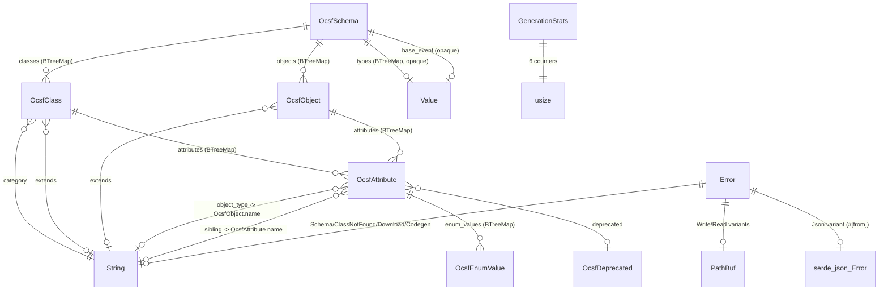

# Pass 2 Deep Dive Round 1: Domain Model -- ocsf-proto-gen

## Objective

Exhaustive mapping of every struct, enum, trait, type alias, and function in the codebase. The broad sweep captured the main domain entities but missed several secondary types, internal functions, serde annotations, and the full shape of the CLI domain types.

---

## Complete Type Catalog

### 1. Error Domain (`src/error.rs`)

#### `Error` (Enum -- 7 variants)

| Variant | Fields | Trigger | `#[error]` template |
|---------|--------|---------|---------------------|
| `Schema` | `String` | Download validation, runtime construction | `"schema error: {0}"` |
| `ClassNotFound` | `name: String, available: String` | `generate()` when class name not in schema | `"class '{name}' not found in schema (available: {available})"` |
| `Write` | `path: PathBuf, source: std::io::Error` | File/dir creation failure | `"failed to write {path}: {source}"` |
| `Read` | `path: PathBuf, source: std::io::Error` | Schema file read failure | `"failed to read {path}: {source}"` |
| `Json` | `serde_json::Error` (via `#[from]`) | JSON deserialization failure | `"failed to parse JSON: {0}"` |
| `Download` | `String` | HTTP request/response failure | `"download failed: {0}"` -- **feature-gated: `#[cfg(feature = "download")]`** |
| `Codegen` | `String` | Enum map serialization failure | `"codegen error: {0}"` |

**Derives:** `Debug` (via `thiserror::Error` derive macro)

**Traits implemented:**
- `std::fmt::Display` (via `#[error(...)]`)
- `std::error::Error` (via `thiserror::Error` derive)
- `From<serde_json::Error>` (via `#[from]` on `Json` variant)

#### `Result<T>` (Type Alias)
```rust
pub type Result<T> = std::result::Result<T, Error>;
```

---

### 2. Schema Domain (`src/schema.rs`)

#### `OcsfSchema` (Struct -- Root Aggregate)

| Field | Type | Serde annotation | Notes |
|-------|------|-------------------|-------|
| `version` | `String` | none | Semver string, e.g., `"1.7.0"` |
| `classes` | `BTreeMap<String, OcsfClass>` | none | Keyed by snake_case class name |
| `objects` | `BTreeMap<String, OcsfObject>` | none | Keyed by snake_case object name |
| `types` | `BTreeMap<String, serde_json::Value>` | `#[serde(default)]` | Parsed but unused in codegen |
| `base_event` | `serde_json::Value` | `#[serde(default)]` | Parsed but unused in codegen |

**Derives:** `Debug, Deserialize`

**Observations:**
- `types` and `base_event` use `serde_json::Value` (opaque JSON) with `#[serde(default)]`, meaning they are tolerantly parsed but never accessed by the generation pipeline. They exist purely for schema fidelity.
- No `Serialize` derive -- the schema is read-only, never written back to JSON as a struct (the raw JSON string is written to disk during download).

#### `OcsfClass` (Struct -- Entity)

| Field | Type | Serde annotation | Notes |
|-------|------|-------------------|-------|
| `name` | `String` | none | Snake_case identifier |
| `uid` | `u32` | none | Unique class ID |
| `caption` | `String` | none | Human-readable name |
| `description` | `String` | `#[serde(default)]` | Optional description |
| `extends` | `String` | `#[serde(default)]` | Parent class name (informational) |
| `category` | `String` | `#[serde(default)]` | Category name for file organization |
| `category_uid` | `u32` | `#[serde(default)]` | Category numeric ID |
| `category_name` | `String` | `#[serde(default)]` | Category display name |
| `profiles` | `Vec<String>` | `#[serde(default)]` | Active profiles list |
| `attributes` | `BTreeMap<String, OcsfAttribute>` | none | Fully-resolved attributes |

**Derives:** `Debug, Deserialize`

**Fields missed in broad sweep:** `description`, `category_name` -- both are `#[serde(default)]` String fields that are parsed but not used in proto generation.

#### `OcsfObject` (Struct -- Entity)

| Field | Type | Serde annotation | Notes |
|-------|------|-------------------|-------|
| `name` | `String` | none | Snake_case identifier |
| `caption` | `String` | none | Human-readable name |
| `description` | `String` | `#[serde(default)]` | Optional description |
| `extends` | `Option<String>` | `#[serde(default)]` | Parent object name |
| `attributes` | `BTreeMap<String, OcsfAttribute>` | none | Object attributes |
| `observable` | `Option<u32>` | `#[serde(default)]` | Observable type number |

**Derives:** `Debug, Deserialize`

#### `OcsfAttribute` (Struct -- Value Object)

| Field | Type | Serde annotation | Notes |
|-------|------|-------------------|-------|
| `type_name` | `String` | `#[serde(rename = "type")]` | OCSF type name -- **renamed from JSON `"type"` to avoid Rust keyword** |
| `caption` | `String` | `#[serde(default)]` | Human-readable name |
| `description` | `String` | `#[serde(default)]` | Optional description |
| `requirement` | `Option<String>` | `#[serde(default)]` | "required" / "recommended" / "optional" |
| `is_array` | `bool` | `#[serde(default)]` | Maps to proto `repeated` |
| `object_type` | `Option<String>` | `#[serde(default)]` | For object_t: referenced object name |
| `group` | `Option<String>` | `#[serde(default)]` | "primary" / "context" / "classification" / "occurrence" |
| `sibling` | `Option<String>` | `#[serde(default)]` | Related attribute name |
| `profile` | `Option<String>` | `#[serde(default)]` | Contributing profile name |
| `enum_values` | `Option<BTreeMap<String, OcsfEnumValue>>` | `#[serde(rename = "enum", default)]` | **Renamed from JSON `"enum"` to avoid Rust keyword** |
| `deprecated` | `Option<OcsfDeprecated>` | `#[serde(rename = "@deprecated", default)]` | **Renamed from JSON `"@deprecated"`** |

**Derives:** `Debug, Deserialize`

**Critical serde renames (missed in broad sweep):**
1. `type` -> `type_name` (Rust keyword avoidance)
2. `enum` -> `enum_values` (Rust keyword avoidance)
3. `@deprecated` -> `deprecated` (invalid Rust identifier character)

#### `OcsfEnumValue` (Struct -- Value Object)

| Field | Type | Serde annotation | Notes |
|-------|------|-------------------|-------|
| `caption` | `String` | none | Variant display name |
| `description` | `Option<String>` | `#[serde(default)]` | Optional variant description |

**Derives:** `Debug, Deserialize`

#### `OcsfDeprecated` (Struct -- Value Object)

| Field | Type | Serde annotation | Notes |
|-------|------|-------------------|-------|
| `message` | `String` | none | Deprecation reason |
| `since` | `String` | `#[serde(default)]` | Version string |

**Derives:** `Debug, Deserialize`

---

### 3. Codegen Domain (`src/codegen.rs`)

#### `GenerationStats` (Struct -- Value Object)

| Field | Type | Default |
|-------|------|---------|
| `classes_generated` | `usize` | `0` |
| `objects_generated` | `usize` | `0` |
| `enums_generated` | `usize` | `0` |
| `deprecated_fields_skipped` | `usize` | `0` |
| `string_enum_fields_skipped` | `usize` | `0` |
| `unknown_types_defaulted` | `usize` | `0` |

**Derives:** `Debug, Default`

**Observation:** This is a mutable accumulator threaded through all generation functions via `&mut GenerationStats`. It is the only mutable state in the generation pipeline (other than the output String buffers).

#### Internal Functions (not exported)

| Function | Visibility | Signature | Purpose |
|----------|-----------|-----------|---------|
| `resolve_object_graph` | `fn` (private) | `(schema: &OcsfSchema, class_names: &[String]) -> BTreeSet<String>` | BFS transitive closure of object refs |
| `lookup_object` | `fn` (private) | `(schema: &'a OcsfSchema, name: &str) -> Option<&'a OcsfObject>` | 3-tier object lookup (original, sanitized, scan) |
| `generate_events_proto` | `fn` (private) | `(version_slug, category, classes, objects, stats) -> String` | Event class proto file content |
| `generate_class_enums_proto` | `fn` (private) | `(version_slug, category, classes, stats) -> String` | Per-category enum definitions |
| `generate_objects_proto` | `fn` (private) | `(version_slug, schema, needed_objects, stats) -> String` | Shared objects proto file content |
| `generate_object_enums_proto` | `fn` (private) | `(version_slug, schema, needed_objects, stats) -> String` | Object enum definitions |
| `generate_enum_value_map` | `fn` (private) | `(schema, class_names, needed_objects) -> Result<String>` | JSON enum reference file |
| `collect_enum_entries` | `fn` (private) | `(prefix, attributes, map) -> ()` | Shared enum collector |
| `resolve_event_field_type` | `fn` (private) | `(attr, attr_name, class_upper, version_slug, category, objects, stats) -> (bool, String)` | Event field type resolution |
| `resolve_object_field_type` | `fn` (private) | `(attr, attr_name, obj_upper, version_slug, objects, stats) -> (bool, String)` | Object field type resolution |
| `resolve_object_ref` | `fn` (private) | `(attr, version_slug, objects, repeated, stats) -> (bool, String)` | Object reference resolution |
| `is_integer_enum` | `fn` (private) | `(enum_values: &BTreeMap<String, OcsfEnumValue>) -> bool` | Integer vs string enum detection |
| `write_enum_definition` | `fn` (private) | `(out, enum_name, enum_vals) -> ()` | Proto enum text writer |
| `version_to_slug` | `fn` (private) | `(version: &str) -> String` | Version string conversion |
| `write_file` | `fn` (private) | `(path: &Path, content: &str) -> Result<()>` | File writer with dir creation |

#### Public API

| Function | Signature |
|----------|-----------|
| `generate` | `pub fn generate(schema: &OcsfSchema, class_names: &[String], output_dir: &Path) -> Result<GenerationStats>` |

---

### 4. Type Map Domain (`src/type_map.rs`)

All functions are public. No structs or enums.

| Function | Signature | Pure? | Notes |
|----------|-----------|-------|-------|
| `ocsf_to_proto_type` | `pub fn(type_name: &str) -> Option<&'static str>` | Yes | Returns `None` for `object_t`, `Some("string")` for unknown |
| `to_pascal_case` | `pub fn(s: &str) -> String` | Yes | Handles extension prefix stripping |
| `to_screaming_snake` | `pub fn(s: &str) -> String` | Yes | Simple `.to_uppercase()` |
| `sanitize_object_name` | `pub fn(s: &str) -> String` | Yes | Strips extension prefix via `rsplit('/')` |
| `to_enum_variant_name` | `pub fn(caption: &str) -> String` | Yes | Non-alphanum -> `_`, collapse, trim |

---

### 5. CLI Domain (`src/main.rs`)

#### `Cli` (Struct -- clap derive)

| Field | Type | Notes |
|-------|------|-------|
| `command` | `Commands` | Subcommand dispatch |

**Derives:** `clap::Parser`

#### `Commands` (Enum -- clap derive)

| Variant | Feature gate | Fields |
|---------|-------------|--------|
| `DownloadSchema` | `#[cfg(feature = "download")]` | `ocsf_version: String` (default "1.7.0"), `output_dir: PathBuf` (default "."), `schema_url: String` (default URL, env `OCSF_SCHEMA_URL`) |
| `Generate` | none | `ocsf_version: String` (default "1.7.0"), `classes: String`, `output_dir: PathBuf` (default "."), `schema_dir: PathBuf` (default "."), `quiet: bool` |

**Derives:** `clap::Subcommand`

**Observation:** The `schema_url` field in `DownloadSchema` supports an environment variable override via `#[arg(env = "OCSF_SCHEMA_URL")]`. This is the only env-var based configuration in the codebase.

#### Internal Functions

| Function | Signature | Purpose |
|----------|-----------|---------|
| `main` | `fn main()` | CLI entry, error chain printing, exit code |
| `run` | `fn run(cli: Cli) -> ocsf_proto_gen::error::Result<()>` | Subcommand dispatch and orchestration |

---

### 6. Library API (`src/lib.rs`)

No types defined. Purely re-exports four modules:
- `pub mod codegen;`
- `pub mod error;`
- `pub mod schema;`
- `pub mod type_map;`

---

### 7. Test Domain (`tests/integration.rs`)

#### Test Helper Functions

| Function | Signature | Purpose |
|----------|-----------|---------|
| `test_schema` | `fn test_schema() -> OcsfSchema` | Builds a realistic schema programmatically |
| `default_attr` | `fn default_attr() -> OcsfAttribute` | Default attribute constructor (all fields empty/None/false) |
| `tempdir` | `fn tempdir() -> PathBuf` | Unique temp dir via `AtomicU64` counter |
| `walkdir` | `fn walkdir(dir: &Path) -> Vec<PathBuf>` | Recursive file listing, sorted |

**Key detail about `test_schema()`:** Constructs exactly:
- 1 class: `authentication` (9 attributes including deprecated `old_field`, string-enum `auth_protocol`, empty-object `unmapped`, repeated-object `enrichments`, timestamp `time`)
- 3 objects: `network_endpoint` (4 attrs including integer enum `type_id`), `enrichment` (2 attrs), `object` (0 attrs)

**Key detail about `tempdir()`:** Uses `std::sync::atomic::AtomicU64` with `Ordering::Relaxed` for thread-safe unique naming. Prefixes with process ID for cross-process safety. Cleans up any prior run residue via `remove_dir_all` before creating.

---

## Entity Relationship Diagram



---

## Serde Annotation Inventory

This is critical for any re-implementation. Every serde customization in the codebase:

| Struct | Field | Annotation | Purpose |
|--------|-------|------------|---------|
| `OcsfSchema` | `types` | `#[serde(default)]` | Tolerate missing key |
| `OcsfSchema` | `base_event` | `#[serde(default)]` | Tolerate missing key |
| `OcsfClass` | `description` | `#[serde(default)]` | Tolerate missing |
| `OcsfClass` | `extends` | `#[serde(default)]` | Tolerate missing |
| `OcsfClass` | `category` | `#[serde(default)]` | Tolerate missing |
| `OcsfClass` | `category_uid` | `#[serde(default)]` | Tolerate missing (defaults to 0) |
| `OcsfClass` | `category_name` | `#[serde(default)]` | Tolerate missing |
| `OcsfClass` | `profiles` | `#[serde(default)]` | Tolerate missing (defaults to empty Vec) |
| `OcsfObject` | `description` | `#[serde(default)]` | Tolerate missing |
| `OcsfObject` | `extends` | `#[serde(default)]` | Tolerate missing |
| `OcsfObject` | `attributes` (note: NOT default) | none | **Required** -- will error if missing |
| `OcsfObject` | `observable` | `#[serde(default)]` | Tolerate missing |
| `OcsfAttribute` | `type_name` | `#[serde(rename = "type")]` | **JSON `"type"` -> Rust `type_name`** |
| `OcsfAttribute` | `caption` | `#[serde(default)]` | Tolerate missing |
| `OcsfAttribute` | `description` | `#[serde(default)]` | Tolerate missing |
| `OcsfAttribute` | `requirement` | `#[serde(default)]` | Tolerate missing |
| `OcsfAttribute` | `is_array` | `#[serde(default)]` | Defaults to `false` |
| `OcsfAttribute` | `object_type` | `#[serde(default)]` | Tolerate missing |
| `OcsfAttribute` | `group` | `#[serde(default)]` | Tolerate missing |
| `OcsfAttribute` | `sibling` | `#[serde(default)]` | Tolerate missing |
| `OcsfAttribute` | `profile` | `#[serde(default)]` | Tolerate missing |
| `OcsfAttribute` | `enum_values` | `#[serde(rename = "enum", default)]` | **JSON `"enum"` -> Rust `enum_values`** + tolerate missing |
| `OcsfAttribute` | `deprecated` | `#[serde(rename = "@deprecated", default)]` | **JSON `"@deprecated"` -> Rust `deprecated`** + tolerate missing |
| `OcsfEnumValue` | `description` | `#[serde(default)]` | Tolerate missing |
| `OcsfDeprecated` | `since` | `#[serde(default)]` | Tolerate missing (defaults to empty string) |

**Mandatory fields (no `#[serde(default)]`):**
- `OcsfSchema`: `version`, `classes`, `objects`
- `OcsfClass`: `name`, `uid`, `caption`, `attributes`
- `OcsfObject`: `name`, `caption`, `attributes`
- `OcsfAttribute`: `type_name` (as `"type"`)
- `OcsfEnumValue`: `caption`
- `OcsfDeprecated`: `message`

---

## Implicit Domain Concepts (Not Modeled as Types)

These domain concepts exist in the code as patterns but have no dedicated type:

1. **Version Slug** -- `"1.7.0"` -> `"v1_7_0"`. Created by `version_to_slug()` (private in codegen.rs). Not a newtype, just a `String`.

2. **Proto Package Path** -- Constructed inline as `format!("ocsf.{version_slug}.events.{category}")`. Four variants: events, events enums, objects, objects enums.

3. **Qualified Type Reference** -- E.g., `"ocsf.v1_7_0.objects.NetworkEndpoint"`. Built inline via string formatting.

4. **Needed Objects Set** -- `BTreeSet<String>` returned by `resolve_object_graph()`. Contains sanitized (prefix-stripped) object names.

5. **Category Grouping** -- `BTreeMap<String, Vec<&OcsfClass>>` built in `generate()`. Groups classes for directory-per-category output structure.

6. **Field Number** -- `u32` counter starting at 1, incremented per non-deprecated attribute. Not stored anywhere; purely procedural.

7. **Integer vs String Enum Distinction** -- Encoded as a boolean test (`is_integer_enum()`), not as a type-level distinction. An enum is "integer-keyed" if ALL keys parse as `i32`.

---

## Delta Summary
- New items added: 14 internal functions cataloged, 5 CLI types documented, 24 serde annotations inventoried, 7 implicit domain concepts identified, 4 test helper functions documented
- Existing items refined: All 6 schema domain types now have complete field-level serde annotation mapping; Error enum now has all traits and derives documented
- Remaining gaps: No types or functions missed at this level of analysis. Round 2 should verify relationship semantics and cross-module data flow patterns.

## Novelty Assessment
Novelty: SUBSTANTIVE
The broad sweep missed the complete serde annotation inventory (3 critical renames: `type`->`type_name`, `enum`->`enum_values`, `@deprecated`->`deprecated`), the mandatory vs optional field distinction, the CLI domain types (`Cli`, `Commands`), all 14 internal codegen functions, the test helper functions, and 7 implicit domain concepts. These materially change how you would spec this system.

## Convergence Declaration
Another round needed -- must verify cross-module data flow patterns, lifetime relationships in `lookup_object`, and the exact control flow through field type resolution to ensure the domain model captures all behavioral semantics.

## State Checkpoint
```yaml
pass: 2
round: 1
status: complete
timestamp: 2026-04-13T00:00:00Z
novelty: SUBSTANTIVE
```
