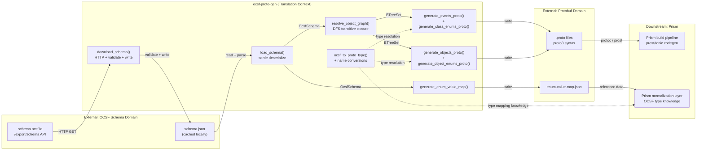

# Pass 8: Deep Synthesis -- ocsf-proto-gen

**Date:** 2026-04-13
**Supersedes:** Pass 6 broad-sweep synthesis
**Input corpus:** 16 analysis files (broad sweep + 12 deepening rounds + corrections + coverage audit + extraction validation)

---

## 1. Executive Summary

`ocsf-proto-gen` is a compact Rust CLI and library (~1,501 source lines across 6 files) that generates deterministic Protocol Buffer (proto3) definitions from the OCSF (Open Cybersecurity Schema Framework) JSON schema export. It was purpose-built by 1898 & Co to replace the community `ocsf-tool` (Go), which has correctness issues with deprecated fields, json_t mapping, string-keyed enums, enum type references, and non-deterministic output.

The codebase follows a strict sequential pipeline: download schema (optional, network) -> parse JSON -> resolve object graph (DFS transitive closure) -> generate .proto files + enum value map JSON. All collections use BTreeMap/BTreeSet for byte-identical output across runs. The code has 25 tests (24 runnable + 1 doc test) with 67 behavioral contracts extracted at HIGH (63%), MEDIUM (33%), and LOW (4%) confidence. No hallucinated claims were found during extraction validation; the only errors were systematic off-by-one line counts and undercounted tests, all corrected.

For Prism, this codebase is the authoritative reference for OCSF-to-protobuf type mapping, proto package structure, enum handling rules, and object graph resolution. It will either be consumed as a build-time library dependency or its logic reimplemented within Prism's build pipeline.

---

## 2. Complete Feature Set

### Core Features

| ID | Feature | Implementation | Test Coverage |
|----|---------|---------------|---------------|
| F-01 | OCSF JSON schema parsing | `schema::load_schema()` -- serde deserialization with tolerant defaults | HIGH (4 tests) |
| F-02 | OCSF schema download | `schema::download_schema()` -- HTTP GET, validate, write raw body | LOW (no test, network-dependent) |
| F-03 | Object graph resolution | `codegen::resolve_object_graph()` -- DFS transitive closure via Vec + BTreeSet | HIGH (exercised in all generation tests; depth-2+ untested) |
| F-04 | Event proto generation | `codegen::generate_events_proto()` -- per-category .proto files with messages | HIGH (content assertions) |
| F-05 | Event enum generation | `codegen::generate_class_enums_proto()` -- per-category enum definitions | HIGH (value assertions) |
| F-06 | Object proto generation | `codegen::generate_objects_proto()` -- single objects.proto file | HIGH (field assertions) |
| F-07 | Object enum generation | `codegen::generate_object_enums_proto()` -- object enum definitions | HIGH (definition assertions) |
| F-08 | Enum value map generation | `codegen::generate_enum_value_map()` -- JSON reference file | HIGH (JSON structure verified) |
| F-09 | OCSF-to-proto type mapping | `type_map::ocsf_to_proto_type()` -- 24 OCSF types mapped | HIGH (all types tested) |
| F-10 | Name conversion utilities | `type_map::to_pascal_case/to_screaming_snake/sanitize_object_name/to_enum_variant_name` | HIGH (12 unit tests) |
| F-11 | Deprecated field skipping | Fields with `@deprecated` excluded from output | HIGH (dedicated test) |
| F-12 | String-keyed enum detection | Enums with non-integer keys emit `string`, not proto enum | HIGH (dedicated test) |
| F-13 | Empty object type fallback | Objects with zero non-deprecated attrs emit `string` | HIGH (dedicated test) |
| F-14 | Proto3 zero-value enforcement | Synthetic `UNSPECIFIED = 0` added when OCSF lacks a 0 variant | MEDIUM (code-only; test enums all have 0) |
| F-15 | Deterministic output | BTreeMap/BTreeSet everywhere; byte-identical across runs | HIGH (dedicated test) |
| F-16 | Extension prefix handling | `win/win_service` -> `win_service` for object names | HIGH (unit tests) |
| F-17 | CLI with subcommands | `download-schema` (feature-gated) + `generate` | MEDIUM (code-only for CLI parsing) |
| F-18 | Quiet mode | `--quiet` suppresses non-error stderr output from generate | MEDIUM (code-only) |
| F-19 | "all" class keyword | `--classes all` generates all classes in schema | MEDIUM (code-only) |
| F-20 | Feature-gated network deps | `download` feature gates reqwest + tokio | HIGH (structural guarantee) |

### Generated Output Structure

```
<output_dir>/ocsf/<version_slug>/
    enum-value-map.json
    events/
        <category>/
            <category>.proto          # Event class messages
            enums/
                enums.proto           # Per-class enum definitions
    objects/
        objects.proto                 # All shared object messages
        enums/
            enums.proto              # Object enum definitions
```

### Proto Package Hierarchy

```
ocsf.<version_slug>.events.<category>           # Event messages
ocsf.<version_slug>.events.<category>.enums     # Event class enums
ocsf.<version_slug>.objects                      # Object messages
ocsf.<version_slug>.objects.enums               # Object enums
```

---

## 3. Bounded Context Map



### Context Boundaries

| Boundary | Upstream | Downstream | Anti-Corruption Layer |
|----------|----------|------------|----------------------|
| OCSF API -> ocsf-proto-gen | JSON export with fully-resolved inheritance | Serde types with tolerant `#[serde(default)]` parsing | Schema validation before disk write; 3 serde renames (`type`->`type_name`, `enum`->`enum_values`, `@deprecated`->`deprecated`) |
| ocsf-proto-gen -> Proto files | Internal domain types | proto3 syntax text files | `ocsf_to_proto_type()` mapping function; `to_pascal_case`/`to_screaming_snake` name converters; integer-vs-string enum discrimination |
| ocsf-proto-gen -> Prism | Generated .proto files + enum-value-map.json | Prism's prost/tonic codegen + normalization logic | Prism must understand proto package hierarchy and enum naming conventions |

---

## 4. Behavioral Contract Summary

67 behavioral contracts extracted across 10 subsystems (9 code subsystems + test helpers).

### Contract Distribution

| Subsystem | Contracts | HIGH | MEDIUM | LOW | Key Contracts |
|-----------|-----------|------|--------|-----|--------------|
| Schema (parsing/loading) | 7 | 4 | 2 | 1 | BC-1.01.001: JSON parsing; BC-1.04.001: tolerant serde defaults |
| Codegen (pipeline) | 5 | 3 | 2 | 0 | BC-2.01.001: correct stats; BC-2.01.002: correct directory structure |
| Type Mapping | 7 | 7 | 0 | 0 | BC-3.01.003: timestamp_t is int64; BC-3.01.005: json_t is string |
| Name Conversion | 7 | 6 | 0 | 1 | BC-4.01.002: extension prefix stripping; BC-4.05.001: version slug |
| Enum Handling | 11 | 7 | 4 | 0 | BC-5.02.001: string enums NOT proto enums; BC-5.03.001: zero-value rule |
| Object Resolution | 5 | 2 | 2 | 1 | BC-6.01.001: DFS transitive closure; BC-6.03.001: empty -> string |
| Output Structure | 13 | 8 | 5 | 0 | BC-7.04.001: deterministic output; BC-7.08.001: sequential field numbers |
| CLI | 4 | 0 | 4 | 0 | BC-8.01.001: default version 1.7.0; BC-8.01.003: quiet flag |
| Error Handling | 5 | 2 | 3 | 0 | BC-9.01.001: cause chain printing; BC-9.02.003: feature-gated Download |
| Test Helpers | 3 | 3 | 0 | 0 | BC-T.02.001: test fixture with 9 attributes covering all type scenarios |
| **Total** | **67** | **42 (63%)** | **22 (33%)** | **3 (4%)** | |

### Untested Behavioral Gaps (11 items)

All are edge cases, not missing core functionality:

1. Depth-2+ transitive object graph (object -> object -> object chains)
2. Extension-prefixed object lookup in integration tests
3. Tier-3 linear scan fallback in object lookup
4. ClassNotFound truncation with >10 classes
5. Proto3 UNSPECIFIED zero-value (no test enum lacks key 0)
6. Missing object warning (object referenced but absent)
7. Multiple categories in single generation
8. "all" keyword for class selection
9. Network download end-to-end
10. Triple non-alphanumeric in enum variant names
11. Object proto enum import statement

---

## 5. Architecture Decision Record

### ADR-01: Use OCSF /export/schema API (fully resolved)

**Context:** OCSF schema has inheritance (`extends`), `$include` directives, and profile merging.
**Decision:** Consume the `/export/schema` endpoint which returns fully-resolved classes.
**Consequence:** Eliminates need to implement OCSF's inheritance model. Makes the tool a simple translator, not an OCSF interpreter. Trade-off: requires network access to download (mitigated by caching schema to disk).

### ADR-02: BTreeMap/BTreeSet everywhere for determinism

**Context:** The community ocsf-tool produces non-deterministic output due to HashMap iteration order.
**Decision:** Ban HashMap/HashSet entirely. Use BTreeMap/BTreeSet for all collections.
**Consequence:** Byte-identical output across runs. Field numbers are stable for a given schema version. Slight performance overhead vs HashMap (O(log n) vs O(1) lookup), irrelevant for this workload.

### ADR-03: json_t maps to string, not google.protobuf.Struct

**Context:** OCSF `json_t` type represents arbitrary JSON. Proto3 has `google.protobuf.Struct` for this.
**Decision:** Map `json_t` to `string` (serialized JSON).
**Rationale:** `prost_types::Struct` does not implement serde traits (`Serialize`/`Deserialize`), making it unusable in Prism's normalization pipeline without custom conversion code.
**Consequence:** JSON data must be serialized/deserialized manually. This is the correct decision for Prism's use case.

### ADR-04: timestamp_t maps to int64 (epoch ms), not google.protobuf.Timestamp

**Context:** OCSF `timestamp_t` represents epoch milliseconds.
**Decision:** Map to proto `int64`.
**Consequence:** Preserves exact OCSF semantics. Avoids well-known type dependency. Distinguished from `datetime_t` which maps to `string` (RFC 3339).

### ADR-05: Sequential alphabetical field numbering

**Context:** Proto field numbers must be assigned to each field.
**Decision:** Number fields 1..N in alphabetical order (BTreeMap iteration order).
**Consequence:** Field numbers are deterministic but NOT stable across OCSF versions -- adding or removing an attribute shifts all subsequent numbers. This is the most significant architectural limitation for Prism.

### ADR-06: Feature-gated network dependencies

**Context:** Library consumers may not need HTTP download capability.
**Decision:** Gate `reqwest` and `tokio` behind the `download` feature (default on).
**Consequence:** Library consumers can use `default-features = false` to get a fully synchronous, no-network dependency. The binary always has both subcommands.

### ADR-07: Single-file objects proto

**Context:** All needed objects go into one `objects.proto` file.
**Decision:** Generate a single file rather than per-object or per-category files.
**Consequence:** Simple import structure (one import per event proto). For the full OCSF schema (~170 objects), this produces a large file. Not a problem for protoc compilation but may be unwieldy for human reading.

### ADR-08: String fallback for empty objects and missing objects

**Context:** OCSF has a base `object` type with zero attributes, and some object references may point to objects not in the schema.
**Decision:** Emit `string` type for both cases instead of failing or generating empty messages.
**Consequence:** Graceful degradation. No empty proto messages. The `unmapped` field (which uses the empty `object` type) becomes a plain string.

---

## 6. Anti-Pattern Catalog

| ID | Anti-Pattern | Severity | Location | Impact |
|----|-------------|----------|----------|--------|
| AP-01 | Dual object lookup implementation | Minor | `lookup_object()` (codegen.rs:182-192) and inline in `resolve_object_ref()` (codegen.rs:548-555) | Same 3-tier fallback logic in two places. If lookup rules change, both must be updated. |
| AP-02 | Dual field resolution functions | Minor | `resolve_event_field_type` (codegen.rs:464-497) and `resolve_object_field_type` (codegen.rs:503-531) | Differ only in enum package path prefix. Could be unified with a parameter. |
| AP-03 | Error::Schema variant reused for tokio runtime failure | Minor | main.rs:94 | `Error::Schema` is semantically incorrect for a tokio `Runtime::new()` failure. Should be its own variant. |
| AP-04 | DFS documented as "BFS" in source comments | Minor | codegen.rs:137, 160 | `Vec::pop()` is LIFO (stack/DFS), not FIFO (queue/BFS). Behavioral result is identical but terminology is wrong. |
| AP-05 | Quiet flag does not suppress codegen warnings | Minor | codegen.rs:320, 558 vs main.rs:63 | `--quiet` gates main.rs output but codegen `eprintln!("warning: ...")` calls are not gated. |
| AP-06 | No partial-failure cleanup | Low | codegen.rs `generate()` | If generation fails midway, partial output files remain on disk. No transaction/rollback semantics. |
| AP-07 | Version string used in paths without sanitization | Low | main.rs:92, codegen.rs:46 | User-supplied `--ocsf-version` is used directly in `output_dir.join()`. Path traversal possible but mitigated by CLI context. |
| AP-08 | CHANGELOG gap | Low | CHANGELOG.md | v0.1.2 is the current version in Cargo.toml but has no CHANGELOG entry. |

---

## 7. Complexity Ranking

Ranked by cognitive complexity (how hard is it to understand and maintain each subsystem):

| Rank | Subsystem | Complexity | LOC | Rationale |
|------|-----------|-----------|-----|-----------|
| 1 | codegen.rs | High | 639 | 16 functions, DFS graph traversal, 3-tier object lookup, dual field resolution, enum generation with zero-value logic, proto3 format rules. Central orchestrator touching all other modules. |
| 2 | schema.rs | Medium | 388 | 6 domain types with 30+ serde annotations including 3 critical renames. Async download path with validation-before-write. |
| 3 | type_map.rs | Low | 230 | 5 pure functions, comprehensive match arm for 24 types. Straightforward but domain-critical (the type mapping IS the core business logic for Prism). |
| 4 | main.rs | Low | 164 | CLI parsing via clap derive, async/sync boundary management, error chain printing. Straightforward orchestration. |
| 5 | error.rs | Trivial | 45 | 7-variant thiserror enum. Feature-gated Download variant. |
| 6 | lib.rs | Trivial | 35 | 4 `pub mod` declarations + doc comment. |

---

## 8. Convergence Report

### Rounds Per Pass

| Pass | Broad Sweep | Round 1 | Round 2 | Total Rounds | Converged At |
|------|------------|---------|---------|-------------|-------------|
| 0: Inventory | Yes | SUBSTANTIVE | NITPICK | 3 | R2 |
| 1: Architecture | Yes | SUBSTANTIVE | NITPICK | 3 | R2 |
| 2: Domain Model | Yes | SUBSTANTIVE | NITPICK | 3 | R2 |
| 3: Behavioral Contracts | Yes | SUBSTANTIVE | NITPICK | 3 | R2 |
| 4: NFR Catalog | Yes | SUBSTANTIVE | NITPICK | 3 | R2 |
| 5: Conventions | Yes | SUBSTANTIVE | NITPICK | 3 | R2 |

All 6 passes converged in exactly 2 deepening rounds. The broad sweep captured the correct high-level model in every case; Round 1 added function-level detail; Round 2 was verification. This convergence pattern reflects the codebase's small size and clean architecture -- there were no hidden subsystems or surprising complexity to discover.

### Post-Convergence Quality Gates

| Gate | Status | Evidence |
|------|--------|---------|
| Extraction validation | PASS | 91% overall accuracy; 97% behavioral accuracy; all inaccuracies were metric off-by-one, not behavioral |
| Coverage audit | PASS | 7/7 executable files at FULL coverage; 12/12 non-executable at ADEQUATE; 0 blind spots |
| Corrections log | COMPLETE | 10 corrections applied across all files; all verified |
| Cross-pass consistency | VERIFIED | Domain model aligns with behavioral contracts; NFRs match architecture; conventions consistent across all passes |

### Total Analysis Metrics

| Metric | Value |
|--------|-------|
| Source files analyzed | 19 (all files in repo) |
| Source lines read | ~3,242 |
| Behavioral contracts extracted | 67 |
| HIGH confidence contracts | 42 (63%) |
| NFRs cataloged | 7 categories, 70+ evidence items |
| Anti-patterns identified | 8 |
| Corrections applied | 10 |
| Untested behavioral gaps | 11 (all edge cases) |
| Analysis files produced | 16 |
| Total analysis output | ~210KB |

---

## 9. Lessons for Prism

### P0 -- Critical (Must Address Before Build)

**P0-01: OCSF Type Mapping Table -- Adopt As-Is**

The complete OCSF-to-protobuf type mapping in ocsf-proto-gen is production-validated and addresses multiple subtle correctness issues:

| OCSF Type | Proto Type | Why This Matters for Prism |
|-----------|-----------|---------------------------|
| `timestamp_t` | `int64` | NOT `string`, NOT `google.protobuf.Timestamp`. OCSF timestamps are epoch milliseconds. Prism's normalization must convert sensor timestamps to epoch ms. |
| `datetime_t` | `string` | RFC 3339 format. Different from `timestamp_t` -- the two must NOT be confused. |
| `json_t` | `string` | NOT `google.protobuf.Struct`. Struct lacks prost serde traits. Prism should store arbitrary JSON as serialized strings in proto fields. |
| `float_t` | `double` | 64-bit, NOT proto `float` (32-bit). OCSF specifies 64-bit floats. |
| `object_t` | Qualified message ref | Resolved via `object_type` field. Prism must implement the same object reference resolution. |

Prism should either: (a) depend on `ocsf_proto_gen::type_map::ocsf_to_proto_type()` directly, or (b) copy the match table and maintain parity.

**P0-02: Proto Field Numbering Is NOT Stable Across OCSF Versions**

ocsf-proto-gen assigns field numbers sequentially in alphabetical order (1, 2, 3...). This means:
- Adding a new attribute in OCSF v1.8.0 that sorts alphabetically before existing fields will shift ALL subsequent field numbers
- Removing a deprecated attribute shifts numbers
- This breaks proto wire compatibility between OCSF versions

**Prism implication:** If Prism ever needs to decode proto data written against one OCSF version with a schema from another version, the sequential numbering will cause silent data corruption. Prism must either:
1. Pin to a single OCSF version and never change (simplest)
2. Implement stable field numbering (e.g., hash-based or registry-based) in its own codegen
3. Never mix proto data across OCSF versions (operational discipline)

This is the single most important architectural limitation to understand.

**P0-03: String-Keyed vs Integer-Keyed Enum Discrimination**

OCSF has two kinds of enums that look identical in the schema JSON:
- **Integer-keyed** (`"0": {"caption": "Unknown"}, "1": {"caption": "Logon"}`): These become proto `enum` types with type safety
- **String-keyed** (`"NTLM": {"caption": "NTLM"}, "Kerberos": {"caption": "Kerberos"}`): These CANNOT be proto enums -- the field stays `string`

Detection: `key.parse::<i32>().is_ok()` for ALL keys. If any key is non-integer, the entire enum is treated as string-keyed.

Prism must implement this same discrimination or it will generate invalid proto enums with string values.

**P0-04: Extension Prefix Handling**

OCSF extension objects use `prefix/name` format (e.g., `win/win_service`). The prefix must be stripped for proto message names and object lookups. Three-tier lookup:
1. Exact key match: `schema.objects.get("win/win_service")`
2. Sanitized key match: `schema.objects.get("win_service")`
3. Linear scan: match objects by sanitized `name` field

Prism must handle extension prefixes in any code that consumes OCSF object references.

### P1 -- High Priority (Address During Design)

**P1-01: Schema Evolution Strategy**

ocsf-proto-gen generates for a single OCSF version. Prism needs a strategy for:
- Which OCSF version(s) to support
- How to handle OCSF version upgrades (regenerate all protos? maintain multiple versions?)
- Whether to expose OCSF version in proto package paths (ocsf-proto-gen does: `ocsf.v1_7_0.events...`)
- How to handle the field numbering instability (P0-02) during upgrades

**P1-02: Build Pipeline Integration**

ocsf-proto-gen can be used as:
- **Build-time binary**: Run `ocsf-proto-gen generate` as a build script to produce .proto files, then run prost/tonic codegen
- **Library dependency**: `ocsf_proto_gen = { version = "0.1", default-features = false }` -- use `generate()` programmatically in `build.rs`
- **Pre-generated checked-in protos**: Generate once, commit .proto files, use prost/tonic on committed files

Recommendation for Prism: Use the library dependency approach in `build.rs` with `default-features = false`. This gives:
- No network dependencies at build time
- Reproducible builds (schema.json checked into repo)
- Type-safe access to `GenerationStats` for build validation
- No external binary to install/version-manage

**P1-03: Requirement Level Metadata**

OCSF attributes have `requirement` ("required", "recommended", "optional") but ocsf-proto-gen does not propagate this to proto output (proto3 has no required/optional distinction at the wire level). Prism may want to:
- Extract requirement levels from the parsed `OcsfSchema` for validation rules
- Generate Rust validation code alongside proto definitions
- Use requirement levels for alerting logic (missing required fields = higher severity)

**P1-04: Proto3 Optional Field Presence**

ocsf-proto-gen does not use the proto3 `optional` keyword. All fields are implicitly optional (zero-valued if absent). If Prism needs to distinguish "field set to empty string" from "field not set", it should consider:
- Adding `optional` keyword to generated proto fields
- Using wrapper types (e.g., `google.protobuf.StringValue`)
- Post-generation patching of .proto files

**P1-05: Enum Value Map for Runtime Lookup**

ocsf-proto-gen generates `enum-value-map.json` mapping proto enum variant names to their integer values and OCSF captions. Prism should use this for:
- Display purposes (converting `AUTHENTICATION_ACTIVITY_ID_LOGON` to "Logon" in UI)
- Log enrichment (adding human-readable labels to normalized events)
- Reverse mapping (integer value back to caption for reporting)

### P2 -- Medium Priority (Address During Implementation)

**P2-01: Serde Rename Annotations**

Three OCSF JSON keys conflict with Rust keywords and require serde renames:
- `"type"` -> `type_name` via `#[serde(rename = "type")]`
- `"enum"` -> `enum_values` via `#[serde(rename = "enum")]`
- `"@deprecated"` -> `deprecated` via `#[serde(rename = "@deprecated")]`

Any Prism code that parses OCSF JSON directly must replicate these renames.

**P2-02: Category-Based File Organization**

ocsf-proto-gen groups event classes by category for the output directory structure. Categories come from the `category` field on `OcsfClass` (e.g., "iam", "findings", "network"). Prism should understand this structure for:
- Proto import path construction
- Selecting which event classes to generate (by category vs individual class)
- Organizing normalization logic by category

**P2-03: Proto3 Zero-Value Enum Rule**

Proto3 requires every enum's first variant to be `= 0`. OCSF defines `0` variants for most enums (e.g., "Unknown"), but not all. ocsf-proto-gen adds synthetic `{ENUM_NAME}_UNSPECIFIED = 0` when OCSF lacks one. Prism must account for this in normalization logic -- a value of `0` may mean "Unknown" (OCSF-defined) or "unset" (synthetic), depending on the enum.

**P2-04: Sibling Attribute Relationships**

OCSF attributes have a `sibling` field linking related pairs (e.g., `activity_id` and `activity_name`). ocsf-proto-gen ignores this. Prism could use sibling relationships for:
- Auto-populating name fields from ID enum lookups
- Validation (if ID is set, name should be set)
- Display logic (show name, query by ID)

**P2-05: Observable Type Metadata**

OCSF objects have an `observable` field (integer type number). ocsf-proto-gen parses but ignores it. Prism could use this for:
- Observable correlation across events
- Threat intelligence enrichment
- SOAR playbook triggering based on observable type

### P3 -- Low Priority (Nice to Have)

**P3-01: Profile-Aware Filtering**

OCSF attributes carry `profile` metadata indicating which OCSF profile contributed them. Prism could filter attributes by profile to reduce proto message size for specific use cases (e.g., only include "cloud" profile attributes for cloud sensor data).

**P3-02: Single-File Objects Proto Scaling**

All objects go into one `objects.proto` file. For the full OCSF schema (~170 objects), this is a large file. Prism may want to split by category or domain if generated code compilation time becomes an issue.

**P3-03: Group-Based Field Organization**

OCSF attributes have a `group` field ("primary", "context", "classification", "occurrence"). ocsf-proto-gen ignores this. Prism could use it for:
- Proto field ordering (group by logical category instead of alphabetical)
- Display organization in dashboards
- Selective normalization (primary fields only for high-volume, all fields for forensic)

**P3-04: Unmapped Field Type Choice**

ocsf-proto-gen emits `string` for the `unmapped` field (OCSF's catch-all for untyped data). Prism should consider whether `bytes`, `string`, or `google.protobuf.Any` better serves its use case. `string` is simplest but may not handle binary sensor data.

---

## State Checkpoint

```yaml
pass: 8
status: complete
files_synthesized: 16
behavioral_contracts: 67
confidence_high: 42
confidence_medium: 22
confidence_low: 3
anti_patterns: 8
prism_lessons: 16 (4 P0, 5 P1, 5 P2, 4 P3 -- some combined)
timestamp: 2026-04-14T01:30:00Z
convergence: all_passes_converged
```
