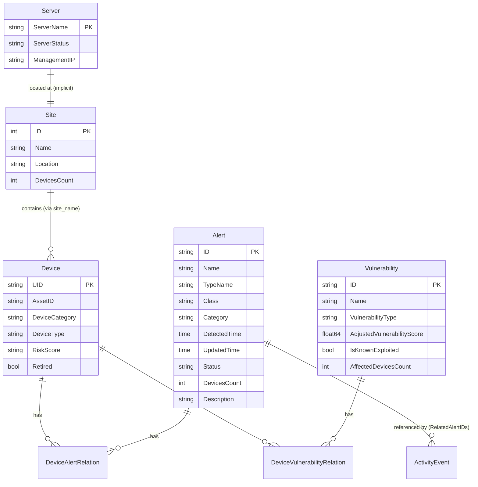
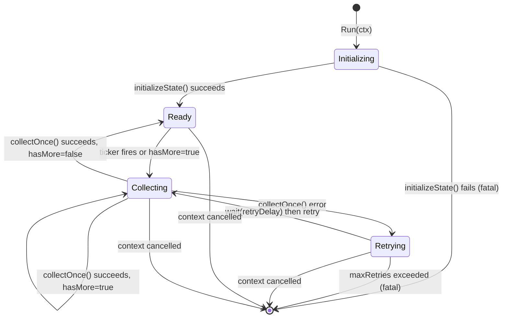
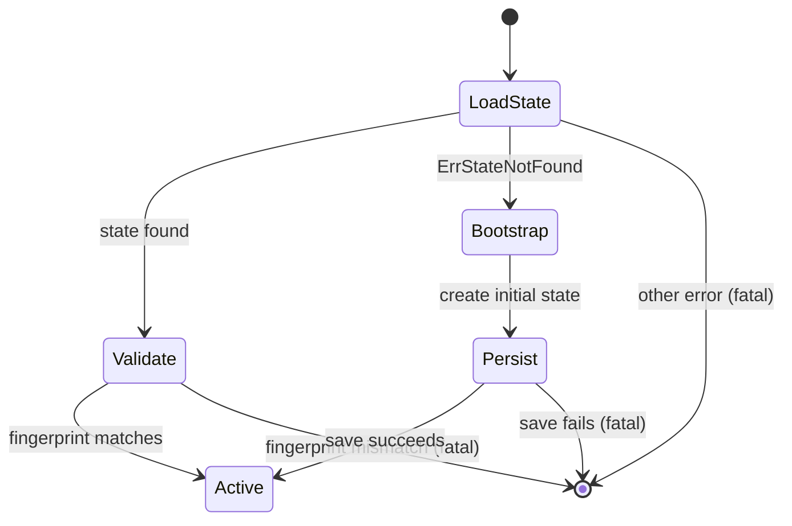

# Pass 2 Deep: Domain Model -- Round 1

> Project: poller-bear
> Source: /Users/jmagady/Dev/prism/.references/poller-bear/
> Round: 1

---

## Sub-pass 2a: Structural Extraction

### Entity Catalog

The domain model is organized across three Go packages: `claroty` (API-facing types), `state` (persistence types), and `sink`/`ocsf` (output types). Cursor types are duplicated across `claroty` and `state` packages with identical field shapes but different Go types (no shared type alias).

#### 1. Core Data Entities (API-sourced, package `claroty`)

| Entity | Fields | Primary Key | Relationships | Notes |
|--------|--------|-------------|---------------|-------|
| `Alert` | 20 fields | `ID` (polymorphic string) | N:M with Device via DeviceAlertRelation | Timestamp-cursor pagination via `UpdatedTime` + `ID` |
| `ActivityEvent` | 23 fields | `EventID` (polymorphic string) | References alerts via `RelatedAlertIDs` | Source/dest network topology (IP, port, device name, site, network) |
| `AuditLog` | 7 fields | `ID` (polymorphic string) | Standalone (user action tracking) | Hybrid pagination: timestamp-cursor + offset |
| `DeviceAlertRelation` | 47 fields | Composite: (`AlertID`, `DeviceUID`) | Junction: Device <-> Alert | Most field-heavy entity; embeds device risk subscores |
| `DeviceVulnerabilityRelation` | 30 fields | Composite: (`DeviceUID`, `VulnerabilityID`) | Junction: Device <-> Vulnerability | Includes patch/resolution lifecycle dates |
| `Server` | 16 fields | `ServerName` (string) | Standalone | Offset-based pagination by `ServerName` |
| `Site` | 12 fields | `ID` (int) | Contains devices; referenced by `DeviceSiteName` | Only entity with int primary key; offset-based pagination |
| `Device` | 16 fields | `UID` (string) | Belongs to Site; has Alerts and Vulnerabilities | `AssetID` is a separate identifier from `UID` |
| `Vulnerability` | 34 fields | `ID` (string) | N:M with Device via DeviceVulnerabilityRelation | Always filtered: `affected_devices_count > 0` |

**Exact field counts verified against source code:**
- Alert: 20 fields (verified in `api.go` lines 378-399)
- ActivityEvent: 23 fields (lines 135-159)
- AuditLog: 7 fields (lines 65-73)
- DeviceAlertRelation: 47 fields (lines 198-247) -- broad sweep said "30+ device fields" but actual count is 47 total
- DeviceVulnerabilityRelation: 30 fields (lines 278-309)
- Server: 16 fields (lines 45-62)
- Site: 12 fields (lines 76-89)
- Device: 16 fields (lines 320-337)
- Vulnerability: 34 fields (lines 340-375) -- broad sweep said 35 but the `VLANList` field is on Device, not Vulnerability

#### 2. Cursor Types (Pagination Positions)

Two parallel hierarchies exist with identical shapes:

| Cursor (package `claroty`) | Cursor (package `state`) | Fields | Pagination Style |
|---------------------------|--------------------------|--------|-----------------|
| `AlertCursor` | `AlertCursor` | `Timestamp`, `AlertID` | Timestamp + ID |
| `EventsCursor` | `EventCursor` | `Timestamp`, `EventID` | Timestamp + ID |
| `AuditLogCursor` | `AuditLogCursor` | `Timestamp`, `AuditLogID`, `Offset` | Timestamp + ID + Offset (hybrid) |
| `DeviceAlertRelationsCursor` | `DeviceAlertRelationCursor` | `Timestamp`, `AlertID`, `DeviceUID` | Timestamp + 2 IDs (3-tuple) |
| `DeviceVulnerabilityRelationsCursor` | `DeviceVulnerabilityRelationCursor` | `DetectionTime`, `DeviceUID`, `VulnerabilityID` | Timestamp + 2 IDs (3-tuple) |
| `ServerCursor` | `ServerCursor` | `Offset`, `ServerName` | Offset + sort key |
| `SiteCursor` | `SiteCursor` | `Offset`, `SiteID` | Offset + sort key |
| `DeviceCursor` | `DeviceCursor` | `Offset`, `UID`/`DeviceUID` | Offset + sort key |
| `VulnerabilityCursor` | `VulnerabilityCursor` | `Offset`, `ID`/`VulnerabilityID` | Offset + sort key |

**Key difference**: The `claroty` package cursors use `UID` and `ID` field names while `state` package cursors use `DeviceUID` and `VulnerabilityID`. The field naming divergence between the two cursor hierarchies is a minor naming inconsistency (not an alias -- they are distinct Go types requiring explicit conversion).

#### 3. Batch Types (package `claroty`)

Every entity has a corresponding `*Batch` type with identical structure:
- `[]Entity` -- the page of records
- `First` cursor -- position of the first record
- `Last` cursor -- position of the last record
- `ReceivedAt time.Time` -- client-side receipt timestamp

Total: 9 batch types (`AlertsBatch`, `EventsBatch`, `AuditLogBatch`, `DeviceAlertRelationsBatch`, `DeviceVulnerabilityRelationsBatch`, `ServersBatch`, `SitesBatch`, `DevicesBatch`, `VulnerabilitiesBatch`).

#### 4. Request Types (package `claroty`)

Each entity has a `*Request` type: `Cursor`, `Limit int`, `Fields []string`. Total: 9 request types.

#### 5. State Types (package `state`)

Each entity has a `*PollState` and `*BatchReceipt`:

**PollState** (9 types): `Cursor`, `Query QueryFingerprint`, `UpdatedAt time.Time`, `Version uint64`

**BatchReceipt** (9 types): `Version`, `RequestHash`, `Count`, entity-specific first/last identifiers, `FetchedAt`, `CursorApplied`

**Aggregate**: `fileState` (package `state/file_store.go`) aggregates all 9 poll states and 9 receipt slices plus a `LastUpdated` timestamp. This is the single JSON document persisted to disk.

#### 6. Value Objects

| Value Object | Package | Fields | Usage |
|-------------|---------|--------|-------|
| `QueryFingerprint` | `state` | `Hash string`, `Fields []string`, `Limit int` | SHA-256 of sorted fields + limit; detects config drift |
| `VulnerabilitySource` | `claroty` | `Name string`, `URL string` | Nested in Vulnerability and DeviceVulnerabilityRelation |
| `EnrichedPayload` | `sink` | `Data json.RawMessage`, `RecordType string`, `XMP XMPMetadata`, `OCSF json.RawMessage` | Envelope wrapping every record sent to sink |
| `XMPMetadata` | `sink` | `Site`, `ClusterName`, `NodeName` | Platform enrichment metadata |
| `Adjustment` | `ocsf` | `AlertType string`, `SeverityID int` | Per-alert-type severity override (currently empty) |

#### 7. OCSF Types (package `ocsf`)

| Type | Fields | Notes |
|------|--------|-------|
| `DetectionFinding` | 18 fields | OCSF class 2004; only populated for alerts (currently stub) |
| `FindingInfo` | 5 fields | Nested: uid, title, timestamps, src_url |
| `Metadata` | 2 fields | Contains `Product` |
| `Product` | 3 fields | name, vendor_name, uid |
| `Evidence` | 1 field | Generic `map[string]any` data |
| `Resource` | 4 fields | Affected endpoint/device reference |
| `Endpoint` | 5 fields | Network endpoint details |
| `Attack` | 3 fields | MITRE ATT&CK tactic + technique |
| `AttackComponent` | 2 fields | UID + Name for tactic/technique |
| `Observable` | 3 fields | name, type_id, value |
| `Config` | 5 fields | Severity/status maps + adjustments |

#### 8. Configuration Types (package `config`)

| Type | Fields | Notes |
|------|--------|-------|
| `Config` | 7 sub-configs | Top-level aggregate |
| `ClarotyConfig` | 20 fields | Per-source limits + field lists (9 sources x 2 + base URL + API key) |
| `CollectorConfig` | 7 fields | Interval, retry params, initial since, reconcile window, health addr |
| `SinkConfig` | 4 fields | Endpoint, username, password, timeout |
| `LoggingConfig` | 1 field | Level |
| `XMPConfig` | 3 fields | Site, cluster, node |
| `StateConfig` | 3 fields | Type, path, max receipts |
| `OCSFConfig` | 3 fields | Enabled, base URL, tenant UID |
| `StoreType` | (enum) | `"file"` or `"memory"` |

### Interfaces (Behavioral Contracts)

| Interface | Package | Methods | Implementors |
|-----------|---------|---------|-------------|
| `Client` | `claroty` | 9 `Fetch*` methods | `HTTPClient`, `fakeClarotyClient` (test) |
| `Sender` | `sink` | 9 `Send*` methods | `HTTPSender`, `fakeSink` (test) |
| `Store` | `state` | Composite of 9 sub-interfaces | `FileStore`, `MemoryStore` |
| `AlertStore` | `state` | `Load`, `Save` | (via Store) |
| `ServerStore` | `state` | `LoadServerState`, `SaveServerState` | (via Store) |
| `SiteStore` | `state` | `LoadSiteState`, `SaveSiteState` | (via Store) |
| `AuditLogStore` | `state` | `LoadAuditLogState`, `SaveAuditLogState` | (via Store) |
| `EventStore` | `state` | `LoadEventState`, `SaveEventState` | (via Store) |
| `VulnerabilityStore` | `state` | `LoadVulnerabilityState`, `SaveVulnerabilityState` | (via Store) |
| `DeviceStore` | `state` | `LoadDeviceState`, `SaveDeviceState` | (via Store) |
| `DeviceAlertRelationStore` | `state` | `LoadDeviceAlertRelationState`, `SaveDeviceAlertRelationState` | (via Store) |
| `DeviceVulnerabilityRelationStore` | `state` | `LoadDeviceVulnerabilityRelationState`, `SaveDeviceVulnerabilityRelationState` | (via Store) |
| `Reporter` | `health` | `SetReady`, `SetNotReady` | `Server` |

### Entity Relationship Diagram



---

## Sub-pass 2b: Behavioral Extraction

### Domain Operations

The codebase has a single core operation pattern replicated 9 times:

```
collect<Source>(ctx) -> (hasMore bool, error)
```

Each follows this sequence:
1. Build request from current cursor state
2. Fetch batch from Claroty API
3. If empty batch, return (false, nil)
4. Send each record to sink individually
5. Compute new cursor from batch.Last
6. Enforce forward progress (compare new cursor > old cursor)
7. Build new PollState with incremented Version
8. Build BatchReceipt with batch metadata
9. Persist state + receipt atomically
10. Return (len(batch) >= limit, nil)

### Forward Progress Rules (9 variants)

Each `ensure*ForwardProgress` function enforces a strict total order on cursors:

| Source | Cursor Order (primary > secondary > tertiary) |
|--------|-----------------------------------------------|
| Alert | Timestamp > AlertID |
| Event | Timestamp > EventID |
| AuditLog | Offset > Timestamp > AuditLogID |
| DeviceAlertRelation | Timestamp > AlertID > DeviceUID |
| DeviceVulnerabilityRelation | DetectionTime > DeviceUID > VulnerabilityID |
| Server | Offset > ServerName |
| Site | Offset > SiteID |
| Device | Offset > DeviceUID |
| Vulnerability | Offset > VulnerabilityID |

**Behavioral note on AuditLog**: Unlike other timestamp-based cursors, AuditLog checks Offset first, then Timestamp, then AuditLogID. This is because AuditLog uses a hybrid pagination strategy (offset + timestamp cursor). The new cursor Offset is set to `batch.Last.Offset + 1` (incremented by 1, not by batch length).

### State Machine: Collector Lifecycle



Health transitions mirror this:
- `Initializing` -> `SetNotReady()`
- `Ready` -> `SetReady()`
- `Retrying` -> `SetNotReady()`
- On return -> `defer SetNotReady()`

### State Machine: State Initialization (per source)



### State Machine: Retry with Exponential Backoff

```
retryCount = 0
retryDelay = baseDelay (2s)

on success:
  retryCount = 0
  retryDelay = baseDelay

on error:
  retryCount++
  if retryCount > maxRetries (5): FATAL
  wait(retryDelay, ctx)
  retryDelay = min(retryDelay * 2, maxDelay (30s))
```

### Sentinel Error Classification

15 sentinel errors (broad sweep said 13 -- missed `ErrCursorRegression` and `ErrConfigLoad`):

| Error | Category | Fatal? | Source |
|-------|----------|--------|--------|
| `ErrStateNotFound` | State | No (triggers bootstrap) | state load |
| `ErrQueryFingerprintMismatch` | State | Yes | state init |
| `ErrCursorRegression` | State | Yes (per batch) | forward progress check |
| `ErrCollectorRetriesExceeded` | Collector | Yes | retry loop |
| `ErrCollectorStateLoad` | Collector | Yes | state init |
| `ErrCollectorStatePersist` | Collector | Yes | state save |
| `ErrClarotyConfigMissing` | Claroty | Yes (startup) | client init |
| `ErrClarotyRequestBuild` | Claroty | Retryable | request construction |
| `ErrClarotyRequestExec` | Claroty | Retryable | HTTP execution |
| `ErrClarotyUnexpectedStatus` | Claroty | Retryable | non-200 response |
| `ErrClarotyDecode` | Claroty | Retryable | JSON decode |
| `ErrSinkConfigMissing` | Sink | Yes (startup) | sink init |
| `ErrSinkRequestBuild` | Sink | Retryable | request construction |
| `ErrSinkDelivery` | Sink | Retryable | HTTP delivery / status >= 400 |
| `ErrConfigLoad` | Config | Yes (startup) | env loading |

**Note**: `ErrCursorRegression` is defined but never explicitly used with `errors.Is()` in the codebase. The forward progress functions return plain `fmt.Errorf` strings, not wrapping `ErrCursorRegression`. This is a dead sentinel.

### Polymorphic Type Handling

The Claroty API returns mixed types for certain fields. The `claroty` package handles this with:

1. **Polymorphic IDs** (string|number): Two-phase decode: try `json.Unmarshal` as string, fallback to `json.Number.String()`. Used for: `alert.id`, `audit_log.id`, `event_id`, `related_alert_ids[]`.

2. **Polymorphic numerics** (null|string|number): `parseClarotyFloat()` and `parseClarotyString()` via `json.RawMessage`. Used for: `dest_port`, `source_port`, `vulnerability_adjusted_vulnerability_score`, `epss_score`, `device_vulnerability_days_to_resolution`.

3. **Nullable floats**: CVSS scores use `*float64` (Go pointer) to represent null vs 0.

### Domain Events

No explicit domain event system exists. The closest analog is the `BatchReceipt` -- each successful batch generates a receipt that records what happened (count, IDs, timestamp). These are persisted for audit/reconciliation.

### Bounded Context Map

```
+-------------------------------------------+
|          Poller Bear Application           |
|                                            |
|  +----------+  +----------+  +----------+ |
|  | Claroty   |  | Collector|  | State    | |
|  | (API      |  | (Orch-   |  | (Cursor  | |
|  |  Client)  |->| estrator)|->| Persist) | |
|  +----------+  +----------+  +----------+ |
|       |              |                     |
|       v              v                     |
|  +---------+   +----------+  +----------+ |
|  | Transport|  | Sink     |  | Health   | |
|  | (HTTP)   |  | (Delivery)|  | (Probes) | |
|  +---------+  +----------+  +----------+ |
|                     |                      |
|                     v                      |
|               +----------+                 |
|               | OCSF     |                 |
|               | (Stub)   |                 |
|               +----------+                 |
+-------------------------------------------+
```

---

## Broad Sweep Corrections

1. **Sentinel error count**: Broad sweep said 13. Actual count is **15**. Missing: `ErrCursorRegression`, `ErrConfigLoad`.
2. **DeviceAlertRelation field count**: Broad sweep said "30+ fields". Actual: **47 fields**.
3. **Vulnerability field count**: Broad sweep said 35. Actual: **34 fields** (struct has 34 fields per `api.go`).
4. **AuditLog cursor offset behavior**: Broad sweep did not note that the new cursor offset is `batch.Last.Offset + 1`, which is unique among all 9 sources.
5. **Cursor type duplication**: The broad sweep did not flag that cursor types exist in both `claroty` and `state` packages with subtly different field names.
6. **`ErrCursorRegression` is a dead sentinel**: Defined but never used in error wrapping. Forward progress functions use plain `fmt.Errorf`.

---

## Delta Summary
- New items added: 15 sentinel errors (corrected from 13), exact field counts for all 9 entities, cursor type duplication pattern, dead sentinel identification
- Existing items refined: Entity field counts corrected, pagination behavior for AuditLog clarified
- Remaining gaps: HTTP client decode functions not fully traced (polymorphic decode helpers), `collectOnce()` sequential ordering verified but no parallelism analysis

## Novelty Assessment
Novelty: **SUBSTANTIVE**
The corrected entity field counts (47 for DeviceAlertRelation, 34 for Vulnerability), the identification of 15 vs 13 sentinel errors, the dead `ErrCursorRegression` sentinel, the cursor type duplication between packages, and the AuditLog offset+1 behavior are all model-changing discoveries that affect how the system would be spec'd.

## Convergence Declaration
Another round needed -- should verify polymorphic decode functions in detail, check for any types missed in http_client.go, and validate the complete set of helper functions.

## State Checkpoint
```yaml
pass: 2
round: 1
status: complete
files_scanned: 18
timestamp: 2026-04-13T00:00:00Z
novelty: SUBSTANTIVE
```
