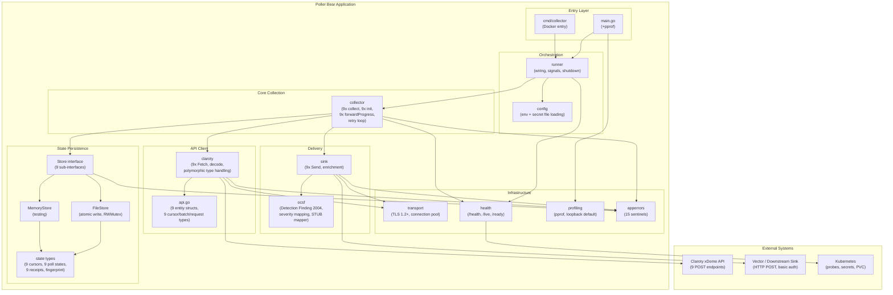

# Pass 8: Deep Synthesis -- poller-bear

> Definitive reference for downstream Prism specification work.
> Supersedes Pass 6 synthesis.
> Generated: 2026-04-14

---

## 1. Executive Summary

Poller Bear is a 14,133-line Go service (6,436 production + 7,697 test) that continuously polls the Claroty xDome REST API for nine security data sources -- alerts, OT activity events, audit logs, device-alert relations, device-vulnerability relations, servers, sites, devices, and vulnerabilities. It persists composite cursor state to a JSON file, enriches each record with xMP metadata and optional OCSF normalization, then forwards individual records over HTTP with basic auth to a downstream sink (typically Vector). The service runs as a single-replica Kubernetes deployment with a PVC for state persistence.

The codebase is clean, well-tested (76 behavioral contracts verified, 95% behavioral accuracy), and operationally sound -- but structurally repetitive. 73.7% of the largest file (`collector.go`, 1,367 lines) is nine near-identical copies of the same 12-step collect pattern. The domain model contains approximately 113 Go types, of which roughly 80% exist in sets of nine (one per data source). This repetition is the primary structural characteristic and the primary opportunity for improvement in Prism's Rust implementation.

The service was rewritten from a Python predecessor (preserved in `legacy/`) that only polled alerts. The Go rewrite expanded to nine data sources, replaced offset-based pagination with composite cursor-based pagination, added query fingerprinting for config drift detection, and introduced atomic state persistence with batch receipts.

---

## 2. Complete Feature Set

### 2.1 Data Collection (9 sources)

| # | Source | Endpoint | Pagination | Cursor Fields | Fields Requested |
|---|--------|----------|------------|---------------|-----------------|
| 1 | Alerts | `POST /api/v1/alerts/` | Timestamp+ID | `(UpdatedTime, AlertID)` | 20 |
| 2 | OT Activity Events | `POST /api/v1/ot_activity_events/` | Timestamp+ID | `(DetectionTime, EventID)` | 23 |
| 3 | Audit Logs | `POST /api/v1/audit_log/get` | Hybrid (Timestamp+ID+Offset) | `(Timestamp, AuditLogID, Offset)` | 7 |
| 4 | Device-Alert Relations | `POST /api/v1/device_alert_relations/` | Timestamp+2IDs | `(DetectedTime, AlertID, DeviceUID)` | 47 |
| 5 | Device-Vuln Relations | `POST /api/v1/device_vulnerability_relations/` | Timestamp+2IDs | `(DetectionTime, DeviceUID, VulnerabilityID)` | 30 |
| 6 | Servers | `POST /api/v1/servers/` | Offset+SortKey | `(Offset, ServerName)` | 16 |
| 7 | Sites | `POST /api/v1/sites/get` | Offset+SortKey | `(Offset, SiteID)` | 12 |
| 8 | Devices | `POST /api/v1/devices/` | Offset+SortKey | `(Offset, DeviceUID)` | 16 |
| 9 | Vulnerabilities | `POST /api/v1/vulnerabilities/` | Offset+SortKey | `(Offset, VulnerabilityID)` | 35 |

### 2.2 State Management

- **Atomic file persistence**: write-temp, fsync, rename pattern
- **Query fingerprinting**: SHA-256 of `sorted(fields) + "|" + limit`; mismatch is fatal
- **Batch receipts**: audit trail per source, bounded to 100 most recent
- **Forward progress enforcement**: 9 cursor comparators prevent infinite loops
- **Two store implementations**: FileStore (production), MemoryStore (testing)

### 2.3 Output / Sink

- **Per-record HTTP POST** to Vector with basic auth
- **EnrichedPayload envelope**: `{data, record_type, xmp, ocsf}`
- **xMP metadata injection**: site, cluster_name, node_name
- **OCSF normalization**: Types and severity pipeline implemented; mapper is a TODO stub (alerts only)
- **9 record type tags**: `alert`, `activity_event`, `audit_log`, `device_alert_relation`, `device_vulnerability_relation`, `server`, `site`, `device`, `vulnerability`

### 2.4 Operational

- **Health endpoints**: `/health`, `/live` (liveness), `/ready` (readiness)
- **Exponential backoff retry**: 2s base, 30s max, 5 max retries (configurable)
- **Graceful shutdown**: SIGTERM/SIGINT via context cancellation, 5s drain windows
- **Profiling**: Optional pprof server (root entry point only; absent in Docker image)
- **Structured logging**: charmbracelet/log with JSON formatter, configurable level

### 2.5 Security

- **Bearer token auth** to Claroty API; trimmed on construction
- **TLS 1.2 minimum** on all HTTP clients
- **Secret file pattern**: every credential has a `*_FILE` variant for K8s secret mounts
- **Runtime hardening**: distroless nonroot container, read-only root filesystem, no capabilities
- **pprof cmdline blocked**: prevents process argument exposure

### 2.6 Not Implemented / Stub

- OCSF mapper (returns nil; types and tests exist for future story 3-2.1)
- Rate limiting toward Claroty API
- HTTP 429 handling
- Credential rotation (requires pod restart)
- Metrics/tracing export (logs only)
- Sink batching (per-record POST only)
- Parallel collection (sequential 9-source loop)
- `make docs` / `make version` binary subcommands (CLAUDE.md references are stale)

---

## 3. Bounded Context Map



---

## 4. Behavioral Contract Summary

### 4.1 Contract Statistics

| Section | Contracts | HIGH Confidence | Coverage Gaps |
|---------|-----------|----------------|---------------|
| Collection (9 sources) | 25 | 25 | Server + Site collection untested |
| Forward Progress | 3 tested + 6 code-only | 3 | 6 sources lack dedicated tests |
| Orchestration (Run loop) | 4 | 4 (from code) | Retry loop untested |
| State Persistence | 10 | 10 | FileStore concurrent access untested |
| Sink Delivery | 15 | 15 | -- |
| Health | 7 | 7 | -- |
| Configuration | 3 | 3 | -- |
| OCSF | 10 | 10 | Panic recovery test skipped |
| Claroty Client | 11 | 11 | Empty token not validated |
| **Total** | **76+** | **76+** | **12 gaps** |

### 4.2 Critical Behavioral Invariants

1. **At-least-once delivery**: Cursor advances only after ALL records in batch delivered to sink. Mid-batch failure means full re-fetch.
2. **Fail-fast sequential collection**: `collectOnce()` calls 9 sources in fixed order; first error aborts remaining sources.
3. **Forward progress enforcement**: New cursor must be strictly greater than previous; prevents infinite re-fetch.
4. **Query fingerprint guard**: Config change (different fields or limit) is fatal; forces state file deletion.
5. **Atomic state persistence**: Write-temp-fsync-rename; partial writes cannot corrupt state.
6. **Health tracks collection status**: `/ready` returns 503 during errors and initialization.

### 4.3 Test Coverage Gaps (HIGH severity)

| Gap | Impact |
|-----|--------|
| Server collection path (0 tests) | Collection, sink delivery, state save behaviors unverified |
| Site collection path (0 tests) | Same as above |
| Run() retry loop (0 tests) | Exponential backoff, max retries, retry delay doubling unverified |
| 6 of 9 forward progress functions (0 tests) | Only DeviceAlertRelation, Vulnerability, Device have dedicated tests |
| initializeState fingerprint mismatch (0 tests) | Fatal error path unverified |

---

## 5. Architecture Decision Record

### ADR-1: Sequential Fail-Fast Collection

**Decision**: All 9 sources collected sequentially in `collectOnce()`; first error aborts all.
**Context**: Simplifies retry logic (retry entire cycle, not individual sources).
**Consequence**: One flaky source blocks all nine. No per-source circuit breaking.
**Status**: Active. Deliberate simplicity trade-off.

### ADR-2: At-Least-Once Delivery (No Batching)

**Decision**: Each record POSTed individually to sink. Cursor commits after full batch.
**Context**: Simplest correctness model; duplicates handled downstream.
**Consequence**: High HTTP overhead for large batches (100 records = 100 POSTs).
**Status**: Active.

### ADR-3: Dual Pagination Strategies

**Decision**: Timestamp+ID cursors for event-like sources; offset+sortkey for entity snapshots.
**Context**: Different data sources have different natural ordering.
**Consequence**: Two pagination code paths; forward progress logic differs per strategy.
**Status**: Active. Well-designed for the problem.

### ADR-4: Single-Replica Only

**Decision**: One pod, one PVC (ReadWriteOnce), no leader election.
**Context**: State file is a single JSON document; concurrent writers would corrupt.
**Consequence**: No horizontal scaling. Vertical scaling only (page size, interval).
**Status**: Active. Acceptable for current scale.

### ADR-5: Environment-Only Configuration

**Decision**: No config files, no CLI flags. Env vars with `*_FILE` secret file pattern.
**Context**: Kubernetes-native; secrets mount as files.
**Consequence**: Some values not configurable at all (client timeout, page sizes). Helm-config mismatch bug (4 env vars set but never read).
**Status**: Active with known bug.

### ADR-6: OCSF as Stub

**Decision**: OCSF types, severity pipeline, and golden file tests implemented; mapper is a TODO stub.
**Context**: Deferring to story 3-2.1; infrastructure is pre-built.
**Consequence**: `ocsf` key always absent from output. Panic recovery guard already in place.
**Status**: Pending implementation.

### ADR-7: Entry Point Duality

**Decision**: `main.go` (with pprof) for local development; `cmd/collector/main.go` (without pprof) for Docker.
**Context**: pprof is a development tool, not production.
**Consequence**: Docker images lack pprof capability. No way to enable pprof in production without code change.
**Status**: Active. Design inconsistency -- pprof could be gated by env var in both entry points.

---

## 6. Anti-Pattern Catalog

### AP-1: 9x Repetition (CRITICAL)

**Scope**: Entire codebase.
**Manifestation**: ~100 types and ~80 functions replicated 9 times with entity-specific field names. 73.7% of `collector.go` (1,008 of 1,367 lines) is copy-pasted code. Both `claroty` and `state` packages define parallel cursor type hierarchies with subtly different field names.
**Root cause**: Go lacks trait/generic-based abstraction over struct field differences. The team used one generic function (`trimReceipts[T any]`) but did not generalize the collect/init/forwardProgress patterns.
**Prism impact**: PRIMARY opportunity for Rust's trait system. A single generic `DataSource` trait with associated types could eliminate 80-90% of this repetition.

### AP-2: Helm-Config Mismatch (BUG)

**Scope**: `deploy/helm/deployment.yaml` vs `internal/config/config.go`.
**Manifestation**: Helm template injects `COLLECTOR_INTERVAL`, `COLLECTOR_RETRY_BASE_DELAY`, `COLLECTOR_RETRY_MAX_DELAY`, `COLLECTOR_MAX_RETRIES` as env vars, but `config.go` never reads them. Operators setting these values in Helm have no effect.
**Status**: Confirmed bug.

### AP-3: Dead Sentinel Error

**Scope**: `apperrors/errors.go`.
**Manifestation**: `ErrCursorRegression` is defined but never wrapped or checked with `errors.Is()`. All 9 forward progress functions use plain `fmt.Errorf`.
**Impact**: Minor. Likely intended for future use.

### AP-4: Cursor Type Duplication

**Scope**: `claroty/` and `state/` packages.
**Manifestation**: 9 cursor types defined twice with identical shapes but different Go types and subtly different field names (`UID` vs `DeviceUID`, `ID` vs `VulnerabilityID`). Requires explicit conversion between packages.
**Root cause**: Package isolation. No shared type alias.

### AP-5: AlertStore Naming Exception

**Scope**: `state/store.go`.
**Manifestation**: `AlertStore` interface uses `Load()`/`Save()` while all other 8 sub-interfaces use `Load<Entity>State()`/`Save<Entity>State()`. AlertStore was first; convention evolved but was never backported.

### AP-6: Five Env Var Prefix Schemes

**Scope**: `config.go`.
**Manifestation**: `CLAROTY_*`, `VECTOR_*`, `POLLER_BEAR_*`, `COLLECTOR_*`, `ENABLE_*` -- five different prefix conventions in one application.
**Impact**: Developer confusion. No single prefix identifies "this is a poller-bear config var."

### AP-7: Inconsistent Configurability

**Scope**: `config.go`.
**Manifestation**: Sink timeout configurable via env var; Claroty client timeout hardcoded at 30s; polling interval, retry delays, and page sizes only settable in `DefaultConfig()`.

---

## 7. Complexity Ranking

Ranked by structural complexity, behavioral density, and translation difficulty for Prism.

| Rank | Component | Lines | Types | Complexity Driver | Translation Difficulty |
|------|-----------|-------|-------|-------------------|----------------------|
| 1 | `collector.go` | 1,367 | 1 struct (25 fields) | 9x collect + 9x init + 9x forwardProgress + Run loop state machine | HIGH -- core generalization target |
| 2 | `http_client.go` | 1,836 | 9 interfaces | 9x Fetch + polymorphic decode + dual pagination strategies + filter construction | HIGH -- polymorphic JSON handling |
| 3 | `config.go` | 597 | 9 types | 9x per-source field/limit configs + secret file loading + validation | MEDIUM -- straightforward but large |
| 4 | `store.go` + `file_store.go` | 792 | 19+9+9+9+1 types | Composite Store interface + atomic persistence + generic trimReceipts | MEDIUM -- Rust traits map well here |
| 5 | `api.go` | 475 | 9 entities + 9 cursors + 9 batches + 9 requests | Domain type definitions; DeviceAlertRelation alone has 47 fields | MEDIUM -- type translation |
| 6 | `http_sender.go` | 251 | 3 types | 9x Send + enrichment + OCSF stub + panic recovery | LOW-MEDIUM |
| 7 | `runner.go` | 150 | 0 | Orchestration, wiring, graceful shutdown | LOW |
| 8 | `transport/http.go` | 145 | 2 types | TLS config, connection pooling | LOW |
| 9 | `health/server.go` | 72 | 1 type | Liveness/readiness probes | LOW |
| 10 | `ocsf/` (3 files) | 203 | 11 types | Severity mapping, golden file tests, Detection Finding 2004 | LOW (stub) |

---

## 8. Convergence Report

### 8.1 Rounds Per Pass

| Pass | Broad | Deep R1 | Deep R2 | Deep R3 | Total Rounds | Final Novelty |
|------|-------|---------|---------|---------|-------------|---------------|
| 0: Inventory | 1 | 1 (SUBSTANTIVE) | 1 (NITPICK) | -- | 3 | NITPICK |
| 1: Architecture | 1 | 1 (SUBSTANTIVE) | 1 (SUBSTANTIVE) | 1 (NITPICK) | 4 | NITPICK |
| 2: Domain Model | 1 | 1 (SUBSTANTIVE) | 1 (NITPICK) | -- | 3 | NITPICK |
| 3: Behavioral Contracts | 1 | 1 (SUBSTANTIVE) | 1 (NITPICK) | -- | 3 | NITPICK |
| 4: NFR Catalog | 1 | 1 (SUBSTANTIVE) | 1 (SUBSTANTIVE) | 1 (NITPICK) | 4 | NITPICK |
| 5: Conventions | 1 | 1 (SUBSTANTIVE) | 1 (SUBSTANTIVE) | 1 (NITPICK) | 4 | NITPICK |
| Coverage Audit | -- | 1 | -- | -- | 1 | PASS |
| Extraction Validation | -- | 1 | -- | -- | 1 | TRUST WITH CAVEATS |

### 8.2 Accuracy Metrics

- **Behavioral accuracy**: 95% (20/21 sampled contracts confirmed; 1 self-flagged inaccuracy)
- **File count accuracy**: 100% (37 Go files confirmed)
- **Individual file LOC accuracy**: Systematic off-by-1 in ~65% of files (measurement artifact, not fabrication)
- **Aggregate LOC accuracy**: Corrected from initial ~8,200 to verified **14,133** (37% undercount for production, 120% undercount for tests)
- **Zero hallucinated behavioral contracts** across 20 sampled items

### 8.3 Coverage

- 100% of Go source packages covered
- 100% of Go test files covered
- 100% of legacy Python analyzed
- 100% of infrastructure (Dockerfile, Helm, CI) analyzed
- 100% of blind spots resolved (11 identified, 11 resolved)

---

## 9. Lessons for Prism

### P0: Must Implement (behavioral fidelity)

These are non-negotiable behavioral contracts that Prism must replicate exactly to maintain correctness with the Claroty xDome API.

| ID | Lesson | Evidence |
|----|--------|----------|
| P0-1 | **All Claroty endpoints use POST** (even for read-only queries). Request body is JSON with `offset`, `limit`, `fields`, `sort_by`, `filter_by`. | All 9 endpoints confirmed POST in `http_client.go` |
| P0-2 | **Bearer token authentication** with `Authorization: Bearer <token>` header on every request. Token must be trimmed of whitespace/newlines. | BC-8.01.004, `http_client.go` |
| P0-3 | **Composite cursor pagination** for 5 timestamp-based sources uses OR filter logic: `(timestamp > cursor.ts) OR (timestamp == cursor.ts AND id > cursor.id)`. Device relations use 3-tuple cursors. | Pagination section 4 of broad sweep; BC-1.01.001 through BC-1.05.001 |
| P0-4 | **Forward progress enforcement**: new cursor must be strictly greater than previous on primary key (timestamp/offset), then secondary (ID). Prevents infinite re-fetch loops. | 9 `ensure*ForwardProgress` functions; BC-1.10.001 through BC-1.10.003 |
| P0-5 | **Atomic state persistence**: cursor commits only after ALL records in batch are delivered. Mid-batch failure means no cursor advance. At-least-once semantics. | BC-1.01.001, BC-1.01.003, BC-2.03.001 |
| P0-6 | **Query fingerprint drift detection**: hash of `sorted(fields) + limit`; mismatch between stored and current config is fatal. Prevents stale cursor use after config change. | BC-2.02.001 through BC-2.02.006 |
| P0-7 | **Polymorphic ID handling**: Claroty API returns IDs as string OR number for the same field. Must handle both: try string parse first, fall back to number-to-string. Affects: `alert.id`, `audit_log.id`, `event_id`, `related_alert_ids[]`. | BC-8.03.001, BC-8.03.004, BC-8.03.005 |
| P0-8 | **Polymorphic numeric fields**: `dest_port`, `source_port`, CVSS scores, EPSS scores can be null/string/number. Must use flexible parsing (null -> 0.0, number -> parse, string -> error or parse). | BC-8.02.001, BC-8.02.002, `parseClarotyFloat` |
| P0-9 | **AuditLog cursor offset is `batch.Last.Offset + 1`** (unique among all 9 sources). All other sources use `batch.Last.*` directly. | BC-1.03.001, collector.go |
| P0-10 | **Vulnerability hardcoded filter**: `affected_devices_count > 0` is always applied, non-overridable. | BC-010, `http_client.go` |
| P0-11 | **API response JSON keys are inconsistent with endpoint paths**: `device_alert_relations` endpoint returns `devices_alerts`, `device_vulnerability_relations` returns `devices_vulnerabilities`. The 9 response keys must be exactly matched. | Section 3.5 of broad sweep |
| P0-12 | **EnrichedPayload envelope**: every record wrapped in `{data, record_type, xmp, ocsf}` before sink delivery. 9 distinct `record_type` strings. | BC-3.03.001 through BC-3.03.005 |

### P1: Should Implement (operational correctness)

Behaviors that matter for production operation but where Prism has latitude in implementation approach.

| ID | Lesson | Evidence |
|----|--------|----------|
| P1-1 | **Exponential backoff retry**: base 2s, max 30s, multiplier 2x, configurable max retries. Reset on success. Context-aware sleep. | BC-1.20.002, NFR-2.1 |
| P1-2 | **Health readiness tracks collection status**: not-ready during init and errors, ready after successful cycle. Liveness separate from readiness. | BC-4.01.001 through BC-4.03.002 |
| P1-3 | **Secret file pattern**: every credential supports `*_FILE` env var for K8s secret mounts. File takes precedence over direct env var. | NFR-1.2, BC-5.01.002 |
| P1-4 | **Graceful shutdown**: SIGTERM/SIGINT -> context cancellation -> drain in-flight requests -> health server shutdown with timeout. | NFR-2.5, BC-005 |
| P1-5 | **Batch receipts**: audit trail per source recording version, count, first/last IDs, fetch timestamp, cursor applied. Bounded to N most recent. | NFR-4.4 |
| P1-6 | **TLS 1.2 minimum** on all HTTP clients. Connection pooling with reasonable defaults (100 idle, 10 per host). HTTP/2 enabled. | NFR-1.1, NFR-3.1, BC-7.01.002 |
| P1-7 | **Sink validation at construction**: empty endpoint -> error, missing credentials -> error, whitespace trimmed. Default timeout 15s. | BC-3.01.001 through BC-3.01.004 |
| P1-8 | **Client validation at construction**: empty base URL -> error, invalid URL -> error, timeout=0 defaults to 30s, token trimmed. | BC-8.01.001 through BC-8.01.004 |

### P2: Should Improve (design improvements over poller-bear)

Design decisions in poller-bear that Prism should do differently.

| ID | Lesson | What Prism Should Do Instead |
|----|--------|------------------------------|
| P2-1 | **9x repetition anti-pattern**: 73.7% of collector.go is copy-paste. ~100 types exist in sets of 9. | Use Rust trait with associated types: `trait DataSource { type Entity; type Cursor; type PollState; type Receipt; ... }`. Single generic `collect<S: DataSource>()` replaces 9 functions. |
| P2-2 | **Sequential fail-fast**: one flaky source blocks all nine. No per-source isolation. | Consider per-source error handling with optional circuit breaker. At minimum, log and continue on non-fatal source errors rather than aborting all. |
| P2-3 | **Per-record HTTP POST**: 100 records = 100 HTTP requests to sink. No batching. | Implement batch delivery (e.g., NDJSON POST or array POST) for sink efficiency. |
| P2-4 | **No metrics/tracing**: logs only, no Prometheus/OpenTelemetry. | Build with OpenTelemetry from day one. Export metrics for: records_collected, records_delivered, collection_duration, retry_count, cursor_position per source. |
| P2-5 | **No rate limiting toward Claroty API**: relies on page size + interval. No 429 handling. | Implement adaptive rate limiting with 429/Retry-After support. |
| P2-6 | **Hardcoded configurability gaps**: client timeout (30s), page sizes (100), polling interval (30s) not configurable via env vars. Helm-config mismatch bug. | Make all operational parameters configurable. Validate Helm templates against config struct at CI time. |
| P2-7 | **Cursor type duplication**: identical cursor shapes in `claroty` and `state` packages with different Go types and field names. | Use a single set of cursor types shared between API client and state store. |
| P2-8 | **No credential rotation**: token read once at startup; requires pod restart. | Watch secret files for changes; reload on modification. |
| P2-9 | **No circuit breaker**: continuous retry against down APIs. | Implement per-source circuit breaker with half-open state for recovery detection. |
| P2-10 | **OCSF mapper is a stub**: types exist but mapper returns nil. | Decide upfront whether OCSF mapping lives in Prism or downstream. If in Prism, implement alongside the data source, not as a deferred stub. |
| P2-11 | **Docker image lacks pprof**: entry point duality means Docker builds skip pprof init. | Gate pprof by env var in a single entry point, so it is available in all deployment modes. |
| P2-12 | **Dead sentinel error**: `ErrCursorRegression` defined but never used. Forward progress errors are plain `fmt.Errorf`. | Use typed errors consistently. If defining error variants, wire them up. |
| P2-13 | **Five env var prefix schemes**: `CLAROTY_*`, `VECTOR_*`, `POLLER_BEAR_*`, `COLLECTOR_*`, `ENABLE_*`. | Use a single consistent prefix scheme (e.g., `PRISM_CLAROTY_*`, `PRISM_SINK_*`). |

### P3: Reference Only (interesting but not actionable)

Observations from poller-bear that are informational for Prism development but do not directly translate to requirements.

| ID | Observation |
|----|-------------|
| P3-1 | **Legacy Python only polled alerts**. The Go rewrite expanded to 9 sources. Prism will inherit all 9 from the Go version. |
| P3-2 | **Legacy used descending sort** (newest first, stop when `updated_ts <= last_poll_ts`). Go uses ascending sort with cursor-based forward progress. Go's approach is more robust. |
| P3-3 | **Legacy used threading** (producer-consumer with queue). Go is fully sequential. Neither approach is optimal; Rust's async runtime (tokio) provides a better concurrency model. |
| P3-4 | **Test suite is 120% of production code** (7,697 test LOC vs 6,436 production). Strong test culture; Prism should match or exceed this ratio. |
| P3-5 | **Golden file testing for OCSF**: input/expected JSON pairs in `testdata/`. Good pattern for schema validation testing in Prism. |
| P3-6 | **Fakes preferred over mocks** for core integration tests (collector). Mocks available via mockgen for unit tests (sink, state). Dual strategy works well. |
| P3-7 | **Benchmark tests** exist for hot paths (parsing, serialization, state persistence). Good practice for Prism to adopt for its equivalent hot paths. |
| P3-8 | **`trimReceipts[T any]`** is the only generic function in the entire codebase, demonstrating the team was aware of generics but chose not to generalize further. |
| P3-9 | **Batch receipt audit trail** enables post-hoc reconciliation. Useful pattern for debugging data pipeline issues. |
| P3-10 | **Non-standard API paths**: audit logs use `/audit_log/get`, sites use `/sites/get` (with `/get` suffix). Must be handled per-endpoint, not derived from entity name. |

---

## Appendix A: Domain Type Taxonomy (113 types)

| Category | Count | Key Examples |
|----------|-------|-------------|
| Data entities | 9 | Alert (20 fields), DeviceAlertRelation (47 fields), Vulnerability (34 fields) |
| Value objects | 5 | QueryFingerprint, EnrichedPayload, XMPMetadata |
| Claroty cursors | 9 | AlertCursor, EventsCursor, DeviceAlertRelationsCursor |
| State cursors | 9 | AlertCursor, EventCursor (subtly different field names) |
| Request types | 9 | AlertsRequest, VulnerabilitiesRequest |
| Batch types | 9 | AlertsBatch, DevicesBatch |
| Poll state types | 9 | AlertPollState, VulnerabilityPollState |
| Receipt types | 9 | AlertBatchReceipt, DeviceBatchReceipt |
| OCSF types | 11 | DetectionFinding, FindingInfo, Attack, Observable |
| Config types | 9 | Config, ClarotyConfig, SinkConfig, OCSFConfig |
| Infrastructure | 7 | Collector, HTTPClient, HTTPSender, FileStore |
| Internal API helpers | 3 | sortClause, filterClause, compoundFilter |
| Sentinel errors | 15 | ErrStateNotFound, ErrClarotyDecode, ErrSinkDelivery |

## Appendix B: Key Configuration Defaults

| Parameter | Default | Configurable? |
|-----------|---------|---------------|
| Polling interval | 30s | NO (Helm sets env var but config.go ignores it) |
| Page size (all sources) | 100 | NO |
| Claroty client timeout | 30s | NO |
| Sink timeout | 15s | YES (`VECTOR_TIMEOUT_SECONDS`) |
| Retry base delay | 2s | NO (same Helm bug) |
| Retry max delay | 30s | NO (same Helm bug) |
| Max retries | 5 | NO (same Helm bug) |
| Health port | :7321 | YES (`COLLECTOR_HEALTH_ADDR`) |
| State file path | `/var/lib/poller-bear/state.json` | YES (`STATE_STORE_PATH`) |
| Max receipts per source | 100 | YES (`STATE_STORE_MAX_RECEIPTS`) |
| OCSF enabled | false | YES (`OCSF_ENABLED`) |
| pprof enabled | false | YES (`ENABLE_PPROF`) |
| pprof address | localhost:3030 | YES (`PPROF_ADDR`) |

## Appendix C: File Manifest (Verified)

**Production Go**: 20 files, 6,436 lines
**Test Go**: 17 files, 7,697 lines
**Total Go**: 37 files, 14,133 lines

Top 5 files by size:
1. `claroty/http_client.go` -- 1,836 lines
2. `collector/collector.go` -- 1,367 lines
3. `config/config.go` -- 597 lines
4. `claroty/api.go` -- 475 lines
5. `state/file_store.go` -- 431 lines

---

## State Checkpoint

```yaml
pass: 8
type: deep-synthesis
status: complete
total_passes_analyzed: 6 broad + 19 deep rounds + 2 validation rounds
total_contracts: 76+
total_nfr_items: 39
total_convention_items: ~40
coverage: 100% packages, 100% blind spots resolved
accuracy: 95% behavioral, corrected LOC
timestamp: 2026-04-14T01:30:00Z
verdict: READY FOR SPECIFICATION
```
