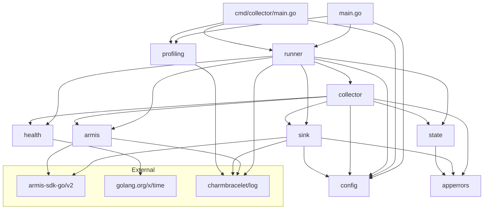

# Pass 0 Deep: Inventory -- Round 1

**Project:** poller-coaster
**Date:** 2026-04-13
**Basis:** Full file tree enumeration, all Go source files, CI/CD workflows, Helm chart, config/infra files, cross-referenced with broad sweep and Phase A outputs

---

## Tech Stack (verified and refined)

| Component | Value | Source |
|-----------|-------|--------|
| Language | Go 1.25.7 | go.mod line 3, .go-version |
| Framework | None (stdlib + charmbracelet/log) | go.mod |
| Build system | go build, Make, Docker multi-stage | Makefile, Dockerfile |
| Test framework | stdlib testing (go test -race -coverprofile) | go-test.yml |
| Test runner CI | go test -v -race -coverprofile=coverage.out ./... | go-test.yml:49 |
| Coverage threshold | 70% (warning, not blocking) | go-test.yml:57 |
| Linter | golangci-lint v2.5.0 via .golangci.yml | go-test.yml:42, .golangci.yml |
| Formatter | gofumpt (via golangci-lint formatters + pre-commit) | .golangci.yml:69, .pre-commit-config.yaml:7 |
| Container base | gcr.io/distroless/static-debian12:nonroot | Dockerfile:32 |
| Container registry | docker.cloudsmith.io/1898-and-co/poller-coaster | values.yaml:2 |
| Helm chart | v0.16.0, appVersion 0.16.0 | Chart.yaml |
| Dep management | Renovate (renovate.json) | renovate.json |
| Pre-commit | go-fumpt, go-build-mod, go-mod-tidy, trailing-whitespace, end-of-file-fixer, check-added-large-files | .pre-commit-config.yaml |
| PR Agent | CodiumAI/pr-agent via ECR, model: claude-sonnet-4.6 | pr-agent.yaml |
| Security scanning | gosec, govulncheck, staticcheck (daily cron + PR/push) | security-scan.yml |
| Python version | 3.12 (for CI tooling: Cloudsmith CLI, chart-testing) | .python-version |
| Local dev tools | go, gofumpt, vector (via Brewfile) | Brewfile |
| Claude rules | Git submodule: 1898andco-claude-rules | .gitmodules |

### Key Dependencies (from go.mod, verified)

| Dependency | Version | Purpose |
|------------|---------|---------|
| github.com/1898andCo/armis-sdk-go/v2 | v2.0.1 | Armis Centrix API client |
| github.com/charmbracelet/log | v0.4.2 | Structured logging (JSON formatter) |
| golang.org/x/time | v0.14.0 | Rate limiting (health server) |
| github.com/stretchr/testify | v1.11.1 (indirect) | Test assertions -- listed as indirect, usage TBD |

### Tool Dependencies (from tools/go.mod, verified)

| Tool | Purpose |
|------|---------|
| github.com/golangci/golangci-lint/v2 | Linting |
| golang.org/x/vuln/cmd/govulncheck | Vulnerability checking |

---

## File Manifest (complete, verified)

### Go Source Files

| Path | Type | Priority | Purpose |
|------|------|----------|---------|
| main.go | Entry point | HIGHEST | Root entrypoint, dry-run flag, pprof startup, calls runner.Execute |
| cmd/collector/main.go | Entry point | HIGHEST | Identical to main.go (alternative entrypoint for Docker) |
| internal/app/runner/runner.go | Orchestration | HIGH | Wires config, store, armis client, sink, health, collector |
| internal/config/config.go | Config | HIGH | DefaultConfig, LoadFromEnvironment, Validate, env var parsing |
| internal/config/utils.go | Config | MEDIUM | ValidateConfig (dry-run), redactSecret |
| internal/collector/collector.go | Core domain | HIGH | Collector struct, New(), Run(), collectOnce(), initializeState() |
| internal/collector/alert_collector.go | Core domain | HIGH | AlertCollector.Collect() |
| internal/collector/activity_collector.go | Core domain | HIGH | ActivityCollector.Collect() |
| internal/collector/audit_collector.go | Core domain | HIGH | AuditLogCollector.Collect() |
| internal/collector/risk_factor_collector.go | Core domain | HIGH | RiskFactorCollector.Collect() |
| internal/collector/connection_collector.go | Core domain | HIGH | ConnectionCollector.Collect() |
| internal/collector/device_collector.go | Core domain | HIGH | DeviceCollector.Collect() |
| internal/collector/vulnerability_collector.go | Core domain | HIGH | VulnerabilityCollector.Collect() |
| internal/armis/api.go | API client | HIGH | Armis SDK wrapper, NewHTTPClient, GetSearch |
| internal/sink/sink.go | Delivery | HIGH | Sender interface definition (7 methods) |
| internal/sink/http_sender.go | Delivery | HIGH | HTTPSender, EnrichedPayload, XMPMetadata, per-type Send methods |
| internal/state/store.go | Persistence | HIGH | Store interface (composite), PollState/Cursor/Receipt types, QueryFingerprint, MemoryStore |
| internal/state/file_store.go | Persistence | HIGH | FileStore, atomic write, receipt trimming |
| internal/health/server.go | Health | MEDIUM | HTTP health/readiness/liveness, rate limiting |
| internal/profiling/pprof.go | Observability | LOW | Opt-in pprof server |
| internal/apperrors/errors.go | Error defs | MEDIUM | 14 sentinel errors |
| tools/tools.go | Build tooling | SKIP | Go build tag `tools`, pins golangci-lint + govulncheck |

### Go Test Files

| Path | Tests | Coverage Area |
|------|-------|---------------|
| internal/collector/collector_test.go | 4 | Retry exhaustion, reset, unlimited, attempt count |
| internal/collector/device_collector_test.go | 9 | Device collector: all patterns |
| internal/collector/connection_collector_test.go | 10 | Connection collector: all patterns + EndTimestamp fallback |
| internal/collector/vulnerability_collector_test.go | 10 | Vulnerability collector: all patterns + 3-level timestamp fallback |
| internal/collector/audit_collector_test.go | 10 | Audit collector: all patterns + sorting + invalid timestamp |
| internal/collector/risk_factor_collector_test.go | 12 | Risk factor: all patterns + FirstSeen fallback + Title ID fallback |
| internal/state/file_store_test.go | 12 | FileStore: CRUD, atomic write, restart survival, receipt trim |
| internal/state/store_test.go | table-driven | trimReceipts generic function |
| internal/config/config_test.go | 30+ | Defaults, env vars, file secrets, validation rules |
| internal/health/server_test.go | 11 | Health endpoints, rate limiting, per-IP isolation |
| internal/profiling/pprof_test.go | 8 | Enable/disable, bind failure, cmdline blocked, shutdown |

### Non-Go Files

| Path | Type | Purpose |
|------|------|---------|
| go.mod / go.sum | Dep management | Module definition and checksums |
| tools/go.mod / tools/go.sum | Tool dep management | Pinned tool versions |
| Makefile | Build | 13 targets: help, build, test, lint, fmt, vuln, run, vector, etc. |
| Dockerfile | Container | Multi-stage: golang:1.25.7-bookworm build, distroless:nonroot runtime |
| .golangci.yml | Lint config | 13 linters enabled, hugeParam disabled, gosec/errcheck excluded from tests |
| .editorconfig | Editor config | Tabs for Makefile, spaces for .md and .tf |
| .pre-commit-config.yaml | Pre-commit | go-fumpt, go-build-mod, go-mod-tidy, trailing-whitespace, EOF fixer |
| renovate.json | Dep updates | Grouped updates, automerge for GH Actions + pre-commit, gomod post-tidy |
| vector.yaml | Local sink | Vector config: http_server on :4413, console sink for debugging |
| scripts/setup.sh | Dev setup | Sets VECTOR_USERNAME/PASSWORD/ENDPOINT for local dev |
| scripts/pprof-harness.sh | Profiling | Collects CPU, heap, goroutine, allocs, block, mutex profiles |
| .go-version | Version pin | 1.25.7 |
| .python-version | Version pin | 3.12 (CI tooling) |
| Brewfile | Local deps | go, gofumpt, vector |
| .gitmodules | Submodules | .claude/shared-rules -> 1898andco-claude-rules |
| .gitignore | Git | Standard Go ignores |
| .dockerignore | Docker | Excludes .git, docs, scripts, etc. |

### CI/CD Workflows (7 total)

| Workflow | Trigger | Jobs |
|----------|---------|------|
| build.yml | push main, PR (Go/Docker paths), release | Build Docker -> save artifact -> push to Cloudsmith (main only) |
| go-test.yml | push main, PR (Go paths) | golangci-lint -> go test -race -coverprofile -> 70% threshold check |
| helm-release.yml | push main (helm paths) | Helm lint -> package -> push to Cloudsmith |
| lint-test.yml | PR (helm paths) | chart-testing: lint + kind cluster install |
| security-scan.yml | push main, PR, daily cron 06:00 UTC | gosec, govulncheck, staticcheck (parallel) -> summary |
| pr-agent.yaml | PR opened/reopened, issue comments | CodiumAI PR Agent via ECR (claude-sonnet-4.6) |
| validate-codeowners.yml | PR | Validates CODEOWNERS syntax |

### Helm Chart Templates (7 files)

| Template | K8s Resource | Notes |
|----------|-------------|-------|
| _helpers.tpl | (helpers) | name, fullname, labels, selectorLabels, serviceAccountName, namespace |
| deployment.yaml | Deployment | Single replica, env vars from values, PVC mount, probes (disabled by default) |
| pvc.yaml | PersistentVolumeClaim | 100Mi RWO, conditional on persistence.enabled |
| rbac.yaml | Role + RoleBinding | get/list configmaps+secrets, watch secrets |
| secret.yaml | Secret | Armis API key (conditional, from apiKeySecretName + apiKey) |
| service.yaml | Service | ClusterIP on port 7322 |
| serviceaccount.yaml | ServiceAccount | automount: true by default |

---

## Dependency Graph (verified from imports)



---

## Entry Points (verified)

1. **main.go** -- root entrypoint, supports `--dry-run` flag for config validation, starts pprof server before runner
2. **cmd/collector/main.go** -- identical copy, used as Docker ENTRYPOINT target (`/app/collector`)

Both share the same flow: parse flags -> optionally dry-run -> start pprof -> call runner.Execute -> exit

**New finding vs broad sweep:** Both entrypoints support a `--dry-run` flag that validates config and exits. This was not mentioned in the broad sweep. The dry-run calls `config.ValidateConfig()` which prints redacted config to stdout.

---

## Corrections from Broad Sweep

1. **LOC estimate "~5,500"** -- cannot verify exact count due to sandbox limitations, but file count is 33 Go files (22 source + 11 test), not "~32" as stated
2. **"13 test files"** -- actually 11 test files (verified by file tree enumeration)
3. **Entry points description** -- broad sweep said "two entrypoints" but missed the `--dry-run` flag functionality present in both
4. **Sentinel error count** -- broad sweep listed 10 sentinel errors; actual count is 14 (added: ErrArmisConfigMissing, ErrArmisUnexpectedStatus, ErrArmisDecode, ErrConfigLoad)
5. **testify dependency** -- listed as indirect in go.mod, broad sweep did not mention it; its actual usage in tests needs verification

---

## Delta Summary

- New items added: 7 CI/CD workflows fully documented, 7 Helm templates cataloged, tool dependencies (tools/go.mod), Brewfile/pre-commit/editorconfig/renovate configs, --dry-run feature, 4 previously unlisted sentinel errors
- Existing items refined: File count corrected (33 Go files not ~32), test file count corrected (11 not 13), entry point description enhanced with dry-run
- Remaining gaps: Exact LOC counts not obtainable due to sandbox, stretchr/testify actual usage in test files not confirmed

## Novelty Assessment

Novelty: SUBSTANTIVE

This round adds the complete CI/CD pipeline (7 workflows with specific triggers and job structures), the full Helm chart template inventory, the --dry-run feature, 4 missing sentinel errors, the tool dependency chain, and the development infrastructure (Renovate config, pre-commit hooks, Brewfile, PR Agent). These change how you would spec the system's operational envelope and deployment model.

## Convergence Declaration

Another round needed -- should audit: (1) whether stretchr/testify is actually used in test files or truly just transitive, (2) exact LOC verification if possible, (3) any remaining files not accounted for in manifest.

## State Checkpoint

```yaml
pass: 0
round: 1
status: complete
files_scanned: 48 (all non-.git files)
timestamp: 2026-04-13T00:00:00Z
novelty: SUBSTANTIVE
next_action: round 2 -- verify testify usage, audit completeness, hallucination check
```
