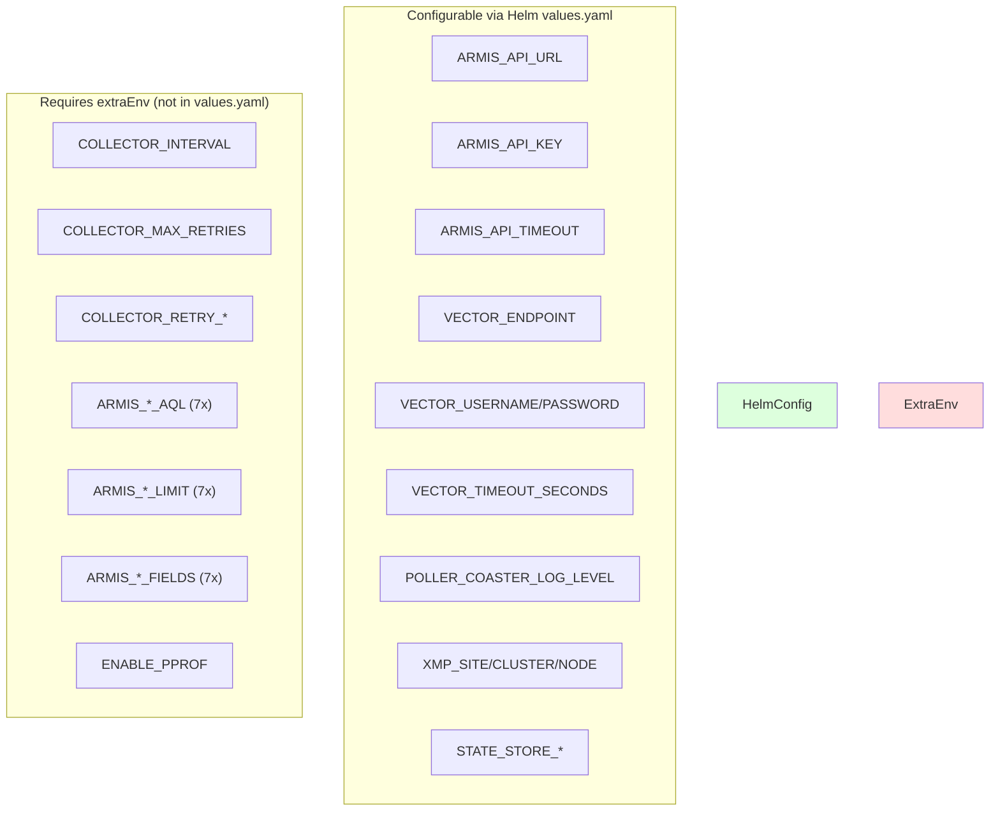

# Pass 1 Deep: Architecture -- Round 2

**Project:** poller-coaster
**Date:** 2026-04-13
**Basis:** Round 1 outputs + hallucination audit + Helm env var gap analysis + shutdown sequence verification

---

## Hallucination Audit from Round 1

### Verified Claims (no corrections needed)

1. **Layer dependency direction** -- VERIFIED: no upward imports. collector imports from armis/sink/state/health via interfaces only.
2. **Probes disabled by default** -- VERIFIED: values.yaml lines 106-107 and 118-119 both have `enabled: false`.
3. **RBAC watch on secrets** -- VERIFIED: rbac.yaml line 21 grants `watch` on secrets. No Go code implements secret watching.
4. **Docker builds cmd/collector** -- VERIFIED: Dockerfile:27 `go build ... -o /out/collector ./cmd/collector`.
5. **Runner creates logger after config** -- VERIFIED: runner.go:29 creates logger, then lines 32-42 load config. Logger is set to configured level only after line 49.
6. **5s shutdown timeout** -- VERIFIED: runner.go:111 `context.WithTimeout(context.Background(), 5*time.Second)`.

### Corrections

1. **"sink package imports config.XMPConfig and config.SinkConfig directly"** -- VERIFIED from http_sender.go:19 import of config package. This is accurate.

2. **Health test count** -- R1 said "11 tests" in health. Actual: 12. Corrected in Pass 0 R2.

---

## New Findings

### 1. Helm Chart Env Var Coverage Gap (cross-referenced with config.go)

The deployment.yaml only exposes a subset of configurable env vars. Complete mapping:

| Env Var | In Helm deployment.yaml? | In values.yaml? |
|---------|------------------------|-----------------|
| ARMIS_API_URL | YES | YES (armis.baseURL) |
| ARMIS_API_KEY | YES (multiple paths) | YES (armis.apiKey + secret refs) |
| ARMIS_API_TIMEOUT | YES | YES (armis.timeout) |
| VECTOR_ENDPOINT | YES | YES (sink.endpoint) |
| VECTOR_USERNAME | YES (multiple paths) | YES (sink.credentials.*) |
| VECTOR_PASSWORD | YES (multiple paths) | YES (sink.credentials.*) |
| VECTOR_TIMEOUT_SECONDS | YES | YES (sink.timeout) |
| POLLER_COASTER_LOG_LEVEL | YES | YES (logging.level) |
| XMP_SITE | YES (conditional) | YES (xmp.site) |
| XMP_CLUSTER_NAME | YES (conditional) | YES (xmp.clusterName) |
| XMP_NODE_NAME | YES (conditional) | YES (xmp.nodeName) |
| STATE_STORE_TYPE | YES (hardcoded "file") | Implicit (persistence.enabled) |
| STATE_STORE_PATH | YES | YES (persistence.mountPath + /state.json) |
| STATE_STORE_MAX_RECEIPTS | YES | YES (persistence.maxReceipts) |
| COLLECTOR_INTERVAL | NO | NO |
| COLLECTOR_MAX_RETRIES | NO | NO |
| COLLECTOR_RETRY_BASE_DELAY | NO | NO |
| COLLECTOR_RETRY_MAX_DELAY | NO | NO |
| COLLECTOR_HEALTH_ADDR | NO | Implicit (collector.containerPort) |
| ARMIS_ALERT_AQL | NO | NO |
| ARMIS_ALERT_LIMIT | NO | NO |
| (5 more AQL/LIMIT/FIELDS pairs) | NO | NO |
| ENABLE_PPROF | NO | NO |
| PPROF_ADDR | NO | NO |

**Impact:** 16+ env vars are NOT configurable via values.yaml. Operators must use `extraEnv` for collector tuning, AQL customization, and retry behavior. This is a deployment ergonomics gap.

### 2. Health Address Configuration Path

The health server address is configured via `COLLECTOR_HEALTH_ADDR` env var (default `:7322`), but the Helm chart hardcodes `containerPort: 7322` in values.yaml. If someone overrides the health addr via extraEnv, the containerPort/Service would no longer match. The Helm chart does NOT set COLLECTOR_HEALTH_ADDR -- it relies on the default matching the hardcoded port.

### 3. Shutdown Sequence Race Analysis

Examining runner.go:100-127 for potential races:

```
healthErrCh <- healthServer.ListenAndServe()  // goroutine, blocks until server stops
...
c.Run(ctx)                                      // blocks until collector stops
_ = healthServer.Shutdown(...)                  // stops health server
...
select { case err := <-healthErrCh: ... }       // drain
```

**Safe:** The health server goroutine runs independently. ListenAndServe returns after Shutdown is called. The channel buffer size is 1, so the goroutine never blocks on send. The non-blocking select at line 118 is safe because at this point Shutdown has been called and ListenAndServe should have returned.

**Edge case:** If ListenAndServe fails immediately (port in use), the error sits in healthErrCh while Run() executes. The error is only checked after Run returns. This means a health server bind failure does NOT stop the collector -- it runs without health endpoints. This is arguably correct (the collector can still function) but could surprise operators.

### 4. Configuration Struct as Dependency Bridge

The `config.Config` struct crosses architectural boundaries: it is created in runner, passed to collector.New, and the collector distributes sub-configs to sub-collectors. The config struct acts as a dependency bridge, carrying armis-specific, collector-specific, sink-specific, and state-specific concerns in a single aggregate. In a clean architecture, each component would receive only its relevant sub-config.

However, `collector.New` does receive the full Config because it needs: ArmisConfig (for AQL queries and limits), CollectorConfig (for interval, retries), and indirectly accesses field lists for fingerprinting. This is a pragmatic choice that avoids excessive parameter plumbing.

### 5. No Integration/E2E Test Infrastructure

The project has no integration test infrastructure:
- No docker-compose for running with a real/mock Armis API
- No test fixtures for end-to-end flows
- Helm chart testing (lint-test.yml) does install into a kind cluster but with a test API key that cannot actually connect
- The `make run` target assumes live Armis credentials

---

## Refined Architecture Diagram (with operational gaps highlighted)



---

## Delta Summary

- New items added: Complete Helm env var coverage gap analysis (16+ missing vars), health address configuration path analysis, shutdown race analysis (safe with edge case), config struct as dependency bridge observation, integration test infrastructure gap
- Existing items refined: All Round 1 claims verified, health test count corrected
- Remaining gaps: None that would change the architectural model

## Novelty Assessment

Novelty: NITPICK

Round 2 findings are refinements: the Helm env var gap is informative but the extraEnv escape hatch exists and is documented. The shutdown sequence analysis confirms safety. The health bind failure edge case is a minor operational concern. The config-as-bridge and integration test gap observations are accurate but do not change the architectural model. None of these would change how you would spec the system.

## Convergence Declaration

Pass 1 has converged -- findings are nitpicks, not gaps. The architecture is fully documented: components, layers, deployment topology, cross-cutting concerns, lifecycle, and shutdown behavior are all verified and complete.

## State Checkpoint

```yaml
pass: 1
round: 2
status: complete
files_scanned: 48
timestamp: 2026-04-13T00:00:00Z
novelty: NITPICK
convergence: converged
```
