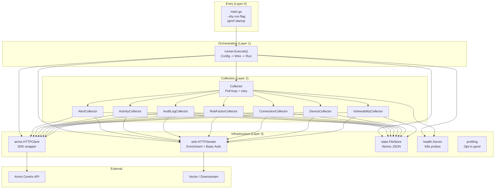
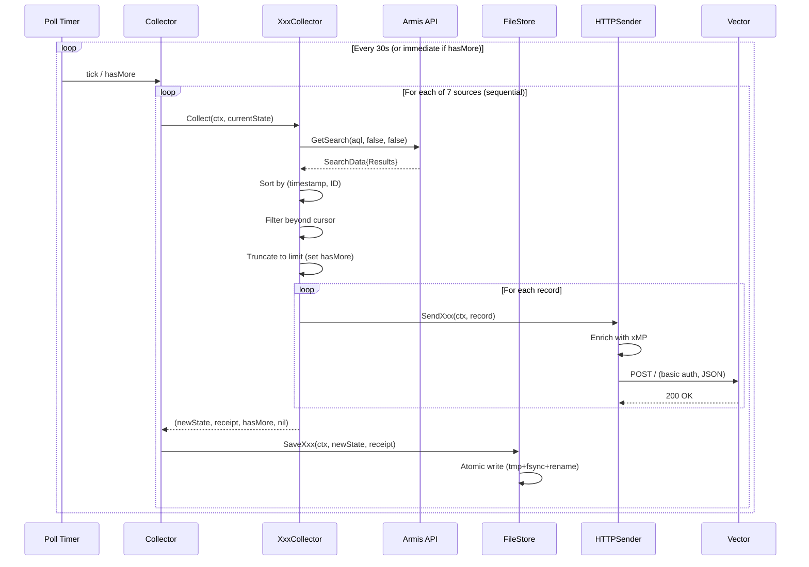
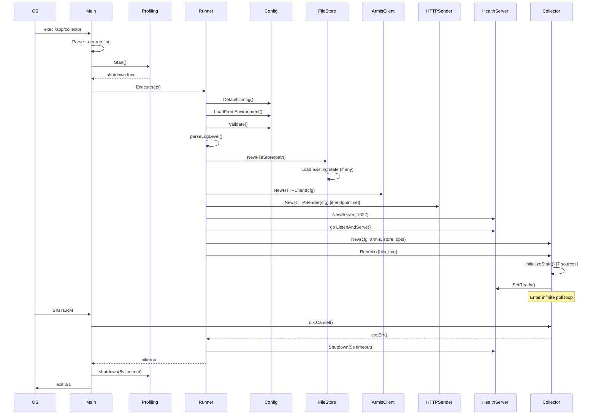

# Pass 1 Deep: Architecture -- Round 1

**Project:** poller-coaster
**Date:** 2026-04-13
**Basis:** All source files, Helm chart, CI/CD workflows, Dockerfile, cross-referenced with broad sweep and Phase A outputs

---

## Component Catalog (verified and refined)

### Runtime Components

| Component | Package | Responsibility | Interfaces Implemented |
|-----------|---------|---------------|----------------------|
| Runner | internal/app/runner | Orchestration: config load -> component wiring -> lifecycle management | None (procedural) |
| Collector | internal/collector | Poll loop: retry logic, sequential source collection, state initialization | None (top-level orchestrator) |
| AlertCollector | internal/collector | Polls alerts via AQL, cursor management, sink delivery | None (internal to Collector) |
| ActivityCollector | internal/collector | Polls activities via AQL | None |
| AuditLogCollector | internal/collector | Polls audit logs via AQL | None |
| RiskFactorCollector | internal/collector | Polls risk factors via AQL | None |
| ConnectionCollector | internal/collector | Polls connections via AQL | None |
| DeviceCollector | internal/collector | Polls devices via AQL | None |
| VulnerabilityCollector | internal/collector | Polls vulnerabilities via AQL | None |
| HTTPClient (armis) | internal/armis | Wraps centrix SDK GetSearch | armis.Client |
| HTTPSender | internal/sink | Per-record HTTP POST with enrichment | sink.Sender |
| FileStore | internal/state | Atomic JSON state persistence | state.Store |
| MemoryStore | internal/state | Ephemeral in-memory state (testing) | state.Store |
| Health Server | internal/health | K8s readiness/liveness probes + rate limiting | health.Reporter |
| Pprof Server | internal/profiling | Opt-in CPU/memory profiling | None (lifecycle via Start/shutdown) |
| Config | internal/config | Env var parsing, secret files, validation | None (value type) |
| AppErrors | internal/apperrors | 14 sentinel errors | None (constants) |

### Build/Deploy Components

| Component | Location | Responsibility |
|-----------|----------|---------------|
| Dockerfile | / | Multi-stage: build with golang:1.25.7-bookworm, runtime with distroless:nonroot |
| Helm Chart | deploy/helm/poller-coaster/ | K8s deployment: Deployment, PVC, RBAC, Secret, Service, ServiceAccount |
| Makefile | / | 13 targets for build, test, lint, run, etc. |
| Vector config | vector.yaml | Local development sink (http_server on :4413 -> console) |

---

## Layer Structure (verified from imports)

```
Layer 0: Entrypoint
  main.go, cmd/collector/main.go
  - Parses --dry-run flag
  - Starts pprof (optional)
  - Calls runner.Execute
  
Layer 1: Orchestration
  internal/app/runner/
  - Loads config (defaults -> env -> validate)
  - Creates store (file or memory)
  - Creates Armis client
  - Creates sink (optional)
  - Creates health server
  - Creates collector
  - Starts health server (goroutine)
  - Runs collector (blocking)
  - Shuts down health server on exit

Layer 2: Collection (Core Domain)
  internal/collector/
  - Infinite poll loop with retry + backoff
  - 7 sub-collectors (sequential execution)
  - Cursor management, fingerprint validation
  - Depends on: armis client, state store, sink, health reporter

Layer 3: Infrastructure
  internal/armis/     -- API client (wraps SDK)
  internal/sink/      -- HTTP delivery (enrichment + basic auth)
  internal/state/     -- Persistence (FileStore, MemoryStore)
  internal/health/    -- K8s probes + rate limiting
  internal/profiling/ -- Optional pprof
  internal/config/    -- Environment parsing + validation

Layer 4: Foundation
  internal/apperrors/ -- Sentinel errors (no dependencies)
```

### Dependency Direction Rules (verified)

- Layers only depend downward (never upward)
- Layer 2 depends on Layer 3 via **interfaces only** (SearchClient, Sender, Store, Reporter)
- Layer 3 packages are independent of each other (no cross-imports between armis/sink/state/health)
- Layer 4 has zero dependencies beyond stdlib
- **Exception:** sink package imports config.XMPConfig and config.SinkConfig directly (value types, acceptable)

---

## Deployment Topology

### Single-Service Architecture

```
[Kubernetes Cluster]
  |
  +-- Namespace: poller-coaster
       |
       +-- Deployment (replicas: 1)
       |     |
       |     +-- Container: collector (distroless:nonroot, UID 65532)
       |           |
       |           +-- Port 7322 (health endpoints)
       |           +-- PVC mount: /var/lib/poller-coaster (state.json)
       |           +-- Env vars from: values.yaml, Secrets
       |
       +-- Service (ClusterIP:7322) --> health endpoints
       +-- PVC (100Mi, RWO)
       +-- ServiceAccount (automount: true)
       +-- Role + RoleBinding (get/list configmaps+secrets, watch secrets)
       +-- Secret (optional, Armis API key)

[External Dependencies]
  |
  +-- Armis Centrix API (HTTPS, bearer auth via API key)
  +-- Vector / downstream sink (HTTP, basic auth)
```

### Key Deployment Constraints

1. **Single-instance only** -- no distributed locking, single PVC with RWO access mode
2. **replicaCount: 1** -- default in values.yaml, running > 1 replica would cause state corruption
3. **Probes disabled by default** -- livenessProbe.enabled=false, readinessProbe.enabled=false in values.yaml
4. **Read-only root filesystem** -- state writes only via PVC mount
5. **Non-root execution** -- UID/GID 65532, fsGroup 65532 for PVC write access
6. **No HPA** -- no horizontal pod autoscaler configuration

---

## Cross-Cutting Concerns

### Logging

- **Library:** charmbracelet/log with JSONFormatter and ReportTimestamp
- **Initialization:** Logger created in runner.Execute, passed to all components via constructor injection
- **Levels:** DEBUG, INFO, WARN, ERROR, FATAL (parsed in runner.go:parseLogLevel)
- **Structured fields:** type, endpoint, id, size_bytes, status, body, error, base_url, path, max_receipts
- **Secret safety:** redactSecret() in config/utils.go (shows first 2 + last 2 chars)
- **Level fallback:** Invalid level defaults to INFO with warning logged

### Error Handling

- **14 sentinel errors** in apperrors package (not 10 as broad sweep stated)
- **Wrapping pattern:** `fmt.Errorf("%w: %v", sentinel, innerErr)` -- note: inner error uses `%v` not `%w`, so only sentinel is matchable via errors.Is()
- **Validation aggregation:** errors.Join() for config validation
- **Fatal errors:** ErrQueryFingerprintMismatch, ErrCollectorRetriesExceeded cause process exit
- **Recoverable errors:** API/sink errors trigger retry with backoff

### Authentication

- **Armis API:** Bearer token via API key (SDK handles header injection)
- **Sink delivery:** HTTP Basic Auth (req.SetBasicAuth)
- **Secret loading:** Env vars with _FILE suffix for K8s secret mounts; file takes priority over direct env var

### Health & Observability

- **Health server:** :7322 with /health, /ready, /live endpoints
- **Rate limiting:** 100 req/s per IP, burst 20 (token bucket via golang.org/x/time/rate)
- **Readiness state:** Tracks collector health (SetReady on success, SetNotReady on failure)
- **Pprof:** Opt-in on localhost:3030 via ENABLE_PPROF=1; cmdline endpoint blocked for security

---

## Architecture Diagrams

### Component Architecture



### Data Flow



### Lifecycle / Startup Sequence



---

## New Findings vs Broad Sweep

### 1. Probes Disabled by Default

The Helm chart has `livenessProbe.enabled: false` and `readinessProbe.enabled: false`. This means in a default deployment, Kubernetes will NOT restart the pod on health check failure. The health server runs but K8s ignores it unless probes are explicitly enabled.

### 2. RBAC Grants Secret Watch

The Role grants `watch` on secrets (in addition to get/list). This is documented as "for credential updates" -- suggesting the original intent was to support credential rotation, but the Go code does NOT implement any secret-watching or credential-refresh logic. The RBAC permission is granted but unused.

### 3. Namespace Override Logic

The `_helpers.tpl` has complex namespace logic: if helm `--namespace` is provided and differs from values.yaml `namespace`, the helm release namespace wins (unless the values namespace is something other than "poller-coaster"). This could cause confusion in multi-namespace deployments.

### 4. Runner Shutdown Sequence

The runner has a specific shutdown sequence for error vs success paths:
- **On collector error:** Immediately shutdown health server with Background context (no timeout), log error, return
- **On normal exit:** Shutdown health server with 5s timeout, then drain health error channel

### 5. Logger Not Passed to Config

The runner creates the logger AFTER config loading. This means config loading errors use a default logger (no custom level, no structured fields matching the rest of the application). The logger level is only set after successful config validation.

### 6. Docker Build Targets cmd/collector

The Dockerfile builds `./cmd/collector` (not `main.go`), producing `/out/collector`. But both entrypoints are identical. The root `main.go` is used for `make run` / `go run .` during local development.

---

## Delta Summary

- New items added: Complete deployment topology, K8s resource inventory (7 templates), lifecycle sequence diagram, 6 architectural findings (probes disabled, RBAC unused, namespace logic, shutdown asymmetry, logger timing, build target)
- Existing items refined: Layer structure verified with dependency direction rules, cross-cutting concerns fully documented
- Remaining gaps: Network policies not present (no NetworkPolicy template), no Ingress template (internal-only service)

## Novelty Assessment

Novelty: SUBSTANTIVE

The deployment topology with probes-disabled-by-default, the RBAC watch permission being unused, the runner shutdown sequence asymmetry, and the logger initialization timing are all findings that change how you would spec the system's operational behavior. The complete lifecycle sequence diagram provides the first full picture of the startup/shutdown sequence.

## Convergence Declaration

Another round needed -- should verify: (1) whether the health server error channel is properly drained in all exit paths, (2) any race conditions in the shutdown sequence, (3) whether the collector interval configuration is exposed in the Helm chart.

## State Checkpoint

```yaml
pass: 1
round: 1
status: complete
files_scanned: 48
timestamp: 2026-04-13T00:00:00Z
novelty: SUBSTANTIVE
next_action: round 2 -- audit shutdown races, verify Helm env var completeness, hallucination check
```
