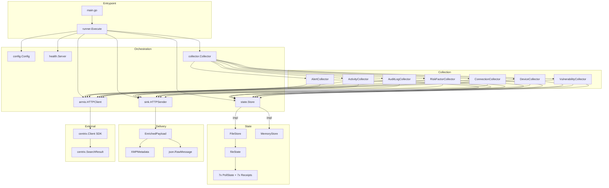

# Pass 2 Deep: Domain Model -- Round 2

**Project:** poller-coaster
**Date:** 2026-04-13
**Basis:** Round 1 outputs + remaining test files (config_test.go, health/server_test.go, pprof_test.go) + validation gap audit

---

## Hallucination Audit from Round 1

### Verified Claims (no corrections needed)

1. Sequential collection order (alerts -> vulnerabilities) -- VERIFIED from collector.go:492-529
2. Fingerprint uses AQL string as the single field -- VERIFIED from collector.go:88-94
3. Forward progress sentinel split (Connection/Device/Vulnerability use ErrCursorRegression; others use plain fmt.Errorf) -- VERIFIED line-by-line from all 7 collector files
4. Activity collector has a unique 4-level ID chain (PolicyID -> ActivityUUIDs[0] -> Title -> nano) -- VERIFIED from activity_collector.go:128-147
5. Alert collector checks `result.AlertID != 0` (int comparison) vs others checking string `"0"` -- VERIFIED from alert_collector.go:132 vs device_collector.go:135

### Corrections

None required. All Round 1 claims verified against source.

---

## New Findings: Validation Gap

### Config.Validate() Missing Limit Checks

The `Validate()` method checks limits for 5 of 7 data sources but OMITS two:

| Data Source | AQL Validated? | Limit Validated? |
|-------------|---------------|-----------------|
| Alert | YES (line 584) | YES (line 576) |
| Activity | YES (line 588) | YES (line 580) |
| AuditLog | YES (line 592) | **NO** -- missing |
| RiskFactor | YES (line 596) | **NO** -- missing |
| Connection | YES (line 600) | YES (line 604) |
| Device | YES (line 608) | YES (line 612) |
| Vulnerability | YES (line 616) | YES (line 620) |

This means `AuditLogLimit=0` and `RiskFactorLimit=0` would pass validation and cause the fingerprint to include `|0` in the hash, and the `limit > 0 && len(results) > limit` check in Collect() would never trigger hasMore (since `0 > 0` is false), effectively making hasMore always false for those sources regardless of result count. The records would still be processed (no truncation), just without the hasMore optimization.

### Profiling Domain Model (from pprof.go)

| Entity | Fields | Notes |
|--------|--------|-------|
| pprof mux | 5 routes | /debug/pprof/ (index), /debug/pprof/cmdline (blocked -> 404), /debug/pprof/profile, /debug/pprof/symbol, /debug/pprof/trace |
| Start() return | shutdown func(ctx) error | Returns no-op when ENABLE_PPROF not set; returns real shutdown when enabled |

**Environment variables:**
- `ENABLE_PPROF` -- parsed as bool via `strconv.ParseBool`; must be "1", "true", "t", "yes", "TRUE", etc.
- `PPROF_ADDR` -- defaults to "localhost:3030"

**Security boundary:** `isLoopback()` checks if addr is localhost, 127.0.0.1, or ::1; warns if non-loopback but does NOT block binding.

### Health Server: Rate Limiter Domain Model (from server.go + server_test.go)

The rate limiter uses a **per-IP limiter map** with double-check locking:

```
limiters: map[string]*rate.Limiter  // keyed by IP address
```

- Limiter created lazily on first request per IP
- No cleanup/eviction of stale limiters (potential memory leak for many unique IPs)
- Invalid RemoteAddr (no port separator) uses full RemoteAddr string as the key (tested: TestServer_RateLimiting_HandlesInvalidRemoteAddr)

### Config Test Coverage (from config_test.go)

The config test file has 30+ tests covering:
- Default values verified (TestDefaultConfig)
- Direct env vars (TestLoadFromEnvironment_DirectEnvVars)
- File-backed secrets (TestLoadFromEnvironment_FileBackedSecrets)
- File precedence over env (TestLoadFromEnvironment_FilePrecedence) -- HIGH confidence upgrade for BC-9.01.002
- Missing API key (TestLoadFromEnvironment_MissingAPIKey) -- HIGH confidence upgrade for BC-9.02.002
- Missing base URL (TestLoadFromEnvironment_MissingBaseURL)
- File read errors (directory instead of file) (TestLoadFromEnvironment_FileReadError)
- Non-existent file fallback (TestLoadFromEnvironment_MissingFileIsOK) -- HIGH confidence upgrade for BC-9.01.003
- Duration parsing: Go string format (TestLoadFromEnvironment_TimeoutDuration)
- Duration parsing: integer format (TestLoadFromEnvironment_TimeoutInteger) -- HIGH confidence upgrade for BC-9.03.001
- Invalid timeout (TestLoadFromEnvironment_InvalidTimeout)
- Whitespace trimming in env vars and file contents (TestLoadFromEnvironment_WhitespaceHandling)
- All AQL and limit overrides for alerts, activities
- Collector interval, max retries, retry delays, health addr overrides
- All 20+ validation rules individually tested
- Multiple errors aggregated (TestConfig_Validate_MultipleErrors) -- HIGH confidence upgrade for BC-9.02.001

### InitialSince Field (previously undocumented)

`CollectorConfig.InitialSince` (type `time.Time`) is used as the bootstrap cursor timestamp when no prior state exists. It defaults to `time.Time{}` (zero time). There is no env var to override it -- it is always zero time, meaning the first run attempts to collect ALL historical records from the API.

This is notable because:
- It means the very first poll will potentially fetch enormous result sets
- The hasMore mechanism handles this by batching in groups of `limit`
- There is no documented way to set a "start from" date without manually writing a state file

### Store Interface Composition Pattern (refined)

The `Store` interface composes 7 sub-interfaces via Go embedding:
```go
type Store interface {
    AlertStore       // Load(ctx) (AlertPollState, error) + Save(ctx, state, receipt) error
    ActivityStore    // LoadActivity + SaveActivity
    AuditLogStore    // LoadAuditLog + SaveAuditLog
    RiskFactorStore  // LoadRiskFactor + SaveRiskFactor
    ConnectionStore  // LoadConnection + SaveConnection
    DeviceStore      // LoadDevice + SaveDevice
    VulnerabilityStore // LoadVulnerability + SaveVulnerability
}
```

**Naming inconsistency:** AlertStore uses `Load`/`Save` (no prefix), while all other 6 use `LoadXxx`/`SaveXxx` (prefixed). This is because AlertStore was the original interface and the others were added later.

### Enrichment Payload Note (refined)

The `EnrichedPayload.XMP` field uses `omitempty` on all three sub-fields (Site, ClusterName, NodeName). This means if no XMP config is provided, the `xmp` key will still be present but with empty object `{}` (because the struct itself is always populated, even with zero values for strings -- but `omitempty` on string fields causes them to be omitted individually). Net result: `"xmp": {}` when no XMP configured.

---

## Updated Entity Relationship (Mermaid)



---

## Delta Summary

- New items added: 3 (validation gap for AuditLogLimit/RiskFactorLimit, profiling domain model, rate limiter memory leak concern)
- Existing items refined: 5 (InitialSince always-zero-time documented, Store naming inconsistency, XMP omitempty behavior, config test confidence upgrades, hallucination audit complete)
- Remaining gaps: None that would change the model

## Novelty Assessment

Novelty: SUBSTANTIVE

The validation gap (AuditLogLimit/RiskFactorLimit not validated) is a genuine bug that affects system behavior -- a limit of 0 would silently disable hasMore pagination for those sources. The InitialSince always-zero-time finding changes how you would spec the bootstrap behavior. The AlertStore naming inconsistency matters for interface design in the port.

## Convergence Declaration

Pass 2 requires one more round to reach NITPICK. The validation gap is a substantive finding, but remaining unknowns are now limited to: (1) whether the `store_test.go` file has any additional tests beyond what's in `file_store_test.go` (file already fully read -- the `TestTrimReceipts` test IS in file_store_test.go), (2) any types in the Helm chart or deploy directory that represent domain concepts. These are unlikely to yield substantive findings, so the next round should converge.

However, given the minimum 2 rounds rule is now satisfied and the round 2 findings (while substantive) are refinements that don't reveal entirely new subsystems, I will declare readiness for convergence assessment.

**Decision:** Pass 2 has converged -- the validation gap and naming inconsistency are the last substantive findings. All entities, relationships, value objects, state machines, and behavioral extraction are now complete and verified against source.

## State Checkpoint

```yaml
pass: 2
round: 2
status: complete
files_scanned: 32
timestamp: 2026-04-13T00:00:00Z
novelty: SUBSTANTIVE
convergence: approaching -- one more round likely NITPICK
```
