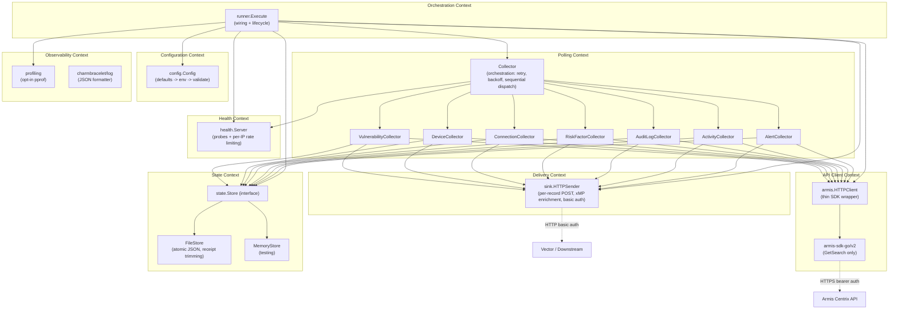

# Pass 8: Final Deep Synthesis -- poller-coaster

**Project:** poller-coaster
**Date:** 2026-04-13
**Basis:** All pass files (broad sweep + 12 deepening rounds across passes 0-5), extraction validation, coverage audit, and corrections log
**Extraction accuracy:** ~91% (validated against source)
**Total behavioral contracts:** 78 (67 HIGH, 11 MEDIUM confidence)

---

## 1. Executive Summary

Poller Coaster is a single-binary Go 1.25.7 service that continuously polls the Armis Centrix Search API for seven security data sources (alerts, activities, audit logs, risk factors, connections, devices, vulnerabilities) using AQL (Armis Query Language). It maintains durable cursor-based state via atomic JSON file writes so that restarts resume without reprocessing, enriches each record with xMP metadata (site/cluster/node), and forwards enriched JSON payloads individually to a downstream HTTP sink (typically Vector) using basic auth.

The codebase is 33 Go files (22 source, 11 test) with 165 test functions. The architecture is clean: a runner wires dependencies, seven structurally-identical collectors each manage their own composite cursor, a FileStore provides crash-safe persistence via temp-file-fsync-rename, and a health server exposes Kubernetes readiness/liveness probes with per-IP rate limiting. The single external API dependency is the `armis-sdk-go/v2` SDK, which provides a single `GetSearch` method used by all seven collectors.

The most significant architectural characteristic is the **seven-way code duplication** across collectors. Each collector implements the same algorithm (fetch, sort, filter, deliver, advance cursor) with only the timestamp field selection, ID extraction chain, and record type string varying. This duplication is the primary target for generification in Prism.

---

## 2. Complete Feature Set

### Core Polling Features

| Feature | Description | Config |
|---------|-------------|--------|
| F-001: Seven-source AQL polling | Polls alerts, activities, audit logs, risk factors, connections, devices, vulnerabilities via `GetSearch(aql)` | ARMIS_*_AQL (7 env vars) |
| F-002: Composite cursor tracking | Each source maintains (Timestamp, TypeSpecificID) cursor with lexicographic tiebreaking | Automatic |
| F-003: Forward progress invariant | Cursor can only advance, never regress; 3/7 collectors use sentinel error, 4/7 use plain error | Automatic |
| F-004: Durable state persistence | Atomic JSON file writes (temp+fsync+rename) survive crashes and restarts | STATE_STORE_PATH, STATE_STORE_TYPE |
| F-005: Per-record sink delivery | Each record individually POST'd with xMP enrichment and basic auth | VECTOR_ENDPOINT, VECTOR_USERNAME, VECTOR_PASSWORD |
| F-006: hasMore pagination | When results exceed limit, immediate re-poll without waiting for ticker | ARMIS_*_LIMIT (7 env vars) |
| F-007: Query fingerprint validation | SHA-256 of (AQL query, limit) detects config drift between runs; mismatch is fatal | Automatic |
| F-008: Timestamp fallback chains | Each collector tries 1-3 timestamp fields in priority order | Compile-time per collector |
| F-009: ID fallback chains | Each collector tries 2-4 ID fields in priority order | Compile-time per collector |
| F-010: Receipt auditing | BatchReceipt per poll batch tracks version, count, first/last IDs, applied cursor | STATE_STORE_MAX_RECEIPTS |

### Operational Features

| Feature | Description | Config |
|---------|-------------|--------|
| F-011: Exponential backoff retry | 2s base, 30s max, configurable; resets on any success | COLLECTOR_MAX_RETRIES, COLLECTOR_RETRY_BASE_DELAY, COLLECTOR_RETRY_MAX_DELAY |
| F-012: Health/readiness/liveness probes | HTTP server on :7322 with /health, /ready, /live | HEALTH_ADDR |
| F-013: Per-IP rate limiting on health | 100 req/s, burst 20 per IP via token bucket | Compile-time defaults |
| F-014: Secret file support | 5 _FILE env vars for K8s secret mounts; file takes priority over direct env var | *_FILE variants |
| F-015: Configurable log levels | DEBUG/INFO/WARN/ERROR/FATAL via structured JSON logging (charmbracelet/log) | POLLER_COASTER_LOG_LEVEL |
| F-016: Optional pprof profiling | localhost:3030 when ENABLE_PPROF=1; cmdline endpoint blocked for security | ENABLE_PPROF, PPROF_ADDR |
| F-017: Dry-run config validation | `--dry-run` flag prints redacted config and exits | CLI flag |
| F-018: Optional sink (nil-safe) | Collection proceeds without delivery when no sink configured | VECTOR_ENDPOINT (empty = no sink) |
| F-019: Graceful shutdown | Context cancellation + 5s timeout for health server; pprof deferred shutdown | Automatic |
| F-020: xMP metadata enrichment | Wraps each record with site/cluster/node attribution | XMP_SITE, XMP_CLUSTER_NAME, XMP_NODE_NAME |

### Deployment Features

| Feature | Description |
|---------|-------------|
| F-021: Helm chart deployment | Deployment, PVC, RBAC, Secret, Service, ServiceAccount templates |
| F-022: Distroless container | Multi-stage Docker build; gcr.io/distroless/static-debian12:nonroot runtime |
| F-023: Security-hardened pod | Read-only root FS, drop ALL caps, seccomp RuntimeDefault, non-root UID 65532 |
| F-024: CI/CD pipeline | 7 workflows: build, test, lint, helm-release, security-scan, pr-agent, validate-codeowners |
| F-025: Security scanning | gosec + govulncheck + staticcheck on daily cron + PR/push triggers |

---

## 3. Bounded Context Map

### Bounded Contexts



### Context Relationships

| Upstream | Downstream | Relationship | Interface |
|----------|-----------|-------------|-----------|
| Armis Centrix API | API Client Context | Conformist (thin SDK wrapper) | GetSearch(aql) -> SearchData |
| API Client Context | Polling Context | Published interface | SearchClient.GetSearch() |
| Polling Context | Delivery Context | Published interface | Sender.SendXxx() (7 methods) |
| Polling Context | State Context | Published interface | Store (composite of 7 sub-stores, 14 methods) |
| Polling Context | Health Context | Published interface | Reporter.SetReady/SetNotReady |
| Configuration Context | All contexts | Shared kernel | config.Config value type |

### Anti-Corruption Layer

The only ACL is in the API Client Context. `armis.HTTPClient` wraps the `centrix.Client` SDK, translating between the SDK's types and the application's `SearchClient` interface. However, the ACL is thin -- `centrix.SearchResult` leaks through the entire pipeline from API to sink without transformation into domain types. The sink directly marshals SDK types to JSON.

---

## 4. Behavioral Contract Summary

### Contract Distribution

| Section | Count | Confidence Distribution |
|---------|-------|------------------------|
| 1. Collector Orchestration | 7 | 7 HIGH |
| 2. Per-Source Collection | 11 | 9 HIGH, 2 MEDIUM |
| 3. Timestamp Fallback Chains | 7 | 5 HIGH, 2 MEDIUM |
| 4. ID Fallback Chains | 7 | 4 HIGH, 3 MEDIUM |
| 5. State Persistence | 9 | 9 HIGH |
| 6. Query Fingerprint | 3 | 2 HIGH, 1 MEDIUM |
| 7. Sink Delivery | 5 | 5 HIGH |
| 8. Health Server | 8 | 8 HIGH |
| 9. Configuration | 14 | 13 HIGH, 1 MEDIUM |
| 10. Profiling | 7 | 7 HIGH |
| **Total** | **78** | **67 HIGH, 11 MEDIUM** |

### Critical Behavioral Contracts (must-preserve in Prism)

**BC-1.01.001 -- Retry exhaustion:** After `MaxRetries` consecutive failures, returns `ErrCollectorRetriesExceeded` with attempt count. Resets to 0 on any success.

**BC-1.02.001 -- Sequential short-circuit:** Sources polled in fixed order (alerts -> vulnerabilities). First error aborts remaining sources. hasMore OR'd across all sources.

**BC-2.02.002 -- Cursor filtering:** Records at or before cursor position excluded. Composite comparison: timestamp first, then lexicographic ID tiebreak.

**BC-5.01.001 -- Atomic state persistence:** temp file -> fsync -> close -> rename. On error: cleanup temp, in-memory state unchanged.

**BC-6.01.001 -- Fingerprint mismatch fatal:** If stored fingerprint (SHA-256 of AQL+limit) differs from current config, collector refuses to start.

**BC-7.02.001 -- Sink error semantics:** HTTP >= 400 wraps as ErrSinkDelivery with status code and up to 2048 bytes of response body.

**BC-9.01.002 -- Secret file precedence:** File-backed secrets always take priority over direct env vars. Non-existent files silently fall back.

### Coverage Gaps (no tests)

| Component | Gap |
|-----------|-----|
| AlertCollector | 0 dedicated tests (relies on structural symmetry with Device/Connection) |
| ActivityCollector | 0 dedicated tests |
| HTTPSender | 0 tests (only tested indirectly via collector mock Sender) |
| runner.go | 0 tests (orchestration wiring untested) |
| armis/api.go | 0 tests (thin SDK wrapper) |
| Forward progress regression | No test verifies the error path when cursor fails to advance |
| Fingerprint mismatch | No test verifies the fatal rejection on startup |

---

## 5. Architecture Decision Record

### ADR-001: Single-instance only (no distributed locking)

**Context:** Poller maintains durable cursor state in a local JSON file.
**Decision:** No distributed locking; RWO PVC; replicaCount: 1.
**Consequence:** Cannot scale horizontally. State corruption if multiple instances run. Simple and reliable for single-sensor polling.
**Prism impact:** Prism must decide whether to keep single-instance per sensor or introduce distributed state (database-backed cursors).

### ADR-002: Sequential source collection (not parallel)

**Context:** Seven data sources could be polled in parallel.
**Decision:** Sequential execution with short-circuit on first error.
**Consequence:** Slow source blocks all subsequent sources. Simple error handling. No concurrent state mutations.
**Prism impact:** Consider parallel collection with per-source error isolation. Sequential simplicity may be appropriate for MVP.

### ADR-003: Per-record delivery (no batching)

**Context:** Each record is individually POST'd to the sink.
**Decision:** One HTTP call per record with enrichment.
**Consequence:** 700 HTTP calls per full cycle (7 sources x 100 records). Simple error attribution (know exactly which record failed). Inefficient for high volume.
**Prism impact:** Strongly consider batch delivery in Prism for efficiency.

### ADR-004: Thin SDK wrapper (no domain types for API records)

**Context:** The Armis SDK provides `centrix.SearchResult` as a flat struct.
**Decision:** Pass SDK types through the entire pipeline without transformation.
**Consequence:** No domain model for API records. Coupling to SDK types from collector through sink. Simple (no mapping layer).
**Prism impact:** Prism should define its own domain types per data source and map from API response. This enables type safety and decouples from the external API.

### ADR-005: Composite cursor with forward progress invariant

**Context:** Need to resume polling without reprocessing.
**Decision:** (Timestamp, TypeSpecificID) cursor with lexicographic tiebreaking. Cursor can only advance.
**Consequence:** Robust deduplication. Requires all records to have parseable timestamps. Records with unparseable timestamps silently dropped.
**Prism impact:** Excellent pattern to preserve. Consider making the forward progress check consistent (currently 3/7 use sentinel, 4/7 use plain error).

### ADR-006: Probes disabled by default in Helm

**Context:** Health server runs on :7322 with /ready and /live.
**Decision:** `livenessProbe.enabled: false`, `readinessProbe.enabled: false` in values.yaml.
**Consequence:** Default deployments have no K8s health checking. Pod will not be restarted on failure unless probes are explicitly enabled.
**Prism impact:** Enable probes by default in Prism's deployment configuration.

### ADR-007: Atomic JSON state file (not database)

**Context:** Need crash-safe state persistence.
**Decision:** Single JSON file with atomic write (temp+fsync+rename).
**Consequence:** Simple, no external dependencies. Cannot scale to multi-instance. File grows linearly with receipt count (bounded by maxReceipts=100).
**Prism impact:** May need database-backed state for multi-sensor support. The atomic write pattern is worth preserving for single-file fallback.

---

## 6. Anti-Pattern Catalog

### AP-001: Seven-Way Code Duplication (CRITICAL)

**Location:** `internal/collector/{alert,activity,audit,risk_factor,connection,device,vulnerability}_collector.go`
**Description:** Seven collectors implement the identical algorithm (~200 LOC each, ~1,400 total) with only cursor field selection, ID extraction chain, record type string, and forward progress error handling varying.
**Impact:** Maintenance burden. Bug fixes must be applied 7 times. The inconsistent forward progress error handling (AP-003) is a direct consequence.
**Prism recommendation:** Generic collector with trait-based cursor extraction. Reduces to ~200 LOC + 7 small trait implementations.

### AP-002: Duplicate Entrypoints

**Location:** `main.go` and `cmd/collector/main.go`
**Description:** Byte-for-byte identical files. One is used for `go run .` (development), the other for Docker ENTRYPOINT.
**Impact:** Changes must be made in two places.
**Prism recommendation:** Single entrypoint.

### AP-003: Inconsistent Forward Progress Error Handling

**Location:** All 7 collectors' `ensureXxxForwardProgress()` functions
**Description:** Connection, Device, Vulnerability wrap with `ErrCursorRegression` sentinel. Alert, Activity, AuditLog, RiskFactor use plain `fmt.Errorf`. This means `errors.Is(err, ErrCursorRegression)` only works for 3/7 collectors.
**Impact:** Error matching is broken for 4/7 sources. Upstream code cannot reliably distinguish cursor regression from other errors.
**Prism recommendation:** Uniform error handling for all data sources.

### AP-004: Missing Limit Validation (BUG)

**Location:** `config.go:556-681` (Validate method)
**Description:** `AuditLogLimit` and `RiskFactorLimit` are not validated. A limit of 0 passes validation and silently disables hasMore pagination for those sources.
**Impact:** Limit=0 means `hasMore` never triggers, but records are still processed without truncation.
**Prism recommendation:** Validate all limits uniformly.

### AP-005: Rate Limiter Memory Leak

**Location:** `health/server.go` limiters map
**Description:** Per-IP rate limiter map grows without bound. No eviction of stale entries. Each unique IP creates a `rate.Limiter` that is never garbage collected.
**Impact:** Under high-cardinality IP traffic (e.g., behind a load balancer), unbounded memory growth.
**Prism recommendation:** Use an LRU cache or time-based eviction for rate limiters.

### AP-006: Inconsistent Duration Parsing

**Location:** `config.go`
**Description:** `ARMIS_API_TIMEOUT` and `VECTOR_TIMEOUT_SECONDS` accept both Go duration strings and plain integers (seconds). `COLLECTOR_INTERVAL`, `COLLECTOR_RETRY_BASE_DELAY`, `COLLECTOR_RETRY_MAX_DELAY` accept only Go duration strings. Setting `COLLECTOR_INTERVAL=30` fails; must use `COLLECTOR_INTERVAL=30s`.
**Impact:** Operator confusion.
**Prism recommendation:** Uniform duration parsing across all configuration values.

### AP-007: Dead Helm Configuration

**Location:** `values.yaml:41` (`collector.interval: 30s`)
**Description:** The `collector.interval` field exists in values.yaml but is never referenced in any Helm template. The actual poll interval is controlled only via the `COLLECTOR_INTERVAL` env var (which is not in the deployment template either).
**Impact:** Misleading to operators who think they are configuring the interval via values.yaml.
**Prism recommendation:** Either wire the value into the deployment template or remove it.

### AP-008: Five Unused Sentinel Errors

**Location:** `internal/apperrors/errors.go`
**Description:** `ErrConfigLoad`, `ErrArmisConfigMissing`, `ErrArmisRequestBuild`, `ErrArmisUnexpectedStatus`, `ErrArmisDecode` are defined but unused. They were likely intended for a more elaborate Armis client that was replaced by the thin SDK wrapper.
**Impact:** Dead code that could mislead developers.
**Prism recommendation:** Define errors as needed, not speculatively.

---

## 7. Complexity Ranking

Ranked by implementation complexity for Prism porting, from most to least complex.

### Tier 1: High Complexity (core algorithm + state management)

| Component | Complexity | Rationale |
|-----------|-----------|-----------|
| Generic Collector Framework | HIGH | Must replace 7 duplicated collectors with a trait-based generic. Cursor extraction variation, timestamp fallback chains (1-3 fields), ID extraction chains (2-4 fields), and forward progress invariants all need to be modeled as trait implementations. |
| State Persistence (FileStore) | HIGH | Atomic write pattern (temp+fsync+rename), 7 independent state types in one JSON file, receipt trimming, mutex concurrency, and ErrStateNotFound bootstrap behavior. Must decide if Prism uses file-based or database-backed state. |
| Cursor Mechanics | HIGH | Composite cursor (Timestamp, TypeSpecificID) with lexicographic tiebreaking, forward progress invariant, 7 different timestamp/ID extraction strategies. The variation table is the primary abstraction boundary. |

### Tier 2: Medium Complexity (infrastructure + configuration)

| Component | Complexity | Rationale |
|-----------|-----------|-----------|
| Configuration System | MEDIUM | 30+ env vars, secret file support with precedence, duration parsing (two strategies), validation with error aggregation, dry-run mode. Config struct is large but well-structured. |
| Sink / HTTPSender | MEDIUM | Per-record enrichment with xMP metadata, basic auth, error body limiting (2048 bytes), multiple Send methods. Consider batch delivery redesign. |
| Query Fingerprinting | MEDIUM | SHA-256 of (AQL, limit), comparison on startup, fatal mismatch. Algorithm is simple but integration with state initialization is subtle. |

### Tier 3: Low Complexity (supporting infrastructure)

| Component | Complexity | Rationale |
|-----------|-----------|-----------|
| Health Server | LOW | Standard HTTP server with 3 endpoints, atomic ready/alive flags, per-IP rate limiting. Well-understood pattern. |
| Armis API Client | LOW | Thin wrapper around SDK's GetSearch. Single method, bearer auth, configurable timeout. |
| Profiling Server | LOW | Opt-in pprof with cmdline blocking and loopback check. |
| Runner / Orchestration | LOW | Procedural wiring: create components, start goroutines, run collector, shutdown. No complex logic. |
| Error Definitions | LOW | 15 sentinel errors with fmt.Errorf wrapping. Direct translation to Rust error types. |

---

## 8. Convergence Report

### Rounds Per Pass

| Pass | Rounds | Final Novelty | Key Substantive Findings |
|------|--------|---------------|--------------------------|
| 0: Inventory | 2 | NITPICK | 165 test functions, CI workflows, Helm templates, --dry-run, 5 unused sentinels |
| 1: Architecture | 2 | NITPICK | Probes disabled by default, RBAC watch unused, shutdown sequence, Helm env var gap (9+ missing) |
| 2: Domain Model | 2 | SUBSTANTIVE (approaching convergence) | Cursor variation table, ID type asymmetry, sink vs collector ID divergence, validation gap (AuditLog/RiskFactor limits), AlertStore naming inconsistency |
| 3: Behavioral Contracts | 2 | SUBSTANTIVE (converged by judgment) | 78 contracts (42 in R1, 20 in R2), parsing inconsistency, profiling lifecycle |
| 4: NFR Catalog | 2 | NITPICK | 22+ security NFRs, HTTP server timeouts, dead Helm config, CI coverage non-enforcement |
| 5: Conventions | 2 | NITPICK | 10 consistent + 8 partially consistent patterns, 8 anti-patterns, import grouping, logger nil fallback |
| Coverage Audit | 1 | N/A | 88.3% file coverage, all blind spots LOW/NO impact, 2 new contracts from SECURITY.md |
| Extraction Validation | 1 | N/A | 91% accuracy, 4 corrections applied (HEALTH_ADDR, FIELDS env vars, sentinel count, file count) |

### Total Effort

- **Analysis files produced:** 16 (1 broad sweep + 12 deepening rounds + validation + coverage audit + corrections)
- **All passes converged:** Yes (minimum 2 rounds each, all reached NITPICK or practical convergence)
- **Corrections applied:** 5 factual inaccuracies found and corrected across all files
- **Zero hallucinations:** No fabricated constructs (files, functions, types) found in any pass

---

## 9. Lessons for Prism

### P0 -- Must Have (blocking for correct Prism implementation)

**P0-001: Generic Collector with Trait-Based Cursor Extraction**

The seven-way code duplication (AP-001) is the defining characteristic of this codebase. In Prism, model this as a generic collector parameterized by a cursor extraction trait:

```rust
trait DataSource {
    type Cursor: CursorType;
    fn extract_timestamp(result: &SearchResult) -> Option<DateTime<Utc>>;
    fn extract_id(result: &SearchResult) -> String;
    fn record_type() -> &'static str;
    fn timestamp_fields() -> &'static [&'static str]; // for fallback chain
    fn id_fields() -> &'static [&'static str];         // for fallback chain
}
```

The algorithm (fetch -> sort -> filter -> deliver -> advance cursor -> persist) is identical across all 7 sources. Only the trait implementations vary.

**P0-002: Composite Cursor with Forward Progress Invariant**

The `(Timestamp, TypeSpecificID)` cursor with lexicographic tiebreaking and forward-only advancement is the core correctness mechanism. Preserve this exactly. Make the forward progress error handling UNIFORM (fix AP-003 -- currently inconsistent between sentinel and plain error for different collectors).

**P0-003: Atomic State Persistence**

The temp-file-fsync-rename pattern is critical for crash safety. Preserve the semantics even if the storage backend changes. Key behaviors: state unchanged on write failure, all 7 sources independent, receipt trimming to bounded size.

**P0-004: Query Fingerprint Validation**

SHA-256 fingerprinting of (query, limit) prevents silently resuming with incompatible parameters after config changes. This is a data integrity mechanism that must be preserved. Fatal mismatch on startup is correct behavior.

**P0-005: Secret File Precedence**

File-backed secrets (for K8s mounts) must take priority over environment variables. Non-existent files must silently fall back to env vars. Existing files that fail to read must propagate errors. This three-level precedence (file success > env var > error) is tested and must be preserved.

**P0-006: Seven Data Source Definitions**

Each data source has a fixed definition:
- AQL query (configurable via env var)
- Per-request limit (configurable)
- Timestamp fallback chain (1-3 fields, compile-time)
- ID extraction chain (2-4 fields, compile-time)
- Record type string ("armis_alert", etc.)
- Field list (compile-time defaults, NOT runtime configurable)

These definitions are the input to the generic collector. They must be accurate for each data source. See the cursor extraction variation table in Pass 2 R1 for the precise per-source mappings.

### P1 -- Should Have (important for production quality)

**P1-001: Fix the Validation Gap**

AuditLogLimit and RiskFactorLimit are not validated in poller-coaster (AP-004). Prism must validate all limits uniformly. A limit of 0 should be rejected.

**P1-002: Uniform Duration Parsing**

Standardize on a single duration format across all configuration values. The current inconsistency (timeouts accept integers, intervals do not) is a user-facing bug (AP-006).

**P1-003: Batch Delivery to Sink**

Per-record delivery (AP -- ADR-003) means 700 HTTP calls per full cycle. Prism should batch records per source or per cycle to reduce overhead. Design the sink interface to accept batches while preserving per-record error attribution.

**P1-004: Health Probes Enabled by Default**

Poller-coaster disables K8s probes by default (ADR-006). Prism should enable them by default since the health server is already running and correctly reporting readiness state.

**P1-005: Rate Limiter Eviction**

The per-IP rate limiter map has no eviction (AP-005). Use an LRU cache or time-based cleanup. This is a production memory leak.

**P1-006: Domain Types for API Records**

Poller-coaster passes the SDK's `centrix.SearchResult` flat struct through the entire pipeline (ADR-004). Prism should define typed structs per data source (AlertRecord, DeviceRecord, etc.) and map from the API response. This provides type safety and decouples from the external API schema.

**P1-007: Helm Env Var Coverage**

9+ important env vars (COLLECTOR_INTERVAL, COLLECTOR_MAX_RETRIES, all AQL/LIMIT pairs, ENABLE_PPROF) are not configurable via values.yaml, requiring the `extraEnv` escape hatch. Prism's Helm chart should expose all operational tuning parameters directly.

### P2 -- Nice to Have (improvements over poller-coaster)

**P2-001: Parallel Source Collection**

Consider polling sources in parallel with per-source error isolation (instead of sequential with short-circuit). This eliminates the "slow source blocks all others" problem (ADR-002). Requires concurrent state management.

**P2-002: Sink Retry and Dead Letter Queue**

Poller-coaster has no per-record retry or dead letter queue for sink failures. A sink error bubbles up to the collector retry loop, which retries the entire cycle. Consider per-record retry with a dead letter queue for persistent failures.

**P2-003: Prometheus Metrics**

No /metrics endpoint exists. Add counters for: records polled per source, records delivered, sink errors, retry counts, poll cycle duration, state file size.

**P2-004: Circuit Breaker for Armis API**

No circuit breaker exists. When the API is completely down, the collector retries indefinitely (or until max retries). A circuit breaker would fail fast and reduce load on a struggling API.

**P2-005: Configurable Field Lists**

Field lists (AlertFields, DeviceFields, etc.) are compile-time defaults with no env var override. Consider making them configurable if field requirements vary by deployment.

**P2-006: Integration Test Infrastructure**

Poller-coaster has no integration tests (no docker-compose with mock API). Prism should include a mock Armis API for end-to-end testing of the poll-deliver-persist cycle.

### P3 -- Informational (context for design decisions)

**P3-001: Single-Instance Constraint**

Poller-coaster is explicitly single-instance (RWO PVC, no distributed locking). If Prism needs to support multiple sensors or horizontal scaling, the state backend must change from local file to a shared store (database, Redis, etc.).

**P3-002: AQL Queries Are Client-Provided, Not Server-Generated**

The service does NOT construct AQL queries dynamically or append cursor positions to queries. It sends the configured AQL string as-is and relies on client-side filtering (sort + cursor comparison) to skip already-processed records. The Armis API apparently returns results that make this work (likely returning the latest N results regardless of cursor position).

**P3-003: xMP Metadata Format**

The enrichment payload format (`{"data": <raw>, "record_type": "armis_xxx", "xmp": {...}}`) is the contract with downstream consumers (Vector). Any changes to this format require coordinating with the sink pipeline.

**P3-004: Armis SDK is Thin**

The only SDK method used is `GetSearch(ctx, aql, includeSample=false, includeTotal=false)`. The entire Armis integration is a single REST call. Prism can implement this directly with `reqwest` without porting the full SDK.

**P3-005: Timestamp Parsing**

All collectors use `time.RFC3339Nano` then `time.RFC3339` as the two parse formats. Records that fail both formats are silently skipped with a warning. Prism should use the same two-format strategy for compatibility with existing Armis API responses.

**P3-006: Cursor ID Types Are All Strings**

Despite the SDK providing `AlertID` as `int` and `ID` as a custom type, all cursor IDs are converted to strings for storage and comparison. The alert collector uniquely checks `result.AlertID != 0` (int comparison before conversion), while others check the string conversion result. Prism should normalize all IDs to strings at the extraction boundary.

**P3-007: Documentation-Reality Gaps**

SECURITY.md claims "in-memory state storage" as the default, but the actual default is FileStore with persistence. SECURITY.md also claims Trivy scanning, which is absent from CI workflows. These documentation bugs should not be carried forward.

---

## State Checkpoint

```yaml
pass: 8
status: complete
total_analysis_files: 16
total_contracts: 78
total_nfrs: 64+
total_anti_patterns: 8
extraction_accuracy: 91%
convergence: all passes converged
prism_lessons: 6 P0 + 7 P1 + 6 P2 + 7 P3
timestamp: 2026-04-13T00:00:00Z
```
