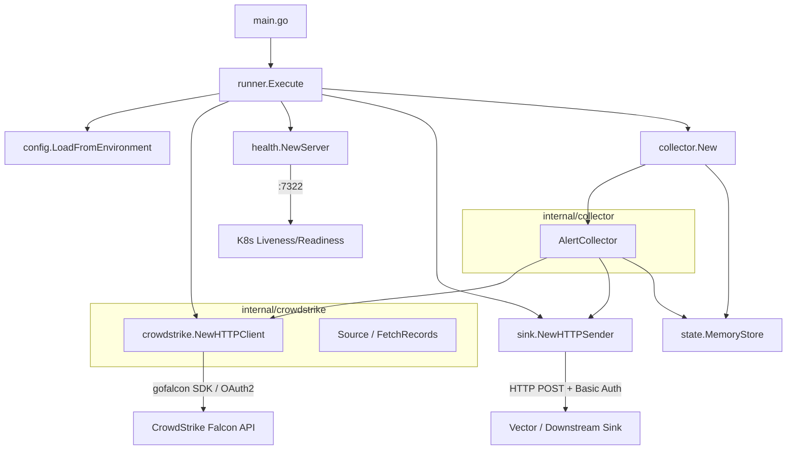
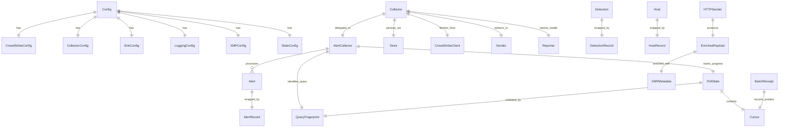
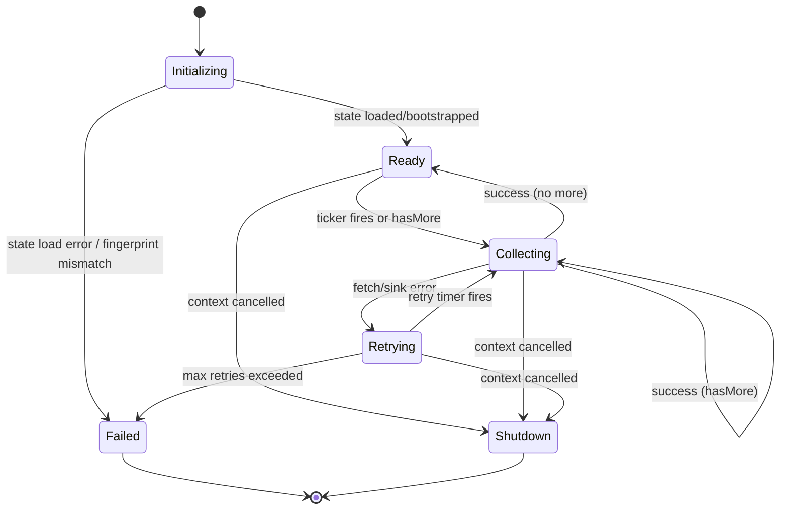

# Poller-Cobra: Full Codebase Ingestion Analysis

> CrowdStrike Falcon API poller for 1898 & Co MSSP platform (xMP).
> Analyzed 2026-04-13. Source: `github.com/1898andCo/poller-cobra`

---

## Table of Contents

1. [Executive Summary](#executive-summary)
2. [Architecture](#architecture)
3. [Authentication & API Connection](#authentication--api-connection)
4. [Data Model & Schema](#data-model--schema)
5. [Polling & Collection Loop](#polling--collection-loop)
6. [Error Handling & Retry Patterns](#error-handling--retry-patterns)
7. [Configuration & Credential Management](#configuration--credential-management)
8. [Sink / Downstream Delivery](#sink--downstream-delivery)
9. [State Management & Cursor Tracking](#state-management--cursor-tracking)
10. [Health & Observability](#health--observability)
11. [Deployment Topology](#deployment-topology)
12. [Behavioral Contracts](#behavioral-contracts)
13. [Domain Model (Mermaid)](#domain-model-mermaid)
14. [Gaps & Incomplete Implementations](#gaps--incomplete-implementations)
15. [Key Findings for Prism Unified Server](#key-findings-for-prism-unified-server)

---

## Executive Summary

`poller-cobra` is a Go service (Go 1.25.7) that polls the CrowdStrike Falcon API for security alerts, enriches them with xMP site/cluster metadata, and forwards the enriched JSON payloads to a downstream HTTP endpoint (Vector). It runs as a single long-lived process inside Kubernetes, deployed via Helm chart. The CrowdStrike SDK (`gofalcon` v0.18.0) handles OAuth2 token management transparently. The polling loop uses exponential backoff retry with cursor-based state tracking to guarantee at-least-once delivery and forward-only progress.

**Maturity assessment:** The alerts pipeline is fully implemented end-to-end. Detections and hosts data sources have plumbed routing but stub fetch implementations (return empty slices). The state store config supports file-backed persistence but the runner hardcodes `MemoryStore` -- file store is not yet implemented.

---

## Architecture

### Component Diagram



### Layer Structure

| Layer | Package | Responsibility |
|-------|---------|---------------|
| Entry | `main.go` | CLI flags (`--dry-run`), pprof startup, calls `runner.Execute` |
| Orchestration | `internal/app/runner` | Signal handling (SIGTERM/SIGINT), component wiring, config loading, startup sequence |
| Collection | `internal/collector` | Polling loop, exponential backoff retry, cursor management, batch orchestration |
| Source | `internal/crowdstrike` | CrowdStrike Falcon API client (gofalcon SDK wrapper), domain types, record adapters |
| Sink | `internal/sink` | HTTP POST delivery with Basic Auth, xMP payload enrichment |
| State | `internal/state` | Cursor, PollState, QueryFingerprint, BatchReceipt, MemoryStore |
| Config | `internal/config` | Env var loading, secret file reading, validation, defaults |
| Health | `internal/health` | HTTP health server with per-IP rate limiting, liveness/readiness |
| Errors | `internal/apperrors` | Sentinel error definitions |
| Profiling | `internal/profiling` | Opt-in pprof HTTP server |

### Startup Sequence

1. Parse `--dry-run` flag; if set, validate config and exit
2. Start pprof server (if `ENABLE_PPROF=1`)
3. `runner.Execute`:
   a. Register SIGTERM/SIGINT signal handler via `signal.NotifyContext`
   b. Load config: `DefaultConfig()` -> `LoadFromEnvironment()` -> `Validate()`
   c. Initialize logger (charmbracelet/log, JSON format)
   d. Initialize state store (currently hardcoded `MemoryStore`)
   e. Initialize sink (HTTPSender) if `VECTOR_ENDPOINT` is set
   f. Initialize health server on `:7322`
   g. Create CrowdStrike `HTTPClient` with OAuth2 credentials
   h. **Ping CrowdStrike API** to verify credentials/connectivity (fails fast)
   i. Create `Collector` with alert sub-collector
   j. Start health server in goroutine
   k. Run collector loop (blocks until context cancelled or fatal error)

---

## Authentication & API Connection

### CrowdStrike OAuth2

**Auth mechanism:** OAuth2 Client Credentials flow, handled entirely by the `gofalcon` SDK.

The application provides `ClientID` and `ClientSecret` to `falcon.ApiConfig`, and the SDK transparently:
- Obtains an access token from the CrowdStrike OAuth2 token endpoint
- Caches and refreshes the token as needed
- Injects the Bearer token into all API requests

```go
// internal/crowdstrike/api.go:86-91
config := &falcon.ApiConfig{
    ClientId:     cfg.ClientID,
    ClientSecret: cfg.ClientSecret,
    Cloud:        falcon.Cloud(region),  // "us-1", "us-2", "eu-1", "ap-1"
    Context:      context.Background(),
}
apiClient, err := falcon.NewClient(config)
```

**Key behavioral detail:** The `Cloud` parameter maps to the regional API base URL. Valid regions: `us-1`, `us-2`, `eu-1`, `ap-1` (and others supported by the SDK).

### Connectivity Verification (Ping)

Before entering the poll loop, the runner calls `Ping()` which issues a `limit=1` alerts query. This validates:
- OAuth2 credentials are accepted
- The API is reachable
- The application has the required API scopes

```go
// api.go:307-328 - Ping verifies connectivity via lightweight alerts query
params := alerts.NewQueryV2ParamsWithContext(ctx)
limit := int64(1)
params.SetLimit(&limit)
resp, err := c.inner.Alerts.QueryV2(params)
```

If Ping fails, the application exits immediately (fail-fast design).

### Sink Authentication

The downstream Vector endpoint uses **HTTP Basic Authentication**:

```go
req.SetBasicAuth(s.username, s.password)
req.Header.Set("Content-Type", "application/json")
```

---

## Data Model & Schema

### CrowdStrike Domain Types

#### Alert (fully implemented)

```go
type Alert struct {
    ID        string                 // CrowdStrike alert ID
    Timestamp time.Time              // Alert timestamp
    Severity  string                 // Severity name (e.g., "High", "Critical")
    Source    string                 // Product that generated the alert
    Status    string                 // Alert status (e.g., "open", "closed")
    Raw       map[string]interface{} // Full alert data for downstream
}
```

**Raw field mapping** (`alertToMap` in api.go:204-275) -- this is what actually gets sent to the sink:

| Field | Source | Type |
|-------|--------|------|
| `id` | `a.ID` | string |
| `composite_id` | `a.CompositeID` | string |
| `aggregate_id` | `a.AggregateID` | string |
| `cid` | `a.Cid` | string (customer ID) |
| `timestamp` | `a.Timestamp` | RFC3339 string |
| `created_timestamp` | `a.CreatedTimestamp` | RFC3339 string |
| `updated_timestamp` | `a.UpdatedTimestamp` | RFC3339 string |
| `status` | `a.Status` | string |
| `severity` | `a.Severity` | integer |
| `severity_name` | `a.SeverityName` | string |
| `confidence` | `a.Confidence` | integer |
| `name` | `a.Name` | string |
| `display_name` | `a.DisplayName` | string |
| `description` | `a.Description` | string |
| `type` | `a.Type` | string |
| `product` | `a.Product` | string |
| `platform` | `a.Platform` | string |
| `tactic` | `a.Tactic` | string (MITRE ATT&CK) |
| `tactic_id` | `a.TacticID` | string |
| `technique` | `a.Technique` | string (MITRE ATT&CK) |
| `technique_id` | `a.TechniqueID` | string |
| `objective` | `a.Objective` | string |
| `agent_id` | `a.AgentID` | string |
| `cmdline` | `a.Cmdline` | string slice |
| `filename` | `a.Filename` | string slice |
| `filepath` | `a.Filepath` | string slice |
| `sha256` | `a.Sha256` | string slice |
| `md5` | `a.Md5` | string slice |
| `assigned_to_name` | `a.AssignedToName` | string |
| `assigned_to_uuid` | `a.AssignedToUUID` | string |
| `resolution` | `a.Resolution` | string |
| `tags` | `a.Tags` | string slice |
| `*` (additional) | `a.DetectsAlertAdditionalProperties` | map overflow |

#### Detection (stub -- returns empty)

```go
type Detection struct {
    ID        string
    Timestamp time.Time
    Severity  string
    Status    string
    Raw       map[string]interface{}
}
```

#### Host (stub -- returns empty)

```go
type Host struct {
    ID        string
    Hostname  string
    Status    string
    Timestamp time.Time
    Raw       map[string]any
}
```

### Record Interface (source.go)

All data types implement a common `Record` interface for the collector:

```go
type Record interface {
    GetID() string
    GetTimestamp() int64  // Unix milliseconds
    GetType() string     // "alert", "detection", or "host"
}
```

Concrete implementations: `AlertRecord`, `DetectionRecord`, `HostRecord`.

### Enriched Payload (what hits the wire)

The sink wraps every record in an enriched envelope before POSTing:

```json
{
    "data": { /* raw alert map serialized as JSON */ },
    "xmp": {
        "site": "site-identifier",
        "cluster_name": "k8s-cluster-name",
        "node_name": "node-hostname"
    }
}
```

### State Model

```go
type PollState struct {
    Cursor    Cursor           // Position in the source stream
    Query     QueryFingerprint // Hash of query params to detect config drift
    UpdatedAt time.Time
    Version   uint64           // Monotonically increasing version counter
}

type Cursor struct {
    Timestamp time.Time  // Timestamp of last processed record
    RecordID  string     // ID of last processed record
}

type QueryFingerprint struct {
    Hash   string    // SHA-256 of sorted fields + limit
    Fields []string  // [region, sourceType, filter]
    Limit  int
}

type BatchReceipt struct {
    Version       uint64
    RequestHash   string
    Count         int
    FirstRecordID string
    LastRecordID  string
    FetchedAt     time.Time
    CursorApplied Cursor
}
```

---

## Polling & Collection Loop

### Two-Step Fetch Pattern (Alerts)

CrowdStrike alerts use a two-step retrieval:

1. **Query for IDs:** `Alerts.QueryV2` with filter, limit, sort by `timestamp|desc`
2. **Fetch full details:** `Alerts.PostEntitiesAlertsV1` with the returned IDs

```go
// Step 1: Query for alert IDs
queryParams := alerts.NewQueryV2ParamsWithContext(ctx)
queryParams.SetLimit(&limitInt64)
queryParams.SetFilter(&filter)
sort := "timestamp|desc"
queryParams.SetSort(&sort)
queryResp, err := c.inner.Alerts.QueryV2(queryParams)

// Step 2: Fetch full alert details
entitiesParams := alerts.NewPostEntitiesAlertsV1ParamsWithContext(ctx)
entitiesParams.SetBody(&models.DetectsapiPostEntitiesAlertsV1Request{
    Ids: alertIDs,
})
entitiesResp, err := c.inner.Alerts.PostEntitiesAlertsV1(entitiesParams)
```

### Collection Lifecycle (collector.go)

```
Initialize State
    |
    v
[Load stored PollState] --not found--> [Bootstrap with initial cursor, version=0]
    |                                          |
    v                                          v
[Verify QueryFingerprint matches] ---------> [Save initial state]
    |
    v
Set Health = Ready
    |
    v
+---> collectOnce()
|        |
|        v
|    AlertCollector.Collect(ctx, alertState)
|        |
|        +---> FetchAlerts(ctx, filter, limit)
|        +---> Sort by timestamp ASC
|        +---> Filter: only alerts AFTER current cursor
|        +---> Send each to sink (one-by-one, in order)
|        +---> Advance cursor to last processed alert
|        +---> Verify forward progress (cursor must advance)
|        +---> Create BatchReceipt
|        +---> Save state + receipt
|        |
|        v
|    hasMore? (len(newAlerts) >= limit)
|        |
|        +--yes--> continue immediately (no wait)
|        +--no---> wait on ticker (default 30s)
|
+--- On error: exponential backoff retry (2s base, 30s max, 5 max attempts)
```

### Cursor Advancement Logic

The cursor uses a composite comparison: `(Timestamp, RecordID)`.

```go
func isCursorAhead(previous, next state.Cursor) bool {
    if next.Timestamp.After(previous.Timestamp) {
        return true
    }
    if next.Timestamp.Equal(previous.Timestamp) && next.RecordID > previous.RecordID {
        return true
    }
    return false
}
```

**Critical invariant:** The cursor can only move forward. `ensureForwardProgress()` returns an error if the new cursor is not strictly ahead of the previous one. This prevents reprocessing.

### hasMore / Pagination

If the number of new alerts equals or exceeds the limit, the collector assumes more data is available and immediately runs another fetch cycle without waiting for the ticker. This creates a burst-fetch pattern for catching up on backlogs.

---

## Error Handling & Retry Patterns

### Sentinel Errors

All domain errors are defined in `internal/apperrors/errors.go`:

| Error | Meaning |
|-------|---------|
| `ErrConfigValidationFailed` | Invalid configuration |
| `ErrStateNotFound` | No persisted state exists yet (triggers bootstrap) |
| `ErrQueryFingerprintMismatch` | Config changed since last run; stored state is stale |
| `ErrCursorRegression` | Cursor tried to move backward |
| `ErrCollectorRetriesExceeded` | Exhausted all retry attempts |
| `ErrCollectorStateLoad` | Failed to load stored state |
| `ErrCollectorStatePersist` | Failed to persist state |
| `ErrSourceConfigMissing` | Source API config incomplete |
| `ErrSourceRequestBuild` | Failed to build source request |
| `ErrSourceRequestExec` | Source API call failed |
| `ErrSourceUnexpectedStatus` | Source returned unexpected HTTP status |
| `ErrSourceDecode` | Failed to decode source response |
| `ErrSinkConfigMissing` | Sink config incomplete |
| `ErrSinkRequestBuild` | Failed to build sink request |
| `ErrSinkDelivery` | Sink rejected or failed to accept data |
| `ErrClientNotInitialized` | API client is nil |

### Retry Strategy

**Exponential backoff** in the collector run loop:

| Parameter | Default | Env Var |
|-----------|---------|---------|
| Base delay | 2s | `COLLECTOR_RETRY_BASE_DELAY` |
| Max delay | 30s | `COLLECTOR_RETRY_MAX_DELAY` |
| Max retries | 5 | `COLLECTOR_MAX_RETRIES` |

```
Attempt 1: wait 2s
Attempt 2: wait 4s
Attempt 3: wait 8s
Attempt 4: wait 16s
Attempt 5: wait 30s (capped)
Attempt 6: FATAL - ErrCollectorRetriesExceeded
```

On success, retry count and delay reset to base values.

### Error Propagation Pattern

All errors use `fmt.Errorf("context: %w", err)` wrapping with sentinel errors for `errors.Is()` checking. The runner catches top-level errors and logs them. `context.Canceled` is treated as graceful shutdown (returns `nil`).

### Health State Transitions on Error

- Collection failure: `SetNotReady()`
- Collection success: `SetReady()`
- Shutdown: `SetNotReady()`

---

## Configuration & Credential Management

### Environment Variables (Complete List)

#### CrowdStrike Source

| Variable | Required | Default | Description |
|----------|----------|---------|-------------|
| `CROWDSTRIKE_CLIENT_ID` | Yes | - | OAuth2 Client ID |
| `CROWDSTRIKE_CLIENT_SECRET` | Yes | - | OAuth2 Client Secret |
| `CROWDSTRIKE_CLIENT_ID_FILE` | No | - | File path for Client ID (K8s secret mount) |
| `CROWDSTRIKE_CLIENT_SECRET_FILE` | No | - | File path for Client Secret (K8s secret mount) |
| `CROWDSTRIKE_REGION` | No | `us-1` | API region: us-1, us-2, eu-1, ap-1 |
| `CROWDSTRIKE_DATA_SOURCE` | No | `alerts` | Data source: alerts, detections, hosts |
| `CROWDSTRIKE_LIMIT` | No | `100` | Max records per API fetch |
| `CROWDSTRIKE_FILTER` | No | `""` | FQL filter string |

#### Collector

| Variable | Required | Default | Description |
|----------|----------|---------|-------------|
| `COLLECTOR_INTERVAL` | No | `30s` | Polling interval |
| `COLLECTOR_MAX_RETRIES` | No | `5` | Max retry attempts before fatal |
| `COLLECTOR_RETRY_BASE_DELAY` | No | `2s` | Initial retry delay |
| `COLLECTOR_RETRY_MAX_DELAY` | No | `30s` | Maximum retry delay |
| `HEALTH_ADDR` | No | `:7322` | Health server bind address |

#### Sink (Vector)

| Variable | Required | Default | Description |
|----------|----------|---------|-------------|
| `VECTOR_ENDPOINT` | No* | - | HTTP endpoint URL (*optional but no forwarding without it) |
| `VECTOR_USERNAME` | No | - | Basic auth username |
| `VECTOR_PASSWORD` | No | - | Basic auth password |
| `VECTOR_ENDPOINT_FILE` | No | - | File path for endpoint (K8s) |
| `VECTOR_USERNAME_FILE` | No | - | File path for username (K8s) |
| `VECTOR_PASSWORD_FILE` | No | - | File path for password (K8s) |
| `VECTOR_TIMEOUT_SECONDS` | No | `15s` | HTTP request timeout |

#### State Store

| Variable | Required | Default | Description |
|----------|----------|---------|-------------|
| `STATE_STORE_TYPE` | No | `file` | `file` or `memory` |
| `STATE_STORE_PATH` | No | `/var/lib/poller-cobra/state.json` | File store path |
| `STATE_STORE_MAX_RECEIPTS` | No | `100` | Max batch receipts retained |

#### xMP Enrichment

| Variable | Required | Default | Description |
|----------|----------|---------|-------------|
| `XMP_SITE` | No | `""` | Physical/logical site identifier |
| `XMP_CLUSTER_NAME` | No | `""` | K8s cluster name |
| `XMP_NODE_NAME` | No | hostname | Node name (falls back to OS hostname) |

#### Other

| Variable | Required | Default | Description |
|----------|----------|---------|-------------|
| `POLLER_LOG_LEVEL` | No | `INFO` | Log level: DEBUG, INFO, WARN, ERROR, FATAL |
| `ENABLE_PPROF` | No | `false` | Enable pprof profiling server |
| `PPROF_ADDR` | No | `localhost:3030` | pprof bind address |

### Credential Loading Priority

For each secret (ClientID, ClientSecret, Vector creds):

1. **File-backed** (`*_FILE` env var) -- read from mounted file, trim whitespace
2. **Direct env var** -- read from environment, trim whitespace
3. If neither exists for required fields, return error

File reading handles `ErrNotExist` gracefully (returns empty string, not error).

---

## Sink / Downstream Delivery

### Wire Format

Each alert is sent individually as an HTTP POST to the Vector endpoint:

```
POST {VECTOR_ENDPOINT}
Authorization: Basic {base64(username:password)}
Content-Type: application/json

{
    "data": {
        "id": "ldt:abc123",
        "composite_id": "...",
        "timestamp": "2024-01-15T10:30:00Z",
        "status": "open",
        "severity": 4,
        "severity_name": "High",
        "name": "...",
        "tactic": "Defense Evasion",
        "tactic_id": "TA0005",
        "technique": "...",
        "technique_id": "T1055",
        "agent_id": "...",
        "cmdline": ["..."],
        "tags": ["..."],
        ...
    },
    "xmp": {
        "site": "dallas-dc1",
        "cluster_name": "prod-east",
        "node_name": "worker-03"
    }
}
```

### Delivery Semantics

- **One record per HTTP request** (not batched)
- **At-least-once delivery**: state is saved after successful sink delivery; if the process crashes between delivery and state save, the alert will be re-sent on restart
- **Fail-fast on sink error**: If any single send fails, the entire batch is aborted and retried
- **Response body read** on error: Limited to 2048 bytes for error logging

### Vector Configuration

The included `vector.yaml` shows the expected downstream setup:

```yaml
sources:
  poller-cobra:
    type: http_server
    auth:
      username: "${VECTOR_USERNAME}"
      password: "${VECTOR_PASSWORD}"
    address: 0.0.0.0:4413
    encoding: json
sinks:
  console_sink:
    type: console
    inputs: [poller-cobra]
    encoding:
      codec: json
```

---

## State Management & Cursor Tracking

### Query Fingerprint

On startup, a SHA-256 hash is computed from `[region, sourceType, filter, limit]`. If a stored state exists with a different hash, the collector refuses to start (`ErrQueryFingerprintMismatch`). This prevents silently using stale cursor positions after a config change.

### State Persistence

**Currently implemented:** `MemoryStore` only (all state lost on restart).

**Designed but not implemented:** `FileStore` (config supports it, Helm chart provisions PVC at `/var/lib/poller-cobra/`, but `runner.go` hardcodes `state.NewMemoryStore()`).

### Bootstrap Flow

If no state exists:
1. Create initial cursor with zero timestamp
2. Set version = 0
3. Create bootstrap receipt (count=0)
4. Save to store

---

## Health & Observability

### Health Endpoints

| Endpoint | Purpose | Success | Failure |
|----------|---------|---------|---------|
| `GET /health` | Liveness | `200 ok` | `503 unhealthy` |
| `GET /live` | Liveness (alias) | `200 ok` | `503 unhealthy` |
| `GET /ready` | Readiness | `200 ready` | `503 not ready` |

### Rate Limiting

Per-IP rate limiting on health endpoints:
- Default: 100 requests/second, burst of 20
- Returns `429 Too Many Requests` with `Retry-After: 1` header
- Double-checked locking for limiter creation (thread-safe)

### Logging

- Library: `charmbracelet/log`
- Format: JSON with timestamps
- Structured fields: `type`, `endpoint`, `id`, `error`, `filter`, `limit`, etc.
- Secrets are never logged

### Profiling

Optional pprof server gated behind `ENABLE_PPROF=1`:
- Default address: `localhost:3030`
- Warns if binding to non-loopback
- `/debug/pprof/cmdline` is explicitly blocked (returns 404) to avoid exposing process arguments
- Hardened HTTP timeouts (read: 10s, write: 120s, idle: 60s)

---

## Deployment Topology

### Container

- **Base image:** `gcr.io/distroless/static-debian12:nonroot`
- **User:** nonroot (UID/GID 65532)
- **Build:** Multi-stage, `CGO_ENABLED=0`, static binary
- **Entrypoint:** `/app/collector`

### Kubernetes (Helm)

- **Replicas:** 1 (singleton -- no horizontal scaling)
- **Security:** `readOnlyRootFilesystem: true`, `allowPrivilegeEscalation: false`, all capabilities dropped, seccomp RuntimeDefault
- **State PVC:** 100Mi at `/var/lib/poller-cobra/`, `ReadWriteOnce`
- **Secrets:** CrowdStrike creds via K8s Secret (auto-generated or existing), sink creds via separate Secret
- **RBAC:** Role with get/list configmaps+secrets, watch secrets

### Helm Chart Version

- Chart version: `0.3.0`
- App version: `0.2.0`
- Migration guards fail-fast on removed v0.2.0 values (`apiKey`, `baseURL`, `timeout`)

---

## Behavioral Contracts

### BC-001: CrowdStrike client rejects empty credentials

**Preconditions:** `ClientID` or `ClientSecret` is empty/whitespace
**Postconditions:** Returns error immediately, no API call made
**Evidence:** `api.go:73-79`, `api_test.go:132-143`
**Confidence:** HIGH

### BC-002: Ping validates credentials via lightweight query

**Preconditions:** HTTPClient is initialized with valid SDK client
**Postconditions:** Returns nil on success, wrapped error on failure; checks both SDK errors and API-level errors in payload
**Error Cases:** nil inner -> `ErrClientNotInitialized`; SDK error -> wrapped; API error message in payload -> wrapped
**Evidence:** `api_test.go:36-130` (6 test cases including nil payload, nil error message)
**Confidence:** HIGH

### BC-003: FetchAlerts uses two-step ID-then-details pattern

**Preconditions:** Client initialized, limit > 0, context not cancelled
**Postconditions:** Returns sorted alerts with full detail including raw map; empty slice (not nil) when no results
**Error Cases:** nil inner -> `ErrClientNotInitialized`; query failure -> wrapped error; entities failure -> wrapped error
**Evidence:** `api.go:111-193`
**Confidence:** HIGH

### BC-004: Cursor only advances forward

**Preconditions:** Previous cursor and new cursor exist
**Postconditions:** New cursor's timestamp is strictly after previous, OR same timestamp with lexicographically greater RecordID
**Error Cases:** Returns error if cursor would regress
**Evidence:** `alert_collector.go:135-152`
**Confidence:** HIGH

### BC-005: Alerts with zero timestamp are skipped

**Preconditions:** Alert has `Timestamp.IsZero() == true`
**Postconditions:** Alert is excluded from processing, warning logged
**Evidence:** `alert_collector.go:124-126`
**Confidence:** HIGH

### BC-006: Query fingerprint mismatch prevents startup

**Preconditions:** Stored state exists with different query fingerprint hash than current config
**Postconditions:** Returns `ErrQueryFingerprintMismatch`, collector does not start
**Evidence:** `collector.go:177-179`
**Confidence:** HIGH

### BC-007: Config loading prioritizes file-backed secrets over env vars

**Preconditions:** Both `*_FILE` and direct env var are set
**Postconditions:** File-backed value wins; file not found returns empty (falls through to env var)
**Evidence:** `config.go:186-193`
**Confidence:** HIGH

### BC-008: Exponential backoff caps at max delay and max retries

**Preconditions:** Collection attempt fails
**Postconditions:** Delay doubles each attempt up to `RetryMaxDelay`; after `MaxRetries` attempts, returns `ErrCollectorRetriesExceeded`
**Evidence:** `collector.go:128-148`
**Confidence:** HIGH

### BC-009: Sink enriches every payload with xMP metadata

**Preconditions:** Sink configured with xMP config
**Postconditions:** Every payload wrapped in `{"data": ..., "xmp": {...}}` envelope
**Evidence:** `http_sender.go:121-149`
**Confidence:** HIGH

### BC-010: Health readiness tracks collector state

**Preconditions:** Health server running
**Postconditions:** Not ready before first successful collection; ready after success; not ready after failure
**Evidence:** `collector.go:100-111`, `collector.go:131-154`
**Confidence:** HIGH

---

## Domain Model (Mermaid)



### State Machine: Collector Lifecycle



---

## Gaps & Incomplete Implementations

### Critical

1. **FileStore not implemented** -- `StateConfig` supports `file` type, Helm chart provisions PVC, but `runner.go:61` hardcodes `state.NewMemoryStore()`. All state is lost on pod restart.

2. **Detections fetch is a stub** -- `FetchDetections()` logs and returns empty slice. The Source routing and Record adapter are wired but the actual API call is missing.

3. **Hosts fetch is a stub** -- Same as detections: `FetchHosts()` returns empty slice.

### Moderate

4. **No pagination across API pages** -- `FetchAlerts` queries with a single limit and does not use offset/pagination tokens. If CrowdStrike has more alerts than the limit, only the first page is returned per cycle (mitigated by `hasMore` triggering immediate re-fetch, but the same query may return the same page).

5. **Single-record delivery** -- Each alert is POSTed individually to the sink. No batching. For high-volume scenarios this creates significant HTTP overhead.

6. **No sink retry** -- If a sink `Send()` fails, the entire batch is aborted and the collector-level retry kicks in. There's no per-record retry at the sink layer.

7. **Rate limiter memory growth** -- Per-IP rate limiters in the health server are never evicted. Long-running instances with many unique source IPs could accumulate limiters.

### Minor

8. **`parseLogLevel` only handles DEBUG/INFO/TRACE** -- WARN, ERROR, FATAL are in the config validator but the runner's `parseLogLevel` returns error for them (defaults to INFO with warning log).

9. **COLLECTOR_INTERVAL format** -- Accepts Go duration strings (`30s`, `1m`) but not plain integers, which could confuse operators.

---

## Key Findings for Prism Unified Server

### Patterns to Preserve

1. **Two-step fetch pattern** (query IDs then fetch details) is required by the CrowdStrike Alerts API. This must be replicated in the Rust implementation.

2. **OAuth2 via SDK** -- The gofalcon SDK handles token lifecycle. In Rust, we'll need an equivalent (likely `reqwest` with a custom OAuth2 middleware or the `oauth2` crate).

3. **Cursor-based forward-only progress** with `(Timestamp, RecordID)` composite comparison is a sound design. The QueryFingerprint hash for detecting config drift is worth preserving.

4. **xMP enrichment envelope** `{"data": ..., "xmp": {...}}` is the expected wire format for all pollers' output.

5. **File-backed secret loading** with K8s secret mount support is standard across all pollers.

6. **Exponential backoff** with configurable base/max/retries is the standard retry pattern.

### Architecture Decisions

| Decision | Rationale |
|----------|-----------|
| Single replica | Polling is inherently singleton to avoid duplicate processing |
| At-least-once delivery | Simpler than exactly-once; downstream must be idempotent |
| Fail-fast on startup | Ping before entering loop catches credential issues immediately |
| Sentinel errors | Enables `errors.Is()` checking across package boundaries |
| Per-alert sink delivery | Simplicity; acceptable for CrowdStrike alert volumes |
| JSON structured logging | Machine-parseable for log aggregation |

### Interface Contracts for Rust Implementation

```
Source trait:
    fn fetch_alerts(ctx, filter: &str, limit: i32) -> Result<Vec<Alert>>
    fn fetch_detections(ctx, filter: &str, limit: i32) -> Result<Vec<Detection>>
    fn fetch_hosts(ctx, filter: &str, limit: i32) -> Result<Vec<Host>>
    fn ping(ctx) -> Result<()>

Sink trait:
    fn send(ctx, record: &Value, record_id: &str, record_type: &str) -> Result<()>

Store trait:
    fn load(ctx) -> Result<PollState>
    fn save(ctx, state: PollState, receipt: BatchReceipt) -> Result<()>

HealthReporter trait:
    fn set_ready()
    fn set_not_ready()
```

### CrowdStrike API Details

- **SDK:** `gofalcon` v0.18.0
- **Auth:** OAuth2 Client Credentials (ClientID + ClientSecret)
- **Regions:** us-1, us-2, eu-1, ap-1
- **Alerts query endpoint:** `QueryV2` (GET, returns IDs)
- **Alerts detail endpoint:** `PostEntitiesAlertsV1` (POST, returns full objects)
- **Sort:** `timestamp|desc`
- **Filter language:** FQL (Falcon Query Language)
- **Default limit:** 100 records per fetch

### Dependencies to Map

| Go Dependency | Purpose | Rust Equivalent |
|---------------|---------|-----------------|
| `gofalcon` v0.18.0 | CrowdStrike SDK | Custom REST client (no official Rust SDK) |
| `charmbracelet/log` | Structured logging | `tracing` + `tracing-subscriber` |
| `golang.org/x/time/rate` | Rate limiting | `governor` or `tower::limit` |
| `net/http` | HTTP client/server | `reqwest` (client), `axum` (server) |
| `crypto/sha256` | Fingerprint hashing | `sha2` crate |
| `encoding/json` | JSON serialization | `serde` + `serde_json` |
