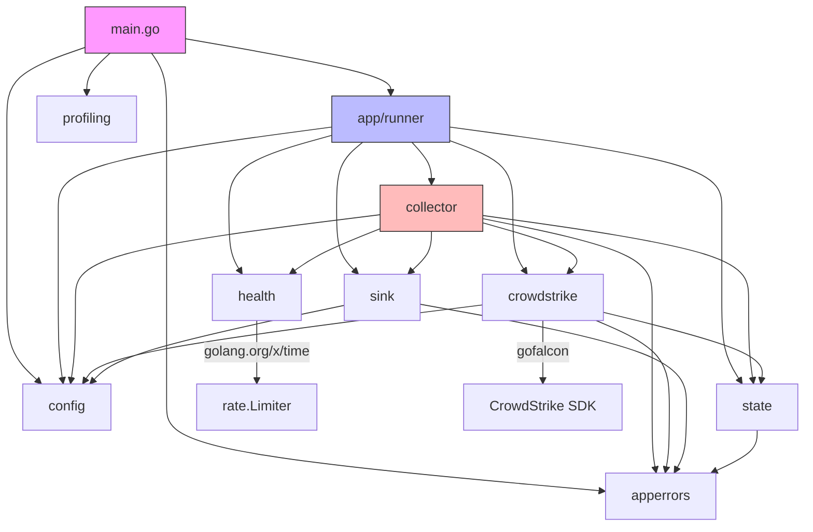

# Pass 0 Deep: Inventory -- poller-cobra (Round 1)

> Convergence deepening round 1. Full file-by-file audit against broad sweep claims.

---

## Tech Stack (Verified)

| Aspect | Value | Broad Sweep Claim | Status |
|--------|-------|-------------------|--------|
| Language | Go 1.25.7 | Go 1.25.7 | Correct |
| Module path | `github.com/1898andCo/poller-cobra` | Correct | Verified |
| Build system | `go build` + Makefile + Docker multi-stage | Correct | Verified |
| Test framework | stdlib `testing` | Not explicitly stated | Added |
| Formatter | gofumpt (via pre-commit, Makefile, golangci-lint) | Not mentioned | Added |
| Linter | golangci-lint v2.9.0 (via tools module) | Mentioned | Version verified |
| Security scanners | gosec v2.22.11, govulncheck, staticcheck 2026.1 | Not in broad sweep | Added |
| Container registry | Cloudsmith (`docker.cloudsmith.io/1898-and-co/poller-cobra`) | Mentioned | Verified |
| Helm chart registry | Cloudsmith (`cloudsmith.io/1898-and-co/poller-cobra`) | Not in broad sweep | Added |
| Dependency management | Renovate with custom rules | Not in broad sweep | Added |
| Pre-commit | go-fumpt, go-build-mod, go-mod-tidy, trailing-whitespace, end-of-file-fixer, check-added-large-files | Not in broad sweep | Added |
| Python version | 3.12 (for Cloudsmith CLI in CI) | Not mentioned | Added |

## Key Dependencies (Verified from go.mod)

### Direct Dependencies (3 only)

| Dependency | Version | Purpose | Broad Sweep |
|------------|---------|---------|-------------|
| `charmbracelet/log` | v0.4.0 | Structured JSON logging | Listed |
| `crowdstrike/gofalcon` | v0.18.0 | CrowdStrike Falcon SDK | Listed |
| `golang.org/x/time` | v0.8.0 | Rate limiting (`rate.Limiter`) | Listed |

**Correction:** The broad sweep lists 6 dependencies in the Rust equivalents table. However, `net/http`, `crypto/sha256`, and `encoding/json` are stdlib -- not external deps. The actual external dependency count is exactly 3.

### Indirect Dependencies (notable)

| Dependency | Why Present |
|------------|------------|
| `golang.org/x/oauth2` v0.30.0 | Pulled in by gofalcon for OAuth2 |
| `go-openapi/*` suite | Pulled in by gofalcon (OpenAPI generated client) |
| `stretchr/testify` v1.11.1 | Indirect, not used in test files (tests use stdlib only) |

### Tools Module (separate go.mod at `tools/`)

| Tool | Purpose |
|------|---------|
| `golangci-lint` v2.9.0 | Linting |
| `govulncheck` | Vulnerability checking |
| `go.uber.org/mock/mockgen` | Mock generation (not yet used -- no mocks in codebase) |
| `golang.org/x/tools/cmd/stringer` | Enum stringer generation (not yet used) |

**Discovery:** `mockgen` and `stringer` are declared as tool dependencies but are never invoked. No `//go:generate` directives exist in the codebase. The `make generate` target runs `go generate ./...` but there's nothing to generate.

## File Manifest (Complete)

### Go Source Files (14 production + 3 test = 17 total)

| Path | Lines | Type | Priority | Purpose |
|------|-------|------|----------|---------|
| `main.go` | 53 | Entry | Highest | CLI flags, pprof startup, runner.Execute |
| `internal/app/runner/runner.go` | 142 | Orchestration | Highest | Signal handling, component wiring, startup |
| `internal/config/config.go` | 462 | Config | High | Env var loading, validation, defaults |
| `internal/config/utils.go` | 57 | Config | High | ValidateConfig for --dry-run, redactSecret |
| `internal/crowdstrike/api.go` | 328 | Source | High | CrowdStrike API client, alert mapping |
| `internal/crowdstrike/source.go` | 184 | Source | Medium | Unused Source/Record abstractions |
| `internal/collector/collector.go` | 258 | Core | Highest | Polling loop, retry, state management |
| `internal/collector/alert_collector.go` | 152 | Core | Highest | Alert fetch, filter, deliver, cursor |
| `internal/sink/http_sender.go` | 149 | Sink | High | HTTP POST with xMP enrichment |
| `internal/sink/sink.go` | 11 | Sink | Medium | Sender interface definition |
| `internal/state/store.go` | 123 | State | High | Store interface, MemoryStore, types |
| `internal/health/server.go` | 172 | Health | Medium | Health endpoints, rate limiting |
| `internal/profiling/pprof.go` | 95 | Profiling | Lower | Opt-in pprof server |
| `internal/apperrors/errors.go` | 60 | Errors | Medium | 17 sentinel error definitions |
| **Production total** | **2,259** | | | |
| `internal/crowdstrike/api_test.go` | 184 | Test | Medium | 4 top-level test funcs (Ping w/6 subtests, 3 nil-inner) |
| `internal/health/server_test.go` | 286 | Test | Medium | 12 test funcs (health, rate limiting) |
| `internal/profiling/pprof_test.go` | 211 | Test | Medium | 9 test funcs (pprof lifecycle, isLoopback w/7 subtests) |
| **Test total** | **684** | | | |
| **Grand total Go** | **2,943** | | | |

### Non-Go Files (Complete Inventory)

| Path | Type | Lines | Purpose |
|------|------|-------|---------|
| `go.mod` | Dependency | 247 | Module definition + deps |
| `go.sum` | Lock | ~2200 | Dependency checksums |
| `Makefile` | Build | 46 | Build, test, lint, run targets |
| `Dockerfile` | Container | 46 | Multi-stage distroless build |
| `vector.yaml` | Config | 20 | Local Vector dev config |
| `.golangci.yml` | Config | 73 | Linter configuration |
| `.pre-commit-config.yaml` | Config | 29 | Pre-commit hooks |
| `.editorconfig` | Config | 20 | Editor formatting rules |
| `.gitignore` | Config | 46 | Git ignore patterns |
| `.dockerignore` | Config | 34 | Docker ignore patterns |
| `.gitmodules` | Config | 3 | Claude shared-rules submodule |
| `.python-version` | Config | 1 | Python 3.12 |
| `Brewfile` | Config | 5 | Homebrew deps (go, gofumpt, vector) |
| `renovate.json` | Config | 65 | Renovate dependency management |
| `CLAUDE.md` | Docs | ~140 | Claude Code instructions |
| `README.md` | Docs | ~400 | Project documentation |
| `SECURITY.md` | Docs | ~180 | Security policy |
| `LICENSE` | Legal | ~300 | License text |
| `docs/PROFILING.md` | Docs | -- | Profiling guide |
| `docs/PROFILING_FINDINGS.md` | Docs | -- | Performance findings |
| `scripts/setup.sh` | Script | 3 | Local dev env vars |
| `scripts/pprof-harness.sh` | Script | 40 | Profile collection script |
| `tools/go.mod` | Dependency | 213 | Tools module deps |
| `tools/tools.go` | Build | 10 | Tool dependency imports |

### Helm Chart Files

| Path | Purpose |
|------|---------|
| `deploy/helm/poller-cobra/Chart.yaml` | Chart metadata (v0.3.0 / app v0.2.0) |
| `deploy/helm/poller-cobra/values.yaml` | Default values |
| `deploy/helm/poller-cobra/ci/test-values.yaml` | CI test values |
| `deploy/helm/poller-cobra/templates/_helpers.tpl` | Template helpers |
| `deploy/helm/poller-cobra/templates/deployment.yaml` | Deployment template |
| `deploy/helm/poller-cobra/templates/service.yaml` | ClusterIP service |
| `deploy/helm/poller-cobra/templates/pvc.yaml` | PVC for state storage |
| `deploy/helm/poller-cobra/templates/rbac.yaml` | Role + RoleBinding |
| `deploy/helm/poller-cobra/templates/secret.yaml` | Auto-generated CrowdStrike secret |
| `deploy/helm/poller-cobra/templates/serviceaccount.yaml` | ServiceAccount |

### CI Workflow Files (7)

| Path | Trigger | Purpose |
|------|---------|---------|
| `.github/workflows/build.yml` | push/PR/release | Docker build + push to Cloudsmith |
| `.github/workflows/collector-tests.yml` | push/PR | Go build + `go test ./...` |
| `.github/workflows/lint-test.yml` | PR (helm paths) | Helm chart lint + kind install test |
| `.github/workflows/helm-release.yml` | push (helm paths) | Package + push Helm chart to Cloudsmith |
| `.github/workflows/security-scan.yml` | push/PR/daily cron | gosec + govulncheck + staticcheck |
| `.github/workflows/validate-codeowners.yml` | PR | CODEOWNERS validation |
| `.github/workflows/version-check.yml` | push/PR (helm paths) | Chart version consistency check |

## Dependency Graph (Verified)



**Correction from broad sweep:** The broad sweep dependency graph does not show `crowdstrike/source.go` importing `config` and `state` packages. This cross-package dependency exists (for `config.CrowdStrikeConfig` and `state.Cursor`) but is through the unused `Source` type. In practice, `runner.go` never uses `source.go`; it creates `HTTPClient` directly.

## Entry Points (Verified)

1. **`main.go:main()`** -- CLI entry point. Two modes:
   - `--dry-run`: calls `config.ValidateConfig()` and exits
   - Normal: calls `profiling.Start()` then `runner.Execute(ctx)`

2. **`runner.Execute(ctx)`** -- Application entry point for all non-dry-run operation

3. **No HTTP API entry** -- The health server and pprof server are internal HTTP servers, not external APIs.

## Files Not Mentioned in Any Prior Analysis

| File | Why Missed | Significance |
|------|-----------|--------------|
| `.github/workflows/security-scan.yml` | CI file | Documents security scanning pipeline (gosec, govulncheck, staticcheck), daily cron schedule |
| `.github/workflows/validate-codeowners.yml` | CI file | CODEOWNERS validation |
| `.github/workflows/version-check.yml` | CI file | Chart version consistency checks |
| `.github/CODEOWNERS` | Config | `@1898andCo/application-admins @1898andCo/iac-admins` own everything |
| `renovate.json` | Config | Dependency automation rules with grouped updates, automerge for GH Actions and pre-commit |
| `tools/tools.go` | Build | Declares mockgen and stringer as unused tool deps |
| `.python-version` | Config | Python 3.12 for Cloudsmith CLI |
| `Brewfile` | Config | Homebrew install: go, gofumpt, vector |
| `deploy/helm/poller-cobra/ci/test-values.yaml` | Test | Minimal values for CI chart testing |
| `scripts/pprof-harness.sh` | Script | Collects CPU, heap, goroutine, allocs, block, mutex profiles |
| `docs/PROFILING.md` | Docs | Profiling guide |
| `docs/PROFILING_FINDINGS.md` | Docs | Performance findings |
| `.gitmodules` | Config | Claude shared-rules submodule |

---

## Delta Summary
- New items added: 13 files not mentioned in any prior analysis, tools module discovery (mockgen/stringer unused), accurate LOC counts, CI workflow inventory, Renovate configuration, Python/Brewfile tooling
- Existing items refined: dependency count corrected (3 external, not 6), Source.go cross-package dependency clarified as unused path, test framework identified (stdlib only, no testify usage despite indirect dep)
- Remaining gaps: docs/PROFILING.md and docs/PROFILING_FINDINGS.md content (not critical for spec)

## Novelty Assessment
Novelty: SUBSTANTIVE
The discovery that mockgen and stringer are declared but unused changes the tools picture. The correction from 6 to 3 external dependencies is a material accuracy fix. The full CI pipeline with 7 workflows including daily security scans, chart testing with kind clusters, and automated Cloudsmith publishing was completely absent from all prior analysis. The complete file manifest with accurate LOC (2,259 production, 684 test, 2,943 total Go) corrects the broad sweep's claim of "18 .go files" -- there are actually 17 (14 production + 3 test). The `crowdstrike/README.md` file was listed in the file tree but is not a Go source file.

## Convergence Declaration
Another round needed -- should verify LOC accuracy for non-Go files and audit for any missed patterns in PROFILING docs.

## State Checkpoint
```yaml
pass: 0
round: 1
status: complete
files_scanned: 55+ (all files in repository)
timestamp: 2026-04-13T00:00:00Z
novelty: SUBSTANTIVE
```
