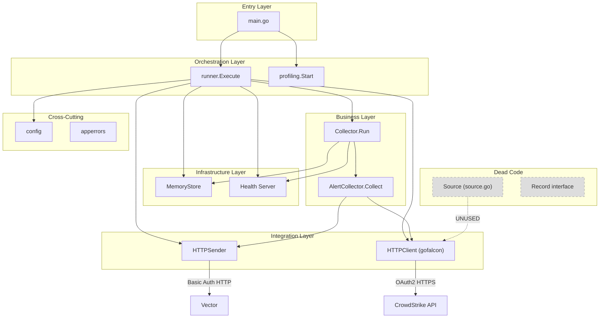

# Pass 1 Deep: Architecture -- poller-cobra (Round 1)

> Convergence deepening round 1. Verified against actual source code, not just broad sweep claims.

---

## Module Boundaries (Verified)

### Package Dependency Matrix

| Package | Imports From | Imported By |
|---------|-------------|-------------|
| `main` | runner, apperrors, config, profiling | -- |
| `app/runner` | collector, config, crowdstrike, health, sink, state, charmbracelet/log | main |
| `collector` | apperrors, config, crowdstrike, health, sink, state, charmbracelet/log | runner |
| `crowdstrike` (api.go) | apperrors, charmbracelet/log, gofalcon | runner, collector |
| `crowdstrike` (source.go) | config, state | **NOBODY** (unused) |
| `config` | stdlib only | runner, collector, crowdstrike/source, sink |
| `sink` | apperrors, config, charmbracelet/log | runner, collector |
| `state` | apperrors | collector, crowdstrike/source |
| `health` | golang.org/x/time/rate | runner, collector |
| `profiling` | charmbracelet/log | main |
| `apperrors` | stdlib errors | crowdstrike, collector, sink, state, main |

### Boundary Violations and Observations

1. **crowdstrike/source.go is dead code.** It imports `config` and `state` packages but is never called from `runner`, `collector`, or anywhere else. The `runner.go` constructs `crowdstrike.HTTPClient` directly, bypassing `Source`. The `Source` type duplicates what the collector does: it creates an HTTPClient, dispatches to the right fetch method, and converts results. This parallel implementation path should be noted for the Rust rewrite.

2. **Collector duplicates CrowdStrike's Client interface.** `collector.CrowdStrikeClient` is identical to `crowdstrike.Client`. This is correct Go style (consumer defines interface) but means the interface contract exists in two places.

3. **No circular dependencies.** Dependency flow is strictly: main -> runner -> {collector, config, crowdstrike, health, sink, state} -> apperrors. No package imports a package that imports it back.

4. **Config is a pure data package.** Zero external dependencies. No interfaces. Just structs, constants, and loading logic. This is clean.

5. **Apperrors is a leaf package.** Only imports stdlib `errors`. All other packages import it. This is the correct position for sentinel errors.

## Layer Structure (Verified and Corrected)

```
Layer 0: Entry        main.go
Layer 1: Orchestration  runner.go
Layer 2: Business       collector/, alert_collector.go
Layer 3: Integration    crowdstrike/api.go, sink/http_sender.go
Layer 4: Infrastructure state/store.go, health/server.go, profiling/pprof.go
Layer 5: Cross-cutting  config/, apperrors/
```

**Correction from broad sweep:** The broad sweep lists Source/FetchRecords as part of Layer 3 (Source). It should be noted that `source.go` is dead code and not part of the active layer structure. The actual active integration layer for CrowdStrike is `api.go` only.

## Component Catalog (Verified)

### Active Components

| Component | File | Responsibility | State |
|-----------|------|---------------|-------|
| CLI & Profiling | main.go | Flag parsing, pprof lifecycle | Stateless |
| Runner | runner/runner.go | Signal handling, config loading, component wiring, startup sequence | Stateless (orchestrator) |
| Collector | collector/collector.go | Polling loop, exponential backoff retry, health state transitions | Stateful (alertState, retryCount, retryDelay) |
| AlertCollector | collector/alert_collector.go | Alert fetch, sort, filter, deliver, cursor advance | Stateless (receives state as parameter) |
| HTTPClient | crowdstrike/api.go | CrowdStrike SDK wrapper, OAuth2, two-step fetch | Stateful (inner SDK client) |
| HTTPSender | sink/http_sender.go | HTTP POST with Basic Auth, xMP enrichment | Stateful (http.Client, xmpConfig) |
| MemoryStore | state/store.go | In-memory state persistence | Stateful (PollState, BatchReceipt) |
| Health Server | health/server.go | Liveness/readiness endpoints, per-IP rate limiting | Stateful (alive, ready, limiters map) |
| Pprof Server | profiling/pprof.go | Opt-in profiling server | Stateful (http.Server) |
| Config | config/config.go | Config structs, env loading, validation | Stateless (pure functions) |
| Errors | apperrors/errors.go | Sentinel error definitions | Stateless (constants) |

### Inactive/Dead Components

| Component | File | Status | Notes |
|-----------|------|--------|-------|
| Source | crowdstrike/source.go | Dead code | Never called by runner or collector |
| Record/AlertRecord/DetectionRecord/HostRecord | crowdstrike/source.go | Dead code | Interface + implementations never consumed |
| NewSourceFromEnv | crowdstrike/source.go | Dead code | Convenience constructor never called |

## Startup Sequence (Verified Line-by-Line)

```
main.main()
  |-- flag.Parse() [--dry-run]
  |-- if dry-run: config.ValidateConfig() -> exit
  |-- run()
       |-- profiling.Start()
       |     |-- checks ENABLE_PPROF env
       |     |-- if enabled: net.Listen, srv.Serve in goroutine
       |     |-- returns shutdown func
       |-- runner.Execute(ctx)
            |-- nil ctx guard -> context.Background()
            |-- signal.NotifyContext(SIGTERM, SIGINT)
            |-- log.NewWithOptions(stdout, JSON, timestamps)
            |-- config.DefaultConfig()
            |-- config.LoadFromEnvironment(cfg) -> cfg
            |-- cfg.Validate()
            |-- parseLogLevel(cfg.Logging.Level)
            |-- state.NewMemoryStore()   [TODO: use cfg.State]
            |-- if cfg.Sink.Endpoint != "":
            |     sink.NewHTTPSender(cfg.Sink, cfg.XMP, logger)
            |-- health.NewServer(cfg.Collector.HealthAddr)
            |-- crowdstrike.NewHTTPClient({ClientID, ClientSecret, Region, Logger})
            |-- csClient.Ping(ctx)       [fail-fast]
            |-- collector.New(cfg, csClient, store, opts)
            |-- go healthServer.ListenAndServe()
            |-- col.Run(ctx)             [blocks]
            |     |-- reporter.SetNotReady()
            |     |-- initializeState(ctx)
            |     |     |-- store.Load()
            |     |     |-- if found: check fingerprint hash
            |     |     |-- if not found: bootstrap with zero cursor
            |     |-- reporter.SetReady()
            |     |-- loop:
            |           |-- collectOnce(ctx)
            |           |-- on error: retry with backoff
            |           |-- on success: reset retry, check hasMore
            |           |-- if !hasMore: wait on ticker or ctx.Done
            |-- if err == context.Canceled: log graceful, return nil
```

## Cross-Cutting Concerns (Verified)

### Logging

- **Library:** `charmbracelet/log` v0.4.0
- **Format:** JSON with timestamps (configured in runner.go:37)
- **Levels used:** DEBUG, INFO, WARN, ERROR (via `log.Debug/Info/Warn/Error`)
- **Level parsing bug:** `parseLogLevel` only handles DEBUG/INFO/TRACE. WARN/ERROR/FATAL are accepted by config validation but cause `parseLogLevel` to return error, which falls back to INFO with a warning log. So WARN/ERROR/FATAL log levels are effectively unreachable.
- **Structured fields:** `type`, `endpoint`, `id`, `error`, `filter`, `limit`, `cursor_timestamp`, `cursor_id`, `retry_in`, `size_bytes`, `addr`, `region`, `source_type`, `alerts`, `last_timestamp`, `last_id`, `version`
- **Secret redaction:** Config validation prints redacted secrets (first 2 + last 2 chars). No secrets appear in runtime logs.

### Error Handling

- **Pattern:** `fmt.Errorf("context: %w", err)` wrapping with sentinel errors
- **17 sentinel errors** in `apperrors` package
- **6 unused sentinels:** ErrCursorRegression, ErrSourceConfigMissing, ErrSourceRequestBuild, ErrSourceUnexpectedStatus, ErrSourceDecode, ErrConfigLoad
- **1 bug:** `ensureForwardProgress` creates a plain error instead of wrapping `ErrCursorRegression`
- **Validation:** Uses `errors.Join()` for aggregated validation errors (multi-error)
- **Shutdown:** `context.Canceled` is treated as success (returns nil)

### Authentication

- **CrowdStrike:** OAuth2 Client Credentials flow via gofalcon SDK (transparent token management)
- **Sink (Vector):** HTTP Basic Auth (`username:password`)
- **No mutual TLS**, no API key rotation, no token caching beyond what the SDK provides

### Graceful Shutdown

- **Signal handling:** `signal.NotifyContext(ctx, SIGTERM, SIGINT)` cancels context
- **Collector:** `Run()` loop checks `ctx.Done()` in select and returns `ctx.Err()`
- **Runner:** Catches `context.Canceled` and returns nil (clean exit)
- **Pprof:** `srv.Shutdown(ctx)` with 5-second timeout in deferred cleanup
- **Health server:** Started in goroutine but **never shut down gracefully**. No `Shutdown()` call exists in runner. The goroutine is abandoned on process exit.
- **HTTP client:** No connection drain. `http.Client.Timeout` handles request-level timeout only.

**Discovery:** The health server has a `Shutdown()` method (server.go:159-162) that sets `alive=false` and calls `httpServer.Shutdown()`, but it is never called. The server goroutine in runner.go:111-116 starts `ListenAndServe()` but there is no corresponding shutdown in the defer chain. This means on SIGTERM, the health server will be killed by process exit, not gracefully drained.

## Deployment Topology (Verified)

### Single-Service Singleton

```
                    K8s Cluster
                    +---------------------------------+
                    |  Namespace: poller-cobra         |
                    |                                  |
                    |  Deployment (replicas=1)         |
                    |  +----------------------------+  |
                    |  | Pod                        |  |
                    |  | +------------------------+ |  |
                    |  | | Container: collector    | |  |
                    |  | | :7322 health/ready/live | |  |
                    |  | | (:3030 pprof optional)  | |  |
                    |  | +------------------------+ |  |
                    |  | | PVC: state (100Mi RWO)  | |  |
                    |  | +------------------------+ |  |
                    |  +----------------------------+  |
                    |                                  |
                    |  Service (ClusterIP:7322)        |
                    |  Secret (CrowdStrike creds)      |
                    |  Secret (Sink creds)             |
                    |  ServiceAccount + RBAC            |
                    +---------------------------------+
                         |                      |
                         v                      v
              CrowdStrike API         Vector (HTTP sink)
              (OAuth2, HTTPS)         (Basic Auth, HTTP)
```

### Why Singleton

The polling loop uses cursor-based state tracking. Running multiple replicas would create duplicate fetches and cursor contention. This is by design -- CrowdStrike polling is inherently single-consumer.

### Container Security

| Control | Value |
|---------|-------|
| Base image | distroless/static-debian12:nonroot |
| User | 65532:65532 (nonroot) |
| runAsNonRoot | true |
| readOnlyRootFilesystem | true |
| allowPrivilegeEscalation | false |
| capabilities | drop ALL |
| seccomp | RuntimeDefault |
| Binary | static (CGO_ENABLED=0), trimpath, stripped |

## Data Flow (Verified)

```
CrowdStrike Falcon API
    |
    | 1. QueryV2 (GET, filter, limit, sort=timestamp|desc) -> [alert IDs]
    | 2. PostEntitiesAlertsV1 (POST, IDs) -> [full alerts]
    v
HTTPClient.FetchAlerts()
    |
    | []Alert (with Raw map[string]interface{})
    v
AlertCollector.Collect()
    |
    | sort ascending by (Timestamp, ID)
    | filter: skip zero-timestamp, keep only ahead-of-cursor
    | check hasMore: len(newAlerts) >= limit
    v
sink.Send() [per alert, in order]
    |
    | json.Marshal(raw) -> EnrichedPayload{Data: raw, XMP: {...}}
    | HTTP POST with Basic Auth
    v
Vector (http_server source, :4413)
    |
    | console_sink (development)
    | or other Vector pipeline (production)
    v
Downstream
```

## Architecture Diagram (Corrected)



---

## Delta Summary
- New items added: Health server shutdown gap (never called), complete startup sequence with line references, dead code mapping (3 components in source.go), full data flow diagram, cross-cutting concern audit (logging level bug, error handling patterns)
- Existing items refined: Layer structure corrected to exclude dead source.go, dependency matrix verified against actual imports, container security controls listed explicitly
- Remaining gaps: docs/PROFILING_FINDINGS.md may contain architecture insights about performance bottlenecks

## Novelty Assessment
Novelty: SUBSTANTIVE
The discovery that the health server is never gracefully shut down is an architecture-level finding that affects operational behavior. The dead code mapping of `source.go` (3 components, 184 lines) as a parallel implementation path is important for the Rust rewrite -- it represents an abandoned abstraction that should not be replicated. The logging level bug (WARN/ERROR/FATAL unreachable) is a cross-cutting concern that affects observability. These findings would change how you'd spec the system.

## Convergence Declaration
Another round needed -- should verify PROFILING_FINDINGS.md for architecture implications and audit the complete error propagation chain.

## State Checkpoint
```yaml
pass: 1
round: 1
status: complete
files_scanned: all
timestamp: 2026-04-13T00:00:00Z
novelty: SUBSTANTIVE
```
