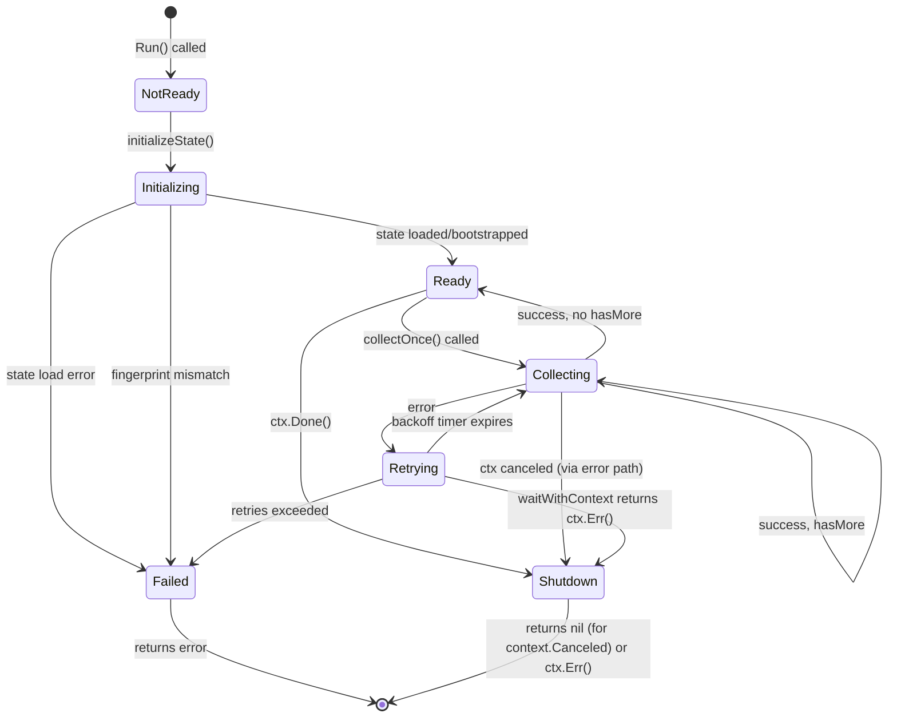
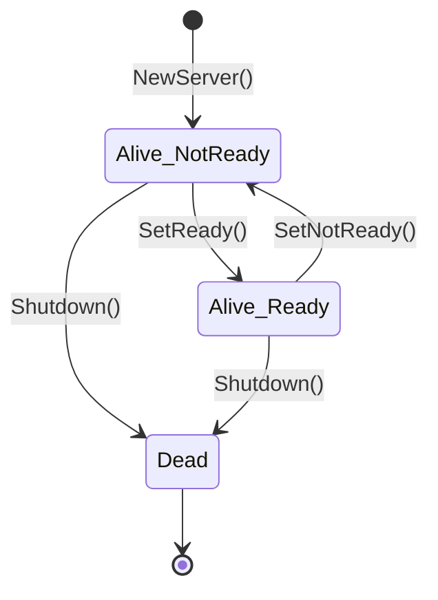

# Pass 2 Deep: Domain Model -- poller-cobra (Round 1)

> Convergence deepening round 1. Based on full source read of all 18 .go files (3 test files).

---

## Sub-pass 2a: Structural Extraction

### Entity Catalog

#### 1. Alert (crowdstrike/api.go:30-37)

Core domain entity. Represents a CrowdStrike Falcon security alert.

| Field | Type | Notes |
|-------|------|-------|
| ID | string | CrowdStrike alert ID (pointer-dereferenced via `safeString`) |
| Timestamp | time.Time | Parsed from `*strfmt.DateTime` |
| Severity | string | Mapped from `SeverityName` pointer, not integer |
| Source | string | Mapped from `Product` pointer |
| Status | string | Alert status (open, closed, etc.) |
| Raw | map[string]interface{} | Full alert data for downstream serialization |

**Raw field mapping (alertToMap, api.go:204-275):** 30 explicitly mapped fields in 7 categories:
- Core identification (4): id, composite_id, aggregate_id, cid
- Timing (3): timestamp, created_timestamp, updated_timestamp
- Classification (4): status, severity (integer), severity_name, confidence
- Alert details (6): name, display_name, description, type, product, platform
- MITRE ATT&CK (5): tactic, tactic_id, technique, technique_id, objective
- Device/Agent (1): agent_id
- Process context (4): cmdline, filename, filepath, sha256, md5
- Assignment (2): assigned_to_name, assigned_to_uuid
- Resolution (1): resolution
- Tags (1): tags
- Overflow: `DetectsAlertAdditionalProperties` map merged into result

**Correction from broad sweep:** The broad sweep lists 30+ fields but counts "cmdline, filename, filepath, sha256, md5" as 5 process context fields. Verified: that is correct -- 5 fields under process context. Total explicitly mapped fields: 31 (4+3+4+6+5+1+5+2+1+1 = 32 minus the overflow = 31 named + overflow map).

#### 2. Detection (crowdstrike/api.go:40-46)

Stub entity. Structurally defined but never populated.

| Field | Type | Notes |
|-------|------|-------|
| ID | string | |
| Timestamp | time.Time | |
| Severity | string | |
| Status | string | |
| Raw | map[string]interface{} | |

**No `detectionToMap` equivalent exists.** FetchDetections returns `[]Detection{}` immediately.

#### 3. Host (crowdstrike/api.go:49-55)

Stub entity. Structurally defined but never populated.

| Field | Type | Notes |
|-------|------|-------|
| ID | string | |
| Hostname | string | Unique to Host -- neither Alert nor Detection has this |
| Status | string | |
| Timestamp | time.Time | |
| Raw | map[string]any | Uses `any` alias vs `interface{}` in Alert/Detection |

#### 4. PollState (state/store.go:66-71)

Aggregate root for cursor tracking. Captures durable position in the source stream.

| Field | Type | Notes |
|-------|------|-------|
| Cursor | Cursor | Current position |
| Query | QueryFingerprint | Config drift detection |
| UpdatedAt | time.Time | Last modification timestamp |
| Version | uint64 | Monotonically increasing counter |

#### 5. Cursor (state/store.go:76-79)

Value object. Composite position marker.

| Field | Type | Notes |
|-------|------|-------|
| Timestamp | time.Time | Timestamp of last processed record |
| RecordID | string | ID of last processed record |

**Ordering semantics:** `(Timestamp, RecordID)` with lexicographic RecordID comparison as tiebreaker when timestamps equal (alert_collector.go:135-143).

#### 6. QueryFingerprint (state/store.go:83-87)

Value object. Canonical representation of query parameters for config drift detection.

| Field | Type | Notes |
|-------|------|-------|
| Hash | string | SHA-256 hex of sorted fields + limit |
| Fields | []string | Original (unsorted) field values: [region, sourceType, filter] |
| Limit | int | Clamped to 0 if negative |

**Construction (store.go:105-123):**
1. Copy fields twice (preserving original order)
2. Sort canonical copy
3. Join with `|` separator, append `|{limit}`
4. SHA-256 hash
5. Return with original field order preserved

#### 7. BatchReceipt (state/store.go:91-99)

Value object. Audit record for a processed batch.

| Field | Type | Notes |
|-------|------|-------|
| Version | uint64 | Matches PollState.Version |
| RequestHash | string | QueryFingerprint.Hash |
| Count | int | Number of records in batch |
| FirstRecordID | string | |
| LastRecordID | string | |
| FetchedAt | time.Time | |
| CursorApplied | Cursor | The cursor after this batch |

#### 8. EnrichedPayload (sink/http_sender.go:22-25)

Transport envelope. Wraps raw data with xMP metadata for the wire.

| Field | Type | JSON Tag | Notes |
|-------|------|----------|-------|
| Data | json.RawMessage | `"data"` | Original record JSON |
| XMP | XMPMetadata | `"xmp"` | Enrichment metadata |

#### 9. XMPMetadata (sink/http_sender.go:27-31)

Value object. xMP platform enrichment.

| Field | Type | JSON Tag | Notes |
|-------|------|----------|-------|
| Site | string | `"site,omitempty"` | Physical/logical site |
| ClusterName | string | `"cluster_name,omitempty"` | K8s cluster name |
| NodeName | string | `"node_name,omitempty"` | Node hostname |

### Configuration Entities

#### 10. Config (config/config.go:66-73)

Top-level aggregate. Composed of 6 sub-configs.

| Field | Type |
|-------|------|
| Source | CrowdStrikeConfig |
| Collector | CollectorConfig |
| Sink | SinkConfig |
| Logging | LoggingConfig |
| XMP | XMPConfig |
| State | StateConfig |

#### 11. CrowdStrikeConfig (config/config.go:87-105)

| Field | Type | Default | Notes |
|-------|------|---------|-------|
| ClientID | string | "" | Required |
| ClientSecret | string | "" | Required |
| Region | string | "us-1" | |
| SourceType | string | "alerts" | |
| Filter | string | "" | FQL filter |
| Limit | int | 100 | |
| Options | map[string]interface{} | empty map | Extensibility hook, never used |
| BaseURL | string | "" | Deprecated |
| APIKey | string | "" | Deprecated |

**Correction from broad sweep:** The broad sweep does not mention the `Options` map or the deprecated `BaseURL`/`APIKey` fields. These are structurally present in the config.

#### 12. CollectorConfig (config/config.go:108-115)

| Field | Type | Default | Notes |
|-------|------|---------|-------|
| Interval | time.Duration | 30s | |
| RetryBaseDelay | time.Duration | 2s | |
| RetryMaxDelay | time.Duration | 30s | |
| MaxRetries | int | 5 | |
| InitialSince | time.Time | zero time | Bootstrap cursor timestamp |
| HealthAddr | string | ":7322" | |

**Discovery:** `InitialSince` is used as the initial cursor timestamp during bootstrap (collector.go:183) but has no environment variable to set it. It always defaults to `time.Time{}` (zero time). This means on first boot, ALL historical alerts will be fetched.

#### 13. SinkConfig (config/config.go:118-123)

| Field | Type | Default |
|-------|------|---------|
| Endpoint | string | "" |
| Username | string | "" |
| Password | string | "" |
| Timeout | time.Duration | 15s |

#### 14. LoggingConfig (config/config.go:126-128)

| Field | Type | Default |
|-------|------|---------|
| Level | string | "INFO" |

#### 15. XMPConfig (config/config.go:131-135)

| Field | Type | Default | Notes |
|-------|------|---------|-------|
| Site | string | "" | |
| ClusterName | string | "" | |
| NodeName | string | "" | Falls back to `os.Hostname()` in LoadFromEnvironment |

#### 16. StateConfig (config/config.go:76-83)

| Field | Type | Default | Notes |
|-------|------|---------|-------|
| Type | StoreType | "file" | But runner hardcodes MemoryStore |
| Path | string | "/var/lib/poller-cobra/state.json" | |
| MaxReceipts | int | 100 | |

### Enums and Value Types

#### StoreType (config/config.go:56-63)

```
type StoreType string
const StoreTypeFile StoreType = "file"
const StoreTypeMemory StoreType = "memory"
```

#### RateLimitConfig (health/server.go:31-36)

Value object for health server rate limiting:

| Field | Type | Default |
|-------|------|---------|
| RequestsPerSecond | int | 100 |
| Burst | int | 20 |

#### crowdstrike.Config (crowdstrike/api.go:22-27)

Client construction config (distinct from config.CrowdStrikeConfig):

| Field | Type | Notes |
|-------|------|-------|
| ClientID | string | |
| ClientSecret | string | |
| Region | string | Defaults to "us-1" if empty |
| Timeout | time.Duration | Present but never read/used |
| Logger | *log.Logger | Defaults to JSON stdout logger |

**Discovery:** `Config.Timeout` field exists but is never referenced in `NewHTTPClient`. The HTTP timeout is determined entirely by the gofalcon SDK internals.

### Interfaces

#### 1. Record (crowdstrike/source.go:14-18)

```go
type Record interface {
    GetID() string
    GetTimestamp() int64  // Unix milliseconds
    GetType() string     // "alert", "detection", or "host"
}
```

Implementations: `AlertRecord`, `DetectionRecord`, `HostRecord`

**Discovery:** The `Record` interface and its implementations are defined in `source.go` but **never consumed by the collector**. The collector works directly with `[]crowdstrike.Alert` via `CrowdStrikeClient.FetchAlerts()`. The `Source.FetchRecords()` method returns `[]interface{}`, not `[]Record`. The `Record` interface is an unused abstraction layer.

#### 2. Client (crowdstrike/api.go:58-63)

```go
type Client interface {
    FetchAlerts(ctx context.Context, filter string, limit int) ([]Alert, error)
    FetchDetections(ctx context.Context, filter string, limit int) ([]Detection, error)
    FetchHosts(ctx context.Context, filter string, limit int) ([]Host, error)
    Ping(ctx context.Context) error
}
```

Sole implementation: `HTTPClient`

#### 3. CrowdStrikeClient (collector/collector.go:22-27)

```go
type CrowdStrikeClient interface {
    FetchAlerts(ctx context.Context, filter string, limit int) ([]crowdstrike.Alert, error)
    FetchDetections(ctx context.Context, filter string, limit int) ([]crowdstrike.Detection, error)
    FetchHosts(ctx context.Context, filter string, limit int) ([]crowdstrike.Host, error)
    Ping(ctx context.Context) error
}
```

**This is a duplicate interface** of `crowdstrike.Client` -- identical method signatures but defined in the `collector` package. This follows the Go "accept interfaces, return structs" idiom where the consumer defines the interface.

#### 4. Sender (sink/sink.go:9-11)

```go
type Sender interface {
    Send(ctx context.Context, record any, recordID, recordType string) error
}
```

Sole implementation: `HTTPSender`

#### 5. Store (state/store.go:19-26)

```go
type Store interface {
    Load(ctx context.Context) (PollState, error)
    Save(ctx context.Context, state PollState, receipt BatchReceipt) error
}
```

Sole implementation: `MemoryStore`

#### 6. Reporter (health/server.go:25-28)

```go
type Reporter interface {
    SetReady()
    SetNotReady()
}
```

Sole implementation: `Server`

### Relationship Map

```mermaid
erDiagram
    Config ||--|| CrowdStrikeConfig : contains
    Config ||--|| CollectorConfig : contains
    Config ||--|| SinkConfig : contains
    Config ||--|| LoggingConfig : contains
    Config ||--|| XMPConfig : contains
    Config ||--|| StateConfig : contains

    Collector ||--|| AlertCollector : owns
    Collector ||--|| "state.Store" : uses
    Collector ||--|| "CrowdStrikeClient" : uses
    Collector ||--|| "sink.Sender" : uses
    Collector ||--|| "health.Reporter" : uses
    Collector ||--|| PollState : "tracks as alertState"
    Collector ||--|| QueryFingerprint : "tracks as alertFingerprint"

    AlertCollector ||--o{ Alert : fetches
    AlertCollector ||--|| QueryFingerprint : holds
    AlertCollector ||--|| "CrowdStrikeClient" : calls
    AlertCollector ||--|| "sink.Sender" : delivers_via

    PollState ||--|| Cursor : contains
    PollState ||--|| QueryFingerprint : contains

    BatchReceipt ||--|| Cursor : "records as CursorApplied"

    Alert ||--|| AlertRecord : "wrapped by (unused)"
    Detection ||--|| DetectionRecord : "wrapped by (unused)"
    Host ||--|| HostRecord : "wrapped by (unused)"

    HTTPSender ||--|| EnrichedPayload : produces
    EnrichedPayload ||--|| XMPMetadata : contains

    HTTPClient ||--|{ Alert : fetches
    HTTPClient ||--o{ Detection : "stub fetch"
    HTTPClient ||--o{ Host : "stub fetch"

    Source ||--|| "crowdstrike.Client" : wraps
    Source ||--o{ AlertRecord : produces
    Source ||--o{ DetectionRecord : produces
    Source ||--o{ HostRecord : produces
```



---

## Sub-pass 2b: Behavioral Extraction

### Domain Operations

#### Alert Fetching (api.go:111-193)
1. Guard: nil inner -> ErrClientNotInitialized
2. Guard: limit <= 0 -> default to 100
3. Step 1: QueryV2 with filter + limit + sort=timestamp|desc
4. Guard: nil payload or empty resources -> return empty slice (not nil)
5. Step 2: PostEntitiesAlertsV1 with IDs from step 1
6. Guard: nil payload -> return empty slice
7. Map: iterate resources, skip nil, dereference pointers via safeString, parse timestamp, call alertToMap

#### Alert Collection (alert_collector.go:51-119)
1. Fetch alerts via client
2. Guard: empty alerts -> return current state unchanged, no receipt, no hasMore
3. Sort: stable sort by (Timestamp ASC, ID ASC)
4. Filter: `filterNewAlerts` -- skip zero-timestamp alerts, keep only those ahead of cursor
5. Guard: no new alerts after filtering -> return current state unchanged
6. Compute hasMore: `len(newAlerts) >= limit`
7. Deliver: iterate in order, send each to sink individually
8. Guard: sink error -> abort, return error with ErrSinkDelivery
9. Advance cursor: set to last alert's (Timestamp, ID)
10. Guard: `ensureForwardProgress` -- error if cursor didn't advance
11. Increment version
12. Create BatchReceipt
13. Return updated state + receipt + hasMore

#### State Initialization (collector.go:169-207)
1. Load state from store
2. If found: verify QueryFingerprint.Hash matches current -> ErrQueryFingerprintMismatch if mismatch
3. If ErrStateNotFound: bootstrap with zero-time cursor, version=0, save initial state + empty receipt
4. If other error: wrap with ErrCollectorStateLoad

#### Collection Loop (collector.go:99-167)
1. Set health NotReady, defer NotReady
2. Initialize state
3. Set health Ready
4. Configure exponential backoff (base, max from config)
5. Loop: collectOnce
6. On error: SetNotReady, increment retry, check max -> ErrCollectorRetriesExceeded, wait with backoff, double delay (cap at max)
7. On success: reset retries + delay, SetReady
8. If hasMore: continue immediately (no wait)
9. If not hasMore: wait on ticker or context cancellation

### Business Rules

1. **Forward-only cursor** (alert_collector.go:145-152): Cursor comparison is `(Timestamp, RecordID)` lexicographic. The cursor MUST advance after processing any non-empty batch.

2. **Zero-timestamp exclusion** (alert_collector.go:124-126): Alerts with `Timestamp.IsZero()` are silently skipped with a warning log. This prevents zero-time records from polluting cursor logic.

3. **Config drift detection** (collector.go:177-179): QueryFingerprint hash mismatch between stored state and current config is a fatal error. This prevents using stale cursors after filter/limit/region changes.

4. **Credential validation** (api.go:73-79): Both ClientID and ClientSecret are trimmed and checked for emptiness before any API interaction.

5. **Sink validation** (http_sender.go:47-66): Endpoint must be non-empty absolute URL. Username AND password must both be non-empty. Timeout defaults to 15s if not positive.

6. **Sink error status threshold** (http_sender.go:111): Any response status >= 400 is treated as delivery failure.

7. **Response body limit** (http_sender.go:112): Error response bodies are read up to 2048 bytes for logging.

8. **hasMore heuristic** (alert_collector.go:78): `len(newAlerts) >= limit` triggers immediate re-fetch. Note: this compares filtered new alerts against the configured limit, which could lead to missed hasMore when some alerts are filtered out by cursor.

9. **Graceful shutdown** (runner.go:121-125): `context.Canceled` is treated as successful termination (returns nil).

### State Machines

#### Collector Lifecycle (verified from collector.go:99-167)



**Correction from broad sweep:** The broad sweep shows "Ready -> Shutdown" as a direct transition on context cancellation. Verified: this occurs in the `select` block at collector.go:161-165 where `<-ctx.Done()` returns `ctx.Err()`.

#### Health Server State (health/server.go)



Two independent booleans: `alive` (atomic.Bool, starts true) and `ready` (atomic.Bool, starts false). Readiness check requires BOTH alive AND ready (server.go:144).

### Domain Events (Implicit)

There are no explicit domain events (no event bus, no message types). The following are implicit events encoded as method calls and log entries:

1. **AlertsFetched** -- implicit in `FetchAlerts` return
2. **AlertDelivered** -- logged as "forwarded record" (http_sender.go:117)
3. **BatchProcessed** -- logged as "alerts batch processed" (collector.go:234)
4. **CursorAdvanced** -- implicit in state update
5. **RetryTriggered** -- logged as "collection attempt failed" (collector.go:139)
6. **RetriesExhausted** -- returns ErrCollectorRetriesExceeded
7. **HealthStateChanged** -- SetReady/SetNotReady calls
8. **GracefulShutdown** -- logged as "collector stopped gracefully" (runner.go:123)

---

## Bounded Context Map

```mermaid
graph TD
    subgraph "Source Context (crowdstrike package)"
        Client_IF[Client interface]
        HTTPClient_impl[HTTPClient]
        Alert_entity[Alert]
        Detection_entity[Detection]
        Host_entity[Host]
        Source_svc[Source -- unused by collector]
        Record_IF[Record interface -- unused]
    end
    
    subgraph "Collection Context (collector package)"
        Collector_svc[Collector]
        AlertCollector_svc[AlertCollector]
        CSClient_IF[CrowdStrikeClient interface]
    end
    
    subgraph "State Context (state package)"
        Store_IF[Store interface]
        MemoryStore_impl[MemoryStore]
        PollState_entity[PollState]
        Cursor_vo[Cursor]
        QFP_vo[QueryFingerprint]
        BR_vo[BatchReceipt]
    end
    
    subgraph "Sink Context (sink package)"
        Sender_IF[Sender interface]
        HTTPSender_impl[HTTPSender]
        EP_vo[EnrichedPayload]
        XMP_vo[XMPMetadata]
    end
    
    subgraph "Health Context (health package)"
        Reporter_IF[Reporter interface]
        Server_impl[Server]
        RLC_vo[RateLimitConfig]
    end
    
    subgraph "Config Context (config package)"
        Config_agg[Config aggregate]
    end
    
    subgraph "Error Context (apperrors package)"
        Sentinels[15 sentinel errors]
    end
    
    Collector_svc --> CSClient_IF
    Collector_svc --> Store_IF
    Collector_svc --> Sender_IF
    Collector_svc --> Reporter_IF
    
    CSClient_IF -.->|"satisfied by"| HTTPClient_impl
    Store_IF -.->|"satisfied by"| MemoryStore_impl
    Sender_IF -.->|"satisfied by"| HTTPSender_impl
    Reporter_IF -.->|"satisfied by"| Server_impl
```



### Ubiquitous Language Glossary

| Term | Meaning | Package |
|------|---------|---------|
| Alert | A CrowdStrike Falcon security alert with MITRE ATT&CK classification | crowdstrike |
| Detection | A CrowdStrike detection event (stub) | crowdstrike |
| Host | A CrowdStrike managed host/device (stub) | crowdstrike |
| Record | Generic interface for any CrowdStrike data type (unused) | crowdstrike |
| Cursor | Composite (Timestamp, RecordID) position in the alert stream | state |
| PollState | Durable checkpoint: cursor + query fingerprint + version | state |
| QueryFingerprint | SHA-256 hash of query parameters for config drift detection | state |
| BatchReceipt | Audit trail for a processed batch of records | state |
| Sink | Downstream HTTP endpoint (Vector) receiving enriched payloads | sink |
| Sender | Interface for dispatching records downstream | sink |
| EnrichedPayload | Wire format: `{"data": ..., "xmp": {...}}` | sink |
| xMP | Platform enrichment metadata (site, cluster, node) | sink/config |
| Collector | Orchestrator: polling loop, retry, state management | collector |
| AlertCollector | Alert-specific fetch, filter, deliver, cursor-advance logic | collector |
| Store | Persistence abstraction for PollState + BatchReceipt | state |
| Reporter | Health state toggle interface (ready/not-ready) | health |
| Ping | Lightweight connectivity verification via limit=1 query | crowdstrike |
| hasMore | Heuristic: if `len(newAlerts) >= limit`, more data may be available | collector |
| Forward progress | Invariant: cursor must strictly advance after each non-empty batch | collector |

---

## Delta Summary
- New items added: 3 (unused Record interface + implementations, CrowdStrikeConfig.Options/deprecated fields, crowdstrike.Config.Timeout unused field, InitialSince has no env var)
- Existing items refined: 6 (alertToMap field count verified, Collector lifecycle state machine corrected, hasMore edge case documented, dual Client interface documented, Health server dual-boolean model documented, Source/FetchRecords unused path documented)
- Remaining gaps: Helm chart values schema (not Go source), vector.yaml integration details

## Novelty Assessment
Novelty: SUBSTANTIVE
The discovery that the Record interface and Source.FetchRecords are completely unused by the collector (which works directly with typed Alert slices) changes the architectural model. The finding that CollectorConfig.InitialSince has no environment variable means the bootstrap behavior (fetch all history) is undocumented and non-configurable. The unused Config.Timeout field and deprecated config fields were not in the broad sweep.

## Convergence Declaration
Another round needed -- should audit for any remaining structural elements in Helm chart values, Makefile, and scripts that encode domain knowledge not visible in Go source.

## State Checkpoint
```yaml
pass: 2
round: 1
status: complete
files_scanned: 18
timestamp: 2026-04-13T00:00:00Z
novelty: SUBSTANTIVE
```
