# Pass 8: Final Synthesis -- poller-cobra

> Definitive reference document for downstream Prism design.
> Supersedes Pass 6 synthesis. Produced 2026-04-13.

---

## 1. Executive Summary

poller-cobra is a Go 1.25.7 service that polls the CrowdStrike Falcon API for security alerts, enriches them with xMP site/cluster metadata, and forwards the enriched JSON payloads to a downstream HTTP endpoint (Vector). It runs as a singleton Kubernetes pod deployed via Helm chart.

**Maturity: Early Production / MVP.** The alerts pipeline is fully implemented end-to-end. Detections and hosts data sources have plumbed routing but stub fetch implementations (return empty slices). The state store config supports file-backed persistence but the runner hardcodes MemoryStore -- all cursor state is lost on pod restart, causing full historical re-fetch. The codebase is 2,943 lines of Go (2,259 production, 684 test) with only 3 external dependencies. Test coverage exists for 3 of 9 packages; the core business logic (collector, config, sink, state) has zero tests.

**Overall Quality:** Clean architecture with well-defined interface boundaries and consistent conventions. The code is small, readable, and follows Go idioms. The primary quality concerns are: (1) missing FileStore implementation despite full config and Helm support, (2) zero test coverage for business-critical paths, (3) six unused sentinel errors and one dead-code file (source.go, 184 lines), and (4) several minor bugs (log level parsing, health server shutdown, cursor regression error not using sentinel).

---

## 2. Complete Feature Set

### Implemented (Production-Ready)

| Category | Feature | Description |
|----------|---------|-------------|
| **Source** | CrowdStrike Alert Polling | Two-step fetch: QueryV2 for IDs, PostEntitiesAlertsV1 for details. OAuth2 via gofalcon SDK. |
| **Source** | Multi-Region Support | us-1, us-2, eu-1, ap-1 via `CROWDSTRIKE_REGION` |
| **Source** | FQL Filtering | Arbitrary Falcon Query Language filter passed to API |
| **Source** | Connectivity Verification | Ping via limit=1 query before entering poll loop (fail-fast) |
| **Delivery** | HTTP Sink Delivery | POST with Basic Auth to Vector endpoint, per-alert delivery |
| **Delivery** | xMP Enrichment | Every payload wrapped in `{"data": ..., "xmp": {"site", "cluster_name", "node_name"}}` |
| **State** | Cursor Tracking | Composite (Timestamp, RecordID) cursor with forward-only invariant |
| **State** | Query Fingerprint | SHA-256 of query params detects config drift, prevents stale cursor use |
| **State** | In-Memory Store | Thread-safe MemoryStore with RWMutex |
| **Resilience** | Exponential Backoff | 2s base, 30s max, 5 retries (all configurable). MaxRetries=0 = unlimited. |
| **Resilience** | Burst-Fetch on Backlog | hasMore heuristic triggers immediate re-fetch when batch is full |
| **Resilience** | Graceful Shutdown | SIGTERM/SIGINT via context cancellation, treated as successful exit |
| **Operations** | Health Endpoints | /health, /live (liveness), /ready (readiness) on :7322 |
| **Operations** | Per-IP Rate Limiting | 100 req/s, burst 20 on health endpoints. Thread-safe double-checked locking. |
| **Operations** | Structured Logging | charmbracelet/log, JSON format, timestamps, structured fields |
| **Operations** | Opt-in Profiling | pprof server gated by ENABLE_PPROF, /debug/pprof/cmdline blocked |
| **Config** | File-Backed Secrets | `*_FILE` env vars for K8s secret mounts, priority over direct env vars |
| **Config** | Dry-Run Validation | `--dry-run` flag validates config and exits with redacted secret output |
| **Config** | Multi-Error Validation | `errors.Join()` aggregation reports all validation failures at once |
| **Deployment** | Helm Chart v0.3.0 | Deployment, Service, PVC, RBAC, Secret, ServiceAccount templates |
| **Deployment** | Migration Guards | 5 deprecated v0.2.0 values trigger hard failure with descriptive messages |
| **Deployment** | Container Hardening | Distroless, nonroot, readOnlyRootFilesystem, drop ALL caps, seccomp |
| **CI** | 7 Workflows | Build, test, lint, Helm lint/test, security scan, CODEOWNERS, version check |
| **CI** | Supply Chain Security | Pinned action SHAs, harden-runner with egress audit, daily vulnerability scan |

### Stubbed (Plumbed but Not Functional)

| Feature | Status | Notes |
|---------|--------|-------|
| Detection Polling | Stub | FetchDetections returns empty slice. Source routing exists. |
| Host Polling | Stub | FetchHosts returns empty slice. Source routing exists. |
| File-Backed State Store | Config + Helm ready, code missing | StateConfig supports file/memory, Helm sets STATE_STORE_TYPE=file, runner hardcodes MemoryStore |

### Not Implemented (Expected but Absent)

| Feature | Impact |
|---------|--------|
| Metrics (Prometheus/OTel) | Zero observability into throughput, latency, error rates |
| Distributed Tracing | No trace context propagation |
| Sink-Level Retry | Transient sink failure refetches entire batch from CrowdStrike |
| Batch Sink Delivery | Each alert = 1 HTTP POST. 100 alerts = 100 round-trips. |
| Connection Pool Tuning | Default http.Transport, response body not drained on success (breaks reuse) |
| Circuit Breaker | Extended outages exhaust retries, process terminates |
| Dead Letter Queue | Failed deliveries lost when max retries exceeded |

---

## 3. Bounded Context Map

```mermaid
graph TD
    subgraph "Source Context"
        CS_Client["crowdstrike.Client (interface)"]
        CS_HTTPClient["HTTPClient (impl)"]
        CS_Alert["Alert entity"]
        CS_Detection["Detection (stub)"]
        CS_Host["Host (stub)"]
        CS_Dead["Source + Record (DEAD CODE)"]
    end

    subgraph "Collection Context"
        COL_Collector["Collector (orchestrator)"]
        COL_AlertCollector["AlertCollector"]
        COL_CSClient["CrowdStrikeClient (consumer interface)"]
    end

    subgraph "State Context"
        ST_Store["Store (interface)"]
        ST_Memory["MemoryStore (impl)"]
        ST_PollState["PollState (aggregate)"]
        ST_Cursor["Cursor (value object)"]
        ST_QFP["QueryFingerprint (value object)"]
        ST_Receipt["BatchReceipt (value object)"]
    end

    subgraph "Sink Context"
        SNK_Sender["Sender (interface)"]
        SNK_HTTP["HTTPSender (impl)"]
        SNK_Payload["EnrichedPayload"]
        SNK_XMP["XMPMetadata"]
    end

    subgraph "Health Context"
        HLT_Reporter["Reporter (interface)"]
        HLT_Server["Server (impl)"]
    end

    subgraph "Config Context"
        CFG_Config["Config (aggregate root)"]
        CFG_Sub["6 sub-configs"]
    end

    subgraph "Error Context"
        ERR_Sentinels["17 sentinel errors (6 unused)"]
    end

    COL_Collector --> COL_CSClient
    COL_Collector --> ST_Store
    COL_Collector --> SNK_Sender
    COL_Collector --> HLT_Reporter

    COL_CSClient -.->|"satisfied by"| CS_HTTPClient
    ST_Store -.->|"satisfied by"| ST_Memory
    SNK_Sender -.->|"satisfied by"| SNK_HTTP
    HLT_Reporter -.->|"satisfied by"| HLT_Server

    CS_HTTPClient -->|"OAuth2 HTTPS"| CSAPI["CrowdStrike Falcon API"]
    SNK_HTTP -->|"Basic Auth HTTP"| Vector["Vector / Downstream"]

    style CS_Dead fill:#ddd,stroke:#999,stroke-dasharray: 5 5
```



**Domain Boundaries:**
- **Source Context** owns CrowdStrike API interaction, OAuth2 lifecycle (via SDK), and alert-to-map transformation (32 named fields + overflow)
- **Collection Context** owns polling loop, retry logic, cursor management, and the hasMore heuristic
- **State Context** owns persistence abstractions, cursor/fingerprint value objects, and batch receipts
- **Sink Context** owns downstream delivery and xMP enrichment
- **Health Context** owns liveness/readiness and rate limiting
- **Config Context** owns all environment variable loading, file-backed secret resolution, and multi-error validation
- **Error Context** owns the 17 sentinel error definitions (shared vocabulary)

---

## 4. Behavioral Contract Summary

**Total contracts extracted: 79** (68 from Round 1 + 11 from Round 2)

### Distribution by Subsystem

| Subsystem | Contracts | Test-Backed | Code-Only | Notes |
|-----------|-----------|-------------|-----------|-------|
| CrowdStrike (CS) | 14 | 6 | 8 | Ping well-tested; FetchAlerts only nil-inner case tested |
| Collector (COL) | 14 | 0 | 14 | ZERO test coverage on most complex logic |
| Sink (SNK) | 7 | 0 | 7 | ZERO test coverage |
| State (ST) | 7 | 0 | 7 | ZERO test coverage |
| Health (HLT) | 10 | 8 | 2 | Best-tested subsystem |
| Config (CFG) | 9 | 0 | 9 | ZERO test coverage |
| Profiling (PRF) | 6 | 5 | 1 | Well-tested |
| Runner (RUN) | 6 | 0 | 6 | ZERO test coverage |
| Main (MAIN) | 2 | 0 | 2 | |
| Helm (HELM) | 4 | 0 | 4 | Deployment-layer contracts |

### Confidence Distribution

| Confidence | Count | Basis |
|------------|-------|-------|
| HIGH (test-backed) | 24 | Direct test assertions |
| HIGH (code-clear) | 53 | Unambiguous linear code, no test |
| MEDIUM | 2 | Code clear but edge case behavior uncertain |
| LOW | 0 | |

### Key Contracts for Prism

The following contracts are critical to replicate correctly in Prism:

1. **BC-CS.02.006: Two-step alert fetch** -- QueryV2 for IDs, then PostEntitiesAlertsV1 for details. This is a CrowdStrike API requirement, not a design choice.
2. **BC-COL.02.010: Forward-only cursor** -- ensureForwardProgress prevents reprocessing. The cursor is a composite (Timestamp, RecordID) with lexicographic tiebreaking.
3. **BC-COL.05.001: Query fingerprint validation** -- SHA-256 of query params prevents stale cursor use after config change.
4. **BC-COL.02.001: Exponential backoff** -- 2s base, 30s max, configurable. MaxRetries=0 = unlimited (undocumented edge case).
5. **BC-SNK.02.001: xMP enrichment** -- Every payload wrapped in `{"data": ..., "xmp": {...}}` envelope. This is the expected wire format for all pollers.
6. **BC-CFG.02.001: File-backed secret priority** -- `*_FILE` env vars take precedence over direct env vars, with graceful fallback on missing files.
7. **BC-HLT.02.001-004: Health state tracking** -- Readiness tracks collector state: not ready before first success, ready after success, not ready after failure.

---

## 5. Architecture Decision Record

| ID | Decision | Rationale | Prism Implication |
|----|----------|-----------|-------------------|
| ADR-001 | Single replica, no horizontal scaling | Cursor-based polling is inherently single-consumer. Multiple replicas duplicate work. | Prism can share this constraint per-sensor-type, but should support multiple sensor types in one process. |
| ADR-002 | At-least-once delivery | Simpler than exactly-once. State saved after sink delivery. Crash between delivery and save means re-send. | Downstream (Vector) must be idempotent. Prism must preserve this guarantee. |
| ADR-003 | Fail-fast on startup (Ping) | Catches credential/connectivity issues before entering retry loop. | Prism should replicate: verify each sensor API on startup before polling. |
| ADR-004 | OAuth2 delegated to SDK | gofalcon SDK handles token lifecycle transparently. No custom token management. | Prism has no official Rust SDK. Must implement OAuth2 Client Credentials flow (oauth2 crate or custom). |
| ADR-005 | Per-alert sink delivery | Simplicity. CrowdStrike alert volume is low enough (tens to hundreds per cycle) that per-record HTTP overhead is acceptable. | Prism should batch by default, with configurable batch size. Multi-sensor means higher aggregate volume. |
| ADR-006 | Sentinel errors | Enables `errors.Is()` checking across package boundaries. Errors are typed vocabulary. | Rust equivalent: thiserror enum variants. More type-safe than Go's string-based approach. |
| ADR-007 | Interface-based dependency injection | 4 interfaces (Client, Sender, Store, Reporter) enable testing. Consumer-defined interfaces follow Go idiom. | Rust: trait objects or generics with trait bounds. Same principle, stronger compile-time guarantees. |
| ADR-008 | Forward-only cursor with fingerprint | Prevents reprocessing and detects config drift. Sound design. | Prism must replicate both mechanisms. Cursor logic should be generic across sensor types. |
| ADR-009 | Distroless container | Minimal attack surface: no shell, no package manager. | Prism's Rust binary is already static. Same pattern. |
| ADR-010 | JSON structured logging | Machine-parseable for log aggregation. charmbracelet/log. | Prism uses tracing + tracing-subscriber with JSON output. Same outcome. |

---

## 6. Anti-Pattern Catalog

| ID | Anti-Pattern | Severity | Location | Prism Implication |
|----|-------------|----------|----------|-------------------|
| AP-001 | Dead code: source.go (184 lines) | Medium | crowdstrike/source.go | Do NOT port. Source/Record/FetchRecords is an abandoned abstraction layer never called by the collector. |
| AP-002 | 6 unused sentinel errors | Low | apperrors/errors.go | Prism should define error variants only when used. No speculative error types. |
| AP-003 | Unused tool dependencies (mockgen, stringer) | Low | tools/tools.go | Irrelevant to Prism. |
| AP-004 | Inconsistent error wrapping | Medium | api.go:73, alert_collector.go:149 | Construction guards use plain errors, operations use sentinels, ensureForwardProgress uses neither. Prism must be consistent: all errors through thiserror. |
| AP-005 | Zero tests for business logic | High | collector/, config/, sink/, state/ | Prism must have tests for collector logic, config loading, sink delivery, and state persistence from day one. |
| AP-006 | Health server not gracefully shut down | Medium | runner.go:111 | Shutdown() exists but never called. Prism must include all servers in graceful shutdown sequence. |
| AP-007 | Hardcoded MemoryStore | High | runner.go:61 | Full config + Helm support exists but runner ignores it. All cursor state lost on restart. Prism must implement durable persistence. |
| AP-008 | Log level bug (WARN/ERROR/FATAL unreachable) | Medium | runner.go:131 | Config validation accepts levels that runtime rejects. Prism must have consistent level support. |
| AP-009 | Response body not drained on success | Medium | http_sender.go:117 | Breaks HTTP/1.1 connection reuse. Prism must drain response bodies (reqwest handles this). |

---

## 7. Complexity Ranking

Subsystems ranked by porting effort for Prism, from highest to lowest:

| Rank | Subsystem | Complexity | LOC | Why |
|------|-----------|------------|-----|-----|
| 1 | CrowdStrike API Client | HIGH | 328 | No official Rust SDK. Must implement OAuth2 Client Credentials, two-step fetch pattern, 32-field alert mapping, pointer-safe dereferencing, region routing. Most API surface knowledge is here. |
| 2 | Collector/AlertCollector | HIGH | 410 | Core business logic: polling loop, exponential backoff, cursor management, hasMore heuristic, state initialization, query fingerprint, forward progress invariant. Zero tests to use as specification. |
| 3 | Config | MEDIUM | 519 | 30+ env vars, file-backed secrets, dual-parse timeout, multi-error validation, 16 validation rules. Well-structured but voluminous. |
| 4 | Sink/HTTPSender | MEDIUM | 160 | HTTP POST with Basic Auth, xMP enrichment, error classification (status >= 400), response body handling. Straightforward but must be correct. |
| 5 | State/Store | LOW-MEDIUM | 123 | Store trait, MemoryStore (trivial), QueryFingerprint (SHA-256), PollState/Cursor/BatchReceipt types. Must also implement FileStore (absent from Go). |
| 6 | Health Server | LOW | 172 | HTTP endpoints, rate limiting, readiness toggle. axum makes this trivial in Rust. |
| 7 | Profiling | LOW | 95 | Rust equivalent: tokio-console or conditional pprof. Different paradigm. |
| 8 | Runner/Main | LOW | 195 | Signal handling, component wiring. Rust: tokio::signal, straightforward. |
| 9 | Errors | LOW | 60 | thiserror enum. Simpler in Rust than Go. |

**Total porting effort estimate:** The CrowdStrike client and collector represent ~60% of the porting complexity despite being ~30% of the code, because they require API knowledge and have zero test specifications.

---

## 8. Convergence Report

### Rounds Per Pass

| Pass | Broad | Round 1 | Round 2 | Total Rounds | Final Novelty |
|------|-------|---------|---------|-------------|---------------|
| Pass 0 (Inventory) | 1 | 1 | 1 | 3 | NITPICK |
| Pass 1 (Architecture) | 1 | 1 | 1 | 3 | NITPICK |
| Pass 2 (Domain Model) | 1 | 1 | 1 | 3 | NITPICK |
| Pass 3 (Behavioral Contracts) | 1 | 1 | 1 | 3 | NITPICK |
| Pass 4 (NFR Catalog) | 1 | 1 | 1 | 3 | NITPICK |
| Pass 5 (Conventions) | 1 | 1 | 1 | 3 | NITPICK |

All 6 passes converged in exactly 2 deepening rounds (minimum). This indicates a small, well-structured codebase with limited hidden complexity.

### Coverage Metrics

| Metric | Value |
|--------|-------|
| Go packages covered | 9/9 (100%) |
| Go source files analyzed | 17/17 (100%) |
| Helm chart files analyzed | 10/10 (100%) |
| CI workflows analyzed | 7/7 (100%) |
| Behavioral contracts extracted | 79 |
| NFR catalog items | 48 |
| Domain entities cataloged | 35 |
| Anti-patterns identified | 9 |
| Design patterns documented | 7 |
| Blind spots remaining | 0 (substantive) |
| Cross-reference inconsistencies | 0 (all resolved via corrections log) |

### Corrections Applied

4 corrections applied via extraction validation:
1. Production LOC: 2,245 -> 2,259
2. Test LOC: 681 -> 684
3. source.go line count: 183 -> 184
4. Test function counts: 10/10/8 -> 4/12/9 (subtest vs top-level distinction)

---

## 9. Lessons for Prism

### P0: Correctness Gaps (Bugs Prism Must NOT Replicate)

#### P0-1: ErrCursorRegression Sentinel Unused

- **(a) What Prism needs:** Cursor regression detection with typed error handling
- **(b) What poller-cobra does:** `ensureForwardProgress()` creates a plain `fmt.Errorf()` without wrapping `ErrCursorRegression`. The sentinel exists but is never used.
- **(c) The gap:** Callers cannot use `errors.Is(err, ErrCursorRegression)` to match cursor regression errors. Error classification is broken.
- **(d) Action items:** Define a `CursorRegression` variant in Prism's error enum. Use it in the forward-progress check. Test that the error variant is returned.

#### P0-2: In-Memory State Updated Before Persistence

- **(a) What Prism needs:** Atomic state transitions -- either both in-memory and persisted state advance, or neither does
- **(b) What poller-cobra does:** `c.alertState = nextState` (collector.go:224) runs BEFORE `c.store.Save()` (collector.go:230). If Save fails, in-memory cursor is ahead of store.
- **(c) The gap:** On retry after persistence failure, the advanced cursor means alerts from the failed batch are skipped. Currently masked because MemoryStore.Save never fails.
- **(d) Action items:** In Prism, update in-memory state AFTER successful persistence. Or use a transaction pattern where persistence is the source of truth.

#### P0-3: MemoryStore Hardcoded Despite Full Config Support

- **(a) What Prism needs:** Durable cursor persistence from day one
- **(b) What poller-cobra does:** StateConfig supports file/memory, Helm sets STATE_STORE_TYPE=file, but runner.go:61 hardcodes `NewMemoryStore()`. All state lost on restart.
- **(c) The gap:** Every pod restart re-fetches ALL historical CrowdStrike alerts (bootstrap cursor is zero-time). Duplicates sent downstream.
- **(d) Action items:** Implement file-backed (or database-backed) state store in Prism. Wire config to store selection. Test that cursors survive process restart.

#### P0-4: Log Level Parsing Rejects Valid Config Values

- **(a) What Prism needs:** Consistent log level support end-to-end
- **(b) What poller-cobra does:** Config validation accepts DEBUG/INFO/WARN/ERROR/FATAL. But `parseLogLevel()` only handles DEBUG/INFO/TRACE. WARN/ERROR/FATAL fall back to INFO silently.
- **(c) The gap:** Operators who configure WARN level get INFO instead, with no indication except a warning log.
- **(d) Action items:** In Prism, use tracing's `EnvFilter` which handles all standard levels. Validate at config time that the level string parses correctly.

### P1: High-ROI Patterns (Adopt with Modifications)

#### P1-1: Cursor-Based Forward-Only Progress with Query Fingerprint

- **(a) What Prism needs:** Reliable position tracking across multiple sensor types
- **(b) What poller-cobra does:** Composite (Timestamp, RecordID) cursor with forward-only invariant. SHA-256 query fingerprint detects config drift. Sound design.
- **(c) The gap:** Cursor logic is specific to CrowdStrike alerts. Prism needs a generic cursor mechanism for multiple sensor types.
- **(d) Action items:** Define a `Cursor` trait in Prism with associated `PartialOrd` implementation. Each sensor adapter provides its own cursor type. Query fingerprint should be generic (hash of query config). Forward-progress check should be a shared utility.

#### P1-2: Two-Step Alert Fetch Pattern

- **(a) What Prism needs:** Correct CrowdStrike Falcon API interaction
- **(b) What poller-cobra does:** Step 1: QueryV2 (GET, returns IDs, sorted timestamp|desc). Step 2: PostEntitiesAlertsV1 (POST with IDs, returns full alert objects). 32 named fields mapped from SDK types.
- **(c) The gap:** No official Rust CrowdStrike SDK. Must implement REST client from scratch.
- **(d) Action items:** Build a CrowdStrike client module with reqwest. Implement OAuth2 Client Credentials flow (oauth2 crate). Replicate the two-step pattern. Map the 32 alert fields (use serde for deserialization instead of manual pointer dereferencing). Sort by timestamp|desc in the query parameter.

#### P1-3: xMP Enrichment Envelope

- **(a) What Prism needs:** Standard wire format for all sensor outputs
- **(b) What poller-cobra does:** `{"data": <record>, "xmp": {"site": "...", "cluster_name": "...", "node_name": "..."}}` envelope on every record.
- **(c) The gap:** Wire format must be identical across all pollers. Prism serves as the unified server for multiple sensors.
- **(d) Action items:** Define `EnrichedPayload<T>` as a generic struct with `data: T` and `xmp: XmpMetadata`. Serialize identically to the Go version. Ensure `site`, `cluster_name`, `node_name` fields use `skip_serializing_if = "Option::is_none"` (matching Go's `omitempty`).

#### P1-4: Exponential Backoff with Configurable Parameters

- **(a) What Prism needs:** Resilient retry for all sensor polling loops
- **(b) What poller-cobra does:** 2s base, 30s max, 5 max retries, delay doubles per attempt. Reset on success. Configurable via env vars.
- **(c) The gap:** Per-sensor retry. Prism should use a shared retry utility across all sensors.
- **(d) Action items:** Use the `backoff` crate or implement a simple exponential backoff struct. Parameterize base, max, retries per sensor config. Document the MaxRetries=0 = unlimited behavior (or explicitly disallow it).

#### P1-5: Fail-Fast Startup with Connectivity Verification

- **(a) What Prism needs:** Early detection of credential/connectivity issues for each sensor
- **(b) What poller-cobra does:** `Ping()` issues a limit=1 alerts query before entering the poll loop. Fails immediately on bad credentials.
- **(c) The gap:** Prism manages multiple sensors. Each must be individually verified at startup.
- **(d) Action items:** Define a `ping()` method on each sensor adapter trait. Call all pings during startup. Report which sensors are healthy. Allow partial startup (some sensors up, others retrying) rather than all-or-nothing.

#### P1-6: File-Backed Secret Loading with K8s Mount Support

- **(a) What Prism needs:** K8s-native secret management for all sensor credentials
- **(b) What poller-cobra does:** `*_FILE` env vars for secret file paths. Priority: file > direct env var. Missing file returns empty (graceful fallback). `filepath.Clean()` applied.
- **(c) The gap:** Prism has multiple sensors, each with its own credentials.
- **(d) Action items:** Implement a generic `resolve_secret(file_env, direct_env)` utility in Prism's config module. Apply to all credential fields. Trim whitespace. Log which resolution path was used (DEBUG level, redacted values).

#### P1-7: Interface-Based Dependency Injection

- **(a) What Prism needs:** Testable component boundaries
- **(b) What poller-cobra does:** 4 interfaces (Client, Sender, Store, Reporter) injected into Collector. Enables mock-based testing.
- **(c) The gap:** Go interfaces are implicit; Rust traits are explicit. Rust's trait system is strictly superior for this pattern.
- **(d) Action items:** Define `SensorClient`, `Sink`, `StateStore`, `HealthReporter` traits. Use generics with trait bounds (prefer over `dyn Trait` for zero-cost). Wire via builder pattern or explicit construction.

### P2: Worth Considering (Not Critical)

#### P2-1: hasMore Burst-Fetch Heuristic

- **(a) What Prism needs:** Efficient backlog catch-up
- **(b) What poller-cobra does:** If `len(newAlerts) >= limit`, immediately re-fetch without waiting for ticker. Enables burst-fetch during backlog.
- **(c) The gap:** The heuristic compares filtered count (after cursor) against limit, which can under-report. Performance issue, not correctness.
- **(d) Action items:** Consider implementing hasMore. Use raw (pre-filter) count for the comparison to avoid the under-reporting edge case. Or use CrowdStrike's pagination token if available.

#### P2-2: Multi-Error Validation

- **(a) What Prism needs:** Operator-friendly config validation
- **(b) What poller-cobra does:** `errors.Join()` collects all validation errors before returning. Operator sees all problems at once.
- **(c) The gap:** Rust's error types are typically single-variant. Multi-error requires `Vec<ConfigError>`.
- **(d) Action items:** Consider returning `Vec<ConfigError>` from config validation. Display all issues in a single error message. This is a quality-of-life feature for operators.

#### P2-3: Dry-Run Mode

- **(a) What Prism needs:** Deployment verification without side effects
- **(b) What poller-cobra does:** `--dry-run` validates config, prints redacted values, exits.
- **(c) The gap:** Useful for CI/CD validation.
- **(d) Action items:** Implement a `--check` or `--dry-run` flag. Validate config, attempt pings (optional), exit with status.

#### P2-4: Helm Migration Guards

- **(a) What Prism needs:** Safe upgrades when Helm values schema changes
- **(b) What poller-cobra does:** 5 deprecated values trigger `{{- fail "..." -}}` with descriptive error naming the replacement.
- **(c) The gap:** Prism will eventually face Helm schema evolution.
- **(d) Action items:** Document the pattern for future Prism Helm charts. Consider adopting from day one if the values schema is expected to change.

### P3: Intentional Divergences (Do NOT Adopt)

#### P3-1: Per-Alert Sink Delivery

- **What poller-cobra does:** Each alert is POSTed individually. 100 alerts = 100 HTTP round-trips.
- **Why Prism should NOT do this:** Prism aggregates multiple sensor types. Even if each sensor has low volume, the aggregate throughput warrants batching. HTTP overhead is significant.
- **What to do instead:** Batch records into configurable-size payloads. Use NDJSON or array format. Flush on batch size OR time interval (whichever comes first).

#### P3-2: Dead Code (source.go)

- **What poller-cobra does:** source.go (184 lines) defines Source, Record, AlertRecord, DetectionRecord, HostRecord -- an abstraction layer never used by the collector.
- **Why Prism should NOT replicate:** This represents an abandoned design direction. The collector works directly with typed Alert slices, bypassing Source entirely.
- **What to do instead:** Design Prism's sensor abstraction from scratch based on actual requirements, not this abandoned prototype.

#### P3-3: MemoryStore as Default

- **What poller-cobra does:** Hardcodes MemoryStore despite config supporting file persistence. All state lost on restart.
- **Why Prism should NOT do this:** Cursor durability is fundamental to at-least-once delivery. Losing cursors means duplicate data downstream.
- **What to do instead:** File-backed or embedded database (sled, sqlite) state store from day one. MemoryStore for tests only.

#### P3-4: charmbracelet/log

- **What poller-cobra does:** Uses charmbracelet/log for structured JSON logging.
- **Why Prism should NOT replicate:** Rust ecosystem has tracing + tracing-subscriber which provides structured logging, spans, and async-aware instrumentation. Strictly superior.
- **What to do instead:** Use tracing with JSON subscriber. Add span-based instrumentation for fetch/deliver/persist operations.

#### P3-5: Zero Metrics

- **What poller-cobra does:** No Prometheus metrics, no OpenTelemetry.
- **Why Prism should NOT replicate:** MSSP operations require visibility into alert throughput, fetch latency, delivery success rate, cursor position, retry counts.
- **What to do instead:** Expose Prometheus metrics via /metrics endpoint from day one. Key gauges: `alerts_fetched_total`, `alerts_delivered_total`, `fetch_duration_seconds`, `delivery_duration_seconds`, `cursor_lag_seconds`, `retry_count`.

#### P3-6: Health Probes Disabled by Default

- **What poller-cobra does:** Helm values disable liveness and readiness probes by default.
- **Why Prism should NOT replicate:** K8s probes are essential for automatic recovery and traffic management.
- **What to do instead:** Enable both probes by default. Readiness tracks collector state (as poller-cobra does internally). Liveness uses startup probe or simple health check.

---

## State Checkpoint

```yaml
pass: 8
status: complete
files_analyzed: all (57 files, 2,943 Go LOC)
behavioral_contracts: 79
nfr_items: 48
domain_entities: 35
anti_patterns: 9
design_patterns: 7
convergence_rounds: 18 (3 per pass x 6 passes)
all_passes_converged: true
timestamp: 2026-04-13T00:00:00Z
```
