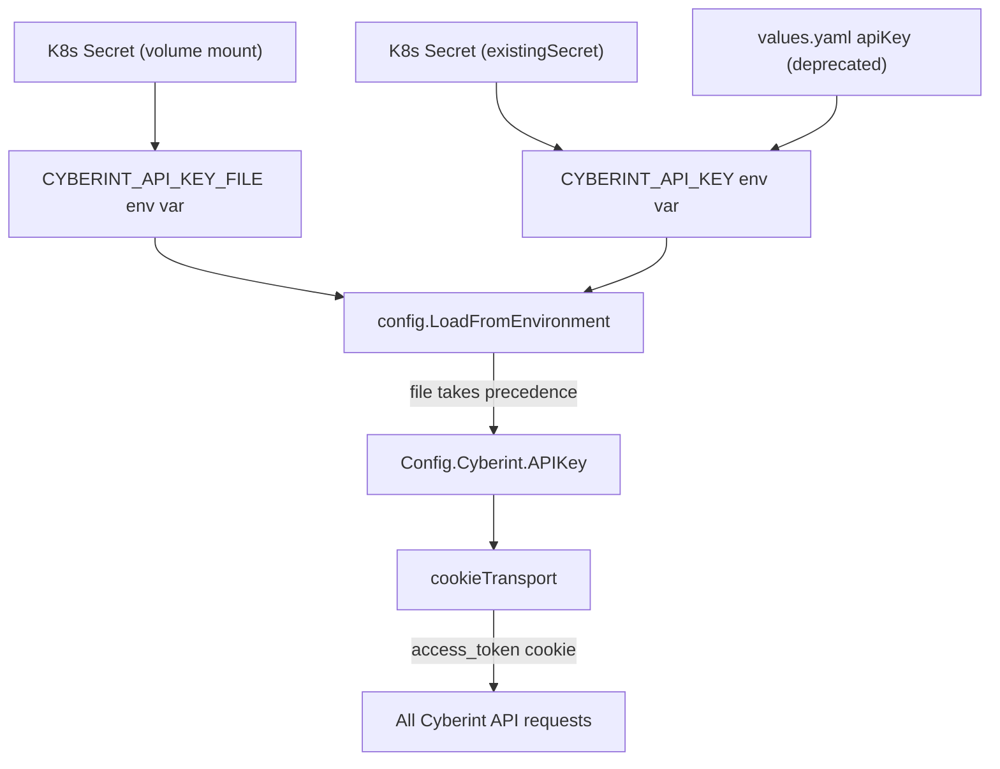
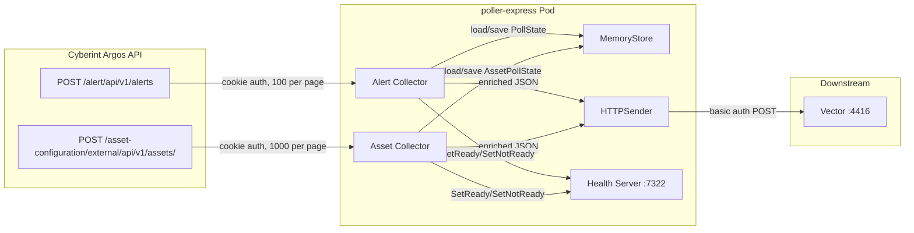

# Pass 1 Deep: Architecture -- poller-express (Round 1)

## Architecture Corrections and Deepening

### Correction 1: Pprof Lifecycle Is Outside Runner

The broad sweep's topology diagram shows `profiling.Start()` under `runner.Execute()`. This is incorrect. The actual call chain is:

```
main.go:
  1. profiling.Start() -> returns shutdownPprof func
  2. defer shutdownPprof(5s timeout)
  3. runner.Execute(ctx) -> returns exit code
```

Pprof is started and stopped in `main.go`, NOT in the runner. The runner has no knowledge of pprof. This is a deliberate separation: pprof is a debug aid available even if runner initialization fails.

### Correction 2: Runner Does Not Handle OS Signals

The broad sweep noted this as a gap, but the architecture implication needs emphasis. The `runner.Execute()` function accepts a `context.Context` from `main.go`, which passes `context.Background()`. There is NO signal handler converting SIGTERM to context cancellation. In Kubernetes, SIGTERM from the kubelet will kill the process immediately (after SIGTERM grace period), potentially mid-batch. The health server's 5-second shutdown grace period in the runner is only reached if the select statement returns normally.

### Correction 3: Health Server Starts Before Collectors

The actual startup sequence is:
1. Config loaded and validated
2. MemoryStore created
3. HTTP client created with cookieTransport
4. Cyberint API client configured
5. Sink initialized (or set to nil)
6. Health server created (NOT yet serving)
7. Alert collector created
8. Asset collector created (if enabled)
9. **Health server ListenAndServe** starts in goroutine
10. **Alert collector Run** starts in goroutine
11. **Asset collector Run** starts in goroutine (if enabled)
12. Select waits for error or context cancellation

Health server is serving BEFORE collectors start. This means K8s can hit `/ready` before the first collection cycle. The response will be 503 (not ready) because `ready` defaults to `false` and is only set to `true` after a successful collection cycle.

---

## Corrected Component Topology

```
main.go
    |
    +-- profiling.Start()          --> pprof on :3030 (opt-in via ENABLE_PPROF)
    |                                   (independent lifecycle, managed by main)
    |
    +-- runner.Execute(ctx)
            |
            +-- config.DefaultConfig() + LoadFromEnvironment() + Validate()
            +-- state.NewMemoryStore()
            +-- http.Client{Timeout: 30s, Transport: cookieTransport}
            |       |
            |       +-- cyberint.NewAPIClient(config)  --> Alert API (generated)
            |       +-- asset.NewClient(baseURL)       --> Asset API (hand-written)
            |
            +-- sink.NewHTTPSender(sinkCfg, xmpCfg)   --> Vector on :4416 (optional)
            +-- health.NewServer(":7322")              --> Liveness/Readiness (always)
            |
            +-- [goroutine] healthServer.ListenAndServe()
            +-- [goroutine] alertCollector.Run(ctx)
            +-- [goroutine] assetCollector.Run(ctx)    (if Asset.Enabled)
            |
            +-- select { errCh, ctx.Done() }
            +-- healthServer.Shutdown(5s)
```

## Layer Structure

The codebase has a clean 4-layer architecture:

```
Layer 4: Entry Point (cmd/collector)
    |
Layer 3: Orchestration (internal/app/runner)
    |
Layer 2: Domain Logic (internal/collector, internal/state)
    |        |
    |   Layer 2b: Infrastructure Adapters
    |        +-- internal/sink (outbound HTTP to Vector)
    |        +-- internal/asset (inbound HTTP from Cyberint Asset API)
    |        +-- pkg/cyberint (inbound HTTP from Cyberint Alert API)
    |        +-- internal/health (HTTP health endpoints)
    |        +-- internal/profiling (pprof HTTP server)
    |
Layer 1: Cross-Cutting (internal/apperrors, internal/config, pkg/validate)
```

**Dependency direction**: Strict top-down. No circular dependencies. Layer 2 depends on Layer 1 but never on Layer 3 or 4. Adapters in Layer 2b are injected into Layer 2 via interfaces (sink.Sender, state.Store, health.Reporter).

## Deployment Topology (Deepened)

### Kubernetes Resources

The Helm chart creates:
1. **Deployment** (single replica) -- the collector pod
2. **Service** (ClusterIP) -- exposes port 7322 for health checks
3. **ServiceAccount** -- with automountServiceAccountToken
4. **Role** + **RoleBinding** -- grants get/list on configmaps+secrets, watch on secrets
5. **Secret** (optional) -- created only when `apiKeySecretName` is set without `existingSecret`

### Security Posture

| Control | Implementation |
|---------|---------------|
| Non-root execution | User nonroot (conventionally UID 65532) in distroless image |
| Read-only filesystem | `readOnlyRootFilesystem: true` |
| No privilege escalation | `allowPrivilegeEscalation: false` |
| Dropped capabilities | All capabilities dropped |
| Seccomp profile | RuntimeDefault |
| Secret management | File mounts preferred; direct env vars as fallback |
| Network egress | Unrestricted (no NetworkPolicy in chart) |

### Credential Flow



The Helm chart supports 4 credential injection methods (in precedence order):
1. `cyberint.existingSecret` -- references a pre-existing K8s Secret
2. `cyberint.apiKeySecretName` + `apiKeySecretKey` -- creates a new K8s Secret
3. `cyberint.apiKey` (direct value) -- **deprecated, to be removed in v2.0.0**
4. File-mounted secrets via `CYBERINT_API_KEY_FILE` env var (requires extraVolumes/extraVolumeMounts)

### Resource Defaults

From `tilt-values.yaml` (dev environment):
- CPU: 50m request, 200m limit
- Memory: 64Mi request, 128Mi limit

Production `values.yaml` has no resource constraints (`resources: {}`), leaving it to the deployer.

## Cross-Cutting Concerns

### Logging Architecture

```
charmbracelet/log (primary)
    |
    +-- JSONFormatter with timestamps
    +-- Level: configurable via POLLER_LOG_LEVEL
    +-- Fields: type, endpoint, id, error, count, size_bytes, status, body
    |
    +-- Used by: runner, collector, sink, asset client, health (implicit)
    
log/slog (secondary)
    |
    +-- Used only in pkg/validate/utils.go for deferred close errors
    +-- NOT the same logger instance as primary
```

There is a **logging inconsistency**: `pkg/validate` uses `log/slog` (stdlib) while all other code uses `charmbracelet/log`. This means deferred close errors go through a different formatter and may have different output format/destination.

### Error Handling Architecture

```
apperrors (15 sentinel errors: 10 active, 5 unused)
    |
    +-- Wrapped via fmt.Errorf("context: %w", sentinelError)
    +-- Matched via errors.Is() at caller boundaries
    +-- Aggregated via errors.Join() in config validation
    +-- NEVER panics anywhere in the codebase
```

Error propagation:
- API errors -> `ErrCyberIntRequestExec` -> collector retry loop
- Sink errors -> `ErrSinkDelivery` -> collector retry loop (entire batch)
- State errors -> `ErrCollectorStateLoad` / `ErrCollectorStatePersist`
- Config errors -> `ErrConfigLoad` (from LoadFromEnvironment, but actually not used -- LoadFromEnvironment returns bare `fmt.Errorf`)
- Cursor errors -> `ErrCursorRegression` -> collector retry loop

**Note**: `ErrConfigLoad`, `ErrCyberIntConfigMissing`, `ErrCyberIntRequestBuild`, `ErrCyberIntUnexpectedStatus`, `ErrCyberIntDecode`, and `ErrCollectorStatePersist` are defined as sentinels but their usage should be verified -- some may be unused or only used in the generated client code.

### Authentication Architecture

```
cookieTransport (http.RoundTripper)
    |
    +-- Wraps http.DefaultTransport
    +-- Injects access_token cookie on EVERY request
    +-- Single http.Client shared by alert + asset collectors
    +-- 30s timeout on the shared client
    
HTTPSender (separate http.Client)
    |
    +-- Separate http.Client with configurable timeout (default 15s)
    +-- Basic Auth (username:password) for Vector
    +-- NOT shared with Cyberint client
```

**Important**: The Cyberint client and the sink use DIFFERENT http.Client instances. The Cyberint client uses the shared 30s-timeout client with cookieTransport. The sink creates its own client with a configurable timeout (default 15s). This means they have independent connection pools and timeouts.

### Concurrency Model

```
main goroutine
    |
    +-- runner.Execute() runs synchronously
         |
         +-- goroutine 1: healthServer.ListenAndServe()
         +-- goroutine 2: alertCollector.Run(ctx)
         +-- goroutine 3: assetCollector.Run(ctx) [optional]
         |
         +-- select on errCh (buffered 2) and ctx.Done()
         |
         +-- First error or cancellation proceeds to shutdown
```

Thread safety:
- `MemoryStore`: RWMutex protects both alert and asset state
- `health.Server`: atomic.Bool for `alive` and `ready`; RWMutex for per-IP rate limiter map (double-check locking pattern)
- `http.Client`: Thread-safe by design
- Collectors: Each runs in its own goroutine, no shared mutable state except through Store and Health interfaces

### Data Flow (Corrected)



---

## Delta Summary
- New items added: Corrected component topology with pprof separation, complete 4-layer architecture, deployment security posture table, credential flow diagram, dual http.Client architecture, health server timeout values, logging inconsistency (slog vs charmbracelet/log), Helm credential injection precedence, resource defaults from tilt-values
- Existing items refined: Corrected startup sequence (health before collectors), corrected pprof ownership, identified unused sentinel errors
- Remaining gaps: Need to verify which sentinel errors are actually used vs. defined-but-unused. NetworkPolicy absence should be confirmed as intentional.

## Novelty Assessment
Novelty: SUBSTANTIVE
Key discoveries that change the architectural model: (1) pprof is outside runner lifecycle, (2) Cyberint and sink use DIFFERENT http.Client instances with different timeouts, (3) logging inconsistency between charmbracelet/log and stdlib slog, (4) health server starts serving before collectors begin, (5) 4 Helm credential injection methods with deprecation plan, (6) comprehensive security posture with read-only filesystem and dropped capabilities, (7) double-check locking in rate limiter map, (8) potentially unused sentinel errors. These affect how the system would be re-architected.

## Convergence Declaration
Another round needed -- should verify sentinel error usage, confirm unused errors, and check for any architectural patterns in the generated client code that affect the hand-written code.

## State Checkpoint
```yaml
pass: 1
round: 1
status: complete
timestamp: 2026-04-13T23:35:00Z
novelty: SUBSTANTIVE
```
