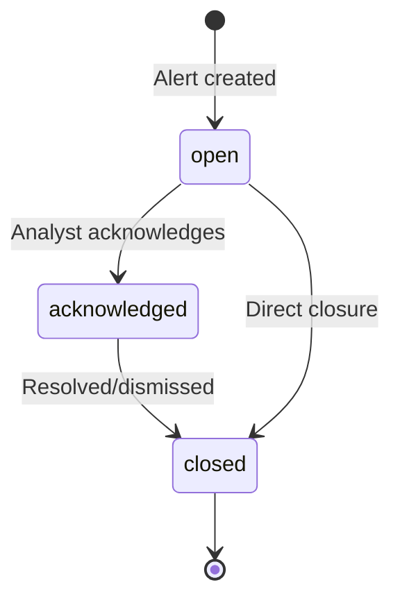
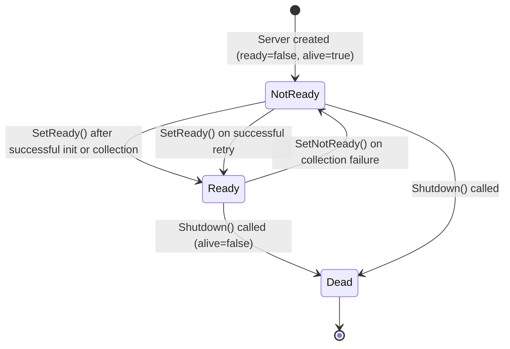
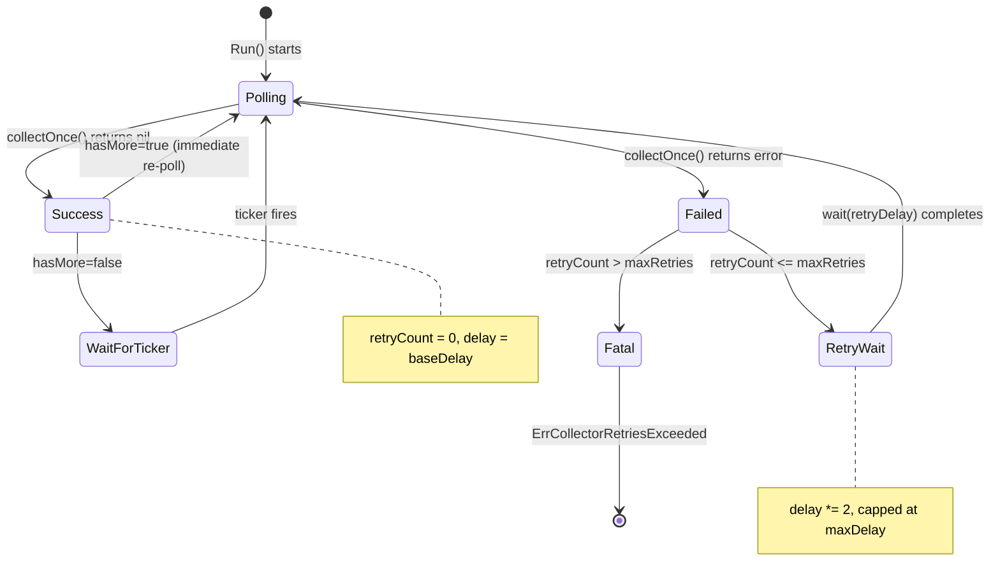
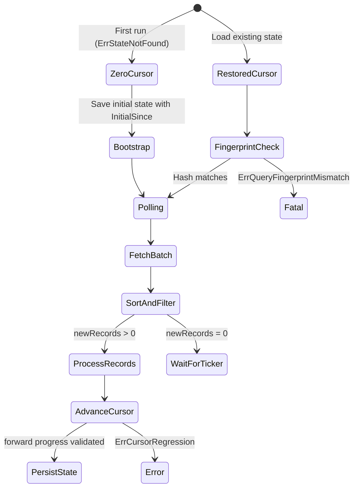

# Pass 2 Deep: Domain Model -- poller-express (Round 1)

## Sub-pass 2a: Structural Extraction

### Entity Catalog

#### E-001: Alert (Cyberint OpenAPI -- `pkg/cyberint/model_alert.go`)

The primary domain entity. Generated from OpenAPI spec; not hand-written.

| Field | Go Type | JSON Key | Nullable | Domain Role |
|-------|---------|----------|----------|-------------|
| `Id` | `int32` | `id` | no | Internal numeric ID |
| `RefId` | `string` | `ref_id` | no | Unique alert ID, used as cursor RecordID |
| `Environment` | `string` | `environment` | no | Tenant environment |
| `Confidence` | `int32` | `confidence` | no | Threat confidence score |
| `Status` | `AlertStatus` | `status` | no | Lifecycle state enum |
| `Severity` | `AlertSeverity` | `severity` | no | Business impact tier |
| `Category` | `AlertCategory` | `category` | no | Threat classification |
| `Type` | `AlertType` | `type` | no | Specific threat type (46 values) |
| `SourceCategory` | `AlertSourceCategory` | `source_category` | no | Detection source |
| `Source` | `NullableString` | `source` | yes | Specific source name |
| `TargetedVectors` | `[]AlertTargetedVector` | `targeted_vectors` | optional | Attack vector targets |
| `TargetedBrands` | `[]string` | `targeted_brands` | optional | Brand names targeted |
| `RelatedEntities` | `[]string` | `related_entities` | optional | Customer entity refs |
| `Impacts` | `[]AlertImpact` | `impacts` | optional | Impact categories |
| `Title` | `Title` | `title` | no | Alert title (structured type) |
| `Description` | `string` | `description` | no | Detailed description |
| `Recommendation` | `string` | `recommendation` | no | Remediation guidance |
| `AlertData` | `*AlertData` | `alert_data` | yes | Polymorphic payload (45 concrete subtypes) |
| `Iocs` | `[]IOC` | `iocs` | optional | Indicators of compromise |
| `Indicators` | `[]ResponseIndicator` | `indicators` | optional | Response indicators |
| `Tags` | `[]string` | `tags` | optional | Freeform tags |
| `Attachments` | `[]Attachment` | `attachments` | optional | File attachments |
| `Mitre` | `[]string` | `mitre` | optional | MITRE ATT&CK technique IDs |
| `RelatedAssets` | `[]Asset` | `related_assets` | optional | Linked digital assets |
| `CreatedDate` | `CyberintTime` | `created_date` | no | Creation timestamp |
| `ModificationDate` | `CyberintTime` | `modification_date` | no | Last modification (cursor timestamp) |
| `UpdateDate` | `CyberintTime` | `update_date` | no | Last content/status update |
| `PublishDate` | `NullableTime` | `publish_date` | yes | Publication timestamp |
| `ClosureDate` | `NullableTime` | `closure_date` | yes | When closed |
| `ClosureReason` | `NullableAlertClosureReason` | `closure_reason` | yes | Why closed |
| `ClosureReasonDescription` | `NullableString` | `closure_reason_description` | yes | Closure detail text |
| `AcknowledgedDate` | `NullableTime` | `acknowledged_date` | yes | When acknowledged |
| `ThreatActor` | `NullableString` | `threat_actor` | yes | Attribution |
| `TicketId` | `NullableString` | `ticket_id` | yes | External ticket ref |
| `AnalysisReport` | `NullableAnalysisReport` | `analysis_report` | yes | Analyst report |
| `AssignedTo` | `NullableUser` | `assigned_to` | yes | Assigned analyst |
| `CreatedBy` | `User` | `created_by` | no | Creator |
| `ClosedBy` | `NullableUser` | `closed_by` | yes | Who closed |
| `AcknowledgedBy` | `NullableUser` | `acknowledged_by` | yes | Who acknowledged |

**Invariants:**
- `RefId` is the stable identity used for cursor tracking (not `Id`)
- `ModificationDate` is the cursor timestamp, not `UpdateDate` or `CreatedDate`
- `AlertData` is polymorphic with exactly 45 model files (`model_*_alert_data.go`)

#### E-002: Asset (Hand-written -- `internal/asset/client.go:116-127`)

| Field | Go Type | JSON Key | Nullable | Domain Role |
|-------|---------|----------|----------|-------------|
| `ID` | `int64` | `id` | no | Primary key; converted to string via `GetID()` for cursor |
| `Name` | `*string` | `name` | yes | Asset identifier (domain name, IP, etc.) |
| `Type` | `*string` | `type` | yes | Asset classification ("domain", "ip", etc.) |
| `Status` | `*string` | `status` | yes | Lifecycle status ("active", etc.) |
| `AssetGroup` | `*string` | `asset_group` | yes | Grouping label |
| `Created` | `time.Time` | `created` | no | Creation timestamp |
| `Updated` | `time.Time` | `updated` | no | Last update (cursor timestamp) |
| `ParentAssetValue` | `*string` | `parent_asset_value` | yes | Parent relationship |
| `DiscoveryPrecision` | `*int` | `discovery_precision` | yes | Confidence of discovery |
| `DiscoveryReason` | `*string` | `discovery_reason` | yes | How asset was found |

**Methods:**
- `GetID() string` -- `strconv.FormatInt(a.ID, 10)` -- converts numeric ID to string for cursor
- `GetUpdatedTime() time.Time` -- returns `a.Updated` for cursor comparison

**Invariants:**
- `ID` is int64, but cursor comparison uses its string representation (known bug: lexicographic ordering of numeric strings)
- `Updated` is the cursor timestamp field

#### E-003: Cursor (Alert cursor -- `internal/state/store.go:116-119`)

| Field | Type | Role |
|-------|------|------|
| `Timestamp` | `cyberint.CyberintTime` | Last processed modification date |
| `RecordID` | `string` | Last processed alert RefId |

**Invariants:**
- Cursor advances only forward: timestamp increases, or same timestamp with lexicographically greater RecordID
- Zero timestamp alerts are skipped (`filterNewAlerts` line 336-339)

#### E-004: AssetCursor (`internal/state/store.go:174-177`)

| Field | Type | Role |
|-------|------|------|
| `Timestamp` | `time.Time` | Last processed update time |
| `RecordID` | `string` | Last processed asset ID (string form of int64) |

**Methods:**
- `IsZero() bool` -- true when both Timestamp is zero and RecordID is empty

**Invariants:**
- Forward progress uses string comparison first, with numeric fallback (`ensureForwardProgress` in `asset_collector.go:303-320`)
- This means "50" > "100" in string comparison is considered forward progress (documented bug)

#### E-005: PollState (`internal/state/store.go:106-111`)

| Field | Type | Role |
|-------|------|------|
| `Cursor` | `Cursor` | Current position in alert stream |
| `Query` | `QueryFingerprint` | Configuration drift detector |
| `UpdatedAt` | `time.Time` | Last state update timestamp |
| `Version` | `uint64` | Monotonically increasing version counter |

#### E-006: AssetPollState (`internal/state/store.go:165-171`)

Mirrors PollState but with `AssetCursor` instead of `Cursor`. Same structure and semantics.

#### E-007: QueryFingerprint (`internal/state/store.go:123-127`)

| Field | Type | Role |
|-------|------|------|
| `Hash` | `string` | SHA-256 hex of `sorted_fields|limit` |
| `Fields` | `[]string` | Original (unsorted) field names |
| `Limit` | `int` | Page size limit |

**Construction:** `NewQueryFingerprint(fields, limit)` sorts fields, joins with `|`, appends `|limit`, SHA-256 hashes.

**Concrete instances:**
- Alert fingerprint: `NewQueryFingerprint(["cyberint_alerts"], 100)`
- Asset fingerprint: `NewQueryFingerprint(["cyberint_assets"], 1000)`

#### E-008: BatchReceipt (`internal/state/store.go:131-139`)

| Field | Type | Role |
|-------|------|------|
| `Version` | `uint64` | Matches PollState version |
| `RequestHash` | `string` | Fingerprint hash of the query |
| `Count` | `int` | Number of records in batch |
| `FirstRecordID` | `string` | First record processed |
| `LastRecordID` | `string` | Last record processed |
| `FetchedAt` | `time.Time` | When batch was fetched |
| `CursorApplied` | `Cursor` | Cursor after this batch |

#### E-009: AssetBatchReceipt (`internal/state/store.go:185-193`)

Mirrors BatchReceipt with `AssetCursor` for `CursorApplied`.

#### E-010: CyberintTime (`pkg/cyberint/cyberint_time.go`)

Custom time wrapper that handles Cyberint's multiple timestamp formats.

**Deserialization formats (in priority order):**
1. RFC3339: `2006-01-02T15:04:05Z07:00`
2. Without timezone: `2006-01-02T15:04:05` (assumed UTC)
3. With microseconds: `2006-01-02T15:04:05.999999` (assumed UTC)
4. `"null"` or `""`: zero time

**Serialization:** Always RFC3339. Zero time serializes as `null`.

#### E-011: EnrichedPayload (`internal/sink/http_sender.go:21-24`)

| Field | Type | JSON Key |
|-------|------|----------|
| `Data` | `json.RawMessage` | `data` |
| `XMP` | `XMPMetadata` | `xmp` |

#### E-012: XMPMetadata (`internal/sink/http_sender.go:27-31`)

| Field | Type | JSON Key |
|-------|------|----------|
| `Site` | `string` | `site` |
| `ClusterName` | `string` | `cluster_name` |
| `NodeName` | `string` | `node_name` |

### Request/Response Models

#### E-013: GetAssetsRequest (`internal/asset/client.go:98-106`)

| Field | Type | JSON Key | Optional |
|-------|------|----------|----------|
| `CustomerID` | `string` | `customer_id` | yes (omitempty) |
| `PageNumber` | `int` | `page_number` | yes (omitempty) |
| `Type` | `[]string` | `type` | yes (omitempty) |
| `Status` | `[]string` | `status` | yes (omitempty) |
| `CreatedFrom` | `*string` | `created_from` | yes |
| `AssetName` | `*string` | `asset_name` | yes |
| `DiscoveryPrecision` | `*int` | `discovery_precision` | yes |

#### E-014: GetAssetsResponse (`internal/asset/client.go:109-113`)

| Field | Type | JSON Key |
|-------|------|----------|
| `TotalAssets` | `int` | `total_assets` |
| `PageNumber` | `int` | `page_number` |
| `Assets` | `[]Asset` | `assets` |

### Configuration Value Objects

#### E-015: Config (`internal/config/config.go:52-59`)

Top-level configuration aggregate containing:
- `Cyberint` (CyberintConfig): BaseURL, APIKey
- `Asset` (AssetConfig): Enabled (bool), CustomerID
- `Collector` (CollectorConfig): Interval, RetryBaseDelay, RetryMaxDelay, MaxRetries, InitialSince, HealthAddr
- `Sink` (SinkConfig): Endpoint, Username, Password, Timeout
- `Logging` (LoggingConfig): Level
- `XMP` (XMPConfig): Site, ClusterName, NodeName

#### E-016: RateLimitConfig (`internal/health/server.go:31-36`)

| Field | Type | Default |
|-------|------|---------|
| `RequestsPerSecond` | `int` | 100 |
| `Burst` | `int` | 20 |

### Enumerations (all from OpenAPI-generated code)

| Enum Type | Values | Count |
|-----------|--------|-------|
| `AlertStatus` | open, acknowledged, closed | 3 |
| `AlertSeverity` | low, medium, high, very_high | 4 |
| `AlertCategory` | fraud, phishing, attackware, brand, data, vulnerabilities, supply_chain, other | 8 |
| `AlertType` | refund_fraud, carding, coupon_fraud, ... other (see model file) | 46 |
| `AlertSourceCategory` | forum, darknet, paste_site, ... breach_monitor | 25 |
| `AlertTargetedVector` | business, employee, customer | 3 |
| `AlertImpact` | revenue_loss, customer_churn, ... brand_degradation | 10 |
| `AlertClosureReason` | resolved, irrelevant, false_positive, ... other | 10 |

### Interfaces (Behavioral Boundaries)

| Interface | Package | Methods | Implementors |
|-----------|---------|---------|-------------|
| `state.Store` | state | `Load(ctx) (PollState, error)`, `Save(ctx, PollState, BatchReceipt) error` | `MemoryStore` |
| `state.AssetStore` | state | `LoadAsset(ctx) (AssetPollState, error)`, `SaveAsset(ctx, AssetPollState, AssetBatchReceipt) error` | `MemoryStore` |
| `sink.Sender` | sink | `Send(ctx, record any, recordID, recordType string) error` | `HTTPSender`, `mockSink` (test) |
| `health.Reporter` | health | `SetReady()`, `SetNotReady()` | `Server` |

**Note:** `MemoryStore` implements BOTH `Store` and `AssetStore` -- it is a single struct with both alert and asset state tracked under a single mutex.

### Relationship Map

```mermaid
graph TD
    Runner["runner.Execute()"] --> Config["Config"]
    Runner --> MemoryStore["MemoryStore"]
    Runner --> AlertCollector["Collector (alerts)"]
    Runner --> AssetCollector["AssetCollector"]
    Runner --> HealthServer["health.Server"]
    Runner --> HTTPSender["HTTPSender"]
    Runner --> CyberintClient["cyberint.APIClient"]
    Runner --> AssetClient["asset.Client"]
    
    AlertCollector --> Store["state.Store"]
    AlertCollector --> Sender["sink.Sender"]
    AlertCollector --> Reporter["health.Reporter"]
    AlertCollector --> PollState
    AlertCollector --> Cursor
    AlertCollector --> QueryFingerprint
    AlertCollector --> BatchReceipt
    
    AssetCollector --> AssetStore["state.AssetStore"]
    AssetCollector --> Sender
    AssetCollector --> Reporter
    AssetCollector --> AssetPollState
    AssetCollector --> AssetCursor
    AssetCollector --> QueryFingerprint
    AssetCollector --> AssetBatchReceipt
    
    MemoryStore -.implements.-> Store
    MemoryStore -.implements.-> AssetStore
    HTTPSender -.implements.-> Sender
    HealthServer -.implements.-> Reporter
    
    PollState --> Cursor
    PollState --> QueryFingerprint
    AssetPollState --> AssetCursor
    AssetPollState --> QueryFingerprint
    BatchReceipt --> Cursor
    AssetBatchReceipt --> AssetCursor
    
    HTTPSender --> EnrichedPayload
    EnrichedPayload --> XMPMetadata
    
    CyberintClient --> Alert
    AssetClient --> Asset
    
    Alert --> AlertStatus
    Alert --> AlertSeverity
    Alert --> AlertCategory
    Alert --> AlertType
    Alert --> AlertSourceCategory
    Alert --> CyberintTime
```



---

## Sub-pass 2b: Behavioral Extraction

### State Machines

#### SM-001: Alert Lifecycle (external, from Cyberint API)



States: `AlertStatus` enum (`open`, `acknowledged`, `closed`)
Closure reasons: 10 values (resolved, irrelevant, false_positive, irrelevant_alert_subtype, no_longer_a_threat, asset_should_not_be_monitored, asset_belongs_to_my_organization, asm_no_longer_detected, asm_manually_closed, other)

**Important:** poller-express does NOT manage alert lifecycle transitions. It is a read-only consumer of alert state. The state machine exists in the Cyberint API; poller-express merely observes and forwards.

#### SM-002: Health Readiness



States: Combination of `alive` (atomic.Bool) and `ready` (atomic.Bool)
- Liveness: returns 200 when `alive=true`, 503 when `alive=false`
- Readiness: returns 200 when `alive=true AND ready=true`, 503 otherwise

#### SM-003: Collector Retry State



**Retry counter behavior:**
- Reset to 0 on any successful collection
- Incremented on failure
- When `retryCount > maxRetries` (note: strictly greater), returns fatal error
- The error message reports `attempts = retryCount - 1` (the count BEFORE the increment that triggered the exit)

#### SM-004: Cursor Progression



### Domain Operations

#### DO-001: collectOnce (Alert)
**Location:** `internal/collector/alert_collector.go:192-301`
**Input:** Context, current PollState
**Output:** (hasMore bool, error)
**Steps:**
1. Build `GetAlertsRequest` with page=1, size=100
2. If cursor timestamp is non-zero, add `modification_date` filter (from=cursor, to=now)
3. Execute POST to Cyberint API
4. Sort alerts by (ModificationDate, RefId) -- stable sort
5. Filter: skip zero-timestamp alerts, skip alerts at or before cursor position
6. For each new alert: send to sink with type `"cyberint_alert"`
7. Compute new cursor from last processed alert
8. Validate forward progress
9. Increment version, save state + receipt
10. Return `hasMore = (len(alerts) == pageSize)`

#### DO-002: collectOnce (Asset)
**Location:** `internal/collector/asset_collector.go:188-280`
**Input:** Context, current AssetPollState
**Output:** (hasMore bool, error)
**Steps:**
1. Build `GetAssetsRequest` with CustomerID and page_number=1 (no status/type filters set in code)
2. Execute POST to Cyberint API
3. Sort assets by (Updated, ID) -- stable sort, numeric ID comparison for sort
4. Filter: skip assets at or before cursor position (string comparison of ID)
5. For each new asset: send to sink with type `"cyberint_asset"`
6. Compute new cursor from last processed asset
7. Validate forward progress (string comparison first, numeric fallback)
8. Increment version, save state + receipt
9. Return `hasMore = (pageNumber * 1000 < totalAssets)`

**Key difference from alerts:** Asset sorting uses numeric ID comparison (`assets[i].ID < assets[j].ID`) but cursor comparison uses string comparison. This asymmetry is the source of the documented bug.

#### DO-003: enrichPayload
**Location:** `internal/sink/http_sender.go:121-149`
**Input:** Any Go value (alert or asset)
**Output:** JSON bytes in `{"data": ..., "xmp": {...}}` format
**Implementation:** Manual JSON construction using `json.Encoder` with explicit buffer manipulation (strips trailing newlines from Encoder output). Not using struct marshaling for the outer wrapper.

#### DO-004: initializeState (shared pattern for both collectors)
**Location:** `alert_collector.go:156-190`, `asset_collector.go:152-186`
**Logic:**
1. Attempt to Load from store
2. If found: verify fingerprint hash matches. If mismatch, return fatal error.
3. If `ErrStateNotFound`: bootstrap with zero cursor (or `InitialSince`), version 0, save initial state
4. Other errors: wrap with `ErrCollectorStateLoad`

#### DO-005: extractCustomerIDFromURL
**Location:** `runner.go:223-239`
**Input:** Base URL string
**Output:** Subdomain extracted from `https://<customer_id>.cyberint.io` format
**Rules:** Skips "api" and "www" subdomains. Requires at least 3 dot-separated parts.

### Business Rules

#### BR-001: Forward Progress Enforcement
- Alert cursor: strictly timestamp-ahead OR (same timestamp AND lexicographically greater RefId)
- Asset cursor: string comparison first, then numeric fallback for same-timestamp cases
- Violation produces `ErrCursorRegression` -- treated as retryable error in collector loop

#### BR-002: Zero Timestamp Rejection
- Alerts with zero `ModificationDate` are silently skipped with a warning log
- This prevents zero-timestamp records from regressing the cursor

#### BR-003: Pagination Detection
- Alerts: `hasMore = (len(fetchedAlerts) == pageSize)` where pageSize is 100
- Assets: `hasMore = (pageNumber * 1000 < totalAssets)`
- When hasMore is true, the collector re-enters collectOnce immediately without waiting for ticker

#### BR-004: Configuration Drift Detection
- QueryFingerprint SHA-256 hash is computed from sorted field names + limit
- Stored with PollState on every save
- On reload, if hash mismatches, collector returns `ErrQueryFingerprintMismatch` (fatal, non-retryable)

#### BR-005: Secret Loading Precedence
- `*_FILE` env var checked first -> read file contents (trimmed)
- If file not found (ErrNotExist): silently fall back to direct env var
- If file read error (other): return error (fatal)
- Empty file path: skip file, use direct env var

#### BR-006: Sink Optional Operation
- If `VECTOR_ENDPOINT` is empty: sink is nil, records are logged but not forwarded
- If endpoint is set: Username AND Password are both required (`ErrSinkConfigMissing`)
- Sink errors propagate up to collector retry loop (entire batch retried)

### Bounded Context Map

This is a single bounded context: **Threat Intelligence Collection**. The system has no internal domain boundaries because it is a single-purpose polling adapter.

External bounded contexts it integrates with:
1. **Cyberint Argos API** (upstream): Provides Alert and Asset entities. Defines all enumerations.
2. **Vector / Downstream SIEM** (downstream): Receives enriched JSON payloads. Defines no schema -- accepts raw JSON.

### Ubiquitous Language Glossary

| Term | Meaning |
|------|---------|
| Alert | A security threat notification from Cyberint (phishing, data leak, vulnerability, etc.) |
| Asset | A digital asset being monitored (domain, IP, etc.) |
| Cursor | A (Timestamp, RecordID) pair tracking the last processed record |
| Forward Progress | The invariant that cursors must never regress |
| Query Fingerprint | SHA-256 hash detecting configuration drift between runs |
| Batch Receipt | Metadata about a processed batch for audit/reconciliation |
| Sink | The downstream HTTP endpoint (Vector) receiving enriched payloads |
| xMP Metadata | Site/cluster/node enrichment fields added to every payload |
| Collection Cycle | One invocation of `collectOnce()` -- fetch, filter, forward, advance cursor |
| Polling Loop | The outer `for{}` loop that triggers collection cycles on a ticker |

---

## Delta Summary
- New items added: 16 entities, 4 state machines, 5 domain operations, 6 business rules, 8 enumerations with verified value counts
- Existing items refined: Corrected AlertData subtype count from "50+" (broad sweep) to exactly 45 model files. Corrected AlertType count to exactly 46 values. Documented the asymmetry between sort comparison (numeric) and cursor comparison (string) in asset collector.
- Remaining gaps: Inner structure of AlertData subtypes not cataloged (45 types -- generated code, low priority). IOC, Attachment, ResponseIndicator, User, Title inner structures not detailed.

## Novelty Assessment
Novelty: SUBSTANTIVE
The broad sweep provided a good overview but this round discovered: (1) exact enumeration counts verified against source (AlertType=46, AlertSourceCategory=25, AlertImpact=10, AlertClosureReason=10, AlertCategory=8 vs. previously unspecified), (2) the sort-vs-cursor asymmetry in asset collector (numeric sort but string cursor comparison), (3) the precise retry counter boundary condition (retryCount > maxRetries, not >=), (4) complete interface catalog with 4 interfaces and their implementors, (5) MemoryStore implementing both Store and AssetStore under a single mutex, (6) the manual JSON construction in enrichPayload, (7) PublishDate field on Alert missed in broad sweep, (8) ClosureReasonDescription field missed in broad sweep. These change the domain model.

## Convergence Declaration
Another round needed -- should verify inner structure of referenced types (IOC, Attachment, User, Title, AnalysisReport) and check for any additional entities in the generated client that participate in the domain model.

## State Checkpoint
```yaml
pass: 2
round: 1
status: complete
timestamp: 2026-04-13T00:00:00Z
novelty: SUBSTANTIVE
```
