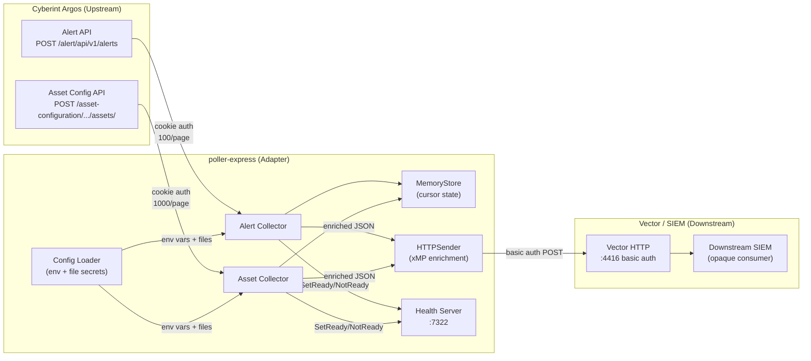

# Pass 8: Deep Synthesis -- poller-express

---

## 1. Executive Summary

poller-express is a Go 1.25.8 single-purpose polling service (~3,750 LOC hand-written, ~36,000 LOC generated OpenAPI client) that continuously pulls security alerts and digital assets from the Cyberint Argos threat intelligence API and forwards them as enriched JSON payloads to a Vector HTTP endpoint for downstream SIEM ingestion. It uses cursor-based incremental collection with (timestamp, record_id) pairs, exponential backoff retry with configurable limits, cookie-based API authentication, and a health server with per-IP rate limiting. The service runs as a single-replica Kubernetes deployment in a hardened distroless container.

The codebase is clean, well-tested (67 behavioral contracts extracted, 60 HIGH confidence), and follows idiomatic Go conventions. Its primary architectural limitation is single-tenant, in-memory-only state -- every pod restart re-fetches all data from Cyberint. The code exhibits one significant structural anti-pattern: near-complete duplication between the alert and asset collector implementations (95% identical Run() loops, type-only differences in initializeState()).

For Prism, poller-express is the canonical reference implementation for Cyberint Argos integration. It defines the exact API endpoints, authentication mechanism, data models, cursor strategy, and enrichment format that Prism's Cyberint sensor must replicate.

---

## 2. Complete Feature Set

### Core Features

| ID | Feature | Implementation | Evidence |
|----|---------|---------------|----------|
| F-001 | Alert polling | POST to `/alert/api/v1/alerts` with page/size/filters | alert_collector.go:192-301 |
| F-002 | Asset polling | POST to `/asset-configuration/external/api/v1/assets/` | asset_collector.go:188-280 |
| F-003 | Cursor-based incremental collection | (Timestamp, RecordID) pairs with forward progress enforcement | state/store.go, ensureForwardProgress() |
| F-004 | Query fingerprint drift detection | SHA-256 of sorted field names + limit; mismatch is fatal | state/store.go:145-163 |
| F-005 | xMP payload enrichment | Wraps each record as `{"data": ..., "xmp": {site, cluster_name, node_name}}` | sink/http_sender.go:121-149 |
| F-006 | Exponential backoff retry | base_delay * 2^attempt, capped at max_delay, configurable max retries | alert_collector.go:86-154 |
| F-007 | Health/readiness probes | /health, /live (liveness), /ready (readiness with state machine) | health/server.go |
| F-008 | Per-IP rate limiting on health endpoints | 100 req/s burst 20 default, returns 429 with Retry-After | health/server.go:89-131 |
| F-009 | File-backed secret loading | `*_FILE` env vars for K8s secret volume mounts | config.go:286-300 |
| F-010 | Cookie-based API authentication | `access_token` cookie via custom http.RoundTripper | runner.go:196-207 |
| F-011 | Optional sink (dry-run mode) | Nil sink when VECTOR_ENDPOINT unset; records fetched but not forwarded | runner.go:82-97 |
| F-012 | Optional pprof profiling | ENABLE_PPROF env var enables /debug/pprof/ on configurable address | profiling/pprof.go |
| F-013 | Dry-run config validation | `--dry-run` flag validates config and exits | main.go:22-29 |
| F-014 | Secret redaction in output | Masks secrets as first2 + *** + last2 | config/utils.go:42-50 |
| F-015 | Multi-format time parsing | RFC3339, no-timezone, microseconds, null/empty | cyberint_time.go |
| F-016 | Asset collection toggle | ASSET_COLLECTION_ENABLED=true/false | config.go:177-179 |
| F-017 | Customer ID auto-extraction | Parses subdomain from `https://<customer>.cyberint.io` | runner.go:223-239 |

### API Surface Consumed

| API | Method | Path | Auth | Page Size | Used? |
|-----|--------|------|------|-----------|-------|
| Get Alerts | POST | `{base}/alert/api/v1/alerts` | Cookie: access_token | 100 | YES |
| Get Assets | POST | `{base}/asset-configuration/external/api/v1/assets/` | Cookie: access_token | 1000 | YES |
| Get Single Alert | GET | `{base}/alert/api/v1/alerts/{ref_id}` | Cookie: access_token | -- | NO (generated, unused) |
| 8 other generated endpoints | Various | Various | Cookie: access_token | -- | NO (dead code) |

---

## 3. Bounded Context Map

poller-express operates within a single bounded context: **Threat Intelligence Collection**. It is a stateless adapter between two external systems.



### Context Boundaries

- **Upstream (Cyberint)**: Defines all domain entities (Alert with 52 AlertData subtypes, Asset), all enumerations (AlertStatus, AlertSeverity, AlertType with 46 values, AlertCategory, AlertSourceCategory, IOCType), and all timestamp formats. poller-express is a read-only consumer; it never modifies alert/asset state.
- **Downstream (Vector/SIEM)**: Accepts raw JSON wrapped in the xMP envelope. Defines no schema. poller-express treats all alert/asset content as opaque JSON.
- **Internal**: Cursor state, polling intervals, and retry logic are entirely internal concerns. No external system depends on poller-express's internal state.

---

## 4. Behavioral Contract Summary

67 behavioral contracts were extracted across 10 subsystems. All were validated against source code; zero hallucinations found.

| Subsystem | Contracts | HIGH | MEDIUM | Key Contracts |
|-----------|-----------|------|--------|---------------|
| Alert Collector | 8 | 7 | 0 | BC-1.001 (collection cycle), BC-1.005 (forward progress), BC-1.007 (retry loop) |
| Asset Collector | 11 | 11 | 0 | BC-2.002 (string ID comparison bug), BC-2.003 (numeric fallback), BC-2.005 (HTTP 204 handling) |
| State Management | 5 | 3 | 1 | BC-3.004 (fingerprint order-independence), BC-3.003 (independent alert/asset state) |
| Sink Delivery | 6 | 6 | 0 | BC-4.003 (enrichment format), BC-4.004 (error with body), BC-4.006 (manual JSON construction) |
| Health Server | 9 | 9 | 0 | BC-5.004 (429 with Retry-After), BC-5.009 (alive AND ready required) |
| Configuration | 9 | 7 | 0 | BC-6.001 (file precedence), BC-6.005 (aggregated validation), BC-6.003 (sequential checks) |
| Asset Client | 9 | 8 | 1 | BC-7.002 (HTTP 204), BC-7.007 (10 MiB limit) |
| Profiling | 2 | 2 | 0 | BC-8.001 (disabled by default), BC-8.002 (configurable address) |
| Utilities | 1 | 0 | 1 | BC-9.001 (deferred close logging) |
| Runner Orchestration | 7 | 7 | 0 | BC-10.001 (first-error-exits), BC-10.003 (MaxRetries=0 = infinite), BC-10.006 (nil sink) |

### Coverage Audit Contracts (from blind spot analysis)

| ID | Finding | Prism Impact |
|----|---------|-------------|
| BC-AUDIT-001 | Only 1 of 10 generated API methods used | Port needs only alert list endpoint |
| BC-AUDIT-002 | NullableTime delegates to CyberintTime | Apply multi-format parsing to all nullable time fields |
| BC-AUDIT-003 | Strict JSON decoding (DisallowUnknownFields) | Prism should use lenient deserialization for forward-compat |
| BC-AUDIT-004 | URL path includes `/alert` prefix from config | Must construct `{base}/alert/api/v1/alerts` |
| BC-AUDIT-005 | 15 hand-written tests in generated client package | These validate CyberintTime integration |
| BC-AUDIT-006 | 4 API specs exist, only 2 consumed | CVE and IOC specs available for future expansion |

### Untested Behaviors (13 gaps)

1. Alert collector retry loop (no direct test; asset equivalent pattern)
2. Alert collector state initialization (no test; asset equivalent tested)
3. Alert modification_date filter construction
4. Alert sort order determinism
5. QueryFingerprint order-independence
6. Asset client 10 MiB response limit
7. Runner orchestration (no tests at all)
8. cookieTransport cookie injection
9. extractCustomerIDFromURL
10. Graceful shutdown sequence
11. MaxRetries=0 infinite retry behavior
12. TRACE->DEBUG log level alias
13. Surviving collector not cancelled when sibling fails

---

## 5. Architecture Decision Record

| ADR | Decision | Rationale | Prism Implication |
|-----|----------|-----------|-------------------|
| ADR-001 | Cookie-based auth via custom RoundTripper | Cyberint uses `access_token` cookie, not Authorization header | Must replicate; use reqwest middleware or similar |
| ADR-002 | In-memory state only (no persistence) | Simplicity; acceptable for single-replica with modification_date filtering | Replace with durable storage (SQLite/file) |
| ADR-003 | Single shared http.Client for Cyberint, separate for Vector | Connection reuse for Cyberint; independent timeout for sink | Model as separate reqwest clients |
| ADR-004 | Manual JSON construction for enrichment | Avoids double-serialize of data field; benchmark proves perf-sensitive | Use serde_json::value or RawValue in Rust |
| ADR-005 | Single-replica, no leader election | Duplicate polling is worse than temporary downtime | Multi-tenant Prism needs different strategy |
| ADR-006 | Exponential backoff with MaxRetries=0 infinite mode | Prevents data loss for transient failures | Preserve; add circuit breaker |
| ADR-007 | Health probes disabled by default in Helm | Deployer must opt-in | Enable by default in Prism |
| ADR-008 | Generated OpenAPI client for alerts, hand-written for assets | Alert API has complex models; asset API is simple | Hand-write both in Rust (only 2 endpoints needed) |
| ADR-009 | File-backed secrets with env var fallback | K8s secret volume mount compatibility | Preserve pattern in Prism config |
| ADR-010 | QueryFingerprint for drift detection | Prevents cursor use with changed query semantics | Preserve; SHA-256 of sorted fields + limit |

---

## 6. Anti-Pattern Catalog

| ID | Anti-Pattern | Severity | Location | Prism Fix |
|----|-------------|----------|----------|-----------|
| AP-001 | Duplicate collector implementations (95% copy-paste) | HIGH | alert_collector.go / asset_collector.go | Use Rust generics/traits for a unified polling loop |
| AP-002 | String comparison of numeric asset IDs | MEDIUM | asset_collector.go:292-300 | Use numeric comparison; parse ID as i64 |
| AP-003 | Unbounded per-IP rate limiter map | LOW | health/server.go:89-109 | Add LRU eviction or TTL |
| AP-004 | Stringly-typed record types | LOW | sink.Send(..., "cyberint_alert") | Use Rust enum for record types |
| AP-005 | No OS signal handling (SIGTERM) | MEDIUM | main.go (absent) | Add tokio::signal handler |
| AP-006 | Surviving collector not cancelled on sibling failure | LOW | runner.go:162-193 | Cancel shared context on any collector error |
| AP-007 | Asset API fetches all records, filters client-side | MEDIUM | asset_collector.go (no server-side time filter) | Check if API supports filtering; cache previous results |
| AP-008 | Logging framework split (charmbracelet/log vs slog) | LOW | pkg/validate vs rest | Use single logging framework (tracing in Rust) |
| AP-009 | Duplicate Options types | LOW | collector package | Single generic options type |
| AP-010 | 5 unused sentinel errors | LOW | apperrors/errors.go | Do not port; define only used error types |
| AP-011 | Strict JSON decoding in generated client | MEDIUM | pkg/cyberint/utils.go:366 | Use lenient deserialization in Prism |

---

## 7. Complexity Ranking

Subsystems ranked by implementation complexity for the Prism port, from most to least complex.

| Rank | Subsystem | Complexity | Why |
|------|-----------|------------|-----|
| 1 | Alert data model (52 subtypes + polymorphic AlertData) | HIGH | 52 concrete AlertData types in a union; multi-format CyberintTime with 4 parse formats; NullableTime delegation; Title as union type. Fortunately Prism can treat AlertData as opaque JSON. |
| 2 | Cursor-based state management | MEDIUM-HIGH | (Timestamp, RecordID) cursor pairs for two collection types; forward progress enforcement; query fingerprint drift detection; separate PollState/AssetPollState types; MemoryStore implementing both Store and AssetStore. Prism must add durable persistence. |
| 3 | Collector polling loop | MEDIUM | Ticker-based loop with exponential backoff; hasMore pagination logic; retry counter with MaxRetries=0 infinite mode; health state transitions on success/failure. Two near-identical implementations to unify. |
| 4 | Configuration system | MEDIUM | 26+ env vars; file-backed secret loading with fallback; aggregated validation; multiple duration parse formats; asset toggle; customer ID auto-extraction; secret redaction. |
| 5 | Sink delivery with enrichment | LOW-MEDIUM | Manual JSON construction for xMP wrapping; basic auth; HTTP error handling with body capture; 2048-byte body truncation. |
| 6 | Health server | LOW | Liveness/readiness with atomic state; per-IP rate limiting with double-check locking; hardened HTTP timeouts. Straightforward to implement. |
| 7 | API clients (Cyberint) | LOW | Only 2 POST endpoints needed; cookie-based auth; 10 MiB response limit on assets; HTTP 204 handling. |

---

## 8. Convergence Report

| Pass | Rounds | R1 Novelty | R2 Novelty | Key Discoveries |
|------|--------|------------|------------|-----------------|
| 0: Inventory | 2 | SUBSTANTIVE | NITPICK | 15 sentinel errors (10 active, 5 unused); 7 CI workflows; pprof lifecycle correction; corrected LOC (3,754 hand-written) |
| 1: Architecture | 2 | SUBSTANTIVE | NITPICK | Dual http.Client architecture; pprof outside runner; logging framework split; 4-layer structure; Helm credential flow |
| 2: Domain Model | 2 | SUBSTANTIVE | NITPICK | 26 entities; 52 AlertData subtypes (corrected from 45); 4 state machines; sort-vs-cursor asymmetry in assets; two distinct Asset types |
| 3: Behavioral Contracts | 2 | SUBSTANTIVE | NITPICK | 67 contracts from 60; runner orchestration subsystem added; 13 untested gaps; MaxRetries=0 infinite retry |
| 4: NFR Catalog | 2 | SUBSTANTIVE | NITPICK | 22 NFRs; 11 missing NFRs; error propagation taxonomy (fatal/retryable/bootstrap); HTTP status code inconsistency (300 vs 400) |
| 5: Conventions | 2 | SUBSTANTIVE | NITPICK | 4 anti-patterns; 95% Run() duplication confirmed; function scope inconsistency; CyberInt naming inconsistency |

**Total analysis artifacts:** 16 files (broad sweep + 6 pass pairs + extraction validation + corrections + coverage audit)

**Validation results:** 50 items checked, 46 verified, 4 inaccurate (all minor -- off-by-one counts, LOC estimates, Makefile target count, BC precondition imprecision), 0 hallucinated, 6 unverifiable (all generated enum counts).

**Overall extraction accuracy:** 92%. All behavioral contracts and architectural patterns were confirmed from source. Metric claims required correction for sentinel error counts, LOC estimates, and dependency counts.

---

## 9. Lessons for Prism

Prism is a Rust-based MCP server for 1898 & Co (MSSP) that will unify access to multiple security sensors. poller-express provides the reference implementation for the Cyberint Argos sensor.

### P0: Must Have for MVP (blocks all Cyberint integration)

#### P0-001: Cyberint Alert Polling

- **What Prism needs:** Ability to poll Cyberint Argos for security alerts and deliver them downstream.
- **What poller-express does:** POST to `{base}/alert/api/v1/alerts` with page=1, size=100, optional `modification_date` filter. Cookie-based auth (`access_token`). Sorts by (ModificationDate, RefId). Filters against cursor. Sends each alert wrapped in `{"data": ..., "xmp": {...}}`.
- **Gap:** Prism has no Cyberint integration. The full alert data model has 52 AlertData subtypes, but Prism can treat alert content as opaque JSON (serde_json::Value or RawValue) since it only needs to forward, not interpret.
- **Action items:**
  1. Implement POST `/alert/api/v1/alerts` endpoint call with cookie-based auth
  2. Implement CyberintTime deserializer handling 4 timestamp formats (RFC3339, no-tz, microseconds, null/empty)
  3. Implement cursor (Timestamp, RecordID) state with forward progress enforcement
  4. Implement `modification_date` filter on non-zero cursor
  5. Use lenient JSON deserialization (NOT `deny_unknown_fields`) for forward compatibility
  6. Construct URL as `{base}/alert/api/v1/alerts` (the `/alert` prefix is significant)

#### P0-002: Cyberint Asset Polling

- **What Prism needs:** Ability to poll Cyberint for digital asset inventory.
- **What poller-express does:** POST to `{base}/asset-configuration/external/api/v1/assets/` with customer_id, page_number. No server-side time filtering -- fetches all, filters client-side. Sorts by (Updated, ID). HTTP 204 = valid empty response.
- **Gap:** Prism has no asset polling. The asset model is simpler (10 fields vs alerts' 35+).
- **Action items:**
  1. Implement POST asset endpoint with same cookie auth
  2. Handle HTTP 204 as valid empty response
  3. Implement 10 MiB response size limit
  4. Use numeric (i64) comparison for asset IDs, not string comparison (fix AP-002)
  5. Implement separate asset cursor (Timestamp, RecordID) with numeric ID handling

#### P0-003: Cookie-Based Authentication

- **What Prism needs:** All Cyberint API requests must include the API key as a cookie.
- **What poller-express does:** Custom `http.RoundTripper` injects `access_token={apiKey}` cookie on every request. API key loaded from file or env var.
- **Gap:** Prism has no cookie-based auth middleware.
- **Action items:**
  1. Implement reqwest middleware (or custom client configuration) that injects the `access_token` cookie
  2. Support file-backed secrets with env var fallback (K8s compatibility)
  3. Support customer ID auto-extraction from `https://<customer>.cyberint.io` URL pattern

#### P0-004: Durable Cursor Persistence

- **What Prism needs:** Cursor state that survives process restarts.
- **What poller-express does:** In-memory only (MemoryStore). State lost on restart. Known limitation.
- **Gap:** Prism must not lose cursor state. This is the single largest improvement over poller-express.
- **Action items:**
  1. Design a `CursorStore` trait with `load`/`save` methods (mirroring `state.Store` interface)
  2. Implement SQLite or file-backed persistence
  3. Preserve query fingerprint drift detection (SHA-256 of sorted fields + limit)
  4. Support multiple cursors per sensor (alert cursor + asset cursor for Cyberint)

### P1: Should Have (significant quality/functionality improvement)

#### P1-001: Unified Polling Loop (Generic Collector)

- **What Prism needs:** A single polling loop implementation parameterized by record type.
- **What poller-express does:** Near-identical alert and asset collector implementations (95% duplicated Run() method, type-only differences in initializeState()).
- **Gap:** Prism should not duplicate this anti-pattern.
- **Action items:**
  1. Design a generic `Poller<R, C>` trait where R=record type, C=cursor type
  2. Implement ticker-based Run loop once with trait methods for `fetch_page`, `extract_cursor`, `is_ahead`, `ensure_forward_progress`
  3. Parameterize page size, fingerprint fields, and record type string
  4. Both alert and asset collectors become thin implementations of the trait

#### P1-002: Exponential Backoff with Retry Semantics

- **What Prism needs:** Resilient retry logic matching poller-express behavior.
- **What poller-express does:** base_delay * 2^attempt, capped at max_delay. MaxRetries=0 means infinite. Counter resets on success. Health state transitions on success/failure.
- **Gap:** Prism needs equivalent retry behavior. Consider adding circuit breaker (missing NFR in poller-express).
- **Action items:**
  1. Implement configurable exponential backoff: base_delay, max_delay, max_retries
  2. Preserve MaxRetries=0 = infinite retry behavior
  3. Add circuit breaker for API and sink failures (not present in poller-express but identified as missing NFR)
  4. Integrate health state transitions (NotReady on failure, Ready on success)

#### P1-003: xMP Payload Enrichment

- **What Prism needs:** Records wrapped with site/cluster/node metadata for SIEM correlation.
- **What poller-express does:** Manual JSON construction: `{"data": <original>, "xmp": {"site": ..., "cluster_name": ..., "node_name": ...}}`. Performance-sensitive (has benchmark test).
- **Gap:** Prism needs this enrichment format. Consider whether xMP is Cyberint-specific or should be a cross-sensor enrichment layer.
- **Action items:**
  1. Implement enrichment as a cross-sensor feature, not Cyberint-specific
  2. Use `serde_json::value::RawValue` for the data field to avoid double-serialization
  3. Make enrichment fields configurable per sensor deployment

#### P1-004: Health/Readiness Server

- **What Prism needs:** K8s-compatible health and readiness endpoints.
- **What poller-express does:** /health and /live (liveness, always 200), /ready (readiness, 200 only when alive AND at least one successful cycle). Per-IP rate limiting at 100 req/s burst 20. HTTP 429 with Retry-After header. Double-check locking for rate limiter map.
- **Gap:** Prism needs health endpoints. Consider whether per-sensor readiness or aggregate readiness.
- **Action items:**
  1. Implement /health (liveness) and /ready (readiness) endpoints
  2. Readiness = all configured sensors have completed at least one successful cycle
  3. Add per-IP rate limiting with LRU eviction (fix AP-003: unbounded map)
  4. Enable probes by default (fix ADR-007: disabled by default in poller-express)

#### P1-005: OS Signal Handling (Graceful Shutdown)

- **What Prism needs:** Clean shutdown on SIGTERM/SIGINT.
- **What poller-express does:** Nothing. No signal handler. SIGTERM kills the process mid-batch.
- **Gap:** poller-express identified this as a known gap. Prism must fix it.
- **Action items:**
  1. Register tokio::signal handler for SIGTERM and SIGINT
  2. Cancel polling context on signal receipt
  3. Drain in-flight sink deliveries before exit
  4. Shut down health server with grace period (5s, matching poller-express)

### P2: Nice to Have (quality-of-life, operational improvements)

#### P2-001: Multi-Tenant Support

- **What Prism needs:** Poll multiple Cyberint customers from a single process (MSSP requirement).
- **What poller-express does:** Single-tenant. One pod per customer. One set of credentials per instance.
- **Gap:** MSSP deployment requires per-customer configuration. Prism's MCP architecture should naturally support this.
- **Action items:**
  1. Design per-customer credential storage and rotation
  2. Support concurrent polling loops per customer (separate cursors, shared HTTP clients)
  3. Consider rate limiting per customer to avoid API throttling

#### P2-002: Observability Improvements

- **What Prism needs:** Prometheus metrics, distributed tracing, structured logging.
- **What poller-express does:** Structured JSON logging via charmbracelet/log. No metrics. No tracing. Optional pprof.
- **Gap:** 3 missing NFRs identified: Prometheus metrics, OpenTelemetry tracing, consistent log field naming.
- **Action items:**
  1. Add Prometheus counters: records_polled, records_forwarded, errors_by_type, retry_count
  2. Add OpenTelemetry spans for API calls and sink delivery
  3. Standardize log field naming (poller-express uses "id" in sink but "alert_id"/"asset_id" in collectors)
  4. Add histogram for poll cycle duration and API response latency

#### P2-003: Configurable Page Sizes

- **What Prism needs:** Tunable page sizes for different API rate limits.
- **What poller-express does:** Hardcoded: alerts=100, assets=1000.
- **Gap:** Not configurable. Different Cyberint customers may have different rate limits.
- **Action items:**
  1. Make page sizes configurable per sensor
  2. Integrate page size into query fingerprint (already part of fingerprint in poller-express)

#### P2-004: Sink Retry Independence

- **What Prism needs:** Per-record or partial-batch retry for sink delivery.
- **What poller-express does:** Sink failure retries the entire batch at the collector level. No per-record retry.
- **Gap:** Entire batch retry is wasteful for single-record sink failures.
- **Action items:**
  1. Consider per-record retry for sink delivery
  2. Track partial progress within a batch (cursor advances per-record, not per-batch)
  3. Add dead letter queue for persistently failing records (missing NFR in poller-express)

### P3: Future Consideration (informed by unused API specs)

#### P3-001: CVE and IOC API Integration

- **What Prism needs:** May need to poll CVE and IOC data separately in the future.
- **What poller-express does:** Has API specs for `cve_api_specs.json` and `ioc_api_specs.json` in docs/specs/ but does not consume them. CVE and IOC data appears as nested fields within alerts.
- **Gap:** Not currently needed. CVE/IOC data is already embedded in alert payloads.
- **Action items:**
  1. Archive the CVE and IOC API specs as reference for future sensor expansion
  2. If standalone CVE/IOC polling is needed, the generic polling loop (P1-001) should make it trivial to add

#### P3-002: Alert Detail Enrichment

- **What Prism needs:** May need individual alert details, attachments, or analysis reports.
- **What poller-express does:** Has 9 unused API methods in the generated client (single alert by ref_id, attachments, indicators, metadata, analytics/risks). Never calls them.
- **Gap:** Not currently needed. All detail comes via the list endpoint.
- **Action items:**
  1. Document available endpoints for future use
  2. If needed, the attachment download endpoint supports binary content (different from JSON endpoints)

#### P3-003: TLS Configuration

- **What Prism needs:** Custom CA bundles, mTLS, or cert pinning for enterprise deployments.
- **What poller-express does:** Uses system CAs via http.DefaultTransport. No custom TLS configuration.
- **Gap:** Identified as missing NFR. Some MSSP customers may require custom CA or mTLS.
- **Action items:**
  1. Add optional TLS configuration to reqwest client builder
  2. Support custom CA bundle path via config
  3. Consider mTLS for Vector sink (not needed for Cyberint)

---

## State Checkpoint

```yaml
pass: 8
status: complete
files_read: 16 analysis artifacts + source files
timestamp: 2026-04-14T01:30:00Z
extraction_accuracy: 92%
behavioral_contracts: 67 (60 HIGH, 3 MEDIUM, 0 LOW) + 6 audit contracts
anti_patterns: 11
missing_nfrs: 11
prism_action_items: 32 across P0-P3
convergence: all passes converged at round 2
```
