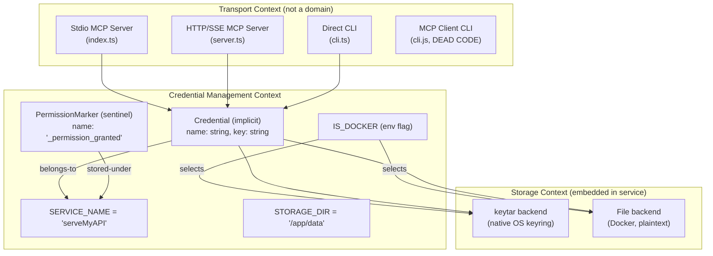

# Pass 8: Deep Synthesis -- serveMyAPI

> Definitive reference document for Prism's understanding of serveMyAPI.
> Supersedes all prior pass outputs. Generated 2026-04-13.

---

## 1. Executive Summary

ServeMyAPI is a ~915-line TypeScript MCP server that provides CRUD operations (store, get, delete, list) for API key management using the OS keyring via the `keytar` npm package. It serves as foundational credential infrastructure for 5-6 other MCP servers in the author's ecosystem, supplying API keys for services like Brave Search, Google Search, Neon, LeonardoAI, and AgentQL. The architecture is a simple 3-layer design (transport, service, storage) with a single core service class (`KeychainService`) that dispatches between native OS keyring access (macOS Keychain, Windows Credential Vault, Linux libsecret) and a plaintext file-based Docker fallback. The codebase has zero tests, significant code duplication (tool definitions exist in three locations), a confirmed path traversal vulnerability in Docker mode, and multiple broken deployment modes (3 of 4 have known bugs). Despite these quality gaps, the core behavioral intent -- abstract OS keyring CRUD behind an MCP interface -- is sound and directly applicable to Prism.

---

## 2. Complete Feature Set

### 2.1 Core Features (Implemented and Working)

| Feature | Implementation | Status |
|---------|---------------|--------|
| Store credential | `KeychainService.storeKey()` -> `keytar.setPassword()` | Working (native) |
| Retrieve credential | `KeychainService.getKey()` -> `keytar.getPassword()` | Working (native) |
| Delete credential | `KeychainService.deleteKey()` -> `keytar.deletePassword()` | Working (native) |
| List credentials | `KeychainService.listKeys()` -> `keytar.findCredentials()` | Working (native) |
| MCP stdio transport | `index.ts` via `StdioServerTransport` | Working |
| Direct CLI | `cli.ts` via process.argv parsing | Working |
| macOS Keychain permission pre-auth | Permission marker sentinel credential | Working |
| Docker file-based fallback | `DOCKER_ENV=true` triggers filesystem storage | Working (with security issues) |

### 2.2 Features with Known Bugs

| Feature | Bug | Severity |
|---------|-----|----------|
| MCP HTTP/SSE transport | `Date.now()` session IDs collide; messages route to last-connected client only | HIGH |
| Docker HEALTHCHECK | Checks HTTP on a stdio-only server; always fails | MEDIUM |
| macOS DMG packaging | Launcher references `main.js` instead of `dist/index.js` | HIGH (non-functional) |
| MCP client CLI (`cli.js`) | Spawns `server.js` (HTTP) instead of `index.js` (stdio); hangs forever | HIGH (dead code) |

### 2.3 Missing Features (Relevant to Prism)

| Feature | Gap | Priority for Prism |
|---------|-----|-------------------|
| Credential metadata | No timestamps, descriptions, tags, TTL | HIGH |
| Access control | Any connected client can read all keys | HIGH |
| Audit trail | No logging of credential access events | HIGH |
| Input sanitization | Path traversal vulnerability in Docker mode | HIGH |
| Encrypted file fallback | Docker stores credentials as plaintext | HIGH |
| Multi-namespace support | Single hardcoded `serveMyAPI` namespace | MEDIUM |
| Graceful shutdown | No SIGTERM/SIGINT handling | MEDIUM |
| Test coverage | Zero tests; `npm test` is a placeholder | MEDIUM |
| Structured logging | `console.error` only, no log levels | LOW |
| Create vs. update distinction | Store silently overwrites existing credentials | LOW |

---

## 3. Bounded Context Map



The system has a single bounded context: **Credential Management**. The MCP protocol is a transport concern, not a domain boundary. There are no domain events, no inter-context relationships, and no external system integrations beyond the OS keyring.

**Entities:** 5 (Credential implicit, PermissionMarker sentinel, McpServer instance, McpClient instance, SSESession ephemeral)

**Value Objects:** 8 (SERVICE_NAME, PERMISSION_MARKER, STORAGE_DIR, IS_DOCKER, MCP Response Shape, Port, SSE Session ID, App Bundle Identity)

**State Machines:** 3 (Credential lifecycle: NonExistent <-> Exists; Permission marker: Unchecked -> Checking -> Authorized; SSE session: Created -> Active -> Disconnected)

---

## 4. Behavioral Contract Summary

**Total contracts extracted:** 34 (33 from code analysis + 1 from coverage audit)
**Test-backed contracts:** 0 (zero test coverage)
**Confidence ceiling:** MEDIUM (all code-inferred)

### 4.1 Core CRUD Contracts

| ID | Contract | Key Behavior |
|----|----------|-------------|
| BC-2.01.001 | storeKey (keytar) | `keytar.setPassword('serveMyAPI', name, key)` -- silently overwrites |
| BC-2.01.002 | getKey (keytar) | Returns `string` or `null`; raw secret in cleartext |
| BC-2.01.003 | deleteKey (keytar) | Returns `true` (deleted) or `false` (not found); no error on miss |
| BC-2.01.004 | listKeys (keytar) | `findCredentials` -> filter out `_permission_granted` -> `string[]` |
| BC-2.02.001 | storeKeyFile (Docker) | `writeFileSync` to `${STORAGE_DIR}/${name}.key` -- PATH TRAVERSAL VULN |
| BC-2.02.002 | getKeyFile (Docker) | `readFileSync` or `null`; errors swallowed (returns null) |
| BC-2.02.003 | deleteKeyFile (Docker) | `unlinkSync` or false; errors swallowed (returns false) |
| BC-2.02.004 | listKeyFiles (Docker) | `readdirSync` + filter `.key` suffix; errors swallowed (returns []) |

### 4.2 Critical Behavioral Observations

1. **Error swallowing asymmetry (OBS-3.03):** Keytar backend propagates all errors to callers. File backend swallows errors on get/delete/list (returns null/false/[]), making storage failures indistinguishable from "not found." Only store re-throws.

2. **Async constructor race window (BC-2.03.001):** `checkPermissionMarker()` is async but called from a synchronous constructor without `await`. The race is benign due to idempotency, but the pattern is fragile.

3. **Falsy check on get (BC-3.01.002):** `if (!key)` treats null, undefined, and empty string as "not found." Empty strings cannot be stored via MCP (Zod `min(1)`) but could exist if stored via CLI or another app sharing the namespace.

4. **Validation gap (OBS-3.02):** MCP tools enforce `z.string().min(1)`. The direct CLI (`cli.ts`) only checks truthiness -- no minimum length validation. Zod is bypassed entirely on the CLI path.

5. **cli.js is non-functional (OBS-3.05):** Spawns `server.js` (HTTP variant) instead of `index.js` (stdio variant). The HTTP server never connects to stdio transport, so the MCP client hangs indefinitely.

---

## 5. Architecture Decision Record

### ADR-001: OS Keyring as Primary Storage

**Decision:** Use `keytar` npm package to delegate credential storage to the OS keyring.

**Context:** Credentials need encryption at rest without managing encryption keys at the application level.

**Consequences:**
- (+) AES-256 encryption on macOS (Secure Enclave on Apple Silicon), DPAPI on Windows, libsecret on Linux
- (+) No application-level key management
- (-) Not available in containers or headless Linux without a desktop environment
- (-) `findCredentials` has no equivalent in `keyring-rs` (Rust); requires maintaining a separate index

### ADR-002: File-Based Docker Fallback

**Decision:** When `DOCKER_ENV=true`, store credentials as plaintext `*.key` files in `STORAGE_DIR`.

**Context:** Docker containers lack OS keyring access.

**Consequences:**
- (+) Simple, works everywhere
- (-) No encryption at rest; `chmod 777` on storage directory
- (-) Path traversal vulnerability (unsanitized key names used as filenames)
- (-) Container runs as root (no `USER` directive)

### ADR-003: Singleton Service Pattern

**Decision:** Export `KeychainService` as a pre-instantiated singleton default export.

**Context:** All transports need to share the permission marker state.

**Consequences:**
- (+) Simple shared state across entry points
- (-) Constructor runs at module load with async side effect (fire-and-forget)
- (-) Not testable without module-level mocking

### ADR-004: Duplicated Tool Definitions

**Decision:** (Implicit -- not a deliberate choice) Copy-paste tool registrations across `index.ts`, `server.ts`, and `smithery.yaml`.

**Context:** No shared tool module was created.

**Consequences:**
- (-) Triple maintenance burden
- (-) Drift risk between MCP tool schemas and Smithery schemas
- (-) No single source of truth for tool behavior

### ADR-005: Permission Marker as Sentinel Credential

**Decision:** Store `_permission_granted` as a real keytar credential to consolidate macOS Keychain permission prompts.

**Context:** macOS prompts users for Keychain access on first use per application.

**Consequences:**
- (+) Permission dialog appears once at startup, not on first real operation
- (-) Pollutes the credential namespace (must be filtered from list results)
- (-) Marker is accessible via `getKey('_permission_granted')` returning `'true'`

---

## 6. Anti-Pattern Catalog

| # | Anti-Pattern | Location | Severity | Impact |
|---|-------------|----------|----------|--------|
| ANTI-001 | Triple tool definition duplication | index.ts, server.ts, smithery.yaml | HIGH | Any tool change requires 3 updates; drift risk |
| ANTI-002 | Sync I/O in async service methods | keychain.ts file backend | LOW | Event loop blocking (negligible for stdio, minor for HTTP) |
| ANTI-003 | Unsafe `(error as Error).message` cast | index.ts, server.ts (8 instances) | MEDIUM | Non-Error throws produce "Error: undefined" |
| ANTI-004 | Dead code (.js file in TS project) | src/cli.js | LOW | Confusion; name collision with cli.ts build output |
| ANTI-005 | README documents non-functional workflow | README.md | LOW | User confusion |
| AP-3 | Async fire-and-forget in constructor | keychain.ts:18-25 | LOW | Benign race; fragile pattern |
| AP-7 | SSE session ID via `Date.now()` | server.ts:160 | HIGH | Session collision and misrouting |
| AP-8 | HEALTHCHECK protocol mismatch | Dockerfile:26-27 | MEDIUM | Container always reports unhealthy |
| AP-9 | Unused keytar import | index.ts:5 | LOW | Dead import |
| AP-10 | No graceful shutdown | All entry points | MEDIUM | Resource leaks; unclean container stop |

---

## 7. Complexity Ranking

Ranked by implementation complexity for Prism (1 = simplest, 10 = most complex):

| Rank | Component | Complexity | Why |
|------|-----------|------------|-----|
| 1 | MCP tool registration (store/get/delete/list) | LOW | Formulaic: name + schema + handler. Macro-able in Rust. |
| 2 | Credential CRUD (native keyring) | LOW | 4 functions wrapping `keyring-rs::Entry` methods |
| 3 | Direct CLI | LOW | Argument parsing + service calls |
| 4 | Permission marker / keyring probe | LOW-MEDIUM | One-time initialization check; Rust can do a probe read |
| 5 | Stdio MCP transport | LOW-MEDIUM | MCP SDK handles protocol; just wire tools to transport |
| 6 | File-based fallback (encrypted) | MEDIUM | Prism must add encryption (serveMyAPI lacks it) |
| 7 | Credential metadata system | MEDIUM | Not in serveMyAPI; Prism must design from scratch |
| 8 | `findCredentials` equivalent | MEDIUM | `keyring-rs` lacks enumeration; requires a name index |
| 9 | HTTP/SSE transport (done correctly) | MEDIUM-HIGH | serveMyAPI's is broken; Prism needs proper session management |
| 10 | Multi-client access control | HIGH | Not in serveMyAPI; Prism must design from scratch |

---

## 8. Convergence Report

### 8.1 Rounds Per Pass

| Pass | Broad | R1 | R2 | Novelty at R2 | Total Rounds |
|------|-------|----|----|---------------|--------------|
| 0: Inventory | 1 | 1 | 1 | NITPICK | 3 |
| 1: Architecture | 1 | 1 | 1 | NITPICK | 3 |
| 2: Domain Model | 1 | 1 | 1 | NITPICK | 3 |
| 3: Behavioral Contracts | 1 | 1 | 1 | SUBSTANTIVE (converged by exhaustion) | 3 |
| 4: NFR Catalog | 1 | 1 | 1 | NITPICK | 3 |
| 5: Conventions | 1 | 1 | 1 | NITPICK | 3 |

All passes converged within 2 deepening rounds (minimum required). Pass 3 declared convergence after R2 with SUBSTANTIVE novelty because remaining unknowns were empirical (require execution, not reading).

### 8.2 Validation Results

- **Extraction accuracy:** 96% overall
- **Behavioral accuracy:** 100% (0 behavioral errors in sampled verification)
- **Metric accuracy:** 78% (systematic off-by-one on 6 file line counts; corrected post-validation)
- **Hallucinations detected:** 0
- **Coverage:** 22/22 files fully covered; 197/197 lines of core service contracted

### 8.3 Total Artifacts

| Metric | Count |
|--------|-------|
| Behavioral contracts | 34 |
| Entities | 5 |
| Value objects | 8 |
| State machines | 3 |
| Relationships | 5 |
| NFRs | 24 |
| Anti-patterns | 10 |
| Conventions | 7 |
| Patterns | 6 |
| Analysis files produced | 16 |

---

## 9. Lessons for Prism

### P0 -- Must-Have (Block Prism development if unaddressed)

**P0-1: Use `keyring-rs` as the cross-platform keyring crate.**
ServeMyAPI's entire value is the `keytar` abstraction: macOS Keychain, Windows Credential Manager, Linux libsecret behind a single API. The Rust equivalent is `keyring-rs`, which provides `Entry::new(service, user).set_password()` / `.get_password()` / `.delete_credential()`. This is a direct 1:1 mapping for store, get, and delete operations.

**P0-2: Solve the `findCredentials` gap with a credential index.**
`keyring-rs` has no `findCredentials` equivalent -- there is no cross-platform way to enumerate all credentials for a service. Prism MUST maintain its own index of stored credential names. Options:
- Store a JSON list as a special keyring entry (e.g., `Entry::new("prism", "__index__")`)
- Maintain a local metadata file (encrypted)
- Use platform-specific enumeration APIs (most complex, highest fidelity)

The first option mirrors serveMyAPI's permission marker pattern (using the keyring for metadata), but serialization/deserialization adds complexity. The second option is cleaner for Prism's multi-client MSSP use case.

**P0-3: Define a `CredentialStore` trait with pluggable backends.**
ServeMyAPI's `if (IS_DOCKER)` inline checks are an anti-pattern. Prism must define:
```rust
trait CredentialStore: Send + Sync {
    async fn store(&self, name: &str, secret: &str) -> Result<(), CredentialError>;
    async fn get(&self, name: &str) -> Result<Option<String>, CredentialError>;
    async fn delete(&self, name: &str) -> Result<bool, CredentialError>;
    async fn list(&self) -> Result<Vec<String>, CredentialError>;
}
```
With implementations:
- `KeyringStore` -- native OS keyring via `keyring-rs`
- `EncryptedFileStore` -- encrypted file-based fallback (for containers/headless)
- `MemoryStore` -- for testing

**P0-4: Sanitize credential names.**
ServeMyAPI has a confirmed path traversal vulnerability: key names are used directly as file paths in Docker mode with zero sanitization. Prism must:
- Restrict names to `[a-zA-Z0-9_.-]` or similar safe character set
- Alternatively, hash or percent-encode names before using them as file paths or keyring account names
- Validate at the service layer (not just the transport layer) to prevent bypass via CLI or direct API

**P0-5: Encrypt the file-based fallback.**
ServeMyAPI's Docker mode stores credentials as plaintext files with `chmod 777`. Prism must encrypt at rest using an encryption key derived from:
- An environment variable (e.g., `PRISM_MASTER_KEY`)
- A mounted secret file
- A KMS integration

Use AES-256-GCM with a key derivation function (Argon2id or HKDF). Never store plaintext secrets on disk.

### P1 -- Should-Have (Deferred risks Prism quality if skipped)

**P1-1: Define tools once, register on any transport.**
ServeMyAPI's worst maintenance debt is triple tool definition duplication (index.ts, server.ts, smithery.yaml). Prism should define tools as data structures (or via a macro) and register them on any MCP server transport. Example:

```rust
// Define once
fn credential_tools() -> Vec<Tool> { ... }

// Register on any transport
let server = McpServer::new("Prism", "1.0.0");
for tool in credential_tools() {
    server.register(tool);
}
```

**P1-2: Implement structured error types.**
ServeMyAPI uses string error messages ("Error storing API key: ..."). Prism should define:
```rust
enum CredentialError {
    NotFound { name: String },
    AlreadyExists { name: String },
    PermissionDenied { detail: String },
    StorageError { source: Box<dyn Error> },
    InvalidName { name: String, reason: String },
    KeyringUnavailable,
}
```
This eliminates the error swallowing asymmetry (OBS-3.03) where file backend errors are indistinguishable from "not found."

**P1-3: Add credential metadata.**
ServeMyAPI stores bare `(name, secret)` pairs. Prism should store:
```rust
struct CredentialMetadata {
    name: String,
    created_at: DateTime<Utc>,
    updated_at: DateTime<Utc>,
    description: Option<String>,
    client_id: Option<String>,  // which MSSP client owns this
    tags: Vec<String>,
    last_accessed_at: Option<DateTime<Utc>>,
}
```
The secret itself stays in the keyring; metadata can live in the credential index.

**P1-4: Implement an audit trail.**
ServeMyAPI has zero observability for credential access. For an MSSP managing client sensor credentials, this is unacceptable. Prism must log:
- Who accessed which credential (client identity)
- When (timestamp)
- What operation (store/get/delete/list)
- Success or failure
- Source transport (stdio/HTTP/CLI)

**P1-5: Handle the headless Linux keyring gap.**
On headless Linux (no desktop environment), `keytar` / `keyring-rs` will fail because no secret service is available. ServeMyAPI only falls back to file storage when `DOCKER_ENV=true` is explicitly set. Prism should detect keyring availability at runtime and automatically select the encrypted file backend when the native keyring is unavailable.

**P1-6: Probe the keyring at startup (macOS permission pattern).**
ServeMyAPI's permission marker trick consolidates macOS Keychain permission prompts into a single dialog at startup. Prism should implement a similar pattern: attempt a probe read/write at initialization to surface any OS permission dialogs immediately rather than failing on the first real credential operation.

### P2 -- Nice-to-Have (Improves Prism quality and UX)

**P2-1: Support create vs. update semantics.**
ServeMyAPI's store silently overwrites existing credentials. Prism could offer:
- `store` (create-or-update, current behavior)
- `create` (fail if exists)
- `update` (fail if not exists)

This prevents accidental overwrites in multi-client MSSP scenarios.

**P2-2: Multi-namespace support.**
ServeMyAPI uses a single hardcoded namespace (`serveMyAPI`). Prism should support configurable namespaces (e.g., per-client namespaces for MSSP isolation): `prism/client-a/sensor-key`, `prism/client-b/sensor-key`.

**P2-3: Add proper HTTP transport with TLS and auth.**
ServeMyAPI's HTTP/SSE server has zero authentication and broken session management. If Prism needs an HTTP transport, implement it with:
- TLS (required, not optional)
- Token-based authentication
- Proper session correlation (UUID session IDs, not `Date.now()`)
- Rate limiting

**P2-4: Implement graceful shutdown.**
Handle SIGTERM/SIGINT to drain active connections, flush any pending writes, and exit cleanly. Essential for container deployments where Docker sends SIGTERM before SIGKILL.

### P3 -- Future Consideration (Informed by serveMyAPI 2.0 vision)

**P3-1: Pre-signed URL pattern (from vision document).**
The serveMyAPI 2.0 vision proposes `generateSignedUrl()` instead of returning raw secrets. The key never leaves the vault; instead, a time-limited signed URL embeds the credential for use in HTTP requests. This pattern is worth evaluating for Prism if MCP clients should never see raw secrets.

**P3-2: Consider the `keyring-rs` `findCredentials` gap carefully.**
The `keyring-rs` crate does not support credential enumeration. Maintaining a separate index introduces consistency challenges (index and keyring can diverge). Prism should decide early whether the index is:
- Authoritative (keyring entries without index entries are orphans)
- Advisory (keyring is the source of truth; index is a cache)
- Bidirectional (sync on startup)

The choice affects error recovery, migration, and backup strategies.

**P3-3: Platform-specific keyring behavior differences.**
From the analysis:
- macOS Keychain: Persistent, hardware-backed (Secure Enclave on Apple Silicon), per-app ACL, may prompt user
- Windows Credential Manager: Persistent, DPAPI-protected, tied to user login
- Linux libsecret: Session-dependent, may not persist across reboots on some configurations, unavailable on headless systems

Prism should document and test these differences explicitly. The Linux headless case is particularly important for server deployments.

---

## Appendix A: keytar-to-keyring-rs API Mapping

| keytar (TypeScript) | keyring-rs (Rust) | Notes |
|--------------------|--------------------|-------|
| `setPassword(service, account, password)` | `Entry::new(service, account).set_password(password)?` | Direct mapping |
| `getPassword(service, account)` | `Entry::new(service, account).get_password()?` | Returns `Result<String>` not `Option`; `NoEntry` error = not found |
| `deletePassword(service, account)` | `Entry::new(service, account).delete_credential()?` | Returns `Result<()>` not `bool`; `NoEntry` error = not found |
| `findCredentials(service)` | **Not available** | Must maintain external index |

## Appendix B: MCP Tool Schema Reference

These are the exact tool schemas Prism should replicate (or extend):

| Tool | Parameters | Returns (success) | Returns (error) |
|------|-----------|-------------------|-----------------|
| `store-api-key` | `name: string (min 1)`, `key: string (min 1)` | `"Successfully stored API key with name: {name}"` | `isError: true`, error message |
| `get-api-key` | `name: string (min 1)` | Raw key value as plaintext | `isError: true`, `"No API key found with name: {name}"` |
| `delete-api-key` | `name: string (min 1)` | `"Successfully deleted API key with name: {name}"` | `isError: true`, `"No API key found with name: {name}"` |
| `list-api-keys` | (none) | `"Available API keys:\n{names}"` or `"No API keys found"` | `isError: true`, error message |

## Appendix C: Environment Variables

| Variable | Default | Purpose | Used By |
|----------|---------|---------|---------|
| `DOCKER_ENV` | (falsy) | Activates file-based storage backend | keychain.ts |
| `STORAGE_DIR` | `/app/data` | File backend storage root | keychain.ts |
| `PORT` | `3000` | HTTP/SSE server port | server.ts |
| `NODE_ENV` | (none) | Set by Smithery; never read by code | smithery.yaml (unused) |

---

## State Checkpoint

```yaml
pass: 8
status: complete
total_passes_synthesized: 6 (broad + 12 deepening rounds)
validation_passes: 2 (extraction validation + coverage audit)
files_in_source: 22
files_covered: 22/22 (100%)
behavioral_contracts: 34
entities: 5
value_objects: 8
nfrs: 24
anti_patterns: 10
extraction_accuracy: 96%
behavioral_accuracy: 100%
hallucinations: 0
timestamp: 2026-04-14T01:30:00Z
```
