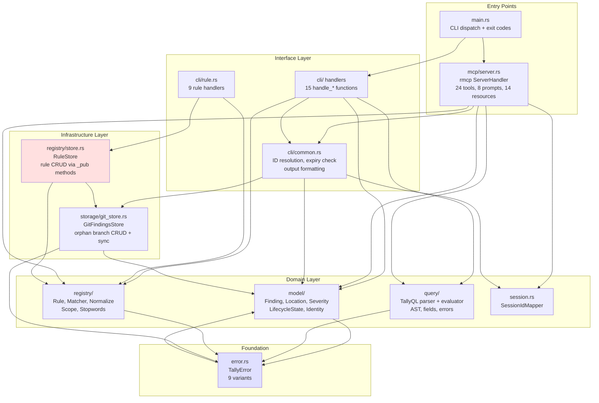

# Pass 1 Deep: Architecture -- Round 2

## Hallucination Audit

Reviewing Round 1 claims against source:

1. **to_mcp_err is a method on TallyMcpServer that maps variants:** INCORRECT. `to_mcp_err` is a free function (line 2689), NOT a method. It always returns `ErrorCode(-1)` (INTERNAL_ERROR) regardless of the error variant. The INVALID_REQUEST mapping is done inline in each tool method, not through `to_mcp_err`. This is a significant correction from both the broad sweep and R1.

2. **registry/store.rs cross-layer dependency:** Confirmed. `store.rs:8` imports `use crate::storage::GitFindingsStore;`. This IS a domain-to-infrastructure dependency.

3. **error.rs imports LifecycleState:** Confirmed. Line 3: `use crate::model::state_machine::LifecycleState;`.

4. **MCP server is ~3300 lines:** Confirmed. `run_mcp_server()` starts at line 3285, so file is ~3298 lines.

5. **28 total commands (19+9):** Let me recount. Command enum variants: Init, Record, Query, Update, Suppress, RebuildIndex, RecordBatch, Export, Sync, Import, Stats, McpServer, Completions, UpdateFields, AddNote, ManageTags, McpCapabilities, Rule = 18. RuleCommand variants: Create, Get, List, Search, Reindex, Update, Delete, AddExample, Migrate = 9. Total: 18 + 9 = **27**, not 28. Corrected.

6. **anyhow error converted to TallyError::Io in main.rs:** Confirmed. Line 197: `.map_err(|e| tally_ng::error::TallyError::Io(std::io::Error::other(e.to_string())))`.

7. **fresh store per MCP call:** Confirmed. `store()` method at line 537 opens fresh `GitFindingsStore::open(&self.repo_path)`.

### Correction to R1: to_mcp_err Error Mapping

R1 stated: "The `to_mcp_err()` helper maps `TallyError` variants to `McpError`: InvalidTransition, InvalidSeverity, InvalidInput, NoLocation -> INVALID_REQUEST, everything else -> INTERNAL_ERROR"

**ACTUAL behavior (from source):**
- `to_mcp_err(e)` is a free function that ALWAYS returns `ErrorCode(-1)` (INTERNAL_ERROR) with `e.to_string()` as message
- `INVALID_REQUEST` is used in ~15 inline error constructions in tool methods, NOT through `to_mcp_err`
- Pattern: domain validation errors construct McpError inline; git/serialization errors go through to_mcp_err

This means the error mapping is NOT centralized -- it's distributed across tool methods.

## Threading/Concurrency Model (New)

### Tokio Runtime
- Created on demand in `main.rs:194`: `tokio::runtime::Runtime::new()`
- Features: `rt-multi-thread` (work-stealing scheduler), `io-std`, `macros`
- Only created when `Command::McpServer` is matched -- CLI commands are fully synchronous

### MCP Server Concurrency
- `TallyMcpServer` implements `Clone` (required by rmcp)
- `tool_router` and `prompt_router` are also Clone
- Each MCP request potentially runs on a different Tokio worker thread
- All git2 operations inside tool methods are synchronous (blocking the Tokio thread)

**Critical insight:** Because git2::Repository is not Send/Sync, and because each tool method opens its own Repository, there is natural per-request isolation. Two concurrent tool calls will each open independent Repository handles. git2 handles file locking internally (ref locks), so concurrent writes are safe but may encounter lock contention (handled by MAX_LOCK_RETRIES in sync).

### No spawn_blocking
Despite the CLAUDE.md rule "use spawn_blocking for CPU-intensive work," the MCP server does NOT use `spawn_blocking` for git operations. All git2 calls (open, load_all, save_finding) run directly inside async methods, blocking the Tokio worker thread. For short operations this is acceptable; for load_all with many findings it could starve the thread pool.

## Sync Algorithm (Complete)

The sync operation in `git_store.rs::sync()` follows this algorithm:

```
1. Verify local branch exists
2. Fetch remote branch
3. Check if remote branch exists (first push case: skip merge)
4. Compare local and remote commits:
   a. Same commit: no-op
   b. Local is ancestor of remote: fast-forward local to remote
   c. Remote is ancestor of local: local is ahead, just push
   d. Diverged: three-way merge
      i.   Find merge base
      ii.  Merge trees (base, local, remote)
      iii. If conflicts: try rule semantic merge (newer timestamp wins)
      iv.  If findings conflicts remain: error (unexpected)
      v.   Create merge commit with two parents
5. Push with retry (up to 3 attempts):
   a. On failure: sleep with exponential backoff (100ms, 200ms, 400ms)
   b. Re-fetch + attempt merge before retry
   c. After 3 failures: return auth error
```

**Rule conflict resolution:** When two branches modify the same rule file, `resolve_rule_conflicts()` loads both versions and keeps the one with the newer `updated_at` timestamp. This is a last-writer-wins semantic merge, not a structural merge.

## Data Flow Architecture (Refined)

### Recording a Finding (CLI)
```
CLI args -> RecordArgs struct -> handle_record()
  -> store.open(".")
  -> store.load_all() [for identity resolution]
  -> FindingIdentityResolver.build(findings)
  -> compute_fingerprint(location, rule_id)
  -> resolver.resolve(fingerprint, file, line, rule)
  -> match result:
     ExistingFinding -> append agent, save
     RelatedFinding -> create new, link, save
     NewFinding -> create new, save
  -> RuleMatcher.build(rules) -> matcher.resolve(rule_id)
  -> check_scope(rule, file) [advisory warning]
  -> output JSON {status, uuid, related_to?, scope_warning?}
```

### Recording a Finding (MCP)
```
JSON-RPC -> rmcp deserialize -> Parameters<RecordFindingInput>
  -> record_finding() [async]
  -> self.store()? [fresh git2 repo]
  -> [same identity/matching logic as CLI]
  -> Ok(CallToolResult::success(json))
```

### Query Flow
```
CLI/MCP filters -> load_all()
  -> check_expiry_and_reopen() [mutates suppressed findings]
  -> apply CLI filters (severity, status, file, rule, tag, etc.)
  -> parse TallyQL expression (if --filter provided)
  -> apply_filters(findings, filter_expr, since, before, agent, category, not_status, text)
  -> apply_sort(findings, sort_specs)
  -> truncate to limit
  -> format output (JSON/table/summary)
```

## Architecture Diagram (Mermaid, Refined)



Note: RSTORE (registry/store.rs) is highlighted because it crosses the domain/infrastructure boundary. ERR is highlighted because it has a reverse dependency on MODEL (for LifecycleState in error variants).

## Delta Summary
- New items added: Threading/concurrency model (Tokio on-demand, no spawn_blocking), complete sync algorithm (5-step with rule conflict resolution), data flow architecture (record + query paths), refined Mermaid diagram
- Existing items refined: to_mcp_err correction (free function, always INTERNAL_ERROR, not variant-aware), command count corrected (27 not 28)
- Remaining gaps: None significant

## Novelty Assessment
Novelty: NITPICK
The to_mcp_err correction is important for accuracy but doesn't change the architectural model. The sync algorithm was already described at high level in the broad sweep. The threading model confirms what was expected (sync-in-async without spawn_blocking). The data flow diagrams are refinements of the component catalog.

## Convergence Declaration
Pass 1 has converged -- the architecture is fully documented including layer boundaries, dependency directions, threading model, sync algorithm, and data flow paths. The to_mcp_err correction and command count fix are accuracy improvements, not new architectural discoveries.

## State Checkpoint
```yaml
pass: 1
round: 2
status: complete
files_scanned: 28
timestamp: 2026-04-14T00:45:00Z
novelty: NITPICK
```
