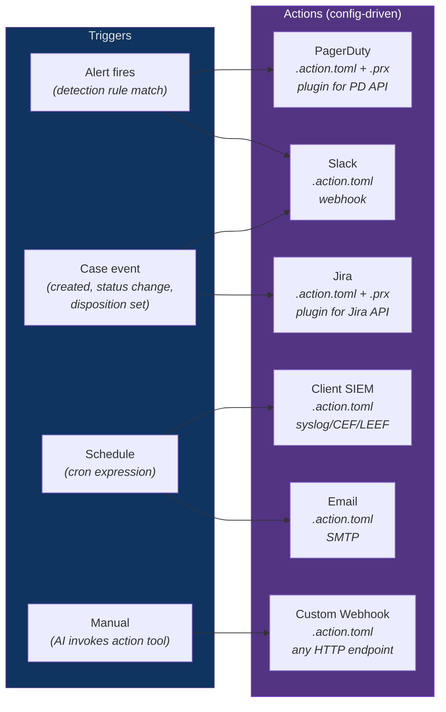
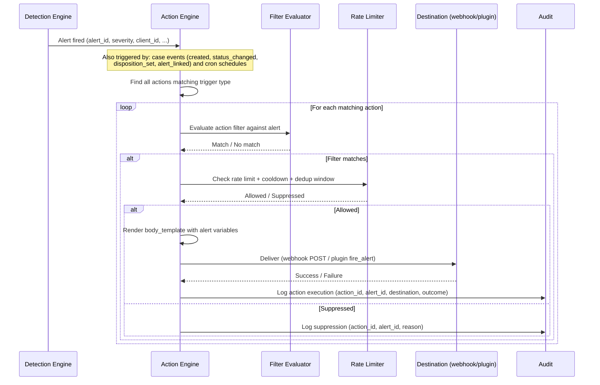
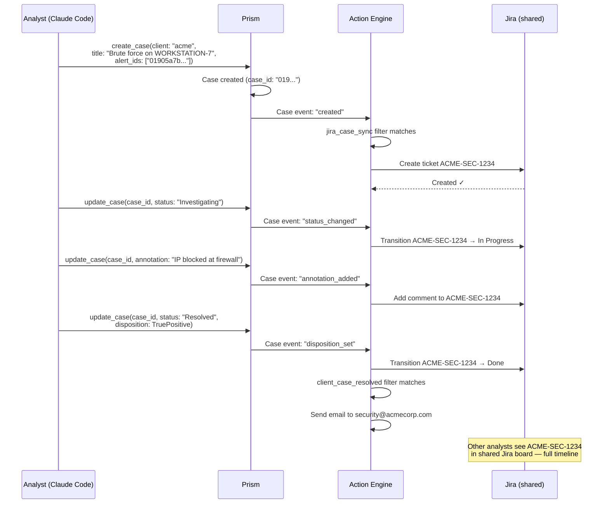

# Actions — Alert Delivery & Scheduled Reporting

## Overview

Actions are Prism's output system — they deliver alerts, notifications, and scheduled reports to external systems. Where sensors bring data IN, actions push results OUT. Where infusions enrich data during queries, actions react to events after detection.



## Design Principle: Same Two-Tier Pattern

Actions follow the same architecture as sensors and infusions:
- **Tier 1: No-Code** — `.action.toml` spec file with built-in destination types (webhook, email, syslog)
- **Tier 2: Plugin** — `.action.toml` + `.prx` WASM plugin for complex integrations (PagerDuty, Jira, ServiceNow, Teams)

Same file watching, same hot-reload, same WASM sandbox, same polyglot support, same AI-opaque credentials.

### Decision: Actions as Config-Driven Alert Delivery (AD-021)

**Status:** accepted
**Context:** When detection rules fire alerts, MSSPs need those alerts delivered to external systems — Slack, PagerDuty, Jira, email, client SIEMs. These destinations vary per client and per alert severity. The delivery mechanism must be declarative, per-client configurable, and not require Rust code changes.
**Decision:** Actions declared in `.action.toml` spec files with optional `.prx` WASM plugins. Three trigger modes: alert (event-driven), schedule (cron), manual (AI-invoked). Same two-tier TOML + plugin pattern as sensors and infusions.
**Rationale:** Reuses the proven spec engine, plugin runtime, file watcher, and credential model. Adding a new notification destination = drop a TOML file + optional .prx. Per-client overrides via client-scoped action config.

## Four Trigger Modes

| Mode | Fires when | Use case |
|------|-----------|----------|
| **Alert** | Detection rule produces an alert matching the action's filter | Real-time notification — Slack message, PagerDuty page |
| **Case** | Case lifecycle event matching the action's `case_events` filter | Jira ticket creation, ServiceNow incident, escalation workflows |

**Valid `case_events` values:** `created`, `status_changed`, `disposition_set`, `alert_linked`, `annotation_added`, `assignee_changed`. Each maps to a specific case mutation. Actions subscribe to a subset of these events.
| **Schedule** | Cron expression fires | Periodic reports — daily digest email, weekly compliance summary |
| **Manual** | AI agent invokes `fire_action` MCP tool | Ad-hoc delivery — "send this case summary to the client" |

## Action Spec Files

### Tier 1: No-Code (Built-in Destination Types)

#### Webhook Destination

```toml
# slack_soc.action.toml
[action]
action_id = "slack_soc_critical"
name = "SOC Slack — Critical Alerts"
trigger = "alert"
filter = 'severity_id >= 4'
clients = []                             # empty = all clients

[action.destination]
type = "webhook"
url = { source = "env", key = "SLACK_SOC_WEBHOOK_URL" }
method = "POST"
content_type = "application/json"
body_template = """
{
  "text": ":rotating_light: *${alert.severity}* alert for *${alert.client_name}*",
  "blocks": [
    {
      "type": "section",
      "text": { "type": "mrkdwn", "text": "*${alert.title}*\\n${alert.description}" }
    },
    {
      "type": "context",
      "elements": [
        { "type": "mrkdwn", "text": "Rule: ${alert.rule_name} | Sensor: ${alert.sensor} | Client: ${alert.client_name}" }
      ]
    }
  ]
}
"""

[action.rate_limit]
max_per_hour = 100
cooldown_seconds = 30                    # min time between fires for same rule×client
deduplicate_window = "5m"                # suppress duplicate alerts within window
```

#### Email Destination

```toml
# acme_daily_digest.action.toml
[action]
action_id = "acme_daily_digest"
name = "Acme Corp — Daily Security Digest"
trigger = "schedule"
schedule = "0 8 * * *"                   # 8 AM daily UTC
clients = ["acme"]

[action.destination]
type = "email"
smtp_host = { source = "env", key = "PRISM_SMTP_HOST" }
smtp_port = 587
smtp_username = { source = "env", key = "PRISM_SMTP_USER" }
smtp_password = { source = "env", key = "PRISM_SMTP_PASSWORD" }
from = "prism@1898co.com"
to = ["security@acmecorp.com", "soc-lead@1898co.com"]
subject_template = "Prism Security Digest — ${client_name} — ${date}"

[action.destination.report]
# The report content is generated by running PrismQL queries
queries = [
    { name = "critical_alerts", query = "SELECT * FROM prism_alerts WHERE severity_id >= 4 AND time > 24h", title = "Critical Alerts (Last 24h)" },
    { name = "new_detections", query = "SELECT _sensor, COUNT(*) AS total FROM EVENTS WHERE severity_id >= 3 AND time > 24h GROUP BY _sensor", title = "Detections by Sensor" },
    { name = "open_cases", query = "SELECT * FROM prism_cases WHERE status != 'Closed'", title = "Open Cases" },
]
format = "html"                          # html or markdown
template = "daily_digest"                # template in {config_dir}/templates/
```

#### Syslog Destination

```toml
# client_siem_forward.action.toml
[action]
action_id = "acme_siem_forward"
name = "Acme Corp — SIEM Forwarding"
trigger = "alert"
filter = 'severity_id >= 3'
clients = ["acme"]

[action.destination]
type = "syslog"
host = "siem.acmecorp.com"
port = 514
protocol = "tcp+tls"
format = "cef"                           # cef, leef, or json
tls_ca = { source = "file", path = "/etc/prism/certs/acme-ca.pem" }
```

#### Case-Triggered Actions

```toml
# jira_case_sync.action.toml
[action]
action_id = "jira_case_sync"
name = "Jira — Sync Cases to Tickets"
trigger = "case"
case_events = ["created", "status_changed", "disposition_set", "alert_linked", "annotation_added"]
clients = []                             # all clients

[action.destination]
type = "plugin"
plugin = "jira.prx"

[action.credentials]
jira_url = { source = "env", key = "JIRA_URL" }
jira_token = { source = "env", key = "JIRA_API_TOKEN" }

[action.plugin_config]
project_key_template = "${case.client_id}-SEC"
# On case created → create Jira ticket
# On status_changed → transition Jira ticket to matching status
# On disposition_set → add comment with disposition details
# On alert_linked → add comment with new alert summary
sync_mode = "bidirectional_status"       # Jira status changes sync back via webhook (future)
```

```toml
# escalation_to_management.action.toml
[action]
action_id = "escalation_critical_cases"
name = "Escalation — Critical Cases to Management"
trigger = "case"
case_events = ["created"]
filter = 'case.severity_id >= 5'         # critical cases only
clients = []

[action.destination]
type = "webhook"
url = { source = "env", key = "TEAMS_MANAGEMENT_WEBHOOK" }
method = "POST"
content_type = "application/json"
body_template = """
{
  "title": "Critical Case Escalation: ${case.title}",
  "text": "Client: ${case.client_name}\nSeverity: ${case.severity}\nAlerts: ${case.alert_count}\nAssignee: ${case.assignee}\n\nCase created at ${case.created_at}"
}
"""
```

```toml
# client_notification_resolved.action.toml
[action]
action_id = "client_case_resolved"
name = "Client Notification — Case Resolved"
trigger = "case"
case_events = ["disposition_set"]
filter = 'case.status = "Resolved"'

[action.destination]
type = "email"
smtp_host = { source = "env", key = "PRISM_SMTP_HOST" }
smtp_port = 587
smtp_username = { source = "env", key = "PRISM_SMTP_USER" }
smtp_password = { source = "env", key = "PRISM_SMTP_PASSWORD" }
from = "prism@1898co.com"
to_template = ["${case.client_contact_email}"]
subject_template = "Security Case Resolved — ${case.title}"

[action.destination.report]
queries = [
    { name = "case_detail", query = "SELECT * FROM prism_cases WHERE case_id = '${case.case_id}'", title = "Case Summary" },
    { name = "linked_alerts", query = "SELECT * FROM prism_alerts WHERE alert_id IN (${case.alert_ids_quoted})", title = "Related Alerts" },
]
format = "html"
template = "case_resolution"
```

### Tier 2: Plugin (Complex Integrations)

```toml
# pagerduty_oncall.action.toml
[action]
action_id = "pagerduty_critical"
name = "PagerDuty — Critical Escalation"
trigger = "alert"
filter = 'severity_id >= 5'
clients = []                             # all clients

[action.destination]
type = "plugin"
plugin = "pagerduty.prx"

[action.credentials]
routing_key = { source = "env", key = "PAGERDUTY_ROUTING_KEY" }

[action.plugin_config]
severity_mapping = "critical=critical,high=error,medium=warning"
dedup_key_template = "${alert.rule_id}:${alert.client_id}"
```

```toml
# jira_tickets.action.toml
[action]
action_id = "jira_auto_ticket"
name = "Jira — Auto-Create Tickets for Critical Alerts"
trigger = "alert"
filter = 'severity_id >= 4'
clients = ["acme", "globex"]

[action.destination]
type = "plugin"
plugin = "jira.prx"

[action.credentials]
jira_url = { source = "env", key = "JIRA_URL" }
jira_token = { source = "env", key = "JIRA_API_TOKEN" }

[action.plugin_config]
project_key_template = "${alert.client_id}-SEC"
issue_type = "Bug"
priority_mapping = "critical=Highest,high=High,medium=Medium"
summary_template = "[Prism] ${alert.title}"
description_template = "${alert.description}\n\nRule: ${alert.rule_name}\nSensor: ${alert.sensor}\nClient: ${alert.client_name}"
labels = ["prism-alert", "auto-created"]
```

## Action Plugin WIT Interface

```wit
// prism-action-plugin.wit
package prism:action-plugin@0.1.0;

interface action {
    /// Alert context passed to the plugin
    record alert-context {
        alert-id: string,
        rule-id: string,
        rule-name: string,
        client-id: string,
        client-name: string,
        severity: string,
        title: string,
        description: string,
        sensor: string,
        source-table: string,
        matched-events-json: string,      // JSON array of EventSnapshot
        created-at: string,               // ISO 8601
    }

    /// Report context for scheduled actions
    record report-context {
        action-id: string,
        client-id: string,
        client-name: string,
        query-results-json: string,       // JSON object with query name → results
        generated-at: string,
    }

    /// Case context passed to the plugin
    record case-context {
        case-id: string,
        title: string,
        status: string,
        previous-status: option<string>,
        severity: string,
        disposition: option<string>,
        assignee: option<string>,
        client-id: string,
        client-name: string,
        alert-count: u32,
        alert-ids-json: string,           // JSON array of alert IDs
        created-at: string,
        event-type: string,               // "created", "status_changed", "disposition_set", "alert_linked", "annotation_added", "assignee_changed"
        client-contact-email: option<string>, // From prism.toml [clients.{id}].contact_email
        mttd: option<string>,
        mttr: option<string>,
    }

    /// Execute action for an alert trigger
    fire-alert: func(ctx: alert-context) -> result<action-result, action-error>;

    /// Execute action for a case trigger
    fire-case: func(ctx: case-context) -> result<action-result, action-error>;

    /// Execute action for a schedule trigger
    fire-report: func(ctx: report-context) -> result<action-result, action-error>;

    record action-result {
        success: bool,
        external-id: option<string>,      // e.g., Jira ticket key "ACME-SEC-1234"
        message: option<string>,
    }

    record action-error {
        code: string,
        message: string,
        retryable: bool,
    }

    name: func() -> string;
    version: func() -> string;
}

/// Same host interface as sensor and infusion plugins
interface host {
    record http-header { name: string, value: string }
    record http-response { status: u16, headers: list<http-header>, body: string }

    http-request: func(method: string, url: string, headers: list<http-header>, body: option<string>) -> http-response;
    log: func(level: log-level, message: string);
    get-config: func(key: string) -> option<string>;
    enum log-level { trace, debug, info, warn, error }
}
```

## Action Execution Pipeline



## Case-to-Jira Lifecycle Example

This shows how case-triggered actions bridge Prism's per-analyst local cases to a shared Jira board:



## Per-Client Action Overrides

Actions can be scoped globally or per-client. Per-client overrides allow different notification destinations for different MSSP clients:

```toml
# Global action — all clients get Slack notification
# slack_all.action.toml
[action]
action_id = "slack_all_critical"
trigger = "alert"
filter = 'severity_id >= 4'
clients = []                             # all clients

# Per-client override — Acme also gets PagerDuty
# acme_pagerduty.action.toml
[action]
action_id = "acme_pagerduty"
trigger = "alert"
filter = 'severity_id >= 5'
clients = ["acme"]                       # Acme only
```

Both fire independently — Acme gets both Slack (from global) and PagerDuty (from client-specific). There is no override/suppression between actions — they are additive.

## Template Variables

All action templates have access to these variables:

| Variable | Available in | Description |
|----------|-------------|-------------|
| `${alert.alert_id}` | Alert trigger | UUID v7 of the alert |
| `${alert.rule_id}` | Alert trigger | Detection rule that fired |
| `${alert.rule_name}` | Alert trigger | Human-readable rule name |
| `${alert.severity}` | Alert trigger | Severity level (critical, high, etc.) |
| `${alert.title}` | Alert trigger | Rendered alert title |
| `${alert.description}` | Alert trigger | Rendered alert description |
| `${alert.client_id}` | Alert trigger | Client identifier |
| `${alert.client_name}` | Alert trigger | Human-readable client name |
| `${alert.sensor}` | Alert trigger | Source sensor |
| `${alert.source_table}` | Alert trigger | Source table |
| `${alert.created_at}` | Alert trigger | ISO 8601 timestamp |
| `${alert.matched_events}` | Alert trigger | JSON array of EventSnapshots |
| `${case.case_id}` | Case trigger | UUID v7 of the case |
| `${case.title}` | Case trigger | Case title |
| `${case.status}` | Case trigger | Current status (New, Acknowledged, etc.) |
| `${case.previous_status}` | Case trigger (status_changed) | Previous status before transition |
| `${case.severity}` | Case trigger | Severity level |
| `${case.disposition}` | Case trigger (disposition_set) | Disposition (TruePositive, FalsePositive, etc.) |
| `${case.assignee}` | Case trigger | Analyst assigned to the case |
| `${case.client_id}` | Case trigger | Client identifier |
| `${case.client_name}` | Case trigger | Human-readable client name |
| `${case.alert_count}` | Case trigger | Number of linked alerts |
| `${case.alert_ids_quoted}` | Case trigger | Comma-separated quoted alert IDs (for PrismQL IN clause). **Safety: values are always UUID v7 strings** generated internally. Validated as UUID v7 format by `TemplateInterpolator` before interpolation — non-UUID values are dropped with WARN log. Empty IN clause after validation returns empty result set, not an error. Not populated from external/sensor data. |
| `${case.created_at}` | Case trigger | ISO 8601 timestamp |
| `${case.mttd}` | Case trigger | Mean Time to Detect (if computed) |
| `${case.mttr}` | Case trigger | Mean Time to Respond (if resolved) |
| `${case.event}` | Case trigger | Event type that triggered the action (created, status_changed, etc.) |
| `${case.client_contact_email}` | Case trigger | Client contact email from prism.toml `[clients.{id}].contact_email` |
| `${client_name}` | All triggers | Client name (for scheduled/manual) |
| `${client_id}` | All triggers | Client ID |
| `${date}` | Schedule trigger | Current date (YYYY-MM-DD) |
| `${prism_version}` | All triggers | Prism version string |

Template rendering uses the same variable interpolation engine as detection alert templates. Values from sensor data inherit `trust_level: "untrusted_external"` — injection scanning runs on all interpolated values.

## MCP Tools for Actions

| Tool | Type | Parameters | Description |
|------|------|-----------|-------------|
| `list_actions` | Always-visible | client_id (optional) | List configured actions with status, trigger type, last fired |
| `action_status` | Always-visible | action_id | Detailed status: last fire time, success/failure count, rate limit state, suppressed count |
| `fire_action` | Capability-gated (`action.write`) | action_id, context (JSON) | Manually trigger an action with custom context |
| `test_action` | Capability-gated (`action.write`) | action_id | Send a test payload to validate destination connectivity |

## Rate Limiting & Delivery Guarantees

**Rate limiting** (per action):
- `max_per_hour` — Hard cap on deliveries per hour (default 100)
- `cooldown_seconds` — Minimum time between fires for the same `(rule_id, client_id)` pair (default 30)
- `deduplicate_window` — Suppress duplicate alerts within this window (default 5m)

**Delivery guarantees:**
- **At-least-once for alert triggers.** Failed deliveries are retried with exponential backoff (2s base, 60s max, 5 attempts). After max retries, the failure is logged to audit and the alert remains in RocksDB (not lost).
- **Best-effort for schedule triggers.** If a scheduled report fails to deliver, it is retried on the next schedule tick. No catch-up for missed windows.

**Scheduled action report queries** execute through `QueryEngine::execute()` with the following constraints:

- **Semaphore:** The ActionEngine acquires the 16-permit schedule semaphore via `try_acquire()` before executing each report query. If no permit is available, the report delivery is skipped for that cron tick (best-effort, retried next tick). This ensures action report queries compete fairly with detection scheduled queries for the concurrency budget.
- **Dirty bits:** Action report queries are wrapped with dirty bit set/clear (same as ad-hoc queries in `execute()`), enabling crash recovery and denylist for report queries that repeatedly OOM.
- **Memory:** 200 MB per-query budget (same `GreedyMemoryPool` as ad-hoc queries).
- **Timeout:** 30-second query timeout per individual report query.
- **Partial failure:** If a single report query fails (timeout, memory, sensor error), that section of the report is omitted with an error note — other sections still execute. The report is delivered with partial content rather than failing entirely.
- **Cron tick granularity:** The ActionEngine checks cron expressions on a 1-second tick interval (independent from the detection scheduler's tick). Cron-triggered actions fire within 1 second of the scheduled time.
- **Fire-and-forget for manual triggers.** Success/failure returned immediately to the AI agent.

**Delivery state** is tracked in RocksDB `action_state` column family (matching data-layer.md `StorageDomain::ActionState`):

| Key | Value | Purpose |
|-----|-------|---------|
| `{action_id}:last_fired` | Timestamp | Rate limit enforcement |
| `{action_id}:fire_count:{hour}` | Counter | Hourly rate cap |
| `{action_id}:dedup:{hash}` | Timestamp | Deduplication window |
| `{action_id}:retry:{alert_id}` | Retry state | Pending retries with backoff |

## Built-In Destination Types

| Type | Configuration | Use case |
|------|--------------|----------|
| `webhook` | URL, method, headers, body template | Slack, Teams, Discord, custom endpoints |
| `email` | SMTP host/port/credentials, to/from/subject/body | Client reports, daily digests |
| `syslog` | Host, port, protocol (UDP/TCP/TLS), format (CEF/LEEF/JSON) | Client SIEM forwarding |
| `plugin` | `.prx` WASM plugin | PagerDuty, Jira, ServiceNow, OpsGenie, custom |

## File Organization

```
config/
  sensors/                  # Data IN
    crowdstrike.sensor.toml
    armis.sensor.toml
  infusions/                # Data ENRICHMENT
    geoip.infusion.toml
    threat_intel.infusion.toml
  actions/                  # Data OUT
    slack_soc.action.toml
    pagerduty_oncall.action.toml
    acme_daily_digest.action.toml
    acme_siem_forward.action.toml
    jira_tickets.action.toml
  plugins/                  # WASM plugins (shared across all types)
    threat_intel.prx
    pagerduty.prx
    jira.prx
  ioc/
    known_bad_ips.ioc
  data/
    GeoLite2-City.mmdb
    asset_inventory.csv
  templates/
    daily_digest.html       # Email report template
  prism.toml
  aliases.toml
```

## Hot Reload

Actions participate in the same filesystem watching system (AD-018):

- **Watch path:** `{config_dir}/actions/*.action.toml`
- **On change:** Re-validate, re-register action triggers, swap via arc-swap
- **In-flight deliveries:** Complete using the old action config; next trigger uses new config
- **Plugin reload:** `.prx` changes in `plugins/` directory trigger plugin swap (same as sensors/infusions)

## Security

- Action plugins run in the same WASM sandbox as sensor and infusion plugins (AD-019)
- Destination credentials use AI-opaque credential model (AD-017) — referenced in `[action.credentials]`, never values
- Alert data in action templates inherits `trust_level: "untrusted_external"` — injection scanning on all interpolated values
- All action executions (success and failure) are audit-logged
- `fire_action` MCP tool is capability-gated behind `action.write`
